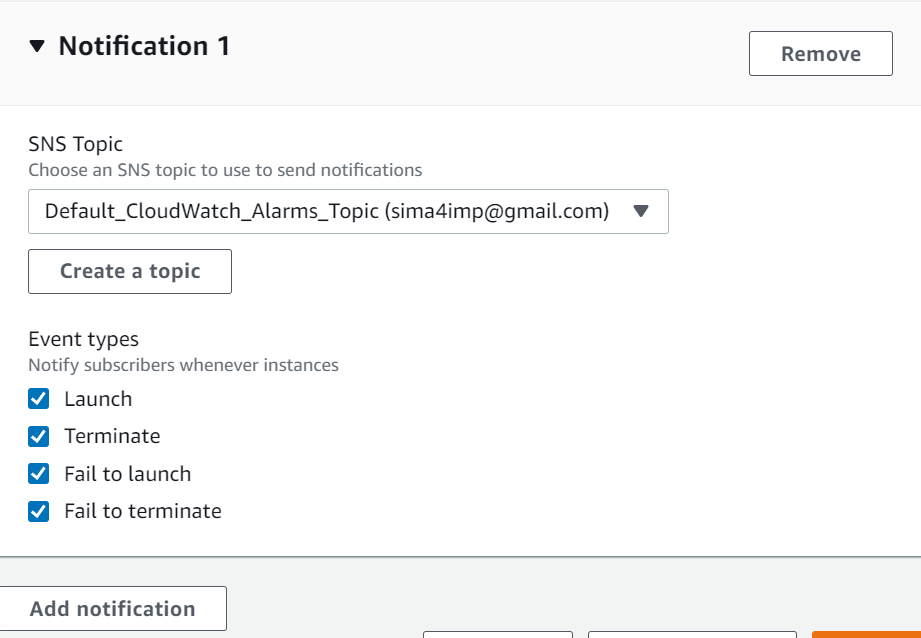
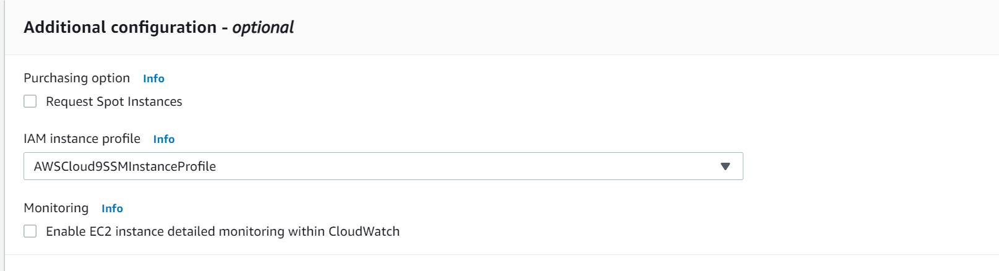
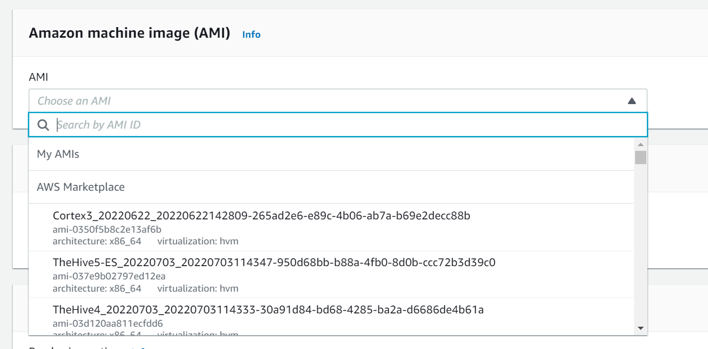
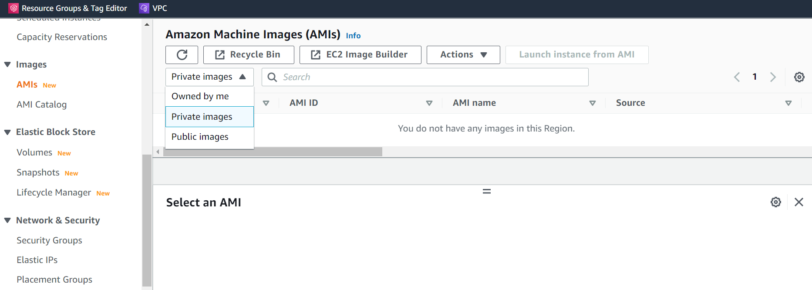
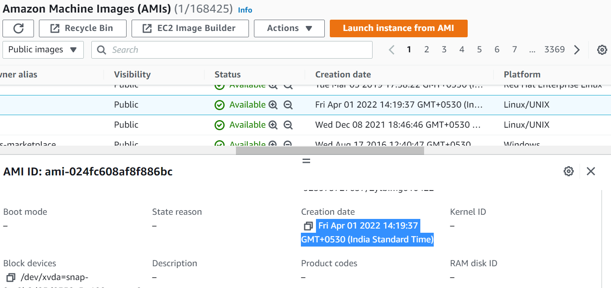
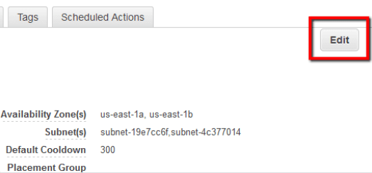
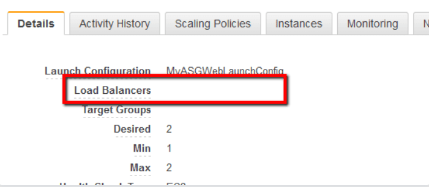
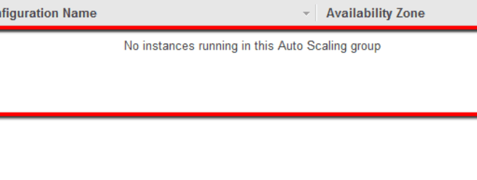

<!-- omit in toc -->
# AWS Auto Scaling - Security Baseline Requirement
<!-- omit in toc -->
## Baseline security configuration requirement for AWS services ###
---


Summary of changes: 
1. Added new controls
2. Updated the security control mappings
4. Added implementation link in 'How' section
5. Added implementation steps in 'How' section

**Generated By: EY Security Team**

**Service Type: Management & Governance**

**Deployment Phase: Service Discovery** 

**Last Update: 05/25/2022**

## Table of Contents  <!-- omit in toc -->
<!-- TOC -->
- [Overview](#overview)
  - [Use Case Examples:](#use-case-examples)
- [Cloud Security Requirements](#cloud-security-requirements)
  - [1. Ensure AWS Auto Scaling utilizes VPC endpoints to prevent public access](#1-ensure-aws-auto-scaling-utilizes-vpc-endpoints-to-prevent-public-access)
  - [2. Ensure AWS Auto Scaling users and roles are following least privilege model](#2-ensure-aws-auto-scaling-users-and-roles-are-following-least-privilege-model)
  - [3. Ensure AWS Auto Scaling Groups are configured to send email notifications](#3-ensure-aws-auto-scaling-groups-are-configured-to-send-email-notifications)
  - [4. Ensure an agent for AWS CloudWatch Logs is installed within Auto Scaling Group](#4-ensure-an-agent-for-aws-cloudwatch-logs-is-installed-within-auto-scaling-group)
  - [5. Ensure IAM roles is used for ASG launch configurations](#5-ensure-iam-roles-is-used-for-asg-launch-configurations)
  - [6. Ensure to use organization approved AMIs for ASG launch configurations](#6-ensure-to-use-organization-approved-amis-for-asg-launch-configurations)
  - [7. Ensure AWS Auto Scaling Groups do not launch EC2 instance AMI that was provisioned more than 30 days ago](#7-ensure-aws-auto-scaling-groups-do-not-launch-ec2-instance-ami-that-was-provisioned-more-than-30-days-ago)
  - [8. Ensure AWS Auto Scaling Group does not launch IMDSv1 (Instance Metadata Service v1)](#8-ensure-aws-auto-scaling-group-does-not-launch-imdsv1-instance-metadata-service-v1)
  - [9. Ensure AWS Auto Scaling Group is using the appropriate health check configuration](#9-ensure-aws-auto-scaling-group-is-using-the-appropriate-health-check-configuration)
  - [10. Ensure empty AWS Auto Scaling Groups (ASGs) are removed](#10-ensure-empty-aws-auto-scaling-groups-asgs-are-removed)
  - [11. Ensure unused AWS Auto Scaling Launch Configuration templates are removed.](#11-ensure-unused-aws-auto-scaling-launch-configuration-templates-are-removed)
  - [12. Ensure to enable Cloudtrail for AWS Auto Scaling](#12-ensure-to-enable-cloudtrail-for-aws-auto-scaling)
  - [13. Ensure AWS Auto Scaling uses standard organizational resource tagging method](#13-ensure-aws-auto-scaling-uses-standard-organizational-resource-tagging-method)
- [Endnotes](#endnotes)
  - [Resources](#resources)
  - [Glossary](#glossary)
<!-- /TOC -->

##  Overview
AWS Auto Scaling monitors applications and automatically adjusts capacity to maintain steady, predictable performance at the lowest possible cost. Using AWS Auto Scaling, it’s easy to setup application scaling for multiple resources across multiple services in minutes. The service provides a simple, powerful user interface that build scaling plans for resources including Amazon EC2 instances and Spot Fleets, Amazon ECS tasks, Amazon DynamoDB tables and indexes, and Amazon Aurora Replicas. AWS Auto Scaling makes scaling simple with recommendations that allow to optimize performance, costs, or balance between them. With AWS Auto Scaling, applications always have the right resources at the right time.


| Control Number | Cloud Baseline Security Requirements                                                                        |
| -------------- | ----------------------------------------------------------------------------------------------------------- |
| 1              | Ensure AWS Auto Scaling utilizes VPC endpoints to prevent public access                                     |
| 2              | Ensure AWS Auto Scaling users and roles are following least privilege model                                 |
| 3              | Ensure AWS Auto Scaling Groups are configured to send email notifications                                   |
| 4              | Ensure an agent for AWS CloudWatch Logs is installed within Auto Scaling Group                              |
| 5              | Ensure IAM roles is used for ASG launch configurations                                                      |
| 6              | Ensure to use organization approved AMIs for ASG launch configurations                                      |
| 7              | Ensure AWS Auto Scaling Groups do not launch EC2 instance AMI that was provisioned more than 30 days ago    |
| 8              | Ensure AWS Auto Scaling Group does not launch IMDSv1 (Instance Metadata Service v1)                         |
| 9              | Ensure AWS Auto Scaling Group is using the appropriate health check configuration                           |
| 10             | Ensure empty AWS Auto Scaling Groups (ASGs) are removed                                                     |
| 11             | Ensure unused AWS Auto Scaling Launch Configuration templates are removed                                   |
| 12             | Ensure to enable Cloudtrail for AWS Auto Scaling                                                            |
| 13             | Ensure AWS Auto Scaling uses standard organizational resource tagging method                                |

### Use Case Examples:
- Make smart scaling decision
- Automatically maintain performance 

## Cloud Security Requirements ##

### 1. Ensure AWS Auto Scaling utilizes VPC endpoints to prevent public access

**Security control mapping:** <br>

| Control Number | Control Statement | Security Domain | Default | Associated Runbook | CVSS Severity  |
| ------------------ | ------------| --------------- | ------- | ------------------ | -------------- |
| CS0012300  | Cloud products and services must be deployed on private subnets and public access must be disabled for these services| Network Security | Not Enabled | None | [Medium (6.5)](https://www.first.org/cvss/calculator/3.1#CVSS:3.1/AV:A/AC:H/PR:H/UI:R/S:C/C:H/I:L/A:L) |


**Why?** <br>

As per security best practice it is suggested to establish a private connection between VPC and AWS Auto Scaling by creating an interface VPC endpoint. Interface endpoints are powered by AWS PrivateLink, a technology that enables to privately access Auto Scaling APIs without an internet gateway, NAT device, VPN connection, or AWS Auto Scaling connection. Instances in  VPC don't need public IP addresses to communicate with AWS Auto Scaling APIs. Traffic between VPC and AWS Auto Scaling does not leave the Amazon network.

**How?** <br>

[This is updated in CG]
https://docs.aws.amazon.com/autoscaling/plans/userguide/scaling-plan-vpc-endpoints.html

<br><br>

### 2. Ensure AWS Auto Scaling users and roles are following least privilege model

**Security Control Mapping :**  <br>
| Control Number | Control Statement | Security Domain | Default | Associated Runbook | CVSS Severity  |
| -------------- | ----------------- | --------------- | ------- | ------------------ | -------------- |
| CS0012298 | Access to change cloud identity access and service control policies is restricted to authorized cloud administrative personnel |  Identity & Access Management | Not enabled |None | [Medium (6.8)](https://www.first.org/cvss/calculator/3.1#CVSS:3.1/AV:N/AC:H/PR:H/UI:R/S:C/C:L/I:L/A:H) |

**Why?** <br>

AWS Auto Scaling integrates with IAM which is an AWS service that helps an administrator securely control access to AWS resources. IAM administrators control who can be authenticated (signed in) and authorized (have permissions) to use AWS Auto Scaling resources. AWS Auto Scaling supports identity-based policies and service-linked roles. With IAM identity-based policies, you can specify allowed or denied actions and resources, and the conditions under which actions are allowed or denied. Amazon EC2 Auto Scaling supports specific actions, resources, and condition keys. Service-linked roles are predefined by AWS Auto Scaling and include all the permissions that AWS Auto Scaling requires to call other AWS services.

**Following are the suggested roles for AWS Auto Scaling** <br>
| Function | Description | Role | 
| -------------- | ----------------- | --------------- | 
| Network Admin | Responsible for configuring private endpoint for AWS Auto Scaling | Networkadmin |
| IAM Admin | This service-linked role is responsible to call other AWS services |AWSServiceRoleForAutoScaling|
| Security Engineer | Responsible to monitor and audit the logs |MonitoringPlatformAdmin|
| Security Analyst | Responsible for providing read only access | AnalyticsPlatformAdmin|

**How?** <br>

By default, a brand new IAM user has no permissions to do anything. An IAM administrator must create and assign IAM policies that give end users permission to perform Amazon EC2 Auto Scaling API actions.

The following shows an example of a permissions policy.
```JSON
{
   "Version": "2012-10-17",
   "Statement": [
   {
      "Effect": "Allow",
      "Action": [
          "autoscaling:CreateAutoScalingGroup",
          "autoscaling:UpdateAutoScalingGroup"
      ],
      "Resource": "arn:aws:autoscaling:region:123456789012:autoScalingGroup:7fe02b8e-7442-4c9e-8c8e-85fa99e9b5d9:autoScalingGroupName/example123",
      "Condition": {
          "StringEquals": { "autoscaling:ResourceTag/environment": "test" }
      }
   },
   {
      "Effect": "Allow",
      "Action": [
          "autoscaling:*LaunchConfiguration*",
          "autoscaling:Describe*"
      ],
      "Resource": "arn:aws:autoscaling:region:123456789012:autoScalingGroup:7fe02b8e-7442-4c9e-8c8e-85fa99e9b5d9:autoScalingGroupName/example123"
   }]
}
```
**Example 1 - Control the minimum and maximum capacity of Auto Scaling groups**

Amazon EC2 Auto Scaling allows you to restrict the size of the Auto Scaling groups that can be created. The following policy gives users permissions to create and update all Auto Scaling groups with the tag allowed=true, as long as they don't specify a minimum size less than 1 or a maximum size greater than 10.
This sample policy gives users permissions to create and modify Auto Scaling groups, but only if the group uses the tag environment='test'.

```JSON
{
   "Version": "2012-10-17",
   "Statement": [
   {
      "Effect": "Allow",
      "Action": [
          "autoscaling:CreateAutoScalingGroup",
          "autoscaling:UpdateAutoScalingGroup"
      ],
      "Resource": "arn:aws:autoscaling:region:123456789012:autoScalingGroup:7fe02b8e-7442-4c9e-8c8e-85fa99e9b5d9:autoScalingGroupName/example123",
      "Condition": {
          "StringEquals": { "autoscaling:ResourceTag/allowed": "true" }, 
          "NumericGreaterThanEqualsIfExists": { "autoscaling:MinSize": 1 },
          "NumericLessThanEqualsIfExists": { "autoscaling:MaxSize": 10 }
      }
   }]
}
```

**Example 2 - Allow users to create and use launch configurations**

The following policy gives users permissions to create a launch configuration if the instance type is t2.micro, but only if the name of the launch configuration starts with qateam-.

```JSON
{
   "Version": "2012-10-17",
   "Statement": [
   {
      "Effect": "Allow",
      "Action": "autoscaling:CreateLaunchConfiguration",
      "Resource": "arn:aws:autoscaling:region:123456789012:launchConfiguration:*:launchConfigurationName/qateam-*",
      "Condition": {
          "StringEquals": { "autoscaling:InstanceType": "t2.micro" }
      }
   },
   {
      "Effect": "Allow",
      "Action": [
          "autoscaling:CreateAutoScalingGroup",
          "autoscaling:UpdateAutoScalingGroup"
      ],
      "Resource": "arn:aws:autoscaling:region:123456789012:autoScalingGroup:*:autoScalingGroupName/example123",
      "Condition": {
          "StringLikeIfExists": { "autoscaling:LaunchConfigurationName": "qateam-*" }
      }
   }
   ]
}   
```

**Example 3 - Permissions granted by the service-linked role**

Amazon EC2 Auto Scaling uses service-linked roles for the permissions that it requires to call other AWS services on your behalf. A service-linked role is a unique type of IAM role that is linked directly to an AWS service.

The role permissions policy allows Amazon EC2 Auto Scaling to complete the following actions on resources.

```JSON
{
  "Version":"2012-10-17",
  "Statement":[
    {
      "Sid":"EC2InstanceManagement",
      "Effect":"Allow",
      "Action":[
        "ec2:AttachClassicLinkVpc",
        "ec2:CancelSpotInstanceRequests",
        "ec2:CreateFleet",
        "ec2:CreateTags",
        "ec2:DeleteTags",
        "ec2:Describe*",
        "ec2:DetachClassicLinkVpc",
        "ec2:ModifyInstanceAttribute",
        "ec2:RequestSpotInstances",
        "ec2:RunInstances",
        "ec2:StartInstances",
        "ec2:StopInstances",
        "ec2:TerminateInstances"
      ],
      "Resource":"ARNs of respective service"
    },
    {
      "Sid":"EC2InstanceProfileManagement",
      "Effect":"Allow",
      "Action":[
        "iam:PassRole"
      ],
      "Resource":"ARNs of respective service",
      "Condition":{
        "StringLike":{
          "iam:PassedToService":"ec2.amazonaws.com*"
        }
      }
    },
    {
      "Sid":"EC2SpotManagement",
      "Effect":"Allow",
      "Action":[
        "iam:CreateServiceLinkedRole"
      ],
      "Resource":"*",
      "Condition":{
        "StringEquals":{
          "iam:AWSServiceName":"spot.amazonaws.com"
        }
      }
    },
    {
      "Sid":"ELBManagement",
      "Effect":"Allow",
      "Action":[
        "elasticloadbalancing:Register*",
        "elasticloadbalancing:Deregister*",
        "elasticloadbalancing:Describe*"
      ],
      "Resource":"ARNs of respective service"
    },
    {
      "Sid":"CWManagement",
      "Effect":"Allow",
      "Action":[
        "cloudwatch:DeleteAlarms",
        "cloudwatch:DescribeAlarms",
        "cloudwatch:GetMetricData",
        "cloudwatch:PutMetricAlarm"
      ],
      "Resource":"ARNs of respective service"
    },
    {
      "Sid":"SNSManagement",
      "Effect":"Allow",
      "Action":[
        "sns:Publish"
      ],
      "Resource":"ARNs of respective service"
    },
    {
      "Sid":"EventBridgeRuleManagement",
      "Effect":"Allow",
      "Action":[
        "events:PutRule",
        "events:PutTargets",
        "events:RemoveTargets",
        "events:DeleteRule",
        "events:DescribeRule"
      ],
      "Resource":"ARNs of respective service",
      "Condition":{
        "StringEquals":{
          "events:ManagedBy":"autoscaling.amazonaws.com"
        }
      }
    },
    {
      "Sid":"SystemsManagerParameterManagement",
      "Effect":"Allow",
      "Action":[
        "ssm:GetParameters"
      ],
      "Resource": "ARNs of respective service"
    }
  ]
}
```          
<br><br>

### 3. Ensure AWS Auto Scaling Groups are configured to send email notifications

**Security control mapping:** <br>
| Control Number | Control Statement | Security Domain | Default | Associated Runbook |CVSS Severity|
| ------------------ | ------------| --------------- | ------- | ------------------ |---|
| CS0012133 |[Place Holder] | Configuration Management | Not Enabled | None |[Medium(4.5)](https://www.first.org/cvss/calculator/3.1#CVSS:3.1/AV:L/AC:H/PR:L/UI:N/S:U/C:L/I:L/A:L)|

**Why?** <br>

As per security best practice it is suggested that Auto Scaling Groups should configured to send email notifications whenever a scaling event, such as launching or terminating an EC2 instance, occurs. This notification can increase the reliability and availability of the applications deployed within auto scaling environments by allowing to act fast and mitigate scaling issues.

**How?** <br>

**_Step 1:_** Open the Amazon EC2 Auto Scaling console at https://console.aws.amazon.com/ec2autoscaling/.

**_Step 2:_** Select the check box next to your Auto Scaling group.

A split pane opens up in the bottom part of the page, showing information about the group that's selected.

**_Step 3:_** On the **Activity** tab, choose **Activity notifications**, **Create notification**.

**_Step 4:_** On the **Create notifications** pane, do the following:

  a. For **SNS Topic**, select your existing SNS topic or create a new one.

  b. For **Event types**, select the events to send the notifications.
  
  c. Choose **Create**.
  
<br>

<br><br>

### 4. Ensure an agent for AWS CloudWatch Logs is installed within Auto Scaling Group

**Security control mapping:** <br>
| Control Number | Control Statement | Security Domain | Default | Associated Runbook |CVSS Severity|
| ------------------ | ------------| --------------- | ------- | ------------------ |---|
| CS0012133 |[Place Holder] | Configuration Management | Not Enabled | None |[Medium(4.2)](https://www.first.org/cvss/calculator/3.1#CVSS:3.1/AV:L/AC:H/PR:L/UI:R/S:U/C:L/I:L/A:L)|

**Why?** <br>

Ensure EC2 instances launched within Auto Scaling Group (ASG) are using CloudWatch log agents to monitor, store and access log files (application or system data logs) from these instances. This helps providing centralized logging, monitoring and incident reporting of both system-level and application-level events available on the EC2 instances provisioned.

**How?** <br>

**_Step 1:_** Create an IAM role  and attach **CloudWatchAgentServerPolicy** to run the CloudWatch agent on your EC2 instance.

**_Step 2:_**  Download and install the unified CloudWatch agent on your EC2 instance:

Download:
>wget https://s3.<region>.amazonaws.com/amazoncloudwatch-agent-<region>/amazon_linux/amd64/latest/amazon-cloudwatch-agent.rpm

Install:
>sudo rpm -U ./amazon-cloudwatch-agent.rpm

**_Step 3:_** Create the agent configuration file.
> sudo /opt/aws/amazon-cloudwatch-agent/bin/amazon-cloudwatch-agent-config-wizard

**_Step 4:_** Start the CloudWatch agent

> sudo /opt/aws/amazon-cloudwatch-agent/bin/amazon-cloudwatch-agent-ctl -a fetch-config -m ec2 -c file:configuration-file-path -s

Metrics and logs are now pushed to CloudWatch.

<br><br> 

### 5. Ensure IAM roles is used for ASG launch configurations

**Security control mapping:** <br>
| Control Number | Control Statement | Security Domain | Default | Associated Runbook |CVSS Severity|
| ------------------ | ------------| --------------- | ------- | ------------------ |---|
| CS0012133 |[Place Holder] | Configuration Management | Not Enabled | None |[Medium(5.3)](https://www.first.org/cvss/calculator/3.1#CVSS:3.1/AV:L/AC:H/PR:L/UI:N/S:C/C:L/I:L/A:L)|

**Why?** <br>

The applications running on EC2 instances need authentication credentials to sign their API requests in order to access AWS services. An IAM role attached to an instance that was launched inside an Auto Scaling Group (ASG) can provide the necessary credentials for this type of access. 

**How?** <br>

**_Step 1:_** Open the Amazon EC2 console at https://console.aws.amazon.com/ec2/

**_Step 2:_** On the navigation pane, under **Auto Scaling**, choose **Launch Configurations**.

**_Step 3:_** In the navigation bar, select your AWS Region.

**_Step 4:_** Choose **Create launch configuration**, and enter a name for your launch configuration.

**_Step 5:_** For **Amazon machine image (AMI)** , choose an AMI.

**_Step 6:_** For **Instance type**, select a hardware configuration for your instances.

**_Step 7:_** Under **Additional configuration**, for IAM instance profile, choose a role to associate with the instances and fill rest of optional field if required.

<br>

**_Step 8:_** Fill other fields like Storage, Security groups, Key pairs etc

**_Step 9:_** Click 'Create launch configuration'

<br><br> 

### 6. Ensure to use organization approved AMIs for ASG launch configurations

**Security control mapping:** <br>
| Control Number | Control Statement | Security Domain | Default | Associated Runbook |CVSS Severity|
| ------------------ | ------------| --------------- | ------- | ------------------ |---|
| CS0012133 |[Place Holder] | Configuration Management | Not Enabled | None |[Medium(3.7)](https://www.first.org/cvss/calculator/3.1#CVSS:3.1/AV:A/AC:H/PR:L/UI:N/S:U/C:N/I:L/A:L)|

**Why?** <br>
Ensure that Auto Scaling Group (ASG) launch configurations are using approved Amazon Machine Images (AMIs) to launch EC2 instances within the ASG. An approved AMI is an EC2 image that contains a pre-configured OS and a well-defined security and software stack, fully configured to run applications. A list of approved AWS AMIs must be maintained by every organization. Using approved Amazon Machine Images to launch new EC2 instances within Auto Scaling Groups brings security and organizational benefits such as fast application deployment and scaling, secure application stack upgrades and versioning.

**How?** <br>

**_Step 1:_** List out organization approved AMIs

**_Step 2:_** Open the Amazon EC2 console at https://console.aws.amazon.com/ec2/

**_Step 3:_** On the navigation pane, under **Auto Scaling**, choose **Launch Configurations**.

**_Step 4:_** In the navigation bar, select your AWS Region.

**_Step 5:_** Choose **Create launch configuration**, and enter a name for your launch configuration.

**_Step 6:_** For **Amazon machine image (AMI)**, select the approved Amazon Machine Image.

<br>

**_Step 7:_** Fill other fields like Instance type, Storage, Security groups, Key pairs etc.

**_Step 8:_** Click 'Create launch configuration'

<br><br> 

### 7. Ensure AWS Auto Scaling Groups do not launch EC2 instance AMI that was provisioned more than 30 days ago

**Security control mapping:** <br>
| Control Number | Control Statement | Security Domain | Default | Associated Runbook |CVSS Severity|
| ------------------ | ------------| --------------- | ------- | ------------------ |---|
| CS0012133 |[Place Holder] | Configuration Management | Not Enabled | None |[Medium(3.7)](https://www.first.org/cvss/calculator/3.1#CVSS:3.1/AV:A/AC:H/PR:L/UI:N/S:U/C:N/I:L/A:L)|

**Why?** <br>

Organization suggest that Auto Scaling Groups should not launch EC2 instance AMI that was provisioned more than 30 days ago in order to ensure their reliability and to meet security and compliance requirements. Using up-to-date AMIs to launch EC2 instances brings major benefits to AWS application stack, maintaining EC2 deployments secure and reliable.

**How?** <br>

**_Step 1:_** Open the Amazon EC2 console at https://console.aws.amazon.com/ec2/

**_Step 2:_** On the navigation pane, under **Images**, choose **AMIs**.

**_Step 3:_** In order to select the type of Images click on drop down menu and select the image from Public image,Private image or Owned by me.
<br>

**_Step 4:_** Select the 'AMI' which you want to use to provision EC2 image.

**_Step 5:_** Under **Details** tab check the **Creation date** field and if this date is greater than 30 days you can ignore it.

<br>

<br><br> 

### 8. Ensure AWS Auto Scaling Group does not launch IMDSv1 (Instance Metadata Service v1)

**Security control mapping:** <br>
| Control Number | Control Statement | Security Domain | Default | Associated Runbook |CVSS Severity|
| ------------------ | ------------| --------------- | ------- | ------------------ |---|
| CS0012133 |[Place Holder] | Configuration Management | Not Enabled | None |[Medium(5.5)](https://www.first.org/cvss/calculator/3.1#CVSS:3.1/AV:A/AC:H/PR:L/UI:N/S:C/C:L/I:L/A:L)|

**Why?** <br>
As per security best practice it is suggested to make sure the Auto Scaling Group does not launch IMDSv1 (Instance Metadata Service v1) because IMDSv1 is susceptible to server-side request forgery (SSRF) attacks.
Organizations should transition EC2 instances to use Instance Metadata Service Version 2. IMDSv2 protects EC2 instances against network security issues like open website application firewalls, open reverse proxies, SSRF vulnerabilities, and more. Configure IMDSv2 to improve your launch configuration's security.

**How?** <br>
**_Step 1:_** Run describe-instances command (OSX/Linux/UNIX) using the ID of the Amazon EC2 instance that you want to examine as the identifier parameter and custom query filters to determine the Instance Metadata Service (IMDS) version configured for the selected EC2 instance:

>aws ec2 describe-instances
  --region us-east-1
  --instance-ids i-01234abcd1234abcd
  --query 'Reservations[*].Instances[*].MetadataOptions.HttpTokens[]'

**_Step 2:_** The command output should return the requested configuration information:

    [
      "optional"
    ]

If the describe-instances command output returns "optional" (instead of "required"), as shown in the output example above, the Instance Metadata Service Version 1 (IMDSv1) is in use for the verified instance, therefore the IMDSv2-only configuration is not enforced for the selected Amazon EC2 instance.

**_Step 3:_** Run modify-instance-metadata-options command (OSX/Linux/UNIX) using the ID of the Amazon EC2 instance that you want to reconfigure as the identifier parameter, to require that only IMDSv2 is used when requesting instance metadata for the selected EC2 instance. When you specify a value for the --http-tokens parameter, you must also set --http-endpoint to enabled:

    aws ec2 modify-instance-metadata-options
    --region us-east-1
    --instance-id i-01234abcd1234abcd
    --http-tokens required
    --http-endpoint enabled

**_Step 4:_** The command output should return the new metadata options available for the reconfigured EC2 instance:

    {
      "InstanceId": "i-01234abcd1234abcd",
      "InstanceMetadataOptions": {
        "State": "pending",
        "HttpTokens": "required",
        "HttpPutResponseHopLimit": 1,
        "HttpEndpoint": "enabled",
        "HttpProtocolIpv6": "disabled",
        "InstanceMetadataTags": "disabled"
      }
    }
If the value for “HttpTokens” is equal to “required”, the EC2 instance is now supported by IMDSv2.
<br><br> 


### 9. Ensure AWS Auto Scaling Group is using the appropriate health check configuration

**Security control mapping:** <br>
| Control Number | Control Statement | Security Domain | Default | Associated Runbook |CVSS Severity|
| ------------------ | ------------| --------------- | ------- | ------------------ |---|
| CS0012133 |[Place Holder] | Configuration Management | Not Enabled | None |[Medium(4.4)](https://www.first.org/cvss/calculator/3.1#CVSS:3.1/AV:A/AC:H/PR:L/UI:N/S:C/C:N/I:L/A:L)|

**Why?** <br>
Ensure AWS Auto Scaling Group (ASG) health check feature is properly configured to detect whether its registered EC2 instances are healthy or not. If an AWS Elastic Load Balancer (ELB) is being used for distributing traffic across instances within the ASG make sure that the ELB health check is enabled. By using the right health check configuration for Auto Scaling Groups, it can increase the reliability and availability of the applications deployed within these groups.

**How?** <br>

**_Step 1:_** Sign in to the AWS Management Console.

**_Step 2:_** Navigate to EC2 dashboard at https://console.aws.amazon.com/ec2/.

**_Step 3:_** In the left navigation panel, under **AUTO SCALING** section, choose **Auto Scaling Groups**.

**_Step 4:_** Select the Auto Scaling Group that you want to update.

**_Step 5:_** If the selected ASG is associated with an AWS Elastic Load Balancer, perform the following actions:

  a. Select the **Details** tab from the dashboard bottom panel and click the **Edit** button.

  <br>

  b. Select **ELB** from the **Health Check Type** dropdown list and click the **Save** button to apply the changes. Your Auto Scaling Group will now delegate the health checks to the Elastic Load Balancer attached.

**_Step 6:_** If the selected ASG is not using an AWS Elastic Load Balancer, perform the following actions:

  a. Select the **Details** tab from the dashboard bottom panel and click the **Edit** button.

  <br>

  b. Select **EC2** from the **Health Check Type** dropdown list and click the **Save** button to save the changes. Your ASG health check feature will now use the results returned from the registered EC2 instances status checks.

<br><br> 

### 10. Ensure empty AWS Auto Scaling Groups (ASGs) are removed

**Security control mapping:** <br>
| Control Number | Control Statement | Security Domain | Default | Associated Runbook |CVSS Severity|
| ------------------ | ------------| --------------- | ------- | ------------------ |---|
| CS0012133 |[Place Holder] | Configuration Management | Not Enabled | None |[Low(2.6)](https://www.first.org/cvss/calculator/3.1#CVSS:3.1/AV:A/AC:H/PR:L/UI:N/S:U/C:N/I:N/A:L)|

**Why?** <br>
Enterprise should identify any empty Auto Scaling Groups available within AWS account and delete them in order to eliminate unneeded costs and suboptimal resources. An AWS ASG is considered empty when it doesn't have any EC2 instances attached and is not associated with an Elastic Load Balancer (ELB).

**How?** <br>

**_Step 1:_** Sign in to the AWS Management Console.

**_Step 2:_** Navigate to EC2 dashboard at https://console.aws.amazon.com/ec2/.

**_Step 3:_** In the left navigation panel, under **AUTO SCALING** section, choose **Auto Scaling Groups**.

**_Step 4:_** Select the AWS ASG that you want to examine.

**_Step 5:_** Select **Details** tab from the dashboard bottom panel and verify the Load Balancers property value. If Load Balancers does not have a value set, e.g.

<br>

The selected ASG is not associated with an AWS Elastic Load Balancer, required to distribute the traffic across instances within the group.

**_Step 6:_** Now select the **Instances** tab and verify if there are any EC2 instances currently attached. If there are no instances listed and the following status is displayed: **“No instances running in this Auto Scaling group”**:

<br>

The selected Auto Scaling Group does not have any instances running within its auto scaling environment.

If both conditions are met, i.e. is not associated with an Elastic Load Balancer and it doesn't have any instances attached, the selected ASG should be marked as empty then safely removed from your account.

**_Step 7:_** Select the empty Auto Scaling Group that you want to remove.

**_Step 8:_** Click on the **Actions** dropdown button from the dashboard top menu and choose **Delete** command to delete the selected ASG.t

**_Step 9:_** In the **Delete Auto Scaling Group** dialog box, review the resource details then click **Yes Delete** to confirm the action.

<br><br> 

### 11. Ensure unused AWS Auto Scaling Launch Configuration templates are removed.

**Security control mapping:** <br>
| Control Number | Control Statement | Security Domain | Default | Associated Runbook |CVSS Severity|
| ------------------ | ------------| --------------- | ------- | ------------------ |---|
| CS0012133 |[Place Holder] | Configuration Management | Not Enabled | None |[Low(2.6)](https://www.first.org/cvss/calculator/3.1#CVSS:3.1/AV:A/AC:H/PR:L/UI:N/S:U/C:N/I:N/A:L)|

**Why?** <br>
As per AWS best practices it is suggested to identify any Auto Scaling Launch Configuration templates that are not used anymore by AWS Auto Scaling Groups and delete them from account for a better management of AWS Auto Scaling component.

**How?** <br>

**_Step 1:_** Sign in to the AWS Management Console.

**_Step 2:_** Navigate to EC2 dashboard at https://console.aws.amazon.com/ec2/.

**_Step 3:_** In the left navigation panel, under **AUTO SCALING** section, choose **Auto Scaling Groups**.

**_Step 4:_** Open the ASG dashboard **Show/Hide Columns** dialog box by clicking the **configuration icon**

then select the Launch Configuration checkbox.

**_Step 5:_** Under **Launch Configuration** column, identify the **Launch Configuration template** name for each ASG available in the current AWS region.

**_Step 6:_** In the navigation panel, under **AUTO SCALING** section, choose **Launch Configurations**.

**_Step 7:_** Under **Name** column, identify each Launch Configuration template name and compare it against the list of template names exposed at step no. 5. Any Launch Configuration template that is not associated with an ASG, found during the comparison process, should be marked as unused then safely removed.

**_Step 8:_** Select the unused AWS Launch Configuration template that you want to remove

**_Step 9:_** Click on the Actions dropdown button from the dashboard top menu and choose Delete launch configuration command to delete the selected template.

**_Step 10:_** In the Delete launch configuration dialog box, review the Launch Configuration template details then click Yes, Delete to confirm the action.

<br><br> 

### 12. Ensure to enable Cloudtrail for AWS Auto Scaling

**Security control mapping:** <br>
| Control Number | Control Statement | Security Domain | Default | Associated Runbook |CVSS Severity|
| ------------------ | ------------| --------------- | ------- | ------------------ |---|
| CS0012233| Information system must create a log and record activities occurring on or originating from the information system.Logs must be made accessible to the enterprise SIEM solution  | Security Information and event management | Not Enabled | None|[Low(2.5)](https://www.first.org/cvss/calculator/3.1#CVSS:3.1/AV:L/AC:H/PR:H/UI:N/S:C/C:N/I:N/A:L)|

**Why?** <br>
    
Amazon EC2 Auto Scaling is integrated with AWS CloudTrail, a service that provides a record of actions taken by a user, role, or a service using Amazon EC2 Auto Scaling. CloudTrail captures all API calls for Amazon EC2 Auto Scaling as events. The calls captured include calls from the Amazon EC2 Auto Scaling console and code calls to the Amazon EC2 Auto Scaling API.

**How?** <br>

CloudTrail is enabled on your AWS account when you create the account. When activity occurs in AWS Autoscaling, that activity is recorded in a CloudTrail event along with other AWS service events in Event history. For an ongoing record of events in your AWS account, including events for AWS Autoscaling, create a trail. 


***To create a CloudTrail trail using API :***

To create a trail that applies to all Regions, use the `--is-multi-region-trail` option. By default, the `create-trail` command creates a trail that logs events only in the AWS Region where the trail was created. To ensure that you log global service events and capture all management event activity in your AWS account, you should create trails that log events in all AWS Regions.

The following example creates a trail with the name `my-trail` and a tag with a key named `Group` with a value of `Marketing` that delivers logs from all Regions to an existing bucket named `my-bucket`.

```
aws cloudtrail create-trail --name my-trail --s3-bucket-name my-bucket --is-multi-region-trail --tags-list [key=Group,value=Marketing]
```

To confirm that your trail exists in all Regions, the `IsMultiRegionTrail` element in the `output` shows `true`.
```
{
    "IncludeGlobalServiceEvents": true, 
    "Name": "my-trail", 
    "TrailARN": "arn:aws:cloudtrail:us-east-2:123456789012:trail/my-trail", 
    "LogFileValidationEnabled": false, 
    "IsMultiRegionTrail": true, 
    "IsOrganizationTrail": false,
    "S3BucketName": "my-bucket"
}
```

>***Note***
Use the start-logging command to start logging for your trail.

<br><br> 

### 13. Ensure AWS Auto Scaling uses standard organizational resource tagging method

**Security control mapping:** <br>
| Control Number | Control Statement | Security Domain | Default | Associated Runbook |CVSS Severity|
| ------------------ | ------------| --------------- | ------- | ------------------ |---|
|CS0012128| Technology hardware and software must be registered and accurately recorded within the enterprise technology repository and/or asset management systems | Asset Management | Not Enabled | Organizational Runbook |[Low(1.6)](https://www.first.org/cvss/calculator/3.1#CVSS:3.1/AV:P/AC:H/PR:H/UI:N/S:U/C:N/I:N/A:L)|


**What, Why & How?** <br>

Identification of your IT assets is a crucial aspect of governance and security. You need to have visibility of all autoscaling resources to assess their security posture and take action on potential areas of weakness.

Tagging resources in the cloud is an easy way for teams to provide information related to who owns the resource, what the resource is used for, as well as other important information related to the deployment lifecycle of the resource. Organization has mandated that all cloud resources are to be tagged with for cross-team use.

[Place holder for confluence link for tagging standard]
<br><br> 

## Endnotes ##

### Resources 
1. https://docs.aws.amazon.com/autoscaling/ec2/userguide/what-is-amazon-ec2-auto-scaling.html
2. https://docs.aws.amazon.com/autoscaling/ec2/userguide/security.html

### Glossary 

**Data** - Digital pieces of information stored or transmitted for use with an information system from which understandable information is
derived. Items considered to be data are: Source code, meta-data, build artifacts, information input and output.

**Information System** - An organized assembly of resources and procedures for the collection, processing, maintenance, use, sharing,
dissemination, or disposition of information. All systems, platforms, compute instances including and not limited to physical and virtual
client endpoints, physical and virtual servers, software containers, databases, Internet of Things (IoT) devices, network devices,
applications (internal and external), Serverless computing instances (i.e. AWS Lambda), vendor provided appliances, and third-party
platforms, connected to the Capital Group network or used by Capital Group users or customers.

**Log** - a record of the events occurring within information systems and networks. Logs are composed of log entries; each entry contains
information related to a specific event that has occurred within a system or network.

**Information** - communication or representation of knowledge such as facts, data, or opinions in any medium or form, including textual,
numerical, graphic, cartographic, narrative, or audiovisual.

**Cloud Computing** - A model for enabling ubiquitous, convenient, on-demand network access to a shared pool of configurable computing
resources (e.g., networks, servers, storage, applications, and services) that can be rapidly provisioned and released with minimal
management effort or service provider interaction.

**Vulnerability**- Weakness in an information system, system security procedures, internal controls, or implementation that could be exploited
or triggered by a threat source. Note: The term weakness is synonymous for deficiency. Weakness may result in security and/or privacy
risks.
