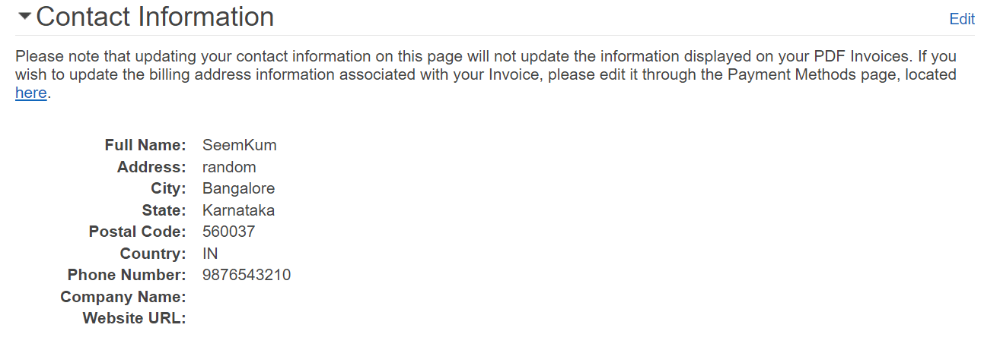
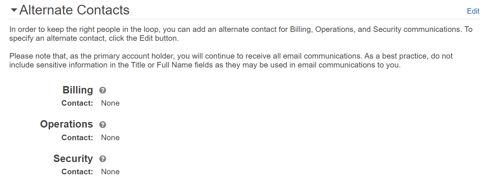
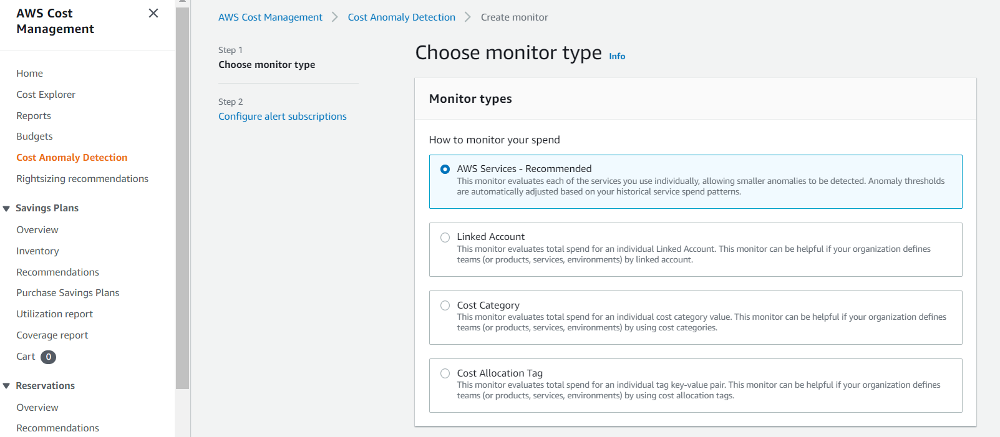
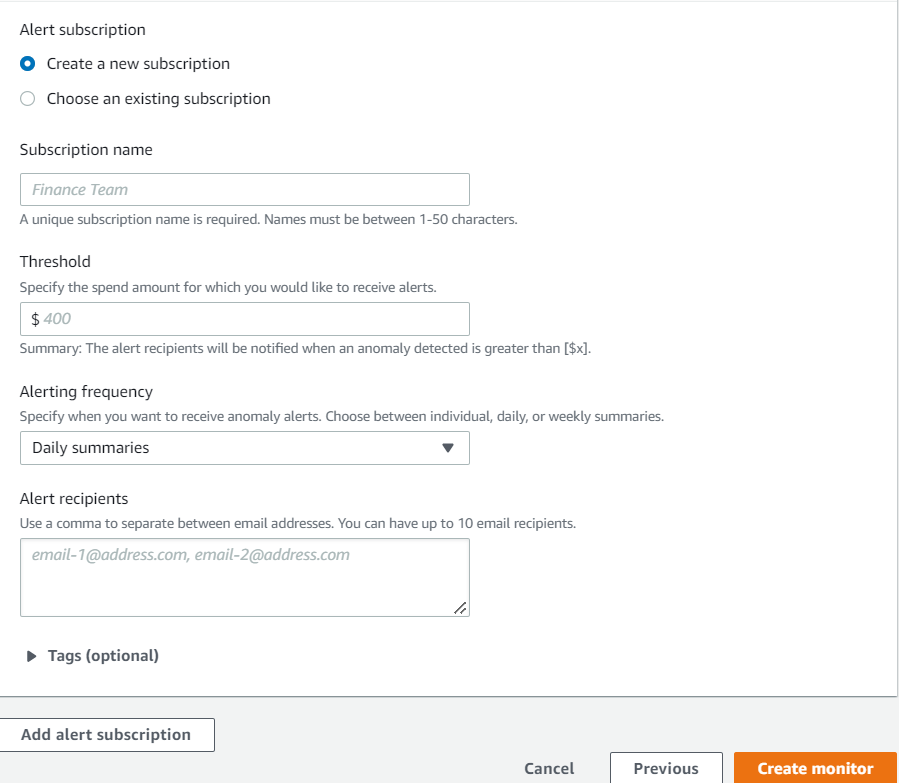

<!-- omit in toc -->
# AWS Cost Management - Security Baseline Requirement
<!-- omit in toc -->
## Baseline security configuration requirement for AWS services ###
---


Summary of changes: 
1. Added new controls
2. Updated the security control mappings

**Generated By: EY Security Team**

**Service Type: AWS Cost Management**

**Deployment Phase: Service Discovery** 

**Last Update: 07/14/2022**

## Table of Contents  <!-- omit in toc -->
<!-- TOC -->
- [Overview](#overview)
  - [Use Case Examples:](#use-case-examples)
- [Cloud Security Requirements](#cloud-security-requirements)
  - [1. Ensure AWS Cost Management users and roles are following least privilege model](#1-ensure-aws-cost-management-users-and-roles-are-following-least-privilege-model)
  - [2. Ensure to update current contact details in AWS](#2-ensure-to-update-current-contact-details-in-aws)
  - [3. Ensure Cost Anomaly Detection Monitor in use](#3-ensure-cost-anomaly-detection-monitor-in-use)
  - [4. Ensure to enable Cloudtrail for AWS Cost Management](#4-ensure-to-enable-cloudtrail-for-aws-cost-management)
  - [5. Ensure AWS Cost Management uses standard organizational resource tagging method](#5-ensure-aws-cost-management-uses-standard-organizational-resource-tagging-method)
- [Endnotes](#endnotes)
  - [Resources](#resources)
  - [Glossary](#glossary)
<!-- /TOC -->

##  Overview
The AWS Cost Management console has features that can be used for budgeting and forecasting costs and methods to optimize pricing to reduce overall AWS bill.

**AWS Cost Explorer**: AWS Cost Explorer is a feature that can be used to visualize cost data for further analysis. It is used to filter graphs by several different values. This includes Availability Zone, AWS service, and AWS Region. It also includes other specifics such as custom cost allocation tag, Amazon EC2 instance type, and purchase option. In case of consolidated billing, it can be filtered by member account. In addition, based on historical cost data we can see a forecast of future costs.

**AWS Budgets**: AWS Budgets tracks AWS usage and costs. AWS Budgets uses the cost visualization that's provided by AWS Cost Explorer to show the status of budgets. This provides forecasts of estimated costs and tracks AWS usage, including AWS Free Tier usage.

**Saving Plans**: Savings Plans offers a flexible pricing model that provides savings on AWS usage. Savings Plans provide savings beyond on-demand rates in exchange for a commitment of using a specified amount of compute power(measured every hour) for a one or three year period. 

| Control Number | Cloud Baseline Security Requirements                                                                        |
| -------------- | ----------------------------------------------------------------------------------------------------------- |
| 1              | Ensure AWS Cost Management users and roles are following least privilege model                              |
| 2              | Ensure to update current contact details in AWS                                                             |
| 3              | Ensure Cost Anomaly Detection Monitor in use                                                                |
| 4              | Ensure to enable Cloudtrail for AWS Cost Management                                                         |
| 5              | Ensure AWS Cost Management uses standard organizational resource tagging method                             |


### Use Case Examples:
- Raise awareness and accountability of cloud spend with the detailed, allocable cost data.
- Estimate resource utilization

## Cloud Security Requirements ##

### 1. Ensure AWS Cost Management users and roles are following least privilege model

**Security Control Mapping :**  <br>
| Control Number | Control Statement | Security Domain | Default | Associated Runbook | CVSS Severity  |
| -------------- | ----------------- | --------------- | ------- | ------------------ | -------------- |
| CS0012298 | Access to change cloud identity access and service control policies is restricted to authorized cloud administrative personnel |  Identity & Access Management | Not enabled |None | [Medium (6.8)](https://www.first.org/cvss/calculator/3.1#CVSS:3.1/AV:N/AC:H/PR:H/UI:R/S:C/C:L/I:L/A:H) |

**Why?** <br>
AWS Cost Management integrates with the AWS Identity and Access Management (IAM) service so that enterprise can control who in organization has access to specific pages on the AWS Cost Management console. Access can be controlled to invoices and detailed information about charges and account activity, budgets, payment methods, and credits. By default, IAM users and roles don't have permission to create or modify AWS Cost Management resources. They also can't perform tasks using the AWS Management Console, AWS CLI, or AWS API. An IAM administrator must create IAM policies that grant users and roles permission to perform actions on the resources that they need. The administrator must then attach those policies to the IAM users or groups that require those permissions.

**Following are the suggested roles for AWS Cost Management** <br>
| Function | Description | Role | 
| -------------- | ----------------- | --------------- | 
| Network admin | Responsible for configuring private endpoint for AWS Security Hub | Networkadmin |
| Security Hub admin team | This service-linked role is responsible to call other AWS services |AWSServiceRoleForSecurityHub|
| Security Engineer | Responsible to configure and manage AWS Config rules, and to monitor and audit the logs |MonitoringPlatformAdmin|
| Security Analyst | Responsible for triaging security alert from Security hub, requires read only access | AnalyticsPlatformAdmin|

**How?** <br>

This is updated in CG runbook.
https://docs.aws.amazon.com/cost-management/latest/userguide/security-iam.html

<br><br>

### 2. Ensure to update current contact details in AWS

**Security control mapping:** <br>
| Control Number | Control Statement | Security Domain | Default | Associated Runbook |CVSS Severity|
| ------------------ | ------------| --------------- | ------- | ------------------ |---|
| CS0012133 |[Place Holder] | Configuration Management | Not Enabled | None |[Medium(4.5)](https://www.first.org/cvss/calculator/3.1#CVSS:3.1/AV:L/AC:H/PR:L/UI:N/S:U/C:L/I:L/A:L)|

**Why?** <br>
Ensure that AWS accounts maintain valid (current) contact email and phone information and reference more than one person within organization in order to adhere to AWS security best practices. Using valid contact information for AWS accounts and multiple individuals as recipients is mandatory in case of mitigating urgent issues within these accounts. Current contact information provides a genuine communication channel between  organization's accounts and AWS.

**How?** <br>

**_Step 1:_** Sign in to the AWS Management Console using your root credentials or using an IAM user who has permission to read and write AWS billing information.

**_Step 2:_** Navigate to Billing & Cost Management Dashboard at https://console.aws.amazon.com/billing/home#.

**_Step 3:_** From the navigation bar, choose your AWS account name, then select **My Account**.

**_Step 4:_** On **My Account** page, click the **Edit** button next to Account Settings, **Contact Information** and **Alternate Contacts** sections, type your updated contact information then choose Update to apply the changes.
<br>

<br>

<br><br>

### 3. Ensure Cost Anomaly Detection Monitor in use

**Security control mapping:** <br>
| Control Number | Control Statement | Security Domain | Default | Associated Runbook |CVSS Severity|
| ------------------ | ------------| --------------- | ------- | ------------------ |---|
| CS0012133 |[Place Holder] | Configuration Management | Not Enabled | None |[Low(3.6)](https://www.first.org/cvss/calculator/3.1#CVSS:3.1/AV:L/AC:H/PR:L/UI:N/S:U/C:N/I:L/A:L)|

**Why?** <br>

Ensure that an Amazon Cost Anomaly Detection monitor is created for AWS account in order to proactively identify and take action on cost and usage anomalies. A Cost Anomaly Detection monitor tracks each AWS cloud service individually and alerts for any unexpected cost spikes. Enterprise can choose to create own custom detection monitor or use a pre-built one to receive alert notifications as soon as anomalous spend is detected. Enterprise can also use the Cost Anomaly Detection monitor to evaluate specific cost allocation tags, member accounts, and cost categories based on AWS account structure.

**How?** <br>

**_Step 1:_** Sign in to AWS Management Console.

**_Step 2:_** Navigate to AWS Cost Management console at https://console.aws.amazon.com/cost-management/home.

**_Step 3:_** In the navigation panel, under AWS Cost Management, select **Cost Anomaly Detection**. Click **Get started** and select **Cost monitors** tab, click **Create monitor** to initiate the setup process.

**_Step 4:_** On the **Create monitor** setup page, perform the following operations:

  a. For **Monitor types**, choose how to monitor your AWS spend by selecting the monitor type that suits your account structure.

  <br>

  b. For **Monitor name**, provide a descriptive name that uniquely identifies your new cost monitor.

  c. For **Alert subscription**, define your alert notification preferences by providing the following information:

    - In the 'Threshold' box, enter the anomaly impact amount (USD) to start receiving notification alerts. 
  
    - Use the 'Alerting frequency' dropdown list to choose when you want to receive anomaly alerts.
    
    - Click on 'Create monitor'v to create your new Amazon Cost Anomaly Detection monitor. 
   
  <br>

<br><br> 


### 4. Ensure to enable Cloudtrail for AWS Cost Management

**Security control mapping:** <br>
| Control Number | Control Statement | Security Domain | Default | Associated Runbook |CVSS Severity|
| ------------------ | ------------| --------------- | ------- | ------------------ |---|
| CS0012233| Information system must create a log and record activities occurring on or originating from the information system.Logs must be made accessible to the enterprise SIEM solution  | Security Information and event management | Not Enabled | None|[Low(2.5)](https://www.first.org/cvss/calculator/3.1#CVSS:3.1/AV:L/AC:H/PR:H/UI:N/S:C/C:N/I:N/A:L)|

**Why?** <br>
    
Billing and Cost Management is integrated with AWS CloudTrail, a service that provides a record of actions taken by a user, role, or an AWS service in Billing and Cost Management. CloudTrail captures all write and modify API calls for Billing and Cost Management as events, including calls from the Billing and Cost Management console and from code calls to the Billing and Cost Management APIs.

**How?** <br>

CloudTrail is enabled on your AWS account when you create the account. When activity occurs in AWS, that activity is recorded in a CloudTrail event along with other AWS service events in Event history. For an ongoing record of events in your AWS account, create a trail. 


***To create a CloudTrail trail using API :***

To create a trail that applies to all Regions, use the `--is-multi-region-trail` option. By default, the `create-trail` command creates a trail that logs events only in the AWS Region where the trail was created. To ensure that you log global service events and capture all management event activity in your AWS account, you should create trails that log events in all AWS Regions.

The following example creates a trail with the name `my-trail` and a tag with a key named `Group` with a value of `Marketing` that delivers logs from all Regions to an existing bucket named `my-bucket`.

```
aws cloudtrail create-trail --name my-trail --s3-bucket-name my-bucket --is-multi-region-trail --tags-list [key=Group,value=Marketing]
```

To confirm that your trail exists in all Regions, the `IsMultiRegionTrail` element in the `output` shows `true`.
```
{
    "IncludeGlobalServiceEvents": true, 
    "Name": "my-trail", 
    "TrailARN": "arn:aws:cloudtrail:us-east-2:123456789012:trail/my-trail", 
    "LogFileValidationEnabled": false, 
    "IsMultiRegionTrail": true, 
    "IsOrganizationTrail": false,
    "S3BucketName": "my-bucket"
}
```

>***Note***
Use the start-logging command to start logging for your trail.

<br><br> 

### 5. Ensure AWS Cost Management uses standard organizational resource tagging method

**Security control mapping:** <br>
| Control Number | Control Statement | Security Domain | Default | Associated Runbook |CVSS Severity|
| ------------------ | ------------| --------------- | ------- | ------------------ |---|
|CS0012128| Technology hardware and software must be registered and accurately recorded within the enterprise technology repository and/or asset management systems | Asset Management | Not Enabled | Organizational Runbook |[Low(1.6)](https://www.first.org/cvss/calculator/3.1#CVSS:3.1/AV:P/AC:H/PR:H/UI:N/S:U/C:N/I:N/A:L)|


**What, Why & How?** <br>

Identification of your IT assets is a crucial aspect of governance and security. You need to have visibility of all Cognito resources to assess their security posture and take action on potential areas of weakness.

Tagging resources in the cloud is an easy way for teams to provide information related to who owns the resource, what the resource is used for, as well as other important information related to the deployment lifecycle of the resource. Organization has mandated that all cloud resources are to be tagged with for cross-team use.

[Placeholder]
<br><br> 

## Endnotes ##

### Resources 
1. https://docs.aws.amazon.com/cost-management/latest/userguide/what-is-costmanagement.html
2. https://docs.aws.amazon.com/cost-management/latest/userguide/security.html

### Glossary 

**Data** - Digital pieces of information stored or transmitted for use with an information system from which understandable information is
derived. Items considered to be data are: Source code, meta-data, build artifacts, information input and output.

**Information System** - An organized assembly of resources and procedures for the collection, processing, maintenance, use, sharing,
dissemination, or disposition of information. All systems, platforms, compute instances including and not limited to physical and virtual
client endpoints, physical and virtual servers, software containers, databases, Internet of Things (IoT) devices, network devices,
applications (internal and external), Serverless computing instances (i.e. AWS Lambda), vendor provided appliances, and third-party
platforms, connected to the Capital Group network or used by Capital Group users or customers.

**Log** - a record of the events occurring within information systems and networks. Logs are composed of log entries; each entry contains
information related to a specific event that has occurred within a system or network.

**Information** - communication or representation of knowledge such as facts, data, or opinions in any medium or form, including textual,
numerical, graphic, cartographic, narrative, or audiovisual.

**Cloud Computing** - A model for enabling ubiquitous, convenient, on-demand network access to a shared pool of configurable computing
resources (e.g., networks, servers, storage, applications, and services) that can be rapidly provisioned and released with minimal
management effort or service provider interaction.

**Vulnerability**- Weakness in an information system, system security procedures, internal controls, or implementation that could be exploited
or triggered by a threat source. Note: The term weakness is synonymous for deficiency. Weakness may result in security and/or privacy
risks.
