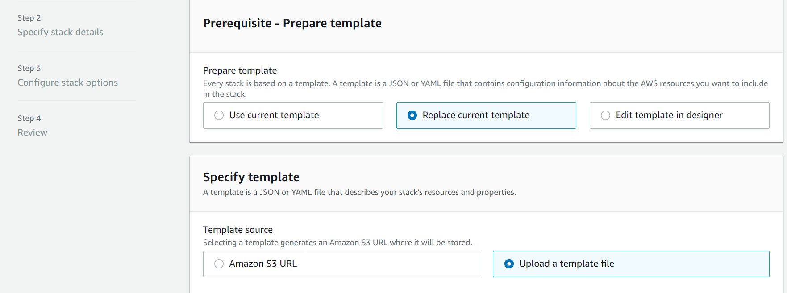
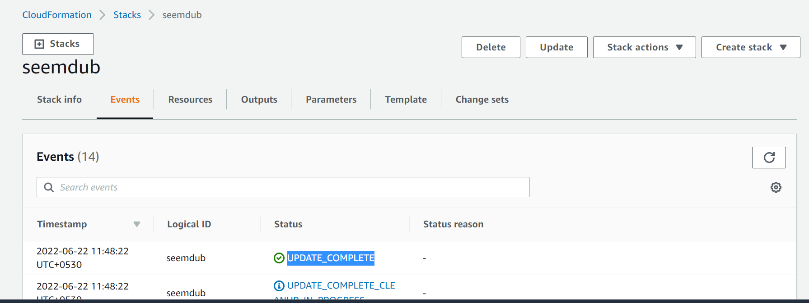
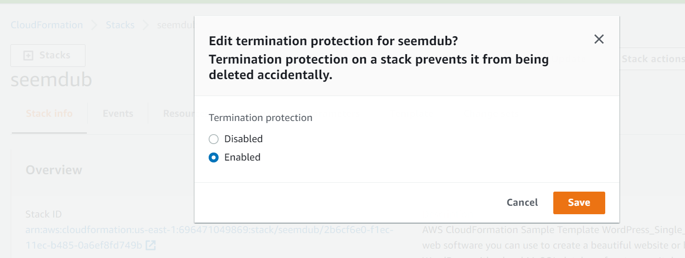
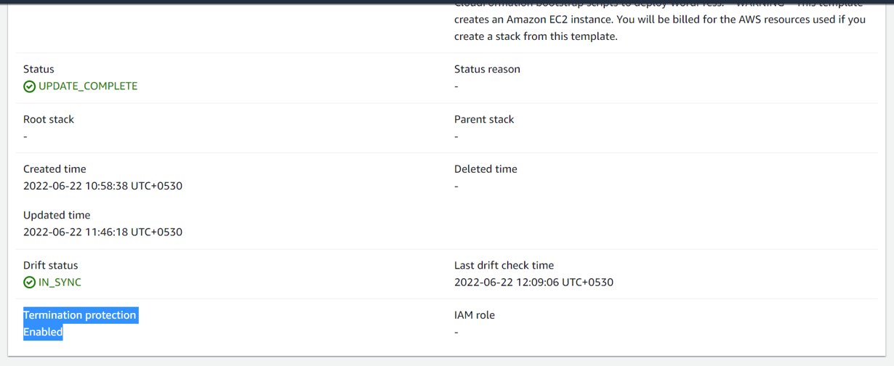
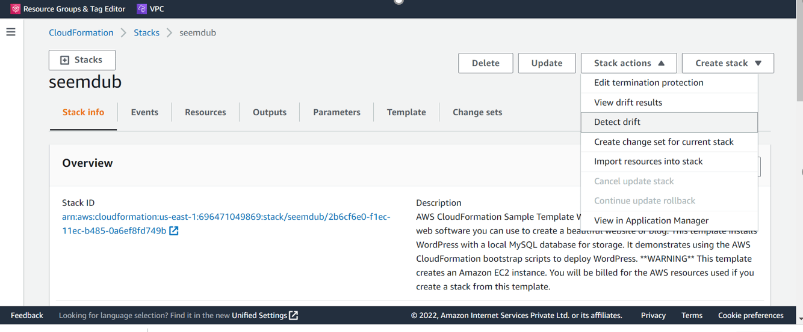
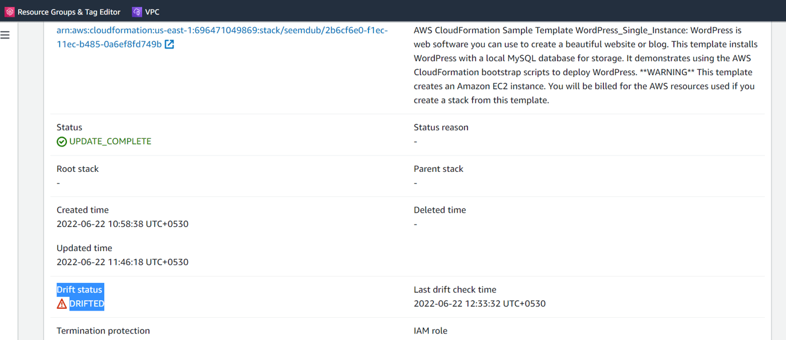
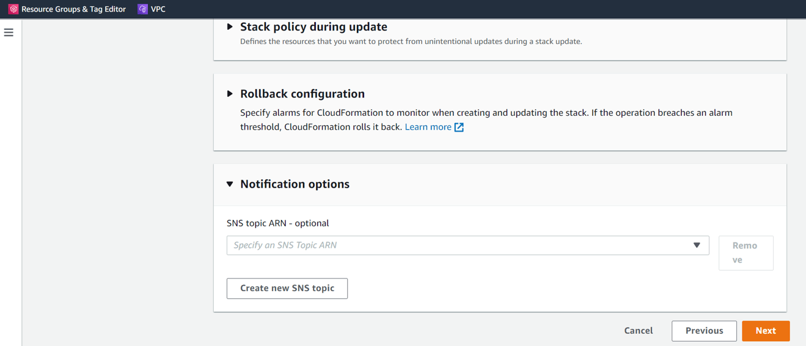
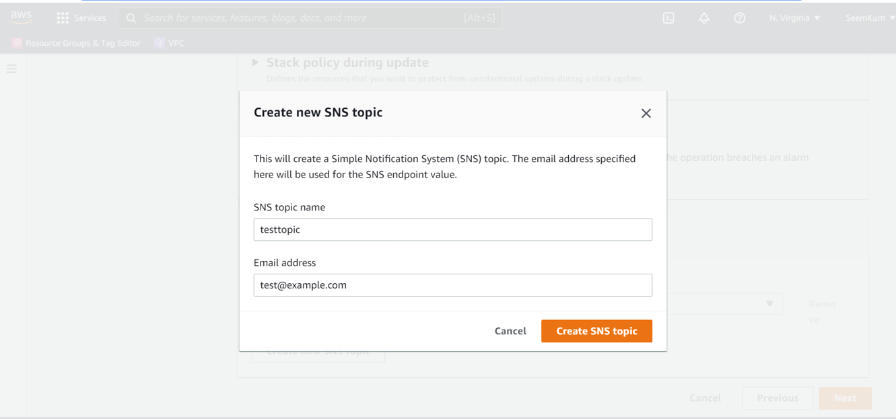
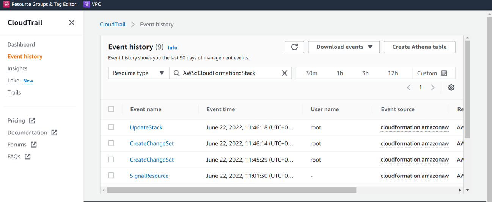

<!-- omit in toc -->
# AWS CloudFormation - Security Baseline Requirement
<!-- omit in toc -->
## Baseline security configuration requirement for AWS services ###
---


Summary of changes: 
1. Added new controls
2. Updated the security control mappings
3. Added new column 'CVSS-Severity' in security control mapping
4. Added implementation steps in 'How' section

**Generated By: EY Security Team**

**Service Type: Management & Governance**

**Deployment Phase: Service Discovery** 

**Last Update: 22/06/2022**

## Table of Contents  <!-- omit in toc -->
<!-- TOC -->
- [Overview](#overview)
  - [Use Case Examples:](#use-case-examples)
- [Cloud Security Requirements](#cloud-security-requirements)
  - [1. Ensure an IAM policy is defined with CloudFormation stack to follow the principle of least privilege](#1-ensure-an-iam-policy-is-defined-with-cloudformation-stack-to-follow-the-principle-of-least-privilege)
  - [2. Ensure deletion policy attribute is set in stack](#2-ensure-deletion-policy-attribute-is-set-in-stack)
  - [3. Ensure CloudFormation template is not configured without a stack policy and stack termination protection is enabled](#3-ensure-cloudformation-template-is-not-configured-without-a-stack-policy-and-stack-termination-protection-is-enabled)
  - [4. Ensure to detect drift on CloudFormation](#4-ensure-to-detect-drift-on-cloudformation)
  - [6. Ensure to enable CloudFormation stack notifications](#6-ensure-to-enable-cloudformation-stack-notifications)
  - [7. Ensure CloudTrail logging is enabled for CloudFormation](#7-ensure-cloudtrail-logging-is-enabled-for-cloudformation)
  - [8. Ensure CloudFormation uses standard organizational resource tagging method](#8-ensure-cloudformation-uses-standard-organizational-resource-tagging-method)
- [Endnotes](#endnotes)
  - [Resources](#resources)
  - [Glossary](#glossary)
<!-- /TOC -->

##  Overview
CloudFormation is the AWS service that promotes the concept of Infrastructure as Code (IaC), which practically means writing code using a descriptive language (JSON or YAML) to manage configurations and automate provisioning of AWS infrastructures in addition to deployments. AWS CloudFormation gives the ability to easily manage a collection of AWS resources by automating the creation and termination of infrastructure, services, and applications.


| Control Number | Cloud Baseline Security Requirements                                                                                |
| -------------- | --------------------------------------------------------------------------------------------------------------------|
| 1	           | Ensure an IAM policy is defined with CloudFormation stack to follow the principle of least privilege                |
| 2	           | Ensure deletion policy attribute is set in stack                                                                    |
| 3	           | Ensure CloudFormation template is not configured without a stack policy and stack termination protection is enabled |
| 4	           | Ensure to detect drift on CloudFormation                                                                            |
| 5	           | Ensure to enable CloudFormation stack notifications                                                                 |
| 6	           | Ensure CloudTrail logging is enabled for CloudFormation                                                             |
| 7	           | Ensure CloudFormation uses standard organizational resource tagging method                                          |

### Use Case Examples:
- Manage infrastructure with DevOps
- Scale production stacks

## Cloud Security Requirements ##

### 1. Ensure an IAM policy is defined with CloudFormation stack to follow the principle of least privilege

**Security control mapping:** <br>
| Control Number | Control Statement | Security Domain | Default | Associated Runbook |CVSS Severity|
| ------------------ | ------------| --------------- | ------- | ------------------ |---|
| CS0012298 | Access to change cloud identity access and service control policies is restricted to authorized cloud administrative personnel| Identity and Access Management| Not Enabled | IAM Runbook |[Medium (5.1)](https://www.first.org/cvss/calculator/3.1#CVSS:3.1/AV:A/AC:H/PR:H/UI:N/S:C/C:L/I:L/A:L)|

**Why?** <br>

Ensure that the IAM service role associated with CloudFormation stack adhere to the principle of least privilege in order avoid unwanted privilege escalation, as users with privileges within the AWS CloudFormation scope implicitly inherit the stack role's permissions. When an IAM service role is associated with a stack, AWS CloudFormation service uses this role for all operations that are performed on that stack. Other users that have permissions to perform operations on the stack will be able to utilize this role, even if they don't have permission to pass it. If the IAM role includes permissions that other users shouldn't have, we can unintentionally escalate their permissions, therefore we need to make sure that the role adhere to the principle of least privilege by giving it the minimal set of actions required to perform its tasks.

**How?** <br>

Users can use IAM with AWS CloudFormation to specify what AWS CloudFormation actions users can perform, such as viewing stack templates, creating stacks, or deleting stacks. When you create a group or an IAM user in AWS account, you can associate an IAM policy with that group or user, which specifies the permissions that you want to grant.

A sample policy that grants view stack permissions

```JSON
{
    "Version":"2012-10-17",
    "Statement":[{
        "Effect":"Allow",
        "Action":[
            "cloudformation:DescribeStacks",
            "cloudformation:DescribeStackEvents",
            "cloudformation:DescribeStackResource",
            "cloudformation:DescribeStackResources"
        ],
        "Resource":"*"
    }]
}
```
AWS CloudFormation supports resource-level permissions, so you can specify actions for a specific stack, as shown in the following policy:

A sample policy that denies the delete and update stack actions for the MyProductionStack

```JSON
{
    "Version":"2012-10-17",
    "Statement":[{
        "Effect":"Deny",
        "Action":[
            "cloudformation:DeleteStack",
            "cloudformation:UpdateStack"
        ],
        "Resource":"arn:aws:cloudformation:us-east-1:123456789012:stack/MyProductionStack/*"
    }]
}
```
The policy above uses a wild card at the end of the stack name so that delete stack and update stack are denied on the full stack ID.

A service role is an AWS Identity and Access Management (IAM) role that allows AWS CloudFormation to make calls to resources in a stack on your behalf. You can specify an IAM role that allows AWS CloudFormation to create, update, or delete your stack resources. By default, AWS CloudFormation uses a temporary session that it generates from your user credentials for stack operations.

For more details, refer the link:
https://docs.aws.amazon.com/AWSCloudFormation/latest/UserGuide/using-iam-template.html
https://docs.aws.amazon.com/AWSCloudFormation/latest/UserGuide/using-iam-servicerole.html

<br><br> 

### 2. Ensure deletion policy attribute is set in stack

**Security control mapping:** <br>
| Control Number | Control Statement | Security Domain | Default | Associated Runbook |CVSS Severity|
| ------------------ | ------------| --------------- | ------- | ------------------ |---|
|  CS0012142 |Backups must adhere to enterprise backup and retention requirements | Backup & Recovery  | Not enabled | None | [Low (2.7)](https://www.first.org/cvss/calculator/3.1#CVSS:3.1/AV:P/AC:H/PR:H/UI:N/S:U/C:N/I:L/A:L) |

**Why?** <br>

Ensure that a deletion policy, implemented with the DeletionPolicy attribute, is used for CloudFormation stacks in order to preserve or backup AWS resources when the stacks are deleted. For example, you can retain an Amazon S3 bucket or take a snapshot of an EBS volume so that you can continue to utilize or modify these resource after you delete their stack.

**How?** <br>

AWS CloudFormation DeletionPolicy attribute has 3 options:

1. Retain - CloudFormation keeps the AWS resource without deleting it or its contents when the stack is deleted and this option can be applied to any resource type. When CloudFormation service completes the stack deletion, the stack state will be "DELETE_COMPLETE" but the resources that are retained will continue to exist within your AWS account and continue to collect charges until you terminate or delete those resources.

2. Snapshot - when this option is used, CloudFormation creates snapshots of the AWS resources that support snapshots before deleting them. Just like the Retain option, the snapshots created with this option will continue to incur AWS charges until you delete them.
   
3. Delete - CloudFormation deletes the specified AWS resource and all its content if applicable during stack deletion. DeletionPolicy attribute set to Delete can be applied to any AWS resource type.
   
Follow below steps to set deletion policy attribute:

**_Step 1:_** Sign in to the AWS Management Console.<br>

**_Step 2:_** Navigate to CloudFormation dashboard at https://console.aws.amazon.com/cloudformation/.<br>

**_Step 3:_** Modify the template used for the CloudFormation stack that contains the AWS resource(s) that you want to preserve, by adding the "DeletionPolicy" : "Retain/Snapshot/Delete" attribute to the element block of the AWS resource that you want to retain.

The following snippet contains an Amazon S3 bucket resource with a 'Retain' deletion policy. When this stack is deleted, CloudFormation leaves the bucket without deleting it.

```JSON
{
  "AWSTemplateFormatVersion" : "2010-09-09",
  "Resources" : {
    "myS3Bucket" : {
      "Type" : "AWS::S3::Bucket",
      "DeletionPolicy" : "Retain"
    }
  }
}
```
<br>

**_Step 4:_** Select the CloudFormation stack that you want to update.<br>

**_Step 5:_** Select **Update** to start the update process.<br>

**_Step 6:_** On the 'Update stack' page, inside **Prepare template** section, choose 'Replace current template', inside **Specify template**, choose 'Upload a template file' and use the **Choose file** button to select the CloudFormation template edited at step no. 3 in order to upload it to AWS S3.<br>
<br>

**_Step 7:_** Click the Next button, without changing any stack configuration parameters, until you reach the Review page.<br>

**_Step 8:_** On the Review page, check the entire configuration for your CloudFormation stack before updating it.<br>

**_Step 9:_** Click Update to update the selected CloudFormation stack. Once the stack has been successfully updated, its status should change from UPDATE_IN_PROGRESS to UPDATE_COMPLETE.<br>

<br><br> 

### 3. Ensure CloudFormation template is not configured without a stack policy and stack termination protection is enabled

**Security control mapping:** <br>
| Control Number | Control Statement | Security Domain | Default | Associated Runbook |CVSS Severity|
| ------------------ | ------------| --------------- | ------- | ------------------ |---|
| CS0012298 | Access to change cloud identity access and service control policies is restricted to authorized cloud administrative personnel| Identity and Access Management | Not Enabled | None |[Low(1.9)](https://www.first.org/cvss/calculator/3.1#CVSS:3.1/AV:P/AC:H/PR:H/UI:N/S:C/C:N/I:N/A:L)|

**Why?** <br>

Ensure AWS CloudFormation stacks are using policies as a fail-safe mechanism in order to prevent accidental updates to stack resources. A CloudFormation stack policy is a JSON-based document that defines which actions can be performed on specified resources. The safety feature can be enabled when the CloudFormation stack can be created or for existing stacks using the AWS API (UpdateTerminationProtection command). Once enabled, if attempt to delete an AWS CloudFormation stack with the feature enabled, the deletion fails and the stack (including its current status), will remain unchanged. For production stacks, Organization strongly recommends to use termination protection feature in addition to a well-defined stack policy in order to make stack even safer.

**How?** <br>

**Follow below steps to define CloudFormation stack policies:**

**_Step 1:_** Define the stack policy based on the type of resources that you want to protect against accidental updates.

To prevent updates to all stack resources, use the following policy document
 ```JSON
 {
  "Statement" : [
    {
      "Effect" : "Deny",
      "Action" : "Update:*",
      "Principal": "*",
      "Resource" : "*"
    }
  ]
}
```
<br>

**_Step 2:_** Upload the policy into existing or new bucket

```
aws s3api put-object
    --bucket cfn-policies
    --key cfn-custom-policy.json
    --body cfn-custom-policy.json
```
<br>

**_Step 3:_** Run **set-stack-policy** command to attach the stack policy created at step no. 1 to the selected CloudFormation stack (if successful, the command does not return an output):

```
aws cloudformation set-stack-policy
    --region us-east-1
    --stack-name MyAppProdStack
    --stack-policy-url https://s3.amazonaws.com/cfn-policies/cfn-custom-policy.json
```
<br>

**Follow below steps to enable termination protection:**

**_Step 1:_** Sign in to the AWS Management Console.<br>

**_Step 2:_** Navigate to CloudFormation dashboard at https://console.aws.amazon.com/cloudformation/.<br>

**_Step 3:_** Select the CloudFormation stack that you want to protect from accidental deletion.<br>

**_Step 4:_** Click the **Stack actions** dropdown button from the CloudFormation dashboard top menu and select 'Edit termination protection'.<br>

<br>
**_Step 5:_** Inside Edit termination protection dialog box, select **Enabled** to switch on the feature for the selected stack. The CloudFormation dashboard should display now the following confirmation message: Success: Termination protection was successfully changed for <stack_name> and the feature status should change to **Enabled**.<br>


<br><br> 

### 4. Ensure to detect drift on CloudFormation

**Security control mapping:** <br>
| Control Number | Control Statement | Security Domain | Default | Associated Runbook |CVSS Severity|
| ------------------ | ------------| --------------- | ------- | ------------------ |---|
| [Place Holder] |[Place Holder] | Configuration Management | Not Enabled | None |[Low(3.4)](https://www.first.org/cvss/calculator/3.1#CVSS:3.1/AV:A/AC:H/PR:L/UI:R/S:U/C:L/I:L/A:N)|

**Why?** <br>

Ensure that CloudFormation stacks are not drifted from their expected template configuration. A CloudFormation stack is considered to have drifted from its configuration if one or more of its resources have been drifted. A stack resource is considered to have drifted if its actual property values differ from the expected property values specified as stack template parameters. This includes if the property or resource has been deleted. For each resource within the stack that supports drift detection, CloudFormation compares the actual configuration of the resource with its expected template configuration. Only resource properties explicitly defined in the stack template are checked for drift.

**How?** <br>

Follow below steps to detect drift on CloudFormation:

**_Step 1:_** Sign in to AWS Management Console.<br>

**_Step 2:_** Navigate to CloudFormation dashboard at https://console.aws.amazon.com/cloudformation/.<br>

**_Step 3:_** Select the CloudFormation stack that you want to examine.<br>

**_Step 4:_** Click the **Stack actions** dropdown button from the dashboard top menu and select 'Detect drift' option.<br>

<br>

**_Step 5:_** Within Detect drift dialog box, click Yes, detect to initiate the detection process. Once the detection process is complete, check the Drift status attribute value. If the attribute value (status) is DRIFTED, the stack configuration has been changed outside CloudFormation management, therefore the selected stack configuration is considered drifted.<br>

<br>

**_Step 6:_** Click the **Update** button from the dashboard top menu to start the update process.<br>

**_Step 7:_** On **Specify template** step, inside the Prepare template section, choose 'Use current template' to update the stack using the CloudFormation template with the expected configuration.<br>

**_Step 8:_** Click the Next button to continue the process.<br>

**_Step 9:_** On **Specify stack details** step, make sure that the stack parameters are set to their expected values.<br>

**_Step 10:_** Click Next until you reach the Review step, then check the entire configuration of the CloudFormation stack before updating it.<br>

**_Step 11:_** Click **Update** to update the selected CloudFormation stack. Once the stack has been successfully updated, its status should change from UPDATE_IN_PROGRESS to UPDATE_COMPLETE.<br>

<br><br> 

### 6. Ensure to enable CloudFormation stack notifications

**Security control mapping:** <br>

| Control Number | Control Statement | Security Domain | Default | Associated Runbook |CVSS Severity|
| ------------------ | ------------| --------------- | ------- | ------------------ |---|
| CS0012233| Information system must create a log and record activities occurring on or originating from the information system.Logs must be made accessible to the enterprise SIEM solution  | Security Information and event management | Not Enabled | SNS Runbook |[Low(1.9)](https://www.first.org/cvss/calculator/3.1#CVSS:3.1/AV:P/AC:H/PR:H/UI:N/S:C/C:N/I:N/A:L)|

**Why?** <br>

Ensure all CloudFormation stacks are using Simple Notification Service (AWS SNS) in order to receive notifications when an event occurs. Monitoring stack events such as create - which triggers the provisioning process based on a defined CloudFormation template, update – which updates the stack configuration or delete – which terminates the stack by removing its collection of AWS resources, will enable to respond fast to any unauthorized action that could alter AWS environment. SNS integration can increase the visibility of AWS CloudFormation stack activity, beneficial for security and management purposes.

**How?** <br>

Follow below steps to enable stack notification:

**_Step 1:_** Sign in to the AWS Management Console.<br>

**_Step 2:_** Navigate to CloudFormation dashboard at http://console.aws.amazon.com/cloudformation/.<br>

**_Step 3:_** Select a CloudFormation stack that you want to modify.<br>

**_Step 4:_** Select Update Stack.<br>

**_Step 5:_** Click the Next button until you reach the Options page.<br>

**_Step 6:_** In the Advanced section, under Notification options, perform one of the following actions:
Select New Amazon SNS topic, Existing Amazon SNS topic, Existing topic ARN.<br>

<br>


<br>

**_Step 7:_** Click Next and review the new configuration for the selected stack.<br>

**_Step 8:_** Click Update to apply the changes. Once the stack status is changed to UPDATE_COMPLETE, the integration with the selected SNS topic is complete.<br>

<br><br> 

### 7. Ensure CloudTrail logging is enabled for CloudFormation

**Security control mapping:** <br>
| Control Number | Control Statement | Security Domain | Default | Associated Runbook |CVSS Severity|
| ------------------ | ------------| --------------- | ------- | ------------------ |---|
| CS0012233| Information system must create a log and record activities occurring on or originating from the information system.Logs must be made accessible to the enterprise SIEM solution | Security Information and event management | Not Enabled | CloudTrail Runbook |[Low(1.9)](https://www.first.org/cvss/calculator/3.1#CVSS:3.1/AV:P/AC:H/PR:H/UI:N/S:C/C:N/I:N/A:L)|

**Why?** <br>

AWS CloudFormation is integrated with AWS CloudTrail, a service that provides a record of actions taken by a user, role, or an AWS service in CloudFormation. CloudTrail captures all CloudFormation API calls as events.
The calls captured include calls from the CloudFormation console, the AWS Command Line Interface, and code calls to the Lake Formation API actions.

More info on monitoring and CloudTrail Events: https://docs.aws.amazon.com/AmazonS3/latest/userguide/cloudtrail-logging.html

**How?** <br>

CloudTrail is enabled on AWS account when user create the account. When activity occurs in CloudFormation, that activity is recorded in a CloudTrail event along with other AWS service events in Event history. User can view, search, and download recent events in AWS account.

Follow below steps to view CloudTrail event:

**_Step 1:_** Sign in to the AWS Management Console using the IAM user you configured for CloudTrail administration. Open the CloudTrail console at https://console.aws.amazon.com/cloudtrail/home/.<br>

**_Step 2:_** Review the information in your dashboard about the most recent events that have occurred in your AWS account. A recent event should be a ConsoleLogin event, showing that you just signed in to the AWS Management Console.<br>

**_Step 3:_** To see more information about an event, expand it.<br>

**_Step 4:_** In the navigation pane, choose Event history. You see a filtered list of events, with the most recent events showing first. The default filter for events is Read only, set to false. You can clear that filter by choosing X at the right of the filter.<br>

**_Step 5:_** Many more events are shown without the default filter. You can filter events in many ways. For example, to view all console login events, you could choose the Resource type filter, and specify CloudFormation. The choice of filters is up to you.<br>


<br>

**_Step 6:_** You can save event history by downloading it as a file in CSV or JSON format. Downloading your event history can take a few minutes.<br>

<br><br> 

### 8. Ensure CloudFormation uses standard organizational resource tagging method

**Security control mapping:** <br>
| Control Number | Control Statement | Security Domain | Default | Associated Runbook |CVSS Severity|
| ------------------ | ------------| --------------- | ------- | ------------------ |---|
|CS0012128| [Place Holder] | Asset Management | Not Enabled | Organizational Runbook |[Low(3.3)](https://www.first.org/cvss/calculator/3.1#CVSS:3.1/AV:P/AC:H/PR:H/UI:N/S:C/C:L/I:N/A:L)|


**What, Why & How?** <br>

Identification of your IT assets is a crucial aspect of governance and security. You need to have visibility of all  CloudFormation resources to assess their security posture and take action on potential areas of weakness.

Tagging resources in the cloud is an easy way for teams to provide information related to who owns the resource, what the resource is used for, as well as other important information related to the deployment lifecycle of the resource. Organization has mandated that all cloud resources are to be tagged with for cross-team use.[Place holder to add confluence link]
<br><br> 

## Endnotes ##

### Resources 
1. https://docs.aws.amazon.com/AWSCloudFormation/latest/UserGuide/Welcome.html
2. https://docs.aws.amazon.com/AWSCloudFormation/latest/UserGuide/security.html

### Glossary 

**Data** - Digital pieces of information stored or transmitted for use with an information system from which understandable information is
derived. Items considered to be data are: Source code, meta-data, build artifacts, information input and output.

**Information System** - An organized assembly of resources and procedures for the collection, processing, maintenance, use, sharing,
dissemination, or disposition of information. All systems, platforms, compute instances including and not limited to physical and virtual
client endpoints, physical and virtual servers, software containers, databases, Internet of Things (IoT) devices, network devices,
applications (internal and external), Serverless computing instances (i.e. AWS Lambda), vendor provided appliances, and third-party
platforms, connected to the Capital Group network or used by Capital Group users or customers.

**Log** - a record of the events occurring within information systems and networks. Logs are composed of log entries; each entry contains
information related to a specific event that has occurred within a system or network.

**Information** - communication or representation of knowledge such as facts, data, or opinions in any medium or form, including textual,
numerical, graphic, cartographic, narrative, or audiovisual.

**Cloud Computing** - A model for enabling ubiquitous, convenient, on-demand network access to a shared pool of configurable computing
resources (e.g., networks, servers, storage, applications, and services) that can be rapidly provisioned and released with minimal
management effort or service provider interaction.

**Vulnerability**- Weakness in an information system, system security procedures, internal controls, or implementation that could be exploited
or triggered by a threat source. Note: The term weakness is synonymous for deficiency. Weakness may result in security and/or privacy
risks.
