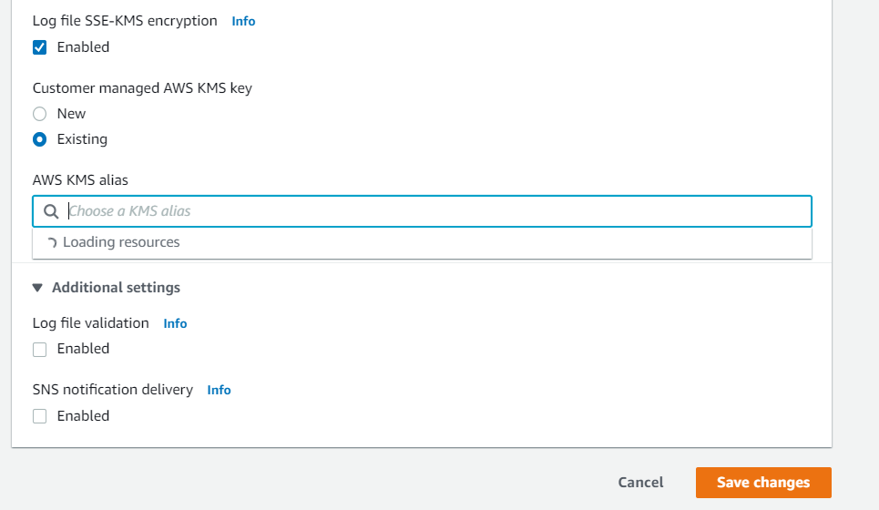
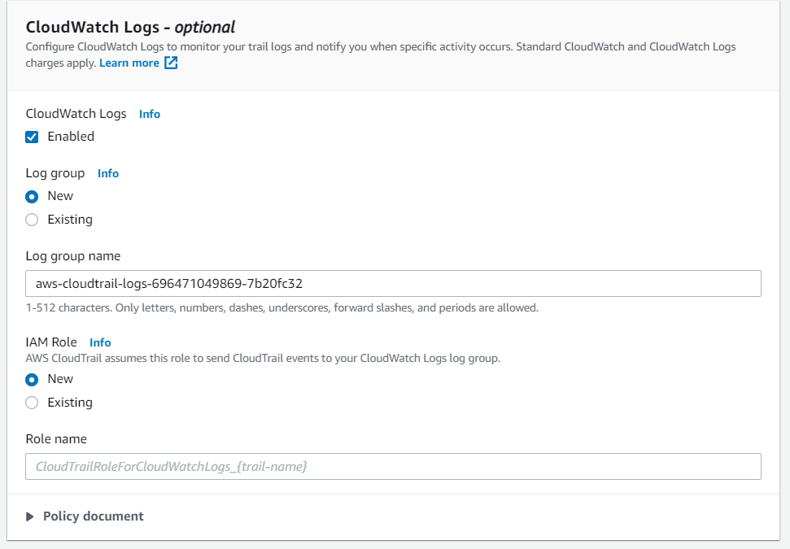
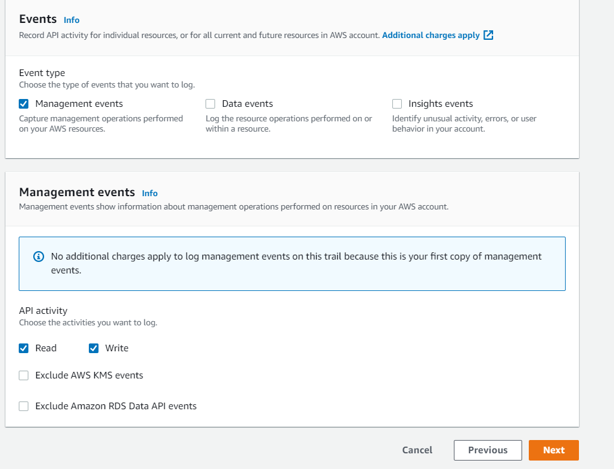

<!-- omit in toc -->
# AWS CloudTrail - Security Baseline Requirement
<!-- omit in toc -->
## Baseline security configuration requirement for AWS services ###
---
Summary of changes: 
1. Added new controls
2. Updated the security control mappings

**Generated By: EY Security Team**

**Service Type: Management & Governance**

**Deployment Phase: Service Discovery** 

**Last Update: 06/06/2022**

## Table of Contents  <!-- omit in toc -->
<!-- TOC -->
- [Overview](#overview)
  - [Use Case Examples:](#use-case-examples)
- [Cloud Security Requirements](#cloud-security-requirements)
  - [1. Ensure to enforce least privilege for CloudTrail logs](#1-ensure-to-enforce-least-privilege-for-cloudtrail-logs)
  - [2. Ensure CloudTrail logs are centrally managed](#2-ensure-cloudtrail-logs-are-centrally-managed)
  - [3. Ensure to implement least privilege access to S3 buckets where log files are stored and bucket is not publicly accessible](#3-ensure-to-implement-least-privilege-access-to-s3-buckets-where-log-files-are-stored-and-bucket-is-not-publicly-accessible)
  - [4. Ensure to enable object lock for CloudTrail S3 buckets](#4-ensure-to-enable-object-lock-for-cloudtrail-s3-buckets)
  - [5. Ensure CloudTrail logs are encrypted using organization managed KMS keys](#5-ensure-cloudtrail-logs-are-encrypted-using-organization-managed-kms-keys)
  - [6. Ensure CloudTrail logs are enabled for global services](#6-ensure-cloudtrail-logs-are-enabled-for-global-services)
  - [7. Ensure CloudTrail logs are enabled to all AWS regions](#7-ensure-cloudtrail-logs-are-enabled-to-all-aws-regions)
  - [8. Ensure to enable CloudTrail log file integrity](#8-ensure-to-enable-cloudtrail-log-file-integrity)
  - [9. Ensure to enable integration with CloudWatch](#9-ensure-to-enable-integration-with-cloudwatch)
  - [10. Ensure to enable CloudTrail management events](#10-ensure-to-enable-cloudtrail-management-events)
- [Endnotes](#endnotes)
  - [Resources](#resources)
  - [Glossary](#glossary)
<!-- /TOC -->

##  Overview
AWS CloudTrail is an AWS service that helps to enable governance, compliance, and operational and risk auditing of AWS account. Actions taken by a user, role, or an AWS service are recorded as events in CloudTrail. With AWS CloudTrail, enterprise can monitor AWS deployments in the cloud by getting a history of AWS API calls for aws account, including API calls made by using the AWS Management Console, the AWS SDKs, the command line tools, and higher-level AWS services. It can also be identified which users and accounts called AWS APIs for services that support CloudTrail, the source IP address from which the calls were made, and when the calls occurred.  Enterprise can integrate CloudTrail into applications using the API, automate trail creation for organization, check the status of trails, and control how administrators turn CloudTrail logging on and off.


| Control Number | Cloud Baseline Security Requirements                                                                        			|
| -------------- | ------------------------------------------------------------------------------------------------------------------------ 	|
| 1              | Ensure to enforce least privilege for CloudTrail logs                        						|
| 2              | Ensure CloudTrail logs are centrally managed                                            					|
| 3              | Ensure to implement least privilege access to S3 buckets where log files are stored and bucket is not publicly accessible    |
| 4              | Ensure to enable object lock for CloudTrail S3 buckets                            						|
| 5              | Ensure CloudTrail logs are encrypted using organization managed KMS keys                                                 	|
| 6              | Ensure CloudTrail logs are enabled for global services                                      					|
| 7              | Ensure CloudTrail logs are enabled to all AWS regions                         						|
| 8              | Ensure to enable CloudTrail log file integrity                                  						|
| 9              | Ensure to enable integration with CloudWatch 										|
| 10             | Ensure to enable CloudTrail management events										|

### Use Case Examples:
- Audit activity
- Identify security incidents
- Troubleshoot operational issues

## Cloud Security Requirements ##

### 1. Ensure to enforce least privilege for CloudTrail logs
[Place Holder]

### 2. Ensure CloudTrail logs are centrally managed

[Place Holder]

### 3. Ensure to implement least privilege access to S3 buckets where log files are stored and bucket is not publicly accessible 

**Security control mapping:** <br>
| Control Number | Control Statement | Security Domain | Default | Associated Runbook |CVSS Severity|
| ------------------ | ------------| --------------- | ------- | ------------------ |---|
| CS0012298 | Access to change cloud identity access and service control policies is restricted to authorized cloud administrative personnel| Identity and Access Management| Not Enabled | S3 Runbook |[Medium (6.8)](https://www.first.org/cvss/calculator/3.1#CVSS:3.1/AV:N/AC:H/PR:H/UI:R/S:C/C:L/I:L/A:H)|

**Why?** <br>

As per security best practice it is suggested to ensure that CloudTrail is configured to use the organization approved dedicated and centralized S3 bucket in order to meet regulatory compliance requirements within organization. And appropriate S3 bucket policy should be updated in bucket so that the stored trails should be not be intentionally modified/deleted in case access credentials are compromised. In order to help ensure that integrity, enterprise should adhere to the principle of least privilege when creating or modifying access to any Amazon S3 bucket used for storing CloudTrail log files. Using an overly permissive or insecure set of permissions for CloudTrail trail buckets could provide malicious users access to logging data, which can increase exponentially the risk of unauthorized access.

**How?** <br>

Refer [S3 Runbook](https://github.com/ey-org/cloudsec-ccm/blob/master/Baseline%20Requirement%20Library/AWS/S3/S3%20Runbook.md#2-ensure-aws-s3-buckets-are-not-publicly-accessible-via-bucket-policies-least-privilege-access) for implementation steps.
<br><br> 

### 4. Ensure to enable object lock for CloudTrail S3 buckets

**Security control mapping:** <br>
| Control Number | Control Statement | Security Domain | Default | Associated Runbook |CVSS Severity|
| ------------------ | ------------| --------------- | ------- | ------------------ |---|
| CS0012133 |[Place Holder] | Configuration Management | Not Enabled | S3 Runbook |[Medium(4.0)](https://www.first.org/cvss/calculator/3.1#CVSS:3.1/AV:L/AC:L/PR:N/UI:N/S:U/C:N/I:N/A:L)|


**Why?** <br>

Object Lock is an Amazon S3 feature that blocks object version deletion during a user-defined retention period by enforcing retention policies as an additional layer of data protection. Ensure that the S3 buckets associated with CloudTrail trails are configured to use the Object Lock feature in order to prevent the objects they store (i.e. trail log files) from being deleted and meet regulatory compliance. This will help to ensure log data integrity as the log files stored within these buckets can't be accidentally or intentionally deleted.  

**How?** <br>

Refer [S3 Runbook](https://github.com/ey-org/cloudsec-ccm/blob/master/Baseline%20Requirement%20Library/AWS/S3/S3%20Runbook.md#10-ensure-that-aws-s3-buckets-use-object-lock-for-data-protection) for implementation steps.
<br><br> 

### 5. Ensure CloudTrail logs are encrypted using organization managed KMS keys

**Security Control Mapping :** <br>
| Control Number | Control Statement | Security Domain | Default | Associated Runbook | CVSS Severity  |
| -------------- | ----------------- | --------------- | ------- | ------------------ | -------------- |
| CS0012168 |Strong encryption key management controls are in place for cloud provider services to protect data at rest | Data Protection | Not enabled | KMS Runbook | [Medium (5.3)](https://www.first.org/cvss/calculator/3.1#CVSS:3.1/AV:A/AC:H/PR:H/UI:N/S:U/C:H/I:L/A:L) |

**Why?** <br>

By default, the log files delivered by CloudTrail to bucket are encrypted by Amazon server-side encryption with Amazon S3-managed encryption keys (SSE-S3). To provide a security layer that is directly manageable by organization, it is suggested that enterprise can instead use server-side encryption with organization managed KMS keys for CloudTrail log files as it allows to have better control over who can read the log files in organization. 

**How?** <br>

**_Step 1:_** Sign in to the AWS Management Console and open the CloudTrail console at https://console.aws.amazon.com/cloudtrail/<br>

**_Step 2:_** Choose Trails and then choose a trail name<br>

**_Step 3:_** In **General details**, choose **Edit**.<br>

**_Step 4:_** For **Log file SSE-KMS encryption**, if it is not already enabled, choose **Enabled** to encrypt your log files with customer provided SSE-KMS. <br>

Choose Existing to update your trail with your AWS KMS key. Choose a KMS key that is in the same region as the S3 bucket that receives your log files. To verify the region for an S3 bucket, view its properties in the S3 console.
In AWS KMS Alias, specify the alias name, ARN, or the globally unique key ID.

**_Step 5:_** Choose **Save changes**.<br>


<br><br> 

### 6. Ensure CloudTrail logs are enabled for global services

**Security control mapping:** <br>
| Control Number | Control Statement | Security Domain | Default | Associated Runbook |CVSS Severity|
| ------------------ | ------------| --------------- | ------- | ------------------ |---|
| CS0012133 |[Place Holder] | Configuration Management | Not Enabled | None |[Medium(4.0)](https://www.first.org/cvss/calculator/3.1#CVSS:3.1/AV:L/AC:L/PR:N/UI:N/S:U/C:N/I:N/A:L)|

**Why?** <br>

Enterprise should ensure that Amazon CloudTrail trails are recording both regional and global events for AWS services in order to increase the visibility of the API activity in AWS cloud account for security and management purposes. Having CloudTrail logging enabled for both regional and global AWS services would help to demonstrate compliance and troubleshoot operational or security issues within AWS cloud account.

**How?** <br>

Global service events are delivered by default to trails that are created using the CloudTrail console. Events are delivered to the bucket for the trail.If you have multiple single region trails, consider configuring your trails so that global service events are delivered in only one of the trails.

- To change a trail so that it logs global service-events, use the '--include-global-service-events' option.
  
- The following command creates a single-region trail in us-east-1 to receive CloudFront, IAM, and AWS STS events:
```
aws cloudtrail --region us-east-1 create-trail --include-global-service-events --name myTrail --s3-bucket-name DOC-EXAMPLE-BUCKET
```

To confirm that the trail now applies to all global services, the **IncludeGlobalServiceEvents** element in the output shows **true**.

The command output should return the metadata available for the reconfigured trail:

```
{
  "IncludeGlobalServiceEvents": true,
  "IsOrganizationTrail": false,
  "Name": "myTrail",
  "TrailARN": "arn:aws:cloudtrail:us-east-1:123456789012:trail/myTrail",
  "LogFileValidationEnabled": false,
  "IsMultiRegionTrail": true,
  "S3BucketName": "DOC-EXAMPLE-BUCKET"
}
```

<br><br> 

### 7. Ensure CloudTrail logs are enabled to all AWS regions

**Security control mapping:** <br>
| Control Number | Control Statement | Security Domain | Default | Associated Runbook |CVSS Severity|
| ------------------ | ------------| --------------- | ------- | ------------------ |---|
| CS0012133 |[Place Holder] | Configuration Management | Enabled | None |[Medium(4.0)](https://www.first.org/cvss/calculator/3.1#CVSS:3.1/AV:L/AC:L/PR:N/UI:N/S:U/C:N/I:N/A:L)|

**Why?** <br>

To obtain a complete record of events taken by a user, role, or service in AWS account, each trail should be configured to log events in all AWS Regions. By logging events in all AWS Regions, ensure that all events that occur in AWS account are logged, regardless of which AWS Region where they occurred. This includes logging global service events, which are logged to an AWS Region specific to that service.

**How?** <br>

To update a single-region trail to log events in all regions, or update an all-region trail to log events in only a single region, you must use the AWS CLI. 

- To change an existing trail so that it applies to all Regions, use the '--is-multi-region-trail' option.
```
aws cloudtrail update-trail --name my-trail --is-multi-region-trail
```
- To confirm that the trail now applies to all Regions, the **IsMultiRegionTrail** element in the output shows **true**.
```
{
    "IncludeGlobalServiceEvents": true, 
    "Name": "my-trail", 
    "TrailARN": "arn:aws:cloudtrail:us-east-2:123456789012:trail/my-trail", 
    "LogFileValidationEnabled": false, 
    "IsMultiRegionTrail": true, 
    "IsOrganizationTrail": false,
    "S3BucketName": "my-bucket"
}
```
<br><br> 

### 8. Ensure to enable CloudTrail log file integrity

**Security control mapping:** <br>
| Control Number | Control Statement | Security Domain | Default | Associated Runbook |CVSS Severity|
| ------------------ | ------------| --------------- | ------- | ------------------ |---|
| CS0012133 |[Place Holder] | Configuration Management | Enabled | None |[Medium(5.9)](https://www.first.org/cvss/calculator/3.1#CVSS:3.1/AV:L/AC:L/PR:N/UI:N/S:U/C:L/I:L/A:L)|

**Why?** <br>
    
Enterprise should ensure that CloudTrails have file integrity validation feature enabled in order to check the log files and detect whether these were modified or deleted after CloudTrail agent delivered them to the S3 bucket. Enabling this feature will allow to validate the integrity of CloudTrail log files and determine if the files were changed once delivered to the specified S3 bucket - the expectation is that the log files should remain unchanged. The log file integrity validation use industry standard algorithms such as SHA-256 for hashing and SHA-256 RSA for digital signing which makes impossible to change files without detection.

**How?** <br>

- To enable log file validation for a trail, use the '--enable-log-file-validation' option. Digest files are delivered to the Amazon S3 bucket for that trail.

Run update-trail command (OSX/Linux/UNIX) using the selected trail name to update the trail configuration and enable log file integrity validation:

```
aws cloudtrail update-trail
	--name MyGlobalTrail
	--enable-log-file-validation

```
- To confirm that log file validation is enabled, the **LogFileValidationEnabled** element in the output shows **true**.
  
```
{
    "IncludeGlobalServiceEvents": true, 
    "Name": "MyGlobalTrail", 
    "TrailARN": "arn:aws:cloudtrail:us-east-2:123456789012:trail/MyGlobalTrail", 
    "LogFileValidationEnabled": true, 
    "IsMultiRegionTrail": false, 
    "IsOrganizationTrail": false,
    "S3BucketName": "my-bucket"
}
```
<br><br> 

### 9. Ensure to enable integration with CloudWatch

**Security control mapping:** <br>
| Control Number | Control Statement | Security Domain | Default | Associated Runbook |CVSS Severity|
| ------------------ | ------------| --------------- | ------- | ------------------ |---|
| CS0012233| Information system must create a log and record activities occurring on or originating from the information system.Logs must be made accessible to the enterprise SIEM solution  | Security Information and event management | Not Enabled | CloudWatch Runbook |[Low(3.9)](https://www.first.org/cvss/calculator/3.1#CVSS:3.1/AV:L/AC:H/PR:H/UI:N/S:C/C:N/I:L/A:L)|


**Why?** <br>

Enterprise should ensure that the CloudWatch Logs service is configured to monitor Amazon CloudTrail trail logs and notify enterprise when specific activity occurs. This enables to respond quickly to critical events captured with CloudTrail and detected by CloudWatch Logs. This will allow organization to better manage AWS cloud infrastructure. For example, Enterprise can receive an SNS notification whenever an authorization failure occurs for AWS account so it can have finer control over the user access to cloud account.

**How?** <br>

**_Step 1:_** Open the CloudTrail console at https://console.aws.amazon.com/cloudtrail/.<br>

**_Step 2:_** Choose the trail name.<br>

**_Step 3:_** For CloudWatch Logs, select **Enabled**.
  
**_Step 4:_** For New or existing log group, type the log group name , and then choose Continue

**_Step 5:_** For the **IAM role**, choose an existing role or create one. If you create an IAM role, type a role name.

**_Step 5:_** Choose **Save changes** to apply the changes.



<br><br> 

### 10. Ensure to enable CloudTrail management events

**Security control mapping:** <br>
| Control Number | Control Statement | Security Domain | Default | Associated Runbook |CVSS Severity|
| ------------------ | ------------| --------------- | ------- | ------------------ |---|
| CS0012133 |[Place Holder] | Configuration Management | Not Enabled | None |[Medium(4.0)](https://www.first.org/cvss/calculator/3.1#CVSS:3.1/AV:L/AC:L/PR:N/UI:N/S:U/C:N/I:N/A:L)|


**Why?** <br>

Organization should ensure that all AWS CloudTrail trails are configured to log management events in order to record important operations such as EC2 RunInstances, DescribeInstances, TerminateInstances and Console Login (basically all events that are not data events). Management events are operations that occur when working with AWS resources and recording them is a good security practice.

**How?** <br>

**_Step 1:_** Open the Trails page of the CloudTrail console and choose the trail name.

**_Step 2:_** For Management events, choose **Edit**.

**_Step 3:_** Choose if you want your trail to log **Read events**, **Write events**, or both.

To exclude high-volume events like Encrypt, Decrypt, and GenerateDataKey, but still log relevant events such as Disable, Delete and ScheduleKey, choose to log Write management events, and clear the check box for Exclude AWS KMS events.

**_Step 4:_** Choose **Update trail** when you are finished.



<br><br>

## Endnotes ##

### Resources 
1. https://docs.aws.amazon.com/awscloudtrail/latest/userguide/cloudtrail-user-guide.html
2. https://docs.aws.amazon.com/awscloudtrail/latest/userguide/WhatIsCloudTrail-Security.html

### Glossary 

**Data** - Digital pieces of information stored or transmitted for use with an information system from which understandable information is
derived. Items considered to be data are: Source code, meta-data, build artifacts, information input and output.

**Information System** - An organized assembly of resources and procedures for the collection, processing, maintenance, use, sharing,
dissemination, or disposition of information. All systems, platforms, compute instances including and not limited to physical and virtual
client endpoints, physical and virtual servers, software containers, databases, Internet of Things (IoT) devices, network devices,
applications (internal and external), Serverless computing instances (i.e. AWS Lambda), vendor provided appliances, and third-party
platforms, connected to the Capital Group network or used by Capital Group users or customers.

**Log** - a record of the events occurring within information systems and networks. Logs are composed of log entries; each entry contains
information related to a specific event that has occurred within a system or network.

**Information** - communication or representation of knowledge such as facts, data, or opinions in any medium or form, including textual,
numerical, graphic, cartographic, narrative, or audiovisual.

**Cloud Computing** - A model for enabling ubiquitous, convenient, on-demand network access to a shared pool of configurable computing
resources (e.g., networks, servers, storage, applications, and services) that can be rapidly provisioned and released with minimal
management effort or service provider interaction.

**Vulnerability**- Weakness in an information system, system security procedures, internal controls, or implementation that could be exploited
or triggered by a threat source. Note: The term weakness is synonymous for deficiency. Weakness may result in security and/or privacy
risks.
