<!-- omit in toc -->
# AWS Cognito - Security Baseline Requirement
<!-- omit in toc -->
## Baseline security configuration requirement for AWS services ###
---


Summary of changes: 
1. Added new controls
2. Updated the security control mappings
3. Added implementation steps

**Generated By: EY Security Team**

**Service Type: Security, Identity, & Compliance**

**Deployment Phase: Service Discovery** 

**Last Update: 05/10/2022**

## Table of Contents  <!-- omit in toc -->
<!-- TOC -->
- [Overview](#overview)
  - [Use Case Examples:](#use-case-examples)
- [Cloud Security Requirements](#cloud-security-requirements)
  - [1. Ensure IAM roles to access Cognito are following least privilege model](#1-ensure-iam-roles-to-access-cognito-are-following-least-privilege-model)
  - [2. Ensure data within Cognito is encrypted at rest using organization managed key(CMK)](#2-ensure-data-within-cognito-is-encrypted-at-rest-using-organization-managed-keycmk)
  - [2. Ensure data are encrypted in transit using TLS 1.2](#2-ensure-data-are-encrypted-in-transit-using-tls-12)
  - [3. Ensure to add MFA to Cognito user pool](#3-ensure-to-add-mfa-to-cognito-user-pool)
  - [4. Ensure access for unauthenticated identities is not enabled](#4-ensure-access-for-unauthenticated-identities-is-not-enabled)
  - [5. Ensure to enable advanced security features to Cognito user pool](#5-ensure-to-enable-advanced-security-features-to-cognito-user-pool)
  - [6. Ensure the identity provider configured is organization approved](#6-ensure-the-identity-provider-configured-is-organization-approved)
  - [7. Ensure ID, access and refresh tokens are set to expire as per organization standards defined](#7-ensure-id-access-and-refresh-tokens-are-set-to-expire-as-per-organization-standards-defined)
  - [8. Ensure to enable Cloudtrail for Cognito](#8-ensure-to-enable-cloudtrail-for-cognito)
  - [9.  Ensure to monitor Cognito using CloudWatch metrics](#9--ensure-to-monitor-cognito-using-cloudwatch-metrics)
  - [10. Ensure Cognito uses standard organizational resource tagging method](#10-ensure-cognito-uses-standard-organizational-resource-tagging-method)
- [Endnotes](#endnotes)
  - [Resources](#resources)
  - [Glossary](#glossary)
<!-- /TOC -->

##  Overview
Amazon Cognito is a managed service that allow to quickly add users for mobile and web applications by providing in-built sign-in screens and authentication functionality. It handles security, authorization, and synchronization for user management process across devices for all users. Cognito can be used for authenticating users through external identity providers including social identity providers, such as Facebook, Google, Twitter, LinkedIn, and so on. Cognito can also be used to authenticate identities for any solution that is compatible with SAML 2.0 standard. It can provide temporary security credentials with limited privileges to these authenticated users to securely access AWS resources. The following figure illustrates three basic functionalities of Amazon Cognito: user management, authentication, and synchronization:


| Control Number | Cloud Baseline Security Requirements                                                                        |
| -------------- | ----------------------------------------------------------------------------------------------------------- |
| 1	             | Ensure IAM roles to access Cognito are following least privilege model                                      |
| 2	             | Ensure data within Cognito is encrypted at rest using organization managed key(CMK)                         |
| 3	             | Ensure data are encrypted in transit using TLS 1.2                                                          |
| 4	             | Ensure to add MFA to Cognito user pool                                                                      |
| 5	             | Ensure access for unauthenticated identities is not enabled                                                 |
| 6	             | Ensure to enable advanced security features to Cognito user pool                                            |
| 7	             | Ensure the identity provider configured is organization approved                                            |
| 8	             | Ensure ID, access and refresh tokens are set to expire as per organization standards defined                |
| 9	             | Ensure to enable Cloudtrail for Cognito                                                                     |
| 10             | Ensure to monitor Cognito using CloudWatch metrics                                                          |
| 11             | Ensure Cognito uses standard organizational resource tagging method                                         |


### Use Case Examples:
- User management
- Sync functionality to mobile and web apps

## Cloud Security Requirements ##

### 1. Ensure IAM roles to access Cognito are following least privilege model

**Security Control Mapping :**  <br>

| Control Number | Control Statement | Security Domain | Default | Associated Runbook | CVSS Severity  |
| -------------- | ----------------- | --------------- | ------- | ------------------ | -------------- |
| CS0012298 | Access to change cloud identity access and service control policies is restricted to authorized cloud administrative personnel |  Identity & Access Management | Not enabled |None | [Medium (6.5)](https://www.first.org/cvss/calculator/3.1#CVSS:3.1/AV:A/AC:H/PR:H/UI:R/S:C/C:H/I:L/A:L) |

**Why?** <br>

By default, IAM users and roles don't have permission to create or modify Cognito resources. They also can't perform tasks using the AWS Management Console, AWS CLI, or AWS API. An IAM administrator must create IAM policies that grant users and roles permission to perform actions on the resources that they need. The administrator must then attach those policies to the IAM users or groups that require those permissions.

**How?** <br>

**_Step 1:_** Sign in to the AWS Management Console and Open IAM console.https://console.aws.amazon.com/iamv2/<br> 

**_Step 2:_** Click on User group and create a group.<br> 

**_Step 3:_** Now click on user and create some users and add all users to the group.<br> 

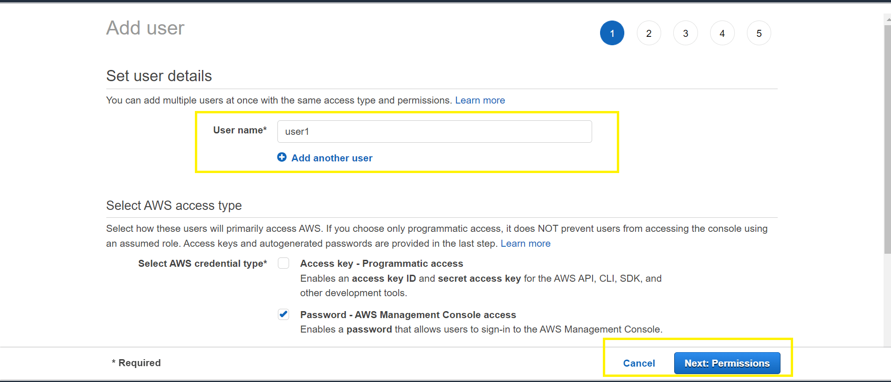<br>

**_Step 4:_** Click on Policy and create a policy for cognito eg. cognito read only access and attach this policy to the group.<br> 

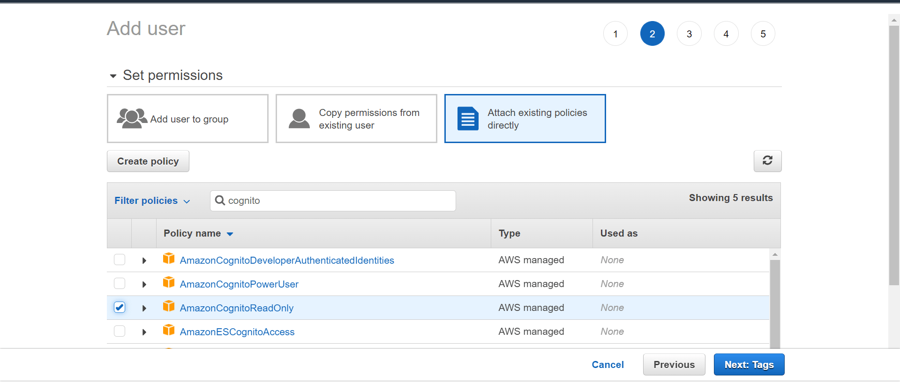<br>

`**Note**: Based on the user requirement, only required access can be given to the users.`

Below examples shows how you might create a policy that allows IAM users to restrict console access and allow access to specific dataset.

**1. Restricting console access to a specific identity pool**

```JSON
{
  "Version": "2012-10-17",
  "Statement": [
    {
      "Effect": "Allow",
      "Action": [
        "cognito-identity:ListIdentityPools"
      ],
      "Resource": "arn:aws:cognito-identity:us-east-1:0123456789:identitypool/us-east-1:1a1a1a1a-ffff-1111-9999-12345678"
    },
    {
      "Effect": "Allow",
      "Action": [
        "cognito-identity:*"
      ],
      "Resource": "arn:aws:cognito-identity:us-east-1:0123456789:identitypool/us-east-1:1a1a1a1a-ffff-1111-9999-12345678"
    },
    {
      "Effect": "Allow",
      "Action": [
        "cognito-sync:*"
      ],
      "Resource": "arn:aws:cognito-sync:us-east-1:0123456789:identitypool/us-east-1:1a1a1a1a-ffff-1111-9999-12345678"
    }
  ]
}
```
**2. Allowing access to specific dataset for all identities in a pool**

```JSON
{
  "Version": "2012-10-17",
  "Statement": [
    {
      "Effect": "Allow",
      "Action": [
        "cognito-sync:ListRecords",
        "cognito-sync:UpdateRecords"
      ],
      "Resource": "arn:aws:cognito-sync:us-east-1:0123456789:identitypool/us-east-1:1a1a1a1a-ffff-1111-9999-12345678/identity/*/dataset/UserProfile"
    }
  ]
}
```
<br><br>

### 2. Ensure data within Cognito is encrypted at rest using organization managed key(CMK)

**Security Control Mapping :** <br>

| Control Number | Control Statement | Security Domain | Default | Associated Runbook | CVSS Severity  |
| -------------- | ----------------- | --------------- | ------- | ------------------ | -------------- |
| CS0012168 |Strong encryption key management controls are in place for cloud provider services to protect data at rest | Data Protection | Not enabled | None | [High(7.9)](https://www.first.org/cvss/calculator/3.1#CVSS:3.1/AV:N/AC:H/PR:H/UI:N/S:C/C:H/I:H/A:L) |

**Why?** <br>

Data within Amazon Cognito is encrypted at rest in accordance with industry standards. This helps reduce the operational burden and complexity involved in protecting sensitive data. With encryption at rest, enterprise can build security-sensitive applications that meet encryption compliance and regulatory requirements.

**How?** <br>

All data in Cognito is encrypted by default, with no further effort required by end user/developers to enable.

>Note: The CVSS score is high for this control as this service doest not support customer managed key
<br><br>

### 2. Ensure data are encrypted in transit using TLS 1.2

**Security Control Mapping :**  <br>

| Control Number | Control Statement | Security Domain | Default | Associated Runbook | CVSS Severity  |
| -------------- | ----------------- | --------------- | ------- | ------------------ | -------------- |
| CS0012261 | Cloud based data in transit must be encrypted with enterprise approved algorithms. | Data Protection | Not enabled | None | [High(7.9)](https://www.first.org/cvss/calculator/3.1#CVSS:3.1/AV:N/AC:H/PR:H/UI:N/S:C/C:H/I:H/A:L) |

**Why?** <br>

All requests to Amazon Cognito must be made over the Transport Layer Security protocol (TLS). Clients must support Transport Layer Security (TLS) 1.0 or later. Organization recommend TLS 1.2 or later.

**How?** <br>

All data transmitted via Cognito is encrypted by default, with no further effort required by end user/developers to enable.

>Note: The CVSS score is high for this control as the encryption is not handled by client.
<br><br>

### 3. Ensure to add MFA to Cognito user pool

**Security Control Mapping :** <br>

| Control Number | Control Statement | Security Domain | Default | Associated Runbook | CVSS Severity  |
| -------------- | ----------------- | --------------- | ------- | ------------------ | -------------- |
| CS0012199 | After being Authenticated to the enterprise network , Mut-Factor Authentication (MFA) is required to utilize accounts with privileged access |  Identity & Access Management  | Not enabled | None | [Medium (4.0)](https://www.first.org/cvss/calculator/3.1#CVSS:3.1/AV:A/AC:H/PR:H/UI:N/S:C/C:L/I:N/A:L) |

**Why?** <br>

Multi-factor authentication (MFA) is a process in which a user is prompted for additional forms of identification during a sign-in event and ensures that highly privileged accounts are protected against credential exposure.

**How?** <br>

**_Step 1:_** Sign in to the AWS Management Console and search for Amazon Cognito.https://console.aws.amazon.com/cognito/<br> 

**_Step 2:_** Now click on **Manage User Pools**, on the next page click on 'create a user pool'.<br> 

**_Step 3:_** On the next page, fill the name of the pool after that update the attributes and policies field.<br> 

**_Step 4:_** Click Next step and fill the 'MFA and Verifications' page and select the 'required' radio button for `Do you want to enable Multi-Factor Authentication (MFA)` field.<br>

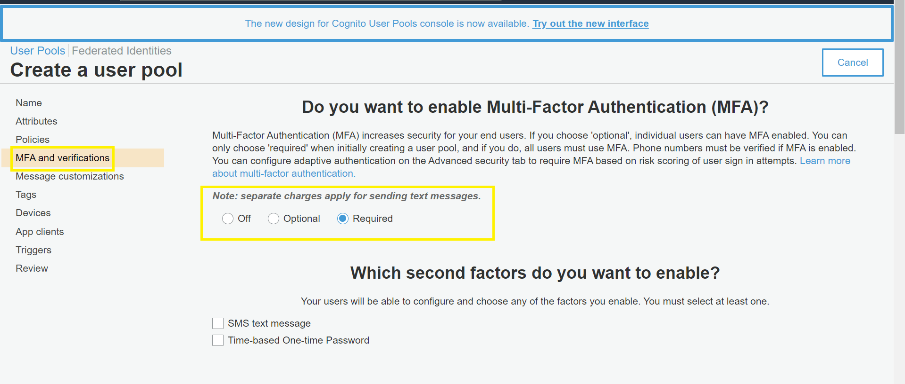<br>

**_Step 5:_** Keep on adding all the fields in other pages and at last click on 'create pool'.<br> 


<br><br> 

### 4. Ensure access for unauthenticated identities is not enabled

**Security control mapping:** <br>

| Control Number | Control Statement | Security Domain | Default | Associated Runbook |CVSS Severity|
| ------------------ | ------------| --------------- | ------- | ------------------ |---|
| CS0012133 |[Place Holder] | Configuration Management | Not Enabled | None |[Medium(4.5)](https://www.first.org/cvss/calculator/3.1#CVSS:3.1/AV:L/AC:H/PR:L/UI:N/S:U/C:L/I:L/A:L)|

**Why?** <br>

Amazon Cognito can support unauthenticated identities by providing a unique identifier and AWS credentials for users who do not authenticate with an identity provider. As per security best practice it is recommended not to enable this feature as anyone with internet access can be granted AWS credentials without logging in to any application and this could result in security breaches.

**How?** <br>

**_Step 1:_** Sign in to the AWS Management Console and Open Amazon cognito console.https://console.aws.amazon.com/cognito/<br> 

**_Step 2:_** Click on **Managed Identity Pools**.<br> 

**_Step 3:_** On the next page, click on Create new identity pool.<br>

**_Step 4:_** Provide some name for identity pool.<br>

**_Step 5:_** Under **Unauthenticated identities**, ignore the box of "Enable access to unauthenticated identities".<br>

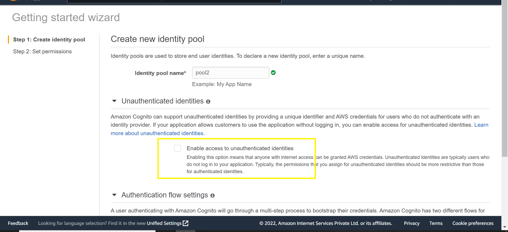<br>

**_Step 6:_** Update additional fields in the page.<br> 

**_Step 7:_** Click on **Create Pool**.<br> 

<br><br> 

### 5. Ensure to enable advanced security features to Cognito user pool

**Security control mapping:** <br>

| Control Number | Control Statement | Security Domain | Default | Associated Runbook |CVSS Severity|
| ------------------ | ------------| --------------- | ------- | ------------------ |---|
| CS0012133 |[Place Holder] | Configuration Management | Not Enabled | None |[Medium(3.7)](https://www.first.org/cvss/calculator/3.1#CVSS:3.1/AV:A/AC:H/PR:L/UI:N/S:U/C:N/I:L/A:L)|

**Why?** <br>

Advanced security features protect users with adaptive authentication and by blocking use of compromised credentials. Ensure to turn this features on in order to customize the actions that are taken in response to different risks.

**How?** <br>

**_Step 1:_** Sign in to the AWS Management Console and Go to the Amazon Cognito console.https://console.aws.amazon.com/cognito/<br>

**_Step 2:_** Choose **User Pools**.Choose an existing user pool from the list, or create a new user pool.<br>

**_Step 3:_** Under 'General settings' tab, click on 'Advanced security'.<br>

**_Step 3:_** For `Do you want to enable advanced security features for this user pool?`, choose **Yes** to turn on advanced security. Or choose Audit only to gather information, and send user pool data to CloudWatch.

`Organization recommends keeping the advanced security features in audit mode for two weeks before enabling actions. During this time, Amazon Cognito can learn the usage patterns of your app users.`

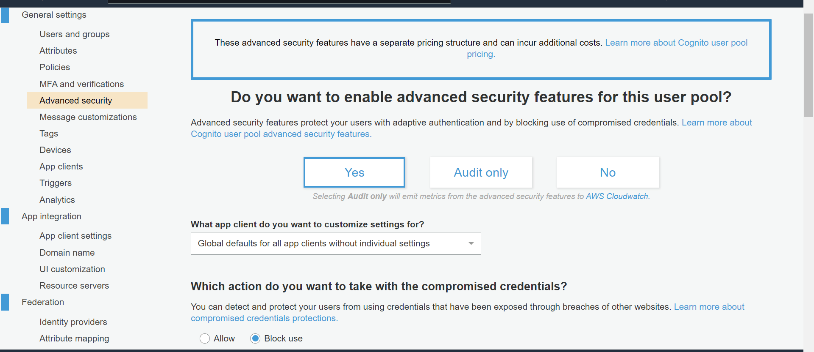<br> 

**_Step 4:_** From the drop-down list, choose **What app client do you want to customize settings for?**. The default is to keep your settings as global for all app clients.<br>

**_Step 5:_** For **Which action do you want to take with the compromised credentials?**, choose **Allow** or **Block** use.<br>

**_Step 6:_** Choose **Customize when compromised credentials are blocked** to select which events should initiate compromised credentials checks:

- Sign-in
- Sign-up
- Password change

**_Step 7:_** Choose how to respond to malicious sign-in attempts under **How do you want to use adaptive authentication for sign-in attempts rated as low, medium and high risk?**. You can allow or block the sign-in attempt, or require additional challenges before allowing the sign-in.<br>

To send email notifications when anomalous sign-in attempts are detected, choose **Notify users** .

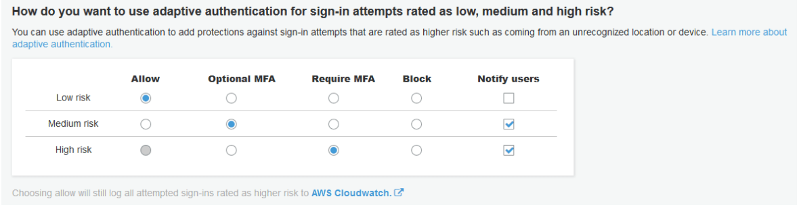<br> 

**_Step 8:_** If you chose **Notify users** in the previous step, then you can customize the email notification messages by using the **Notification message customization form**:

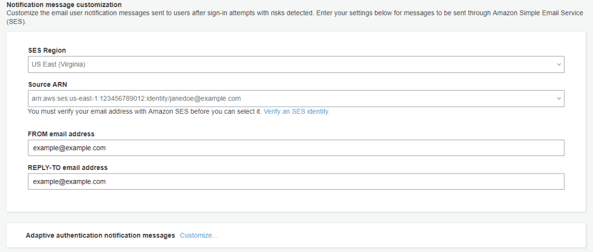<br> 

**_Step 9:_** Choose Customize to customize adaptive authentication notifications with both HTML and plaintext versions of email messages. To learn more about email message templates, see Message templates.<br>

**_Step 10:_** Type any IP addresses that you want to Always allow, or Always block, regardless of the advanced security risk assessment. Specify the IP address ranges in CIDR notation (such as 192.168.100.0/24).<br>

**_Step 11:_** Choose Save changes.

<br><br> 

### 6. Ensure the identity provider configured is organization approved

**Security control mapping:** <br>

| Control Number | Control Statement | Security Domain | Default | Associated Runbook |CVSS Severity|
| ------------------ | ------------| --------------- | ------- | ------------------ |---|
| CS0012133 |[Place Holder] | Configuration Management | Not Enabled | None |[Medium(5.4)](https://www.first.org/cvss/calculator/3.1#CVSS:3.1/AV:A/AC:H/PR:L/UI:N/S:U/C:N/I:L/A:H)|


**Why?** <br>

Application or web users can sign in either directly through a cognito user pool, or federate through a third-party identity provider (IdP). It is recommended to configure organization approved identity provider like social sign-in through Facebook, Google, Amazon, and Apple, and from OpenID Connect (OIDC) and SAML IdPs.

**How?** <br>

Follow this link to configure identity provider:https://docs.aws.amazon.com/cognito/latest/developerguide/cognito-user-pools-identity-provider.html


<br><br>  

### 7. Ensure ID, access and refresh tokens are set to expire as per organization standards defined

**Security control mapping:** <br>

| Control Number | Control Statement | Security Domain | Default | Associated Runbook |CVSS Severity|
| ------------------ | ------------| --------------- | ------- | ------------------ |---|
| CS0012133 |[Place Holder] | Configuration Management | Not Enabled | None |[Low(3.1)](https://www.first.org/cvss/calculator/3.1#CVSS:3.1/AV:A/AC:H/PR:N/UI:N/S:U/C:N/I:N/A:L)|


**Why?** <br>

In Amazon Cognito, users are authenticated and then granted access to resources with tokens. Tokens have claims, which are pieces of information about the user. The ID token contains claims about the identity of the authenticated user, such as name and email. The Access token contains claims about the authenticated user, a list of the user's groups, and a list of scopes. The Refresh token is used to retrieve new ID and access tokens.
As per security best practice it is guided to set some expiration window to these tokens as using targeted sign out provides fine-grained control over the user experience than the global sign out.

**How?** <br>

**_Step 1:_** Sign in to the AWS Management Console and search for Amazon Cognito.https://console.aws.amazon.com/cognito/<br>

**_Step 2:_** Create the user pool or select the existing user pool.<br>

**_Step 3:_** Under 'General settings' tab, click on 'App clients'

**_Step 4:_** Provide 'App client name' and add the desired refresh token, access token, ID token expiration period.<br> 
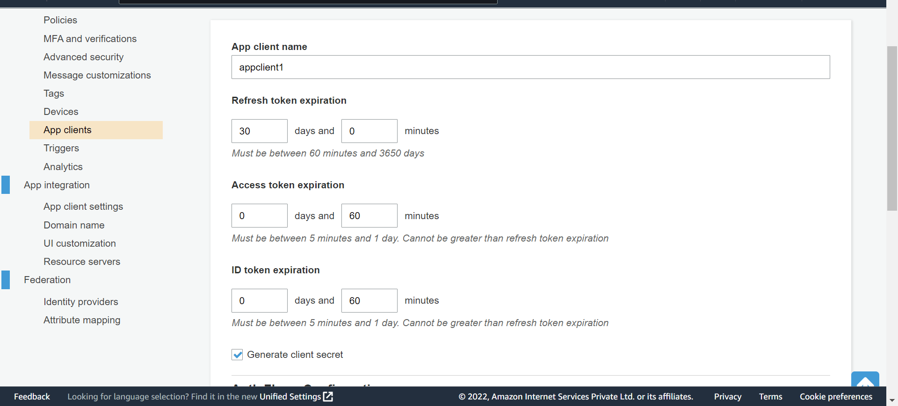<br> 

**_Step 5:_** Update the additional fields in the same page

**_Step 4:_** Click on the create app client.<br> 

<br><br>  

### 8. Ensure to enable Cloudtrail for Cognito

**Security control mapping:** <br>

| Control Number | Control Statement | Security Domain | Default | Associated Runbook |CVSS Severity|
| ------------------ | ------------| --------------- | ------- | ------------------ |---|
| CS0012233| Information system must create a log and record activities occurring on or originating from the information system.Logs must be made accessible to the enterprise SIEM solution  | Security Information and event management | Not Enabled | None|[Low(2.5)](https://www.first.org/cvss/calculator/3.1#CVSS:3.1/AV:L/AC:H/PR:H/UI:N/S:C/C:N/I:N/A:L)|

**Why?** <br>
    
Amazon Cognito is integrated with AWS CloudTrail, a service that provides a record of actions taken by a user, role, or an AWS service in Amazon Cognito. CloudTrail captures a subset of API calls for Amazon Cognito as events, including calls from the Amazon Cognito console and from code calls to the Amazon Cognito API operations.

**How?** <br>

**_Step 1:_** Sign in to the AWS Management Console using the IAM user you configured for CloudTrail administration. Open the CloudTrail console at https://console.aws.amazon.com/cloudtrail/home/. <br>

**_Step 2:_** Review the information in your dashboard about the most recent events that have occurred in your AWS account. A recent event should be a ConsoleLogin event, showing that you just signed in to the AWS Management Console.<br> 

**_Step 3:_** To see more information about an event, expand it.<br> 

**_Step 4:_** In the navigation pane, choose Event history. You see a filtered list of events, with the most recent events showing first. The default filter for events is Read only, set to false. You can clear that filter by choosing X at the right of the filter<br> 

**_Step 5:_** Many more events are shown without the default filter. You can filter events in many ways. For example, to view all console login events, you could choose the Resource type filter, and specify Cognito. The choice of filters is up to you.<br> 
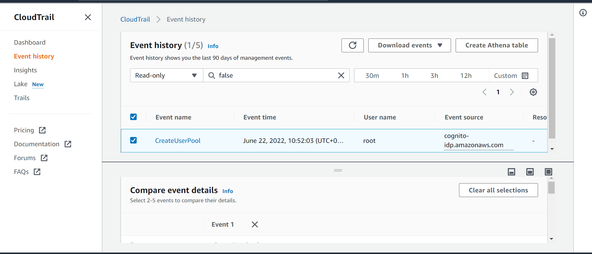<br> 

**_Step 6:_** You can save event history by downloading it as a file in CSV or JSON format. Downloading your event history can take a few minutes.<br> 

<br><br> 

### 9.  Ensure to monitor Cognito using CloudWatch metrics

**Security control mapping:** <br>

| Control Number | Control Statement | Security Domain | Default | Associated Runbook |CVSS Severity|
| ------------------ | ------------| --------------- | ------- | ------------------ |---|
| CS0012233| Information system must create a log and record activities occurring on or originating from the information system.Logs must be made accessible to the enterprise SIEM solution  | Security Information and event management | Not Enabled | None|[Low(3.9)](https://www.first.org/cvss/calculator/3.1#CVSS:3.1/AV:L/AC:H/PR:H/UI:N/S:U/C:L/I:L/A:L)|

**Why?** <br>

Enterprise can monitor Amazon Cognito user pools using Amazon CloudWatch. CloudWatch collects raw data and processes it into readable, near-real-time metrics. In CloudWatch, user can set alarms that watch for certain thresholds and send notifications or take actions when those thresholds are met.

**How?** <br>

**_Step 1:_** Sign in to the AWS Management Console and Open the CloudWatch console at https://console.aws.amazon.com/cloudwatch/. <br>

**_Step 2:_** In the navigation pane, choose Metrics.<br> 

**_Step 3:_** Choose Amazon Cognito.<br> 

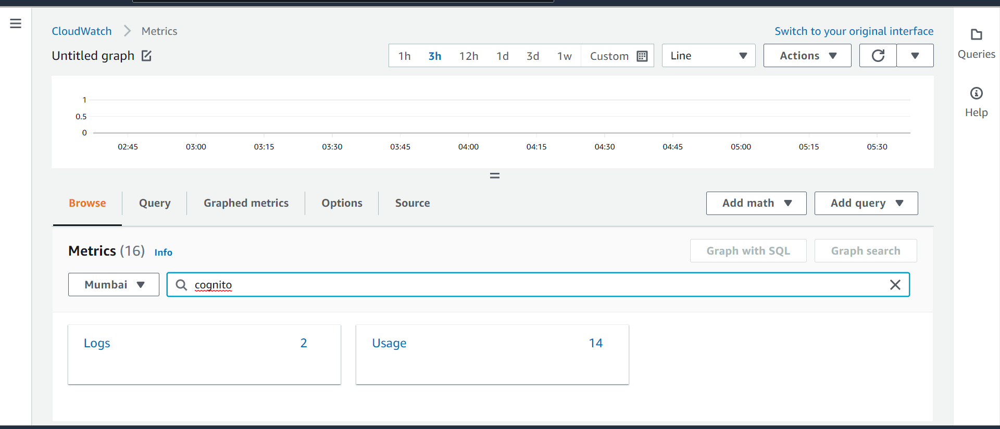<br>

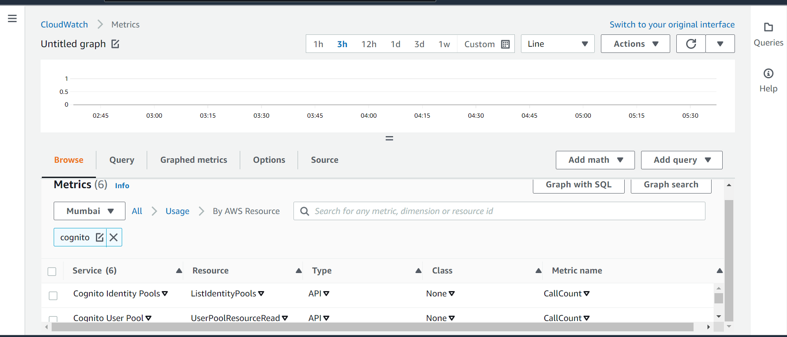<br> 

`**Note**: Amazon Cognito offers you two predefined groups of metrics for ready analysis in CloudWatch. By Risk Classification identifies the granularity of the risk level for requests that Amazon Cognito identifies as risky. By Request Classification reflects metrics aggregated by request level`

<br><br> 

### 10. Ensure Cognito uses standard organizational resource tagging method

**Security control mapping:** <br>

| Control Number | Control Statement | Security Domain | Default | Associated Runbook |CVSS Severity|
| ------------------ | ------------| --------------- | ------- | ------------------ |---|
|CS0012128| Technology hardware and software must be registered and accurately recorded within the enterprise technology repository and/or asset management systems | Asset Management | Not Enabled | Organizational Runbook |[Low(1.6)](https://www.first.org/cvss/calculator/3.1#CVSS:3.1/AV:P/AC:H/PR:H/UI:N/S:U/C:N/I:N/A:L)|


**What, Why & How?** <br>

Identification of your IT assets is a crucial aspect of governance and security. You need to have visibility of all Cognito resources to assess their security posture and take action on potential areas of weakness.

Tagging resources in the cloud is an easy way for teams to provide information related to who owns the resource, what the resource is used for, as well as other important information related to the deployment lifecycle of the resource. Organization has mandated that all cloud resources are to be tagged with for cross-team use.

[Place holder for organization runbook]
<br><br> 

## Endnotes ##

### Resources 
1. https://docs.aws.amazon.com/AWSCloudFormation/latest/UserGuide/Welcome.html
2. https://docs.aws.amazon.com/AWSCloudFormation/latest/UserGuide/security.html

### Glossary 

**Data** - Digital pieces of information stored or transmitted for use with an information system from which understandable information is
derived. Items considered to be data are: Source code, meta-data, build artifacts, information input and output.

**Information System** - An organized assembly of resources and procedures for the collection, processing, maintenance, use, sharing,
dissemination, or disposition of information. All systems, platforms, compute instances including and not limited to physical and virtual
client endpoints, physical and virtual servers, software containers, databases, Internet of Things (IoT) devices, network devices,
applications (internal and external), Serverless computing instances (i.e. AWS Lambda), vendor provided appliances, and third-party
platforms, connected to the Capital Group network or used by Capital Group users or customers.

**Log** - a record of the events occurring within information systems and networks. Logs are composed of log entries; each entry contains
information related to a specific event that has occurred within a system or network.

**Information** - communication or representation of knowledge such as facts, data, or opinions in any medium or form, including textual,
numerical, graphic, cartographic, narrative, or audiovisual.

**Cloud Computing** - A model for enabling ubiquitous, convenient, on-demand network access to a shared pool of configurable computing
resources (e.g., networks, servers, storage, applications, and services) that can be rapidly provisioned and released with minimal
management effort or service provider interaction.

**Vulnerability**- Weakness in an information system, system security procedures, internal controls, or implementation that could be exploited
or triggered by a threat source. Note: The term weakness is synonymous for deficiency. Weakness may result in security and/or privacy
risks.
