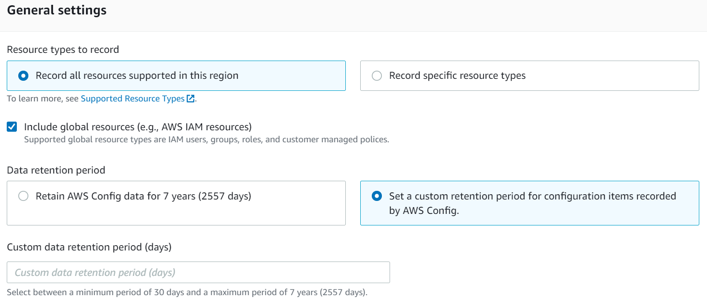
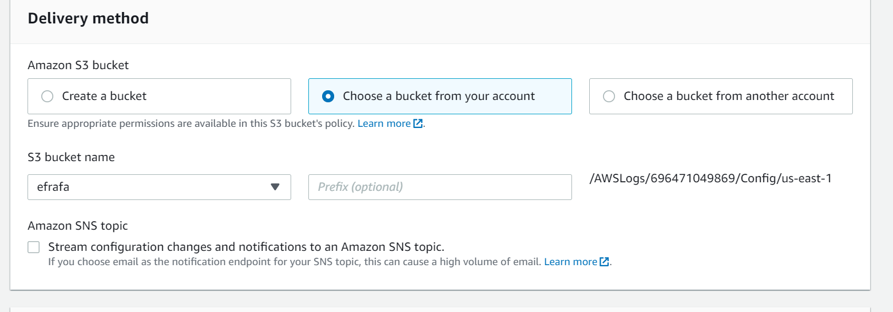
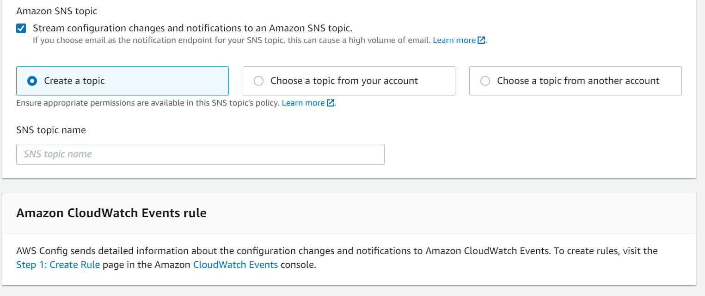
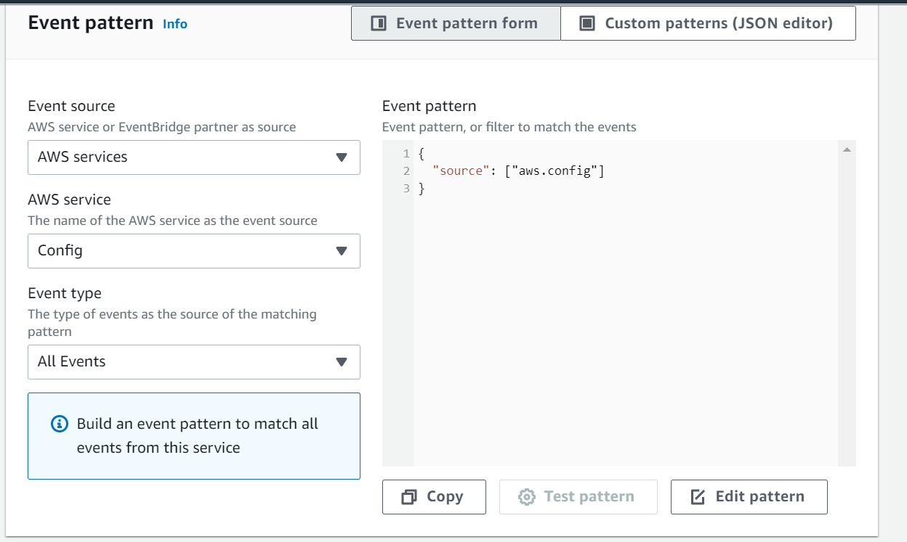

<!-- omit in toc -->
# AWS Config - Security Baseline Requirement
<!-- omit in toc -->
## Baseline security configuration requirement for AWS services ###
---

**Generated By: EY Security Team**

**Service Type: Management & Governance**

**Deployment Phase: Service Discovery** 

**Last Update: 06/27/2022**

## Table of Contents  <!-- omit in toc -->
<!-- TOC -->
- [Overview](#overview)
  - [Use Case Examples:](#use-case-examples)
- [Cloud Security Requirements](#cloud-security-requirements)
  - [1. Ensure Config utilizes VPC endpoints to prevent public access](#1-ensure-config-utilizes-vpc-endpoints-to-prevent-public-access)
  - [2. Ensure Config leverages IAM users and roles to enforce least privilege](#2-ensure-config-leverages-iam-users-and-roles-to-enforce-least-privilege)
  - [3. Ensure Config data is encrypted using organization managed KMS keys](#3-ensure-config-data-is-encrypted-using-organization-managed-kms-keys)
  - [4. Ensure Config connections are protected with TLS 1.2](#4-ensure-config-connections-are-protected-with-tls-12)
  - [5. Ensure Config service is enabled in all regions](#5-ensure-config-service-is-enabled-in-all-regions)
  - [6. Ensure global resources types(IAM) are included](#6-ensure-global-resources-typesiam-are-included)
  - [7. Ensure the delivery method for Config is configured to Organization managed S3 bucket](#7-ensure-the-delivery-method-for-config-is-configured-to-organization-managed-s3-bucket)
  - [8. Ensure SNS notifications are enabled for configurational changes](#8-ensure-sns-notifications-are-enabled-for-configurational-changes)
  - [9. Ensure the data retentions for config data follows organization standards](#9-ensure-the-data-retentions-for-config-data-follows-organization-standards)
  - [10. Ensure CloudTrail logging is enabled for AWS Config](#10-ensure-cloudtrail-logging-is-enabled-for-aws-config)
  - [11. Ensure to monitor AWS Config using Amazon EventBridge](#11-ensure-to-monitor-aws-config-using-amazon-eventbridge)
  - [12. Ensure AWS Config uses standard organizational Resource tagging method](#12-ensure-aws-config-uses-standard-organizational-resource-tagging-method)
- [Endnotes](#endnotes)
  - [Resources](#resources)
  - [Glossary](#glossary)
<!-- /TOC -->

##  Overview
AWS Config is a service that is used to assess, audit, and evaluate the configurations of AWS resources. Config continuously monitors and records AWS resource configurations and allows to automate the evaluation of recorded configurations against desired configurations. With Config, changes can be reviewed in configurations and relationships between AWS resources, dive into detailed resource configuration histories, and determine the overall compliance against the configurations specified in internal guidelines. This enables you to simplify compliance auditing, security analysis, change management, and operational troubleshooting.


| Control Number | Cloud Baseline Security Requirements                                                                        |
| -------------- | ----------------------------------------------------------------------------------------------------------- |
| 1              | Ensure Config utilizes VPC endpoints to prevent public access                                               |
| 2              | Ensure Config leverages IAM users and roles to enforce least privilege                                      |
| 3              | Ensure Config data is encrypted using organization managed KMS keys                                         |
| 4              | Ensure Config connections are protected with TLS 1.2                                                        |
| 5              | Ensure Config service is enabled in all regions                                                             |
| 6              | Ensure global resources types(IAM) are included                                                             |
| 7              | Ensure the delivery method for Config is configured to Organization managed S3 bucket                       |
| 8              | Ensure SNS notifications are enabled for configurational changes                                            |
| 9              | Ensure the data retentions for config data follows organization standards                                   |
| 10             | Ensure CloudTrail logging is enabled for AWS Config                                                         |
| 11             | Ensure to monitor AWS Config using Amazon EventBridge                                                       |
| 12             | Ensure AWS Config uses standard organizational Resource tagging method                                      |


### Use Case Examples:
- Resource Administration
- Change management
- Continuous audit and compliance
- Compliance-as-code framework
- Security analysis
- Troubleshoot operational issues

## Cloud Security Requirements ##

### 1. Ensure Config utilizes VPC endpoints to prevent public access 
        [Place Holder]

### 2. Ensure Config leverages IAM users and roles to enforce least privilege

**Security control mapping:** <br>

| Control Number | Control Statement | Security Domain | Default | Associated Runbook |CVSS Severity|
| ------------------ | ------------| --------------- | ------- | ------------------ |---|
| CS0012298 | Access to change cloud identity access and service control policies is restricted to authorized cloud administrative personnel| Identity and Access Management| Not Enabled | None |[Medium (6.8)](https://www.first.org/cvss/calculator/3.1#CVSS:3.1/AV:N/AC:H/PR:H/UI:R/S:C/C:L/I:L/A:H)|

**Why?** <br>

AWS Config integrates with AWS Identity and Access Management (IAM), which allows to create permission policies to attach to IAM role, Amazon S3 buckets and Amazon Simple Notification Service (Amazon SNS) topics. Least privilege access must be implemented by providing access to the user and resource based on job function. Allowing only the Security engineering team to manage the rules will help in maintaining least privilege, enhance the security and also avoiding unnecessary outage due to incorrect configurations by teams other than Security engineering.

**How?** <br>

It is recommended to use policies that grant least privilege, or granting only the permissions required to perform a specific task. The most secure way to grant least privilege is to write a custom policy with only the permissions needed by your team. In AWS, an IAM principal can be a user, role, or group. These identities start with no permissions and you add permissions using a policy. The main elements of a policy statement are:

**_Step 1:_** Sign in to the AWS Management Console and open the IAM console at https://console.aws.amazon.com/iam/.<br>

**_Step 2:_** In the navigation pane on the left, choose `Policies`.<br>

**_Step 3:_** Choose `Create policy`. <br>

**_Step 4:_** On the Visual editor tab, choose `Choose a service` and then choose an AWS service. For this case choose `Config`<br>

**_Step 5:_** For `Actions`, Expand each of the Access level groups to choose individual actions from the `Access level` groups to choose specific actions from the access level (for example, `Read`, `Write`, or `List`).<br>

**_Step 6:_** For Resources, Choose `Add ARN` to specify resources by their Amazon Resource Names (ARN). You can use the visual ARN editor or list ARNs manually. <br>

**_Step 7:_** (Optional) Choose Specify request conditions (optional) to `Add conditions` to the policy that you are creating. Conditions limit a JSON policy statement's effect. The Add request condition dialogue will open, provide the detail as per the need.<br>

**_Step 8:_** When you are finished, choose Next: Tags.<br>

**_Step 9:_** When you are finished, choose Next: Review.<br>

**_Step 10:_** On the Review policy page, type a Name and a Description (optional) for the policy that you are creating. Review the policy summary to make sure that you have granted the intended permissions, and then choose Create policy to save your new policy.<br>

>**Note**
By default, the policy that you are creating allows the actions that you choose. To deny the chosen actions instead, choose Switch to deny permissions. Because IAM denies by default, we recommend as a security best practice that you allow permissions to only those actions and resources that a user needs. You should create a JSON statement to deny permissions only if you want to override a permission separately allowed by another statement or policy. We recommend that you limit the number of deny permissions to a minimum because they can increase the difficulty of troubleshooting permissions.

User can create an IAM trust policy that enables AWS Config to assume a role and use it to track resources. 
```JSON
{
  "Version": "2012-10-17",
  "Statement": [
    {
      "Sid": "",
      "Effect": "Allow",
      "Principal": {
        "Service": "config.amazonaws.com"
      },
      "Action": "sts:AssumeRole",
      "Condition": { 
        "StringEquals": {
          "AWS:SourceAccount": "sourceAccountID"
        }
      }
    }
  ]
}
```

You can use the AWS:SourceAccount condition in the IAM Role Trust relationship above to restrict the Config service principal to only interact with the AWS IAM Role when performing operations on behalf of specific accounts.

The following example policy grants AWS Config permissions to access Amazon S3 bucket:

```json
{
  "Version":"2012-10-17",
  "Statement":[
    {
      "Effect":"Allow",
      "Action":[
        "s3:PutObject",
        "s3:PutObjectAcl"
      ],
      "Resource":[
        "arn:aws:s3:::myBucketName/prefix/AWSLogs/myAccountID/*"
      ],
      "Condition":{
        "StringLike":{
          "s3:x-amz-acl":"bucket-owner-full-control"
        }
      }
    },
    {
      "Effect":"Allow",
      "Action":[
        "s3:GetBucketAcl"
      ],
      "Resource":"arn:aws:s3:::myBucketName"
    }
  ]
}
```
The following example policy grants AWS Config permissions to use KMS-based encryption on new objects for S3 bucket delivery:

```json
{
    "Version": "2012-10-17",
    "Statement": [
        {
            "Effect": "Allow",
            "Action": [
                "kms:Decrypt",
                "kms:GenerateDataKey"
            ],
            "Resource": "myKMSKeyARN"
        }
    ]
}

```
- To record AWS resource configurations, AWS Config requires IAM permissions to get the configuration details about all resources. se the AWS managed policy **AWS_ConfigRole** and attach it to the IAM role that is assigned to AWS Config.

- AWS Config uses the service-linked role named **AWSServiceRoleForConfig** which is used to call other AWS services on users behalf. This service-linked role trusts the **config.amazonaws.com** service to assume the role.

<br>

### 3. Ensure Config data is encrypted using organization managed KMS keys

**Security Control Mapping :** <br>

| Control Number | Control Statement | Security Domain | Default | Associated Runbook | CVSS Severity  |
| -------------- | ----------------- | --------------- | ------- | ------------------ | -------------- |
| CS0012168 |Strong encryption key management controls are in place for cloud provider services to protect data at rest | Data Protection | Not enabled | None | [High(7.9)](https://www.first.org/cvss/calculator/3.1#CVSS:3.1/AV:N/AC:H/PR:H/UI:N/S:C/C:H/I:H/A:L) |

**Why?** <br>

Data is encrypted at rest using transparent server-side encryption. This helps reduce the operational burden and complexity involved in protecting sensitive data. With encryption at rest, enterprise can build security-sensitive applications that meet encryption compliance and regulatory requirements.

**How?** <br>

All data in Config is encrypted by default, with no further effort required by end user/developers to enable.

>Note: The CVSS score is high for this control as this service doest not support customer managed key

<br><br> 

### 4. Ensure Config connections are protected with TLS 1.2
  
**Security Control Mapping :**  <br>

| Control Number | Control Statement | Security Domain | Default | Associated Runbook | CVSS Severity  |
| -------------- | ----------------- | --------------- | ------- | ------------------ | -------------- |
| CS0012261 | Cloud based data in transit must be encrypted with enterprise approved algorithms. | Data Protection | Not enabled | None | [High(7.9)](https://www.first.org/cvss/calculator/3.1#CVSS:3.1/AV:N/AC:H/PR:H/UI:N/S:C/C:H/I:H/A:L) |

**Why?** <br>

Data gathered and accessed by AWS Config is exclusively over a Transport Layer Security (TLS) protected channel. All requests to Config must be made over the Transport Layer Security protocol (TLS). Clients must support Transport Layer Security (TLS) 1.0 or later. Organization recommends TLS 1.2 or later for config connection.

**How?** <br>

All data transmitted via Config is encrypted by default, with no further effort required by end user/developers to enable.

>Note: The CVSS score is high for this control as the encryption is not handled by client.

<br><br> 

### 5. Ensure Config service is enabled in all regions

**Security control mapping:** <br>

| Control Number | Control Statement | Security Domain | Default | Associated Runbook |CVSS Severity|
| ------------------ | ------------| --------------- | ------- | ------------------ |---|
| CS0012133 | [place holder] | Configuration Management | Not Enabled | None |[Medium(4.1)](https://www.first.org/cvss/calculator/3.1#CVSS:3.1/AV:N/AC:H/PR:H/UI:N/S:U/C:L/I:L/A:L)|

**Why?** <br>

This control checks whether AWS Config is enabled in the account for the regions and is recording all resources. Config service should be enabled in all regions in order to have complete visibility over AWS infrastructure configuration changes. Once enabled, the Config service detects existing AWS resources and records their current configurations and any changes made to them later. The data recorded by this service can be extremely useful for compliance team during security auditing or troubleshooting sessions, as it can determine how a resource was configured at a certain point in time and what relationships had with other resources.

**How?** <br>

To configure AWS Config settings

**_Step 1:_** Open the AWS Config console at https://console.aws.amazon.com/config/.

**_Step 2:_** Select the Region to configure AWS Config in.

**_Step 3:_** If you haven't used AWS Config before, see Getting Started in the AWS Config Developer Guide.

**_Step 4:_** Navigate to the Settings page from the menu, and do the following:

  -   Choose Edit.

  -   Under `Resource types to record`, select `Record all` resources supported in this region and Include global resources (e.g., AWS IAM resources).

  -   Under Data retention period, choose the default retention period for AWS Config data, or specify a custom retention period.
  
<br>
  -   Under AWS Config role, either choose Create AWS Config service-linked role or choose Choose a role from your account and then select the role to use.

  -   Under Amazon S3 bucket, specify the bucket to use or create a bucket and optionally include a prefix.

  -   Under Amazon SNS topic, select an Amazon SNS topic from your account or create one. For more information about Amazon SNS, see the Amazon Simple Notification Service Getting Started Guide.
  
**_Step 5:_** Choose Save.

<br><br>

### 6. Ensure global resources types(IAM) are included

**Security control mapping:** <br>

| Control Number | Control Statement | Security Domain | Default | Associated Runbook |CVSS Severity|
| ------------------ | ------------| --------------- | ------- | ------------------ |---|
| CS0012298 | Access to change cloud identity access and service control policies is restricted to authorized cloud administrative personnel| Identity and Access Management| Not Enabled | None |[Medium (5.1)](https://www.first.org/cvss/calculator/3.1#CVSS:3.1/AV:A/AC:H/PR:H/UI:N/S:C/C:L/I:L/A:L)|

**Why?** <br>

As per security best practice it is recommended to enable the option of 'Include Global resources' in AWS Config in order to have complete visibility over the configuration changes made within AWS account. Global resources are not tied to a specific AWS region and can be used in all regions. Including Global resources into AWS Config settings will allow to keep track of IAM resources such as IAM users, groups, roles and managed policies. The configuration data recorded with this feature enabled can be extremely useful during security audits that are targeting entire AWS account (i.e. all regions).

**How?** <br>

**_Step 1:_** Sign in to the AWS Management Console.

**_Step 2:_** Navigate to AWS Config dashboard at https://console.aws.amazon.com/config/.

**_Step 3:_** In the left navigation panel, select Settings.

**_Step 4:_** On the Settings page, under the `General settings` within Resource types `Record all resources suppoerted in this region`, check `Include global resources (e.g., AWS IAM resources)` checkbox to enable AWS Config to record configuration changes made to Global resources such as IAM users, groups, roles and customer managed policies.

<br>

**_Step 5:_** Scroll down and choose the `Delivery method` and Click on `Next`.

**_Step 6:_** Under `Rules` select the rules you want to apply.

**_Step 7:_** Click on `Next` and then `Review` the `Settings`

**_Step 8:_** Click on `Confirm`

<br><br>

### 7. Ensure the delivery method for Config is configured to Organization managed S3 bucket

**Security control mapping:** <br>

| Control Number | Control Statement | Security Domain | Default | Associated Runbook |CVSS Severity|
| ------------------ | ------------| --------------- | ------- | ------------------ |---|
| CS0012133 |[Place Holder] | Configuration Management | Not Enabled | None |[Medium(4.0)](https://www.first.org/cvss/calculator/3.1#CVSS:3.1/AV:L/AC:L/PR:N/UI:N/S:U/C:N/I:N/A:L)|

**Why?** <br>

Amazon Config tracks changes within the configuration of AWS resources and it regularly sends updated configuration details(history files and snapshots) to an S3 bucket for auditing purposes. It is suggested to use only the organization managed S3 bucket in order to protect the information from being exposed to unwanted hand. Sometimes when AWS Config is not referencing an active S3 bucket, the service is unable to send the recorded information to the designated bucket, therefore the ability to audit the configuration changes made within AWS account can be lost.

**How?** <br>

**_Step 1:_** Sign in to the AWS Management Console.

**_Step 2:_** Navigate to AWS Config dashboard at https://console.aws.amazon.com/config/.

**_Step 3:_** In the left navigation panel, select Settings.

**_Step 4:_** On the Settings page, within the Amazon S3 bucket section, choose `Choose a bucket from your account` or `Choose a bucket from another account`. While selecting bucket from another account, ensure that only organization-owned account S3 buckets are taken.

<br>

**_Step 5:_** Scroll down and choose the `Delivery method` and Click on `Next`.

**_Step 6:_** Under `Rules` select the rules you want to apply.

**_Step 7:_** Click on `Next` and then `Review` the `Settings`

**_Step 8:_** Click on `Confirm`

<br><br>

### 8. Ensure SNS notifications are enabled for configurational changes

**Security control mapping:** <br>
| Control Number | Control Statement | Security Domain | Default | Associated Runbook |CVSS Severity|
| ------------------ | ------------| --------------- | ------- | ------------------ |---|
| CS0012300| Cloud products and services must be deployed on private subnets and public access must be disabled for these services  | Network and communication Security | Not Enabled | None|[Medium(4.3)](https://www.first.org/cvss/calculator/3.1#CVSS:3.1/AV:N/AC:L/PR:N/UI:R/S:U/C:N/I:N/A:L)|


**Why?** <br>
AWS Config can be configured to stream configuration changes and notifications to an Amazon SNS topic. It is required because when a resource is updated, organization can get a notification sent to email and can view the changes and be notified when AWS Config evaluates any custom or managed rules against any AWS resources.

**How?** <br>

**_Step 1:_** Sign in to the AWS Management Console.

**_Step 2:_** Navigate to AWS Config dashboard at https://console.aws.amazon.com/config/.

**_Step 3:_** In the left navigation panel, select Settings.

**_Step 4:_** On the Settings page, within the Amazon S3 bucket section, choose ` Create a bucket` or `Choose a bucket from your account` or `Choose a bucket from another account`. While selecting bucket from another account, ensure that only organization-owned account S3 buckets are taken.

**_Step 5:_** Scroll down and choose the `Delivery method`, within `Amazon SNS topic` check the `Stream configuration changes and notifications to an Amazon SNS topic` and Under Amazon SNS topic, select an Amazon SNS topic from your account,another account or create one. 

<br>

**_Step 6:_** Under `Rules` select the rules you want to apply.

**_Step 7:_** Click on `Next` and then `Review` the `Settings`

**_Step 8:_** Click on `Confirm`

<br><br>

### 9. Ensure the data retentions for config data follows organization standards

**Security control mapping:** <br>
| Control Number | Control Statement | Security Domain | Default | Associated Runbook |CVSS Severity|
| ------------------ | ------------| --------------- | ------- | ------------------ |---|
| CS0012133 |[Place Holder] | Configuration Management | Not Enabled | None |[Low(3.5)](https://www.first.org/cvss/calculator/3.1#CVSS:3.1/AV:A/AC:L/PR:L/UI:N/S:U/C:N/I:N/A:L)|

**Why?** <br>
    
AWS Config enables to delete data by specifying a retention period for configuration items. It is recommended to set some custom retention period based on organization need as this feature helps to keep important information for future use or reference, to organize information so it can be searched and accessed at a later date and to dispose of information that is no longer needed which can save storage cost.

**How?** <br>

Creates and updates the retention configuration with details about retention period (number of days) that Config stores your historical information. The API creates the `RetentionConfiguration` object and names the object as `default` . When you have a `RetentionConfiguration` object named `default` , calling the API modifies the default object.

```
put-retention-configuration
--retention-period-in-days <value>
[--cli-input-json <value>]
[--generate-cli-skeleton <value>]
```

Pass the custom value of `--retention-period-in-days` key in integer.
<br>

### 10. Ensure CloudTrail logging is enabled for AWS Config

**Security control mapping:** <br>
| Control Number | Control Statement | Security Domain | Default | Associated Runbook |CVSS Severity|
| ------------------ | ------------| --------------- | ------- | ------------------ |---|
| CS0012233| Information system must create a log and record activities occurring on or originating from the information system.Logs must be made accessible to the enterprise SIEM solution  | Security Information and event management | Not Enabled | None|[Low(1.9)](https://www.first.org/cvss/calculator/3.1#CVSS:3.1/AV:P/AC:H/PR:H/UI:N/S:C/C:N/I:N/A:L)|

**Why?** <br>
    
AWS Config is integrated with Amazon CloudTrail, a service that provides a record of actions taken by a user, role, or an Amazon service in AWS Config. CloudTrail captures all API calls for AWS Config as events. These include calls from the AWS Config console and from code calls to the AWS Config API operations.

**How?** <br>

CloudTrail is enabled on your AWS account when you create the account. When activity occurs in AWS Config, that activity is recorded in a CloudTrail event along with other AWS service events in Event history. For an ongoing record of events in your AWS account, including events for AWS Config, create a trail. 


***To create a CloudTrail trail using API :***

To create a trail that applies to all Regions, use the `--is-multi-region-trail` option. By default, the `create-trail` command creates a trail that logs events only in the AWS Region where the trail was created. To ensure that you log global service events and capture all management event activity in your AWS account, you should create trails that log events in all AWS Regions.

The following example creates a trail with the name `my-trail` and a tag with a key named `Group` with a value of `Marketing` that delivers logs from all Regions to an existing bucket named `my-bucket`.

```
aws cloudtrail create-trail --name my-trail --s3-bucket-name my-bucket --is-multi-region-trail --tags-list [key=Group,value=Marketing]
```

To confirm that your trail exists in all Regions, the `IsMultiRegionTrail` element in the `output` shows `true`.
```
{
    "IncludeGlobalServiceEvents": true, 
    "Name": "my-trail", 
    "TrailARN": "arn:aws:cloudtrail:us-east-2:123456789012:trail/my-trail", 
    "LogFileValidationEnabled": false, 
    "IsMultiRegionTrail": true, 
    "IsOrganizationTrail": false,
    "S3BucketName": "my-bucket"
}
```

>***Note***
Use the start-logging command to start logging for your trail.

<br><br>

### 11. Ensure to monitor AWS Config using Amazon EventBridge

**Security control mapping:** <br>
| Control Number | Control Statement | Security Domain | Default | Associated Runbook |CVSS Severity|
| ------------------ | ------------| --------------- | ------- | ------------------ |---|
| CS0012233| Information system must create a log and record activities occurring on or originating from the information system.Logs must be made accessible to the enterprise SIEM solution  | Security Information and event management | Not Enabled | None|[Low(3.4)](https://www.first.org/cvss/calculator/3.1#CVSS:3.1/AV:A/AC:H/PR:L/UI:R/S:U/C:N/I:L/A:L)|

**Why?** <br>
    
AWS Config is integrated with Amazon EventBridge, a service which delivers a near real-time stream of system events that describe changes in AWS resources. Amazon EventBridge is used to detect and react to changes in the status of AWS Config events.

**How?** <br>

Use the following steps to create an EventBridge rule that triggers on an event emitted by AWS Config. Events are emitted on a best effort basis.

**_Step 1:_** Go to EventBridge management console : https://aws.amazon.com/eventbridge/

**_Step 2:_** In the navigation pane, choose Rules.

**_Step 3:_** Choose Create rule.

**_Step 4:_** Enter a name and description for the rule.

**_Step 5:_** For Define pattern, choose Event pattern.

**_Step 6:_** Choose Pre-defined pattern by service

**_Step 7:_** For Service provider, choose AWS.

**_Step 8:_** For Service name, choose Config.

**_Step 9:_** For Event Type, choose the event type that triggers the rule.

<br>

**_Step 10:_** Choose Any message type to receive notifications of any type.

**_Step 11:_** If you chose a specific event type from the Event Type dropdown list, choose Any resource type to make a rule that applies to all AWS Config supported resource types.

**_Step 12:_** If you chose a specific event type from the Event Type dropdown list, choose Any resource ID to include any AWS Config supported resource ID.

**_Step 13:_** If you chose a specific event type from the Event Type dropdown list, choose Any rule name to include any AWS Config supported rule.

**_Step 14:_** For Select event bus, choose the event bus that you want to associate with this rule. If you want this rule to match events that come from your account, select AWS default event bus.

**_Step 15:_** For Select targets, choose the type of target you have prepared to use with this rule, and then configure any additional options required by that type.

**_Step 16:_** The fields displayed vary depending on the service you choose. Enter information specific to this target type as needed.

**_Step 17:_** For many target types, EventBridge needs permissions to send events to the target. 

**_Step 18:_** For Retry policy and dead-letter queue:, under Retry policy:

  -   For Maximum age of event, enter a value between one minute (00:01) and 24 hours (24:00).

  -   For Retry attempts, enter a number between 0 and 185.

**_Step 19:_** For Dead-letter queue, choose whether to use a standard Amazon SQS queue as a dead-letter queue.

**_Step 20:_** (Optional) Choose Add target to add another target for this rule.

**_Step 21:_** (Optional) Enter one or more tags for the rule

**_Step 22:_** Review your rule setup to make sure it meets your event-monitoring requirements.

**_Step 23:_** Choose Create to confirm your selection.

<br><br>

### 12. Ensure AWS Config uses standard organizational Resource tagging method

**Security control mapping:** <br>

| Control Number | Control Statement | Security Domain | Default | Associated Runbook |CVSS Severity|
| ------------------ | ------------| --------------- | ------- | ------------------ |---|
|CS0012128| Technology hardware and software must be registered and accurately recorded within the enterprise technology repository and/or asset management systems | Asset Management | Not Enabled | Organizational Runbook |[Low(1.6)](https://www.first.org/cvss/calculator/3.1#CVSS:3.1/AV:P/AC:H/PR:H/UI:N/S:U/C:N/I:N/A:L)|


**What, Why & How?** <br>

Identification of your IT assets is a crucial aspect of governance and security. You need to have visibility of all Config resources to assess their security posture and take action on potential areas of weakness.

Tagging resources in the cloud is an easy way for teams to provide information related to who owns the resource, what the resource is used for, as well as other important information related to the deployment lifecycle of the resource. Organization has mandated that all cloud resources are to be tagged with for cross-team use.

[Place holder to add confluence link]

<br><br>


## Endnotes ##

### Resources 
1. https://aws.amazon.com/config/
2. https://docs.aws.amazon.com/config/latest/developerguide/WhatIsConfig.html

### Glossary 

**Data** - Digital pieces of information stored or transmitted for use with an information system from which understandable information is
derived. Items considered to be data are: Source code, meta-data, build artifacts, information input and output.

**Information System** - An organized assembly of resources and procedures for the collection, processing, maintenance, use, sharing,
dissemination, or disposition of information. All systems, platforms, compute instances including and not limited to physical and virtual
client endpoints, physical and virtual servers, software containers, databases, Internet of Things (IoT) devices, network devices,
applications (internal and external), Serverless computing instances (i.e. AWS Lambda), vendor provided appliances, and third-party
platforms, connected to the Capital Group network or used by Capital Group users or customers.

**Log** - a record of the events occurring within information systems and networks. Logs are composed of log entries; each entry contains
information related to a specific event that has occurred within a system or network.

**Information** - communication or representation of knowledge such as facts, data, or opinions in any medium or form, including textual,
numerical, graphic, cartographic, narrative, or audiovisual.

**Cloud Computing** - A model for enabling ubiquitous, convenient, on-demand network access to a shared pool of configurable computing
resources (e.g., networks, servers, storage, applications, and services) that can be rapidly provisioned and released with minimal
management effort or service provider interaction.

**Vulnerability**- Weakness in an information system, system security procedures, internal controls, or implementation that could be exploited
or triggered by a threat source. Note: The term weakness is synonymous for deficiency. Weakness may result in security and/or privacy
risks.
