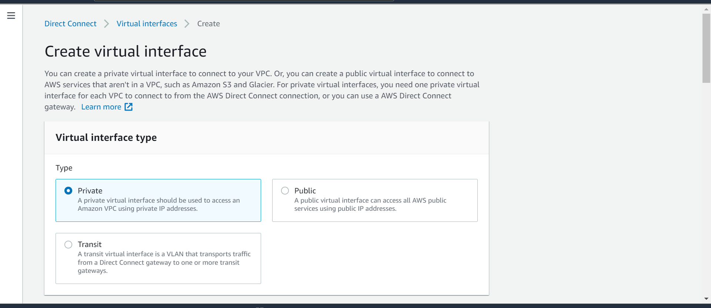
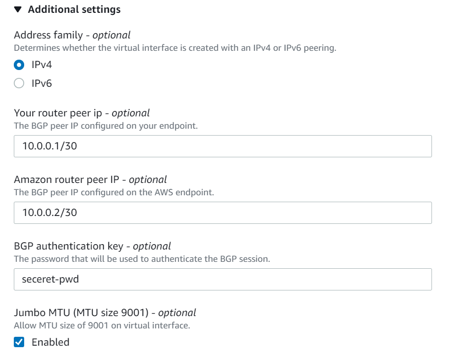
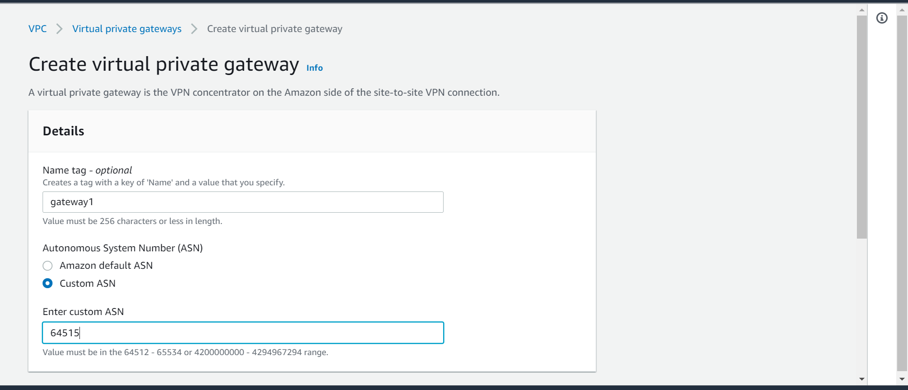
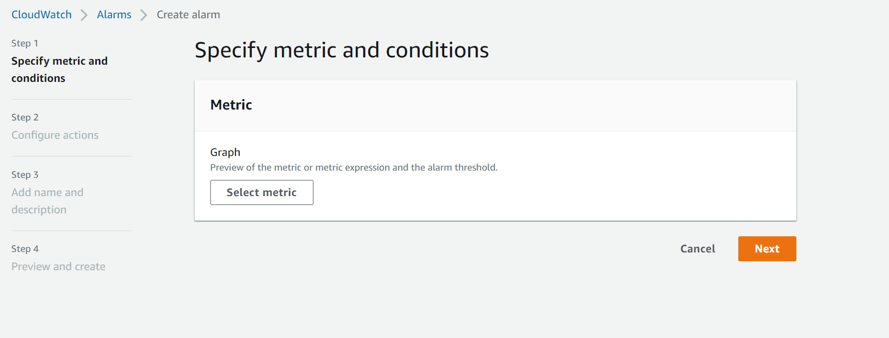
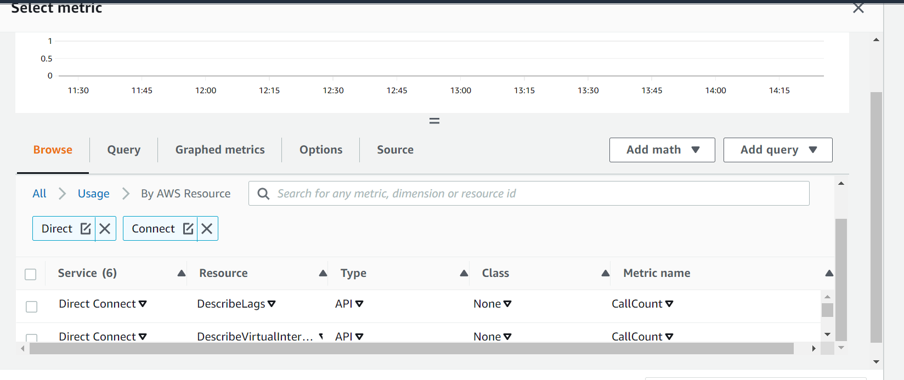

<!-- omit in toc -->
# AWS Direct Connect - Security Baseline Requirement
<!-- omit in toc -->
## Baseline security configuration requirement for AWS services ###
---


Summary of changes: 
1. Added new controls
2. Updated the security control mappings
3. Added implementation steps


**Generated By: EY Security Team**

**Service Type: Networking & Content Delivery**

**Deployment Phase: Service Discovery** 

**Last Update: 07/04/2022**

## Table of Contents  <!-- omit in toc -->
<!-- TOC -->
- [Overview](#overview)
  - [Use Case Examples:](#use-case-examples)
- [Cloud Security Requirements](#cloud-security-requirements)
  - [1. Ensure AWS Direct Connect is provisioned in private VPC connectivity model only](#1-ensure-aws-direct-connect-is-provisioned-in-private-vpc-connectivity-model-only)
  - [2. Ensure AWS Direct Connect leverages IAM users and roles to enforce least privilege](#2-ensure-aws-direct-connect-leverages-iam-users-and-roles-to-enforce-least-privilege)
  - [3. Ensure AWS Direct connect is encrypted end to end](#3-ensure-aws-direct-connect-is-encrypted-end-to-end)
  - [4. Ensure public virtual interfaces are not configured in AWS Direct Connect](#4-ensure-public-virtual-interfaces-are-not-configured-in-aws-direct-connect)
  - [5. Ensure consistent use of private Autonomous System Number(ASN) in AWS Direct Connect](#5-ensure-consistent-use-of-private-autonomous-system-numberasn-in-aws-direct-connect)
  - [6. Ensure the number of advertisements to AWS Direct Connect doesn’t reach the AWS limit (100)](#6-ensure-the-number-of-advertisements-to-aws-direct-connect-doesnt-reach-the-aws-limit-100)
  - [7. Ensure CloudTrail logging is enabled for AWS Direct connect](#7-ensure-cloudtrail-logging-is-enabled-for-aws-direct-connect)
  - [8. Ensure to monitor Direct Connect with Amazon CloudWatch](#8-ensure-to-monitor-direct-connect-with-amazon-cloudwatch)
  - [9. Ensure AWS Direct Connect uses standard organizational resource tagging method](#9-ensure-aws-direct-connect-uses-standard-organizational-resource-tagging-method)
- [Endnotes](#endnotes)
  - [Resources](#resources)
  - [Glossary](#glossary)
<!-- /TOC -->

##  Overview
AWS Direct Connect is a network service that provides an alternative to using the Internet to utilize AWS cloud services. AWS Direct Connect enables customers to have low latency, secure and private connections to AWS for workloads which require higher speed or lower latency than the internet.
AWS Direct Connect is a feature by the AWS that helps connect to the environment of AWS directly through the environment in which the user is currently in. This connection is established with the help of a standard Ethernet fiber-optic cable. Since a direct connection is established, time and cost-effective nature is a highlight of this feature, in addition to bypassing the internet service providers in the path. This connection can be used to create a virtual private cloud (VPC).

| Control Number | Cloud Baseline Security Requirements                                                                        |
| -------------- | ----------------------------------------------------------------------------------------------------------- |
| 1              | Ensure AWS Direct Connect is provisioned in private VPC connectivity model only                             |
| 2              | Ensure AWS Direct Connect leverages IAM users and roles to enforce least privilege                          |
| 3              | Ensure AWS Direct connect is encrypted end to end                                                           |
| 4              | Ensure public virtual interfaces are not configured in AWS Direct Connect                                   |
| 5              | Ensure consistent use of private Autonomous System Number(ASN) in AWS Direct Connect                        |
| 6              | Ensure the number of advertisements to AWS Direct Connect doesn’t reach the AWS limit (100)                 |
| 7              | Ensure CloudTrail logging is enabled for AWS Direct connect                                                 |
| 8              | Ensure to monitor Direct Connect with Amazon CloudWatch                                                     |
| 9              | Ensure AWS Direct Connect uses standard organizational resource tagging method                              |


### Use Case Examples:
- Build hybrid networks
- Extend existing network
- Manage large datasets

## Cloud Security Requirements ##

### 1. Ensure AWS Direct Connect is provisioned in private VPC connectivity model only
        [Place Holder]

### 2. Ensure AWS Direct Connect leverages IAM users and roles to enforce least privilege

**Security control mapping:** <br>
| Control Number | Control Statement | Security Domain | Default | Associated Runbook |CVSS Severity|
| ------------------ | ------------| --------------- | ------- | ------------------ |---|
| CS0012298 | Access to change cloud identity access and service control policies is restricted to authorized cloud administrative personnel| Identity and Access Management| Not Enabled | None |[Medium (6.8)](https://www.first.org/cvss/calculator/3.1#CVSS:3.1/AV:N/AC:H/PR:H/UI:R/S:C/C:L/I:L/A:H)|

**Why?** <br>

By default, IAM users and roles don't have permission to create or modify Direct Connect resources. They also can't perform tasks using the AWS Management Console, AWS CLI, or AWS API. An IAM administrator must create IAM policies that grant users and roles permission to perform specific API operations on the specified resources they need. The administrator must then attach those policies to the IAM users or groups that require those permissions. AWS Direct Connect uses AWS Identity and Access Management (IAM) service-linked roles. A service-linked role is a unique type of IAM role that is linked directly to AWS Direct Connect. Service-linked roles are predefined by AWS Direct Connect and include all the permissions that the service requires to call other AWS services on your behalf.

**Following are the suggested RBAC roles for AWS Direct Connect** <br>
| Function | Description | Role | 
| -------------- | ----------------- | --------------- | 
|  Network admin | Responsible for configuring private VPC connection | Networkadmin |
|  Monitoring admin | Responsible for monitoring and auditing the config logs | MonitoringPlatformadmin |
|  Developer | Responsible for granting identity based access to users| Custom resource role developed by IAM admin team |
| Config admin team | This service-linked role is responsible to retrieve the MACSec secretes stored in AWS Secrets Manager |AWSServiceRoleForDirectConnect|
<br>

**How?** <br>

**_Step 1:_** Sign in to the AWS Management Console and Open IAM console.https://console.aws.amazon.com/iamv2/<br> 
**_Step 2:_** Click on User group and create a group.<br> 
**_Step 3:_** Now click on user and create some users and add the required users to the group.<br> 
**_Step 4:_** Click on Policy and create a policy for Direct Connect eg. AWS Direct Connect read only access and attach this policy to the group.<br> 

The following example policy grants read access to AWS Direct Connect.

```JSON
{
    "Version": "2012-10-17",
    "Statement": [
        {
            "Effect": "Allow",
            "Action": [
                "directconnect:Describe*"
            ],
            "Resource": "arn:aws:directconnect:us-east-1:123456789012:dxcon/dxcon-11aa22bb"
        }
    ]
}
```

This example shows how you might create a policy that allows IAM users to view the inline and managed policies that are attached to their user identity. This policy includes permissions to complete this action on the console or programmatically using the AWS CLI or AWS API.

```JSON
{
    "Version": "2012-10-17",
    "Statement": [
        {
            "Sid": "ViewOwnUserInfo",
            "Effect": "Allow",
            "Action": [
                "iam:GetUserPolicy",
                "iam:ListGroupsForUser",
                "iam:ListAttachedUserPolicies",
                "iam:ListUserPolicies",
                "iam:GetUser"
            ],
            "Resource": ["arn:aws:iam::*:user/${aws:username}"]
        },
        {
            "Sid": "NavigateInConsole",
            "Effect": "Allow",
            "Action": [
                "iam:GetGroupPolicy",
                "iam:GetPolicyVersion",
                "iam:GetPolicy",
                "iam:ListAttachedGroupPolicies",
                "iam:ListGroupPolicies",
                "iam:ListPolicyVersions",
                "iam:ListPolicies",
                "iam:ListUsers"
            ],
            "Resource": "ARNs of respective service"
        }
    ]
}
```
The following example shows how you might create a policy that allows associating a virtual interface only if the tag contains the environment key and the preprod or production values.

```JSON
       {
      "Version": "2012-10-17",
      "Statement": [
        {
          "Effect": "Allow",
          "Action": [
            "directconnect:AssociateVirtualInterface"
          ],
          "Resource": "arn:aws:directconnect:*:*:dxvif/abcdef",
          "Condition": {
            "StringEquals": {
              "aws:ResourceTag/environment": [
                "preprod",
                "production"
              ]
            }
          }
        },
        {
          "Effect": "Allow",
          "Action": "directconnect:DescribeVirtualInterfaces",
          "Resource": "arn:aws:directconnect:*:*:dxvif/abcdef"
        }
      ]
    }
```
AWS Direct Connect uses a service-linked role named **AWSServiceRoleForDirectConnect**. This allows AWS Direct Connect to retrieve the MACSec secretes stored in AWS Secrets Manager on user behalf.

The AWSServiceRoleForDirectConnect service-linked role trusts `directconnect.amazon.com` to assume the role:

```JSON
{
    "Version": "2012-10-17",
    "Statement": [
        {
            "Action": "iam:CreateServiceLinkedRole",
            "Condition": {
                "StringLike": {
                    "iam:AWSServiceName": "directconnect.amazonaws.com"
                }
            },
            "Effect": "Allow",
            "Resource": "ARNs of respective service"
        },
        {
            "Action": "iam:GetRole",
            "Effect": "Allow",
            "Resource": "ARNs of respective service"
       }
    ]
}
```
<br><br>

### 3. Ensure AWS Direct connect is encrypted end to end 

**Security Control Mapping :**  <br>

| Control Number | Control Statement | Security Domain | Default | Associated Runbook | CVSS Severity  |
| -------------- | ----------------- | --------------- | ------- | ------------------ | -------------- |
| CS0012261 | Cloud based data in transit must be encrypted with enterprise approved algorithms. | Data Protection | Not enabled | None | [Medium (5.3)](https://www.first.org/cvss/calculator/3.1#CVSS:3.1/AV:A/AC:H/PR:H/UI:N/S:U/C:H/I:L/A:L) |

**What,Why & How ?** <br>

AWS Direct Connect does not encrypt your traffic that is in transit by default. To encrypt the data in transit that traverses AWS Direct Connect, you must use the transit encryption options for that service.
With AWS Direct Connect and AWS Site-to-Site VPN, enterprise can combine one or more AWS Direct Connect dedicated network connections with the Amazon VPC VPN. This combination provides an IPsec-encrypted private connection that also reduces network costs, increases bandwidth throughput, and provides a more consistent network experience than internet-based VPN connections

<br><br>

### 4. Ensure public virtual interfaces are not configured in AWS Direct Connect 

**Security control mapping:** <br>
| Control Number | Control Statement | Security Domain | Default | Associated Runbook |CVSS Severity|
| ------------------ | ------------| --------------- | ------- | ------------------ |---|
| CS0012300| Cloud products and services must be deployed on private subnets and public access must be disabled for these services  | Network and communication Security | Not Enabled | None|[Medium(6.0)](https://www.first.org/cvss/calculator/3.1#CVSS:3.1/AV:N/AC:H/PR:L/UI:N/S:C/C:L/I:L/A:L)|

**Why?** <br>

A public virtual interface can access all AWS public services using public IP addresses so it is recommended to restrict the public exposure of direct connect by creating either private or transit virtual interface.

**How?** <br>

**_Step 1:_** Open the AWS Direct Connect console at https://console.aws.amazon.com/directconnect/v2/home.<br>
**_Step 2:_** In the navigation pane, choose **Virtual Interfaces** then Choose **Create virtual interface**.<br>
**_Step 3:_** Under Virtual interface type, for Type, choose **Private**.
<br>

**_Step 4:_** Under **Private virtual interface settings**,do the following:

  a. For **Virtual interface name**, enter a name for the virtual interface.<br>

  b. For **Connection**, choose the Direct Connect connection that you want to use for this interface.

  c. For **Gateway** type, choose **Virtual private gateway**, or **Direct Connect gateway**.

  d. For **Virtual interface owner**, choose **Another AWS account**, and then enter the AWS account.<br>

  e. For **Virtual private gateway**, choose the virtual private gateway to use for this interface.

  f. For **VLAN**, enter the ID number for your virtual local area network (VLAN).

  g. For **BGP ASN**, enter the Border Gateway Protocol Autonomous System Number of your on-premises peer router for the new virtual interface.The valid values are 1-2147483647.<br>

**_Step 5:_** Under **Additional Settings**, do the following:

  a. To configure an IPv4 BGP or an IPv6 peer, do the following:

  [IPv4] To configure an IPv4 BGP peer, choose **IPv4** and do one of the following:

  - To specify these IP addresses yourself, for Your router peer ip, enter the destination IPv4 CIDR address to which Amazon should send traffic.

  - For Amazon router peer ip, enter the IPv4 CIDR address to use to send traffic to AWS.
  
  <br>

  [IPv6] To configure an IPv6 BGP peer, choose **IPv6**. The peer IPv6 addresses are automatically assigned from Amazon's pool of IPv6 addresses. You cannot specify custom IPv6 addresses.

  b. To change the maximum transmission unit (MTU) from 1500 (default) to 9001 (jumbo frames), select **Jumbo MTU (MTU size 9001)**.

  c. (Optional) Under **Enable SiteLink**, choose **Enabled** to enable direct connectivity between Direct Connect points of presence.

  d. (Optional) Add or remove a tag.
  
  [Add a tag] Choose **Add tag** and do the following:
  
  - For **Key**, enter the key name.

  - For **Value**, enter the key value.

  [Remove a tag] Next to the tag, choose **Remove tag**.

**_Step 6:_** Choose **Create virtual interface**.

**_Step 7:_** Download the router configuration for your device. For more information, see Download the router configuration file.

<br><br> 

### 5. Ensure consistent use of private Autonomous System Number(ASN) in AWS Direct Connect

**Security control mapping:** <br>
| Control Number | Control Statement | Security Domain | Default | Associated Runbook |CVSS Severity|
| ------------------ | ------------| --------------- | ------- | ------------------ |---|
| CS0012133 |[Place Holder] | Configuration Management | Not Enabled | None |[Medium(4.0)](https://www.first.org/cvss/calculator/3.1#CVSS:3.1/AV:L/AC:L/PR:N/UI:N/S:U/C:N/I:N/A:L)|

**Why?** <br>
ASN is a unique identifier that is globally available and allows its autonomous system to exchange routing information with other systems. As per security best practice it is recommended to use organization created private ASN numbers instead of AWS provided.

**How?** <br>

**_Step 1:_** Open the AWS Direct Connect console at https://console.aws.amazon.com/directconnect/v2/home.<br>

**_Step 2:_** on the navigation pane, click on virtual private gateway.<br>

**_Step 3:_** Now under name tag, add a name for virtual private gateway.<br>

**_Step 4:_** under Autonomous System Number (ASN), select custom ASN and add ASN between this 64512 - 65534 or 4200000000 - 4294967294 range and create the gateway.<br>

 <br>

<br><br> 

### 6. Ensure the number of advertisements to AWS Direct Connect doesn’t reach the AWS limit (100)

**Security control mapping:** <br>
| Control Number | Control Statement | Security Domain | Default | Associated Runbook |CVSS Severity|
| ------------------ | ------------| --------------- | ------- | ------------------ |---|
| CS0012133 |[Place Holder] | Configuration Management | Not Enabled | None |[Medium(5.4)](https://www.first.org/cvss/calculator/3.1#CVSS:3.1/AV:N/AC:L/PR:L/UI:R/S:C/C:N/I:L/A:L)|

**Why?** <br>
It is suggested to advertise up to 100 routes over each Border Gateway Protocol session using AWS Direct Connect. Border Gateway Protocol session will go in idle state and then go down if number of advertisements is more than 100 routes over a Border Gateway Protocol session. This will prevent all network traffic flowing over that virtual interface until the number of routes is reduced to less than 100.

**How?** <br>

To view the quotas for a service

**_Step 1:_** Sign in to the AWS Management Console and open the Service Quotas console at https://console.aws.amazon.com/servicequotas/home.

**_Step 2:_** In the navigation pane, choose AWS services.

**_Step 1:_** Select an AWS service from the list, or type the name of 'Direct Connect' service in the search field. For each quota, the console displays the name, applied quota, default quota, and whether the quota is adjustable. If the applied value is not available, the console displays Not available.

<br>

To view additional information about a quota, such as its description and Amazon Resource Name (ARN), choose the quota name.

For more details, refer the link: https://docs.aws.amazon.com/directconnect/latest/UserGuide/limits.html

<br><br> 


### 7. Ensure CloudTrail logging is enabled for AWS Direct connect

**Security control mapping:** <br>
| Control Number | Control Statement | Security Domain | Default | Associated Runbook |CVSS Severity|
| ------------------ | ------------| --------------- | ------- | ------------------ |---|
| CS0012233| Information system must create a log and record activities occurring on or originating from the information system.Logs must be made accessible to the enterprise SIEM solution  | Security Information and event management | Not Enabled | None|[Low(1.9)](https://www.first.org/cvss/calculator/3.1#CVSS:3.1/AV:P/AC:H/PR:H/UI:N/S:C/C:N/I:N/A:L)|

**Why?** <br>
    
AWS Direct Connect is integrated with AWS CloudTrail, a service that provides a record of actions taken by a user, role, or an AWS service in AWS Direct Connect. CloudTrail captures all API calls for AWS Direct Connect as events. The calls captured include calls from the AWS Direct Connect console and code calls to the AWS Direct Connect API operations. 

**How?** <br>

CloudTrail is enabled on your AWS account when you create the account. When activity occurs in AWS Config, that activity is recorded in a CloudTrail event along with other AWS service events in Event history. For an ongoing record of events in your AWS account, including events for AWS DirectConnect, create a trail. 


***To create a CloudTrail trail using API :***

To create a trail that applies to all Regions, use the `--is-multi-region-trail` option. By default, the `create-trail` command creates a trail that logs events only in the AWS Region where the trail was created. To ensure that you log global service events and capture all management event activity in your AWS account, you should create trails that log events in all AWS Regions.

The following example creates a trail with the name `my-trail` and a tag with a key named `Group` with a value of `Marketing` that delivers logs from all Regions to an existing bucket named `my-bucket`.

```
aws cloudtrail create-trail --name my-trail --s3-bucket-name my-bucket --is-multi-region-trail --tags-list [key=Group,value=Marketing]
```

To confirm that your trail exists in all Regions, the `IsMultiRegionTrail` element in the `output` shows `true`.
```
{
    "IncludeGlobalServiceEvents": true, 
    "Name": "my-trail", 
    "TrailARN": "arn:aws:cloudtrail:us-east-2:123456789012:trail/my-trail", 
    "LogFileValidationEnabled": false, 
    "IsMultiRegionTrail": true, 
    "IsOrganizationTrail": false,
    "S3BucketName": "my-bucket"
}
```

>***Note***
Use the start-logging command to start logging for your trail.
<br><br> 

### 8. Ensure to monitor Direct Connect with Amazon CloudWatch 

**Security control mapping:** <br>
| Control Number | Control Statement | Security Domain | Default | Associated Runbook |CVSS Severity|
| ------------------ | ------------| --------------- | ------- | ------------------ |---|
| CS0012233| Information system must create a log and record activities occurring on or originating from the information system.Logs must be made accessible to the enterprise SIEM solution  | Security Information and event management | Not Enabled | None|[Low(3.4)](https://www.first.org/cvss/calculator/3.1#CVSS:3.1/AV:A/AC:H/PR:L/UI:R/S:U/C:N/I:L/A:L)|

**Why?** <br>
    
AWS Direct Connect is integrated with Amazon CloudWatch, a service which is a metrics repository for AWS services that allow security teams to retrieve statistics based on the metrics and dimensions published by AWS Direct Connect. Organization's security team recommends to use these metrics to configure alarms, calculate statistics and then present the data in a dashboard which helps to assess the health of AWS Direct Connect environment.

**How?** <br>

You can create a CloudWatch alarm that sends an Amazon SNS message when the alarm changes state. An alarm watches a single metric over a time period that you specify. It sends a notification to an Amazon SNS topic based on the value of the metric relative to a given threshold over a number of time periods.

For example, you can create an alarm that monitors the state of an AWS Direct Connect connection. It sends a notification when the connection state is down for five consecutive 1-minute periods.

**To create an alarm for the connection state**

**_Step 1:_** Open the CloudWatch console at https://console.aws.amazon.com/cloudwatch/.

**_Step 2:_** In the navigation pane, choose Alarms.

**_Step 3:_** Choose Create Alarm.

<br>

**_Step 4:_** Choose the DX Metrics category.

<br>

**_Step 5:_** Select the AWS Direct Connect connection and choose the **ConnectionState** metric. Choose **Next**.

**_Step 6:_** Configure the alarm as follows, and then choose **Create Alarm**:

  - For **Alarm Threshold**, enter a name and description for your alarm. For **Whenever**, choose < and enter 1. Enter 5 for the consecutive periods.

  - For **Actions**, select an existing notification list or choose New list to create a new one.

  - For **Alarm Preview**, select a period of 1 minute.

<br><br> 

### 9. Ensure AWS Direct Connect uses standard organizational resource tagging method

**Security control mapping:** <br>
| Control Number | Control Statement | Security Domain | Default | Associated Runbook |CVSS Severity|
| ------------------ | ------------| --------------- | ------- | ------------------ |---|
|CS0012128| Technology hardware and software must be registered and accurately recorded within the enterprise technology repository and/or asset management systems | Asset Management | Not Enabled | Organizational Runbook |[Low(1.6)](https://www.first.org/cvss/calculator/3.1#CVSS:3.1/AV:P/AC:H/PR:H/UI:N/S:U/C:N/I:N/A:L)|


**What, Why & How?** <br>

Identification of your IT assets is a crucial aspect of governance and security. You need to have visibility of all CloudFormation resources to assess their security posture and take action on potential areas of weakness.

Tagging resources in the cloud is an easy way for teams to provide information related to who owns the resource, what the resource is used for, as well as other important information related to the deployment lifecycle of the resource. Organization has mandated that all cloud resources are to be tagged with for cross-team use.

[Place Holder for sharepoint link]
<br><br> 


## Endnotes ##

### Resources 
1. https://docs.aws.amazon.com/directconnect/latest/UserGuide/Welcome.html
2. https://aws.amazon.com/directconnect/

### Glossary 

**Data** - Digital pieces of information stored or transmitted for use with an information system from which understandable information is
derived. Items considered to be data are: Source code, meta-data, build artifacts, information input and output.

**Information System** - An organized assembly of resources and procedures for the collection, processing, maintenance, use, sharing,
dissemination, or disposition of information. All systems, platforms, compute instances including and not limited to physical and virtual
client endpoints, physical and virtual servers, software containers, databases, Internet of Things (IoT) devices, network devices,
applications (internal and external), Serverless computing instances (i.e. AWS Lambda), vendor provided appliances, and third-party
platforms, connected to the Capital Group network or used by Capital Group users or customers.

**Log** - a record of the events occurring within information systems and networks. Logs are composed of log entries; each entry contains
information related to a specific event that has occurred within a system or network.

**Information** - communication or representation of knowledge such as facts, data, or opinions in any medium or form, including textual,
numerical, graphic, cartographic, narrative, or audiovisual.

**Cloud Computing** - A model for enabling ubiquitous, convenient, on-demand network access to a shared pool of configurable computing
resources (e.g., networks, servers, storage, applications, and services) that can be rapidly provisioned and released with minimal
management effort or service provider interaction.

**Vulnerability**- Weakness in an information system, system security procedures, internal controls, or implementation that could be exploited
or triggered by a threat source. Note: The term weakness is synonymous for deficiency. Weakness may result in security and/or privacy
risks.
