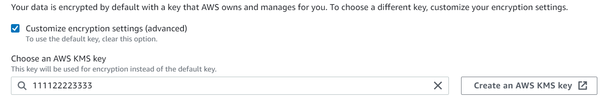
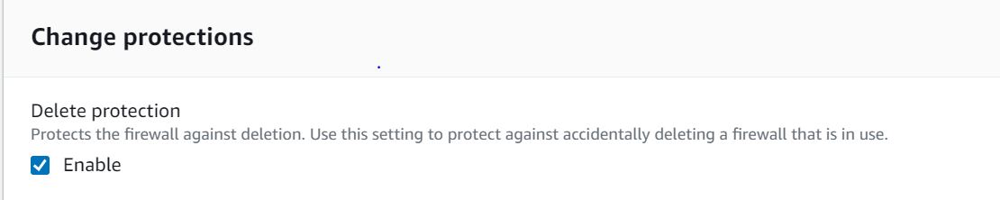
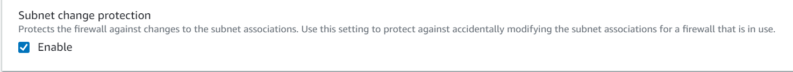
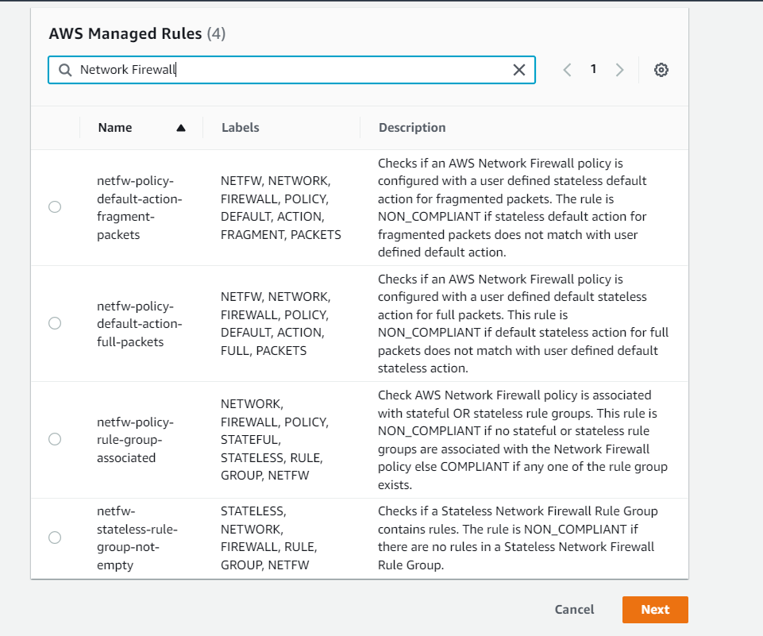
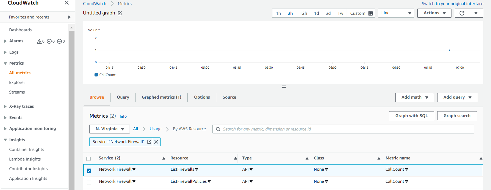

<!-- omit in toc -->
# AWS Network Firewall - Security Baseline Requirement
<!-- omit in toc -->
## Baseline security configuration requirement for AWS services 

**Generated By: EY Security Team**

**Service Type: Security, Identity, & Compliance**

**Deployment Phase: Service Discovery** 

**Last Update: 07/22/2022**

## Table of Contents  <!-- omit in toc -->
<!-- TOC -->
- [Overview](#overview)
  - [Use Case Examples:](#use-case-examples)
- [Cloud Security Requirements](#cloud-security-requirements)
  - [1. Ensure AWS Network Firewall users and roles are following least privilege model](#1-ensure-aws-network-firewall-users-and-roles-are-following-least-privilege-model)
  - [2. Ensure data is encrypted at rest using organization managed key(CMK)](#2-ensure-data-is-encrypted-at-rest-using-organization-managed-keycmk)
  - [3. Ensure to enable deletion protection feature for AWS Network Firewalls](#3-ensure-to-enable-deletion-protection-feature-for-aws-network-firewalls)
  - [4. Ensure to enable subnet change protection feature for AWS Network Firewalls](#4-ensure-to-enable-subnet-change-protection-feature-for-aws-network-firewalls)
  - [5. Ensure AWS config is enabled to evaluate the configurations of Network Firewall Policy](#5-ensure-aws-config-is-enabled-to-evaluate-the-configurations-of-network-firewall-policy)
  - [6. Ensure to enable Cloudtrail for AWS Network Firewalls](#6-ensure-to-enable-cloudtrail-for-aws-network-firewalls)
  - [7. Ensure to monitor AWS Network Firewalls using Amazon CloudWatch](#7-ensure-to-monitor-aws-network-firewalls-using-amazon-cloudwatch)
  - [8. Ensure AWS Network Firewalls uses standard organizational resource tagging method](#8-ensure-aws-network-firewalls-uses-standard-organizational-resource-tagging-method)
- [Endnotes](#endnotes)
  - [Resources](#resources)
  - [Glossary](#glossary)
<!-- /TOC -->

##  Overview
AWS Network Firewall is a managed service that makes it easy to deploy essential network protections for all of Amazon Virtual Private Clouds (VPCs). The service can be setup with just a few clicks and scales automatically with network traffic, so users don't have to worry about deploying and managing any infrastructure. AWS Network Firewall’s flexible rules engine helps to define firewall rules that give fine-grained control over network traffic, such as blocking outbound Server Message Block (SMB) requests to prevent the spread of malicious activity. Enterprise can also import rules which is already written in common open source rule formats as well as enable integrations with managed intelligence feeds sourced by AWS partners. AWS Network Firewall works together with AWS Firewall Manager so it can build policies based on AWS Network Firewall rules and then centrally apply those policies across VPCs and accounts.

| Control Number | Cloud Baseline Security Requirements                                                                        |
| -------------- | ----------------------------------------------------------------------------------------------------------- |
| 1              | Ensure AWS Network Firewall users and roles are following least privilege model                             |
| 2              | Ensure data is encrypted at rest using organization managed key(CMK)                                        |
| 3              | Ensure to enable deletion protection feature for AWS Network Firewalls                                      |
| 4              | Ensure to enable subnet change protection feature for AWS Network Firewalls                                 |
| 5              | Ensure AWS config is enabled to evaluate the configurations of Network Firewall Policy                      |
| 6              | Ensure to enable Cloudtrail for AWS Network Firewalls                                                       |
| 7              | Ensure to monitor AWS Network Firewalls using Amazon CloudWatch                                             |
| 8              | Ensure AWS Network Firewalls uses standard organizational resource tagging method                           |


### Use Case Examples:
- Managed infrastructure for high availability
- Flexible protection through fine-grained controls
- Consistent policy management across VPCs and accounts

## Cloud Security Requirements

### 1. Ensure AWS Network Firewall users and roles are following least privilege model

**Security Control Mapping :**  <br>
| Control Number | Control Statement | Security Domain | Default | Associated Runbook | CVSS Severity  |
| -------------- | ----------------- | --------------- | ------- | ------------------ | -------------- |
| CS0012298 | Access to change cloud identity access and service control policies is restricted to authorized cloud administrative personnel |  Identity & Access Management | Not enabled |None | [Medium (6.8)](https://www.first.org/cvss/calculator/3.1#CVSS:3.1/AV:N/AC:H/PR:H/UI:R/S:C/C:L/I:L/A:H) |

**Why?** <br>
By default, IAM users and roles don't have permission to create or modify Network Firewall resources. They also can't perform tasks using the AWS Management Console, AWS CLI, or AWS API. An IAM administrator must create IAM policies that grant users and roles permission to perform specific API operations on the specified resources they need. The administrator must then attach those policies to the IAM users or groups that require those permissions. Network Firewall supports identity-based policies and service-linked roles. With IAM identity-based policies,allowed or denied actions can be specified and resources as well as the conditions under which actions are allowed or denied. AWS Network Firewall uses IAM service-linked roles which are predefined by Network Firewall and include all the permissions that the service requires to call other AWS services on enterprise behalf.

**Following are the suggested roles for AWS Network Firewalls** <br>
| Function | Description | Role | 
| -------------- | ----------------- | --------------- | 
| Network admin | Responsible for creating AWS Network firewall | Networkadmin |
| IAM Admin | Responsible for creating service-linked role to call other AWS services |AWSServiceRoleForNetworkFirewall|
| IAM Admin | Responsible for granting identity based read only access | Custom resource role developed by IAM admin team|

**How?** <br>

AWS Identity and Access Management (IAM) is an AWS service that helps an administrator securely control access to AWS resources. IAM administrators control who can be authenticated (signed in) and authorized (have permissions) to use Network Firewall resources.

**Example 1 - Service-linked role permissions for Network Firewall**

Network Firewall uses the service-linked role named **AWSServiceRoleForNetworkFirewall** – An access policy that allows AWS Network Firewall to manage Network Firewall related resources on behalf of your AWS account. Network Firewall uses its service-linked-role to create, describe, and delete VPC endpoints in support of your firewall management activities.

This service-linked role trusts the `network-firewall.amazonaws.com` service principal to assume the role. 

```JSON
{
  "Version": "2012-10-17",
  "Statement": [
    {
      "Effect": "Allow",
      "Principal": {
        "Service": [          
          "network-firewall.amazonaws.com"
        ]
      },
      "Action": "sts:AssumeRole"
    }
  ]
}
```
The role permissions policy allows Network Firewall to perform actions on Amazon EC2 VPC resources for firewall management. The actions include periodic checks on the VPC CIDR blocks and management of firewall endpoints in the VPC.

```JSON
{
    "Version": "2012-10-17",
    "Statement": [
        {
            "Action": [
                "ec2:DescribeSubnets",
                "ec2:DescribeVpcs",
                "ec2:CreateVpcEndpoint",
                "ec2:DescribeVpcEndpoints"
            ],
            "Effect": "Allow",
            "Resource": "ARN of respective resource"
        },
        {
            "Effect": "Allow",
            "Action": [
                "ec2:CreateTags"
            ],
            "Resource": "arn:aws:ec2:*:*:vpc-endpoint/*",
            "Condition": {
                "StringEquals": {
                    "ec2:CreateAction": "CreateVpcEndpoint",
                    "aws:RequestTag/AWSNetworkFirewallManaged": "true"
                }
            }
        },
        {
            "Effect": "Allow",
            "Action": [
                "ec2:DeleteVpcEndpoints"
            ],
            "Resource": "ARN of respective resource",
            "Condition": {
                "StringEquals": {
                    "aws:ResourceTag/AWSNetworkFirewallManaged": "true"
                }
            }
        }
    ]
}
```
- When you enable logging for a firewall, Network Firewall uses a log delivery service, which might create a service-linked role in your account named `AWSServiceRoleForLogDelivery` to deliver logs.

**Example 2 - Viewing Network Firewall resources based on tags**
You can use conditions in your identity-based policy to control access to Network Firewall resources based on tags. This example shows how you might create a policy that allows viewing a firewall. However, permission is granted only if the firewall tag Owner has the value of that user's user name. This policy also grants the permissions necessary to complete this action on the console.

```json
{
    "Version": "2012-10-17",
    "Statement": [
        {
            "Sid": "ListFirewallsInConsole",
            "Effect": "Allow",
            "Action": "network-firewall:ListFirewalls",
            "Resource": "ARN of respective resource"
        },
        {
            "Sid": "ViewFirewallIfOwner",
            "Effect": "Allow",
            "Action": "network-firewall:DescribeFirewall",
            "Resource": "arn:aws:network-firewall:*:*:firewall/*",
            "Condition": {
                "StringEquals": {"network-firewall:ResourceTag/Owner": "${aws:username}"}
            }
        }
    ]
}
```

<br><br>

### 2. Ensure data is encrypted at rest using organization managed key(CMK)

**Security Control Mapping :** <br>
| Control Number | Control Statement | Security Domain | Default | Associated Runbook | CVSS Severity  |
| -------------- | ----------------- | --------------- | ------- | ------------------ | -------------- |
| CS0012168 |Strong encryption key management controls are in place for cloud provider services to protect data at rest | Data Protection | Enabled | None | [Medium (5.3)](https://www.first.org/cvss/calculator/3.1#CVSS:3.1/AV:A/AC:H/PR:H/UI:N/S:U/C:H/I:L/A:L) |

**Why?** <br>

By default, AWS Network Firewall provides encryption for data at rest using AWS owned keys to protect sensitive customer data. As per organization stringent security policy it is advised to ensure that data is encrypted with organization managed Customer Master Keys (CMKs) instead of AWS managed-keys in order to have more control over data encryption/decryption process and meet compliance and/or internal requirements.

**How?** <br>

**_Step 1:_** Sign in to the AWS Management Console and open the Amazon VPC console at https://console.aws.amazon.com/vpc/.<br>
**_Step 2:_** In the navigation pane, under **Network Firewall**, choose **Firewalls**.<br>
**_Step 3:_** Choose **Create firewall**. Then fill the following fields:<br>
- Enter a **Name** to identify this firewall.
- Choose your **VPC** from the dropdown list.<br>
    
**_Step 4:_** For **Firewall subnets**, choose the Availability Zones and subnets that you want to use for your firewall endpoints.
- To **encrypt** using a Customer managed Master Key, customize your encryption settings by checking the check box **Customize encryption settings (advanced)**.<br>


**_Step 5:_** For the **Associated firewall policy** section, choose the firewall policy that you want to associate with the firewall.<br>
**_Step 6:_** Choose **Create firewall**.
<br><br>

### 3. Ensure to enable deletion protection feature for AWS Network Firewalls

**Security control mapping:** <br>
| Control Number | Control Statement | Security Domain | Default | Associated Runbook |CVSS Severity|
| ------------------ | ------------| --------------- | ------- | ------------------ |---|
| CS0012133 |[Place Holder] | Configuration Management | Not Enabled | None |[Medium(5.0)](https://www.first.org/cvss/calculator/3.1#CVSS:3.1/AV:N/AC:H/PR:L/UI:N/S:U/C:L/I:L/A:L)|

**Why?** <br>
As per security best practice it is suggested to ensure that Deletion Protection safety feature is enabled for  Amazon VPC network firewalls in order to protect the firewalls from being accidentally deleted and and to make sure that Amazon Virtual Private Clouds remain protected by the associated firewalls. 

**How?** <br>

**_Step 1:_** Sign in to the AWS Management Console and open the Amazon VPC console at https://console.aws.amazon.com/vpc/.<br>
**_Step 2:_** In the navigation pane, under **Network Firewall**, choose **Firewalls**.<br>
**_Step 3:_** Choose **Create firewall**. Then fill the following fields:<br>
- Enter a **Name** to identify this firewall.
- Choose your **VPC** from the dropdown list.
- For **Firewall subnets**, choose the Availability Zones and subnets that you want to use for your firewall endpoints. 
- For the **Associated firewall policy** section, choose the firewall policy that you want to associate with the firewall.<br>
 
**_Step 4:_** Under **Change protections** field, **enable Delete protection** feature which protects the firewall against deletion.<br>


**_Step 5:_** Choose **Create firewall**.

<br><br>

### 4. Ensure to enable subnet change protection feature for AWS Network Firewalls

**Security control mapping:** <br>
| Control Number | Control Statement | Security Domain | Default | Associated Runbook |CVSS Severity|
| ------------------ | ------------| --------------- | ------- | ------------------ |---|
| CS0012133 |[Place Holder] | Configuration Management | Not Enabled | None |[Medium(4.5)](https://www.first.org/cvss/calculator/3.1#CVSS:3.1/AV:L/AC:H/PR:L/UI:N/S:U/C:L/I:L/A:L)|

**Why?** <br>
As per security best practice it is suggested to ensure that Subnet change protection feature is enabled for  Amazon VPC network firewalls in order to protect the firewall against changes to the subnet associations. This setting is used to protect against accidentally modifying the subnet associations for a firewall that is in use. 

**How?** <br>

**_Step 1:_** Sign in to the AWS Management Console and open the Amazon VPC console at https://console.aws.amazon.com/vpc/.<br>
**_Step 2:_** In the navigation pane, under **Network Firewall**, choose **Firewalls**.<br>
**_Step 3:_** Choose **Create firewall**. Then fill the following fields:<br>
- Enter a **Name** to identify this firewall.
- Choose your **VPC** from the dropdown list.
- For **Firewall subnets**, choose the Availability Zones and subnets that you want to use for your firewall endpoints. 
- For the **Associated firewall policy** section, choose the firewall policy that you want to associate with the firewall.<br>
  
**_Step 4:_** Under **Change protections** field, **enable subnet change protection** feature which protects the firewall against changes to the subnet associations.



**_Step 5:_** Choose **Create firewall**. 
<br><br>

### 5. Ensure AWS config is enabled to evaluate the configurations of Network Firewall Policy

**Security control mapping:** <br>
| Control Number | Control Statement | Security Domain | Default | Associated Runbook |CVSS Severity|
| ------------------ | ------------| --------------- | ------- | ------------------ |---|
| CS0012133 |[Place Holder] | Configuration Management | Not Enabled | None |[Medium(4.2)](https://www.first.org/cvss/calculator/3.1#CVSS:3.1/AV:N/AC:H/PR:L/UI:N/S:U/C:N/I:L/A:L)|

**Why?** <br>
AWS Network Firewalls is integrated with AWS Config, a service that enables the organization to assess, audit, and evaluate the configurations of AWS resources. Organization are suggested to create AWS config rules to check if an AWS Network Firewall policy is configured with a user defined stateless default action for fragmented packets or full packets.

**How?** <br>

AWS Config provides AWS managed rules, which are predefined, customizable rules that AWS Config uses to evaluate whether your AWS resources comply with common best practices.

**Setting Up and Activating an AWS Managed Rule**

**_Step 1:_** Sign in to the AWS Management Console and open the AWS Config console at https://console.aws.amazon.com/config/.

**_Step 2:_** In the AWS Management Console menu, verify that the region selector is set to a region that supports AWS Config rules.

**_Step 3:_** In the left navigation, choose **Rules**.

**_Step 4:_** On the Rules page, choose **Add rule**.

**_Step 5:_** On the **AWS Managed Rules page**, you can do the following:

- Type in the search field to filter results by rule name, description, and label. For example, type 'Network Firewall' to return rules that evaluate Network Firewall resource types or type periodic to return rules that are triggered periodically.

- Choose the arrow icon to see the next page of rules. Recently added rules are marked as New.

- Choose a rule that you want to create.
  


**_Step 5:_** On the **Configure rule** page, configure the rule by completing the following steps:

- For **Name**, type a unique name for the rule.

- If the trigger types for your rule include **Configuration changes**, specify one of the following options for **Scope of changes** with which AWS Config invokes your Lambda function:

  - Resources – When a resource that matches the specified resource type, or the type plus identifier, is created, changed, or deleted.

  - Tags – When a resource with the specified tag is created, changed, or deleted.

  - All changes – When a resource recorded by AWS Config is created, changed, or deleted.

- If the trigger types for your rule include **Periodic**, specify the **Frequency** with which AWS Config invokes your Lambda function.

**_Step 6:_** If your rule includes parameters in the **Rule parameters** section, you can customize the values for the provided keys. A parameter is an attribute that your resources must have before they are considered COMPLIANT with the rule.

**_Step 7:_** Choose **Add rule**. Your new rule displays on the Rules page.

<br><br>

### 6. Ensure to enable Cloudtrail for AWS Network Firewalls

**Security control mapping:** <br>
| Control Number | Control Statement | Security Domain | Default | Associated Runbook |CVSS Severity|
| ------------------ | ------------| --------------- | ------- | ------------------ |---|
| CS0012233| Information system must create a log and record activities occurring on or originating from the information system. Logs must be made accessible to the enterprise SIEM solution  | Security Information and event management | Not Enabled | None|[Low(2.5)](https://www.first.org/cvss/calculator/3.1#CVSS:3.1/AV:L/AC:H/PR:H/UI:N/S:C/C:N/I:N/A:L)|

**Why?** <br>
    
AWS Network Firewalls is integrated with AWS CloudTrail, a service that provides a record of actions taken by a user, role, or an AWS service in Network Firewall. Using the information collected by CloudTrail, enterprise can determine the request that was made to Network Firewall, the IP address from which the request was made, who made the request, when it was made, and additional details.

**How?** <br>

CloudTrail is enabled on your AWS account when you create the account. When activity occurs in AWS Network Firewall, that activity is recorded in a CloudTrail event along with other AWS service events in Event history. For an ongoing record of events in your AWS account, including events for AWS Network Firewall, create a trail.

***To create a CloudTrail trail using API :***

To create a trail that applies to all Regions, use the `--is-multi-region-trail` option. By default, the `create-trail` command creates a trail that logs events only in the AWS Region where the trail was created. To ensure that you log global service events and capture all management event activity in your AWS account, you should create trails that log events in all AWS Regions.

The following example creates a trail with the name `my-trail` and a tag with a key named `Group` with a value of `Marketing` that delivers logs from all Regions to an existing bucket named `my-bucket`.

```
aws cloudtrail create-trail --name my-trail --s3-bucket-name my-bucket --is-multi-region-trail --tags-list [key=Group,value=Marketing]
```

To confirm that your trail exists in all Regions, the `IsMultiRegionTrail` element in the `output` shows `true`.
```
{
    "IncludeGlobalServiceEvents": true, 
    "Name": "my-trail", 
    "TrailARN": "arn:aws:cloudtrail:us-east-2:123456789012:trail/my-trail", 
    "LogFileValidationEnabled": false, 
    "IsMultiRegionTrail": true, 
    "IsOrganizationTrail": false,
    "S3BucketName": "my-bucket"
}
```

>***Note***
Use the start-logging command to start logging for your trail.
<br><br> 

### 7. Ensure to monitor AWS Network Firewalls using Amazon CloudWatch

**Security control mapping:** <br>
| Control Number | Control Statement | Security Domain | Default | Associated Runbook |CVSS Severity|
| ------------------ | ------------| --------------- | ------- | ------------------ |---|
| CS0012233| Information system must create a log and record activities occurring on or originating from the information system. Logs must be made accessible to the enterprise SIEM solution | Security Information and event management | Not Enabled | None|[Low(3.9)](https://www.first.org/cvss/calculator/3.1#CVSS:3.1/AV:L/AC:H/PR:H/UI:N/S:U/C:L/I:L/A:L)|

**Why?** <br>
    
AWS Network Firewalls is integrated with Amazon CloudWatch, a service which is a metrics repository for AWS services that allow security teams to retrieve statistics based on the metrics and dimensions published by AWS Network Firewalls. Organization's security team recommends to use these metrics to configure alarms, calculate statistics and then present the data in a dashboard which helps to assess the health of AWS Network Firewalls environment.

**How?** <br>

**To view metrics using the CloudWatch console**

Metrics are grouped first by the service namespace, and then by the various dimension combinations within each namespace. The CloudWatch namespace for Network Firewall is AWS/NetworkFirewall.

**_Step 1:_** Open the CloudWatch console at https://console.aws.amazon.com/cloudwatch/.<br>

**_Step 2:_** In the navigation pane, choose **Metrics**.<br>

**_Step 3:_** On the **All metrics** tab, choose the Region and then choose `AWS/NetworkFirewall`.


<br><br> 

### 8. Ensure AWS Network Firewalls uses standard organizational resource tagging method

**Security control mapping:** <br>
| Control Number | Control Statement | Security Domain | Default | Associated Runbook |CVSS Severity|
| ------------------ | ------------| --------------- | ------- | ------------------ |---|
|CS0012128| Technology hardware and software must be registered and accurately recorded within the enterprise technology repository and/or asset management systems | Asset Management | Not Enabled | Organizational Runbook |[Low(1.6)](https://www.first.org/cvss/calculator/3.1#CVSS:3.1/AV:P/AC:H/PR:H/UI:N/S:U/C:N/I:N/A:L)|


**What, Why & How?** <br>

Identification of your IT assets is a crucial aspect of governance and security. You need to have visibility of all AWS Network Firewalls resources to assess their security posture and take action on potential areas of weakness.

Tagging resources in the cloud is an easy way for teams to provide information related to who owns the resource, what the resource is used for, as well as other important information related to the deployment lifecycle of the resource. Organization has mandated that all cloud resources are to be tagged with for cross-team use.

[Place Holder for link]
<br><br> 

## Endnotes ##

### Resources 
1. https://docs.aws.amazon.com/network-firewall/latest/developerguide/what-is-aws-network-firewall.html
2. https://docs.aws.amazon.com/network-firewall/latest/developerguide/security.html

### Glossary 

**Data** - Digital pieces of information stored or transmitted for use with an information system from which understandable information is
derived. Items considered to be data are: Source code, meta-data, build artifacts, information input and output.

**Information System** - An organized assembly of resources and procedures for the collection, processing, maintenance, use, sharing,
dissemination, or disposition of information. All systems, platforms, compute instances including and not limited to physical and virtual
client endpoints, physical and virtual servers, software containers, databases, Internet of Things (IoT) devices, network devices,
applications (internal and external), Serverless computing instances (i.e. AWS Lambda), vendor provided appliances, and third-party
platforms, connected to the Capital Group network or used by Capital Group users or customers.

**Log** - a record of the events occurring within information systems and networks. Logs are composed of log entries; each entry contains
information related to a specific event that has occurred within a system or network.

**Information** - communication or representation of knowledge such as facts, data, or opinions in any medium or form, including textual,
numerical, graphic, cartographic, narrative, or audiovisual.

**Cloud Computing** - A model for enabling ubiquitous, convenient, on-demand network access to a shared pool of configurable computing
resources (e.g., networks, servers, storage, applications, and services) that can be rapidly provisioned and released with minimal
management effort or service provider interaction.

**Vulnerability**- Weakness in an information system, system security procedures, internal controls, or implementation that could be exploited
or triggered by a threat source. Note: The term weakness is synonymous for deficiency. Weakness may result in security and/or privacy
risks.
