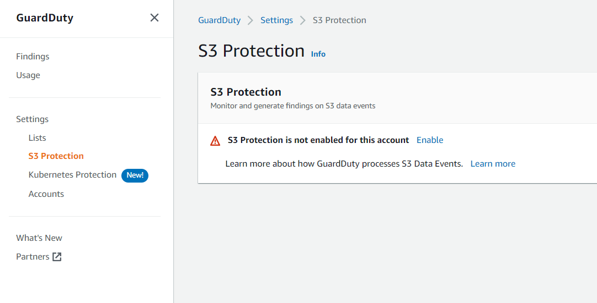
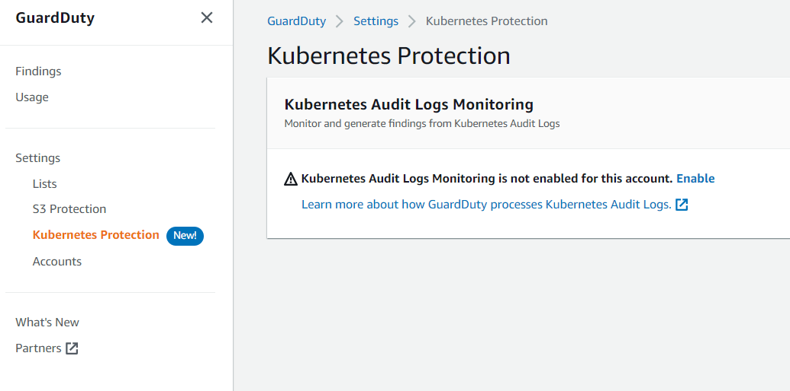
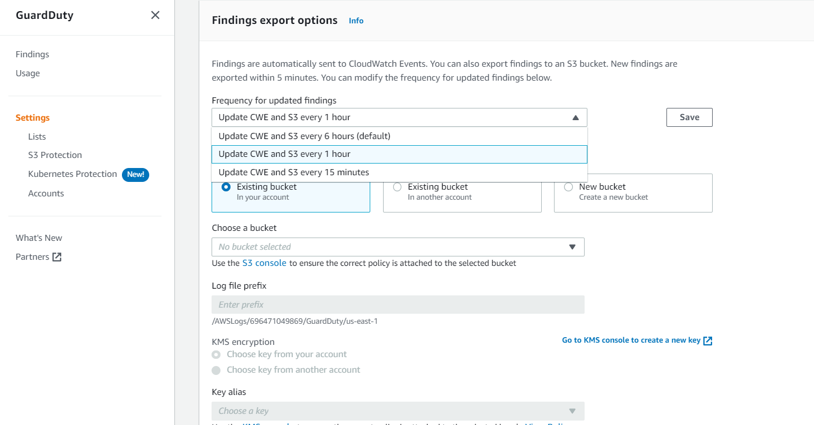
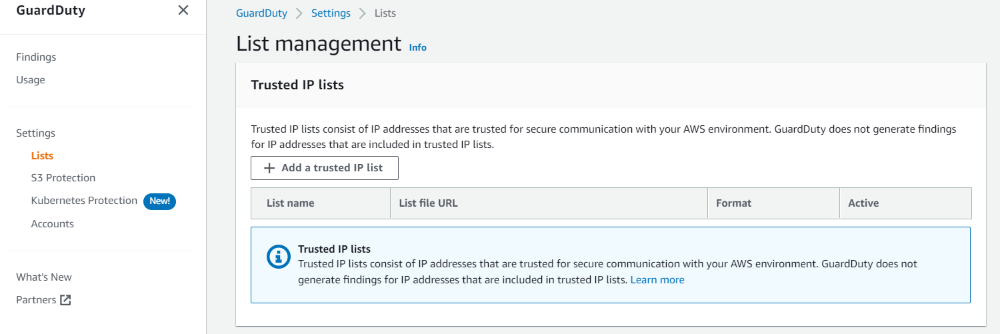

<!-- omit in toc -->
# Amazon GuardDuty- Security Baseline Requirement
<!-- omit in toc -->
## Baseline security configuration requirement for AWS services ###
---

Summary of changes: 
1. Added new controls
2. Updated the security control mappings

**Generated By: EY Security Team**

**Service Type: Security, Identity, & Compliance**

**Deployment Phase: Service Discovery** 


**Last Update: 07/21/2022**


## Table of Contents  <!-- omit in toc -->
<!-- TOC -->
- [Overview](#overview)
  - [Use Case Examples:](#use-case-examples)
- [Cloud Security Requirements](#cloud-security-requirements)
  - [1. Ensure to enable Amazon GuardDuty in all supported AWS Region](#1-ensure-to-enable-amazon-guardduty-in-all-supported-aws-region)
  - [2. Ensure Amazon GuardDuty users and roles are following least privilege model](#2-ensure-amazon-guardduty-users-and-roles-are-following-least-privilege-model)
  - [3. Ensure to enable S3 Protection feature in Amazon GuardDuty](#3-ensure-to-enable-s3-protection-feature-in-amazon-guardduty)
  - [4. Ensure to enable Kubernetes protection feature in Amazon GuardDuty](#4-ensure-to-enable-kubernetes-protection-feature-in-amazon-guardduty)
  - [5. Ensure Amazon GuardDuty utilizes organization approved S3 buckets for findings export](#5-ensure-amazon-guardduty-utilizes-organization-approved-s3-buckets-for-findings-export)
  - [6. Ensure exported finding data is encrypted at rest in S3 using organization managed key(CMK)](#6-ensure-exported-finding-data-is-encrypted-at-rest-in-s3-using-organization-managed-keycmk)
  - [7. Ensure organization approved trusted IP list is configured to remove findings against trusted IPs](#7-ensure-organization-approved-trusted-ip-list-is-configured-to-remove-findings-against-trusted-ips)
  - [8. Ensure to enable Cloudtrail for Amazon GuardDuty](#8-ensure-to-enable-cloudtrail-for-amazon-guardduty)
  - [9. Ensure to integrate Amazon GuardDuty with AWS Security Hub](#9-ensure-to-integrate-amazon-guardduty-with-aws-security-hub)
  - [10. Ensure to integrate Amazon GuardDuty with Amazon Detective](#10-ensure-to-integrate-amazon-guardduty-with-amazon-detective)
  - [11. Ensure Amazon GuardDuty uses standard organizational resource tagging method](#11-ensure-amazon-guardduty-uses-standard-organizational-resource-tagging-method)

- [Endnotes](#endnotes)
  - [Resources](#resources)
  - [Glossary](#glossary)
<!-- /TOC -->

##  Overview
Amazon GuardDuty is a continuous security monitoring service that analyzes and processes the following data sources: AWS CloudTrail management event logs, AWS CloudTrail data events for S3, DNS logs, EKS audit logs, and VPC flow logs. It uses threat intelligence feeds, such as lists of malicious IP addresses and domains, and machine learning to identify unexpected and potentially unauthorized and malicious activity within AWS environment. This can include issues like escalations of privileges, uses of exposed credentials, or communication with malicious IP addresses, or domains.

| Control Number | Cloud Baseline Security Requirements                                                                        |
| -------------- | ----------------------------------------------------------------------------------------------------------- |
| 1              | Ensure to enable Amazon GuardDuty in all supported AWS Region                                               |
| 2              | Ensure Amazon GuardDuty users and roles are following least privilege model                                 |
| 3              | Ensure to enable S3 Protection feature in Amazon GuardDuty                                                  |
| 4              | Ensure to enable Kubernetes protection feature in Amazon GuardDuty                                          |
| 5              | Ensure Amazon GuardDuty utilizes organization approved S3 buckets for findings export                       |
| 6              | Ensure exported finding data is encrypted at rest in S3 using organization managed key(CMK)                 |
| 7              | Ensure organization approved trusted IP list is configured to remove findings against trusted IPs           |
| 8              | Ensure to enable Cloudtrail for Amazon GuardDuty                                                            |
| 9              | Ensure to integrate Amazon GuardDuty with AWS Security Hub                                                  |
| 10             | Ensure to integrate Amazon GuardDuty with Amazon Detective                                                  |
| 11             | Ensure Amazon GuardDuty uses standard organizational resource tagging method                                |


### Use Case Examples:
- Stop unauthorized activity
- Enable continuous monitoring and analysis
- Simplify forensics

## Cloud Security Requirements ##

### 1. Ensure to enable Amazon GuardDuty in all supported AWS Region

**Security control mapping:** <br>

| Control Number | Control Statement | Security Domain | Default | Associated Runbook |CVSS Severity|
| ------------------ | ------------| --------------- | ------- | ------------------ |---|
| CS0012133 |[Place Holder] | Configuration Management | Not Enabled | None |[Medium(5.5)](https://www.first.org/cvss/calculator/3.1#CVSS:3.1/AV:A/AC:H/PR:L/UI:N/S:C/C:L/I:L/A:L)|


**Why?** <br>
Organization highly recommends to enable GuardDuty in all supported AWS Regions. This enables GuardDuty to generate findings about unauthorized or unusual activity even in Regions that are not actively using. This also enables GuardDuty to monitor AWS CloudTrail events for global AWS services such as IAM. If GuardDuty is not enabled in all supported Regions, its ability to detect activity that involves global services is reduced. 

**How?** <br>


**_Step 1:_** Sign in to the AWS Management Console.

**_Step 2:_** Navigate to AWS GuardDuty home page at https://console.aws.amazon.com/guardduty.

**_Step 3:_** Click the **Get started** button to initiate the setup process.

**_Step 4:_** On the **Enable GuardDuty** page, within Service permissions section, click View service role permissions to view the access policy with the permissions that GuardDuty service requires to generate findings for your AWS environment, then click **Enable GuardDuty** to activate the service. Once the service is enabled, it should immediately start to pull and analyze independent streams of data from AWS CloudTrail, VPC flow logs and DNS logs in order to generate findings.

**_Step 5:_** Repeat steps for each AWS region that you want to protect with Amazon GuardDuty.


### 2. Ensure Amazon GuardDuty users and roles are following least privilege model

**Security Control Mapping :**  <br>
| Control Number | Control Statement | Security Domain | Default | Associated Runbook | CVSS Severity  |
| -------------- | ----------------- | --------------- | ------- | ------------------ | -------------- |
| CS0012298 | Access to change cloud identity access and service control policies is restricted to authorized cloud administrative personnel |  Identity & Access Management | Not enabled |None | [Medium (6.8)](https://www.first.org/cvss/calculator/3.1#CVSS:3.1/AV:N/AC:H/PR:H/UI:R/S:C/C:L/I:L/A:H) |

**Why?** <br>
GuardDuty integrates with IAM which is an AWS service that helps an administrator securely control access to AWS resources. IAM administrators control who can be authenticated (signed in) and authorized (have permissions) to use GuardDuty resources. GuardDuty supports identity-based policies and service-linked roles. With IAM identity-based policies,allowed or denied actions can be specified and resources as well as the conditions under which actions are allowed or denied. GuardDuty supports specific actions, resources, and condition keys. GuardDuty roles are predefined by GuardDuty and include all the permissions that GuardDuty requires to call other AWS services.

**Following are the suggested roles for Amazon GuardDuty** <br>
| Function | Description | Role | 
| -------------- | ----------------- | --------------- | 
| GuardDuty admin team | This service-linked role is responsible to call other AWS services |AWSServiceRoleForAmazonGuardDuty|
| IAM Admin | Responsible for granting identity based read only access | Custom resource role developed by IAM admin team |
| Security Engineer | Responsible to configure, monitor and audit the security findings|MonitoringPlatformAdmin|
| Security Analyst | Responsible for triaging security alert from GuardDuty, requires read only access | AnalyticsPlatformAdmin|

**How?** <br>

By default, IAM users and roles don't have permission to create or modify GuardDuty resources. They also can't perform tasks using the AWS Management Console, AWS CLI, or AWS API. An IAM administrator must create IAM policies that grant users and roles permission to perform actions on the resources that they need. The administrator must then attach those policies to the IAM users or groups that require those permissions.

**Example 1 - Custom IAM policy to grant read-only access to GuardDuty**
To create a custom policy that grants an IAM user, role, or group read-only access to GuardDuty you can use the following statement:

```json
{
    "Version": "2012-10-17",
    "Statement": [
        {
            "Effect": "Allow",
            "Action": [
                "guardduty:ListMembers",
                "guardduty:GetMembers",
                "guardduty:ListInvitations",
                "guardduty:ListDetectors",
                "guardduty:GetDetector",
                "guardduty:ListFindings",
                "guardduty:GetFindings",
                "guardduty:ListIPSets",
                "guardduty:GetIPSet",
                "guardduty:ListThreatIntelSets",
                "guardduty:GetThreatIntelSet",
                "guardduty:GetMasterAccount",
                "guardduty:GetInvitationsCount",
                "guardduty:GetFindingsStatistics"
            ],
            "Resource": "ARN of respective resource"
        }
    ]
}
```

**Example 2 - Deny Access to GuardDuty findings**
You can use the following policy to deny an IAM user, role, or group access to GuardDuty findings. Users can't view findings or the details about findings, but they can access all other GuardDuty operations:

```json
{
    "Version": "2012-10-17",
    "Statement": [
        {
            "Effect": "Allow",
            "Action": [
                "guardduty:CreateDetector",
                "guardduty:DeleteDetector",
                "guardduty:UpdateDetector",
                "guardduty:GetDetector",
                "guardduty:ListDetectors",
                "guardduty:CreateIPSet",
                "guardduty:DeleteIPSet",
                "guardduty:UpdateIPSet",
                "guardduty:GetIPSet",
                "guardduty:ListIPSets",
                "guardduty:CreateThreatIntelSet",
                "guardduty:DeleteThreatIntelSet",
                "guardduty:UpdateThreatIntelSet",
                "guardduty:GetThreatIntelSet",                      
                "guardduty:ListThreatIntelSets",
                "guardduty:ArchiveFindings",
                "guardduty:UnarchiveFindings",
                "guardduty:CreateSampleFindings",
                "guardduty:CreateMembers",
                "guardduty:InviteMembers",
                "guardduty:GetMembers",
                "guardduty:DeleteMembers",
                "guardduty:DisassociateMembers",
                "guardduty:StartMonitoringMembers",
                "guardduty:StopMonitoringMembers",
                "guardduty:ListMembers",
                "guardduty:GetMasterAccount",
                "guardduty:DisassociateFromMasterAccount",
                "guardduty:AcceptInvitation",
                "guardduty:ListInvitations",
                "guardduty:GetInvitationsCount",
                "guardduty:DeclineInvitations",
                "guardduty:DeleteInvitations"
            ],
            "Resource": "ARN of respective resource"
        }, 
         {
            "Effect": "Allow",
            "Action": [
                "iam:CreateServiceLinkedRole"
            ],
            "Resource": "arn:aws:iam::123456789123:role/aws-service-role/guardduty.amazonaws.com/AWSServiceRoleForAmazonGuardDuty",
            "Condition": {
                "StringLike": {
                    "iam:AWSServiceName": "guardduty.amazonaws.com"
                }
            }
        },
        {
            "Effect": "Allow",
            "Action": [
                "iam:PutRolePolicy"
                
            ],
            "Resource": "arn:aws:iam::123456789123:role/aws-service-role/guardduty.amazonaws.com/AWSServiceRoleForAmazonGuardDuty"
        }
    ]
}
```

**Example 3 - Using a custom IAM policy to limit access to GuardDuty resources**

Below policy allows a user to run the guardduty:UpdateDetector operation, using the detector ID of 1234567 in the us-east-1 Region:

```json
{
    "Version": "2012-10-17",
    "Statement": [
        {
            "Effect": "Allow",
            "Action": [
                 "guardduty:UpdateDetector",
             ],
            "Resource": "arn:aws:guardduty:us-east-1:012345678910:detector/1234567"
        }
    ]
}
```
Below policy allows a user to run the guardduty:UpdateIPSet operation, using the detector ID of 1234567 and the IPSet ID of 000000 in the us-east-1 Region:

```json
{
    "Version": "2012-10-17",
    "Statement": [
        {
            "Effect": "Allow",
            "Action": [
                 "guardduty:UpdateIPSet",
             ],
            "Resource": "arn:aws:guardduty:us-east-1:012345678910:detector/1234567/ipset/000000"
        }
    ]
}               
```


<br><br>

### 3. Ensure to enable S3 Protection feature in Amazon GuardDuty

**Security control mapping:** <br>
| Control Number | Control Statement | Security Domain | Default | Associated Runbook |CVSS Severity|
| ------------------ | ------------| --------------- | ------- | ------------------ |---|
| CS0012133 |[Place Holder] | Configuration Management | Not Enabled | None |[Medium(4.5)](https://www.first.org/cvss/calculator/3.1#CVSS:3.1/AV:L/AC:H/PR:L/UI:N/S:U/C:L/I:L/A:L)|

**Why?** <br>

As per security best practice it is suggested to enable S3 protection in GuardDuty. If the feature is disabled, GuardDuty is unable to fully monitor or generate findings for suspicious access to data stored in S3 buckets.

**How?** <br>

**_Step 1:_** Log into the https://console.aws.amazon.com/guardduty/ console.

**_Step 2:_** In the navigation pane, under **Settings**, choose **S3 Protection**.

**_Step 3:_** The S3 Protection pane lists the current status of S3 protection for your account. You may enable it at any time by selecting **Enable**, then confirming your selection.




<br><br>

### 4. Ensure to enable Kubernetes protection feature in Amazon GuardDuty

**Security control mapping:** <br>
| Control Number | Control Statement | Security Domain | Default | Associated Runbook |CVSS Severity|
| ------------------ | ------------| --------------- | ------- | ------------------ |---|
| CS0012133 |[Place Holder] | Configuration Management | Not Enabled | None |[Medium(4.5)](https://www.first.org/cvss/calculator/3.1#CVSS:3.1/AV:L/AC:H/PR:L/UI:N/S:U/C:L/I:L/A:L)|

**Why?** <br>

Kubernetes protection enables Amazon GuardDuty to detect suspicious activities and potential compromises of Kubernetes clusters within Amazon Elastic Kubernetes Service (Amazon EKS). As per security best practice it is suggested not to disable Kubernetes protection in GuardDuty. If the feature is not enabled, the ability of GuardDuty to monitor or generate findings for suspicious activity within Amazon EKS environment is limited.

**How?** <br>


**_Step 1:_** Log into the https://console.aws.amazon.com/guardduty/ console.

**_Step 2:_** In the navigation pane, under **Settings**, choose **Kubernetes protection**.

**_Step 3:_** The Kubernetes protection pane lists the current status of Kubernetes protection for your account. You may enable it at any time by selecting **Enable**, then confirming your selection.



<br><br>

### 5. Ensure Amazon GuardDuty utilizes organization approved S3 buckets for findings export 

**Security control mapping:** <br>
| Control Number | Control Statement | Security Domain | Default | Associated Runbook |CVSS Severity|
| ------------------ | ------------| --------------- | ------- | ------------------ |---|
| CS0012133 |[Place Holder] | Configuration Management | Not Enabled | None |[Medium(5.3)](https://www.first.org/cvss/calculator/3.1#CVSS:3.1/AV:L/AC:H/PR:L/UI:N/S:C/C:L/I:L/A:L)|

**Why?** <br>

GuardDuty supports exporting active findings to an Amazon S3 bucket. As per organization stringent security policy it is suggested to use organization approved S3 buckets only to export findings in order to protect the information being exposed to unidentified account.

**How?** <br>


To configure findings export using an existing bucket

**_Step 1:_** Add a policy to the KMS key GuardDuty will use to encrypt findings. For an example policy see [Granting GuardDuty permission to a KMS key](https://docs.aws.amazon.com/guardduty/latest/ug/guardduty_exportfindings.html#guardduty_exportfindings-key-policy)

**_Step 2:_** Attach a policy granting GuardDuty permission to upload objects to your S3 bucket. For an example policy see [Granting GuardDuty permissions to a bucket](https://docs.aws.amazon.com/guardduty/latest/ug/guardduty_exportfindings.html#guardduty_exportfindings-s3-policies)

**_Step 3:_** Open the GuardDuty console at https://console.aws.amazon.com/guardduty/.

**_Step 4:_** Choose **Settings**.

**_Step 5:_** For **Frequency for updated findings** field, click the dropdown list and select one value.

**_Step 6:_** Under **Findings export options** Choose **Existing bucket in your account** or **Existing bucket in another account** or **New bucket**.

a. In the **Name the bucket** field enter the name of your bucket.

b. Optional. Under **Log file prefix**, enter a path prefix to use. GuardDuty will create a new folder in the bucket with specified prefix name. When you enter a value, the example path below the field is updated to reflect the path to exported findings in the bucket.

c. Under **KMS encryption**, do one of the following:

- Select **Choose key from your account**.

  Then choose the key alias of the key that you changed the policy for from the Key alias list.

- Select **Choose key from another account**.

Then enter the full ARN to the key that you changed the policy for.

>Note: The key that you choose must be in the same Region as the bucket. 

**_Step 7:_** Choose **Save**.



<br><br> 

### 6. Ensure exported finding data is encrypted at rest in S3 using organization managed key(CMK)


**Security control mapping:** <br>
| Control Number | Control Statement | Security Domain | Default | Associated Runbook |CVSS Severity|
| ------------------ | ------------| --------------- | ------- | ------------------ |---|
| CS0012168 |Strong encryption key management controls are in place for cloud provider services to protect data at rest | Data Protection | Not Enabled | [S3 Runbook](https://github.com/ey-org/cloudsec-ccm/blob/master/Baseline%20Requirement%20Library/AWS/S3/S3%20Runbook.md) |[Medium(5.3)](https://www.first.org/cvss/calculator/3.1#CVSS:3.1/AV:L/AC:H/PR:L/UI:N/S:C/C:L/I:L/A:L)|

**Why?** <br>

All GuardDuty customer data is encrypted at rest using AWS encryption solutions. As per security best practice it is suggested to check if the S3 bucket which is used to store findings must encrypt the data using organization managed key(CMK).

**How?** <br>

Refer [S3 Runbook](https://github.com/ey-org/cloudsec-ccm/blob/master/Baseline%20Requirement%20Library/AWS/S3/S3%20Runbook.md#5-ensure-s3-buckets-are-encrypted-at-rest-using-organization-managed-keycmk) for implementation steps.

<br><br> 
 
 ### 7. Ensure organization approved trusted IP list is configured to remove findings against trusted IPs

**Security control mapping:** <br>
| Control Number | Control Statement | Security Domain | Default | Associated Runbook |CVSS Severity|
| ------------------ | ------------| --------------- | ------- | ------------------ |---|
| CS0012133 |[Place Holder] | Configuration Management | Not Enabled | None |[Low(3.5)](https://www.first.org/cvss/calculator/3.1#CVSS:3.1/AV:N/AC:H/PR:L/UI:N/S:C/C:N/I:N/A:L)|

**Why?** <br>

Amazon GuardDuty monitors the security of AWS environment by analyzing and processing VPC Flow Logs, AWS CloudTrail event logs, and DNS logs. Enterprise can customize this monitoring scope by configuring GuardDuty to stop alerts for trusted IPs from organization owned trusted IP lists. Trusted IP lists consist of IP addresses that enterprise have trusted for secure communication with AWS infrastructure and applications. GuardDuty does not generate VPC flow log or CloudTrail findings for IP addresses on trusted IP lists.

**How?** <br>


**_Step 1:_** Open the GuardDuty console at https://console.aws.amazon.com/guardduty/.

**_Step 2:_** In the navigation pane, under **Settings**, choose **Lists**.

**_Step 3:_** On the **List management** page, choose **Add a trusted IP list**

**_Step 4:_** In the dialog box, do the following:

- For **List name**, enter a name for the list.

- For **Location**, specify the location of the list - this is the S3 bucket where you store your trusted IP lists
- For **Format**, choose your list's file type.
- Choose the **I agree** check box.
- Choose **Add list**.



<br><br> 

### 8. Ensure to enable Cloudtrail for Amazon GuardDuty


**Security control mapping:** <br>
| Control Number | Control Statement | Security Domain | Default | Associated Runbook |CVSS Severity|
| ------------------ | ------------| --------------- | ------- | ------------------ |---|
| CS0012233| Information system must create a log and record activities occurring on or originating from the information system. Logs must be made accessible to the enterprise SIEM solution  | Security Information and event management | Not Enabled | None|[Low(2.5)](https://www.first.org/cvss/calculator/3.1#CVSS:3.1/AV:L/AC:H/PR:H/UI:N/S:C/C:N/I:N/A:L)|


**Why?** <br>

Amazon GuardDuty is integrated with AWS CloudTrail, a service that provides a record of actions taken by a user, role, or an AWS service in GuardDuty. CloudTrail captures API calls for GuardDuty as events, including calls from the GuardDuty console and from code calls to the GuardDuty APIs. 

**How?** <br>


CloudTrail is enabled on your AWS account when you create the account. When activity occurs in AWS Guardduty, that activity is recorded in a CloudTrail event along with other AWS service events in Event history. For an ongoing record of events in your AWS account, including events for AWS Guardduty, create a trail. 


***To create a CloudTrail trail using API :***

To create a trail that applies to all Regions, use the `--is-multi-region-trail` option. By default, the `create-trail` command creates a trail that logs events only in the AWS Region where the trail was created. To ensure that you log global service events and capture all management event activity in your AWS account, you should create trails that log events in all AWS Regions.

The following example creates a trail with the name `my-trail` and a tag with a key named `Group` with a value of `Marketing` that delivers logs from all Regions to an existing bucket named `my-bucket`.

```
aws cloudtrail create-trail --name my-trail --s3-bucket-name my-bucket --is-multi-region-trail --tags-list [key=Group,value=Marketing]
```

To confirm that your trail exists in all Regions, the `IsMultiRegionTrail` element in the `output` shows `true`.
```
{
    "IncludeGlobalServiceEvents": true, 
    "Name": "my-trail", 
    "TrailARN": "arn:aws:cloudtrail:us-east-2:123456789012:trail/my-trail", 
    "LogFileValidationEnabled": false, 
    "IsMultiRegionTrail": true, 
    "IsOrganizationTrail": false,
    "S3BucketName": "my-bucket"
}
```

>***Note***
Use the start-logging command to start logging for your trail.
<br><br> 

### 9. Ensure to integrate Amazon GuardDuty with AWS Security Hub


**Security control mapping:** <br>
| Control Number | Control Statement | Security Domain | Default | Associated Runbook |CVSS Severity|
| ------------------ | ------------| --------------- | ------- | ------------------ |---|
| CS0012233| Information system must create a log and record activities occurring on or originating from the information system. Logs must be made accessible to the enterprise SIEM solution  | Security Information and event management | Not Enabled | None|[Low(3.9)](https://www.first.org/cvss/calculator/3.1#CVSS:3.1/AV:L/AC:H/PR:H/UI:N/S:U/C:L/I:L/A:L)|


**Why?** <br>
    
AWS Security Hub provides with a comprehensive view of security state in AWS and helps to check environment against security industry standards and best practices. The Amazon GuardDuty integration with Security Hub enables enterprise to send findings from GuardDuty to Security Hub. Security Hub can then include those findings in its analysis of security posture.

**How?** <br>


To use the integration with AWS Security Hub, you must enable Security Hub. For information on how to enable Security Hub, see [Setting up Security Hub](https://docs.aws.amazon.com/securityhub/latest/userguide/securityhub-enable.html)

When you enable both GuardDuty and Security Hub, the integration is enabled automatically. GuardDuty immediately begins to send findings to Security Hub.

<br><br> 

### 10. Ensure to integrate Amazon GuardDuty with Amazon Detective  


**Security control mapping:** <br>
| Control Number | Control Statement | Security Domain | Default | Associated Runbook |CVSS Severity|
| ------------------ | ------------| --------------- | ------- | ------------------ |---|
| CS0012233| Information system must create a log and record activities occurring on or originating from the information system. Logs must be made accessible to the enterprise SIEM solution  | Security Information and event management | Not Enabled | None|[Low(3.9)](https://www.first.org/cvss/calculator/3.1#CVSS:3.1/AV:L/AC:H/PR:H/UI:N/S:U/C:L/I:L/A:L)|


**Why?** <br>
    
Amazon Detective helps to quickly analyze and investigate security events across one or more AWS accounts by generating data visualizations that represent the ways resources behave and interact over time. Detective creates visualizations of GuardDuty findings. Detective ingests finding details for all finding types, and provides access to the entity profiles to investigate different entities that are involved with the finding. 

**How?** <br>


To use Amazon Detective with GuardDuty you must first enable Amazon Detective. For information on how to enable Detective, see [Setting up Amazon Detective](https://docs.aws.amazon.com/detective/latest/adminguide/detective-enabling.html).

When you enable both GuardDuty and Detective, the integration is enabled automatically. Once enabled, Detective will immediately ingest your GuardDuty findings data.
<br><br> 


### 11. Ensure Amazon GuardDuty uses standard organizational resource tagging method


**Security control mapping:** <br>
| Control Number | Control Statement | Security Domain | Default | Associated Runbook |CVSS Severity|
| ------------------ | ------------| --------------- | ------- | ------------------ |---|
|CS0012128| Technology hardware and software must be registered and accurately recorded within the enterprise technology repository and/or asset management systems | Asset Management | Not Enabled | Organizational Runbook |[Low(1.6)](https://www.first.org/cvss/calculator/3.1#CVSS:3.1/AV:P/AC:H/PR:H/UI:N/S:U/C:N/I:N/A:L)|


**What, Why & How?** <br>

Identification of your IT assets is a crucial aspect of governance and security. You need to have visibility of all GuardDuty resources to assess their security posture and take action on potential areas of weakness.

Tagging resources in the cloud is an easy way for teams to provide information related to who owns the resource, what the resource is used for, as well as other important information related to the deployment lifecycle of the resource. Organization has mandated that all cloud resources are to be tagged with for cross-team use.

[Place holder for link]

<br><br> 

## Endnotes ##

### Resources 
1. https://docs.aws.amazon.com/securityhub/latest/userguide/what-is-securityhub.html
2. https://docs.aws.amazon.com/securityhub/latest/userguide/security.html

### Glossary 

**Data** - Digital pieces of information stored or transmitted for use with an information system from which understandable information is
derived. Items considered to be data are: Source code, meta-data, build artifacts, information input and output.

**Information System** - An organized assembly of resources and procedures for the collection, processing, maintenance, use, sharing,
dissemination, or disposition of information. All systems, platforms, compute instances including and not limited to physical and virtual
client endpoints, physical and virtual servers, software containers, databases, Internet of Things (IoT) devices, network devices,
applications (internal and external), Serverless computing instances (i.e. AWS Lambda), vendor provided appliances, and third-party
platforms, connected to the Capital Group network or used by Capital Group users or customers.

**Log** - a record of the events occurring within information systems and networks. Logs are composed of log entries; each entry contains
information related to a specific event that has occurred within a system or network.

**Information** - communication or representation of knowledge such as facts, data, or opinions in any medium or form, including textual,
numerical, graphic, cartographic, narrative, or audiovisual.

**Cloud Computing** - A model for enabling ubiquitous, convenient, on-demand network access to a shared pool of configurable computing
resources (e.g., networks, servers, storage, applications, and services) that can be rapidly provisioned and released with minimal
management effort or service provider interaction.

**Vulnerability**- Weakness in an information system, system security procedures, internal controls, or implementation that could be exploited
or triggered by a threat source. Note: The term weakness is synonymous for deficiency. Weakness may result in security and/or privacy
risks.
