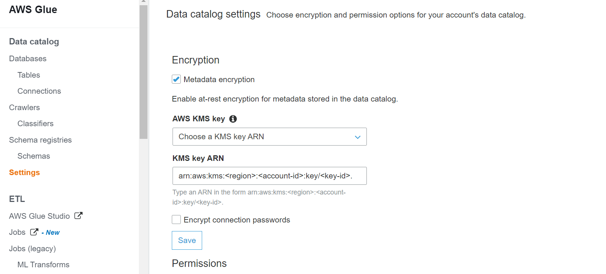
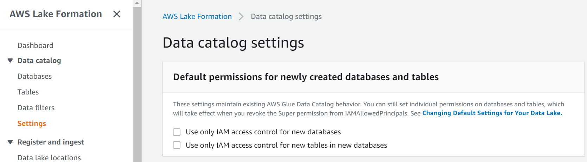
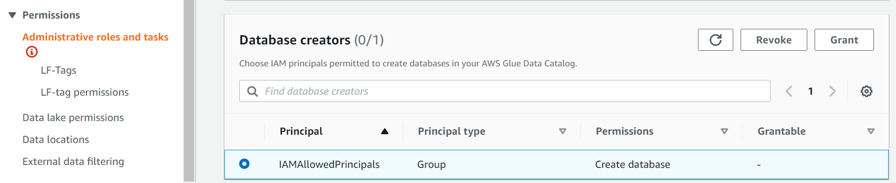
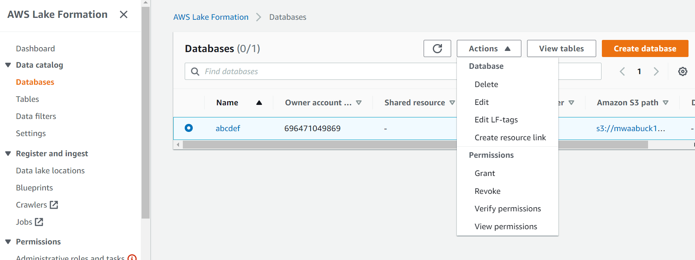
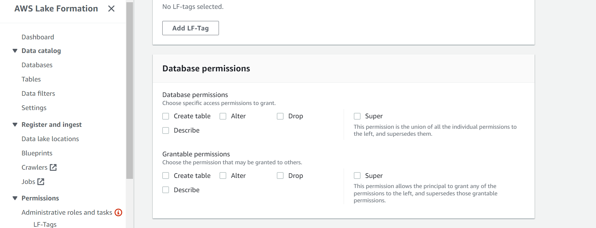
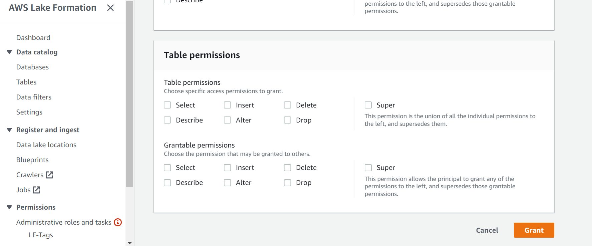
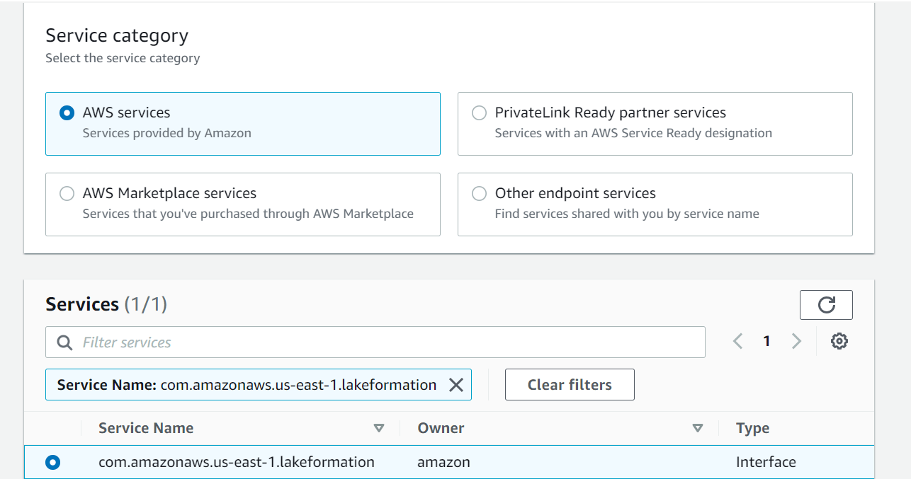

<!-- omit in toc -->
# AWS Lake Formation - Security Baseline Requirement
<!-- omit in toc -->
## Baseline security configuration requirement for AWS services ##
---


Summary of changes: 
1. Added new controls
2. Updated the security control mappings

**Generated By: EY Security Team**

**Service Type: Data Lake And Analytics**

**Deployment Phase: Service Discovery** 

**Last Update: 04/20/2022**

## Table of Contents  <!-- omit in toc -->
<!-- TOC -->

- [Overview](#overview)
  - [Use Case Examples:](#use-case-examples)
- [Cloud Security Requirements](#cloud-security-requirements)
  - [1. Ensure to establish fine grained access controls](#1-ensure-to-establish-fine-grained-access-controls)
  - [2. Ensure AWS Glue Data Catalog is encrypted using organization's managed key](#2-ensure-aws-glue-data-catalog-is-encrypted-using-organizations-managed-key)
  - [3. Ensure default permissions for newly created databases and tables are set to be disabled](#3-ensure-default-permissions-for-newly-created-databases-and-tables-are-set-to-be-disabled)
  - [4. Ensure 'Super' right is not associated with 'IAMAllowedPrincipals' on Glue Catalog Table and Database](#4-ensure-super-right-is-not-associated-with-iamallowedprincipals-on-glue-catalog-table-and-database)
  - [5. Ensure lake formation is communicating with services inside VPC via VPC end-point](#5-ensure-lake-formation-is-communicating-with-services-inside-vpc-via-vpc-end-point)
  - [6. Ensure to prevent cross-service confused deputy problem](#6-ensure-to-prevent-cross-service-confused-deputy-problem)
  - [7. Ensure AWS IAM permission on AWS KMS key is only granted to the trusted-list of principals who are identified to grant Lake Formation permissions on Data Catalog resources](#7-ensure-aws-iam-permission-on-aws-kms-key-is-only-granted-to-the-trusted-list-of-principals-who-are-identified-to-grant-lake-formation-permissions-on-data-catalog-resources)
  - [8. Ensure CloudTrail logging is enabled for AWS lake formation](#8-ensure-cloudtrail-logging-is-enabled-for-aws-lake-formation)
  - [9. Ensure resource tagging is added to AWS lake formation](#9-ensure-resource-tagging-is-added-to-aws-lake-formation)
- [Endnotes](#endnotes)
  - [Resources](#resources)
  - [Glossary](#glossary)

<!-- /TOC -->

##  Overview
AWS Lake Formation is a fully managed service that makes it easy to build, secure, and manage data lakes. Lake Formation simplifies and automates many of the complex manual steps that are usually required to create data lakes. These steps include collecting, cleansing, moving, and cataloging data, and securely making that data available for analytics and machine learning.


| Control Number | Cloud Baseline Security Requirements                                                                                                      |
| -------------- | ----------------------------------------------------------------------------------------------------------------------------------------- |
|1               |	Ensure to establish fine grained access controls                                                                                         |
|2               |	Ensure AWS Glue Data Catalog is encrypted using organization's managed key                                                               |
|3               |	Ensure default permissions for newly created databases and tables are set to be disabled                                                 |
|4               |	Ensure 'Super' right is not associated with 'IAMAllowedPrincipals' on Glue Catalog Table and Database                                    |
|5               |	Ensure lake formation is communicating with services inside VPC via VPC end-point                                                        |
|6               |	Ensure to prevent cross-service confused deputy problem                                                                                  |
|7               |	Ensure AWS IAM permission on AWS KMS key is only granted to the trusted-list of principals who are identified to grant Lake Formation permissions on Data Catalog resources                                                                                                                        |
|8               |	Ensure CloudTrail logging is enabled for AWS lake formation                                                                              |
|9               |	Ensure resource tagging is added to AWS lake formation                                                                                   |


### Use Case Examples:
- Build data lakes quickly
- Centrally define and manage access controls
- Enforce data classification and fine-grained access
- Enable continuous data management, time travel, and storage optimization
- Enable federated data lakes with cross-account sharing

## Cloud Security Requirements ##

### 1. Ensure to establish fine grained access controls

[Place holder]

### 2. Ensure AWS Glue Data Catalog is encrypted using organization's managed key

**Security Control Mapping :** <br>

| Control Number | Control Statement | Security Domain | Default | Associated Runbook | CVSS Severity  |
| -------------- | ----------------- | --------------- | ------- | ------------------ | -------------- |
| CS0012168 |Strong encryption key management controls are in place for cloud provider services to protect data at rest | Data Protection | Enabled | None | [Medium (5.3)](https://www.first.org/cvss/calculator/3.1#CVSS:3.1/AV:A/AC:H/PR:H/UI:N/S:U/C:H/I:L/A:L) |

**Why?**<br>

This control is to check that organization's Amazon Glue Data Catalogs are using organization managed CMK instead of AWS managed-keys (i.e. default encryption keys used by Glue service when there are no customer keys defined) in order to have a more granular control over data-at-rest encryption/decryption process and meet compliance requirements.

When organization use their own AWS KMS Customer Master Keys (CMKs) to protect AWS Glue Data Catalog objects and connection passwords, they have full control over who can use the encryption keys to access the AWS Glue data.Amazon Key Management Service (KMS) service allows organization to easily create, rotate, disable and audit Customer Master Keys created for your Amazon Glue Data Catalogs.

**How?**<br>

**_Step 1:_** Sign in to the AWS Management Console <br>
**_Step 2:_** Navigate to AWS Glue console at https://console.aws.amazon.com/glue/.<br>
**_Step 3:_** Choose Settings in the navigation pane.<br>
**_Step 4:_** On the Data catalog settings page, select **Metadata encryption**.
**_Step 5:_** For AWS KMS key select 'Choose a KMS key ARN' from drop down and choose an Organization managed key ARN.<br>
<br>
**_Step 6:_** Click on Save.

<br><br>

### 3. Ensure default permissions for newly created databases and tables are set to be disabled

**Security Control Mapping :**  <br>

| Control Number | Control Statement | Security Domain | Default | Associated Runbook | CVSS Severity  |
| -------------- | ----------------- | --------------- | ------- | ------------------ | -------------- |
| CS0012298 | Access to change cloud identity access and service control policies is restricted to authorized cloud administrative personnel |  Identity & Access Management | Not enabled |None | [Medium (5.9)](https://www.first.org/cvss/calculator/3.1#CVSS:3.1/AV:N/AC:H/PR:L/UI:R/S:U/C:L/I:L/A:H) |

**Why?**<br>

In order to enable fine-grained and tag-based access control with Lake Formation permissions make sure to "Use only IAM access control" settings  is disabled for newly created databases and tables.

**How?**<br>

**_Step 1:_** Sign in to the AWS Management Console <br>
**_Step 2:_** Navigate to Lake Formation console at https://console.aws.amazon.com/lakeformation/.<br>
**_Step 3:_** Modify the Data Catalog settings:
      a. In the navigation pane,under **Data catalog**, choose **Settings**.
      b. Clear both check boxes and choose **Save**.
      <br>
**_Step 4:_** Revoke *IAMAllowedPrincipals* permission for database creators.
      a. In the navigation pane, under Permissions, choose **Administrative roles and tasks**.
      b. In the **Administrative roles and tasks** console page, in the **Database creators** section, select the *IAMAllowedPrincipals group*, and choose **Revoke**.
        The Revoke permissions dialog box appears, showing that IAMAllowedPrincipals has the Create database permission.
      c. Choose **Revoke**.
      <br>

<br><br>

### 4. Ensure 'Super' right is not associated with 'IAMAllowedPrincipals' on Glue Catalog Table and Database

**Security Control Mapping :**  <br>

| Control Number | Control Statement | Security Domain | Default | Associated Runbook | CVSS Severity  |
| -------------- | ----------------- | --------------- | ------- | ------------------ | -------------- |
| CS0012298 | Access to change cloud identity access and service control policies is restricted to authorized cloud administrative personnel |  Identity & Access Management | Not enabled |None | [Medium (5.9)](https://www.first.org/cvss/calculator/3.1#CVSS:3.1/AV:N/AC:H/PR:L/UI:R/S:U/C:L/I:L/A:H) |

**Why?**<br>

The IAMAllowedPrincipals group includes any IAM users and roles that are allowed access to Data Catalog resources by IAM policies. The Super permission enables a principal to perform every supported Lake Formation operation on the database or table on which it is granted. So enterprise recommends to revoke super permission to provide least privilege access so that only required permissions should be granted to perform a task.

**How?**<br>

**_Step 1:_** Sign in to the AWS Management Console <br>
**_Step 2:_** Navigate to Lake Formation console at https://console.aws.amazon.com/lakeformation/.<br>
**_Step 3:_** Open the Data lake formation console, and click on the database on the left side.<br>
**_Step 4:_** Select the required database and then click on action and then click on grant.<br>
<br>
**_Step 5:_** On grant permission screen, select the IAM users and roles field.<br>
**_Step 6:_** Under the **Database permission**, select Create table and Alter box and ignore the **Super** box.
<br>
<br>
**_Step 7:_** Under the **Table permission**, select Insert and Alter box and ignore the **Super** box.<br>
<br>

<br><br>

### 5. Ensure lake formation is communicating with services inside VPC via VPC end-point

**Security control mapping:** <br>

| Control Number | Control Statement | Security Domain | Default | Associated Runbook | CVSS Severity  |
| ------------------ | ------------| --------------- | ------- | ------------------ | -------------- |
| CS0012300  | Cloud products and services must be deployed on private subnets and public access must be disabled for these services| Network Security | Not Enabled | None | [Medium (6.5)](https://www.first.org/cvss/calculator/3.1#CVSS:3.1/AV:A/AC:H/PR:H/UI:R/S:C/C:H/I:L/A:L) |

**Why?**<br>

Organization recommends to establish a private connection between VPC and Lake Formation. Use this connection so that Lake Formation can communicate with the any resources in VPC without going through the public internet. Using VPC end point enhances organization's security posture by adding additional security layer and helps to save cost.

**How?**<br>

**_Step 1:_** Sign in to the AWS Management Console <br>
**_Step 2:_** Navigate to Amazon VPC console at https://console.aws.amazon.com/vpc/.<br>
**_Step 3:_** In the navigation pane, choose Endpoints.<br>
**_Step 4:_** Click **Create endpoint**. For Service category, choose **AWS services**.<br>
**_Step 5:_** Now select the service for LakeFormation like **com.amazonaws.us-east-1.lakeformation**.<br>
**_Step 6:_** For VPC, select the VPC from which the user will access the AWS service and enable DNS.<br>
**_Step 7:_** For Subnets, select one subnet per Availability Zone from which the user will access the AWS service.<br>
**_Step 8:_** For Security group, select the security groups to associate with the endpoint network interfaces. The security group rules must allow resources that will use the VPC endpoint to communicate with the AWS service to communicate with the endpoint network interface.<br>
**_Step 9:_** For Policy, select Full access to allow all operations by all principals on all resources over the VPC endpoint.<br>
**_Step 10:_** To add a tag, choose Add new tag and enter the tag key and the tag value.
**_Step 11:_** Click Create endpoint.
<br>

<br><br>

### 6. Ensure to prevent cross-service confused deputy problem 

**Security Control Mapping :**  <br>

| Control Number | Control Statement | Security Domain | Default | Associated Runbook | CVSS Severity  |
| -------------- | ----------------- | --------------- | ------- | ------------------ | -------------- |
| CS0012298 | Access to change cloud identity access and service control policies is restricted to authorized cloud administrative personnel |  Identity & Access Management | Not enabled |None | [Medium (4.6)](https://www.first.org/cvss/calculator/3.1#CVSS:3.1/AV:N/AC:H/PR:L/UI:R/S:U/C:L/I:L/A:L) |

**Why?**<br>

The confused deputy problem is a security issue where an entity that doesn't have permission to perform an action can coerce a more-privileged entity to perform the action. In AWS, cross-service impersonation can result in the confused deputy problem. Cross-service impersonation can occur when one service (the calling service) calls another service (the called service). The calling service can be manipulated to use its permissions to act on another customer's resources in a way it should not otherwise have permission to access.

**How?**<br>

Organization recommends using the aws:SourceArn and aws:SourceAccount global condition context keys in resource policies to limit the permissions that AWS Lake Formation gives another service to the resource. If user use both global condition context keys, the aws:SourceAccount value and the account in the aws:SourceArn value must use the same account ID when used in the same policy statement.

The following example shows how user can use the aws:SourceArn and aws:SourceAccount global condition context keys in Lake Formation to prevent the confused deputy problem.

```JSON
{
  "Version": "2012-10-17",
  "Statement": [
    {
      "Sid": "ConfusedDeputyPreventionExamplePolicy",
      "Effect": "Allow",
      "Principal": {
        "Service": "lakeformation.amazonaws.com"
      },
      "Action": [
        "sts:AssumeRole"
      ],      
      "Condition": {
        "StringEquals": {
          "aws:SourceAccount": "account-id"
        },
        "ArnEquals": {
          "aws:SourceArn": "arn:aws:lakeformation:aws-region:account-id:*"
        }
      }
    }
  ]
}
```

### 7. Ensure AWS IAM permission on AWS KMS key is only granted to the trusted-list of principals who are identified to grant Lake Formation permissions on Data Catalog resources

**Security Control Mapping :**  <br>

| Control Number | Control Statement | Security Domain | Default | Associated Runbook | CVSS Severity  |
| -------------- | ----------------- | --------------- | ------- | ------------------ | -------------- |
| CS0012298 | Access to change cloud identity access and service control policies is restricted to authorized cloud administrative personnel |  Identity & Access Management | Not enabled |None | [Medium (5.5)](first.org/cvss/calculator/3.1#CVSS:3.1/AV:N/AC:H/PR:L/UI:R/S:C/C:L/I:L/A:L) |

**Why?**<br>

Key policies are the primary way to control access to KMS keys. Key policy determine who has permission to use the KMS key and how they can use it. As per security best practice it is recommended to grant key access to only trusted-list of principals to avoid unwanted access to Data Catalog resources.

**How?**<br>

Key administrators have permissions to manage the KMS key, but do not have permissions to use the KMS key in cryptographic operations. Enterprise choose the IAM users and roles who can administer this key through the KMS API. 

The following is an example key administrators statement in the policy. This key administrators statement is for a single-region symmetric encryption KMS key.

{

```JSON

{
  "Sid": "Allow access for Key Administrators",
  "Effect": "Allow",
  "Principal": {"AWS": [
    "arn:aws:iam::Organization-Account-ID:user/KMSAdminUser",
    "arn:aws:iam::Organization-Account-ID::role/KMSAdminRole"
  ]},
  "Action": [
    "kms:Create*",
    "kms:Describe*",
    "kms:Enable*",
    "kms:List*",
    "kms:Put*",
    "kms:Update*",
    "kms:Revoke*",
    "kms:Disable*",
    "kms:Get*",
    "kms:Delete*",
    "kms:TagResource",
    "kms:UntagResource",
    "kms:ScheduleKeyDeletion",
    "kms:CancelKeyDeletion"
  ],
  "Resource": "*"
}
```

When you use the AWS KMS console to create a KMS key, the console adds the users and roles you specify to the Principal element in each key users statement.

```JSON
{
  "Sid": "Allow use of the key",
  "Effect": "Allow",
  "Principal": {"AWS": [
    "arn:aws:iam::Organization-Account-ID::user/ExampleUser",
    "arn:aws:iam::Organization-Account-ID::role/ExampleRole",
    "arn:aws:iam::Organization-Account-ID::root"
  ]},
  "Action": [
    "kms:Encrypt",
    "kms:Decrypt",
    "kms:ReEncrypt*",
    "kms:GenerateDataKey*",
    "kms:DescribeKey"
  ],
  "Resource": "*"
},
{
  "Sid": "Allow attachment of persistent resources",
  "Effect": "Allow",
  "Principal": {"AWS": [
    "arn:aws:iam::Organization-Account-ID:user/ExampleUser",
    "arn:aws:iam::Organization-Account-ID:role/ExampleRole",
    "arn:aws:iam::Organization-Account-ID:root"
  ]},
  "Action": [
    "kms:CreateGrant",
    "kms:ListGrants",
    "kms:RevokeGrant"
  ],
  "Resource": "*",
  "Condition": {"Bool": {"kms:GrantIsForAWSResource": true}}
}
```
<br><br>

### 8. Ensure CloudTrail logging is enabled for AWS lake formation

**Security control mapping:** <br>

| Control Number | Control Statement | Security Domain | Default | Associated Runbook |CVSS Severity|
| ------------------ | ------------| --------------- | ------- | ------------------ |---|
| CS0012233| Information system must create a log and record activities occurring on or originating from the information system.Logs must be made accessible to the enterprise SIEM solution  | Security Information and event management | Not Enabled | None|[Low(2.5)](https://www.first.org/cvss/calculator/3.1#CVSS:3.1/AV:L/AC:H/PR:H/UI:N/S:C/C:N/I:N/A:L)|

**Why?**<br>

AWS Lake Formation is integrated with AWS CloudTrail, a service that provides a record of actions taken by a user, role, or an AWS service in Lake Formation. CloudTrail captures all Lake Formation API calls as events.
The calls captured include calls from the Lake Formation console, the AWS Command Line Interface, and code calls to the Lake Formation API actions.

**How?**<br>

CloudTrail is enabled on AWS account when user create the account. When activity occurs in LakeFormation, that activity is recorded in a CloudTrail event along with other AWS service events in Event history. User can view, search, and download recent events in AWS account.

Follow below steps to view CloudTrail event:

**_Step 1:_** Sign in to the AWS Management Console using the IAM user you configured for CloudTrail administration. Open the CloudTrail console at https://console.aws.amazon.com/cloudtrail/home/.<br>

**_Step 2:_** Review the information in your dashboard about the most recent events that have occurred in your AWS account. A recent event should be a ConsoleLogin event, showing that you just signed in to the AWS Management Console.<br>

**_Step 3:_** To see more information about an event, expand it.<br>

**_Step 4:_** In the navigation pane, choose Event history. You see a filtered list of events, with the most recent events showing first. The default filter for events is Read only, set to false. You can clear that filter by choosing X at the right of the filter.<br>

**_Step 5:_** Many more events are shown without the default filter. You can filter events in many ways. For example, to view all console login events, you could choose the Resource type filter, and specify LakeFormation. The choice of filters is up to you.<br>

**_Step 6:_** You can save event history by downloading it as a file in CSV or JSON format. Downloading your event history can take a few minutes.<br>

More info on monitoring and CloudTrail Events: https://docs.aws.amazon.com/AmazonS3/latest/userguide/cloudtrail-logging.html


### 9. Ensure resource tagging is added to AWS lake formation

**Security control mapping:** <br>

| Control Number | Control Statement | Security Domain | Default | Associated Runbook |CVSS Severity|
| ------------------ | ------------| --------------- | ------- | ------------------ |---|
|CS0012128| Technology hardware and software must be registered and accurately recorded within the enterprise technology repository and/or asset management systems | Asset Management | Not Enabled | Organizational Runbook |[Low(1.6)](https://www.first.org/cvss/calculator/3.1#CVSS:3.1/AV:P/AC:H/PR:H/UI:N/S:U/C:N/I:N/A:L)|


**What, Why & How?**

Identification of your IT assets is a crucial aspect of governance and security. You need to have visibility of all AWS lake formation resources to assess their security posture and take action on potential areas of weakness.

Tagging resources in the cloud is an easy way for teams to provide information related to who owns the resource, what the resource is used for, as well as other important information related to the deployment lifecycle of the resource. Organization has mandated that all cloud resources are to be tagged with for cross-team use.
[Place holder to add confluence link]

## Endnotes 
### Resources 
1. https://docs.aws.amazon.com/lake-formation/latest/dg/what-is-lake-formation.html
2. https://docs.aws.amazon.com/lake-formation/latest/dg/security.html


### Glossary 

**Data** - Digital pieces of information stored or transmitted for use with an information system from which understandable information is
derived. Items considered to be data are: Source code, meta-data, build artifacts, information input and output.

**Information System** - An organized assembly of resources and procedures for the collection, processing, maintenance, use, sharing,
dissemination, or disposition of information. All systems, platforms, compute instances including and not limited to physical and virtual
client endpoints, physical and virtual servers, software containers, databases, Internet of Things (IoT) devices, network devices,
applications (internal and external), Serverless computing instances (i.e. AWS Lambda), vendor provided appliances, and third-party
platforms, connected to the Capital Group network or used by Capital Group users or customers.

**Log** - a record of the events occurring within information systems and networks. Logs are composed of log entries; each entry contains
information related to a specific event that has occurred within a system or network.

**Information** - communication or representation of knowledge such as facts, data, or opinions in any medium or form, including textual,
numerical, graphic, cartographic, narrative, or audiovisual.

**Cloud Computing** - A model for enabling ubiquitous, convenient, on-demand network access to a shared pool of configurable computing
resources (e.g., networks, servers, storage, applications, and services) that can be rapidly provisioned and released with minimal
management effort or service provider interaction.

**Vulnerability**- Weakness in an information system, system security procedures, internal controls, or implementation that could be exploited
or triggered by a threat source. Note: The term weakness is synonymous for deficiency. Weakness may result in security and/or privacy
risks.
