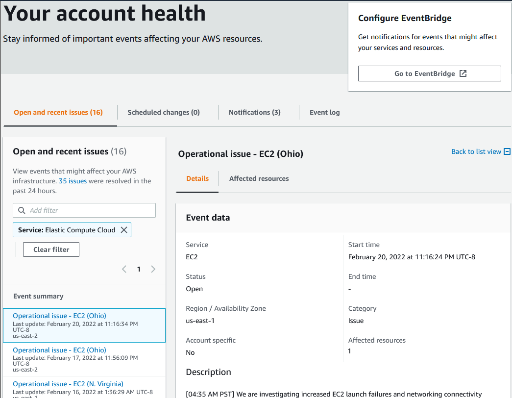
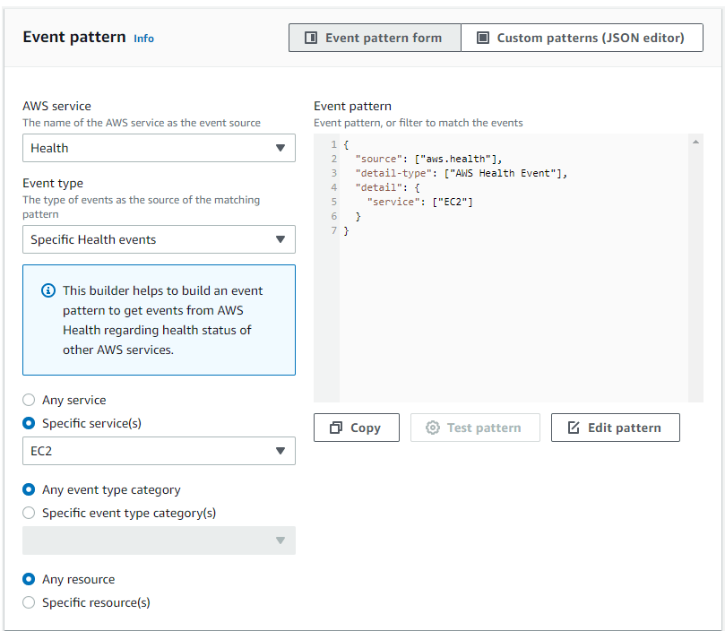

<!-- omit in toc -->
# AWS Health Dashboard - Security Baseline Requirement
<!-- omit in toc -->
## Baseline security configuration requirement for AWS services 
---
**Generated By: EY Security Team**

**Service Type: Management & Governance**

**Deployment Phase: Service Discovery** 

**Last Update: 07/27/2022**

## Table of Contents  <!-- omit in toc -->
- [Overview](#overview)
  - [Use Case Examples:](#use-case-examples)
- [Cloud Security Requirements](#cloud-security-requirements)
  - [1. Ensure AWS Health users and roles are following least privilege model](#1-ensure-aws-health-users-and-roles-are-following-least-privilege-model)
  - [2. Ensure to always view the AWS Health Dashboard](#2-ensure-to-always-view-the-aws-health-dashboard)
  - [3. Ensure CloudTrail logging is enabled for AWS Health](#3-ensure-cloudtrail-logging-is-enabled-for-aws-health)
  - [4. Ensure to monitor AWS Health events with Amazon EventBridge](#4-ensure-to-monitor-aws-health-events-with-amazon-eventbridge)
  - [5. Ensure AWS Health uses standard organizational resource tagging method](#5-ensure-aws-health-uses-standard-organizational-resource-tagging-method)
- [Endnotes](#endnotes)
  - [Resources](#resources)
  - [Glossary](#glossary)
<!-- TOC -->


##  Overview
The AWS Health Dashboard is the single place to learn about the availability and operations of AWS services. AWS Health provides ongoing visibility into your resource performance and the availability of your AWS services and accounts. You can use AWS Health events to learn how service and resource changes might affect your applications running on AWS. AWS Health provides relevant and timely information to help you manage events in progress. AWS Health also helps you be aware of and to prepare for planned activities. The service delivers alerts and notifications triggered by changes in the health of AWS resources, so that you get near-instant event visibility and guidance to help accelerate troubleshooting.

| Control Number | Cloud Baseline Security Requirements                                                                                |
| -------------- | --------------------------------------------------------------------------------------------------------------------|
| 1	           | Ensure AWS Health users and roles are following least privilege model                                               |
| 2	           | Ensure to always view the AWS Health Dashboard                                                                      |
| 3	           | Ensure CloudTrail logging is enabled for AWS Health                                                                 |
| 4	           | Ensure to monitor AWS Health events with Amazon EventBridge                                                         |
| 5	           | Ensure AWS Health uses standard organizational resource tagging method                                              |

### Use Case Examples:
- Personalized view of service health
- Proactive notifications
- Aggregate health events across AWS Organizations

## Cloud Security Requirements ##

### 1. Ensure AWS Health users and roles are following least privilege model

**Security control mapping:** <br>
| Control Number | Control Statement | Security Domain | Default | Associated Runbook |CVSS Severity|
| ------------------ | ------------| --------------- | ------- | ------------------ |---|
| CS0012298 | Access to change cloud identity access and service control policies is restricted to authorized cloud administrative personnel| Identity and Access Management| Not Enabled | None |[Medium (6.8)](https://www.first.org/cvss/calculator/3.1#CVSS:3.1/AV:N/AC:H/PR:H/UI:R/S:C/C:L/I:L/A:H)|

**Why?** <br>

By default, IAM users and roles don't have permission to create or modify AWS Health resources. They also can't perform tasks using the AWS Management Console, AWS CLI, or AWS API. An IAM administrator must create IAM policies that grant users and roles permission to perform specific API operations on the specified resources they need. The administrator must then attach those policies to the IAM users or groups that require those permissions. AWS Health supports identity-based policies and resource-based policies. With IAM identity-based policies,allowed or denied actions can be specified and resources as well as the conditions under which actions are allowed or denied. Resource-based policies are JSON policy documents that specify what actions a specified principal can perform on the AWS Health resource and under what conditions. AWS Health supports resource-based permissions policies for health events.

**Following are the suggested roles for AWS Health** <br>

| Function | Description | Role | 
| -------------- | ----------------- | --------------- | 
|  Developer | Responsible for granting identity based access to users| Custom resource role developed by IAM admin team |
| IAM admin team | This service-linked role is responsible to allow AWS Health to to call other AWS services| Health_OrganizationsServiceRolePolicy |


**How?** <br>

- Administrators can use AWS JSON policies to specify who has access to what. That is, which principal can perform actions on what resources, and under what conditions.

- AWS Health supports only resource-based policies for the `DescribeAffectedEntities` and `DescribeEventDetails` API operations. You can specify these actions in a policy to define which principal entities (accounts, users, roles, and federated users) can perform actions on the AWS Health event.

- Service-linked roles allow AWS services to access resources in other services to complete an action on your behalf. Service-linked roles appear in your IAM account and are owned by the service. An IAM administrator can view but not edit the permissions for service-linked roles. AWS Health supports service-linked roles to integrate with AWS Organizations.

**Example 1 - Allow users to view their own permissions**
This example shows how you might create a policy that allows IAM users to view the inline and managed policies that are attached to their user identity.

```json
{
    "Version": "2012-10-17",
    "Statement": [
        {
            "Sid": "ViewOwnUserInfo",
            "Effect": "Allow",
            "Action": [
                "iam:GetUserPolicy",
                "iam:ListGroupsForUser",
                "iam:ListAttachedUserPolicies",
                "iam:ListUserPolicies",
                "iam:GetUser"
            ],
            "Resource": ["arn:aws:iam::*:user/${aws:username}"]
        },
        {
            "Sid": "NavigateInConsole",
            "Effect": "Allow",
            "Action": [
                "iam:GetGroupPolicy",
                "iam:GetPolicyVersion",
                "iam:GetPolicy",
                "iam:ListAttachedGroupPolicies",
                "iam:ListGroupPolicies",
                "iam:ListPolicyVersions",
                "iam:ListPolicies",
                "iam:ListUsers"
            ],
            "Resource": "ARN of respective resource"
        }
    ]
}
```
**Example 2 - Deny access to AWS Health organizational view**

This policy statement denies access to the AWS Organizations actions but allows access to the AWS Health actions for an individual account.

```json
{
    "Version": "2012-10-17",
    "Statement": [
        {
            "Effect": "Allow",
            "Action": [
                "health:*"
            ],
            "Resource": "ARN of respective resource"
        },
        {
            "Effect": "Deny",
            "Action": [
                "organizations:EnableAWSServiceAccess",
                "organizations:DisableAWSServiceAccess"
            ],
            "Resource": "ARN of respective resource",
            "Condition": {
                "StringEquals": {
                    "organizations:ServicePrincipal": "health.amazonaws.com"
                }
            }
        },
        {
            "Effect": "Deny",
            "Action": [
                "organizations:DescribeAccount",
                "organizations:ListAccounts",
                "organizations:ListDelegatedAdministrators",
                "organizations:ListParents"
            ],
            "Resource": "ARN of respective resource"
        },
        {
            "Effect": "Deny",
            "Action": "iam:CreateServiceLinkedRole",
            "Resource": "arn:aws:iam::*:role/aws-service-role/health.amazonaws.com/AWSServiceRoleForHealth*"
        }
    ]
}
```

**Example 3 - Action-based condition**
This policy statement grants access to AWS Health Dashboard and the AWS Health Describe* API operations, but denies access to any AWS Health events that relate to Amazon EC2.

```json
{
    "Version": "2012-10-17",
    "Statement": [
        {
            "Effect": "Allow",
            "Action": "health:Describe*",
            "Resource": "ARN of respective resource"
        },
        {
            "Effect": "Deny",
            "Action": [
                "health:DescribeAffectedEntities",
                "health:DescribeEventDetails"
            ],
            "Resource": "ARN of respective resource",
            "Condition": {
                "StringEquals": {
                    "health:service": "EC2"
                }
            }
        }
    ]
}
```
**Example 4 - eventTypeCode condition**
This policy statement grants access to AWS Health Dashboard and the AWS Health Describe* API operations, but denies access to any AWS Health events with the eventTypeCode that matches AWS_EC2_*.

```json
{
    "Version": "2012-10-17",
    "Statement": [
        {
            "Effect": "Allow",
            "Action": "health:Describe*",
            "Resource": "ARN of respective resource"
        },
        {
            "Effect": "Deny",
            "Action": [
                "health:DescribeAffectedEntities",
                "health:DescribeEventDetails"
            ],
            "Resource": "ARN of respective resource",
            "Condition": {
                "StringLike": {
                    "health:eventTypeCode": "AWS_EC2_*"
                }
            }
        }
    ]
}
```
### 2. Ensure to always view the AWS Health Dashboard

**Security control mapping:** <br>
| Control Number | Control Statement | Security Domain | Default | Associated Runbook |CVSS Severity|
| ------------------ | ------------| --------------- | ------- | ------------------ |---|
| CS0012233| Information system must create a log and record activities occurring on or originating from the information system. Logs must be made accessible to the enterprise SIEM solution | Security Information and event management | Not Enabled | None|[Medium(4.0)](https://www.first.org/cvss/calculator/3.1#CVSS:3.1/AV:L/AC:L/PR:N/UI:N/S:U/C:N/I:N/A:L)|

**Why?** <br>

It is suggested to check your AWS Health Dashboard often to identify events that might affect your account or applications. For example, you might receive an event notification about your resources, such as an Amazon Elastic Compute Cloud (Amazon EC2) instance that needs to be updated.

**How?** <br>

To view account events in your AWS Health Dashboard

**_Step 1:_** Open the AWS Health Dashboard at https://phd.aws.amazon.com/phd/home#/

**_Step 2:_** In the navigation pane, for Your account health, you can choose the following options:

- Open and recent issues – View recently opened and closed events.
- Scheduled changes – View upcoming events that might affect your services and resources.
- Other notifications – View all other notifications and ongoing events from the past seven days that might affect your account.
- Event log – View all events from the past 90 days.
  


### 3. Ensure CloudTrail logging is enabled for AWS Health

**Security control mapping:** <br>
| Control Number | Control Statement | Security Domain | Default | Associated Runbook |CVSS Severity|
| ------------------ | ------------| --------------- | ------- | ------------------ |---|
| CS0012233| Information system must create a log and record activities occurring on or originating from the information system. Logs must be made accessible to the enterprise SIEM solution | Security Information and event management | Not Enabled | None|[Low(2.5)](https://www.first.org/cvss/calculator/3.1#CVSS:3.1/AV:L/AC:H/PR:H/UI:N/S:C/C:N/I:N/A:L)|

**Why?** <br>
    
AWS Health is integrated with AWS CloudTrail, a service that provides a record of actions taken by a user, role, or an AWS service in AWS Health. CloudTrail captures all API calls for AWS Health as events. The calls captured include calls from the AWS Health console and code calls to the AWS Health API operations. 

**How?** <br>

CloudTrail is enabled on your AWS account when you create the account. When activity occurs in AWS Health, that activity is recorded in a CloudTrail event, along with other AWS service events, in Event history. For an ongoing record of events in your AWS account, including events for Health, create a trail. A trail enables AWS Health to deliver log files to an Amazon S3 bucket.

***To create a CloudTrail trail using API :***

To create a trail that applies to all Regions, use the `--is-multi-region-trail` option. By default, the `create-trail` command creates a trail that logs events only in the AWS Region where the trail was created. To ensure that you log global service events and capture all management event activity in your AWS account, you should create trails that log events in all AWS Regions.

The following example creates a trail with the name `my-trail` and a tag with a key named `Group` with a value of `Marketing` that delivers logs from all Regions to an existing bucket named `my-bucket`.

```
aws cloudtrail create-trail --name my-trail --s3-bucket-name my-bucket --is-multi-region-trail --tags-list [key=Group,value=Marketing]
```

To confirm that your trail exists in all Regions, the `IsMultiRegionTrail` element in the `output` shows `true`.
```
{
    "IncludeGlobalServiceEvents": true, 
    "Name": "my-trail", 
    "TrailARN": "arn:aws:cloudtrail:us-east-2:123456789012:trail/my-trail", 
    "LogFileValidationEnabled": false, 
    "IsMultiRegionTrail": true, 
    "IsOrganizationTrail": false,
    "S3BucketName": "my-bucket"
}
```

>***Note***
Use the start-logging command to start logging for your trail.

<br><br> 

### 4. Ensure to monitor AWS Health events with Amazon EventBridge

**Security control mapping:** <br>
| Control Number | Control Statement | Security Domain | Default | Associated Runbook |CVSS Severity|
| ------------------ | ------------| --------------- | ------- | ------------------ |---|
| CS0012233| Information system must create a log and record activities occurring on or originating from the information system. Logs must be made accessible to the enterprise SIEM solution  | Security Information and event management | Not Enabled | None|[Low(2.5)](https://www.first.org/cvss/calculator/3.1#CVSS:3.1/AV:L/AC:H/PR:H/UI:N/S:C/C:N/I:N/A:L)|

**Why?** <br>

AWS Health is integrated with Amazon EventBridge to detect and react to AWS Health events. Based on rules that you create, EventBridge invokes one or more target actions when an event matches the values that you specify in a rule. Depending on the type of event, you can capture event information, initiate additional events, send notifications, take corrective action, or perform other actions.

**How?** <br>

To create an EventBridge rule for AWS Health

**_Step 1:_** Open the Amazon EventBridge console at https://console.aws.amazon.com/events/.

**_Step 2:_** To change the AWS Region, use the Region selector in the upper-right corner of the page. Choose the Region in which you want to track AWS Health events.

**_Step 3:_** In the navigation pane, choose **Rules**.

**_Step 4:_** Choose **Create rule**.

**_Step 5:_** On the **Define rule** detail page, enter a **name** and **description** for your rule.

**_Step 6:_** Keep the default values for **Event bus** and **Rule type**, and then choose Next.

**_Step 7:_** On the **Build event pattern** page, for **Event source**, choose **AWS events or EventBridge partner events**.

**_Step 8:_** Under **Event pattern**, for AWS service, choose **Health**.

**_Step 9:_** For **Event type**, choose one of the following options.

- **Specific Health Abuse Events** – Create a rule for AWS Health events that have the word Abuse in the event type name.

- **Specific Health events** – Create a rule for events for a specific AWS service, such as Amazon EC2.

**_Step 10:_** You can choose **Any service** or **Specific service(s)**. If you chose a specific service, choose one of the following options:

- Choose **Any event type category** to create a rule that applies to all event type categories.

- Choose **Specific event type category(s)** and then choose a value from the list, such as issue, accountNotification, or scheduledChange.

**_Step 11:_** If you chose a specific service and event type category, choose one of the following options for event type codes.

- Choose **Any event type code** to create a rule that applies to all event type codes.

- Choose **Specific event type code(s)** and then choose one or more values from the list. This creates a rule that applies only to specific event type codes. 

**_Step 12:_** Choose one of the following options for affected resources.

- Choose **Any resource** to create a rule that applies to all resources.

- Choose **Specific resource(s)** and enter the IDs of one or more resources. For example, you might specify an Amazon EC2 instance ID, such as i-EXAMPLEa1b2c3de4, to monitor for events that affect only this resource.

**_Step 13:_** Review your rule setup so that it meets your event-monitoring requirements.

**_Step 14:_** Choose **Next**.



**_Step 15:_** On the **Select target(s)** page, choose the target type that you created for this rule, and then configure any additional options that are required for that type. For example, you might send the event to an Amazon SQS queue or an Amazon SNS topic.

**_Step 16:_** Choose **Next**.

**_Step 17:_** (Optional) On the Configure tags page, add any tags and then choose Next.

**_Step 18:_** On the **Review and create** page, review your rule setup and ensure that it meets your event monitoring requirements.

**_Step 19:_** Choose **Create rule**.

<br><br> 

### 5. Ensure AWS Health uses standard organizational resource tagging method

**Security control mapping:** <br>
| Control Number | Control Statement | Security Domain | Default | Associated Runbook |CVSS Severity|
| ------------------ | ------------| --------------- | ------- | ------------------ |---|
|CS0012128| Technology hardware and software must be registered and accurately recorded within the enterprise technology repository and/or asset management systems | Asset Management | Not Enabled | Organizational Runbook |[Low(1.6)](https://www.first.org/cvss/calculator/3.1#CVSS:3.1/AV:P/AC:H/PR:H/UI:N/S:U/C:N/I:N/A:L)|


**What, Why & How?** <br>

Identification of your IT assets is a crucial aspect of governance and security. You need to have visibility of all Detective resources to assess their security posture and take action on potential areas of weakness.

Tagging resources in the cloud is an easy way for teams to provide information related to who owns the resource, what the resource is used for, as well as other important information related to the deployment lifecycle of the resource. Organization has mandated that all cloud resources are to be tagged with for cross-team use.

[Place Holder for link]
<br><br> 

## Endnotes ##

### Resources 
1. https://aws.amazon.com/premiumsupport/technology/aws-health-dashboard/
2. https://docs.aws.amazon.com/health/latest/ug/getting-started-health-dashboard.html

### Glossary 

**Data** - Digital pieces of information stored or transmitted for use with an information system from which understandable information is
derived. Items considered to be data are: Source code, meta-data, build artifacts, information input and output.

**Information System** - An organized assembly of resources and procedures for the collection, processing, maintenance, use, sharing,
dissemination, or disposition of information. All systems, platforms, compute instances including and not limited to physical and virtual
client endpoints, physical and virtual servers, software containers, databases, Internet of Things (IoT) devices, network devices,
applications (internal and external), Serverless computing instances (i.e. AWS Lambda), vendor provided appliances, and third-party
platforms, connected to the Capital Group network or used by Capital Group users or customers.

**Log** - a record of the events occurring within information systems and networks. Logs are composed of log entries; each entry contains
information related to a specific event that has occurred within a system or network.

**Information** - communication or representation of knowledge such as facts, data, or opinions in any medium or form, including textual,
numerical, graphic, cartographic, narrative, or audiovisual.

**Cloud Computing** - A model for enabling ubiquitous, convenient, on-demand network access to a shared pool of configurable computing
resources (e.g., networks, servers, storage, applications, and services) that can be rapidly provisioned and released with minimal
management effort or service provider interaction.

**Vulnerability**- Weakness in an information system, system security procedures, internal controls, or implementation that could be exploited
or triggered by a threat source. Note: The term weakness is synonymous for deficiency. Weakness may result in security and/or privacy
risks.
