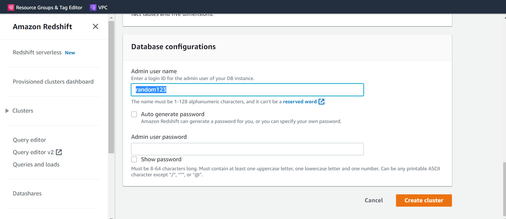
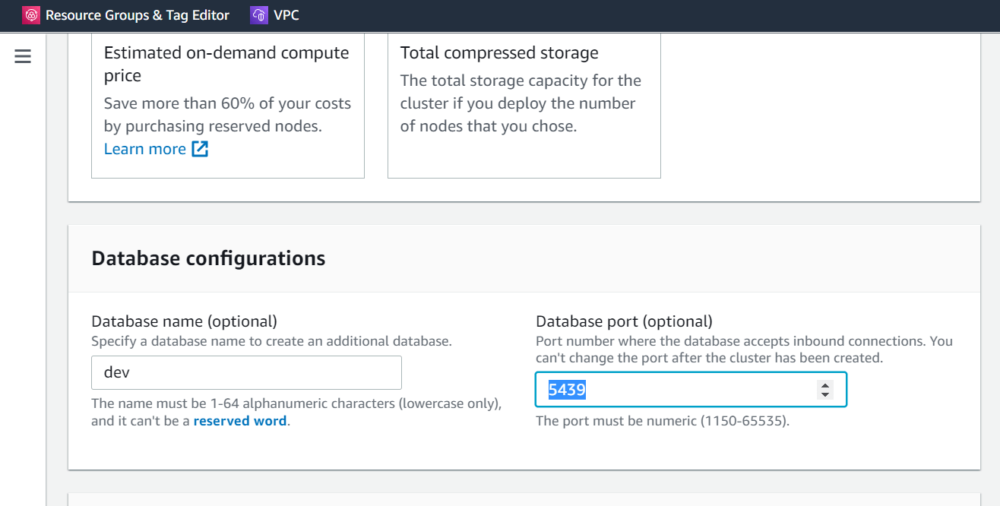
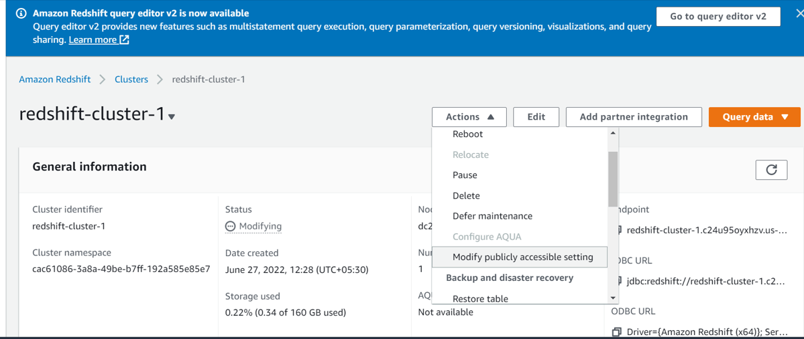
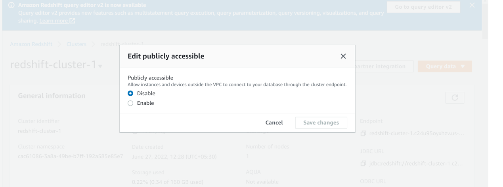
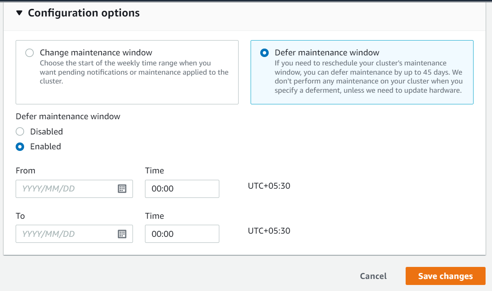
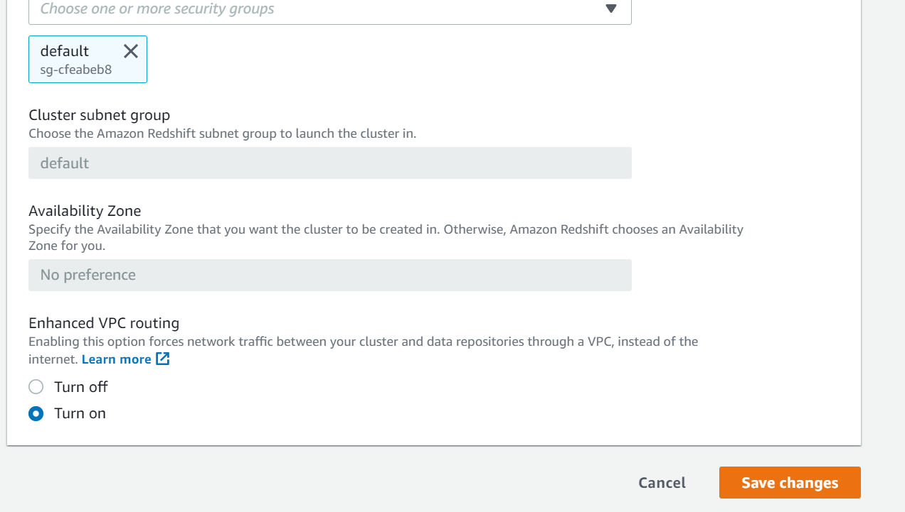
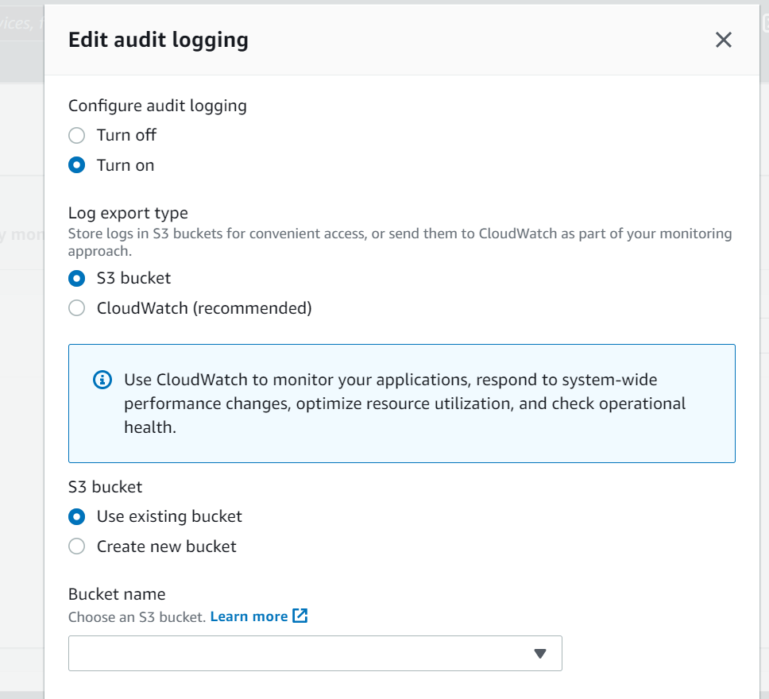
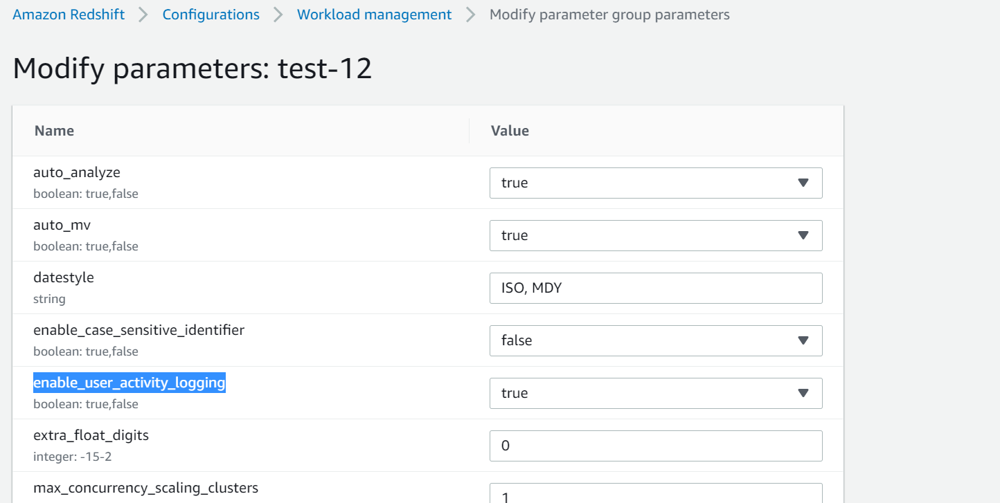
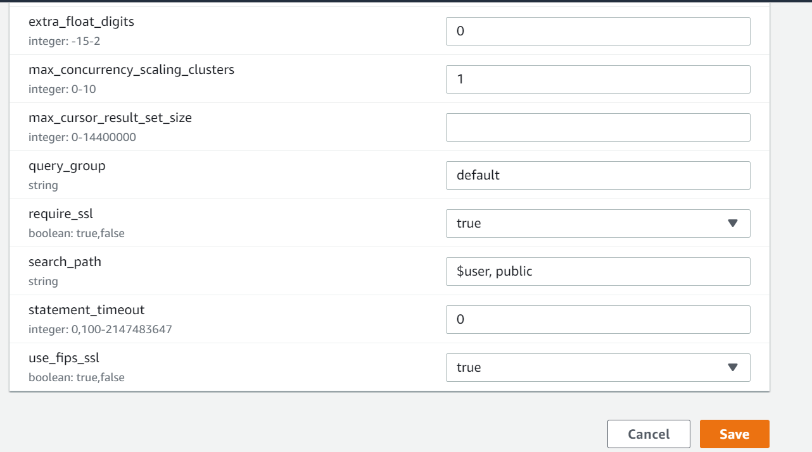
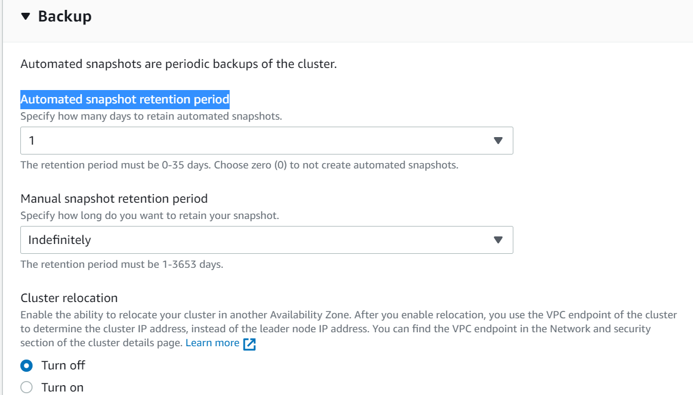

<!-- omit in toc -->
# Amazon Redshift - Security Baseline Requirement
<!-- omit in toc -->
## Baseline security configuration requirement for AWS services ###
---

Summary of changes: 
1. Added new controls
2. Updated the security control mappings
3. Added new column 'CVSS-Severity' in security control mapping
4. Added the implementation steps in 'How' section

**Generated By: EY Security Team**

**Service Type: Analytics**

**Deployment Phase: Service Discovery** 

**Last Update: 06/17/2022**

## Table of Contents  <!-- omit in toc -->
<!-- TOC -->
- [Overview](#overview)
  - [Use Case Examples:](#use-case-examples)
- [Cloud Security Requirements](#cloud-security-requirements)
  - [1. Ensure Redshift clusters are deployed in private VPC](#1-ensure-redshift-clusters-are-deployed-in-private-vpc)
  - [2. Ensure Redshift clusters are encrypted at rest](#2-ensure-redshift-clusters-are-encrypted-at-rest)
  - [3. Ensure Redshift clusters are encrypted in transit](#3-ensure-redshift-clusters-are-encrypted-in-transit)
  - [4. Ensure Redshift implement access control to enforce least privilege](#4-ensure-redshift-implement-access-control-to-enforce-least-privilege)
  - [5. Ensure Redshift database clusters are not using default master username](#5-ensure-redshift-database-clusters-are-not-using-default-master-username)
  - [6. Ensure Redshift database clusters are not using default port for database connection](#6-ensure-redshift-database-clusters-are-not-using-default-port-for-database-connection)
  - [7. Ensure Redshift clusters are not publicly accessible](#7-ensure-redshift-clusters-are-not-publicly-accessible)
  - [8. Ensure deferred maintenance window is enabled for Redshift cluster](#8-ensure-deferred-maintenance-window-is-enabled-for-redshift-cluster)
  - [9. Ensure to enable enhanced VPC Routing for Amazon Redshift](#9-ensure-to-enable-enhanced-vpc-routing-for-amazon-redshift)
  - [10. Ensure to enable automatic upgrade to major versions in Amazon Redshift](#10-ensure-to-enable-automatic-upgrade-to-major-versions-in-amazon-redshift)
  - [11. Ensure audit logging is enabled for Redshift clusters](#11-ensure-audit-logging-is-enabled-for-redshift-clusters)
  - [12. Ensure user activity logging is enabled for AWS Redshift clusters](#12-ensure-user-activity-logging-is-enabled-for-aws-redshift-clusters)
  - [13. Ensure FIPS-compliant SSL mode is enabled](#13-ensure-fips-compliant-ssl-mode-is-enabled)
  - [14. Ensure to use AWS Secrets Manager for storing and rotating the credentials](#14-ensure-to-use-aws-secrets-manager-for-storing-and-rotating-the-credentials)
  - [15. Ensure Redshift cluster is not provisioned using EC2-classic (deprecated) platform](#15-ensure-redshift-cluster-is-not-provisioned-using-ec2-classic-deprecated-platform)
  - [16. Ensure automated backups are enabled for Redshift cluster](#16-ensure-automated-backups-are-enabled-for-redshift-cluster)
  - [17. Ensure CloudTrail logging is enabled for AWS Redshift](#17-ensure-cloudtrail-logging-is-enabled-for-aws-redshift)
  - [18. Ensure to monitor Amazon Redshift using Amazon EventBridge](#18-ensure-to-monitor-amazon-redshift-using-amazon-eventbridge)
  - [19. Ensure AWS Redshift uses standard organizational Resource tagging method](#19-ensure-aws-redshift-uses-standard-organizational-resource-tagging-method)
- [Endnotes](#endnotes)
  - [Resources](#resources)
  - [Glossary](#glossary)
<!-- /TOC -->

##  Overview
A Redshift Database is a cloud-based, big data warehouse solution offered by Amazon. The platform provides a storage system that lets companies store petabytes of data in easy-to-access “clusters” that can be queried in parallel. Each of these nodes can be accessed independently by users and applications. Redshift is designed to be used with a variety of data sources and data analytics tools and is compatible with several existing SQL-based clients.

| Control Number | Cloud Baseline Security Requirements                                                                                |
| -------------- | --------------------------------------------------------------------------------------------------------------------|
| 1	           | Ensure Redshift clusters are deployed in private VPC                                                                |
| 2	           | Ensure Redshift clusters are encrypted at rest                                                                      |
| 3	           | Ensure Redshift clusters are encrypted in transit                                                                   |
| 4	           | Ensure Redshift implement access control to enforce least privilege                                                 |
| 5	           | Ensure Redshift database clusters are not using default master username                                             |
| 6	           | Ensure Redshift database clusters are not using default port for database connection                                |
| 7	           | Ensure Redshift clusters are not publicly accessible                                                                |
| 8	           | Ensure deferred maintenance window is enabled for Redshift cluster                                                  |
| 9	           | Ensure to enable enhanced VPC Routing for Amazon Redshift                                                           |
| 10	           | Ensure to enable automatic upgrade to major versions in Amazon Redshift                                             |
| 11	           | Ensure audit logging is enabled for Redshift clusters                                                               |
| 12	           | Ensure user activity logging is enabled for AWS Redshift clusters                                                   |
| 13	           | Ensure FIPS-compliant SSL mode is enabled                                                                           |
| 14	           | Ensure to use AWS Secrets Manager for storing and rotating the credentials                                          |
| 15	           | Ensure Redshift cluster is not provisioned using EC2-classic (deprecated) platform                                  |
| 16	           | Ensure automated backups are enabled for Redshift cluster                                                           |
| 17	           | Ensure CloudTrail logging is enabled for AWS Redshift                                                               |
| 18	           | Ensure to monitor Amazon Redshift using Amazon EventBridge                                                          |
| 19	           | Ensure AWS Redshift uses standard organizational Resource tagging method                                            |

### Use Case Examples:
- Improve financial and demand forecasts
- Collaborate and share data
- Optimize business intelligence
- Increase developer productivity

## Cloud Security Requirements ##

### 1. Ensure Redshift clusters are deployed in private VPC
        [Place Holder]

### 2. Ensure Redshift clusters are encrypted at rest
        [Place Holder]

### 3. Ensure Redshift clusters are encrypted in transit
        [Place Holder]

### 4. Ensure Redshift implement access control to enforce least privilege
        [Place Holder]

### 5. Ensure Redshift database clusters are not using default master username

**Security control mapping:**  
| Control Number | Control Statement | Security Domain | Default | Associated Runbook |CVSS Severity|
| ------------------ | ------------| --------------- | ------- | ------------------ |---|
| CS0012298 | Access to change cloud identity access and service control policies is restricted to authorized cloud administrative personnel| Identity and Access Management | Not Enabled | None |[Medium(6.0)](https://www.first.org/cvss/calculator/3.1#CVSS:3.1/AV:L/AC:H/PR:H/UI:N/S:U/C:L/I:H/A:H)|

**Why?**  

Ensure that AWS Redshift database clusters are using custom master user names instead of the default master user name (i.e. "awsuser") in order to add an additional layer of defense against non-targeted attacks.

**How?**  
 
Follow below steps to change the master username:

**_Step 1:_** Sign in to AWS Management Console. 

**_Step 2:_** Navigate to Redshift dashboard at https://console.aws.amazon.com/redshift/. 

**_Step 3:_** In the left navigation panel, under Redshift Dashboard, click Clusters. 

**_Step 4:_** Choose the Redshift cluster that you want to examine then click on its identifier/name link, listed in the Cluster column. 

**_Step 5:_** On the selected cluster configuration page, in the Cluster Database Properties section, verify the Master Username attribute value. If the value is set to 'awsuser', the selected Amazon Redshift cluster is using the default master user name for database access, therefore is vulnerable to hacking so you will need to create a new cluster in parallel. 

**_Step 6:_** Navigate back to the main page https://console.aws.amazon.com/redshift.<>br

**_Step 7:_** Select Create cluster button in the top right corner of this page. 

**_Step 8:_** Under **Database configurations** be sure to now use a different Master user name other than the default provided. 
 

`Note: !important ensure that you use the same settings that are being used with the existing cluster:
Encryption Keys
Parameter groups
`

**_Step 9:_** Unload your data from the old Redshift cluster and reload it into the newly created database cluster using the Amazon Redshift Unload/Copy utility.  

**_Step 10:_** Once the data migration process has completed and data loaded into the new cluster, update your application end points to point to the new cluster endpoint.  

For more details, refer the link: https://docs.aws.amazon.com/redshift/latest/mgmt/managing-clusters-console.html

   

### 6. Ensure Redshift database clusters are not using default port for database connection

**Security control mapping:**  
| Control Number | Control Statement | Security Domain | Default | Associated Runbook |CVSS Severity|
| ------------------ | ------------| --------------- | ------- | ------------------ |---|
| CS0012133 |[Place Holder] | Configuration Management | Not Enabled | None |[Medium(4.5)](https://www.first.org/cvss/calculator/3.1#CVSS:3.1/AV:L/AC:H/PR:L/UI:N/S:U/C:L/I:L/A:L)|

**Why?**  

Organization recommends to replace the default endpoint port number (5439) in AWS Redshift database clusters with a custom one to promote port obfuscation as an additional layer of defense against non-targeted attacks. It adds an extra layer of security, protecting publicly accessible Amazon Redshift clusters from brute-force and dictionary attacks.

**How?**  

Follow below steps to change the default port:

**_Step 1:_** Sign in to AWS Management Console. 

**_Step 2:_** Navigate to Redshift dashboard at https://console.aws.amazon.com/redshift/. 

**_Step 3:_** On the left hand panel select Clusters. 

**_Step 4:_** Select the Cluster hyperlink for the database cluster you would like to check. 

**_Step 5:_** Under Properties scroll down to Database configurations and look under Port to see if this is set to 5439. 

**_Step 6:_** If Port is currently set to 5439 then you will need to create a new cluster in parallel. 

**_Step 7:_** Navigate back to the main page and Select Create cluster button in the top right corner of this page. 

**_Step 8:_** Select the Redshift cluster that you want to reconfigure then click on its identifier link, listed in the Cluster column. 

**_Step 9:_** Click the Backup dropdown button from the dashboard top menu and select Take Snapshot. 

**_Step 10:_** On the Create Snapshot dialog box, enter a unique name for your database cluster snapshot in the Snapshot Identifier box then click Create to build the snapshot. The process could take several minutes. Once the snapshot is created it will appear on your Redshift Snapshots page. 

**_Step 11:_** In the navigation panel, under Redshift Dashboard, click Snapshots. 

**_Step 12:_** Select the Amazon Redshift cluster snapshot created at step no. 9. 

**_Step 12:_** Click the Actions dropdown button from the dashboard top menu and select Restore From Snapshot. 

**_Step 13:_** Within Restore Cluster From Snapshot dialog box, perform the following actions:

    - In the Cluster Identifier box, enter a unique name for the new (reconfigured) Redshift cluster.
  
    - Change the default database port number available inside the Port box with a custom port number.
   
  
    - Configure the rest of the options (Node Type, Cluster Parameter Group, Availability Zone, VPC Security Groups, etc) based on the configuration information taken from the existing database cluster.
  
**_Step 14:_** Click Restore to create the new Redshift database cluster.

**_Step 15:_** Once your new cluster is up in a healthy state, you can now start to migrate data to the new cluster. 

**_Step 16:_** Unload your data from the old Redshift cluster and reload it into the newly created database cluster using the Amazon Redshift Unload/Copy utility. 

**_Step 17:_** Once the data migration process has completed and data loaded into the new cluster, update your application end points to point to the new cluster endpoint. 

For more details, refer the link: https://docs.aws.amazon.com/redshift/latest/mgmt/managing-clusters-console.html
   

### 7. Ensure Redshift clusters are not publicly accessible

**Security control mapping:**  
| Control Number | Control Statement | Security Domain | Default | Associated Runbook |CVSS Severity|
| ------------------ | ------------| --------------- | ------- | ------------------ |---|
| CS0012300| Cloud products and services must be deployed on private subnets and public access must be disabled for these services  | Network and communication Security | Not Enabled | None|[Medium(6.0)](https://www.first.org/cvss/calculator/3.1#CVSS:3.1/AV:N/AC:H/PR:L/UI:N/S:C/C:L/I:L/A:L)|

**Why?**  

When Amazon Redshift clusters are publicly accessible and have a public IP address, every machine on the Internet can establish a connection to clusters and this can increase the opportunity for malicious activity such as SQL injections or Distributed Denial of Service (DDoS) attacks. So as per the security best practice it is suggested not to enable public access feature in Redshift clusters.

**How?**  

Follow below steps to disable public traffic:

**_Step 1:_** Login to the AWS Management Console. 

**_Step 2:_** Navigate to Redshift dashboard at https://console.aws.amazon.com/redshift/. 

**_Step 3:_** In the left navigation panel, under Redshift Dashboard, click Clusters. 

**_Step 4:_** Choose the Redshift cluster that you want to examine then click on its identifier (name). 

**_Step 5:_** On the selected cluster configuration page, in the **Cluster Database Properties** section, verify the 'Publicly Accessible' property status. 

If the current status is set to **Enabled**, the selected Redshift cluster is publicly accessible from the Internet and widely exposed to security threats. 

**_Step 6:_** Click the Cluster dropdown button from the dashboard top menu then click Modify. 

**_Step 7:_** Within Modify Cluster dialog box, select No next to Publicly Accessible to disable unrestricted (public) access to the selected AWS Redshift cluster. 
 
**_Step 8:_** Click the Modify button to apply the changes. The Publicly Accessible property status should change to Disabled. 
 
For more details, refer the link: https://docs.aws.amazon.com/redshift/latest/mgmt/managing-clusters-console.html

   

### 8. Ensure deferred maintenance window is enabled for Redshift cluster

**Security control mapping:**  
| Control Number | Control Statement | Security Domain | Default | Associated Runbook |CVSS Severity|
| ------------------ | ------------| --------------- | ------- | ------------------ |---|
| CS0012133 |[Place Holder] | Configuration Management | Not Enabled | None |[Medium(4.0)](https://www.first.org/cvss/calculator/3.1#CVSS:3.1/AV:L/AC:L/PR:N/UI:N/S:U/C:N/I:N/A:L)|

**Why?**  

Ensure that deferred maintenance is enabled for all your AWS Redshift clusters in order to keep  data warehouse running without interruption during critical business periods. It is recommended to defer the scheduled maintenance to a less busy interval. With the Deferred Maintenance feature the scheduled maintenance can be postponed up to 14 days. During this time, AWS Redshift does not apply any software updates.

**How?**  
Follow below steps to enable deferred maintenance window:

**_Step 1:_** Sign in to AWS Management Console. 

**_Step 2:_** Navigate to Redshift dashboard at https://console.aws.amazon.com/redshift/. 

**_Step 3:_** In the left navigation panel, under Redshift Dashboard, click Clusters. 

**_Step 4:_** Choose the AWS Redshift cluster that you want to modify, then click on its name (link) listed in the Cluster column. 

**_Step 5:_** On the selected cluster Configuration tab, in the Backup, Audit Logging, and Maintenance section, verify the Defer maintenance configuration attribute value. If the attribute does not have a value (i.e. a time frame) assigned, instead a Set it now link is displayed, the Deferred Maintenance feature is not enabled for the selected Amazon Redshift cluster. 

**_Step 6:_** Click the Cluster dropdown button from the dashboard top menu and select Modify. 

**_Step 7:_** Inside the Modify cluster dialog box, select the Maintenance settings tab and within Maintenance window settings section, perform the following actions:

    a. Select Defer maintenance checkbox to enable the feature and show its configuration panel. 

    b. Use From and To datepicker forms to set the start and the end of the time period when you don’t want maintenance actions performed. 

    c. Once the preferred deferred maintenance window is configured, click Modify to apply the configuration changes.
 
For more details, refer the link: https://aws.amazon.com/premiumsupport/knowledge-center/redshift-upgrade-maintenance-window/

   

### 9. Ensure to enable enhanced VPC Routing for Amazon Redshift 

**Security control mapping:**  
| Control Number | Control Statement | Security Domain | Default | Associated Runbook |CVSS Severity|
| ------------------ | ------------| --------------- | ------- | ------------------ |---|
| CS0012300| Cloud products and services must be deployed on private subnets and public access must be disabled for these services  | Network and communication Security | Not Enabled | None|[Medium(5.3)](https://www.first.org/cvss/calculator/3.1#CVSS:3.1/AV:N/AC:L/PR:N/UI:N/S:U/C:N/I:N/A:L)|

**Why?**  
    
In order to force the traffic between Redshift clusters and AWS cloud resources to pass through the VPC and not through the internet it is recommended to enable enhanced VPC routing feature in Amazon Redshift data warehouse clusters which helps to tightly manage the network traffic. 

**How?**  

Follow below steps to enable enhanced VPC Routing:

**_Step 1:_** Sign in to the AWS Management Console. 

**_Step 2:_** Navigate to Amazon Redshift console at https://console.aws.amazon.com/redshiftv2/. 

**_Step 3:_** In the navigation panel, under Redshift Dashboard, choose Clusters. 

**_Step 4:_** Click on the name of the cluster that you want to examine, listed in the Cluster column. 

**_Step 5:_** Choose the Properties tab to access the network and security configuration information available for the selected Redshift resource. 

**_Step 6:_** In the Network and security section, check the Enhanced VPC routing configuration status. If the Enhanced VPC routing status is set to Disabled, the Enhanced VPC Routing security feature is not enabled for the selected Amazon Redshift data warehouse cluster. 

**_Step 7:_** Choose Edit from the console top menu to modify the selected cluster configuration. 

**_Step 8:_** On the Modify cluster <cluster-name> configuration page, expand the Network and security panel, and select Enable under 'Enhanced VPC routing' to enable the Enhanced VPC Routing security feature for the selected Amazon Redshift cluster. Choose Modify cluster to apply the configuration changes. Once the reconfiguration process is finished, the cluster status should change from Modifying to Available. 
 

For more details, refer the link: https://docs.aws.amazon.com/redshift/latest/mgmt/enhanced-vpc-enabling-cluster.html

   

### 10. Ensure to enable automatic upgrade to major versions in Amazon Redshift 
    [Place Holder]
    

### 11. Ensure audit logging is enabled for Redshift clusters

**Security control mapping:**  
| Control Number | Control Statement | Security Domain | Default | Associated Runbook |CVSS Severity|
| ------------------ | ------------| --------------- | ------- | ------------------ |---|
| CS0012233| Information system must create a log and record activities occurring on or originating from the information system.Logs must be made accessible to the enterprise SIEM solution  | Security Information and event management | Not Enabled | None|[Low(2.7)](https://www.first.org/cvss/calculator/3.1#CVSS:3.1/AV:P/AC:H/PR:H/UI:N/S:U/C:L/I:N/A:L)|

**Why?**  
    
As per security best practice is is recommended to enable the Audit Logging feature in Amazon Redshift which records database usage information such as queries performed and connection attempts, logging data that can be extremely useful for security and compliance audits or troubleshooting sessions. 

**How?**  

Follow below steps to enable audit logging:

**_Step 1:_** Login to the AWS Management Console. 

**_Step 2:_** Navigate to Redshift dashboard at https://console.aws.amazon.com/redshift/. 

**_Step 3:_** In the left navigation panel, under Redshift Dashboard, click Clusters. 

**_Step 4:_** Choose the Redshift cluster that you want to examine. 

**_Step 5:_** In the **Properties** section , verify the 'Audit Logging Enabled' status
If the current status is set to **Disabled** the database auditing is not enabled for the selected AWS Redshift cluster. 

**_Step 6:_** On the same property page, click Edit dropdown button and then click 'Edit Audit Logging'. 

**_Step 7:_** Inside the Configure Audit Logging dialog box, perform the following actions:

    a. For Enable Audit Logging select radio button for 'Turn on'.

    b. For S3 Bucket select one of the following options based on your preferences:

        - Select Use Existing to store the log files within an existing S3 bucket and choose the name of this bucket from the Bucket* dropdown list. (Optional) In the S3 Key Prefix box you can provide a unique prefix for the log file names.
  
        - Select Create New to create a new S3 bucket for log files storage and provide a name for it in the New Bucket Name* box. (Optional) In the S3 Key Prefix box you can provide a unique prefix for the log file names generated by Redshift.
  
   
    c. Click Save to enable the feature. The Audit Logging Enabled status should change to Enabled.

For more details, refer the link: https://docs.aws.amazon.com/redshift/latest/mgmt/db-auditing-console.html

   

### 12. Ensure user activity logging is enabled for AWS Redshift clusters

**Security control mapping:**  
| Control Number | Control Statement | Security Domain | Default | Associated Runbook |CVSS Severity|
| ------------------ | ------------| --------------- | ------- | ------------------ |---|
| CS0012233| Information system must create a log and record activities occurring on or originating from the information system.Logs must be made accessible to the enterprise SIEM solution  | Security Information and event management | Not Enabled | None|[Low(1.9)](https://www.first.org/cvss/calculator/3.1#CVSS:3.1/AV:P/AC:H/PR:H/UI:N/S:C/C:N/I:N/A:L)|

**Why?**  
    
Ensure that user activity logging feature is enabled for AWS Redshift clusters in order to log each query before it is performed on the clusters database. It is primarily useful for troubleshooting purposes as this feature tracks information about the types of queries that both the users and the system perform within the cluster database.

**How?**  
Follow below steps to enable user activity logging:

**_Step 1:_** Sign in to the AWS Management Console. 

**_Step 2:_** Navigate to Redshift dashboard at https://console.aws.amazon.com/redshift/. 

**_Step 3:_** In the left navigation panel, under Redshift Dashboard, click Clusters. 

**_Step 4:_** Choose the Redshift cluster that you want to examine then click on its identifier (name) link, listed in the Cluster column. 

**_Step 5:_** On the selected cluster Configuration tab, inside the Cluster Properties section, click on the Cluster Parameter Group value (link), to access the configuration page of the parameter group associated with the selected cluster. 

**_Step 6:_** On the Parameters tab, verify the **enable_user_activity_logging** parameter value, listed within the Value column. If the current value is set to false, the user activity logging is not enabled for the selected Amazon Redshift cluster. 

**_Step 7:_** Click on the Edit Parameters button from the dashboard top menu. 

**_Step 8:_** On the parameter group configuration page, select Parameters tab. 

**_Step 9:_** Identify the 'enable_user_activity_logging' parameter and change its current value from false to true. 
 
**_Step 10:_** Click Save Changes to apply the changes and enable user activity logging for any Redshift cluster(s) associated with the selected parameter group. 

For more details, refer the link: https://docs.aws.amazon.com/redshift/latest/mgmt/db-auditing-console.html

   

### 13. Ensure FIPS-compliant SSL mode is enabled

**Security control mapping:**  
| Control Number | Control Statement | Security Domain | Default | Associated Runbook |CVSS Severity|
| ------------------ | ------------| --------------- | ------- | ------------------ |---|
| CS0012168| Strong encryption key management controls are in place for cloud provider services to protect data at rest and in transit. | Data Protection | Not Enabled | None|[Medium(4.4)](https://www.first.org/cvss/calculator/3.1#CVSS:3.1/AV:N/AC:H/PR:H/UI:N/S:C/C:L/I:N/A:L)|

**Why?**  
    
To encrypt the connection between SQL client and Redshift cluster, secure sockets layer (SSL) encryption should be used. When Redshift clusters are not configured to require Secure Sockets Layer (SSL) connections, the communication between the clients and these clusters is vulnerable to eavesdropping and man-in-the-middle (MITM) attacks. 

**How?**  

Follow below steps to enable FIPS-compliant SSL mode:

**_Step 1:_** Sign in to the AWS Management Console. 

**_Step 2:_** Navigate to Redshift dashboard at https://console.aws.amazon.com/redshift/. 

**_Step 3:_** In the left navigation panel, under Redshift Dashboard, click Clusters. 

**_Step 4:_** Choose the Redshift cluster that you want to examine then click on its identifier (name) link, listed in the Cluster column. 

**_Step 5:_** On the selected cluster Configuration tab, inside the Cluster Properties section, click on the Cluster Parameter Group value (link), to access the configuration page of the parameter group associated with the selected cluster. 

**_Step 6:_** On the Parameters tab, verify the **require_ssl** and **use_fips_ssl** parameter value, listed within the Value column. If the current value is set to false, the selected Amazon Redshift cluster is not configured to use SSL to secure the connection between the client and cluster, therefore your data in transit is not secured. 

**_Step 7:_** Click on the Edit Parameters button from the dashboard top menu. 

**_Step 8:_** On the parameter group configuration page, select Parameters tab. 

**_Step 9:_** Identify the **require_ssl** and **use_fips_ssl** parameter and change its current value from false to true. 

 
**_Step 10:_** Click Save Changes to apply the changes and enable enable FIPS-compliant SSL mode for any Redshift cluster(s) associated with the selected parameter group. 

For more details, refer the link: https://docs.aws.amazon.com/redshift/latest/mgmt/connecting-ssl-support.html

   

### 14. Ensure to use AWS Secrets Manager for storing and rotating the credentials 

**Security control mapping:**  
| Control Number | Control Statement | Security Domain | Default | Associated Runbook |CVSS Severity|
| ------------------ | ------------| --------------- | ------- | ------------------ |---|
| CS0012133| [Place Holder] | Configuration Management| Not Enabled | None|[Medium(5.5)](https://www.first.org/cvss/calculator/3.1#CVSS:3.1/AV:N/AC:H/PR:H/UI:N/S:C/C:L/I:L/A:L)|

**Why?**  
    
Ensure that Amazon Redshift clusters provisioned in AWS account are using AWS Secrets Manager service to manage database access credentials in order to meet security and compliance requirements. Secrets Manager helps to protect sensitive information needed to access Redshift databases. The service provides built-in integration for Amazon Redshift and can be used to rotate, manage and retrieve credentials for this type of database cluster natively.

**How?**  

Follow below steps to store and manage cluster credentials:

**_Step 1:_** Sign in to AWS Management Console. 

**_Step 2:_** Navigate to AWS Secrets Manager dashboard at https://console.aws.amazon.com/secretsmanager/. 

**_Step 3:_** In the navigation panel, select Secrets. 

**_Step 4:_** Click Store a new secret button from the dashboard top menu to initiate the secret setup process. 

**_Step 5:_** On Select secret type page, perform the following:

    a. Select Credentials for Redshift cluster to configure the secret to store access credentials for an AWS Redshift database cluster.
    
    b. In the Username and Password fields, type the user name and password that grant access to the Redshift cluster associated with the secret.

    c. From Select the encryption key dropdown list, choose the KMS key to use to encrypt the secret information.

    d. From Select which Redshift cluster this secret will access list, select the Amazon Redshift databases cluster that you want to associate with the new Secrets Manager secret.

    e. Click Next to continue the process.

**_Step 6:_** On Secret name and description page, give the secret a unique name in the Secret name box and a short description in the Description box (optional). Create any necessary tag sets for your secret using the Tags form. Once the requested information is provided, click Next to continue. 

**_Step 7:_** On Store a new secret page, within Configure automatic rotation section, perform the following:
    a. Select **Enable automatic rotation** to enable automatic rotation feature for the new secret.

    b. Select a predefined value such as 30, 60 and 90 days, or a custom value for the rotation interval, from the Select rotation interval dropdown list.

    c. Select Create a new Lambda function to perform rotation option to create your own custom Lambda function for rotation and give your new Lambda function a name in the New AWS Lambda function name box, or select Use an existing Lambda function to perform rotation to implement an AWS Lambda function that you have previously created for rotating this type of secret, and choose this existing Lambda function from Choose an AWS Lambda function dropdown list.

    d. Click Next to continue the setup.

**_Step 8:_** On the Review page, verify the secret configuration details, then click Store to create the Amazon Secrets Manager secret that will manage your AWS Redshift database cluster credentials. 

**_Step 9:_** Once the following confirmation message is displayed: "Your secret <secret-name> has been successfully stored.", click See sample code button to access the sample code that you can use to update your Redshift applications in order to retrieve the new secret. 

For more details, refer the link: 
https://aws.amazon.com/blogs/security/how-to-rotate-amazon-documentdb-and-amazon-redshift-credentials-in-aws-secrets-manager/

https://docs.aws.amazon.com/secretsmanager/latest/userguide/cfn-example_Redshift-secret.html

   

### 15. Ensure Redshift cluster is not provisioned using EC2-classic (deprecated) platform 

**Security control mapping:**  
| Control Number | Control Statement | Security Domain | Default | Associated Runbook |CVSS Severity|
| ------------------ | ------------| --------------- | ------- | ------------------ |---|
| CS0012128 | Technology hardware and software must be registered and accurately recorded within the enterprise technology repository and/or asset management systems | Asset Management | Not Enabled | None|[Medium(4.3)](https://www.first.org/cvss/calculator/3.1#CVSS:3.1/AV:N/AC:L/PR:L/UI:N/S:U/C:N/I:N/A:L)|

**Why?**  
    
As per security best practice it is recommended to be sure that Redshift clusters are not provisioned in EC2-Classic platform which is outdated one in order to get better flexibility and control over clusters security, traffic routing, availability and more.

**How?**  

Follow below steps to check if Redshift cluster is not provisioned using EC2-classic platform:

**_Step 1:_** Login to the AWS Management Console. 

**_Step 2:_** Navigate to Redshift dashboard at https://console.aws.amazon.com/redshift/. 

**_Step 3:_** In the left navigation panel, under Redshift Dashboard, click Clusters. 

**_Step 4:_** Choose the Redshift cluster that you want to examine then click on its identifier (name) link. 

**_Step 5:_** On the selected cluster settings page, select Configuration tab and check for the VPC ID property that should be available in the **Cluster Properties** section. If the VPC ID property is not listed in the properties section, then the selected Redshift cluster is not running within an AWS Virtual Private Cloud (EC2-VPC platform), instead it’s using the outdated EC2-Classic platform. 

**_Step 6:_** Click Create Cluster button from the dashboard top menu to start the new cluster setup process. 

**_Step 7:_** On the Cluster Details configuration page, enter a unique name for your new cluster in the Cluster Identifier field and fill out the rest of the fields available on this page with the information taken from the existing cluster, launched with the EC2-Classic platform. 

**_Step 8:_** Click the Continue button to continue the setup process. 

**_Step 9:_** On the Node Configuration page, select the appropriate node type for the new cluster from the Node Type dropdown list and configure the number of nodes used to match the existing (EC2-Classic) cluster configuration. 

**_Step 10:_** Click Continue to load the next page. 

**_Step 11:_** On the Additional Configuration page, perform the following actions:

    a. Within the first configuration section, select the parameter group to associate with the cluster from the Cluster Parameter Group dropdown list and make sure that the cluster database encryption configuration does match the existing EC2-Classic cluster configuration.

    b. Within the Configure Networking Options section, provide the following information:
        - Select the name of the Virtual Private Cloud in which you want to launch the cluster from the     Choose a VPC dropdown list.
 
        - Select the name of the subnet group that you want to assign to your cluster from the Cluster Subnet Group dropdown list. Choose default to use the default subnet group created automatically for your EC2-VPC Redshift clusters.
  
        - Select the name of the availability zone in which you want to launch the cluster from the Availability Zone dropdown list.
  
    c. Select the appropriate security group(s) to associate with your new cluster from the VPC Security Groups list.
 

**_Step 12:_** On the Review page, review the new cluster properties, its database details and the VPC environment configuration details where it will be provisioned, then click **Create Cluster** to launch the cluster. 

**_Step 13:_** On the confirmation page click Close to return to the Redshift dashboard. Once the Cluster Status value changes to available and the DB Health status changes to healthy, the new cluster can used to load the existing data from the one created with the EC2-Classic platform. 

**_Step 14:_** Unload your data from the EC2-Classic Redshift cluster and reload it into the newly created cluster using the Amazon Redshift Unload/Copy utility. 

**_Step 15:_** As soon as the migration process is completed and all the data is loaded into the new Redshift cluster, launched within your Virtual Private Cloud, you can update your application configuration to refer to the new cluster endpoint. 

For more details, refer the link: 

https://aws.amazon.com/blogs/aws/ec2-classic-is-retiring-heres-how-to-prepare/

https://docs.aws.amazon.com/AWSEC2/latest/UserGuide/vpc-migrate.html

   

### 16. Ensure automated backups are enabled for Redshift cluster

**Security control mapping:**  
| Control Number | Control Statement | Security Domain | Default | Associated Runbook |CVSS Severity|
| ------------------ | ------------| --------------- | ------- | ------------------ |---|
| CS0012233| Information system must create a log and record activities occurring on or originating from the information system.Logs must be made accessible to the enterprise SIEM solution  | Security Information and event management | Enabled | None |[Low(5.5)](https://www.first.org/cvss/calculator/3.1#CVSS:3.1/AV:N/AC:H/PR:H/UI:N/S:C/C:L/I:L/A:L)|

**Why?**  
    
It is security best practice to enable automated backups for Redshift cluster so that in case of unexpected failures data can be recovered. Automated snapshots are enabled by default when a cluster is created in Redshift. By default Amazon Redshift takes a snapshot about every eight hours or following every 5 GB per node of data changes, or whichever comes first.

**How?**  

**_Step 1:_** Login to the AWS Management Console. 

**_Step 2:_** Navigate to Redshift dashboard at https://console.aws.amazon.com/redshift/. 

**_Step 3:_** In the left navigation panel, under Redshift Dashboard, click Clusters. 

**_Step 4:_** Choose the Redshift cluster that you want to modify then click on its identifier link listed in the Cluster column. 

**_Step 5:_** Under 'Maintenance' tab,check the 'Backup details' page and see Snapshot retention period. 

**_Step 6:_** Click Edit button, go to 'Backup' tab and  select a number between 1 and 35 from the 'Automated snapshot retention period' dropdown list to enable automated backups and set the number of days to retain automated snapshots for the selected Redshift cluster. Leave the rest of the settings unchanged and click Modify to apply the configuration changes. 

 

For more details, refer the link: 
https://docs.aws.amazon.com/redshift/latest/mgmt/working-with-snapshots.html

   

### 17. Ensure CloudTrail logging is enabled for AWS Redshift

**Security control mapping:**  
| Control Number | Control Statement | Security Domain | Default | Associated Runbook |CVSS Severity|
| ------------------ | ------------| --------------- | ------- | ------------------ |---|
| CS0012233| Information system must create a log and record activities occurring on or originating from the information system.Logs must be made accessible to the enterprise SIEM solution  | Security Information and event management | Not Enabled | CloudTrail Runbook |[Low(1.9)](https://www.first.org/cvss/calculator/3.1#CVSS:3.1/AV:P/AC:H/PR:H/UI:N/S:C/C:N/I:N/A:L)|

**Why?**  
    
Amazon Redshift is integrated with Amazon CloudTrail, a service that provides a record of actions taken by a user, role, or an Amazon service in Amazon Redshift. CloudTrail captures all API calls for Amazon Redshift as events. These include calls from the Amazon Redshift console and from code calls to the Amazon Redshift API operations.

**How?**  

CloudTrail is enabled on your AWS account when you create the account. When activity occurs in Amazon Redshift Data API, that activity is recorded in a CloudTrail event along with other AWS service events in Event history. You can view, search, and download recent events in your AWS account.

Follow below steps to view CloudTrail event:

**_Step 1:_** Sign in to the AWS Management Console using the IAM user you configured for CloudTrail administration. Open the CloudTrail console at https://console.aws.amazon.com/cloudtrail/home/. 

**_Step 2:_** Review the information in your dashboard about the most recent events that have occurred in your AWS account. A recent event should be a ConsoleLogin event, showing that you just signed in to the AWS Management Console. 

**_Step 3:_** To see more information about an event, expand it. 

**_Step 4:_** In the navigation pane, choose Event history. You see a filtered list of events, with the most recent events showing first. The default filter for events is Read only, set to false. You can clear that filter by choosing X at the right of the filter. 

**_Step 5:_** Many more events are shown without the default filter. You can filter events in many ways. For example, to view all console login events, you could choose the Resource type filter, and specify Redshift. The choice of filters is up to you. 

**_Step 6:_** You can save event history by downloading it as a file in CSV or JSON format. Downloading your event history can take a few minutes. 

More info on monitoring and CloudTrail Events: https://docs.aws.amazon.com/AmazonS3/latest/userguide/cloudtrail-logging.html

   

### 18. Ensure to monitor Amazon Redshift using Amazon EventBridge

**Security control mapping:**  
| Control Number | Control Statement | Security Domain | Default | Associated Runbook |CVSS Severity|
| ------------------ | ------------| --------------- | ------- | ------------------ |---|
| CS0012233| Information system must create a log and record activities occurring on or originating from the information system.Logs must be made accessible to the enterprise SIEM solution  | Security Information and event management | Not Enabled | EventBridge Runbook |[Low(2.5)](https://www.first.org/cvss/calculator/3.1#CVSS:3.1/AV:L/AC:H/PR:H/UI:N/S:C/C:N/I:N/A:L)|

**What, Why & How?**  
    
Amazon Redshift is integrated with Amazon CloudWatch, a service which is used to get information about cluster's health and performance and see information at the node level.

Enterprise can monitor Data API events in EventBridge, which delivers a stream of real-time data from own applications, software-as-a-service (SaaS) applications, and AWS services. EventBridge routes that data to targets such as AWS Lambda and Amazon SNS. These events are the same as those that appear in CloudWatch Events, which delivers a near-real time stream of system events that describe changes in AWS resources. Events are sent to the account that contains the Amazon Redshift database. For example, if user assume a role in another account, events are sent to that account. For more information, see Amazon EventBridge events in the Amazon EventBridge User Guide.

Data API events are sent when the *ExecuteStatement* or *BatchExecuteStatement* API operation sets the WithEvent option to true. The state field of the event contains one of the following values:

ABORTED – The query run was stopped by the user.

FAILED – The query run failed.

FINISHED – The query has finished running.

   

### 19. Ensure AWS Redshift uses standard organizational Resource tagging method

**Security control mapping:**  
| Control Number | Control Statement | Security Domain | Default | Associated Runbook |CVSS Severity|
| ------------------ | ------------| --------------- | ------- | ------------------ |---|
|CS0012128| Technology hardware and software must be registered and accurately recorded within the enterprise technology repository and/or asset management systems | Asset Management | Not Enabled | Organizational Runbook |[Low(1.6)](https://www.first.org/cvss/calculator/3.1#CVSS:3.1/AV:P/AC:H/PR:H/UI:N/S:U/C:N/I:N/A:L)|

**What, Why & How?**  

Identification of your IT assets is a crucial aspect of governance and security. You need to have visibility of all Redshift resources to assess their security posture and take action on potential areas of weakness.

Tagging resources in the cloud is an easy way for teams to provide information related to who owns the resource, what the resource is used for, as well as other important information related to the deployment lifecycle of the resource. Organization has mandated that all cloud resources are to be tagged with for cross-team use.

[Place holder to add confluence link]
   

## Endnotes ##

### Resources 
1. https://docs.aws.amazon.com/redshift/latest/mgmt/welcome.html
2. https://docs.aws.amazon.com/redshift/latest/dg/c_security-overview.html

### Glossary 

**Data** - Digital pieces of information stored or transmitted for use with an information system from which understandable information is
derived. Items considered to be data are: Source code, meta-data, build artifacts, information input and output.

**Information System** - An organized assembly of resources and procedures for the collection, processing, maintenance, use, sharing,
dissemination, or disposition of information. All systems, platforms, compute instances including and not limited to physical and virtual
client endpoints, physical and virtual servers, software containers, databases, Internet of Things (IoT) devices, network devices,
applications (internal and external), Serverless computing instances (i.e. AWS Lambda), vendor provided appliances, and third-party
platforms, connected to the Capital Group network or used by Capital Group users or customers.

**Log** - a record of the events occurring within information systems and networks. Logs are composed of log entries; each entry contains
information related to a specific event that has occurred within a system or network.

**Information** - communication or representation of knowledge such as facts, data, or opinions in any medium or form, including textual,
numerical, graphic, cartographic, narrative, or audiovisual.

**Cloud Computing** - A model for enabling ubiquitous, convenient, on-demand network access to a shared pool of configurable computing
resources (e.g., networks, servers, storage, applications, and services) that can be rapidly provisioned and released with minimal
management effort or service provider interaction.

**Vulnerability**- Weakness in an information system, system security procedures, internal controls, or implementation that could be exploited
or triggered by a threat source. Note: The term weakness is synonymous for deficiency. Weakness may result in security and/or privacy
risks.
