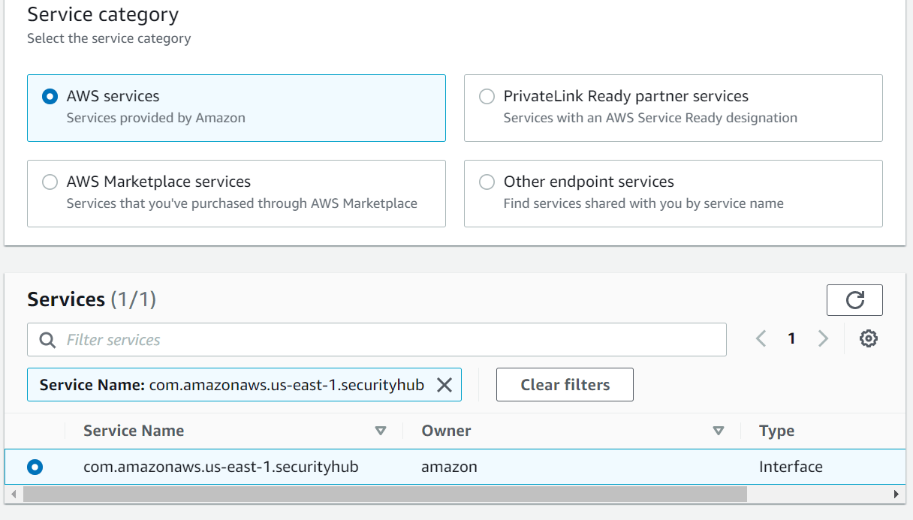
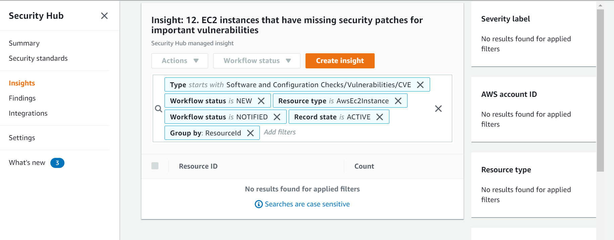
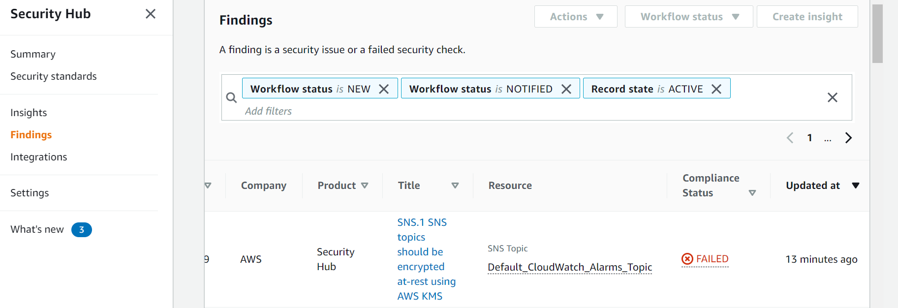
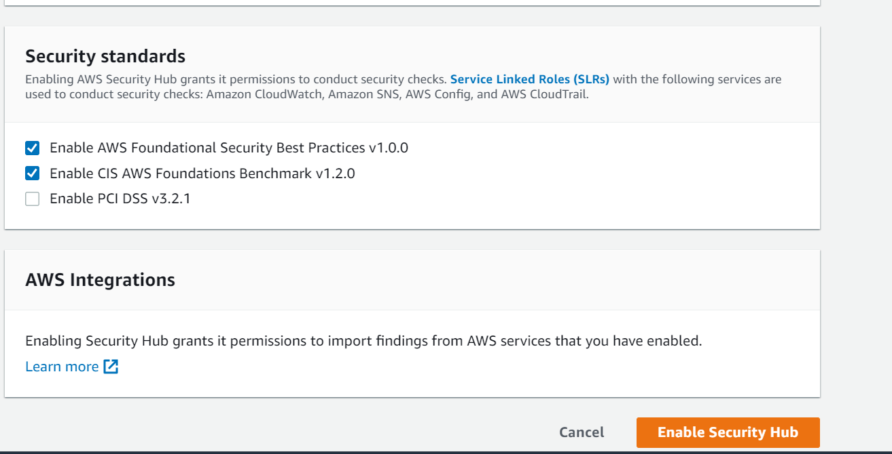
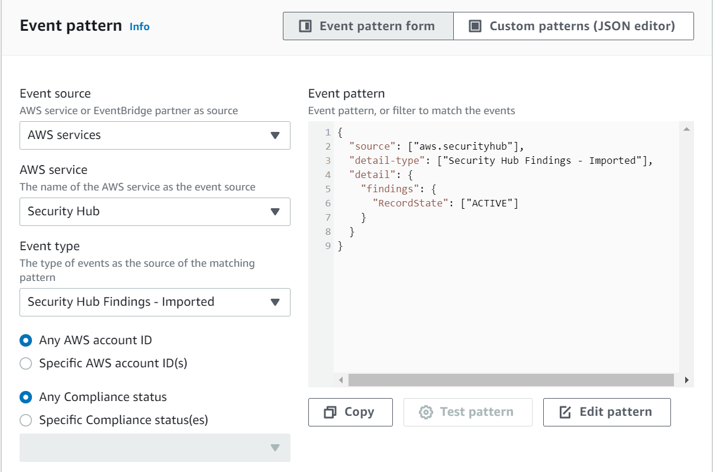

<!-- omit in toc -->
# AWS Security Hub - Security Baseline Requirement
<!-- omit in toc -->
## Baseline security configuration requirement for AWS services ###
---


Summary of changes: 
1. Added new controls
2. Updated the security control mappings

**Generated By: EY Security Team**

**Service Type: Security, Identity, & Compliance**

**Deployment Phase: Service Discovery** 

**Last Update: 06/07/2022**

## Table of Contents  <!-- omit in toc -->
<!-- TOC -->
- [Overview](#overview)
  - [Use Case Examples:](#use-case-examples)
- [Cloud Security Requirements](#cloud-security-requirements)
  - [1. Ensure AWS Security Hub utilizes VPC endpoints to prevent public access](#1-ensure-aws-security-hub-utilizes-vpc-endpoints-to-prevent-public-access)
  - [2. Ensure AWS Security Hub users and roles are following least privilege model](#2-ensure-aws-security-hub-users-and-roles-are-following-least-privilege-model)
  - [3. Ensure AWS Security Hub is monitoring only organization owned AWS accounts](#3-ensure-aws-security-hub-is-monitoring-only-organization-owned-aws-accounts)
  - [4. Ensure AWS Security Hub insights and findings are regularly reviewed](#4-ensure-aws-security-hub-insights-and-findings-are-regularly-reviewed)
  - [5. Ensure AWS foundation and CIS security standards is enabled to run in AWS Security Hub](#5-ensure-aws-foundation-and-cis-security-standards-is-enabled-to-run-in-aws-security-hub)
  - [6. Ensure AWS Security Hub integrations to external partners is approved by organization](#6-ensure-aws-security-hub-integrations-to-external-partners-is-approved-by-organization)
  - [7. Ensure AWS config is enabled](#7-ensure-aws-config-is-enabled)
  - [8. Ensure to enable Cloudtrail for AWS Security Hub](#8-ensure-to-enable-cloudtrail-for-aws-security-hub)
  - [9.  Ensure to monitor AWS Security Hub using Amazon EventBridge](#9--ensure-to-monitor-aws-security-hub-using-amazon-eventbridge)
  - [10. Ensure AWS Security Hub uses standard organizational resource tagging method](#10-ensure-aws-security-hub-uses-standard-organizational-resource-tagging-method)
- [Endnotes](#endnotes)
  - [Resources](#resources)
  - [Glossary](#glossary)
<!-- /TOC -->

##  Overview
The Security Hub provides a single place in the AWS environment to aggregate, organize, and prioritize security alerts and discoveries from multiple AWS security services. This may be Amazon GuardDuty, Amazon Inspector, Amazon Macie, IAM, Access Analyzer, AWS Firewall Manager. But it also supports third-party partner products. 
Security Hub provides a pre-built dashboard to help organize and prioritize any issues or alerts for AWS environment discovered from security checks.


| Control Number | Cloud Baseline Security Requirements                                                                                |
| -------------- | --------------------------------------------------------------------------------------------------------------------|
| 1	           | Ensure AWS Security Hub utilizes VPC endpoints to prevent public access                                             |
| 2	           | Ensure AWS Security Hub users and roles are following least privilege model                                         |
| 3	           | Ensure AWS Security Hub is monitoring only organization owned AWS accounts                                          |
| 4	           | Ensure AWS Security Hub insights and findings are regularly reviewed                                                |
| 5	           | Ensure AWS foundation and CIS security standards is enabled to run in AWS Security Hub                              |
| 6	           | Ensure AWS Security Hub integrations to external partners is approved by organization                               |
| 7	           | Ensure AWS config is enabled                                                                                        |
| 8	           | Ensure to enable Cloudtrail for AWS Security Hub                                                                    |
| 9	           | Ensure to monitor AWS Security Hub using Amazon EventBridge                                                         |
| 10	           | Ensure AWS Security Hub uses standard organizational resource tagging method                                        |

### Use Case Examples:
- Conduct Cloud Security Posture Management (CSPM)
- Initiate Security Orchestration, Automation, and Response (SOAR) workflows
- Save time and money by simplifying integrations
- Correlate your security findings to discover new insights

## Cloud Security Requirements ##

### 1. Ensure AWS Security Hub utilizes VPC endpoints to prevent public access

**Security control mapping:** <br>

| Control Number | Control Statement | Security Domain | Default | Associated Runbook | CVSS Severity  |
| ------------------ | ------------| --------------- | ------- | ------------------ | -------------- |
| CS0012300  | Cloud products and services must be deployed on private subnets and public access must be disabled for these services| Network Security | Not Enabled | None | [Medium (6.5)](https://www.first.org/cvss/calculator/3.1#CVSS:3.1/AV:A/AC:H/PR:H/UI:R/S:C/C:H/I:L/A:L) |


**Why?** <br>

As per security best practice it is suggested to establish a private connection between VPC and AWS Security Hub by creating an interface VPC endpoint. Interface endpoints are powered by AWS PrivateLink, a technology that enables to privately access Security Hub APIs without an internet gateway, NAT device, VPN connection, or AWS Direct Connect connection. Instances in  VPC don't need public IP addresses to communicate with Security Hub APIs. Traffic between VPC and Security Hub does not leave the Amazon network.

**How?** <br>

**_Step 1:_** Open the Amazon VPC console at https://console.aws.amazon.com/vpc/.<br>

**_Step 2:_** In the navigation pane, choose **Endpoints**.Choose **Create endpoint**.For Service category, choose **AWS services**.For Service name, select the service, `com.amazonaws.region.securityhub`.<br>



**_Step 3:_** Fill the below details:
- For **VPC**, select the VPC from which you'll access the AWS service.
- For **Subnets**, select one subnet per Availability Zone from which you'll access the AWS service.<br>
- For **Security group**, select the security groups to associate with the endpoint network interfaces.
- For **Policy**, select specific access to allow specific operations by all principals on all resources over the VPC endpoint.<br>

**_Step 4:_** Choose **Create endpoint**, and the VPC Interface endpoint will be created.
<br><br>

### 2. Ensure AWS Security Hub users and roles are following least privilege model

**Security Control Mapping :**  <br>

| Control Number | Control Statement | Security Domain | Default | Associated Runbook | CVSS Severity  |
| -------------- | ----------------- | --------------- | ------- | ------------------ | -------------- |
| CS0012298 | Access to change cloud identity access and service control policies is restricted to authorized cloud administrative personnel |  Identity & Access Management | Not enabled |None | [Medium (6.8)](https://www.first.org/cvss/calculator/3.1#CVSS:3.1/AV:N/AC:H/PR:H/UI:R/S:C/C:L/I:L/A:H) |

**Why?** <br>

AWS Security Hub integrates with IAM which is an AWS service that helps an administrator securely control access to AWS resources. IAM administrators control who can be authenticated (signed in) and authorized (have permissions) to use Security Hub resources. Security Hub supports identity-based policies and service-linked roles. With IAM identity-based policies,allowed or denied actions can be specified and resources as well as the conditions under which actions are allowed or denied. Security Hub supports specific actions, resources, and condition keys. Service-linked roles are predefined by Security Hub and include all the permissions that Security Hub requires to call other AWS services.

**Following are the suggested roles for AWS SecurityHub** <br>
| Function | Description | Role | 
| -------------- | ----------------- | --------------- | 
| Network admin | Responsible for configuring private endpoint for AWS Security Hub | Networkadmin |
| Security Hub admin team | This service-linked role is responsible to call other AWS services |AWSServiceRoleForSecurityHub|
| Security Engineer | Responsible to configure and manage AWS Config rules, and to monitor and audit the logs |MonitoringPlatformAdmin|
| Security Analyst | Responsible for triagging security alert from Security hub, requires read only access | AnalyticsPlatformAdmin|

**How?** <br>

- A service-linked role makes setting up Security Hub easier because you don't have to manually add the necessary permissions. Security Hub defines the permissions of its service-linked role, and unless the permissions are defined otherwise, only Security Hub can assume the role. The defined permissions include the trust policy and the permissions policy, and you can't attach that permissions policy to any other IAM entity.

  The **AWSServiceRoleForSecurityHub** service-linked role trusts `securityhub.amazonaws.com` services to assume the role.

- To add permissions to users, groups, and roles, it is easier to use AWS managed policies than to write policies yourself. It takes time and expertise to create IAM customer managed policies that provide your team with only the permissions they need. To get started quickly, you can use AWS managed policies. These policies cover common use cases and are available in AWS account.

**Example 1 - Security Hub managed policy: AWSSecurityHubReadOnlyAccess**

This policy grants read-only permissions that allow users to view information in Security Hub.

```JSON
{
    "Version": "2012-10-17",
    "Statement": [ 
        {
            "Effect": "Allow",
            "Action": [
                "securityhub:Get*",
                "securityhub:List*",
                "securityhub:Describe*"
            ],
            "Resource": "arn:aws:securityhub:us-west-2:123456789012:product/123456789012/default"
        }
    ]
}
```

**Example 2 - Security Hub managed policy: AWSSecurityHubServiceRolePolicy**

This policy grants administrative permissions that allow the service-linked role to perform the security checks for Security Hub controls.

```JSON
{
    "Version": "2012-10-17",
    "Statement": [ 
        {
            "Effect": "Allow",
            "Action": [
                "cloudtrail:DescribeTrails",
                "cloudtrail:GetTrailStatus",
                "cloudtrail:GetEventSelectors",
                "cloudwatch:DescribeAlarms",
                "logs:DescribeMetricFilters",
                "sns:ListSubscriptionsByTopic",
                "config:DescribeConfigurationRecorders",
                "config:DescribeConfigurationRecorderStatus",
                "config:DescribeConfigRules",
                "config:BatchGetResourceConfig",
                "config:PutEvaluations",
                "config:SelectResourceConfig",
                "iam:GenerateCredentialReport",
                "iam:GetCredentialReport",
                "organizations:ListAccounts",
                "organizations:DescribeAccount",
                "organizations:DescribeOrganization"
            ],
            "Resource": "ARNs of respective services"
        }
        {
            "Effect": "Allow",
            "Action": [
                "config:PutConfigRule",
                "config:DeleteConfigRule",
                "config:GetComplianceDetailsByConfigRule",
                "config:DescribeConfigRuleEvaluationStatus"
            ],
            "Resource": "arn:aws:config:*:*:config-rule/aws-service-rule/*securityhub*"
        }
    ]
}
```
**Example 3 - VPC endpoint policy for Security Hub actions**

The following is an example of an endpoint policy for Security Hub. When attached to an endpoint, this policy grants access to the listed Security Hub actions for all principals on all resource

```JSON
{
   "Statement":[
      {
         "Principal":"enterprise_account_id",
         "Effect":"Allow",
         "Action":[
            "securityhub:getFindings",
            "securityhub:getEnabledStandards",
            "securityhub:getInsights"
         ],
         "Resource":"arn:aws:securityhub:us-west-2:123456789012:product/123456789012/default"
      }
   ]
}
```         
<br><br>

### 3. Ensure AWS Security Hub is monitoring only organization owned AWS accounts

**Security control mapping:** <br>

| Control Number | Control Statement | Security Domain | Default | Associated Runbook |CVSS Severity|
| ------------------ | ------------| --------------- | ------- | ------------------ |---|
| CS0012133 |[Place Holder] | Configuration Management | Not Enabled | None |[Medium(4.5)](https://www.first.org/cvss/calculator/3.1#CVSS:3.1/AV:L/AC:H/PR:L/UI:N/S:U/C:L/I:L/A:L)|

**What, Why & How?** <br>

As per security best practice it is suggested that Security Hub should monitor those AWS accounts which are owned by organization in order to avoid overhead cost of unwanted accounts. Enterprise should first list out the approved aws accounts in any organization and then enable the Security Hub on it.
We can also attach **AWSSecurityHubOrganizationsAccess** policy to IAM identities which can grants administrative permissions in AWS Organizations that are required to support the Security Hub integration with Organizations.

<br><br>

### 4. Ensure AWS Security Hub insights and findings are regularly reviewed

**Security control mapping:** <br>
| Control Number | Control Statement | Security Domain | Default | Associated Runbook |CVSS Severity|
| ------------------ | ------------| --------------- | ------- | ------------------ |---|
| CS0012133 |[Place Holder] | Configuration Management | Not Enabled | None |[Medium(4.5)](https://www.first.org/cvss/calculator/3.1#CVSS:3.1/AV:L/AC:H/PR:L/UI:N/S:U/C:L/I:L/A:L)|

**Why?** <br>

As per security best practices it is suggested to ensure that AWS Security Hub insights and findings are regularly reviewed in order to highlight emerging security issues and trends that has been introduced recently and to identify, analyze and take all the necessary actions to resolve the highest priority security issues within AWS cloud environment.

**How?** <br>

To display and take action on the list of insight results:

**_Step 1:_** Open the AWS Security Hub console at https://console.aws.amazon.com/securityhub/.

**_Step 2:_** In the navigation pane, choose **Insights**.

**_Step 3:_** To display the list of insight results, choose the insight name.



**_Step 4:_** Select the check box for each result to send to the custom action.

**_Step 5:_** From the **Actions** menu, choose the custom action.

To view the findings detail pane:

**_Step 1:_** Open the AWS Security Hub console at https://console.aws.amazon.com/securityhub/.

**_Step 2:_** In navigation pane, choose Findings.

**_Step 3:_**  Choose the finding **Title**.
At the top of the finding details pane contains overview information about the finding, including the account, severity, dates, and status. If the account is an organization member account, then the information includes the account name. For accounts that are invited manually, the information only includes the account ID.



**Types and Related Findings** contains information about the finding type.

**Resources** contains information about the affected resource.

**Remediation** displays for control findings. It provides a link to the instructions for remediating the issue that triggered the finding.

**Finding Provider Fields** displays the values from the finding provider for confidence, criticality, related findings, severity, and finding type.

From the finding details pane, you can view more details and add field values to the filter.

- To display the complete JSON for the finding, choose the finding ID. From Finding JSON, you can download the finding JSON to a file.

- To add a field value to the finding list filter, choose the search icon next to the field.

- For findings that are based on AWS Config rules, to display a list of the applicable rules, choose Rules.

<br><br> 

### 5. Ensure AWS foundation and CIS security standards is enabled to run in AWS Security Hub

**Security control mapping:** <br>
| Control Number | Control Statement | Security Domain | Default | Associated Runbook |CVSS Severity|
| ------------------ | ------------| --------------- | ------- | ------------------ |---|
| CS0012133 |[Place Holder] | Configuration Management | Not Enabled | None |[Medium(5.3)](https://www.first.org/cvss/calculator/3.1#CVSS:3.1/AV:L/AC:H/PR:L/UI:N/S:C/C:L/I:L/A:L)|

**Why?** <br>

Ensure that AWS Security Hub security standards like AWS Foundational Security Best Practices and CIS AWS Foundations Benchmark should be enabled within AWS account(s) in order to conduct security checks.
A Security Hub standard is a predefined collection of rules based on the AWS cloud and industry best practices. Once the Security Hub service is enabled, it immediately begins running continuous and automated checks on AWS environment's resources against the rules included in the active standards. Then AWS Security Hub generates findings based on the results of the checks defined within the enabled standards.

**How?** <br>

**_Step 1:_** Sign in to the AWS Management Console.<br>

**_Step 2:_** Navigate to SecurityHub dashboard at https://console.aws.amazon.com/securityhub/.<br>

**_Step 3:_** When you open the Security Hub console for the first time, choose **Go to Security Hub**.<br>

**_Step 4:_** On the welcome page, **Security standards** lists the security standards that Security Hub supports.

Select the check box for `Enable AWS Foundational Security Best Practices v1.0.0` and `Enable CIS AWS Foundations Benchmark v1.2.0`.<br>



**_Step 5:_** Click **Enable Security Hub**.

<br><br> 

### 6. Ensure AWS Security Hub integrations to external partners is approved by organization

**Security control mapping:** <br>

| Control Number | Control Statement | Security Domain | Default | Associated Runbook |CVSS Severity|
| ------------------ | ------------| --------------- | ------- | ------------------ |---|
| CS0012133 |[Place Holder] | Configuration Management | Not Enabled | None |[Medium(3.7)](https://www.first.org/cvss/calculator/3.1#CVSS:3.1/AV:A/AC:H/PR:L/UI:N/S:U/C:N/I:L/A:L)|

**What, Why & How?** <br>

Security Hub allows external partners to send or consume security findings to Security Hub to provide customers with insight into the security findings that is generated. It is recommended to get approval from organization before integrating any third party partners in order to protect the information for being exposed to unwanted partners.

As an APN Partner, enterprise can integrate with Security Hub in one or more of the following ways.

- Send findings to Security Hub

- Consume findings from Security Hub

- Both send findings to and consume findings from Security Hub

- Use Security Hub as the center of a managed security service provider (MSSP) offering

- Consult with AWS customers on how to deploy and use Security Hub

<br><br> 

### 7. Ensure AWS config is enabled

**Security control mapping:** <br>
| Control Number | Control Statement | Security Domain | Default | Associated Runbook |CVSS Severity|
| ------------------ | ------------| --------------- | ------- | ------------------ |---|
| CS0012133 |[Place Holder] | Configuration Management | Not Enabled | None |[Medium(5.4)](https://www.first.org/cvss/calculator/3.1#CVSS:3.1/AV:A/AC:H/PR:L/UI:N/S:U/C:N/I:L/A:H)|


**Why?** <br>
AWS Config is a web service that performs configuration management of supported AWS resources. The AWS configuration item history that AWS Config captures enables security analysis, resource change tracking, and compliance auditing. AWS Security Hub uses service-linked AWS Config rules to perform most of its security checks for controls. To support these controls, AWS Config must be enabled on all accounts – both the administrator account and member accounts – in each Region where Security Hub is enabled. 

**Note:** Security Hub recommends to enable resource recording in AWS Config before enabling Security Hub standards. If Security Hub tries to run security checks when resource recording is not enabled, the checks return errors.

**How?** <br>

Refer [Config Runbook](https://github.com/ey-org/cloudsec-ccm/blob/254-Config-Developer-Guideline/Baseline%20Requirement%20Library/AWS/Config/Config%20Runbook.md#5-ensure-config-service-is-enabled-in-all-regions) to follow the steps for configuring AWS config.  

<br><br>  
 

### 8. Ensure to enable Cloudtrail for AWS Security Hub

**Security control mapping:** <br>
| Control Number | Control Statement | Security Domain | Default | Associated Runbook |CVSS Severity|
| ------------------ | ------------| --------------- | ------- | ------------------ |---|
| CS0012233| Information system must create a log and record activities occurring on or originating from the information system.Logs must be made accessible to the enterprise SIEM solution  | Security Information and event management | Not Enabled | None|[Low(2.5)](https://www.first.org/cvss/calculator/3.1#CVSS:3.1/AV:L/AC:H/PR:H/UI:N/S:C/C:N/I:N/A:L)|

**Why?** <br>
    
AWS Security Hub is integrated with AWS CloudTrail, a service that provides a record of actions taken by a user, role, or an AWS service in Security Hub. CloudTrail captures API calls for Security Hub as events. The captured calls include calls from the Security Hub console and code calls to the Security Hub API operations.

**How?** <br>

CloudTrail is enabled on your AWS account when you create the account. When activity occurs in AWS SecurityHub, that activity is recorded in a CloudTrail event along with other AWS service events in Event history. For an ongoing record of events in your AWS account, including events for AWS SecurityHub, create a trail. 

***To create a CloudTrail trail using API :***

To create a trail that applies to all Regions, use the `--is-multi-region-trail` option. By default, the `create-trail` command creates a trail that logs events only in the AWS Region where the trail was created. To ensure that you log global service events and capture all management event activity in your AWS account, you should create trails that log events in all AWS Regions.

The following example creates a trail with the name `my-trail` and a tag with a key named `Group` with a value of `Marketing` that delivers logs from all Regions to an existing bucket named `my-bucket`.

```
aws cloudtrail create-trail --name my-trail --s3-bucket-name my-bucket --is-multi-region-trail --tags-list [key=Group,value=Marketing]
```

To confirm that your trail exists in all Regions, the `IsMultiRegionTrail` element in the `output` shows `true`.
```
{
    "IncludeGlobalServiceEvents": true, 
    "Name": "my-trail", 
    "TrailARN": "arn:aws:cloudtrail:us-east-2:123456789012:trail/my-trail", 
    "LogFileValidationEnabled": false, 
    "IsMultiRegionTrail": true, 
    "IsOrganizationTrail": false,
    "S3BucketName": "my-bucket"
}
```

>***Note***
Use the start-logging command to start logging for your trail.

<br><br> 

### 9.  Ensure to monitor AWS Security Hub using Amazon EventBridge

**Security control mapping:** <br>

| Control Number | Control Statement | Security Domain | Default | Associated Runbook |CVSS Severity|
| ------------------ | ------------| --------------- | ------- | ------------------ |---|
| CS0012233| Information system must create a log and record activities occurring on or originating from the information system.Logs must be made accessible to the enterprise SIEM solution  | Security Information and event management | Not Enabled | None|[Low(3.9)](https://www.first.org/cvss/calculator/3.1#CVSS:3.1/AV:L/AC:H/PR:H/UI:N/S:U/C:L/I:L/A:L)|

**Why?** <br>
    
With Amazon EventBridge, it will be easy to automate AWS services to respond automatically to system events such as application availability issues or resource changes. Events from AWS services are delivered to EventBridge in near-real time and on a guaranteed basis. Write simple rules to indicate which events are interested in and what automated actions to take when an event matches a rule. Security Hub automatically sends all new findings and all updates to existing findings to EventBridge as EventBridge events.

**How?** <br>
**_Step 1:_** Open the Amazon EventBridge console at https://console.aws.amazon.com/events/.<br>
**_Step 2:_** Using the following values, create an EventBridge rule that monitors finding events:
              - For **Rule type**, choose **Rule with an event pattern**.
              - Choose how to build the event pattern.<br>
**_Step 3:_** To build the event pattern with a template, in the Event pattern section choose the following options:
- For **Event source**, choose **AWS services**.<br>
- For **AWS service**, choose **Security Hub**.
- For **Event type**, choose **Security Hub Findings - Imported**.<br>


**_Step 4:_** Choose **Next** and for **Target types**, choose AWS service and select a target.
**_Step 5:_** Choose **Next** 
**_Step 6:_** At the last page, review the details of the rule and choose **Create rule**.

<br><br> 

### 10. Ensure AWS Security Hub uses standard organizational resource tagging method

**Security control mapping:** <br>
| Control Number | Control Statement | Security Domain | Default | Associated Runbook |CVSS Severity|
| ------------------ | ------------| --------------- | ------- | ------------------ |---|
|CS0012128| Technology hardware and software must be registered and accurately recorded within the enterprise technology repository and/or asset management systems | Asset Management | Not Enabled | Organizational Runbook |[Low(1.6)](https://www.first.org/cvss/calculator/3.1#CVSS:3.1/AV:P/AC:H/PR:H/UI:N/S:U/C:N/I:N/A:L)|


**What, Why & How?** <br>

Identification of your IT assets is a crucial aspect of governance and security. You need to have visibility of all Cognito resources to assess their security posture and take action on potential areas of weakness.

Tagging resources in the cloud is an easy way for teams to provide information related to who owns the resource, what the resource is used for, as well as other important information related to the deployment lifecycle of the resource. Organization has mandated that all cloud resources are to be tagged with for cross-team use.

[Place holder for confluence link]
<br><br> 

## Endnotes ##

### Resources 
1. https://docs.aws.amazon.com/securityhub/latest/userguide/what-is-securityhub.html
2. https://docs.aws.amazon.com/securityhub/latest/userguide/security.html

### Glossary 

**Data** - Digital pieces of information stored or transmitted for use with an information system from which understandable information is
derived. Items considered to be data are: Source code, meta-data, build artifacts, information input and output.

**Information System** - An organized assembly of resources and procedures for the collection, processing, maintenance, use, sharing,
dissemination, or disposition of information. All systems, platforms, compute instances including and not limited to physical and virtual
client endpoints, physical and virtual servers, software containers, databases, Internet of Things (IoT) devices, network devices,
applications (internal and external), Serverless computing instances (i.e. AWS Lambda), vendor provided appliances, and third-party
platforms, connected to the Capital Group network or used by Capital Group users or customers.

**Log** - a record of the events occurring within information systems and networks. Logs are composed of log entries; each entry contains
information related to a specific event that has occurred within a system or network.

**Information** - communication or representation of knowledge such as facts, data, or opinions in any medium or form, including textual,
numerical, graphic, cartographic, narrative, or audiovisual.

**Cloud Computing** - A model for enabling ubiquitous, convenient, on-demand network access to a shared pool of configurable computing
resources (e.g., networks, servers, storage, applications, and services) that can be rapidly provisioned and released with minimal
management effort or service provider interaction.

**Vulnerability**- Weakness in an information system, system security procedures, internal controls, or implementation that could be exploited
or triggered by a threat source. Note: The term weakness is synonymous for deficiency. Weakness may result in security and/or privacy
risks.
