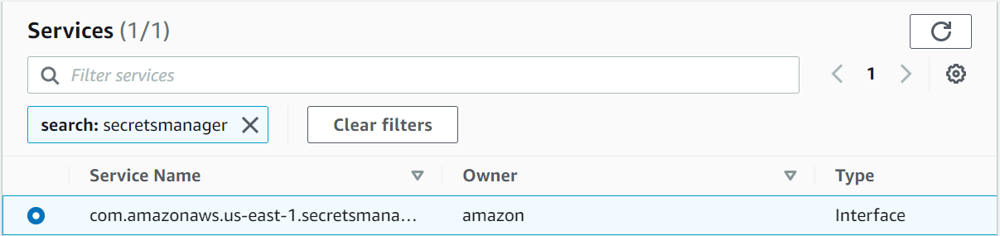
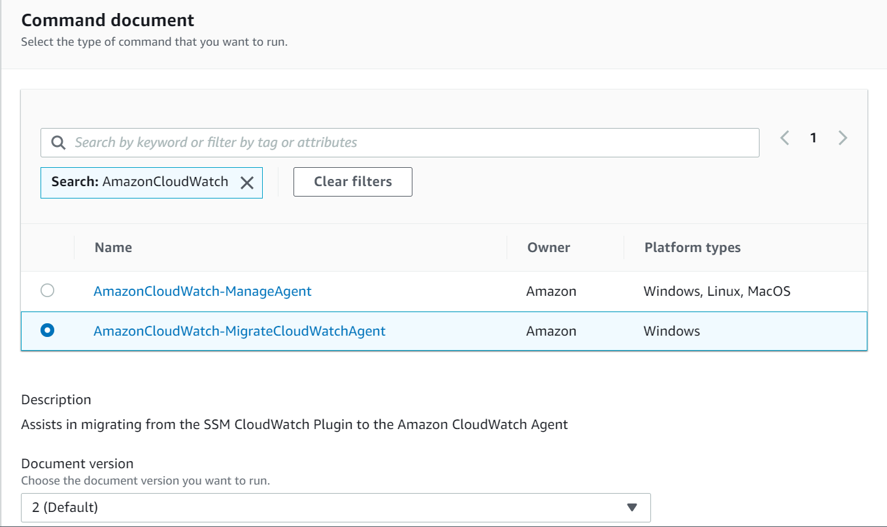

<!-- omit in toc -->
# AWS Systems Manager - Security Baseline Requirement
<!-- omit in toc -->
## Baseline security configuration requirement for AWS services ###
---


Summary of changes: 
1. Added new controls
2. Updated the security control mappings

**Generated By: EY Security Team**

**Service Type: Security, Identity, & Compliance**

**Deployment Phase: Service Discovery** 

**Last Update: 06/07/2022**

## Table of Contents  <!-- omit in toc -->
<!-- TOC -->
- [Overview](#overview)
  - [Use Case Examples:](#use-case-examples)
- [Cloud Security Requirements](#cloud-security-requirements)
  - [1. Ensure AWS Systems Manager utilizes VPC endpoints to prevent public access](#1-ensure-aws-systems-manager-utilizes-vpc-endpoints-to-prevent-public-access)
  - [2. Ensure AWS Systems Manager users and roles are following least privilege model](#2-ensure-aws-systems-manager-users-and-roles-are-following-least-privilege-model)
  - [3. Ensure data is encrypted and protected using SecureString parameters](#3-ensure-data-is-encrypted-and-protected-using-securestring-parameters)
  - [4. Ensure to enable integration with CloudWatch](#4-ensure-to-enable-integration-with-cloudwatch)
  - [5. Ensure AWS config is enabled](#5-ensure-aws-config-is-enabled)
  - [6. Ensure to enable Cloudtrail for AWS Systems Manager](#6-ensure-to-enable-cloudtrail-for-aws-systems-manager)
  - [7. Ensure AWS Systems Manager uses standard organizational resource tagging method](#7-ensure-aws-systems-manager-uses-standard-organizational-resource-tagging-method)
- [Endnotes](#endnotes)
  - [Resources](#resources)
  - [Glossary](#glossary)
<!-- /TOC -->

##  Overview
AWS Systems Manager is a collection of capabilities to help you manage your applications and infrastructure running in the AWS Cloud. Systems Manager simplifies application and resource management, shortens the time to detect and resolve operational problems, and helps you manage your AWS resources securely at scale.


| Control Number | Cloud Baseline Security Requirements                                                                                |
| -------------- | --------------------------------------------------------------------------------------------------------------------|
| 1	           | Ensure AWS Systems Manager utilizes VPC endpoints to prevent public access                                          |
| 2	           | Ensure AWS Systems Manager users and roles are following least privilege model                                      |
| 3	           | Ensure data is encrypted and protected using SecureString parameters                                                |
| 4	           | Ensure to enable integration with CloudWatch                                                                        |
| 5	           | Ensure AWS config is enabled                                                                                        |
| 6	           | Ensure to enable Cloudtrail for AWS Systems Manager                                                                 |
| 7	           | Ensure AWS Systems Manager uses standard organizational resource tagging method                                     |

### Use Case Examples:
- Conduct Cloud Security Posture Management (CSPM)
- Initiate Security Orchestration, Automation, and Response (SOAR) workflows
- Save time and money by simplifying integrations
- Correlate your security findings to discover new insights

## Cloud Security Requirements ##

### 1. Ensure AWS Systems Manager utilizes VPC endpoints to prevent public access

**Security control mapping:** <br>

| Control Number | Control Statement | Security Domain | Default | Associated Runbook | CVSS Severity  |
| ------------------ | ------------| --------------- | ------- | ------------------ | -------------- |
| CS0012300  | Cloud products and services must be deployed on private subnets and public access must be disabled for these services| Network Security | Not Enabled | None | [Medium (6.5)](https://www.first.org/cvss/calculator/3.1#CVSS:3.1/AV:A/AC:H/PR:H/UI:R/S:C/C:H/I:L/A:L) |


**Why?** <br>

As per security best practice it is suggested to establish a private connection between VPC and AWS Systems Manager by creating an interface VPC endpoint. By using an interface VPC endpoint (interface endpoint), you can connect to services powered by AWS PrivateLink. AWS PrivateLink is a technology that allows you to privately access Amazon Elastic Compute Cloud (Amazon EC2) and Systems Manager APIs by using private IP addresses.AWS PrivateLink restricts all network traffic between your managed instances, Systems Manager, and Amazon EC2 to the Amazon network.

**How?** <br>

To create an interface endpoint for an AWS service:

**_Step 1:_** Open the Amazon VPC console at https://console.aws.amazon.com/vpc/.<br>

**_Step 2:_** In the navigation pane, choose **Endpoints**.Choose **Create endpoint**.For Service category, choose **AWS services**.For **Service name**, select the service, `com.amazonaws.us-east-1.secretsmanager`.<br>

<br>

**_Step 3:_** Fill the below details:
- For **VPC**, select the VPC from which you'll access the AWS service.
- For **Subnets**, select one subnet per Availability Zone from which you'll access the AWS service.<br>
- For **Security group**, select the security groups to associate with the endpoint network interfaces.
- For **Policy**, select specific access to allow specific operations by all principals on all resources over the VPC endpoint.<br>

**_Step 4:_** Choose **Create endpoint**, and the VPC Interface endpoint will be created.<br>

The above steps are followed to create the following endpoints:
- `com.amazonaws.region.ssm` – The endpoint for the Systems Manager service.
- `com.amazonaws.region.ec2messages` – Systems Manager uses this endpoint to make calls from SSM Agent to the Systems Manager service.com.amazonaws.region.ec2messages – Systems Manager uses this endpoint to make calls from SSM Agent to the Systems Manager service.
- `com.amazonaws.region.ec2` – If you're using Systems Manager to create VSS-enabled snapshots, you need to ensure that you have an endpoint to the EC2 service.
<br><br>

### 2. Ensure AWS Systems Manager users and roles are following least privilege model

**Security Control Mapping :**  <br>

| Control Number | Control Statement | Security Domain | Default | Associated Runbook | CVSS Severity  |
| -------------- | ----------------- | --------------- | ------- | ------------------ | -------------- |
| CS0012298 | Access to change cloud identity access and service control policies is restricted to authorized cloud administrative personnel |  Identity & Access Management | Not enabled |None | [Medium (6.8)](https://www.first.org/cvss/calculator/3.1#CVSS:3.1/AV:N/AC:H/PR:H/UI:R/S:C/C:L/I:L/A:H) |

**Why?** <br>

AWS Identity and Access Management (IAM) is an AWS service that helps an administrator securely control access to AWS resources. IAM administrators control who can be authenticated (signed in) and authorized (have permissions) to use Systems Manager resources. Therefore you should grant only the permissions that are required to perform a task.With IAM identity-based policies, you can specify allowed or denied actions and resources and the conditions under which actions are allowed or denied. Systems Manager supports specific actions, resources, and condition keys. A service-linked role is a unique type of IAM role that is linked directly to Systems Manager. Service-linked roles are predefined by Systems Manager and include all the permissions that the service requires to call other AWS services on your behalf.

**Following are the suggested roles for AWS SystemsManager** <br>
| Function | Description | Role | 
| -------------- | ----------------- | --------------- | 
| Network admin | Responsible for configuring private endpoint for AWS Security Hub | Networkadmin |
| Systems Manager admin team | AWS Systems Manager uses this IAM service role to manage AWS resources |AWSServiceRoleForAmazonSSM|
| Security Engineer | Responsible to configure and manage AWS Config rules, and to monitor and audit the logs |MonitoringPlatformAdmin|

**How?** <br>

- A service-linked role makes setting up Systems Manager easier because you don’t have to manually add the necessary permissions. Systems Manager defines the permissions of its service-linked roles, and unless defined otherwise, only Systems Manager can assume its roles. The defined permissions include the trust policy and the permissions policy, and that permissions policy can't be attached to any other IAM entity.
- Systems Manager uses the service-linked role named **AWSServiceRoleForAmazonSSM** – AWS Systems Manager uses this IAM service role to manage AWS resources on your behalf.
- The **AWSServiceRoleForAmazonSSM** service-linked role trusts only ssm.amazonaws.com to assume this role.
- The managed policy that is used to provide permissions for the **AWSServiceRoleForAmazonSSM** role is **AmazonSSMServiceRolePolicy**.

**Example 1 - To access the Systems manager console**

To access the Systems Manager console, you must have a minimum set of permissions. These permissions must allow you to list and view details about the Systems Manager resources and other resources in your AWS account.

- You can grant the required permissions with the following policy statement.
```
{
    "Version": "2012-10-17",
    "Statement": [
        {
            "Effect": "Allow",
            "Action": [
                "ssm:*",
                "ec2:describeInstances",
                "iam:ListRoles"
            ],
            "Resource": "*"
        },
        {
            "Effect": "Allow",
            "Action": "iam:PassRole",
            "Resource": "*",
            "Condition": {
                "StringEquals": {
                    "iam:PassedToService": "ssm.amazonaws.com"
                }
            }
        }
    ]
}
```

**Example 2 - Allow a user to perform Systems Manager operations in a single Region**

The following example grants permissions to perform Systems Manager operations only in the US East (Ohio) Region (us-east-2).

```
{
  "Version": "2012-10-17",
  "Statement" : [
    {
      "Effect" : "Allow",
      "Action" : [
        "ssm:*"
      ],
      "Resource" : [
        "arn:aws:ssm:us-east-2:aws-account-ID:*"
      ]
    }
  ]
}
```    
<br><br>

### 3. Ensure data is encrypted and protected using SecureString parameters

**Security control mapping:** <br>

| Control Number | Control Statement | Security Domain | Default | Associated Runbook | CVSS Severity  |
| -------------- | ----------------- | --------------- | ------- | ------------------ | -------------- |
| CS0012168 |Strong encryption key management controls are in place for cloud provider services to protect data at rest | Data Protection | Not enabled | KMS Runbook | [Medium (5.3)](https://www.first.org/cvss/calculator/3.1#CVSS:3.1/AV:A/AC:H/PR:H/UI:N/S:U/C:H/I:L/A:L) |

**Why?** <br>

With AWS Systems Manager Parameter Store, you can create secure string parameters, which are parameters that have a plaintext parameter name and an encrypted parameter value. Parameter Store uses AWS KMS to encrypt and decrypt the parameter values of secure string parameters. With Parameter Store you can create, store, and manage data as parameters with values. You can create a parameter in Parameter Store and use it in multiple applications and services subject to policies and permissions that you design. 

**How?** <br>
- Parameter Store does not perform any cryptographic operations. Instead, it relies on AWS KMS to encrypt and decrypt secure string parameter values. When you create or change a standard secure string parameter value, Parameter Store calls the AWS KMS Encrypt operation. This operation uses a symmetric encryption KMS key directly to encrypt the parameter value instead of using the KMS key to generate a data key.
- Parameter Store uses the AWS managed key that Systems Manager automatically creates in your account. This KMS key has the aws/ssm alias.To view the default aws/ssm KMS key for your account, use the **DescribeKey** operation in the AWS KMS API.
- When you get a secure string parameter from Parameter Store, its value is encrypted. To get a parameter, use the GetParameter operation in the Systems Manager API.

**Example 1 - Systems Manager get-parameter command**

The following example uses the Systems Manager get-parameter command in the AWS CLI to get the MyParameter parameter from Parameter Store without decrypting its value.
```
$  aws ssm get-parameter --name MyParameter

{
    "Parameter": {
        "Type": "SecureString", 
        "Name": "MyParameter", 
        "Value": "AQECAHgnOkMROh5LaLXkA4j0+vYi6tmM17Lg/9E464VRo68cvwAAAG8wbQYJKoZIhvcNAQcGoGAwXgIBADBZBgkqhkiG9w0BBwEwHgYJYZZIAWUDBAEuMBEEDImYOw44gna0Jm00hAIBEIAsjgr7mum1EnnXzE3xM8bGle0oKYcfVCHtBkfjIeZGTgL6Hg0fSDnpMHdcSXY="
    }
}
```
**Example 2 - with-decryption**
To decrypt the parameter value before returning it, set the WithDecryption parameter of GetParameter to true. When you use WithDecryption, Parameter Store calls the AWS KMS Decrypt operation on your behalf to decrypt the parameter value. As a result, the GetParameter request returns the parameter with a plaintext parameter value, as shown in the following example.
```
$  aws ssm get-parameter --name MyParameter --with-decryption

{
    "Parameter": {
        "Type": "SecureString", 
        "Name": "MyParameter", 
        "Value": "secret_value"
    }
}
```
<br><br>

### 4. Ensure to enable integration with CloudWatch

**Security control mapping:** <br>
| Control Number | Control Statement | Security Domain | Default | Associated Runbook |CVSS Severity|
| ------------------ | ------------| --------------- | ------- | ------------------ |---|
| CS0012233| Information system must create a log and record activities occurring on or originating from the information system.Logs must be made accessible to the enterprise SIEM solution  | Security Information and event management | Not Enabled | CloudWatch Runbook |[Low(3.9)](https://www.first.org/cvss/calculator/3.1#CVSS:3.1/AV:L/AC:H/PR:H/UI:N/S:C/C:N/I:L/A:L)|

**Why?** <br>

Monitoring is an important part of maintaining the reliability, security, availability, and performance of Systems Manager and your AWS solutions. Amazon CloudWatch provides several tools and services to help you monitor Systems Manager and your other AWS services. 

**How?** <br>

To automatically migrate to the CloudWatch agent (console):

**_Step 1:_** Open the AWS Systems Manager console at https://console.aws.amazon.com/systems-manager/.<br>
**_Step 2:_** In the navigation pane, choose **Run Command**, and then choose **Run command**.<br>
**_Step 3:_** In the **Command document** list, choose `AmazonCloudWatch-MigrateCloudWatchAgent`.<br>
<br>
**_Step 4:_** Then choose the following fields:
- For **Status**, choose **Enabled**.<br>
- In the **Targets** section, choose the managed nodes on which you want to run this operation by specifying tags, selecting instances or edge devices manually, or specifying a resource group.<br>
- In **Rate control**, For **Concurrency**, specify either a number or a percentage of managed nodes on which to run the command at the same time.<br>
- For **Error threshold**, specify when to stop running the command on other managed nodes after it fails on either a number or a percentage of nodes.<br>
  
**_Step 5:_** In the **SNS notifications** section, if you want notifications sent about the status of the command execution, select the Enable SNS notifications check box.<br>
**_Step 6:_** Choose **Run**.   

### 5. Ensure AWS config is enabled

**Security control mapping:** <br>
| Control Number | Control Statement | Security Domain | Default | Associated Runbook |CVSS Severity|
| ------------------ | ------------| --------------- | ------- | ------------------ |---|
| CS0012133 |[Place Holder] | Configuration Management | Not Enabled | None |[Medium(5.4)](https://www.first.org/cvss/calculator/3.1#CVSS:3.1/AV:A/AC:H/PR:L/UI:N/S:U/C:N/I:L/A:H)|


**Why?** <br>
AWS Config allows you to assess, audit, and evaluate the configurations of your AWS resources. AWS Config monitors resource configurations, allowing you to evaluate the recorded configurations against the desired secure configurations. Using AWS Config, you can review changes in configurations and relationships between AWS resources, investigate detailed resource configuration histories, and determine your overall compliance against the configurations specified in your internal guidelines. This can help you simplify compliance auditing, security analysis, change management, and operational troubleshooting. 

**How?** <br>

Refer [Config Runbook](https://github.com/ey-org/cloudsec-ccm/blob/254-Config-Developer-Guideline/Baseline%20Requirement%20Library/AWS/Config/Config%20Runbook.md#5-ensure-config-service-is-enabled-in-all-regions) to follow the steps for configuring AWS config.  

<br><br>  
 

### 6. Ensure to enable Cloudtrail for AWS Systems Manager

**Security control mapping:** <br>
| Control Number | Control Statement | Security Domain | Default | Associated Runbook |CVSS Severity|
| ------------------ | ------------| --------------- | ------- | ------------------ |---|
| CS0012233| Information system must create a log and record activities occurring on or originating from the information system.Logs must be made accessible to the enterprise SIEM solution  | Security Information and event management | Not Enabled | None|[Low(2.5)](https://www.first.org/cvss/calculator/3.1#CVSS:3.1/AV:L/AC:H/PR:H/UI:N/S:C/C:N/I:N/A:L)|

**Why?** <br>
    
AWS Systems Manager is integrated with AWS CloudTrail, a service that provides a record of actions taken by a user, role, or an AWS service in Systems Manager. CloudTrail captures all API calls for Systems Manager as events, including calls from the Systems Manager console and from code calls to the Systems Manager APIs.

**How?** <br>

CloudTrail is activated on your AWS account when you create the account. When activity occurs in Systems Manager, that activity is recorded in a CloudTrail event along with other AWS service events in Event history.For an ongoing record of events in your AWS account, including events for Systems Manager, create a trail. A trail allows CloudTrail to deliver log files to an S3 bucket.

***To create a CloudTrail trail using API :***

To create a trail that applies to all Regions, use the `--is-multi-region-trail` option. By default, the `create-trail` command creates a trail that logs events only in the AWS Region where the trail was created. To ensure that you log global service events and capture all management event activity in your AWS account, you should create trails that log events in all AWS Regions.

The following example creates a trail with the name `my-trail` and a tag with a key named `Group` with a value of `Marketing` that delivers logs from all Regions to an existing bucket named `my-bucket`.

```
aws cloudtrail create-trail --name my-trail --s3-bucket-name my-bucket --is-multi-region-trail --tags-list [key=Group,value=Marketing]
```

To confirm that your trail exists in all Regions, the `IsMultiRegionTrail` element in the `output` shows `true`.
```
{
    "IncludeGlobalServiceEvents": true, 
    "Name": "my-trail", 
    "TrailARN": "arn:aws:cloudtrail:us-east-2:123456789012:trail/my-trail", 
    "LogFileValidationEnabled": false, 
    "IsMultiRegionTrail": true, 
    "IsOrganizationTrail": false,
    "S3BucketName": "my-bucket"
}
```

>***Note***
Use the start-logging command to start logging for your trail.

<br><br> 

### 7. Ensure AWS Systems Manager uses standard organizational resource tagging method

**Security control mapping:** <br>
| Control Number | Control Statement | Security Domain | Default | Associated Runbook |CVSS Severity|
| ------------------ | ------------| --------------- | ------- | ------------------ |---|
|CS0012128| Technology hardware and software must be registered and accurately recorded within the enterprise technology repository and/or asset management systems | Asset Management | Not Enabled | Organizational Runbook |[Low(1.6)](https://www.first.org/cvss/calculator/3.1#CVSS:3.1/AV:P/AC:H/PR:H/UI:N/S:U/C:N/I:N/A:L)|


**What, Why & How?** <br>

Identification of your IT assets is a crucial aspect of governance and security. You need to have visibility of all Detective resources to assess their security posture and take action on potential areas of weakness.

Tagging resources in the cloud is an easy way for teams to provide information related to who owns the resource, what the resource is used for, as well as other important information related to the deployment lifecycle of the resource. Organization has mandated that all cloud resources are to be tagged with for cross-team use.

<br><br> 

## Endnotes ##

### Resources 
1. https://docs.aws.amazon.com/systems-manager/latest/userguide/what-is-systems-manager.html
2. https://docs.aws.amazon.com/systems-manager/latest/userguide/security.html

### Glossary 

**Data** - Digital pieces of information stored or transmitted for use with an information system from which understandable information is
derived. Items considered to be data are: Source code, meta-data, build artifacts, information input and output.

**Information System** - An organized assembly of resources and procedures for the collection, processing, maintenance, use, sharing,
dissemination, or disposition of information. All systems, platforms, compute instances including and not limited to physical and virtual
client endpoints, physical and virtual servers, software containers, databases, Internet of Things (IoT) devices, network devices,
applications (internal and external), Serverless computing instances (i.e. AWS Lambda), vendor provided appliances, and third-party
platforms, connected to the Capital Group network or used by Capital Group users or customers.

**Log** - a record of the events occurring within information systems and networks. Logs are composed of log entries; each entry contains
information related to a specific event that has occurred within a system or network.

**Information** - communication or representation of knowledge such as facts, data, or opinions in any medium or form, including textual,
numerical, graphic, cartographic, narrative, or audiovisual.

**Cloud Computing** - A model for enabling ubiquitous, convenient, on-demand network access to a shared pool of configurable computing
resources (e.g., networks, servers, storage, applications, and services) that can be rapidly provisioned and released with minimal
management effort or service provider interaction.

**Vulnerability**- Weakness in an information system, system security procedures, internal controls, or implementation that could be exploited
or triggered by a threat source. Note: The term weakness is synonymous for deficiency. Weakness may result in security and/or privacy
risks.
