## Baseline security configuration requirement for Azure services  <!-- omit in toc -->

**Generated By: EY Security Team**  
**Service Type: Web**  
**Deployment Phase: Service Discovery**  
**Last updated: 05/27/2022** 

## Table of Contents <!-- omit in toc -->

- [Overview](#overview)
  - [Use Case Examples:](#use-case-examples)
- [Cloud Security Requirements](#cloud-security-requirements)
  - [1. Ensure that Azure API Management public access is disabled by using Private Endpoint](#1-ensure-that-azure-api-management-public-access-is-disabled-by-using-private-endpoint)
  - [2. Ensure API management access is granted using Managed Identities](#2-ensure-api-management-access-is-granted-using-managed-identities)
  - [3. Ensure least privilege access is implemented in API Management using Role Based Access control](#3-ensure-least-privilege-access-is-implemented-in-api-management-using-role-based-access-control)
  - [4. Ensure Azure API Management uses standard organizational Resource tagging method](#4-ensure-azure-api-management-uses-standard-organizational-resource-tagging-method)
  - [5. Ensure Activity logging is enabled for Azure API Management](#5-ensure-activity-logging-is-enabled-for-azure-api-management)
  - [6. Ensure administrative tasks are performed only in admin-e workstations](#6-ensure-administrative-tasks-are-performed-only-in-admin-e-workstations)
  - [7. Ensure Client application authorization to API management is managed using oauth2.0](#7-ensure-client-application-authorization-to-api-management-is-managed-using-oauth20)
  - [8. Ensure Developer authentications is done using Azure AD for API Management](#8-ensure-developer-authentications-is-done-using-azure-ad-for-api-management)
  - [9. Ensure secrets for 'Named values' and certificates for backend authenticated are vaulted in Azure Key vault](#9-ensure-secrets-for-named-values-and-certificates-for-backend-authenticated-are-vaulted-in-azure-key-vault)
  - [10. Ensure the app insights is enabled for Azure API Management](#10-ensure-the-app-insights-is-enabled-for-azure-api-management)
  - [11. Ensure diagnostic logging are enabled for Azure API Management](#11-ensure-diagnostic-logging-are-enabled-for-azure-api-management)
  - [12. Ensure protocol ciphers are managed in Azure API management](#12-ensure-protocol-ciphers-are-managed-in-azure-api-management)
  - [13. Ensure traffic to Azure API Management is controlled using Access restriction policies](#13-ensure-traffic-to-azure-api-management-is-controlled-using-access-restriction-policies)
  - [14. Ensure Backend and client protocols are set as TLS 1.2 in Azure API management](#14-ensure-backend-and-client-protocols-are-set-as-tls-12-in-azure-api-management)

##  Overview 

Azure API Management is a hybrid, multi cloud management platform for APIs across all environments. APIs enable digital experiences, simplify application integration, underpin new digital products, and make data and services reusable and universally accessible.

| Control Number | Cloud Baseline Security Requirements                                                                        |
| -------------- | ----------------------------------------------------------------------------------------------------------- |
| 1              | Ensure that Azure API Management public access is disabled by using Private Endpoint                        |
| 2              | Ensure API management access is granted using Managed Identities                                            |
| 3              | Ensure least privilege access is implemented in API Management using Role Based Access control              |
| 4              | Ensure Azure API Management uses standard organizational Resource tagging method                            |
| 5              | Ensure Activity logging is enabled for Azure API Management                                                 |
| 6              | Ensure administrative tasks are performed only in admin-e workstations                                      |
| 7              | Ensure Client application authorization to API management is managed using oauth2.0                         |
| 8              | Ensure Developer authentications is done using Azure AD for API Management                                  |
| 9              | Ensure secrets for 'Named values' and certificates for backend authenticated are vaulted in Azure Key vault |
| 10             | Ensure the app insights is enabled for Azure API Management                                                 |
| 11             | Ensure diagnostic logging are enabled for Azure API Management                                              |
| 12             | Ensure protocol ciphers are managed in Azure API management                                                 |
| 13             | Ensure traffic to Azure API Management is controlled using Access restriction policies                      |
| 14             | Ensure Backend and client protocols are set as TLS 1.2 in Azure API management                              |

### Use Case Examples:
- Protect APIs with Application Gateway and API Management
- Migrate a web app using Azure API Management
- Automate API deployments with APIOps
- Build a real-time recommendation API on Azure

## Cloud Security Requirements 

### 1. Ensure that Azure API Management public access is disabled by using Private Endpoint

**Security Control Mapping :**  
| Control Number | Control Statement | Security Domain | Default | Associated Runbook | CVSS Severity  |
| -------------- | ----------------- | --------------- | ------- | ------------------ | -------------- |
| [CS0012300](place holder) | Cloud products and services must be deployed on private subnets and public access must be disabled for these services | Network and communication Security | Not enabled |Private Endpoint Runbook | [High (7.2)](https://www.first.org/cvss/calculator/3.1#CVSS:3.1/AV:N/AC:H/PR:H/UI:N/S:C/C:H/I:L/A:L) |

**Why?**   

As Organization uses Hybrid cloud infrastructure and all the internet traffic goes through on-prem data center, API management should not be directly exposed to Internet, Instead must use private endpoint. A private endpoint is a network interface that uses a private IP address from your virtual network. This network interface connects privately for Azure dns Security and securely to a service that's powered by Azure Private Link. Private endpoint must be enabled to bring the service into the virtual network. Private endpoint will provide a endpoint with Private IP which can be associated with VNet with in tenant, other tenant or from On premise.

**How?**  

**_Step 1:_**  When creating an API Management gateway, fill the basic details and Navigate to 'Virtual network' tab.
Select connectivity type as 'Private endpoint'  
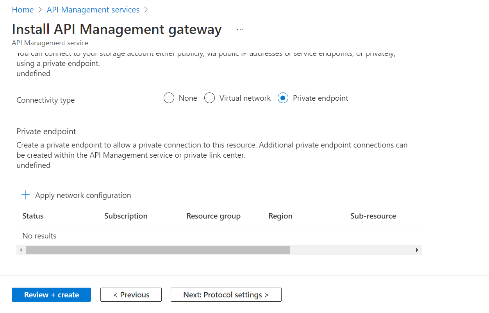  

**_Step 2:_**  Click `Apply Network Configuration` and provide a private endpoint name and virtual network . Select 'Integrate with private DNS zone' as 'Yes'   
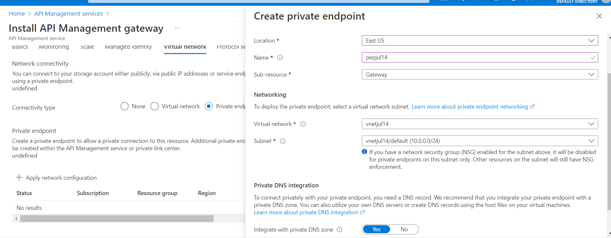  
  

### 2. Ensure API management access is granted using Managed Identities

**Security Control Mapping :**  

| Control Number | Control Statement | Security Domain | Default | Associated Runbook | CVSS Severity  |
| -------------- | ----------------- | --------------- | ------- | ------------------ | -------------- |
|  [CS0012298](place holder)       | Access to change cloud identity access and service control policies is restricted to authorized cloud administrative personnel |Identity & Access Management | Not enabled | None | [Medium (5.1)](https://www.first.org/cvss/calculator/3.1#CVSS:3.1/AV:A/AC:H/PR:H/UI:N/S:C/C:L/I:L/A:L) |

**Why?**  

Managed identity enables Azure resources to authenticate to cloud services (e.g. Azure Key Vault) without storing credentials in code. Once enabled, all necessary permissions can be granted via Azure role-based-access-control. 
In system assigned managed identity, the lifecycle of this type of managed identity is tied to the lifecycle of this resource. Additionally, each resource (e.g. Virtual Machine) can only have one system assigned managed identity. 
In User assigned managed identity, managed identities are created as standalone Azure resources, and have their own lifecycle. A single resource (e.g. Virtual Machine) can utilize multiple user assigned managed identities. A single user assigned managed identity can be shared across multiple resources.

**How?** 

**_Step 1:_** When creating an API Management gateway, fill the basic details and Navigate to 'Managed identity' tab and checkbox for 'Status'. 
 
**_Step 2:_** Review the entered details and click on 'Create'. 

**_Step 3:_** For an existing API Management gateway , Navigate to 'Managed Identity' under 'Security' and turn the Status `On` for Managed Identity and click on Save. 
**Note** : Click `Yes` for confirmation popup  
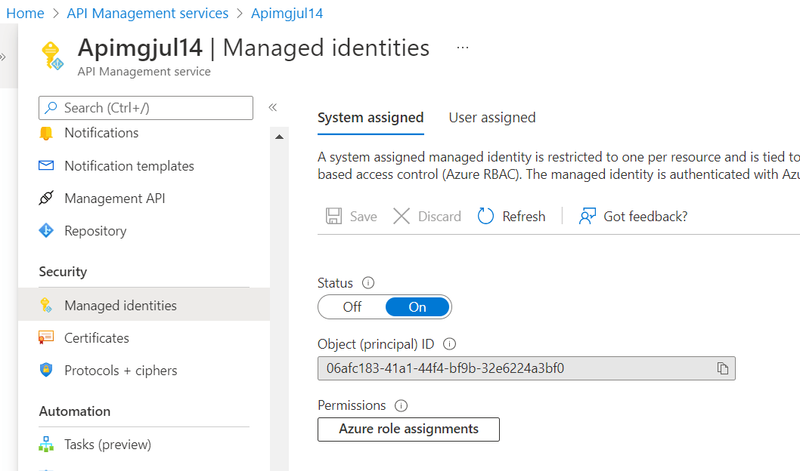 

  

### 3. Ensure least privilege access is implemented in API Management using Role Based Access control 

[Place Holder ]
        
**Following are the suggested RBAC roles for Azure API Management Gateways**  
| Function | Description | Role | 
| -------------- | ----------------- | --------------- | 
|  API Gateway Contributor | Can manage service and the APIs| [API Management Service Contributor](https://github.com/MicrosoftDocs/azure-docs/blob/main/articles/role-based-access-control/built-in-roles.md#api-management-service-contributor) |
|  API Gateway Operator| 	Can manage service but not the APIs | [API Management Service Operator](https://github.com/MicrosoftDocs/azure-docs/blob/main/articles/role-based-access-control/built-in-roles.md#api-management-service-operator-role) |
|  API Gateway Reader | 	Read-only access to service and APIs | [API Management Service Reader](https://github.com/MicrosoftDocs/azure-docs/blob/main/articles/role-based-access-control/built-in-roles.md#api-management-service-reader-role) |

  

### 4. Ensure Azure API Management uses standard organizational Resource tagging method

**Security Control Mapping :**  
| Control Number | Control Statement | Security Domain | Default | Associated Runbook | CVSS Severity  |
| -------------- | ----------------- | --------------- | ------- | ------------------ | -------------- |
| CS0012261  | Technology hardware and software must be registered and accurately recorded within the enterprise technology repository and/or asset management systems | Asset Management  | Not enabled | organizational Runbook | [Low (1.6)](https://www.first.org/cvss/calculator/3.1#CVSS:3.1/AV:P/AC:H/PR:H/UI:N/S:U/C:N/I:N/A:L) |

**Why, What and How ?** 

Client Rationale and Justification 
[Placeholder link]

### 5. Ensure Activity logging is enabled for Azure API Management

**Security Control Mapping :**  
| Control Number | Control Statement | Security Domain | Default | Associated Runbook | CVSS Severity  |
| -------------- | ----------------- | --------------- | ------- | ------------------ | -------------- |
| CS0012233 | Information System must create a log and record activities occurring on or originating from the information system. Logs must be made accessible to the enterprise SIEM solution  | Security Information and event management   | Enabled but not forwarded to Splunk | None | [Low (2.7)](https://www.first.org/cvss/calculator/3.1#CVSS:3.1/AV:P/AC:H/PR:H/UI:N/S:U/C:L/I:N/A:L) |

**Why, What and How ?** 

Client rationale and Justification 
[Placeholder link]

   

### 6. Ensure administrative tasks are performed only in admin-e workstations 

**Security Control Mapping :**  
| Control Number | Control Statement | Security Domain | Default | Associated Runbook | CVSS Severity  |
| -------------- | ----------------- | --------------- | ------- | ------------------ | -------------- |
|  CS0012298	 | Access to change cloud identity access and service control policies is restricted to authorized cloud administrative personnel |  Identity & Access Management | Not enabled | None | [Low (3.0)](https://www.first.org/cvss/calculator/3.1#CVSS:3.1/AV:L/AC:H/PR:H/UI:N/S:U/C:L/I:L/A:N)|

**Why?**  

A Privileged workstation provides a hardened workstation that has clear application control and application guard. The workstation uses credential guard, device guard, app guard, and exploit guard to protect the host from malicious behavior. All the administrative tasks must be performed only using the admin-e workstation

**How?**  

**_step 1 :_** Request permission to add the user to corresponding entitlements to access admin e workstation 
**_Step 2 :_** Login to the workstation as the user and launch the azure portal in browser to perform administrative tasks  
[Place holder for link]

### 7. Ensure Client application authorization to API management is managed using oauth2.0

**Security Control Mapping :**  
| Control Number | Control Statement | Security Domain | Default | Associated Runbook | CVSS Severity  |
| -------------- | ----------------- | --------------- | ------- | ------------------ | -------------- |
|  CS0012298	 | Access to change cloud identity access and service control policies is restricted to authorized cloud administrative personnel |  Identity & Access Management | Not enabled | None | [Medium (5.1)](https://www.first.org/cvss/calculator/3.1#CVSS:3.1/AV:A/AC:H/PR:H/UI:N/S:C/C:L/I:L/A:L) |

**What & Why?**  

By configuring Azure AD as the identity provider and creating an authorization using the standardized OAuth 2.0 flow, API Management can retrieve and refresh access tokens to be used inside of API management or sent back to a client. This feature enables APIs to be exposed with or without a subscription key, and the authorization to the backend service uses OAuth 2.0. Configuring OAuth 2.0 for the APIs hosted in Azure API Management adds an extra layer of security by generating and consuming a time bound token and prevents unauthorized access of malicious users.  

**How?**  

**_Step 1:_** Navigate to  Azure Active Directory -> App Registration -> New registration and Register an application . 
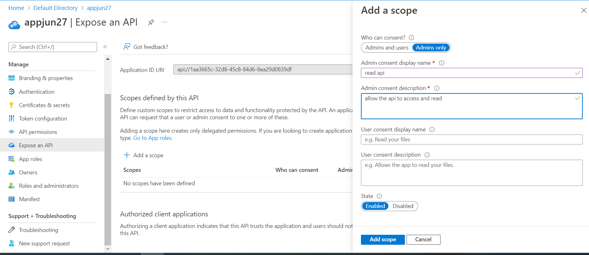  
**_Step 2:_** In the side menu bar of the 'API Management services' window , Navigate to 'OAuth 2.0 + OpenID Connect' under 'Developer portal' ,and click on 'Add'. Enter the Display name, and enter the 'Client registration page URL' and 'Authorization endpoint' URL. 
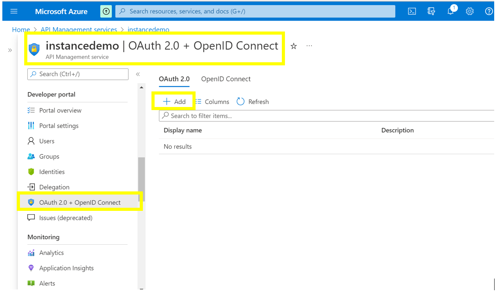  
**_Step 3:_** Configure the redirect URI details and click on 'Create'. 
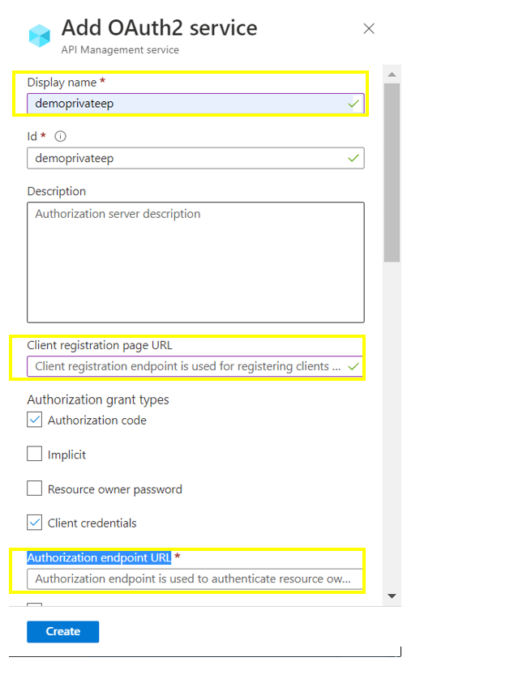  
**_Step 4:_** Configure a JWT validation policy to pre-authorize requests 

    <validate-jwt header-name="Authorization" failed-validation-httpcode="401" failed-validation-error-message="Unauthorized. Access token is missing or invalid.">
        <openid-config url="https://login.microsoftonline.com/{aad-tenant}/v2.0/.well-known/openid-configuration"/>
        <required-claims>
            <claim name="aud">
                <value>{client-id}</value>
            </claim>
        </required-claims>
    </validate-jwt>

**Note :** Refer the link for more information : https://docs.microsoft.com/en-us/azure/api-management/api-management-howto-protect-backend-with-aad

  

### 8. Ensure Developer authentications is done using Azure AD for API Management

**Security Control Mapping :**  

| Control Number | Control Statement | Security Domain | Default | Associated Runbook | CVSS Severity  |
| -------------- | ----------------- | --------------- | ------- | ------------------ | -------------- |
| CS0012300 | Cloud products and services must be deployed on private subnets and public access must be disabled for these services | Identity & Access Management | Not enabled | None| [Medium (5.5)](https://www.first.org/cvss/calculator/3.1#CVSS:3.1/AV:N/AC:H/PR:H/UI:N/S:C/C:L/I:L/A:L)  |

**Why?** 

Default authentications must be disabled as enabling it allows a single username/pass combination to access everything in the API Management.It becomes challenging to understand what user or system really initiated the request without additional thorough logging. Hence Azure Active Directory authentication must be used to access API Management. identities of users and other Microsoft services can be managed in one central location which simplifies permission management. 

**How?**  

**_Step 1:_** Navigate to  Azure Active Directory -> App Registration -> New registration and Register an application  

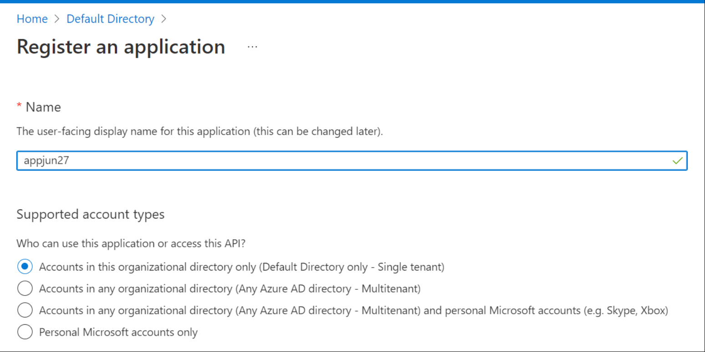  

**_Step 2:_** Go to Certificates & Secrets and create a new client secret and click Add  

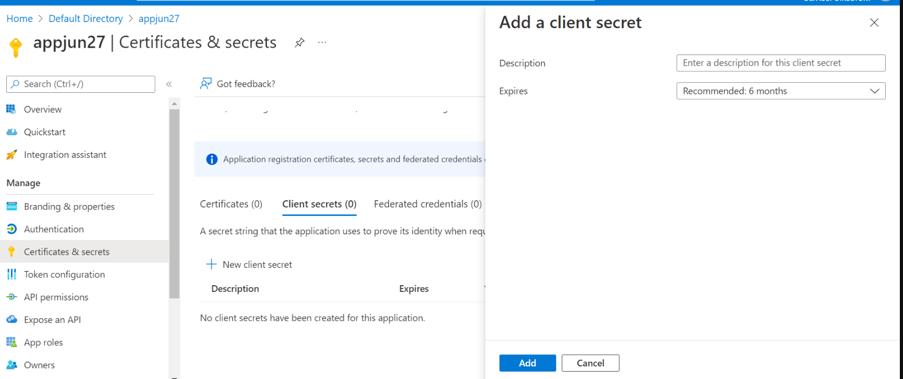  

**_Step 3:_**  In the side menu bar of the 'API Management services' window , Navigate to 'Identity' under 'Developer portal' ,and click on 'Add'and enter the client id and client secret 

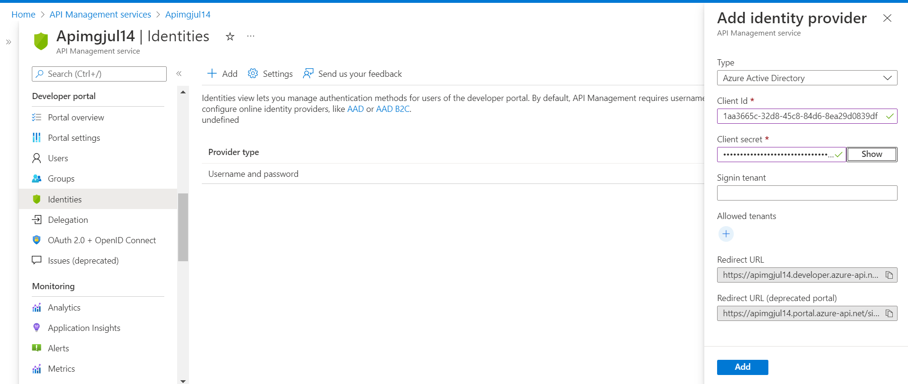  

   

### 9. Ensure secrets for 'Named values' and certificates for backend authenticated are vaulted in Azure Key vault

**Security Control Mapping :**  
| Control Number | Control Statement | Security Domain | Default | Associated Runbook | CVSS Severity  |
| -------------- | ----------------- | --------------- | ------- | ------------------ | -------------- |
| CS0012168       |Strong encryption key management controls are in place for cloud provider services to protect data at rest | Data Protection  | Not enabled | None | [Medium (5.3)](https://www.first.org/cvss/calculator/3.1#CVSS:3.1/AV:A/AC:H/PR:H/UI:N/S:U/C:H/I:L/A:L) |

**Why?**  

Named values are a global collection of name/value pairs in each API Management instance. There is no imposed limit on the number of items in the collection. Named values can be used to manage constant string values and secrets across all API configurations and policies.
API Management provides the capability to secure access to APIs (i.e., client to API Management) using client certificates. You can validate certificates presented by the connecting client and check certificate properties against desired values using policy expressions.     

**How?**  

**_Step 1:_**  In the side menu bar of the 'API Management services' window , Navigate to 'Named values' under 'APIs' ,and click on 'Add'. 
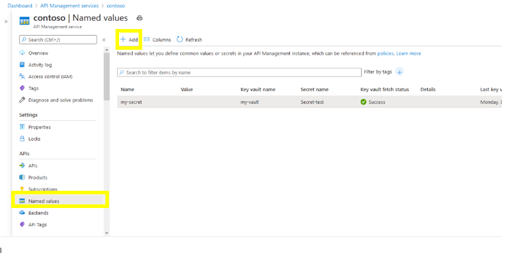 

**_Step 2:_** Enter the name, and under Vault type select 'Key vault'. And click on 'Secret' to add a secret.  
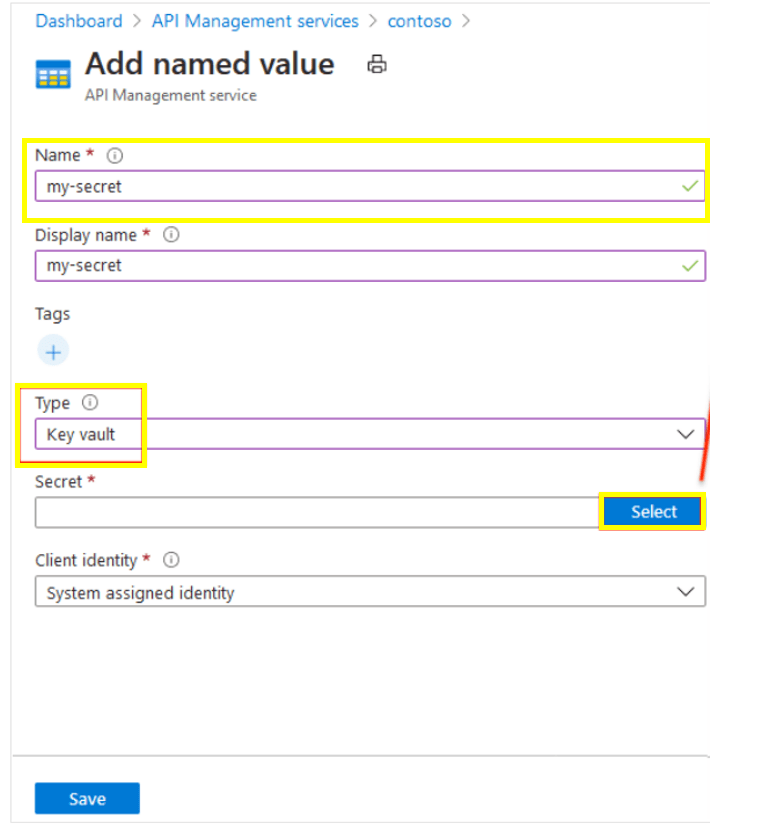 

**_Step 3:_** Select and Secret from Azure key vault and click on 'select'. 
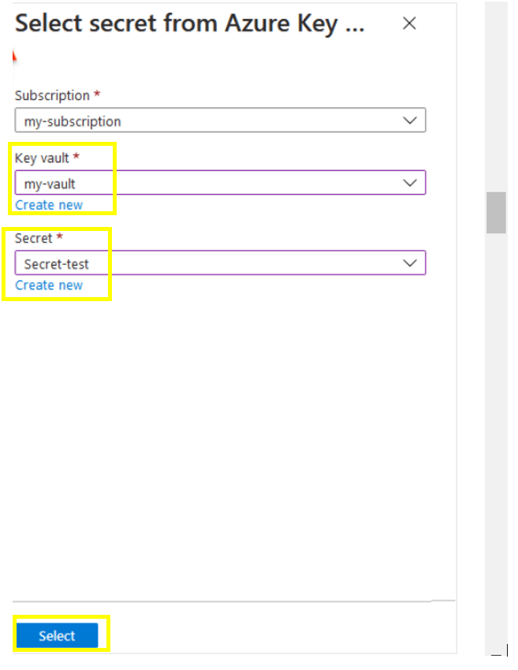 

**_Step 4:_** Navigate to 'Certificates' under 'Security' and click on 'Add'.Enter the name, and under Vault type select 'Key vault'. And click on 'Certificate' to use a certificate from key vault. 
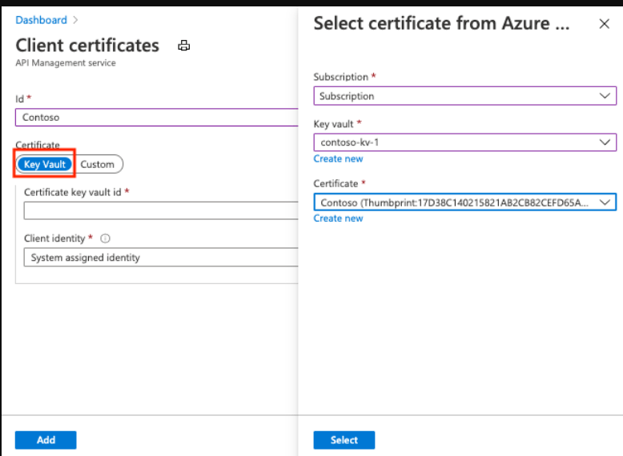 

**_Step 5:_** To Configure an API to use client certificate for gateway authentication, Navigate to API -> Design -> Backend -> Client Certificate and select the certificate from key vault. 
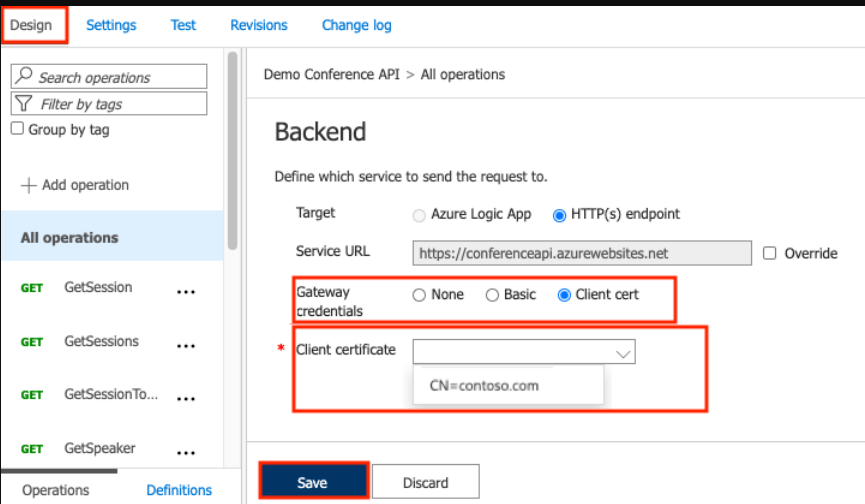 
  

### 10. Ensure the app insights is enabled for Azure API Management

**Security Control Mapping :**  
| Control Number | Control Statement | Security Domain | Default | Associated Runbook | CVSS Severity  |
| -------------- | ----------------- | --------------- | ------- | ------------------ | -------------- |
| CS0012233 | Information System must create a log and record activities occurring on or originating from the information system. Logs must be made accessible to the enterprise SIEM solution  | Security Information and event management  | Not Enabled | None | [Low (2.7)](https://www.first.org/cvss/calculator/3.1#CVSS:3.1/AV:P/AC:H/PR:H/UI:N/S:U/C:L/I:N/A:L) |

**Why?**  
  
Application Insights is used to find out easily  the most useful features, the most common issues, and to work out why a feature does or doesn’t work.It also provides the ability to systematically assess each feature of the app, incorporating analytics into development cycle. Having a complete 360° views of your applications’ availability, performance and usage, which can enable fast & powerful insights, helps to plan new improvements and prioritize the backlog  

**How?**  

**_Step 1:_** When creating the API management gateway , navigate to 'Monitoring'. Enable the checkbox and select the app insights  . 
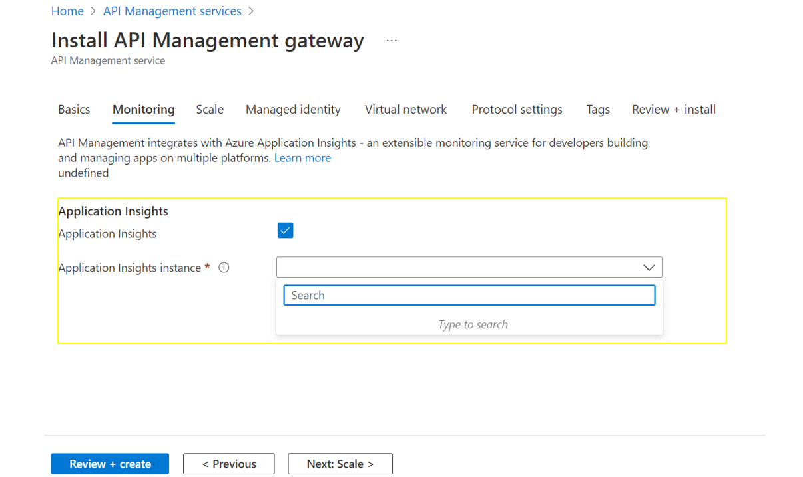
  

### 11. Ensure diagnostic logging are enabled for Azure API Management

**Security Control Mapping :**  
| Control Number | Control Statement | Security Domain | Default | Associated Runbook | CVSS Severity  |
| -------------- | ----------------- | --------------- | ------- | ------------------ | -------------- |
| CS0012233 | Information System must create a log and record activities occurring on or originating from the information system. Logs must be made accessible to the enterprise SIEM solution  | Security Information and event management  | Not Enabled | None | [Low (2.7)](https://www.first.org/cvss/calculator/3.1#CVSS:3.1/AV:P/AC:H/PR:H/UI:N/S:U/C:L/I:N/A:L) |

**Why?**  
  
The event log contains information about the api objects which include AppServiceHTTPLogs,AppServiceConsoleLogs,AppServiceAppLogs,AppServiceAuditLogs,AppServiceIPSecAuditLogs and AppServicePlatformLogs. These logs when forwarded to Splunk provide necessary information to create notable alerts for any rule created to allow connection from internet  

**How?**  

**_Step 1:_** Navigate to the created API management -> Diagnostic settings under Monitoring section, click on 'Add diagnostic setting' . 
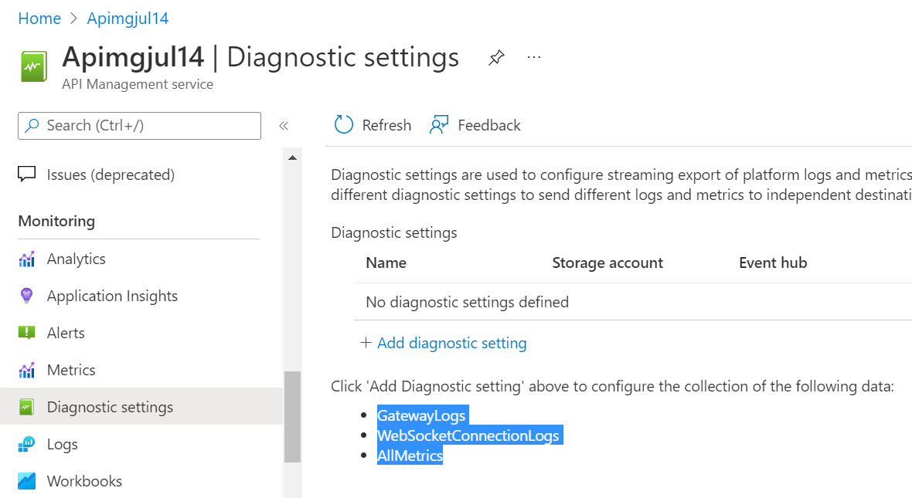 
**_Step 2:_** Select GatewayLogs,WebSocketConnectionLogs,AllMetrics log type and Select Destination details to be 'Stream to EventHub'. Select the Eventhub namespace and click on 'Save' button  
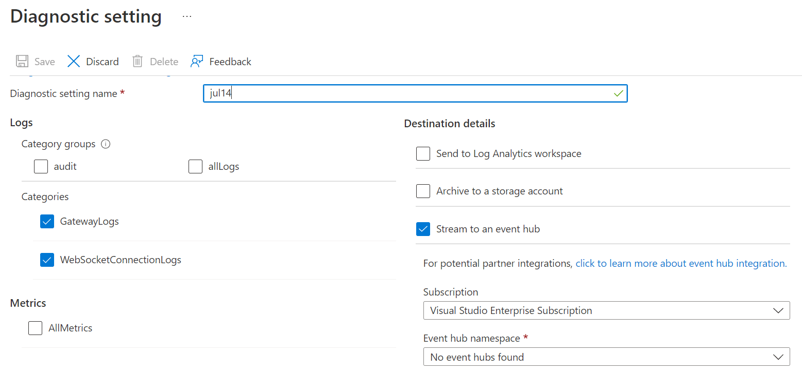 
  

### 12. Ensure protocol ciphers are managed in Azure API management

**Security Control Mapping :**  
| Control Number | Control Statement | Security Domain | Default | Associated Runbook | CVSS Severity  |
| -------------- | ----------------- | --------------- | ------- | ------------------ | -------------- |
|  CS0012168       | Strong encryption key management controls are in place for cloud provider services to protect data at rest | Data Protection  | Enabled | None | [Medium (5.3)](https://www.first.org/cvss/calculator/3.1#CVSS:3.1/AV:A/AC:H/PR:H/UI:N/S:U/C:H/I:L/A:L) |

**Why?**  

Data in transit between Application and Azure API Management gateway services can be encrypted based on the nature of the connection. Microsoft uses the Transport Layer Security (TLS) protocol to protect data when it's traveling between the Gateway services and applications.Other protocols and ciphers can be chosen to improve the security posture of the environment and also to remain in compliance with industry standards or organization requirements. TLS 1.2 must be Client side and the 3DES cipher for enhanced data security

**How?**  

**_Step 1:_** when creating the API management gateway , navigate to protocol settings and click on Check box 'Cipher'.  
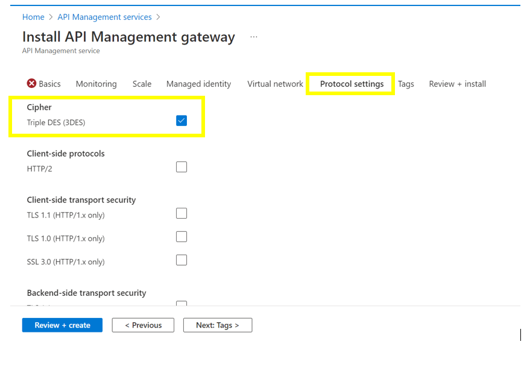  

**Note:** SLS 1.2 is enabled by default and additional protocols or ciphers can be enabled

  

### 13. Ensure traffic to Azure API Management is controlled using Access restriction policies 

**Security Control Mapping :**  
| Control Number | Control Statement | Security Domain | Default | Associated Runbook | CVSS Severity  |
| -------------- | ----------------- | --------------- | ------- | ------------------ | -------------- |
| [CS0012300](place holder) | Cloud products and services must be deployed on private subnets and public access must be disabled for these services | Network and communication Security | Not enabled | None | [High (7.2)](https://www.first.org/cvss/calculator/3.1#CVSS:3.1/AV:N/AC:H/PR:H/UI:N/S:C/C:H/I:L/A:L) |

**Why?** 

In Azure API Management, API publishers can change API behavior through configuration using policies. Policies are a collection of statements that are run sequentially on the request or response of an API.Policies are applied inside the gateway between the API consumer and the managed API. While the gateway receives requests and forwards them, unaltered, to the underlying API, a policy can apply changes to both the inbound request and outbound response.

Following are some of the API Management policies 

- **Check HTTP header** - Enforces existence and/or value of an HTTP header.
- **Get authorization context** - Gets the authorization context of a specified authorization configured in the API Management instance.
- **Limit call rate by subscription**- Prevents API usage spikes by limiting call rate, on a per subscription basis.
- **Limit call rate by key** - Prevents API usage spikes by limiting call rate, on a per key basis.
- **Restrict caller IPs** - Filters (allows/denies) calls from specific IP addresses and/or address ranges.
- **Set usage quota by subscription** - Allows you to enforce a renewable or lifetime call volume and/or bandwidth quota, on a per subscription basis.
- **Set usage quota by key** - Allows you to enforce a renewable or lifetime call volume and/or bandwidth quota, on a per key basis.
- **Validate JWT** - Enforces existence and validity of a JWT extracted from either a specified HTTP header or a specified query parameter.
- **Validate client certificate** - Enforces that a certificate presented by a client to an API Management instance matches specified validation rules and claims.

**How?**  

**_Step 1:_** In the Azure portal, search for and select API Management services.  
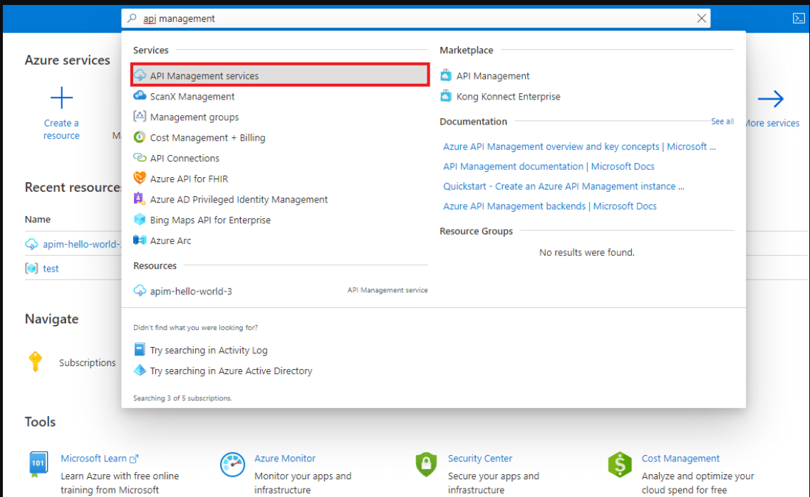  

**_Step 2:_** On the API Management services page, select your API Management instance.  
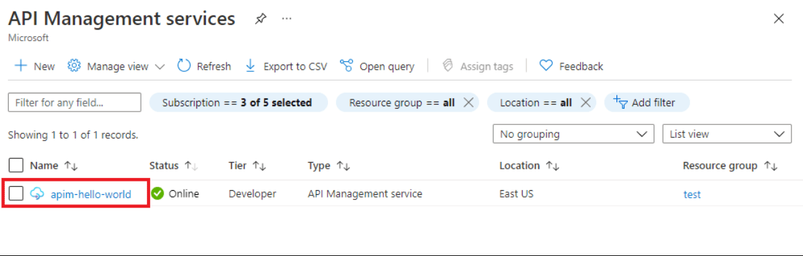  

**_Step 3:_** Navigate to APIs -> Design -> ALl operations. Select `+Add policy` under inbound processing 
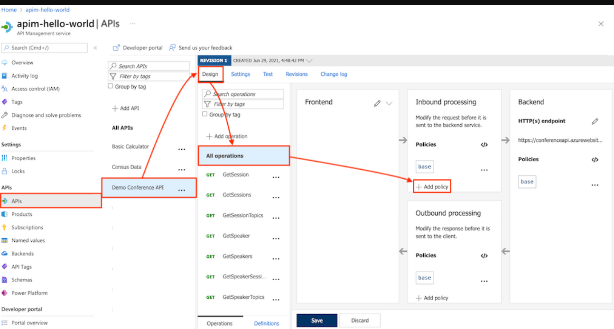  

**_Step 4:_** In Add inbound policy, select a policy to add. For example, select 'Limit call Rate'.  
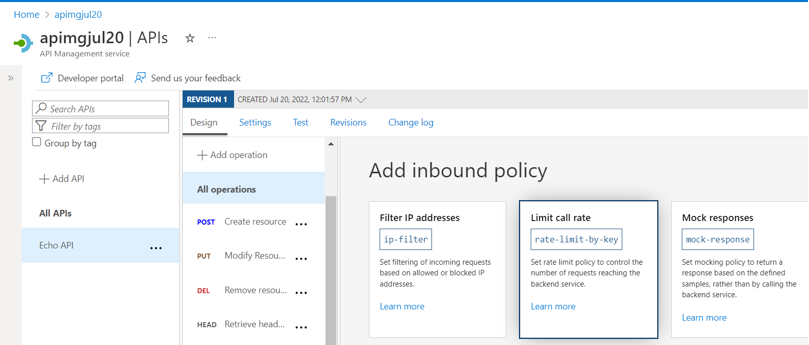  

**_Step 5:_** Input the 'Number of calls' and 'Renewal Period' and click on `save` 
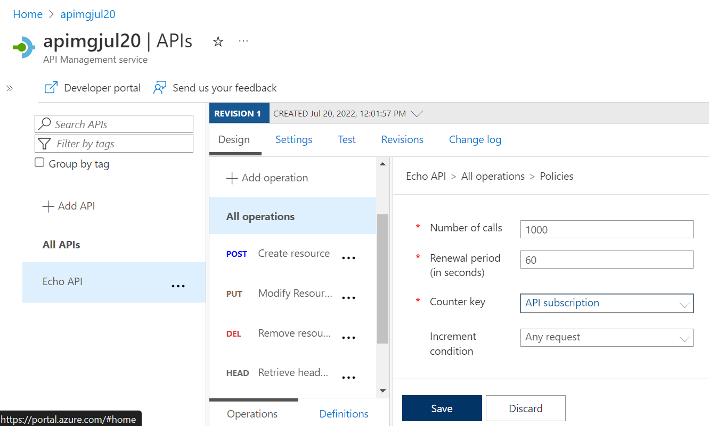  

### 14. Ensure Backend and client protocols are set as TLS 1.2 in Azure API management

**Security Control Mapping :**  
| Control Number | Control Statement | Security Domain | Default | Associated Runbook | CVSS Severity  |
| -------------- | ----------------- | --------------- | ------- | ------------------ | -------------- |
|  CS0012168       | Strong encryption key management controls are in place for cloud provider services to protect data at rest | Data Protection  | Enabled | None | [Medium (5.3)](https://www.first.org/cvss/calculator/3.1#CVSS:3.1/AV:A/AC:H/PR:H/UI:N/S:U/C:H/I:L/A:L) |

**Why and What ?** 

Data in transit between Application and Azure API Management Gateway services can be encrypted based on the nature of the connection. Microsoft uses the Transport Layer Security (TLS) protocol to protect data when it's traveling between the gateway services and client / backend applications.TLS 1.2 protocol must be chosen to improve the security posture of the environment and also to remain in compliance with industry standards or organization requirements.

**How?**  

**_Step 1:_** In the created API management gateway , navigate to 'Protocol + Cipher' under security tab.  
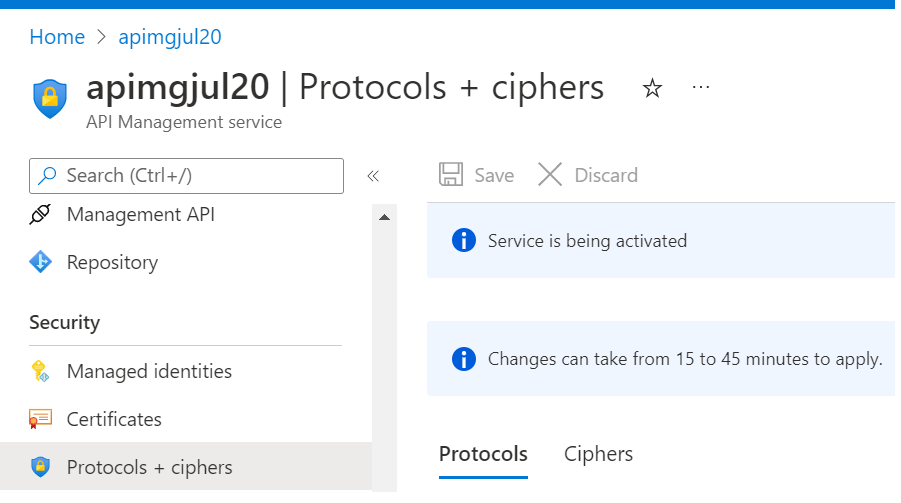  

**_Step 2:_** Navigate to the Client Protocol and verify the TLS 1.2 protocol is 'Enabled by default 
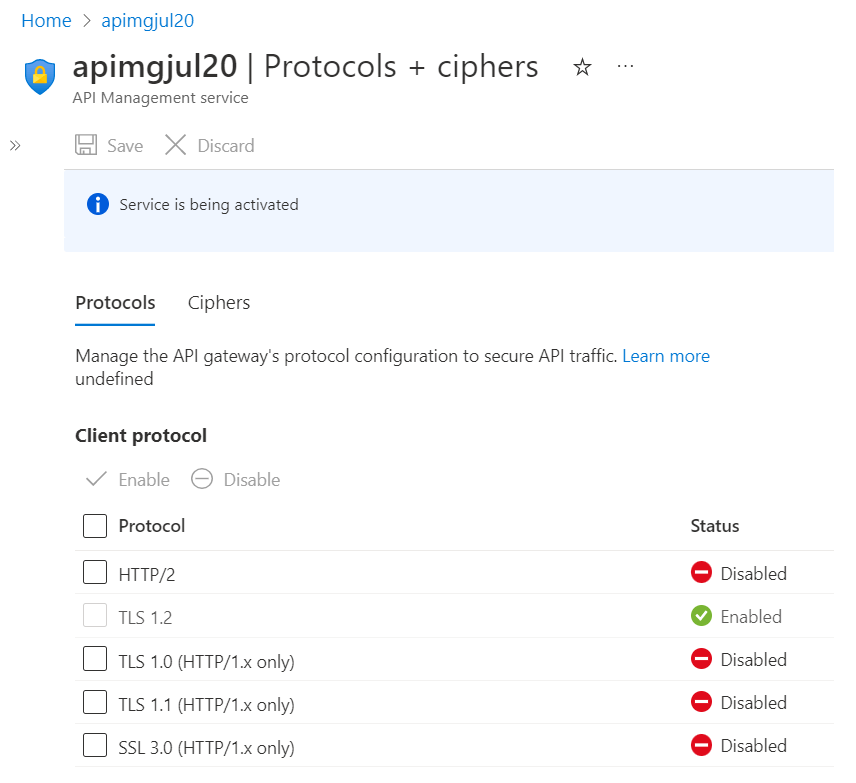  

**_Step 3:_** Navigate to the Backend Protocol and verify the TLS 1.2 protocol is 'Enabled by default  
  

**Note:** Some protocols like backend-side TLS 1.2 can't be enabled or disabled from the Azure portal. Instead,  REST call must be applied for them using the properties.customProperties structure in the Create/Update API Management Service REST API .

Refer the below link for more details :  
https://docs.microsoft.com/en-us/rest/api/apimanagement/current-ga/api-management-service/create-or-update?tabs=HTTP
  
