# Azure Active Directory - Security baseline requirement <!-- omit in toc -->
### Baseline security configuration requirement for Azure services <!-- omit in toc -->


**Generated By: TBD** <br>
**Service Type: Identity** <br>
**Deployment Phase:Service Discovery** <br>
**Last updated: 06/17/2022**<br>

## Table of Contents <!-- omit in toc -->
- [Overview](#overview)
  - [Use Case Examples:](#use-case-examples)
- [Cloud Security Requirements](#cloud-security-requirements)
  - [1. Ensure local users can access the registered applications only through organization registered device](#1-ensure-local-users-can-access-the-registered-applications-only-through-organization-registered-device)
  - [2. Ensure user account life cycle is managed using organization Entitlement management process and tools](#2-ensure-user-account-life-cycle-is-managed-using-organization-entitlement-management-process-and-tools)
  - [3. Ensure administrative access to business critical applications are limited by Azure PIM](#3-ensure-administrative-access-to-business-critical-applications-are-limited-by-azure-pim)
  - [4. Ensure Access review is configured to review the privileged accounts semi annually and users are removed if they no longer need access](#4-ensure-access-review-is-configured-to-review-the-privileged-accounts-semi-annually-and-users-are-removed-if-they-no-longer-need-access)
  - [5. Ensure Azure Active directory is accessed only by IAM admin team](#5-ensure-azure-active-directory-is-accessed-only-by-iam-admin-team)
  - [6. Ensure multi-factor authentication is enabled for Enterprise applications, Azure services with web access](#6-ensure-multi-factor-authentication-is-enabled-for-enterprise-applications-azure-services-with-web-access)
  - [8. Ensure the registered application in azure active directory is running on a platform that supports TLS 1.2 or above and the apps leverage the Microsoft Authentication Libraries (MSAL)](#8-ensure-the-registered-application-in-azure-active-directory-is-running-on-a-platform-that-supports-tls-12-or-above-and-the-apps-leverage-the-microsoft-authentication-libraries-msal)
  - [9. Ensure that IAM resources use standard organizational Resource tagging method](#9-ensure-that-iam-resources-use-standard-organizational-resource-tagging-method)
  - [10. Ensure AAD diagnostic settings are enabled to capture AD logs](#10-ensure-aad-diagnostic-settings-are-enabled-to-capture-ad-logs)
  - [11. Ensure only Enterprise Azure tenant allowed to access to AAD](#11-ensure-only-enterprise-azure-tenant-allowed-to-access-to-aad)
  - [12. Ensure access to Azure AD is granted through the use of secondary accounts](#12-ensure-access-to-azure-ad-is-granted-through-the-use-of-secondary-accounts)
  - [13. Ensure break glass account is available to access in case of emergencies and should be monitored for use of break glass account](#13-ensure-break-glass-account-is-available-to-access-in-case-of-emergencies-and-should-be-monitored-for-use-of-break-glass-account)
  - [14. Ensure conditional access and Continuous Access Evaluation (CAE) is enabled to provide more granular access control based on user-defined conditions](#14-ensure-conditional-access-and-continuous-access-evaluation-cae-is-enabled-to-provide-more-granular-access-control-based-on-user-defined-conditions)
  - [15. Ensure Azure AD Connector account credential is managed as per Organization policy](#15-ensure-azure-ad-connector-account-credential-is-managed-as-per-organization-policy)
  - [16. Ensure app and service principal owners are always defined and maintained for the registered apps in the tenant](#16-ensure-app-and-service-principal-owners-are-always-defined-and-maintained-for-the-registered-apps-in-the-tenant)
  - [17. Ensure the "application permission" is enabled for needed apps and "standard" and "full " permission is available to be selected depending on sensitive information](#17-ensure-the-application-permission-is-enabled-for-needed-apps-and-standard-and-full--permission-is-available-to-be-selected-depending-on-sensitive-information)
  - [18. Ensure the Redirect URIs of your application is updated with latest value and Use AppId URI to identify the application instead of using the appId property](#18-ensure-the-redirect-uris-of-your-application-is-updated-with-latest-value-and-use-appid-uri-to-identify-the-application-instead-of-using-the-appid-property)
  - [19. Ensure implicit flow is turned off for unused application and use Auth code flow wherever implicit grant flow is required](#19-ensure-implicit-flow-is-turned-off-for-unused-application-and-use-auth-code-flow-wherever-implicit-grant-flow-is-required)

## Overview

Azure Active Directory (Azure AD) is a cloud-based identity and access management service which helps the organization users to access external resources. Azure Active Directory also helps in accessing internal resources like apps on organization intranet network, along with any cloud apps developed for their own organization. 


| Control Number | Cloud Baseline Security Requirements                                                                                                                                                    |
| -------------- | --------------------------------------------------------------------------------------------------------------------------------------------------------------------------------------- |
| 1              | Ensure local users can access the registered applications only through organization registered device                                                                                   |
| 2              | Ensure user account life cycle is managed using organization Entitlement management process and tools                                                                                   |
| 3              | Ensure administrative access to business critical applications are limited by Azure PIM                                                                                                 |
| 4              | Ensure Access review is configured to review the privileged accounts semi annually and users are removed if they no longer need access                                                  |
| 5              | Ensure Azure Active directory is accessed only by IAM admin team                                                                                                                        |
| 6              | Ensure multi-factor authentication is enabled for Enterprise applications, Azure services with web access                                                                               |
| 7              | Ensure the registered application in azure active directory is running on a platform that supports TLS 1.2 or above and the apps leverage the Microsoft Authentication Libraries (MSAL) |
| 8              | Ensure that IAM resources use standard organizational Resource tagging method                                                                                                           |
| 9              | Ensure AAD diagnostic settings are enabled to capture AD logs                                                                                                                           |
| 10             | Ensure only Enterprise Azure tenant allowed to access to AAD                                                                                                                            |
| 11             | Ensure access to Azure AD is granted through the use of secondary accounts                                                                                                              |
| 12             | Ensure break glass account is available to access in case of emergencies and should be monitored for use of break glass account                                                         |
| 13             | Ensure conditional access and Continuous Access Evaluation (CAE) is enabled to provide more granular access control based on user-defined conditions                                    |
| 14             | Ensure Azure AD Connector account credential is managed as per Organization policy                                                                                                      |
| 15             | Ensure app and service principal owners are always defined and maintained for the registered apps in the tenant                                                                         |
| 16             | Ensure the "application permission" is enabled for needed apps and "standard" and "full " permission is available to be selected depending on sensitive information                     |
| 17             | Ensure the Redirect URIs of your application is updated with latest value and Use AppId URI to identify the application instead of using the appId property                             |
| 18             | Ensure implicit flow is turned off for unused application and use Auth code flow wherever implicit grant flow is required                                                               |

### Use Case Examples:
- Anomaly detector process to help detect bank fraud, structural defect and Medical problem
- Azure files accessed on-premises and secured by AD DS
- Scalable Umbraco CMS web app

## Cloud Security Requirements

### 1. Ensure local users can access the registered applications only through organization registered device

**Security Control Mapping :** <br>

| Control Number | Control Statement | Security Domain | Default | Associated Runbook | CVSS Severity  |
| -------------- | ----------------- | --------------- | ------- | ------------------ | -------------- |
| CS0012300 | Cloud products and services must be deployed on private subnets and public access must be disabled for these services | Network and communication Security | Not enabled | Virtual Network Runbook | [Medium (5.5)](https://www.first.org/cvss/calculator/3.1#CVSS:3.1/AV:N/AC:H/PR:H/UI:N/S:C/C:L/I:L/A:L)  |

**Why?**<br>

If the users credentials are compromised then the resources and services permitted to the users are compromised. Access to the resources must be restricted to devices registered with Azure AD using Intune to provide additional layer of authentication method to protect against chredential compromie

**How?** <br>

**_Step 1:_** Sign in to the Microsoft Endpoint Manager admin center.<br>
**_Step 2:_** Select Endpoint security > Conditional Access > Policies > New policy.<br>
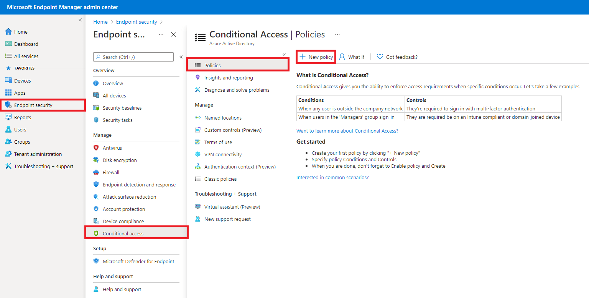<br>
**_Step 3:_** Under Assignments, select Users or workload identities to configure the Identities in the directory that the policy applies to. To learn more, see Users and groups in the Azure AD documentation.<br>
**_Step 4:_** Next select Cloud apps or action, which is also under Assignment. Configure this policy to apply to Cloud apps.<br>
**_Step 5:_** Next, configure Conditions Select the signals you want to use as conditions for this policy. Options include:<br>
* User risk<br>
* Sign-in risk<br>
* Device platforms<br>
* Locations<br>
* Client as<br>
* Filter for devices<br>

**_Step 6:_** Under Access controls, select Grant and then one or more requirements. To learn about the options for Grant, see [Grant](https://docs.microsoft.com/en-us/azure/active-directory/conditional-access/concept-conditional-access-grant) in the Azure AD Documentation.<br>
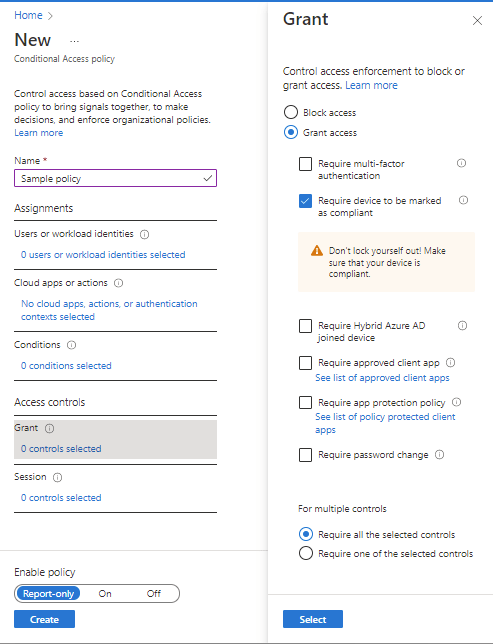<br>
**_Step 7:_** Under Enable policy, select On. By default, the policy is set to Report-only.<br>
**_Step 8:_** Select Create.<br>


### 2. Ensure user account life cycle is managed using organization Entitlement management process and tools ###

**Security Control Mapping :** <br>

| Control Number | Control Statement | Security Domain | Default | Associated Runbook | CVSS Severity  |
| -------------- | ----------------- | --------------- | ------- | ------------------ | -------------- |
|  CS0012298	 | Access to change cloud identity access and service control policies is restricted to authorized cloud administrative personnel |  Identity and Access Management | Not enabled | None | [Medium (5.1)](https://www.first.org/cvss/calculator/3.1#CVSS:3.1/AV:A/AC:H/PR:H/UI:N/S:C/C:L/I:L/A:L) |

**Why?**<br>

An automated user account lifecycle management process must be implemented from creation of identities through revocation. Organization should use entitlement management process and automate access request workflows, including access assignments, reviews, and expiration using Sailpoint. 

**How?** <br>

Account life cycle is managed by SailPoint application, Please refer following Confluence documentation for procedure and process 
[Placeholder]
<br><br> 

### 3. Ensure administrative access to business critical applications are limited by Azure PIM ###

**Security Control Mapping :** <br>

| Control Number | Control Statement | Security Domain | Default | Associated Runbook | CVSS Severity  |
| -------------- | ----------------- | --------------- | ------- | ------------------ | -------------- |
|  CS0012298	 | Access to change cloud identity access and service control policies is restricted to authorized cloud administrative personnel |  Identity and Access Management | Not enabled | None | [Medium (5.1)](https://www.first.org/cvss/calculator/3.1#CVSS:3.1/AV:A/AC:H/PR:H/UI:N/S:C/C:L/I:L/A:L) |

**Why?**<br>

Azure PIM can be used to increase the security by implementing Approval request workflow when activating the privileged roles.This helps to reduce the risk of users having excessive access to resources and reduces the chance of high-risk errors. Azure Privileged Identity Management must also be configured to alert when an excessive number of administrator accounts are created, and to identify administrator accounts that are stale or improperly configure

**How?** <br>

**Assign a role to application(s)**<br>

**_Step 1:_** Select Azure Active Directory > Roles and administrators.<br>

**_Step 2:_** Select the User Administrator.<br>
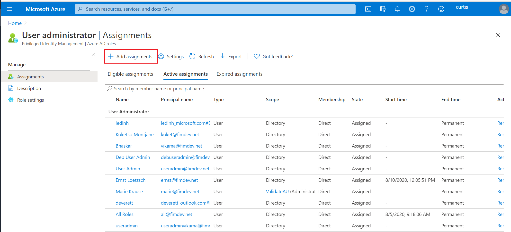 <br>

**_Step 3:_** Select Add assignments.<br>
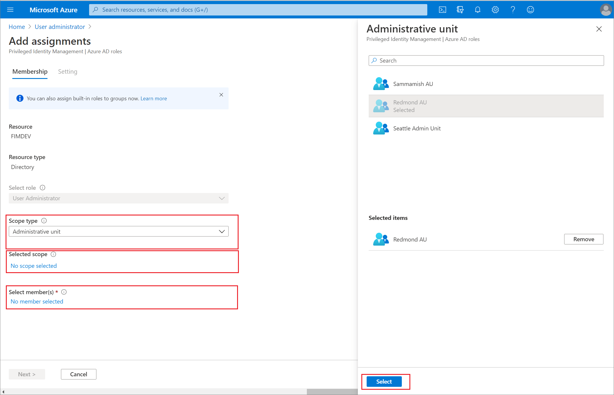<br>

**_Step 4:_** On the Add assignments page, select the proper applicable enterprise application(s).<br>

**Activate role**<br>

**_Step 5:_** Open Azure AD Privileged Identity Management<br>

**_Step 6:_** Select My roles, and then select Azure AD roles to see a list of your eligible Azure AD roles.<br>
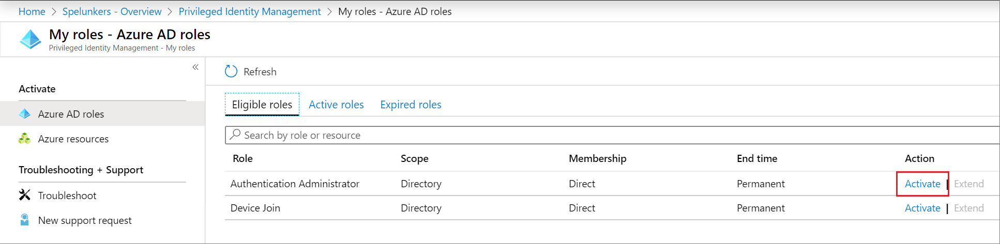<br>

**_Step 7:_** In the Azure AD roles list, find the role you want to activate.<br>
<br>

**_Step 8:_** Select Activate to open the Activate pane.<br>
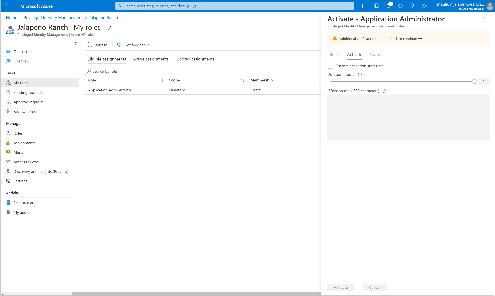<br>

**_Step 9:_** Select Additional verification required and follow the instructions to provide security verification. You are required to authenticate only once per session.<br>
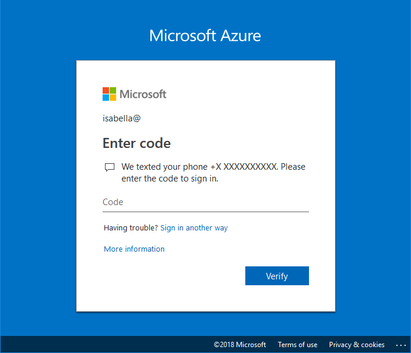<br>

**_Step 10:_** After multifactor authentication, select Activate before proceeding.<br>
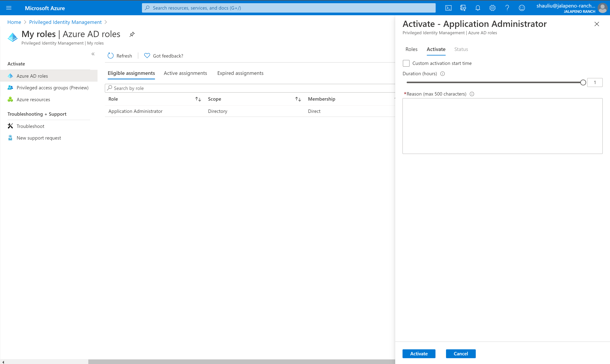<br>

**_Step 11:_** If you want to specify a reduced scope, select Scope to open the filter pane. On the filter pane, you can specify the Azure AD resources that you need access to.<br>

**_Step 12:_** It's a best practice to request access to the fewest resources that you need.<br>

**_Step 13:_** If necessary, specify a custom activation start time. The Azure AD role would be activated after the selected time.<br>

**_Step 14:_** In the Reason box, enter the reason for the activation request.<br>

**_Step 15:_** Select Activate.<br>
*   Note: If the role requires approval to activate, a notification will appear in the upper right corner of your browser informing you the request is pending approval.<br>

<br><br> 

### 4. Ensure Access review is configured to review the privileged accounts semi annually and users are removed if they no longer need access ###

**Security Control Mapping :** <br>

| Control Number | Control Statement | Security Domain | Default | Associated Runbook | CVSS Severity  |
| -------------- | ----------------- | --------------- | ------- | ------------------ | -------------- |
|  CS0012298	 | Access to change cloud identity access and service control policies is restricted to authorized cloud administrative personnel |  Identity and Access Management | Not enabled | None | [Low (3.9)](https://www.first.org/cvss/calculator/3.1#CVSS:3.1/AV:L/AC:H/PR:H/UI:N/S:C/C:L/I:L/A:N) |

**Why?**<br>

Access review must be implemented to look out for Excessive access privileges (privilege creep) to the users than required at any point in time and remove the access if the access is no longer required to the users. Access reviews can help to identify the mistakes with user role and account configuration and prevent organization application from access abuse and misuse. These access review process can be automated using tools like Cloudknox

**How?** <br>

**Creating access reviews**<br>

**_Step 1:_** Select Identity Governance

**_Step 2:_** For Azure AD roles, select Azure AD roles under Privileged Identity Management.<br>
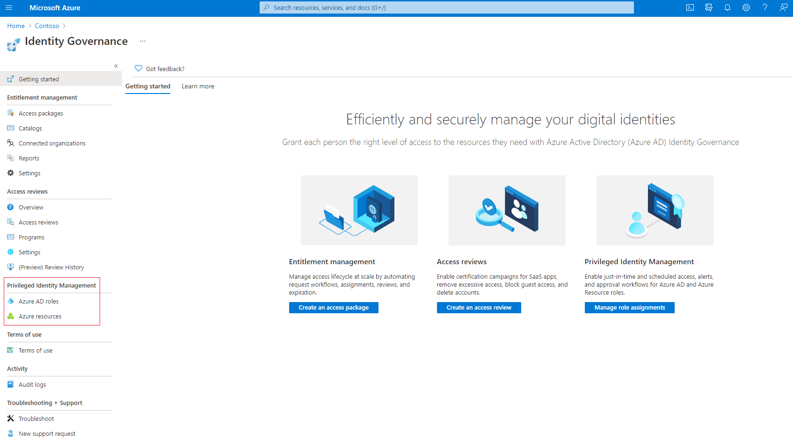<br>

**_Step 3:_** For Azure AD roles, select Azure AD roles again under Manage.<br>

**_Step 4:_** Under Manage, select Access reviews, and then select New to create a new access review.<br>
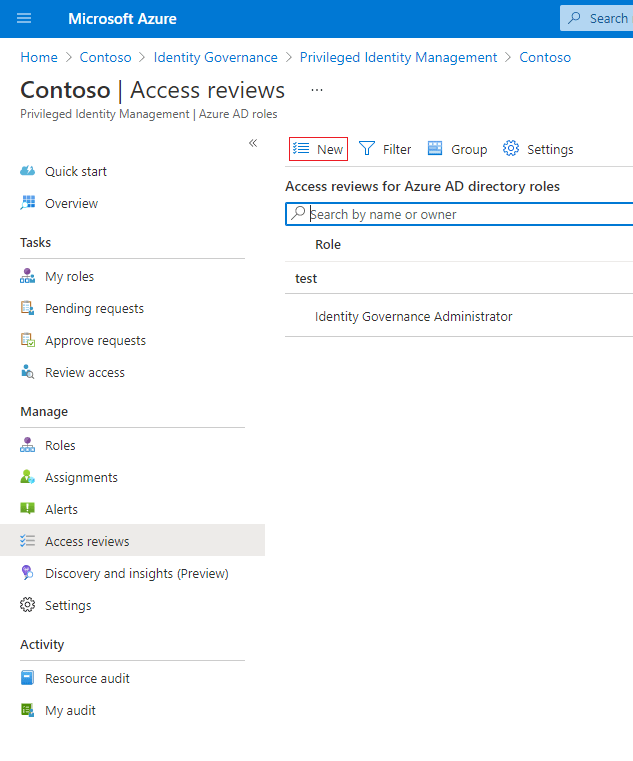<br>

**_Step 5:_** Name the access review. Optionally, give the review a description. The name and description are shown to the reviewers.<br>
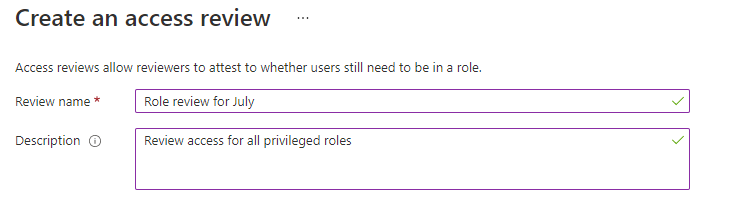<br>

**_Step 6:_** Set the Start date. By default, an access review occurs once, starts the same time it's created, and it ends in one month. You can change the start and end dates to have an access review start in the future and last however many days you want.<br>
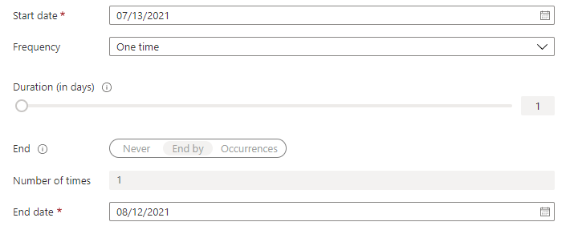<br>

**_Step 7:_** To make the access review recurring, change the Frequency setting from One time to Weekly, Monthly, Quarterly, Annually, or Semi-annually. Use the Duration slider or text box to define how many days each review of the recurring series will be open for input from reviewers. For example, the maximum duration that you can set for a monthly review is 27 days, to avoid overlapping reviews.<br>

**_Step 8:_** Use the End setting to specify how to end the recurring access review series. The series can end in three ways: it runs continuously to start reviews indefinitely, until a specific date, or after a defined number of occurrences has been completed. You, or another administrator who can manage reviews, can stop the series after creation by changing the date in Settings, so that it ends on that date.<br>

**_Step 9:_** In the Users Scope section, select the scope of the review. For Azure AD roles, the first scope option is Users and Groups. Directly assigned users and role-assignable groups will be included in this selection. For Azure resource roles, the first scope will be Users. Groups assigned to Azure resource roles are expanded to display transitive user assignments in the review with this selection. You may also select Service Principals to review the machine accounts with direct access to either the Azure resource or Azure AD role.
<br>

**_Step 10:_** Or, you can create access reviews only for inactive users (preview). In the Users scope section, set the Inactive users (on tenant level) only to true. If the toggle is set to true, the scope of the review will focus on inactive users only. Then, specify Days inactive with a number of days inactive up to 730 days (two years). Users inactive for the specified number of days will be the only users in the review.<br>

**_Step 11:_** Under Review role membership, select the privileged Azure resource or Azure AD roles to review.<br>

**_Step 12:_** In assignment type, scope the review by how the principal was assigned to the role. Choose eligible assignments only to review eligible assignments (regardless of activation status when the review is created) or active assignments only to review active assignments. Choose all active and eligible assignments to review all assignments regardless of type.
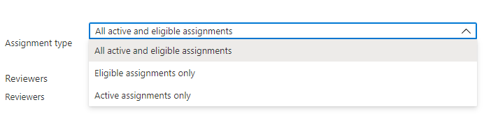<br>

**_Step 13:_** In the Reviewers section, select one or more people to review all the users. Or you can select to have the members review their own access.<br>
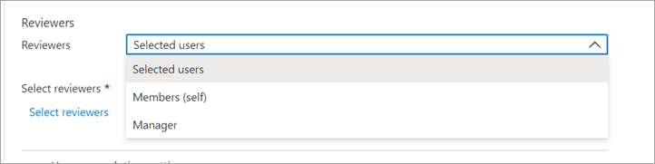<br>

**Performing access reviews**<br>

**_Step 1:_** Select Azure Active Directory and open Privileged Identity Management.<br>

**_Step 2:_** Select Review access. If you have any pending access reviews, they will appear in the access reviews page.<br>
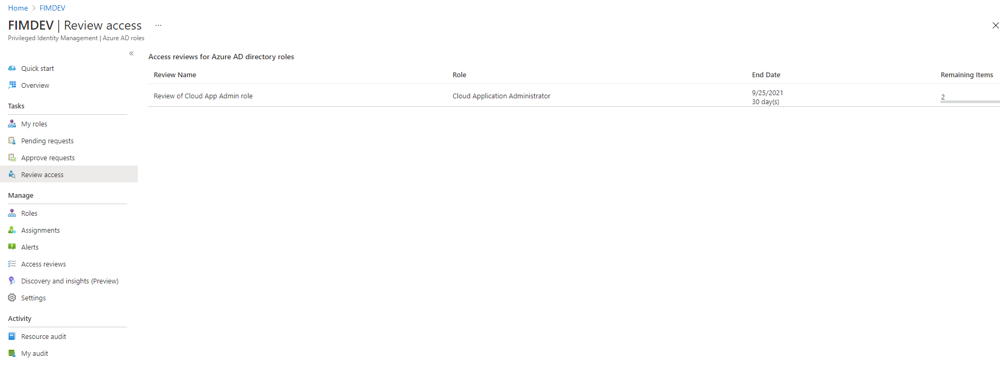<br>

**_Step 3:_** Select the review you want to complete.<br>

**_Step 4:_** Choose Approve or Deny. In the Provide a reason box, enter a business justification for your decision as needed.<br>
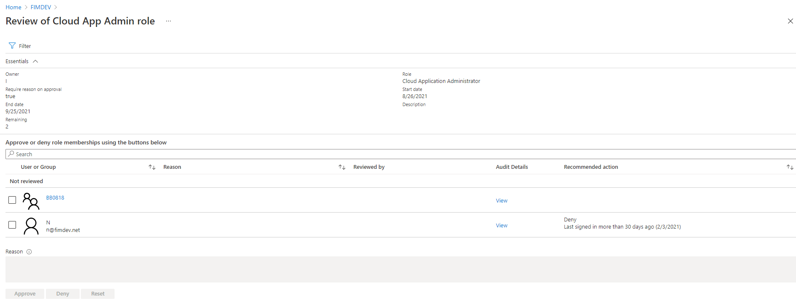<br>

<br><br> 

### 5. Ensure Azure Active directory is accessed only by IAM admin team 

**Security Control Mapping :** <br>

| Control Number | Control Statement | Security Domain | Default | Associated Runbook | CVSS Severity  |
| -------------- | ----------------- | --------------- | ------- | ------------------ | -------------- |
|  CS0012298	    | Access to change cloud identity access and service control policies is restricted to authorized cloud administrative personnel |  Identity and Access Management  | Not enabled | None |[Medium (5.1)](https://www.first.org/cvss/calculator/3.1#CVSS:3.1/AV:A/AC:H/PR:H/UI:N/S:C/C:L/I:L/A:L)  |

**Why?**<br>

Role-based access control (RBAC) is method of implementing least privilege access by providing access user and service principle based on job function. Allowing only the IAM admin team to perform administrative tasks will help to maintain least privilege and also to avoid unnecessary outage due to incorrect configurations by teams other than IAM team

**Following are the suggested RBAC roles for Azure Active directory** <br>
| Function | Description | Role | 
| -------------- | ----------------- | --------------- | 
|  IAM admin | Responsible for creating users and provisioning roles| IAMadmin |
|  Monitoring admin | Responsible for monitoring and auditing the AAD logs, this will be service principal configured by IAM team| MonitoringAccountadmin |
 

**How?** <br>
**_Step 1:_** Select Azure Active Directory > Roles and administrators and select the role you want to assign.<br>

**_Step 2:_** On the role name page, select > Add assignment for the proper role used to manage IAM admin capabilities.<br>
 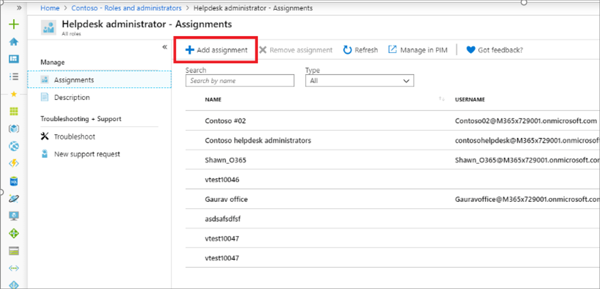<br>

**_Step 3:_** Select the proper defined group containing the users who will be managing admin functions of Azure AD, following the principle of least privilege. Only the groups that can be assigned to Azure AD roles are displayed.<br>
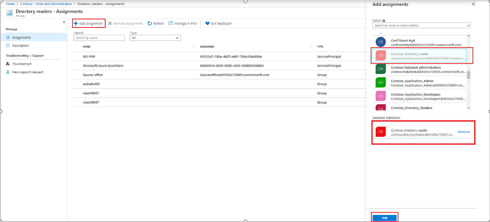<br>

**_Step 4:_** Select Add.<br>
   
<br><br> 

### 6. Ensure multi-factor authentication is enabled for Enterprise applications, Azure services with web access

**Security Control Mapping :** <br>

| Control Number | Control Statement | Security Domain | Default | Associated Runbook | CVSS Severity  |
| -------------- | ----------------- | --------------- | ------- | ------------------ | -------------- |
|  CS0012199     | After being authenticated to the enterprise network, Multi-Factor Authentication (MFA) is required to utilize accounts with privileged access |  Identity and Access Management  | Not enabled | None | [Medium (4.0)](https://www.first.org/cvss/calculator/3.1#CVSS:3.1/AV:A/AC:H/PR:H/UI:N/S:C/C:L/I:N/A:L) |

**Why?**<br>

Multi-factor authentication (MFA) is a process in which a user is prompted for additional forms of identification during a sign-in event and ensures that applications and cloud resources with web interfaces are protected against credential exposure. MFA must be enabled in Azure Active directory for all applications and cloud resources with web interfaces.

**How?** <br>

MFA is implemented using Okta, Refer Following confluence documentation on how to enroll to Okta [Placeholder]

<br><br> 

### 8. Ensure the registered application in azure active directory is running on a platform that supports TLS 1.2 or above and the apps leverage the Microsoft Authentication Libraries (MSAL)

**Security Control Mapping :** <br>
| Control Number | Control Statement | Security Domain | Default | Associated Runbook | CVSS Severity  |
| -------------- | ----------------- | --------------- | ------- | ------------------ | -------------- |
| CS0012300 | Cloud products and services must be deployed on private subnets and public access must be disabled for these services | Network and communication Security| Not enabled | Virtual Network Runbook | [Medium (5.3)](https://www.first.org/cvss/calculator/3.1#CVSS:3.1/AV:A/AC:H/PR:H/UI:N/S:U/C:H/I:L/A:L) |

**Why?** <br>

Data in transit between Application and Azure Active directory can be encrypted based on the nature of the connection. Microsoft uses the Transport Layer Security (TLS) protocol to protect data when it's traveling between the AD and applications. TLS 1.2 must be used as the secure encryption in transit for all the key vault connections to improve the security posture of the environment and also to remain in compliance with industry standards or organization requirements. The MSAL libraries must be enabled in the Azure Active directory to securely wrap security protocols in an easy-to-use library, and built-in support for Conditional Access scenarios, device-wide single sign-on (SSO), and built-in token caching support.

**How?** <br>

**To check Azure AD  is running on a minimum of TLS 1.2**<br>
**_Step 1:_** You can use the following PowerShell script to check the current TLS 1.2 settings on your Azure AD Connect server.<br>
```Powershell
    Function Get-ADSyncToolsTls12RegValue
    {
    [CmdletBinding()]
    Param
    (
        # Registry Path
        [Parameter(Mandatory=$true,
                   Position=0)]
        [string]
        $RegPath,

        # Registry Name
        [Parameter(Mandatory=$true,
                   Position=1)]
        [string]
        $RegName
    )
    $regItem = Get-ItemProperty -Path $RegPath -Name $RegName -ErrorAction Ignore
    $output = "" | select Path,Name,Value
    $output.Path = $RegPath
    $output.Name = $RegName

    If ($regItem -eq $null)
    {
        $output.Value = "Not Found"
    }
    Else
    {
        $output.Value = $regItem.$RegName
    }
    $output
}

$regSettings = @()
$regKey = 'HKLM:\SOFTWARE\WOW6432Node\Microsoft\.NETFramework\v4.0.30319'
$regSettings += Get-ADSyncToolsTls12RegValue $regKey 'SystemDefaultTlsVersions'
$regSettings += Get-ADSyncToolsTls12RegValue $regKey 'SchUseStrongCrypto'

$regKey = 'HKLM:\SOFTWARE\Microsoft\.NETFramework\v4.0.30319'
$regSettings += Get-ADSyncToolsTls12RegValue $regKey 'SystemDefaultTlsVersions'
$regSettings += Get-ADSyncToolsTls12RegValue $regKey 'SchUseStrongCrypto'

$regKey = 'HKLM:\SYSTEM\CurrentControlSet\Control\SecurityProviders\SCHANNEL\Protocols\TLS 1.2\Server'
$regSettings += Get-ADSyncToolsTls12RegValue $regKey 'Enabled'
$regSettings += Get-ADSyncToolsTls12RegValue $regKey 'DisabledByDefault'

$regKey = 'HKLM:\SYSTEM\CurrentControlSet\Control\SecurityProviders\SCHANNEL\Protocols\TLS 1.2\Client'
$regSettings += Get-ADSyncToolsTls12RegValue $regKey 'Enabled'
$regSettings += Get-ADSyncToolsTls12RegValue $regKey 'DisabledByDefault'

$regSettings}
```
**To check if registered applications leverage the Microsoft Authentication Libraries (MSAL)**<br>
**_Step 1:_** Send Azure AD sign-in events to Azure Monitor<br>
* In the diagnostic settings, select SignInLogs check box.<br>

**_Step 2:_** Navigate to Azure Active Directory > Monitoring > Workbooks<br>

**_Step 3:_** In the Usage section, open the Sign-ins workbook<br>
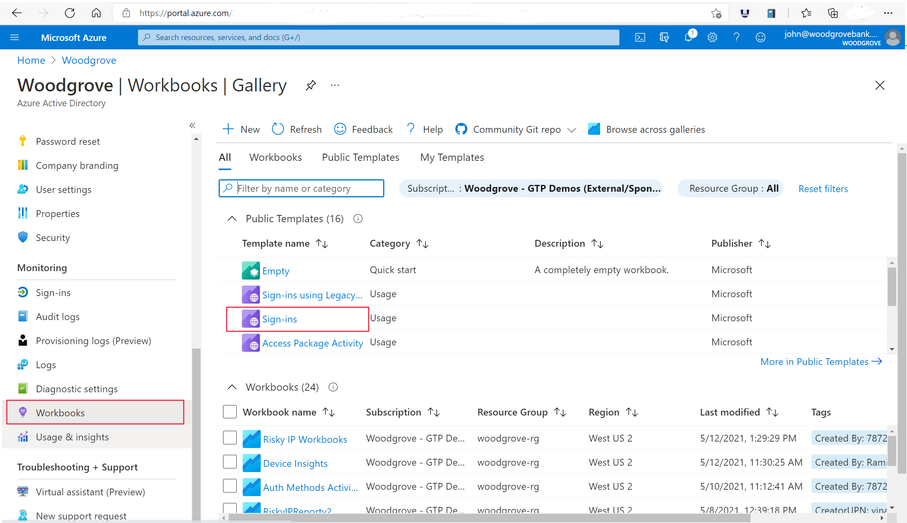<br>

**_Step 4:_** The table at the bottom of the Sign-ins workbook page lists apps that recently used ADAL. Check to ensure the workbook displays no results.<br>
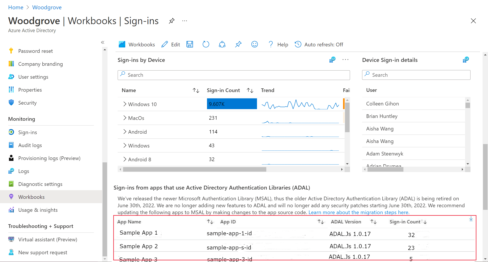
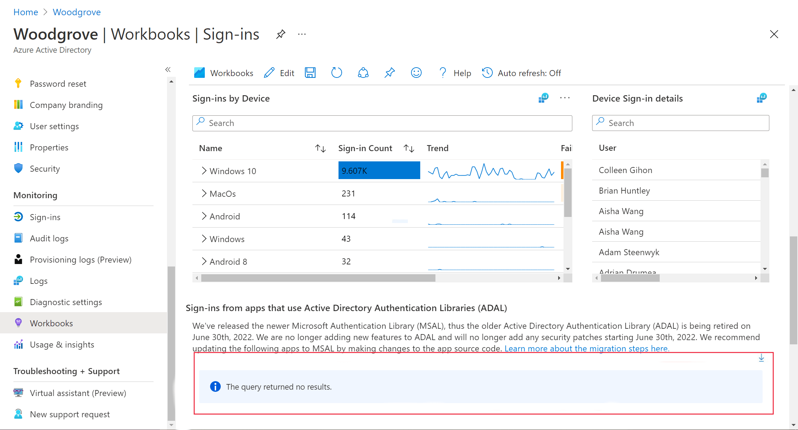

<br><br> 

### 9. Ensure that IAM resources use standard organizational Resource tagging method ###

**Security Control Mapping :** <br>

| Control Number | Control Statement | Security Domain | Default | Associated Runbook | CVSS Severity |
| -------------- | ----------------- | --------------- | ------- | ------------------ | -------------- |
| CS0012261 | Technology hardware and software must be registered and accurately recorded within the enterprise technology repository and/or asset management systems | Asset Management | Not enabled | organizational Runbook | [Low (1.6)](https://www.first.org/cvss/calculator/3.1#CVSS:3.1/AV:P/AC:H/PR:H/UI:N/S:U/C:N/I:N/A:L) |

**What, Why & How?**<br>

This control checks whether IAM resources follows standard organizational resource tagging method to assist in tracking IAM resource instances that process sensitive information. This is important to organize organization's Azure resources and management hierarchy.

Organization should apply tags to the Azure resources, resource groups, and subscriptions to logically organize them by values that make sense for the organization. Each tag consists of a name and a value pair. For example, you can apply the name Environment and the value Production to all the resources in production.

Tagging resources in the cloud is an easy way for teams to provide information related to who owns the resource, what the resource is used for, as well as other important information related to the deployment lifecycle of the resource.

[How to apply Tagging](https://docs.microsoft.com/en-us/azure/azure-resource-manager/management/tag-resources?tabs=json#portal)

<br><br> 

### 10. Ensure AAD diagnostic settings are enabled to capture AD logs ###

**Security Control Mapping :** <br>
| Control Number | Control Statement | Security Domain | Default | Associated Runbook | CVSS Severity  |
| -------------- | ----------------- | --------------- | ------- | ------------------ | -------------- |
| CS0012233 | Information System must create a log and record activities occurring on or originating from the information system. Logs must be made accessible to the enterprise SIEM solution  | Security Information and event management  | Not Enabled | Network Watcher Runbook | [Low (2.7)](https://www.first.org/cvss/calculator/3.1#CVSS:3.1/AV:P/AC:H/PR:H/UI:N/S:U/C:L/I:N/A:L) |

**Why?** <br>

The following logs should be enabled as they are forwarded to Splunk to provide necessary information to create notable alerts for any rule created to allow connection from the internet. Additionally, below is further rationale:<br>
* Audit logs: The audit logs activity report gives you access to the history of every task that's performed in your tenant.<br>
* Sign-in logs: With the sign-in activity report, you can determine who performed the tasks that are reported in the audit logs.<br>
* Provisioning logs: With the provisioning logs, you can monitor which users have been created, updated, and deleted in all your third-party applications.<br>
* Risky users logs (public preview): With the risky users logs, you can monitor changes in user risk level and remediation activity.<br>
* Risk detections logs (public preview): With the risk detections logs, you can monitor user's risk detections and analyze trends in risk activity detected in your organization.<br><br>

**How?** <br>

**_Step 1:_** Navigate to AAD diagnostic settings<br>
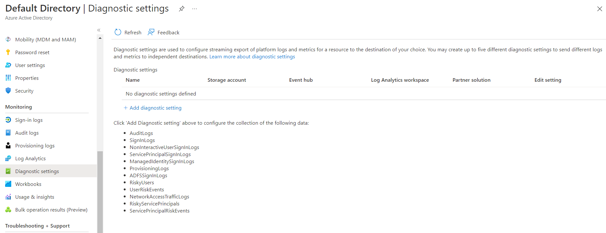

**_Step 2:_** Enable the following log settings:<br>
* AuditLogs<br>
* SignInLogs<br>
* NonInteractiveUserSignInLogs<br>
* ServicePrincipalSignInLogs<br>
* ManagedIdentitySignInLogs<br>
* ProvisioningLogs<br>
* ADFSSignInLogs<br>
* RiskyUsers<br>
* UserRiskEvents<br>
* NetworkAccessTrafficLogs<br>
* RiskyServicePrincipals<br>
* ServicePrincipalRiskEvents<br>

**_Step 3:_** Set log retention date per corporate standard.<br>
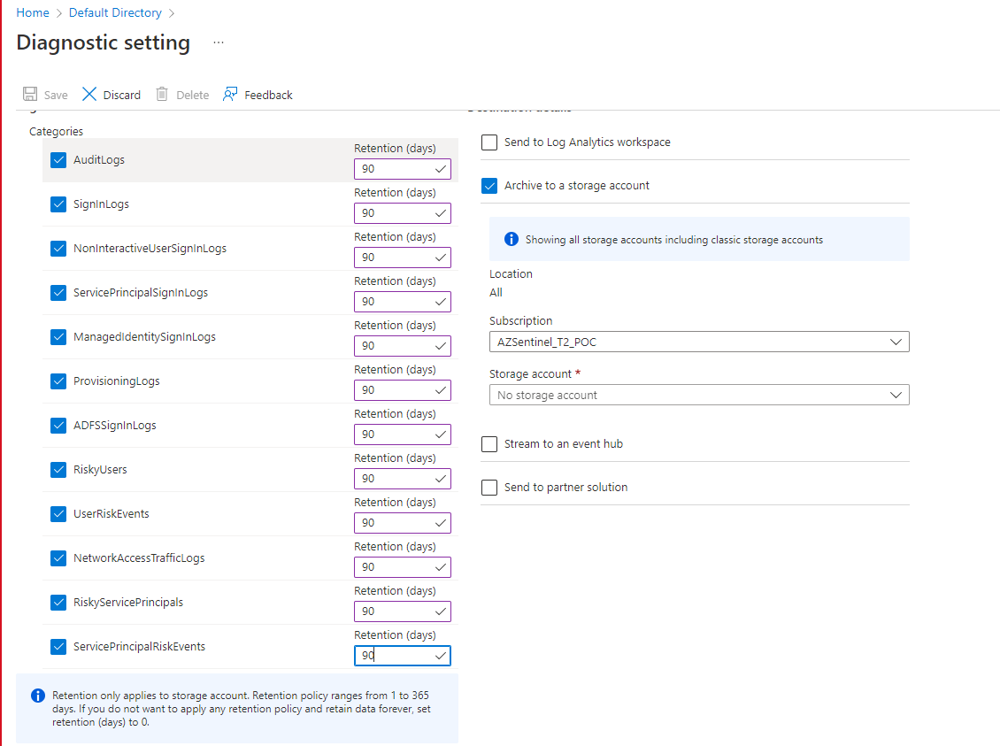<br>

**_Step 4:_** Map logs to proper EventHub<br>

<br><br> 


### 11. Ensure only Enterprise Azure tenant allowed to access to AAD ###

**Security Control Mapping :** <br>

| Control Number | Control Statement | Security Domain | Default | Associated Runbook | CVSS Severity  |
| -------------- | ----------------- | --------------- | ------- | ------------------ | -------------- |
|   CS0012300   | Cloud products and services must be deployed on private subnets and public access must be disabled for these services | Identity and Access Management   | Not enabled | None |  [Medium (5.3)](https://www.first.org/cvss/calculator/3.1#CVSS:3.1/AV:A/AC:H/PR:H/UI:N/S:U/C:H/I:L/A:L)  |

**Why?** <br>

Traditionally, companies restrict domain names or IP addresses when they want to manage access. This approach fails in a world where software as a service (or SaaS) apps are hosted in a public cloud, running on shared domain names like outlook.office.com and login.microsoftonline.com. Blocking these addresses would keep users from accessing Outlook on the web entirely, instead of merely restricting them to approved identities and resources.

The Azure Active Directory (Azure AD) solution to this challenge is a feature called tenant restrictions. With tenant restrictions, organizations can control access to SaaS cloud applications, based on the Azure AD tenant the applications use for single sign-on. For example, Enterprise want to allow access to your organization's Microsoft 365 applications, while preventing access to other organizations' instances of these same applications.


**How?** <br>

**_Step 1:_** Sign in to the Azure Active Directory portal. The Azure Active Directory admin center dashboard appears.<br>
**_Step 2:_** In the left pane, select Azure Active Directory. The Azure Active Directory overview page appears.<br>
**_Step 3:_** On the Overview page, select Tenant restrictions.<br>
*   The admin for the tenant specified as the Restricted-Access-Context tenant can use this report to see sign-ins blocked because of the tenant restrictions policy, including the identity used and the target directory ID. Sign-ins are included if the tenant setting the restriction is either the user tenant or resource tenant for the sign-in.
Refer to the [following documentation](https://docs.microsoft.com/en-us/azure/active-directory/manage-apps/tenant-restrictions) to configure tenant restrictions.
<br><br> 

### 12. Ensure access to Azure AD is granted through the use of secondary accounts ###

**Security Control Mapping :** <br>

| Control Number | Control Statement | Security Domain | Default | Associated Runbook | CVSS Severity |
| -------------- | ----------------- | --------------- | ------- | ------------------ | -------------- |
|  CS0012298	 | Access to change cloud identity access and service control policies is restricted to authorized cloud administrative personnel |  Identity and Access Management | Not enabled | None | [Medium (5.1)](https://www.first.org/cvss/calculator/3.1#CVSS:3.1/AV:A/AC:H/PR:H/UI:N/S:C/C:L/I:L/A:L) |

**Why?** <br>

When a single account is used for normal tasks and admin tasks , then the same account will be associated with all of the Group Policy settings associated with the tasks which include drive mappings, software installation, scripts, etc. that would apply when the account log on to a computer. These are not relevant when you perform an administrative account and it is recommended to have a secondary account to perform all the administrative tasks. Ensure that the secondary account is vaulted using CyberArk.

**How?** <br>

**_Step 1:_** Refer to the following CG documentation of how to add a secondary account to an identity  [placeholder] <br>

**_Step 2:_** Ensure Azure AD identity has a 2a account associated.<br>

**_Step 3:_** Refer to the following CG documentation for ensuring the 2a account is vaulted using CyberArk. [placeholder] <br>
     
<br><br> 

### 13. Ensure break glass account is available to access in case of emergencies and should be monitored for use of break glass account ###

**Security Control Mapping :** <br>

| Control Number | Control Statement | Security Domain | Default | Associated Runbook | CVSS Severity |
| -------------- | ----------------- | --------------- | ------- | ------------------ | -------------- |
|  CS0012298	 | Access to change cloud identity access and service control policies is restricted to authorized cloud administrative personnel |  Identity and Access Management | Not enabled | None | [Medium (6.8)](https://www.first.org/cvss/calculator/3.1#CVSS:3.1/AV:A/AC:H/PR:H/UI:N/S:C/C:H/I:L/A:L) |

**Why?** <br>

An emergency access account for access must be setup to prevent being accidentally locked out of Azure AD when normal administrative accounts cannot be used. Emergency access accounts must be usually highly privileged, and they should not be assigned to specific individuals. Emergency access accounts must be limited to emergency or "break glass" scenarios where normal administrative accounts can't be used. Any login activity from break glass account should be monitored and validated with appropriate approved change request.

**How?** <br>

**To check if there is already break glass account create**<br>
**_Step 1:_** Select Azure Active Directory > Users.<br>

**_Step 2:_** Search for an account named [placeholder for EBG account name]<br>
* To create a break glass account, utilize the [following documentation](https://docs.microsoft.com/en-us/azure/active-directory/roles/security-emergency-access)

**_Step 3:_** Ensure the role is "Global administrator"<br>


**To monitor the use of break glass account**<br>
Obtain Object IDs of the break glass accounts<br>

**_Step 1:_** Sign in to the Azure portal or Azure AD admin center with an account assigned to the User Administrator role.<br>

**_Step 2:_** Select Azure Active Directory > Users.<br>

**_Step 3:_** Search for the break-glass account and select the user’s name.<br>

**_Step 4:_** Copy and save the Object ID attribute so that you can use it later.<br>

**_Step 5:_** Repeat previous steps for second break-glass account.<br>

**_Step 6:_** Select All services", enter "log analytics" in Search and then select Log Analytics workspaces.<br>

**_Step 7:_** Select a workspace.<br>

**_Step 8:_** In your workspace, select Alerts<br>

**_Step 9:_** Search for the break-glass account(s), utilizing the Object ID attribute to ensure the alerts are created.<br>

*   If an alert rule has not been created, utilize the [following documentation](https://docs.microsoft.com/en-us/azure/active-directory/roles/security-emergency-access)

<br><br> 

### 14. Ensure conditional access and Continuous Access Evaluation (CAE) is enabled to provide more granular access control based on user-defined conditions ###

**Security Control Mapping :** <br>

| Control Number | Control Statement | Security Domain | Default | Associated Runbook | CVSS Severity |
| -------------- | ----------------- | --------------- | ------- | ------------------ | -------------- |
|  CS0012298	 | Access to change cloud identity access and service control policies is restricted to authorized cloud administrative personnel |  Identity and Access Management | Not enabled | None | [Medium (5.1)](https://www.first.org/cvss/calculator/3.1#CVSS:3.1/AV:A/AC:H/PR:H/UI:N/S:C/C:L/I:L/A:L) |

**Why?** <br>

Azure Active Directory (Azure AD) Conditional Access must be enabled for providing access based on user-defined conditions like user logins from certain IP ranges will need to use MFA for login.  Conditional Access policies must be allowed to build conditions that manage security controls that can block access, require multifactor authentication, or restrict the user’s session when needed and stay out of the user’s way when not. Also Continuous Access Evaluation (CAE) must be enabled in Azure AD to allow access tokens to be revoked based on critical events and policy evaluation rather than relying on token expiry based on lifetime<sup>15</sup>

**Note:** Continuous Access Evaluation enabled APIs can be used in the applications by following the steps mentioned in 
[15] Continuous Access Evaluation enabled APIs- https://docs.microsoft.com/en-us/azure/active-directory/develop/app-resilience-continuous-access-evaluation

**How?** <br>

**_Step 1:_** Browse to Azure Active Directory > Security > Conditional Access.<br>
**_Step 2:_** Validate that the proper policies are populated and are in the "On" state.<br>
* Recommended policies include:<br>
    * Identities<br>
        * Require multi-factor authentication for admins<br>
        * Securing security info registration<br>
        * Block legacy authentication<br>
        * Require multi-factor authentication for all users<br>
        * Require multi-factor authentication for guest access<br>
        * Require multi-factor authentication for Azure management<br>
        * Require multi-factor authentication for risky sign-in Requires Azure AD Premium P2<br>
        * Require password change for high-risk users Requires Azure AD Premium P2<br>
Refer to the [following documentation](https://docs.microsoft.com/en-us/azure/active-directory/conditional-access/concept-conditional-access-policy-common) for further implementation details.<br>

<br><br> 

### 15. Ensure Azure AD Connector account credential is managed as per Organization policy ###

**Security Control Mapping :** <br>

| Control Number | Control Statement | Security Domain | Default | Associated Runbook | CVSS Severity |
| -------------- | ----------------- | --------------- | ------- | ------------------ | -------------- |
|  CS0012298	 | Access to change cloud identity access and service control policies is restricted to authorized cloud administrative personnel |  Identity and Access Management | Not enabled | None | [Medium (5.1)](https://www.first.org/cvss/calculator/3.1#CVSS:3.1/AV:A/AC:H/PR:H/UI:N/S:C/C:L/I:L/A:L) |

**Why?** <br>

The account is created with a long complex password that does not expire. It is granted a special role Directory Synchronization Accounts that has only permissions to perform directory synchronization tasks. This special built-in role cannot be granted outside of the Azure AD Connect wizard. The Azure portal shows this account with the role User. 

As the password does not expire, Global Administrator account should be used to reset password

[16] Change the Azure AD Connector account password: https://docs.microsoft.com/en-us/azure/active-directory/hybrid/how-to-connect-azureadaccount

**How?** <br>

**_Step 1:_** Refer to the following CG documentation for implementation details of managing AD Connector account credentials within CyberArk. [placeholder] <br>
*   Note: By default, this account is created with a long complex password that does not expire.

<br><br> 

### 16. Ensure app and service principal owners are always defined and maintained for the registered apps in the tenant ###

**Security Control Mapping :** <br>

| Control Number | Control Statement | Security Domain | Default | Associated Runbook | CVSS Severity |
| -------------- | ----------------- | --------------- | ------- | ------------------ | -------------- |
|  CS0012298	 | Access to change cloud identity access and service control policies is restricted to authorized cloud administrative personnel |  Identity and Access Management | Not enabled | None | [Medium (5.1)](https://www.first.org/cvss/calculator/3.1#CVSS:3.1/AV:A/AC:H/PR:H/UI:N/S:C/C:L/I:L/A:L) |

**Why?** <br>

The Application owners and security principal can determine the access policy and permissions for the user/application in the Azure AD tenant which enables core features such as authentication of the user/application during sign-in, and authorization during resource access. App and service principal ownership must be limited to a minimal set of people and must be defined and maintained for the registered apps. A process must be defined to run through the owners list once every few months to ensure owners need access

**How?** <br>

**_Step 1:_** Sign in to your Azure AD organization with an account that is eligible for the Application Administrator role or the Cloud Application Administrator role for the organization.<br>

**_Step 2:_** Select Enterprise applications, and then select the application that you want to add an owner to.<br>

**_Step 3:_** Select Owners, and then select Add to get a list of user accounts that you can choose an owner from.<br>

**_Step 4:_** Search for and select the user account that you want to be an owner of the application.<br>

**_Step 5:_** Click Select to add the user account that you chose as an owner of the application.<br>

**_Step 6:_** Repeat process for all other applications without a defined owner.<br>

<br><br> 

### 17. Ensure the "application permission" is enabled for needed apps and "standard" and "full " permission is available to be selected depending on sensitive information ###

**Security Control Mapping :** <br>
| Control Number | Control Statement | Security Domain | Default | Associated Runbook | CVSS Severity  |
| -------------- | ----------------- | --------------- | ------- | ------------------ | -------------- |
|  CS0012298	 | Access to change cloud identity access and service control policies is restricted to authorized cloud administrative personnel |  Identity and Access Management | Not enabled | None | [Medium (5.3)](https://www.first.org/cvss/calculator/3.1#CVSS:3.1/AV:A/AC:H/PR:H/UI:N/S:U/C:H/I:L/A:L) |

**Why?** <br>

Application permissions are used by apps that run without a signed-in user present like apps that run as background services or daemons. Only an administrator can consent to application permission and the application permissions must not be disabled to achieve common scenarios like automation, microservice. "standard" and "full" access permissions must be created and utilized when working with sensitive data. The sensitive properties must be restricted so that they cannot be accessed using a "standard" access permission, like Resource.Read. A "full" access permission for example Resource.ReadFull, must be implemented that returns all available properties including sensitive information. 

**How?** <br>

**_Step 1:_** Go to your application in the Azure portal - App registrations quickstart experience. <br>

**_Step 2:_** Select an application, or create an app if you haven't already.<br>   

**_Step 3:_** On the application's Overview page, under Manage, select API Permissions > Add a permission.<br>

**_Step 4:_** Select Microsoft Graph from the list of available APIs. Then add the permissions that your app requires.<br>

**_Step 5:_** Select Add Permissions.<br>

**_Step 6:_** Add standard and full permissions, if not already selected.<br>
*   Refer to the [following documentation](https://docs.microsoft.com/en-us/azure/active-directory/develop/v2-permissions-and-consent#using-the-admin-consent-endpoint) for further implementation details surrounding application permissions

<br><br> 

### 18. Ensure the Redirect URIs of your application is updated with latest value and Use AppId URI to identify the application instead of using the appId property ###

**Security Control Mapping :** <br>
| Control Number | Control Statement | Security Domain | Default | Associated Runbook | CVSS Severity  |
| -------------- | ----------------- | --------------- | ------- | ------------------ | -------------- |
|  CS0012298	 | Access to change cloud identity access and service control policies is restricted to authorized cloud administrative personnel |  Identity and Access Management | Not enabled | None | [Low (3.9)](https://www.first.org/cvss/calculator/3.1#CVSS:3.1/AV:A/AC:H/PR:H/UI:N/S:U/C:L/I:L/A:L) |

**Why?** <br>

A lapse in the ownership of one of the redirect URIs can lead to an application compromise. The DNS records must be updated and monitored periodically for changes and wildcard reply URLs or insecure URI schemes such as http, or URN must not be used. Certain applications can expose resources (via WebAPI) and as such need to define an AppId URI that uniquely identifies the resource in a tenant. AppId URI must be set to avoid URI collisions and it must also act as the prefix for the scopes referenced in the API's code with a verified customer owned domain. 

**How?** <br>

**_Step 1:_** Navigate to Azure Active Directory > App registrations.<br>

**_Step 2:_** Navigate to proper application.<br>

**_Step 3:_** In the Manage area, click Authentication.<br>

**_Step 4:_** In the Redirect URIs section, in Type, select Web.<br>

**_Step 5:_** In Redirect URI, enter the latest URI value.<br>
* Note: Use either of the following URI schemes: api or https<br>


| Supported application ID | URI formats Example app ID URIs |
| ------------------------ | ------------------------------- |
|api://`<appId>` |	api://fc4d2d73-d05a-4a9b-85a8-4f2b3a5f38ed|
|api://`<tenantId>`/`<appId>`|	api://a8573488-ff46-450a-b09a-6eca0c6a02dc/fc4d2d73-d05a-4a9b-85a8-4f2b3a5f38ed|
|api://`<tenantId>`/`<string>` |	api://a8573488-ff46-450a-b09a-6eca0c6a02dc/api|
|api://`<string>`/`<appId>`|	api://productapi/fc4d2d73-d05a-4a9b-85a8-4f2b3a5f38ed|
|https://`<tenantInitialDomain>`.onmicrosoft.com/`<string>`|	https://`<cg>`.onmicrosoft.com/productsapi|
|https://`<verifiedCustomDomain>`/`<string>`|	https://`<cg>`.com/productsapi|
|https://`<string>`.`<verifiedCustomDomain>`|	https://product.`<cg>`.com|
|https://`<string>`.`<verifiedCustomDomain>`/`<string>`|	https://product.`<cg>`.com/productsapi|

**_Step 6:_** Click Save.
    
<br><br> 

### 19. Ensure implicit flow is turned off for unused application and use Auth code flow wherever implicit grant flow is required ###

**Security Control Mapping :** <br>
| Control Number | Control Statement | Security Domain | Default | Associated Runbook | CVSS Severity  |
| -------------- | ----------------- | --------------- | ------- | ------------------ | -------------- |
|  CS0012298	 | Access to change cloud identity access and service control policies is restricted to authorized cloud administrative personnel |  Identity and Access Management | Not enabled | None| [Low (3.9)](https://www.first.org/cvss/calculator/3.1#CVSS:3.1/AV:A/AC:H/PR:H/UI:N/S:U/C:L/I:L/A:L) |

**Why?** <br>

The implicit grant flow is no longer a suitable authentication method as microsoft is planning for third party cookies to be removed from browsers. The implicit flow do not work without third party cookies, causing applications to break when they attempt to get a new token. Hence implicit grant flow must be turned off for the applications where is not required and authorization code flow must replace implicit flow in the new applications wherever implicit grant flow is required.Auth code flow must be used to reduce the risk of compromise associated with implicit grant flow misuse. 

**How?** <br>

**Switch your app(s) registration redirect URI(s) from Web platform to Single-page application platform.<br>**
**_Step 1:_** In App registrations, select your unused application, and then Authentication.<br>

**_Step 2:_** In the Web platform tile under Redirect URIs, select the warning banner indicating that you should migrate your URIs.<br>
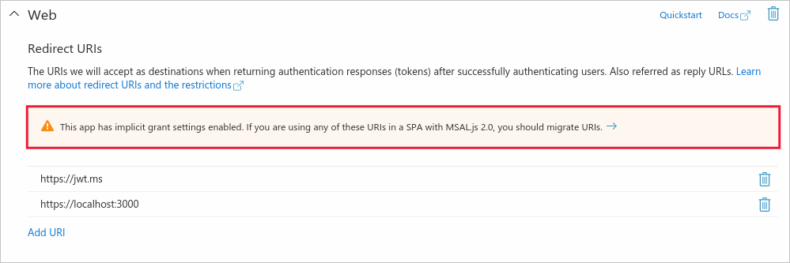<br>

**_Step 3:_** Select only those redirect URIs whose applications will use MSAL.js 2.x, and then select Configure.<br>
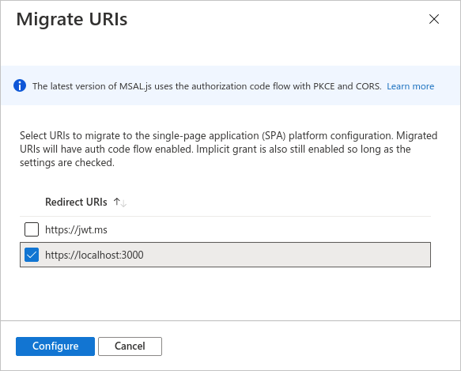<br>

**_Step 4:_** These redirect URIs should now appear in the Single-page application platform tile, showing that CORS support with the authorization code flow and PKCE is enabled for these URIs.
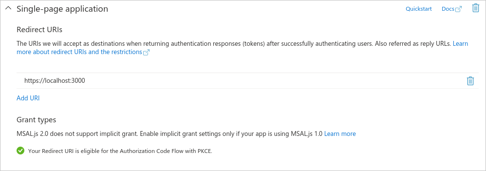<br>

**Update your code from MSAL.js 1.x to 2.x.<br>**
**_Step 5:_** In MSAL 1.x, you created a application instance by initializing a UserAgentApplication as follows:<br>
```javascript
// MSAL 1.x
import * as msal from "msal";

const msalInstance = new msal.UserAgentApplication(config);
```
In MSAL 2.x, initialize instead a PublicClientApplication:<br>
```javascript
// MSAL 2.x
import * as msal from "@azure/msal-browser";

const msalInstance = new msal.PublicClientApplication(config);
```

**Disable the implicit grant in your app registration when all applications sharing the registration have been updated to MSAL.js 2.x and the auth code flow.<br>**
**_Step 6:_** Uncheck implicit grant settings under Authentication menu of the app registration for each unused application.<br>
* Note: When you uncheck the implicit grant settings in the app registration, the implicit flow is disabled for all applications using registration and its client ID.
    
<br><br> 
