# Azure App Service - Security baseline requirement <!-- omit in toc -->

## Baseline security configuration requirement for Azure services  <!-- omit in toc -->

**Generated By: EY Security Team**  
**Service Type: Web**  
**Deployment Phase: Service Discovery**  
**Last updated: 07/12/2022** 

## Table of Contents <!-- omit in toc -->

- [Overview](#overview)
  - [Use Case Examples:](#use-case-examples)
- [Cloud Security Requirements](#cloud-security-requirements)
  - [1. Ensure application level access to app services is granted using Managed Identities](#1-ensure-application-level-access-to-app-services-is-granted-using-managed-identities)
  - [2. Ensure App service secrets are vaulted and rotated according to Organization policy](#2-ensure-app-service-secrets-are-vaulted-and-rotated-according-to-organization-policy)
  - [3. Ensure FTPS and HTTPS are enabled and TLS is set 1.2 to protect the data in transit](#3-ensure-ftps-and-https-are-enabled-and-tls-is-set-12-to-protect-the-data-in-transit)
  - [4. Ensure Cross Origin Resource Sharing (CORS) is enabled](#4-ensure-cross-origin-resource-sharing-cors-is-enabled)
  - [5. Ensure that public access for app services is disabled by implementing Private endpoints in Virtual networks](#5-ensure-that-public-access-for-app-services-is-disabled-by-implementing-private-endpoints-in-virtual-networks)
  - [6. Ensure diagnostic logging are enabled for Azure App service](#6-ensure-diagnostic-logging-are-enabled-for-azure-app-service)
  - [7. Ensure Application Insights is enabled for Azure App service](#7-ensure-application-insights-is-enabled-for-azure-app-service)
  - [8. Ensure that Azure App service is integrated with Malware and Vulnerability Scanner tools](#8-ensure-that-azure-app-service-is-integrated-with-malware-and-vulnerability-scanner-tools)
  - [9. Ensure Only Azure AD users can access the registered applications](#9-ensure-only-azure-ad-users-can-access-the-registered-applications)
  - [10. Ensure App service access restriction is used to control traffic to your app](#10-ensure-app-service-access-restriction-is-used-to-control-traffic-to-your-app)
  - [11. Ensure Remote debugging should be turned off for API Apps](#11-ensure-remote-debugging-should-be-turned-off-for-api-apps)
  - [12. Ensure least privilege access is implemented in App service using Role Based Access control](#12-ensure-least-privilege-access-is-implemented-in-app-service-using-role-based-access-control)
  - [13. Ensure Azure App service uses standard organizational Resource tagging method](#13-ensure-azure-app-service-uses-standard-organizational-resource-tagging-method)
  - [14. Ensure Activity logging is enabled for Azure App service](#14-ensure-activity-logging-is-enabled-for-azure-app-service)

##  Overview 

Azure App Service is used to build and host web apps, mobile back ends, and RESTful APIs in any programming language without managing infrastructure. It offers auto-scaling and high availability, supports both Windows and Linux, and enables automated deployments from GitHub, Azure DevOps, or any Git repo.

| Control Number | Cloud Baseline Security Requirements                                                                         |
| -------------- | ------------------------------------------------------------------------------------------------------------ |
| 1              | Ensure application level access to app services is granted using Managed Identities                          |
| 2              | Ensure App service secrets are vaulted and rotated according to Organization policy                          |
| 3              | Ensure FTPS and HTTPS are enabled and TLS is set 1.2 to protect the data in transit                          |
| 4              | Ensure Cross Origin Resource Sharing (CORS) is enabled                                                       |
| 5              | Ensure that public access for app services is disabled by implementing Private endpoints in Virtual networks |
| 6              | Ensure diagnostic logging are enabled for Azure App service                                                  |
| 7              | Ensure Application Insights is enabled for Azure App service                                                 |
| 8              | Ensure that Azure App service is integrated with Malware and Vulnerability Scanner tools                     |
| 9              | Ensure Only Azure AD users can access the registered applications                                            |
| 10             | Ensure App service access restriction is used to control traffic to your app                                 |
| 11             | Ensure Remote debugging should be turned off for API Apps                                                    |
| 12             | Ensure least privilege access is implemented in App service using Role Based Access control                  |
| 13             | Ensure Azure App service uses standard organizational Resource tagging method                                |
| 14             | Ensure Activity logging is enabled for Azure App service                                                     |

### Use Case Examples:
- Anomaly detector process
- Multi-region web application with Cosmos DB replication
- Automated guided vehicles fleet control
- Securely managed web applications

## Cloud Security Requirements ##

### 1. Ensure application level access to app services is granted using Managed Identities

**Security Control Mapping :**  

| Control Number | Control Statement | Security Domain | Default | Associated Runbook | CVSS Severity  |
| -------------- | ----------------- | --------------- | ------- | ------------------ | -------------- |
|  [CS0012298](place holder)       | Access to change cloud identity access and service control policies is restricted to authorized cloud administrative personnel |Identity & Access Management | Not enabled | None | [Medium (5.1)](https://www.first.org/cvss/calculator/3.1#CVSS:3.1/AV:A/AC:H/PR:H/UI:N/S:C/C:L/I:L/A:L) |

**Why?**  

Managed identity enables Azure resources to authenticate to cloud services (e.g. Azure Key Vault) without storing credentials in code. Once enabled, all necessary permissions can be granted via Azure role-based-access-control. 
In system assigned managed identity, the lifecycle of this type of managed identity is tied to the lifecycle of this resource. Additionally, each resource (e.g. Virtual Machine) can only have one system assigned managed identity. 
In User assigned managed identity, managed identities are created as standalone Azure resources, and have their own lifecycle. A single resource (e.g. Virtual Machine) can utilize multiple user assigned managed identities. A single user assigned managed identity can be shared across multiple resources.

**How?** 

**_Step 1:_** Navigate to existing app service and click on Identity under settings 
**_Step 2:_** Goto System assigned and change the status to 'On' and click on Save  
 
**_Step 3:_** Click 'yes' in the confirmation popup  
 

  

### 2. Ensure App service secrets are vaulted and rotated according to Organization policy

**Security Control Mapping :**   

| Control Number | Control Statement | Security Domain | Default | Associated Runbook | CVSS Severity  |
| -------------- | ----------------- | --------------- | ------- | ------------------ | -------------- |
|  CS0012298	 | Access to change cloud identity access and service control policies is restricted to authorized cloud administrative personnel |  Identity & Access Management | Not enabled | None | [Medium (5.1)](https://www.first.org/cvss/calculator/3.1#CVSS:3.1/AV:A/AC:H/PR:H/UI:N/S:C/C:L/I:L/A:L) |

**Why?**  

Secrets without an expiration date has a security exposure of having an unmonitored credential that could go undetected and potentially be misused by a malicious actor. Secrets must be set an expiration date and must also be rotated after a configured time as per organization password change policy. Rotating the secrets must enforce to update the secrets both in the key vault as well as in the application instance

**How?** 

**_Step 1:_** Navigate to your new key vault in the Azure portal. Once navigated to the key vault page, On the Key Vault settings pages, select Secrets. And Click on Generate/Import. 
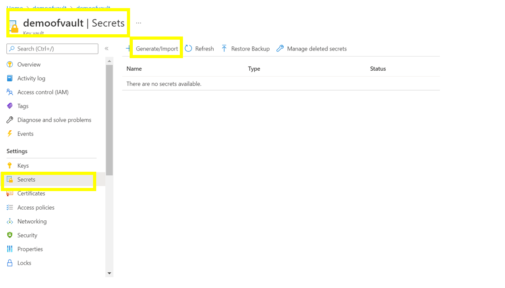 

**_Step 2:_** Step 2: On the Create a secret screen choose the required values , select Enabled to ‘yes’ and click on the `create` button. 
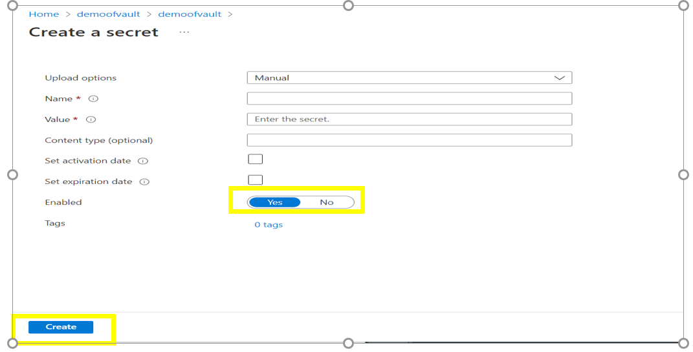  

**_Step 3:_** Navigate to keyvault, add am user to the role "Key Vault Administrator (Preview)" via the Access Control (IAM) to manage secrets. 
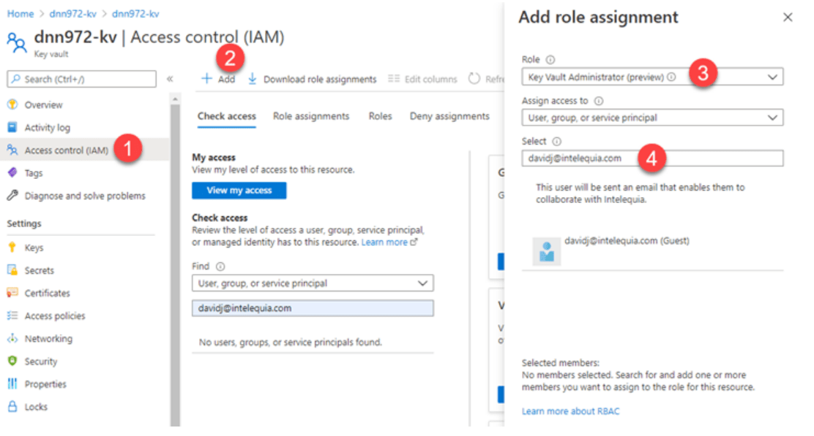

  

### 3. Ensure FTPS and HTTPS are enabled and TLS is set 1.2 to protect the data in transit

**Security Control Mapping :**   
| Control Number | Control Statement | Security Domain | Default | Associated Runbook | CVSS Severity  |
| -------------- | ----------------- | --------------- | ------- | ------------------ | -------------- |
| CS0012261 | Cloud based data in transit must be encrypted with enterprise approved algorithm | Data Protection | not Enabled | None | [Medium (5.3)](https://www.first.org/cvss/calculator/3.1#CVSS:3.1/AV:A/AC:H/PR:H/UI:N/S:U/C:H/I:L/A:L) |

**Why?**  

To secure the app against all unencrypted (HTTP) connections, App Service must enforce only HTTPS communication so that Unsecured requests are turned away before it reaches the application code. 
TLS 1.0 is no longer considered secure by industry standards, such as PCI DSS. App Service must disable outdated protocols by selecting TLS 1.2.
Similarly FTPS should be used instead of FTP because FTP relies on clear-text usernames and passwords for authentication and does not use encryption. 

**How?** 

**_Step 1:_** Go to the App service and  select Configuration then General settings from the left navigation. 
**_Step 2:_** To enable FTPS only, select FTPS Only in FTP state. If using FTPS Only, then must enforce TLS 1.2 or higher by navigating to the TLS/SSL settings blade in the web app. TLS 1.0 and 1.1 are not supported with FTPS Only. 

**_Step 3:_** For HTTPS, go to the App Service -> TLS/SSL settings and click 'HTTPS Only' as ON and set the minimum tls version to 1.2  

  

### 4. Ensure Cross Origin Resource Sharing (CORS) is enabled

**Security Control Mapping :**   
| Control Number | Control Statement | Security Domain | Default | Associated Runbook | CVSS Severity  |
| -------------- | ----------------- | --------------- | ------- | ------------------ | -------------- |
|  CS0012298	 | Access to change cloud identity access and service control policies is restricted to authorized cloud administrative personnel |  Identity & Access Management | Not enabled | None | [Medium (5.1)](https://www.first.org/cvss/calculator/3.1#CVSS:3.1/AV:A/AC:H/PR:H/UI:N/S:C/C:L/I:L/A:L) |

**Why?**  
Cross-Origin Resource Sharing (CORS) is used to allows the JavaScript code running in a browser on an external host to interact with the app service backend. The origins that should be allowed must be specified to make the cross-origin calls (for example: http://example.com:12345). 'Enable Access-Control-Allow-Credentials' is enabled to validate the cookies or authentication tokens as mentioned in the ACCESS-CONTROL-ALLOW-CREDENTIALS header on the message response

**Reference**
https://developer.mozilla.org/en-US/docs/Web/HTTP/Headers/Access-Control-Allow-Credentials

**How?** 

**_Step 1:_** Go to Azure portal and open the App service. 

**_Step 2:_** In the navigation pane select CORS under API. 

**_Step 3:_** Check the 'Enable Access-Control-Allow-Credential' option and fill the allowed origins and select save. 
  
**Note** Do not use * in `Allowed origins`

  

### 5. Ensure that public access for app services is disabled by implementing Private endpoints in Virtual networks

**Security Control Mapping :**  
| Control Number | Control Statement | Security Domain | Default | Associated Runbook | CVSS Severity  |
| -------------- | ----------------- | --------------- | ------- | ------------------ | -------------- |
| [CS0012300](place holder) | Cloud products and services must be deployed on private subnets and public access must be disabled for these services | Network and communication Security | Not enabled |Private Endpoint Runbook | [High (7.2)](https://www.first.org/cvss/calculator/3.1#CVSS:3.1/AV:N/AC:H/PR:H/UI:N/S:C/C:H/I:L/A:L) |

**What & Why?**   

By default, your app is open to the internet and cannot reach into a virtual network. Private endpoint must be used to provide an endpoint with Private IP which can be associated with virtual network with in tenant, other tenant or from On premise.  A FQDN record will be created in Azure DNS to enable other tenants VNets to be associated with Azure Key vault.  This ensures that all workload data is being accessed securely over Azure network backbone and Azure App service is not exposed to internet. 

**How?** 

**_Step 1:_** In the left-hand menu, select All Resources then go to the name you chose during web app creation. 
**_Step 2:_** In the web app overview, select Settings and then select Networking.In Networking, select Private endpoints. Select + Add in the Private Endpoint connections page. 
  
**_Step 3:_** Select the private dns option as yes in the Add Private Endpoint page and select ok. 

**_Step 4:_** When creating an app service , navigate to the Networking tab, enable network injection to on. 
**_Step 5:_** Select Enable Private endpoint to 'On' and Select 'Azure Private Dns Zone' as the DNS   

  

### 6. Ensure diagnostic logging are enabled for Azure App service 

**Security Control Mapping :**  
| Control Number | Control Statement | Security Domain | Default | Associated Runbook | CVSS Severity  |
| -------------- | ----------------- | --------------- | ------- | ------------------ | -------------- |
| CS0012233 | Information System must create a log and record activities occurring on or originating from the information system. Logs must be made accessible to the enterprise SIEM solution  | Security Information and event management  | Not Enabled | None | [Low (2.7)](https://www.first.org/cvss/calculator/3.1#CVSS:3.1/AV:P/AC:H/PR:H/UI:N/S:U/C:L/I:N/A:L) |

**Why?**  
  
The event log contains information about the api objects which include AppServiceHTTPLogs,AppServiceConsoleLogs,AppServiceAppLogs,AppServiceAuditLogs,AppServiceIPSecAuditLogs and AppServicePlatformLogs. These logs when forwarded to Splunk provide necessary information to create notable alerts for any rule created to allow connection from internet  

**How?**  

**_Step 1:_** on Diagnostic Settings page click on 'Add diagnostic setting' . 
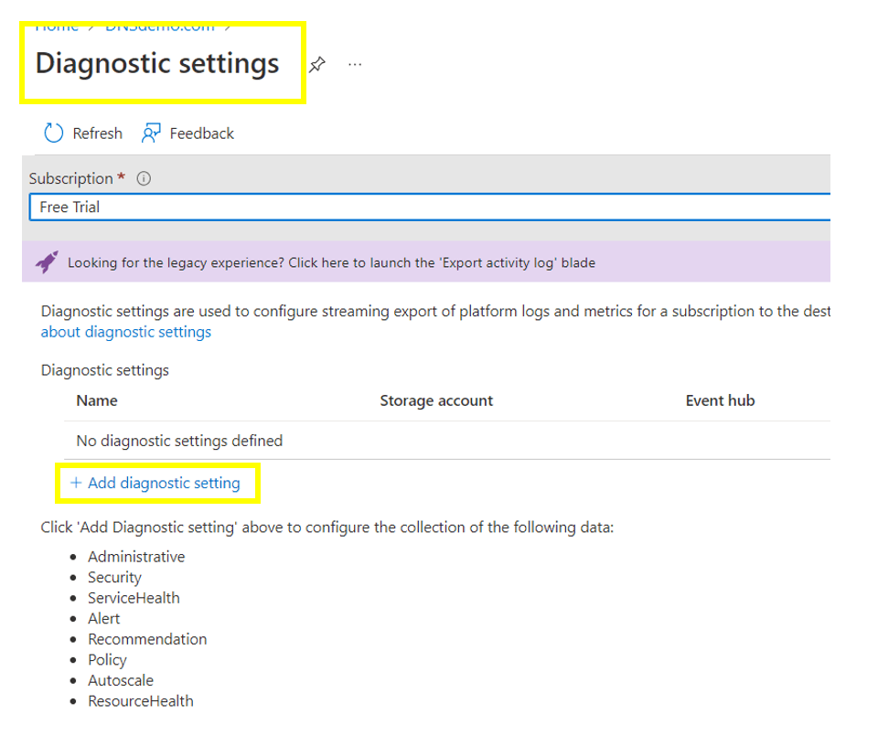
**_Step 3:_** Select the AppServiceHTTPLogs,AppServiceConsoleLogs,AppServiceAppLogs,AppServiceAuditLogs,AppServiceIPSecAuditLogs and AppServicePlatformLogs checkboxes and Select Destination details to be 'Stream to an Eventhub'.
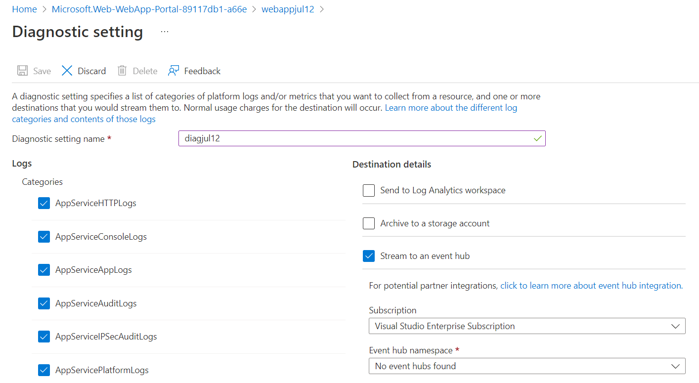

   

### 7. Ensure Application Insights is enabled for Azure App service 

**Security Control Mapping :**  
| Control Number | Control Statement | Security Domain | Default | Associated Runbook | CVSS Severity  |
| -------------- | ----------------- | --------------- | ------- | ------------------ | -------------- |
| CS0012233 | Information System must create a log and record activities occurring on or originating from the information system. Logs must be made accessible to the enterprise SIEM solution  | Security Information and event management  | Not Enabled | None | [Low (2.7)](https://www.first.org/cvss/calculator/3.1#CVSS:3.1/AV:P/AC:H/PR:H/UI:N/S:U/C:L/I:N/A:L) |

**Why?**  
  
Application Insights is used to find out easily  the most useful features, the most common issues, and to work out why a feature does or doesn’t work.It also provides the ability to systematically assess each feature of the app, incorporating analytics into development cycle. Having a complete 360° views of your applications’ availability, performance and usage, which can enable fast & powerful insights, helps to plan new improvements and prioritize the backlog  

**How?**  

**_Step 1:_** In the Monitoring tab, select the 'Enable Application Insights' as 'on' and click on 'Review+Create'.
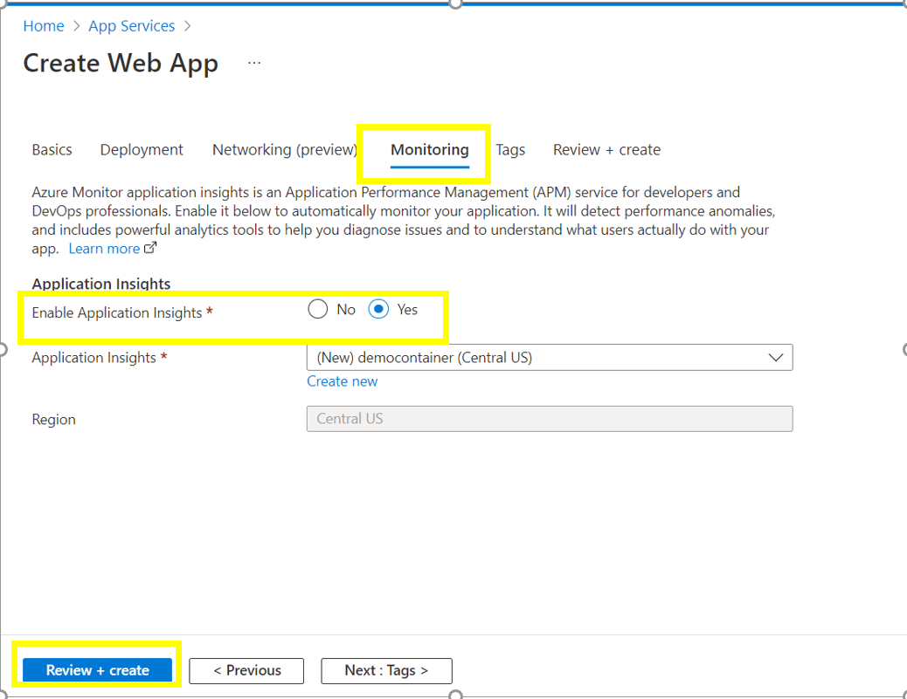
   

### 8. Ensure that Azure App service is integrated with Malware and Vulnerability Scanner tools

**Security Control Mapping :** 

| Control Number | Control Statement | Security Domain | Default | Associated Runbook | CVSS Severity  |
| -------------- | ----------------- | --------------- | ------- | ------------------ | -------------- |
|  CS0012268     | Vulnerability Assessments must be performed based on risk and findings must be addressed in accordance with Enterprise SLA's | Vulnerability Management | Not enabled | None | [Medium (5.0)](https://www.first.org/cvss/calculator/3.1#CVSS:3.1/AV:L/AC:H/PR:H/UI:N/S:C/C:L/I:L/A:L) |

**Why?** 

Organization Anti malware and vulnerability tools are the required security intelligence that detects unusual and potentially harmful attempts to access or exploit apps. It uses advanced threat detection capabilities and Microsoft Threat Intelligence data to provide contextual security alerts. Those alerts also include steps to mitigate the detected threats and prevent future attacks. Microsoft Defender for Container must be enabled at either the subscription level (recommended) or the resource level to analyze ,detect and remediate the threats.

**How?**  

**_Step 1:_**  Navigate to 'Defender for cloud' , In the side menu bar select 'Environment settings' and click on the subscription under azure.
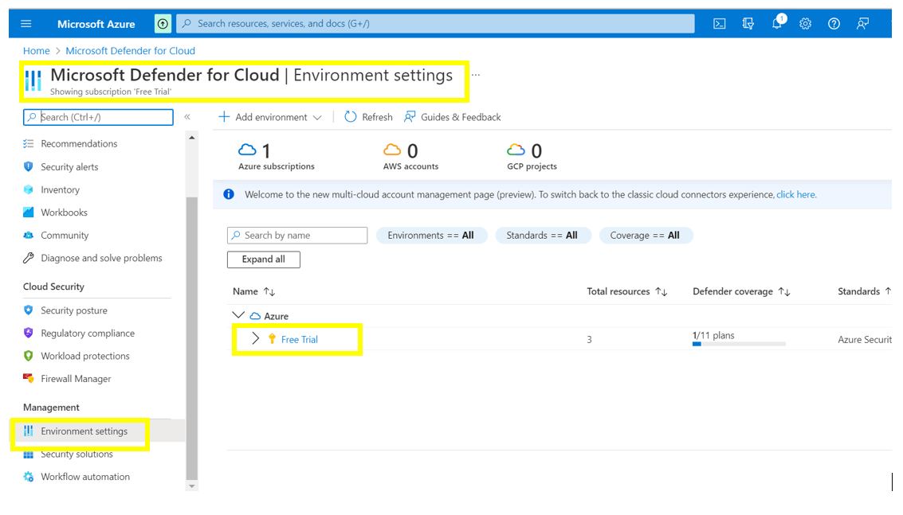
**_Step 2:_** In the side menu bar select 'settings', navigate to 'Defender plans' and change the settings to 'on' for the 'App service'.
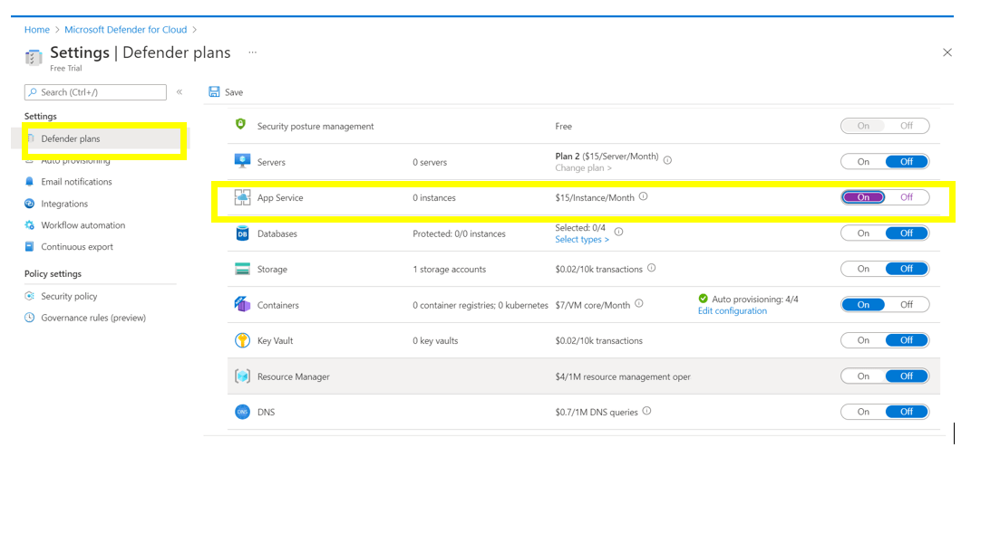
**_Step 3:_** Click on the 'Save' button to update the settings.
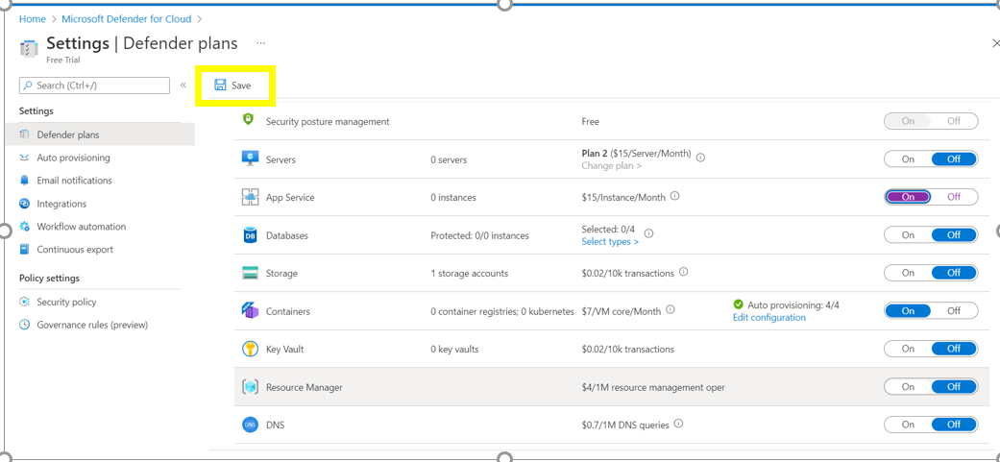

   

### 9. Ensure Only Azure AD users can access the registered applications

**Security Control Mapping :**  

| Control Number | Control Statement | Security Domain | Default | Associated Runbook | CVSS Severity  |
| -------------- | ----------------- | --------------- | ------- | ------------------ | -------------- |
| CS0012300 | Cloud products and services must be deployed on private subnets and public access must be disabled for these services | Network and communication Security | Not enabled | Azure Active Directory Runbook | [Medium (5.5)](https://www.first.org/cvss/calculator/3.1#CVSS:3.1/AV:N/AC:H/PR:H/UI:N/S:C/C:L/I:L/A:L)  |

**Why?** 

If the users credentials are compromised then the resources and services permitted to the users are compromised. Access to the resources must be restricted to users registered with Azure AD to  protect against credential compromise

**How?**  

**_Step 1:_**  In the side menu bar of the 'App service' window , Navigate to 'Authentication' under 'Settings' ,and click on 'Add identity providers'.
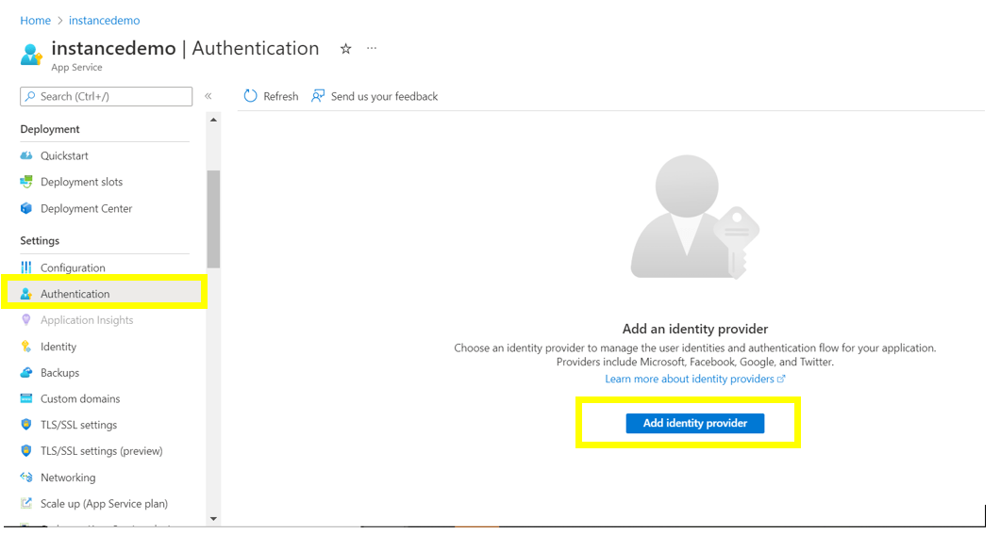
**_Step 2:_** On the Basics tab, select the required AD only under 'Supported account type'.
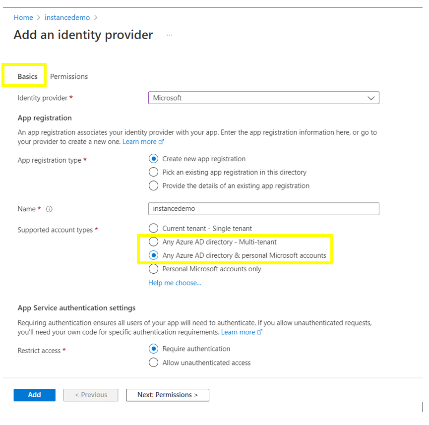
**_Step 3:_** Click on the 'Add' button.
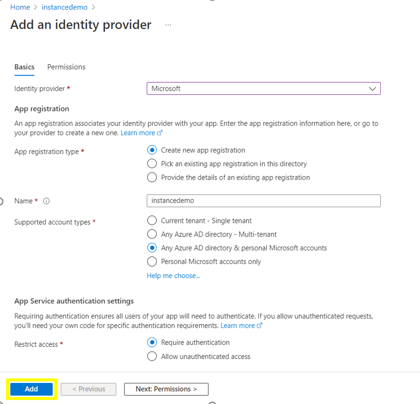

   

### 10. Ensure App service access restriction is used to control traffic to your app 

**Security Control Mapping :**  
| Control Number | Control Statement | Security Domain | Default | Associated Runbook | CVSS Severity  |
| -------------- | ----------------- | --------------- | ------- | ------------------ | -------------- |
| [CS0012300](place holder) | Cloud products and services must be deployed on private subnets and public access must be disabled for these services | Network and communication Security | Not enabled | None | [High (7.2)](https://www.first.org/cvss/calculator/3.1#CVSS:3.1/AV:N/AC:H/PR:H/UI:N/S:C/C:H/I:L/A:L) |

**Why?** 

By setting up access restrictions, a priority-ordered allow/deny list can be defined that controls network access to your app. The list can include IP addresses or Azure Virtual Network subnets. When there are one or more entries, an implicit deny all exists at the end of the list.The access restriction capability works with all Azure App Service-hosted workloads. The workloads can include web apps, API apps, Linux apps, Linux custom containers and Functions.

**How?**  

**_Step 1:_**  In the side menu bar of the 'App service' window , Navigate to 'Networking' under 'Settings' ,and under Access Restrictions, select Configure Access Restrictions.
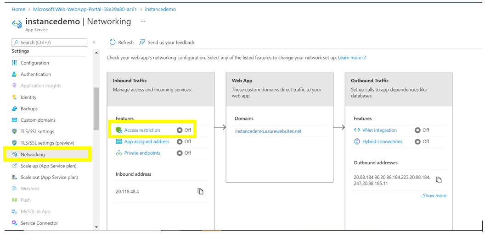
**_Step 2:_** On the Access Restrictions page, review the list of access restriction rules that are defined for your app.
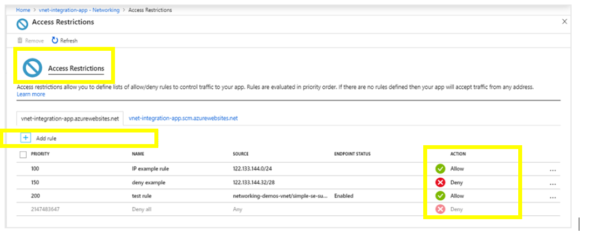

### 11. Ensure Remote debugging should be turned off for API Apps 

**Security Control Mapping :**  
| Control Number | Control Statement | Security Domain | Default | Associated Runbook | CVSS Severity  |
| -------------- | ----------------- | --------------- | ------- | ------------------ | -------------- |
| CS0012133 | Information systems are hardened and configured to align with enterprise requirements | Configuration Management | Not enabled | None | [Medium (5.0)](https://www.first.org/cvss/calculator/3.1#CVSS:3.1/AV:L/AC:H/PR:H/UI:N/S:C/C:L/I:L/A:L)|

**Why?** 

Remote debugging requires inbound ports to be opened on API apps which allows an attacker access to the applications. Remote debugging must be turned off

**How?**  

**_Step 1:_**  In the side menu bar of the 'App service' window , Navigate to 'Configurations' under 'Settings' ,and confirm the value is 'Off' for 'Remote debugging' under 'Debugging'.
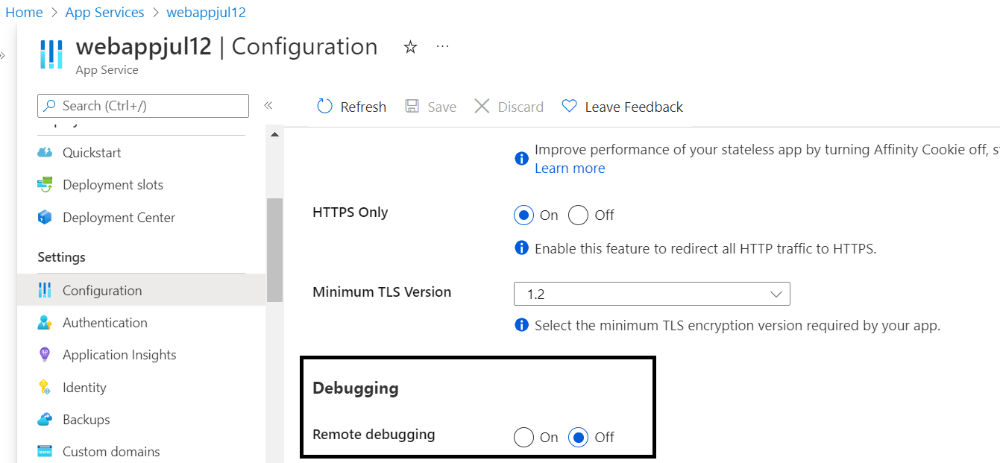

   

### 12. Ensure least privilege access is implemented in App service using Role Based Access control 

[[Place Holder ]
        
**Following are the suggested RBAC roles for Azure Event Hubs**  
| Function | Description | Role | 
| -------------- | ----------------- | --------------- | 
|  App service Contributor | Allows for creating managed application resources.| [Managed Application Contributor Role](https://github.com/MicrosoftDocs/azure-docs/blob/main/articles/role-based-access-control/built-in-roles.md#managed-application-contributor-role) |
|  App service Operator| Lets you read and perform actions on Managed Application resources | [Managed Application Operator Role](https://github.com/MicrosoftDocs/azure-docs/blob/main/articles/role-based-access-control/built-in-roles.md#managed-application-operator-role) |
|  App service Reader | 	Lets you read resources in a managed app and request JIT access. | [Managed Application Reader Role ](https://github.com/MicrosoftDocs/azure-docs/blob/main/articles/role-based-access-control/built-in-roles.md#managed-applications-reader) |

  

### 13. Ensure Azure App service uses standard organizational Resource tagging method

**Security Control Mapping :**  
| Control Number | Control Statement | Security Domain | Default | Associated Runbook | CVSS Severity  |
| -------------- | ----------------- | --------------- | ------- | ------------------ | -------------- |
| CS0012261  | Technology hardware and software must be registered and accurately recorded within the enterprise technology repository and/or asset management systems | Asset Management  | Not enabled | organizational Runbook | [Low (1.6)](https://www.first.org/cvss/calculator/3.1#CVSS:3.1/AV:P/AC:H/PR:H/UI:N/S:U/C:N/I:N/A:L) |

**Why, What and How ?** 

Client Rationale and Justification 
[Placeholder link]

### 14. Ensure Activity logging is enabled for Azure App service

**Security Control Mapping :**  
| Control Number | Control Statement | Security Domain | Default | Associated Runbook | CVSS Severity  |
| -------------- | ----------------- | --------------- | ------- | ------------------ | -------------- |
| CS0012233 | Information System must create a log and record activities occurring on or originating from the information system. Logs must be made accessible to the enterprise SIEM solution  | Security Information and event management   | Enabled but not forwarded to Splunk | None | [Low (2.7)](https://www.first.org/cvss/calculator/3.1#CVSS:3.1/AV:P/AC:H/PR:H/UI:N/S:U/C:L/I:N/A:L) |

**Why, What and How ?** 

Client rationale and Justification 
[Placeholder link]

   
