# Azure Automation - Security baseline requirement <!-- omit in toc -->
## Baseline security configuration requirement for Azure services  <!-- omit in toc -->

**Generated By: EY Security Team**  
**Service Type: Management and Governance**  
**Deployment Phase: Service Discovery**  
**Last updated: 06/28/2022** 

## Table of Contents <!-- omit in toc -->

- [Overview](#overview)
  - [Use Case Examples:](#use-case-examples)
- [Cloud Security Requirements](#cloud-security-requirements)
  - [1. Ensure Azure Private Link is used to securely connect Hybrid runbook workers to Azure Automation](#1-ensure-azure-private-link-is-used-to-securely-connect-hybrid-runbook-workers-to-azure-automation)
  - [2. Ensure Azure Automation Account implements Role Based Access Control](#2-ensure-azure-automation-account-implements-role-based-access-control)
  - [3. Ensure access to Azure Automation account is granted only using Managed Identities](#3-ensure-access-to-azure-automation-account-is-granted-only-using-managed-identities)
  - [4. Ensure Secrets, certificates and keys in Automation Accounts are vaulted and integrated with Azure Key Vaults](#4-ensure-secrets-certificates-and-keys-in-automation-accounts-are-vaulted-and-integrated-with-azure-key-vaults)
  - [5. Ensure to delete any unused Run As accounts to minimize your exposed attack surface](#5-ensure-to-delete-any-unused-run-as-accounts-to-minimize-your-exposed-attack-surface)
  - [6. Ensure Diagnostic logging is enabled for Azure event hubs](#6-ensure-diagnostic-logging-is-enabled-for-azure-event-hubs)
  - [7. Ensure Azure Automation Account uses standard organizational Resource tagging method](#7-ensure-azure-automation-account-uses-standard-organizational-resource-tagging-method)
  - [8. Ensure Activity logging is enabled for Azure Automation Account](#8-ensure-activity-logging-is-enabled-for-azure-automation-account)
  - [9. Ensure Local authentications are disabled for Azure Automation Accounts](#9-ensure-local-authentications-are-disabled-for-azure-automation-accounts)
  - [10. Ensure administrative tasks are performed only in admin-e workstations](#10-ensure-administrative-tasks-are-performed-only-in-admin-e-workstations)

## Overview

Azure Automation delivers a cloud-based automation, operating system updates, and configuration service that supports consistent management across your Azure and non-Azure environments. It includes process automation, configuration management, update management, shared capabilities, and heterogeneous features.

| Control Number | Cloud Baseline Security Requirements                                                                          |
| -------------- | ------------------------------------------------------------------------------------------------------------- |
| 1              | Ensure Azure Private Link is used to securely connect Hybrid runbook workers to Azure Automation              |
| 2              | Ensure Azure Automation Account implements Role Based Access Control                                          |
| 3              | Ensure access to Azure Automation account is granted only using Managed Identities                            |
| 4              | Ensure Secrets, certificates and keys in Automation Accounts are vaulted and integrated with Azure Key Vaults |
| 5              | Ensure to delete any unused Run As accounts to minimize your exposed attack surface                           |
| 6              | Ensure Diagnostic logging is enabled for Azure event hubs                                                     |
| 7              | Ensure Azure Automation Account uses standard organizational Resource tagging method                          |
| 8              | Ensure Activity logging is enabled for Azure Automation Account                                               |
| 9              | Ensure Local authentications are disabled for Azure Automation Accounts                                       |
| 10             | Ensure administrative tasks are performed only in admin-e workstations                                        |

### Use Case Examples:

- Configuring applications and web services.
- Enforcing compliance and security controls.
- Configure and enforce other operating system controls.
- Manage configurations for Azure Arc-enabled servers

## Cloud Security Requirements 

### 1. Ensure Azure Private Link is used to securely connect Hybrid runbook workers to Azure Automation

**Security Control Mapping :**  

| Control Number | Control Statement | Security Domain | Default | Associated Runbook | CVSS Severity  |
| -------------- | ----------------- | --------------- | ------- | ------------------ | -------------- |
| [CS0012300](place holder) | Cloud products and services must be deployed on private subnets and public access must be disabled for these services | Private Endpoint Runbook| Not enabled | Private Endpoint Runbook| [High (7.2)](https://www.first.org/cvss/calculator/3.1#CVSS:3.1/AV:N/AC:H/PR:H/UI:N/S:C/C:H/I:L/A:L) |

**Why?**  

Azure Private Endpoint is a network interface that helps to an Azure Automation service privately and securely using the Azure Private Link. Private Endpoint with a private IP address from Virtual Network (VNet) must be used to effectively bring the Automation service into your VNet.

**How?**  

**_Step 1:_** Navigate to the Azure portal and start creating an Automation Accounts. 
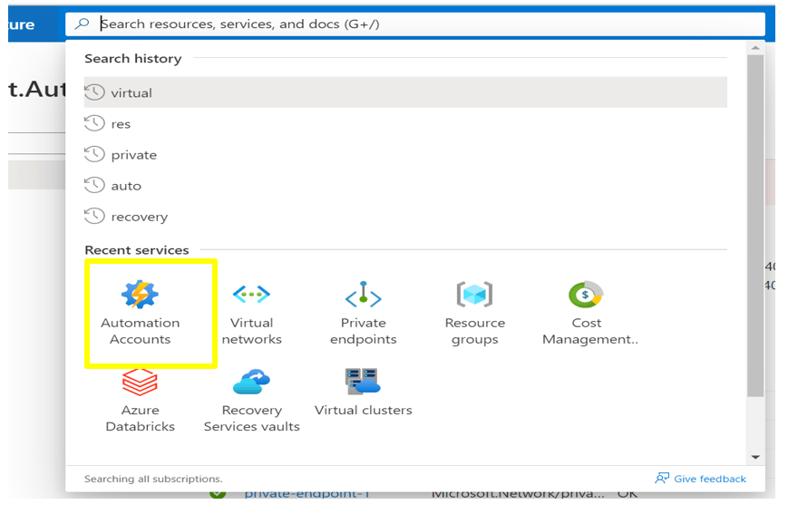  

**_Step 2:_** In the networking tab, select the connectivity configuration as 'private access'. Click `create a private endpoint`and fill the details. 
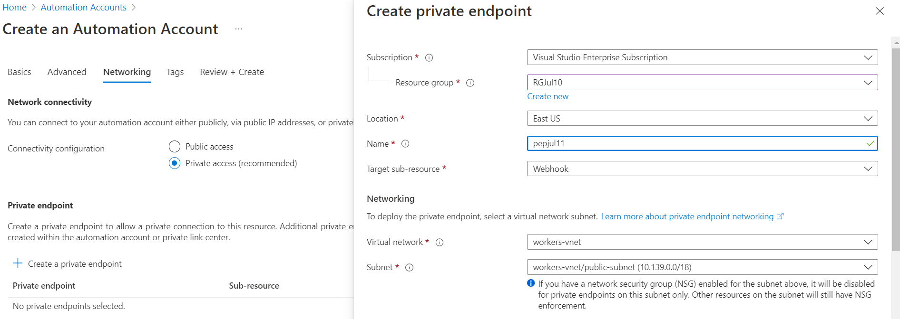 

**_Step 3:_** Scroll down and Select 'Integrate with Private DNS Zone' as 'Yes' and click `ok`   
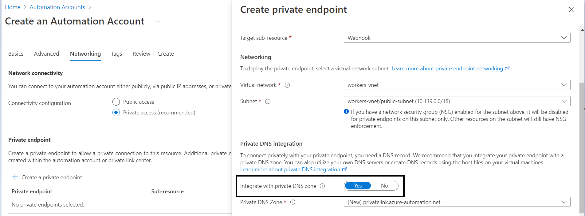 

**_Step 4:_** Click the  `Review + Create`  to create the Automation account linked with Private endpoint  

   

### 2. Ensure Azure Automation Account implements Role Based Access Control

**Security Control Mapping :**  
| Control Number | Control Statement | Security Domain | Default | Associated Runbook | CVSS Severity  |
| -------------- | ----------------- | --------------- | ------- | ------------------ | -------------- |
|  [CS0012298](place holder) 	 | Access to change cloud identity access and service control policies is restricted to authorized cloud administrative personnel |  Identity & Access Management | Not enabled | Azure AD Runbook  | [Medium (5.1)](https://www.first.org/cvss/calculator/3.1#CVSS:3.1/AV:A/AC:H/PR:H/UI:N/S:C/C:L/I:L/A:L) |

[Place Holder ]

**Following are the suggested RBAC roles for Azure Service Endpoints**  

| Function | Description | Role | 
| -------------- | ----------------- | --------------- | 
|  Automation Contributor	| Manage azure automation resources and other resources using azure automation. | [Automation Contributor](https://github.com/MicrosoftDocs/azure-docs/blob/main/articles/role-based-access-control/built-in-roles.md#automation-contributor) |
|  Automation Job Operator	| Create and Manage Jobs using Automation Runbooks | [Automation Job Operator](https://github.com/MicrosoftDocs/azure-docs/blob/main/articles/role-based-access-control/built-in-roles.md#automation-job-operator) |
|  Automation Operator	| Automation Operators are able to start, stop, suspend, and resume jobs  | [Automation Operator](https://github.com/MicrosoftDocs/azure-docs/blob/main/articles/role-based-access-control/built-in-roles.md#automation-operator) |
|  Automation Runbook Operator	|Read Runbook properties - to be able to create Jobs of the runbook. | [Automation Runbook Operator](https://github.com/MicrosoftDocs/azure-docs/blob/main/articles/role-based-access-control/built-in-roles.md#automation-runbook-operator) |
|  Run As Administrator 	|	Grants full access to manage all resources, but does not allow you to assign roles in Azure RBAC  | [contributor](https://github.com/MicrosoftDocs/azure-docs/blob/main/articles/role-based-access-control/built-in-roles.md#contributor) |

**Note**  Role based access must be configured at a runbook level if the user doesn't require access to all the runbooks in the Automation account.
As Run As account has contributor role, time based access using PIM should be used to grant access to group.
  

### 3. Ensure access to Azure Automation account is granted only using Managed Identities 

**Security Control Mapping :**  

| Control Number | Control Statement | Security Domain | Default | Associated Runbook | CVSS Severity  |
| -------------- | ----------------- | --------------- | ------- | ------------------ | -------------- |
|  CS0012298       | Access to change cloud identity access and service control policies is restricted to authorized cloud administrative personnel |Identity & Access Management | Not enabled | None | [Low (3.0)](https://www.first.org/cvss/calculator/3.1#CVSS:3.1/AV:L/AC:H/PR:H/UI:N/S:U/C:L/I:L/A:N) |

**Why?**  

Managed identity for azure automation enables Azure resources to authenticate to cloud services without storing credentials in code. Once enabled, all necessary permissions can be granted via Azure role-based-access-control. 
In system assigned managed identity, the lifecycle of this type of managed identity is tied to the lifecycle of this resource. Additionally, each resource (e.g. Virtual Machine) can only have one system assigned managed identity. 
In User assigned managed identity, managed identities are created as standalone Azure resources, and have their own lifecycle. A single resource (e.g. Virtual Machine) can utilize multiple user assigned managed identities. Similarly, a single user assigned managed identity can be shared across multiple resources.

**How?**  
**_Step 1:_** Search for the existing Automation Account

**_Step 2:_** In the side menu search Identity and select.

**_Step 3:_** In the Identity set it on. 
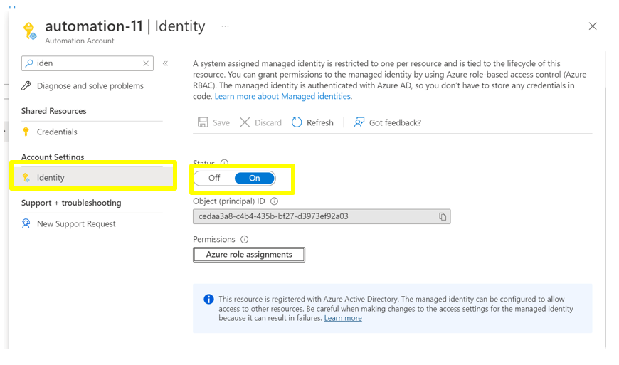 

   

### 4. Ensure Secrets, certificates and keys in Automation Accounts are vaulted and integrated with Azure Key Vaults

**Security Control Mapping :**  

| Control Number | Control Statement | Security Domain | Default | Associated Runbook | CVSS Severity  |
| -------------- | ----------------- | --------------- | ------- | ------------------ | -------------- |
|  CS0012298       | Access to change cloud identity access and service control policies is restricted to authorized cloud administrative personnel |Identity & Access Management | Not enabled | None | [Medium (5.1)](https://www.first.org/cvss/calculator/3.1#CVSS:3.1/AV:A/AC:H/PR:H/UI:N/S:C/C:L/I:L/A:L) |

**Why?**  
Any application account credential used to access automation service should be vaulted  to protect from in advertent exposure of credential.

**How?**  

**_Step 1:_** In Azure create a new KeyVault for your test credentials and create a couple of secrets that represent a username and password. 
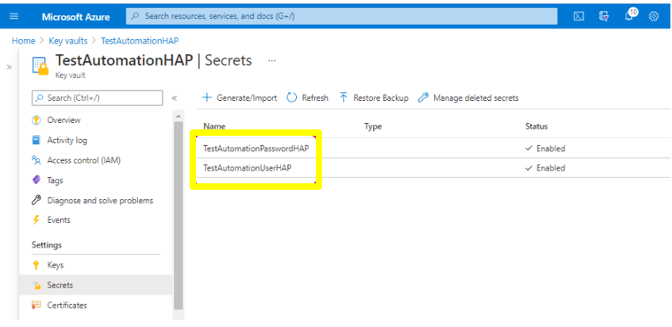

**_Step 2:_** In Azure create a new Managed Identity that will be used for Automation. 
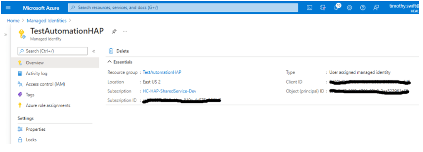 

**_Step 3:_** In the new KeyVault under Access Policies add the Managed Identity and grant it privileges. 
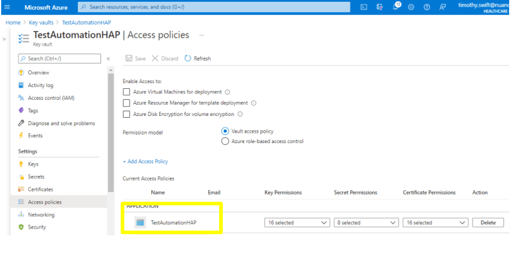 

### 5. Ensure to delete any unused Run As accounts to minimize your exposed attack surface

**Security Control Mapping :**  

| Control Number | Control Statement | Security Domain | Default | Associated Runbook | CVSS Severity  |
| -------------- | ----------------- | --------------- | ------- | ------------------ | -------------- |
|  CS0012268     |Vulnerability Assessments must be performed based on risk and findings must be addressed in accordance with Enterprise SLA's | Vulnerability Management | Not enabled | None | [Medium (5.0)](https://www.first.org/cvss/calculator/3.1#CVSS:3.1/AV:L/AC:H/PR:H/UI:N/S:C/C:L/I:L/A:L) |

**Why?** 
In Azure automation service,to minimize the attack,we deleted unused run using defender for cloud.Organization Anti malware and vulnerability tools are the required security intelligence that detects unusual and potentially harmful attempts to access or exploit the Key vaults. It uses advanced threat detection capabilities and Microsoft Threat Intelligence data to provide contextual security alerts. Those alerts also include steps to mitigate the detected threats and prevent future attacks. Microsoft Defender must be enabled at either the subscription level (recommended) or the resource level to analyze ,detect and remediate the threats.

**How?** 

**_Step 1:_** In the Azure portal, open the Automation account. 
**_Step 2:_** In the left pane, select Run as Accounts in the account settings section. 
**_Step 3:_** On the Run as Accounts properties page, select either the Run As account or Classic Run As account that you want to delete. 
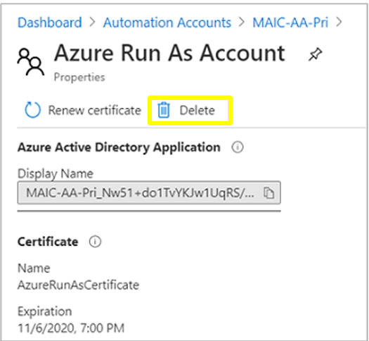 

### 6. Ensure Diagnostic logging is enabled for Azure event hubs

**Security Control Mapping :**  
| Control Number | Control Statement | Security Domain | Default | Associated Runbook | CVSS Severity  |
| -------------- | ----------------- | --------------- | ------- | ------------------ | -------------- |
| CS0012233 | Information System must create a log and record activities occurring on or originating from the information system. Logs must be made accessible to the enterprise SIEM solution  | Security Information and event management   | Enabled but not forwarded to Splunk | None | [Low (2.7)](https://www.first.org/cvss/calculator/3.1#CVSS:3.1/AV:P/AC:H/PR:H/UI:N/S:U/C:L/I:N/A:L) |

**Why?**  

Diagnostic settings are used to configure streaming export of platform logs and metrics for a resource to the destination of your choice. You may create up to five different diagnostic settings to send different logs and metrics to independent destinations

**How?**  

**_Step 1:_** Go to the existing Automation Account and Select Diagnostic settings under monitoring in the left side menu. 

**_Step 2:_** Click on +Add diagnostic settings and select allLogs under Logs. 
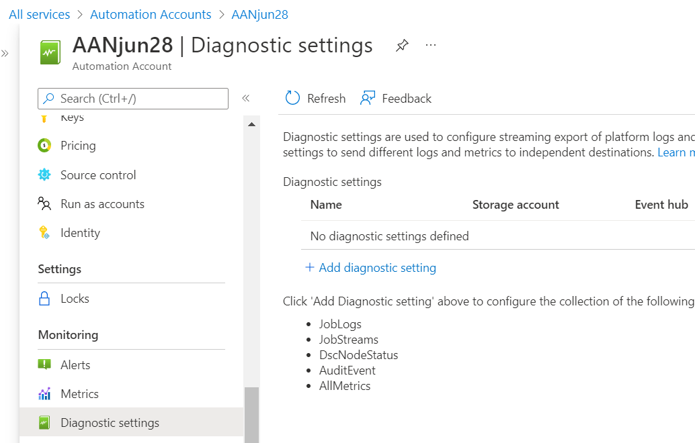 

**_Step 3:_** Select Stream to an Event hub. Choose the Eventhub namespace and Click on save button.  . 
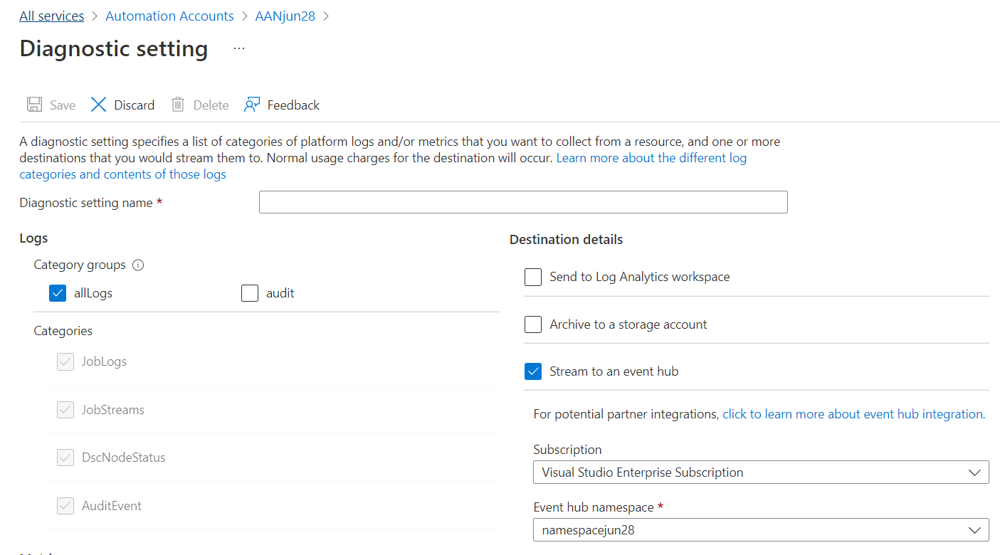
 <b

### 7. Ensure Azure Automation Account uses standard organizational Resource tagging method

**Security Control Mapping :**  
| Control Number | Control Statement | Security Domain | Default | Associated Runbook | CVSS Severity  |
| -------------- | ----------------- | --------------- | ------- | ------------------ | -------------- |
| CS0012261  | Technology hardware and software must be registered and accurately recorded within the enterprise technology repository and/or asset management systems | Asset Management  | Not enabled | organizational Runbook | [Low (1.6)](https://www.first.org/cvss/calculator/3.1#CVSS:3.1/AV:P/AC:H/PR:H/UI:N/S:U/C:N/I:N/A:L) |

**Why, What and How ?** 

Client Rationale and Justification 
[Placeholder link]

### 8. Ensure Activity logging is enabled for Azure Automation Account

**Security Control Mapping :**  
| Control Number | Control Statement | Security Domain | Default | Associated Runbook | CVSS Severity  |
| -------------- | ----------------- | --------------- | ------- | ------------------ | -------------- |
| CS0012233 | Information System must create a log and record activities occurring on or originating from the information system. Logs must be made accessible to the enterprise SIEM solution  | Security Information and event management   | Enabled but not forwarded to Splunk | None | [Low (2.7)](https://www.first.org/cvss/calculator/3.1#CVSS:3.1/AV:P/AC:H/PR:H/UI:N/S:U/C:L/I:N/A:L) |

**Why, What and How ?** 

Client rationale and Justification 
[Placeholder link]

   

### 9. Ensure Local authentications are disabled for Azure Automation Accounts

**Security Control Mapping :**  
| Control Number | Control Statement | Security Domain | Default | Associated Runbook | CVSS Severity  |
| -------------- | ------------------|---------------- |---------|--------------------|--------------- |
|  CS0012298	 | Access to change cloud identity access and service control policies is restricted to authorized cloud administrative personnel |  Identity and Access Management | Not enabled | None | [Medium (5.1)](https://www.first.org/cvss/calculator/3.1#CVSS:3.1/AV:A/AC:H/PR:H/UI:N/S:C/C:L/I:L/A:L) |

**What & Why?**  
Only Azure AD administrator users can create/enable users for Azure AD-based authentication. Local authentications are disabled for Azure automation service.It is recommend not using the Azure AD administrator for regular operations, as it has elevated user permissions. Disabling local authentication methods improves security by ensuring that Azure Automation accounts exclusively require Azure Active Directory identities for authentication.

**How?**  

**_Step 1:_** Navigate to Azure policy and select the Configure Azure Automation account to disable local authentication in Azure Automation policy 
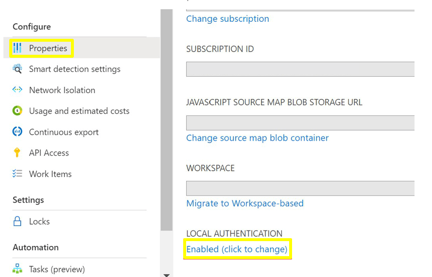 

**_Step 2:_** Apply the policy to the resource group. 
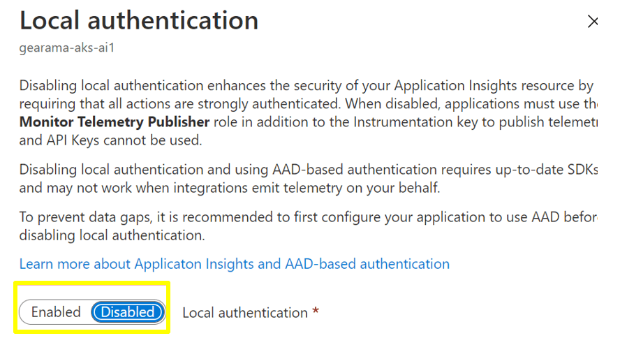 

**_Step 3:_** Create an automation account in the resource group 
**_Step 4:_** Navigate to Policy -> Assignment -> 'Configure Azure Automation account to disable local authentication' policy -> View compliance . Newly created Automation account is marked as compliant 
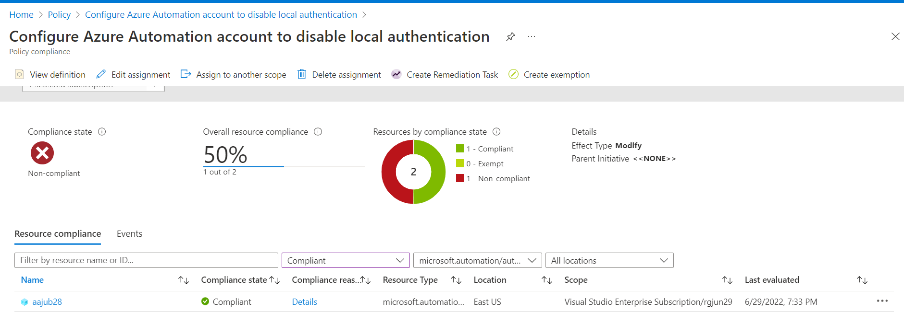 

**_Step 5:_** Navigate to the created automation account and click export template under automation. In the template verify  the value of the property '"disableLocalAuth" is true 
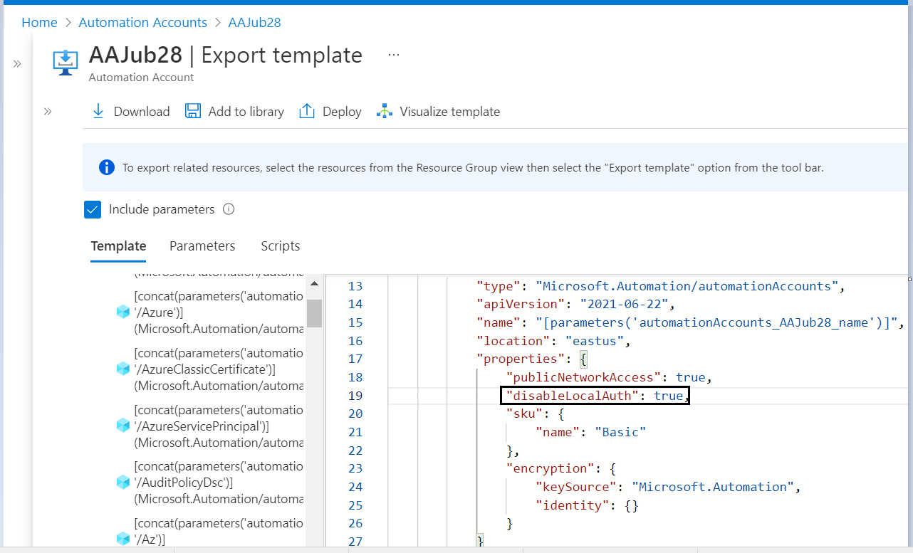 

### 10. Ensure administrative tasks are performed only in admin-e workstations 

**Security Control Mapping :**  
| Control Number | Control Statement | Security Domain | Default | Associated Runbook | CVSS Severity  |
| -------------- | ----------------- | --------------- | ------- | ------------------ | -------------- |
|  CS0012298	 | Access to change cloud identity access and service control policies is restricted to authorized cloud administrative personnel |  Identity & Access Management | Not enabled | None | [Low (3.0)](https://www.first.org/cvss/calculator/3.1#CVSS:3.1/AV:L/AC:H/PR:H/UI:N/S:U/C:L/I:L/A:N)|

**Why?**  

A Privileged workstation provides a hardened workstation that has clear application control and application guard. The workstation uses credential guard, device guard, app guard, and exploit guard to protect the host from malicious behavior. All the administrative tasks must be performed only using the admin-e workstation

**How?**  

**_step 1 :_** Request permission to add the user to corresponding entitlements to access admin e workstation 
**_Step 2 :_** Login to the workstation as the user and launch the azure portal in browser to perform administrative tasks  
[Place holder for link]
