# Azure Batch - Security baseline requirement <!-- omit in toc -->
## Baseline security configuration requirement for Azure services ## <!-- omit in toc -->

**Generated By: EY Security Team** <br>
**Service Type: Azure Batch** <br>
**Deployment Phase:** <br>
**Last updated: 07/21/2022**<br>

## Table of Contents <!-- omit in toc -->

- [Overview](#overview)
  - [Use Case Examples:](#use-case-examples)
- [Cloud Security Requirements](#cloud-security-requirements)
  - [1. Ensure Azure Batch access is granted only using Managed Identities](#1-ensure-azure-batch-access-is-granted-only-using-managed-identities)
  - [2. Ensure to Authenticate Batch Management solutions with Azure Active Directory](#2-ensure-to-authenticate-batch-management-solutions-with-azure-active-directory)
  - [3. Ensure that Azure Batch is deployed using private Endpoint](#3-ensure-that-azure-batch-is-deployed-using-private-endpoint)
  - [4. Ensure tags are enabled for the Azure Batch](#4-ensure-tags-are-enabled-for-the-azure-batch)
  - [5. Ensure disk encryption is enabled with Customer Managed Keys in Azure Batch](#5-ensure-disk-encryption-is-enabled-with-customer-managed-keys-in-azure-batch)
  - [6. Ensure RBAC access control method is used to grant access to Azure Batch](#6-ensure-rbac-access-control-method-is-used-to-grant-access-to-azure-batch)
  - [7. Ensure that activity logs are enabled in Azure Batch](#7-ensure-that-activity-logs-are-enabled-in-azure-batch)
  - [8. Ensure that diagnostic logs are enabled in Azure Batch](#8-ensure-that-diagnostic-logs-are-enabled-in-azure-batch)
  - [9. Ensure customized Image with pre-installed security softwares are used for deployment](#9-ensure-customized-image-with-pre-installed-security-softwares-are-used-for-deployment)
  - [10. Ensure that storage accounts for Azure Batch uses standard organizational Resource tagging method](#10-ensure-that-storage-accounts-for-azure-batch-uses-standard-organizational-resource-tagging-method)

##  Overview

Azure Batch is used to run large-scale parallel and high-performance computing (HPC) batch jobs efficiently in Azure. Azure Batch can be used to create and manage a pool of compute nodes (virtual machines), install the applications and run, and schedules jobs to run on the nodes. There's no cluster or job scheduler software to install, manage, or scale. Instead, Batch APIs and tools , command-line scripts, or the Azure portal can be used to configure, manage, and monitor your jobs.

Developers can use Batch as a platform service to build SaaS applications or client apps where large-scale execution is required. For example, you can build a service with Batch to run a Monte Carlo risk simulation for a financial services company, or a service to process many images.


| Control Number | Cloud Baseline Security Requirements                                                              |
| -------------- | ------------------------------------------------------------------------------------------------- |
| 1              | Ensure Azure Batch access is granted only using Managed Identities                                |
| 2              | Ensure to Authenticate Batch Management solutions with Azure Active Directory                     |
| 3              | Ensure that Azure Batch is deployed using private Endpoint                                        |
| 4              | Ensure tags are enabled for the Azure Batch                                                       |
| 5              | Ensure disk encryption is enabled with Customer Managed Keys in Azure Batch                       |
| 6              | Ensure RBAC access control method is used to grant access to Azure Batch                          |
| 7              | Ensure that activity logs are enabled in Azure Batch                                              |
| 8              | Ensure that diagnostic logs are enabled in Azure Batch                                            |
| 9              | Ensure customized Image with pre-installed security softwares are used for deployment             |
| 10             | Ensure that storage accounts for Azure Batch uses standard organizational Resource tagging method |

### Use Case Examples:
- Batch scoring with R models to forecast sales
- 3D video rendering
- Batch integration with Azure Data Factory for Azure Digital Twins

## Cloud Security Requirements 

### 1. Ensure Azure Batch access is granted only using Managed Identities 

**Security Control Mapping :** 

| Control Number | Control Statement | Security Domain | Default | Associated Runbook | CVSS Severity  |
| -------------- | ----------------- | --------------- | ------- | ------------------ | -------------- |
|  CS0012298       | Access to change cloud identity access and service control policies is restricted to authorized cloud administrative personnel |Identity & Access Management | Not enabled | None | [Medium (5.1)](https://www.first.org/cvss/calculator/3.1#CVSS:3.1/AV:A/AC:H/PR:H/UI:N/S:C/C:L/I:L/A:L) |

**Why?** <br>
Azure Batch supports managed identities for its Azure resources. Instead of creating service principals to access other resources, you must use managed identities with Batch. Batch can natively authenticate to the Azure services and resources that support Azure AD authentication. This authentication goes through a predefined access grant rule without using credentials that are hardcoded in source code or configuration files.

**How?** <br>

**_Step 1:_** Navigate to existing Batch account and click on Identity under settings<br>
**_Step 2:_** Goto System assigned and click on Save <br>
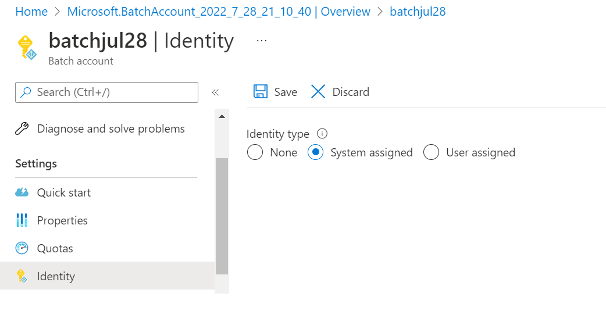<br>
**_Step 3:_** When creating a New Batch account , fill the basic details and Select Identity type as 'System assigned' under advanced tab<br>
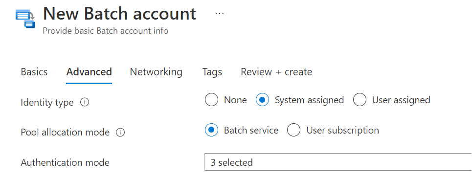<br>

<br><br> 

### 2. Ensure to Authenticate Batch Management solutions with Azure Active Directory 

**Security Control Mapping :** 

| Control Number | Control Statement | Security Domain | Default | Associated Runbook | CVSS Severity  |
| -------------- | ----------------- | --------------- | ------- | ------------------ | -------------- |
|  CS0012298	    | Access to change cloud identity access and service control policies is restricted to authorized cloud administrative personnel |  Identity & Access Management | Not enabled | None | [Medium (5.1)](https://www.first.org/cvss/calculator/3.1#CVSS:3.1/AV:A/AC:H/PR:H/UI:N/S:C/C:L/I:L/A:L)  |

**Why?** <br>
Azure Active Directory (Azure AD) is used as Batch's default authentication and authorization system. Standardize Azure AD to govern your organization's identity and access management. Batch account access supports two methods of authentication: Shared Key and Azure Active Directory (Azure AD). We strongly recommend using Azure AD for Batch account authentication. Some Batch capabilities require this method of authentication, including many of the security-related features.

Make securing Azure AD a high priority in your organization’s cloud security practice. With Azure AD's identity security score, you can compare identity security posture with Microsoft’s best practice recommendations. To make improvements in your security posture, use the score to gauge how closely your configuration matches best practice recommendations.


**How?** <br>

**_Step 1:_** Search for 'Azure batch ' in Search resource and navigate to it. And click on 'Create'.<br>
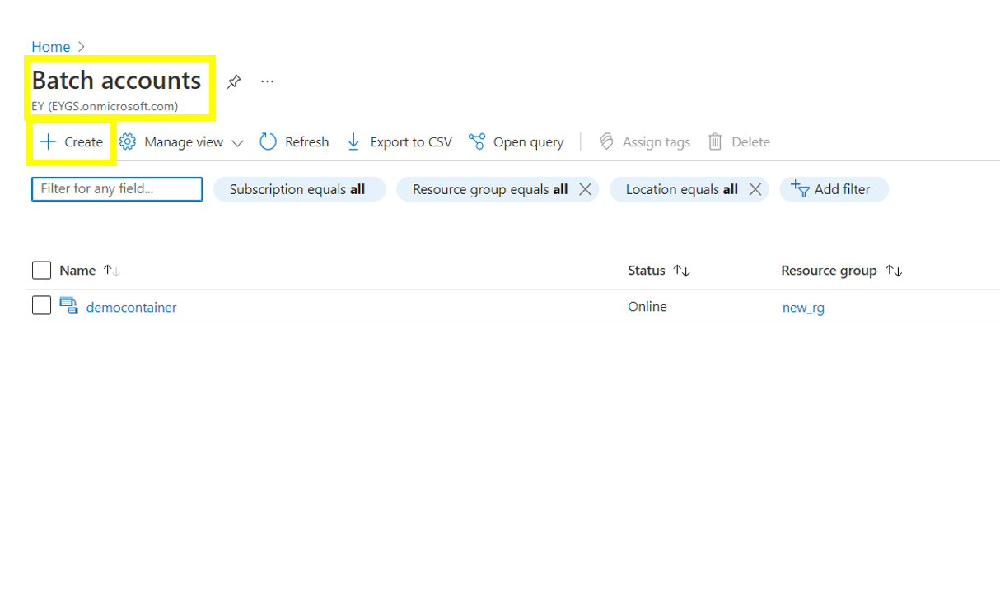<br>

**_Step 2:_** In the 'Advanced' tab, select the 'Azure AD' under 'authentication mode. click on 'Review+Create'.<br>
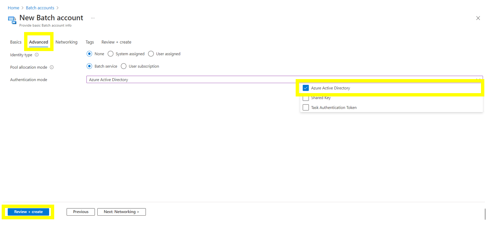<br>
<br><br> 

### 3. Ensure that Azure Batch is deployed using private Endpoint  

**Security Control Mapping :** 

| Control Number | Control Statement | Security Domain | Default | Associated Runbook | CVSS Severity  |
| -------------- | ----------------- | --------------- | ------- | ------------------ | -------------- |
| [CS0012300](place holder) | Cloud products and services must be deployed on private subnets and public access must be disabled for these services | Network and communication Security | Not enabled |Network Security Group Runbook | [High (7.2)](https://www.first.org/cvss/calculator/3.1#CVSS:3.1/AV:N/AC:H/PR:H/UI:N/S:C/C:H/I:L/A:L) |

**Why?** <br>
 By provisioning the pool without public IP addresses, you can restrict access to nodes and reduce the discover ability of the nodes from the internet. If you provision the pool in a subnet of an Azure virtual network, the compute nodes can securely communicate with other virtual machines or with an on-premises network. With Azure Private Link, you can enable private access to Batch from your virtual networks without crossing the internet. The Azure Private Link service is secured. It accepts connections only from authenticated and authorized private endpoints. Configuring private endpoints for Azure Batch is more secure and doesn't limit the offering's capabilities.

**How?** <br>

**_Step 1:_** Navigate to the Azure batch and Click on ‘Create’ to navigate to a new page to create a new batch.<br>

**_Step 2:_** In ‘Networking’ part, select 'Public network access' as 'Disabled', and click on 'Create private endpoint'.<br>
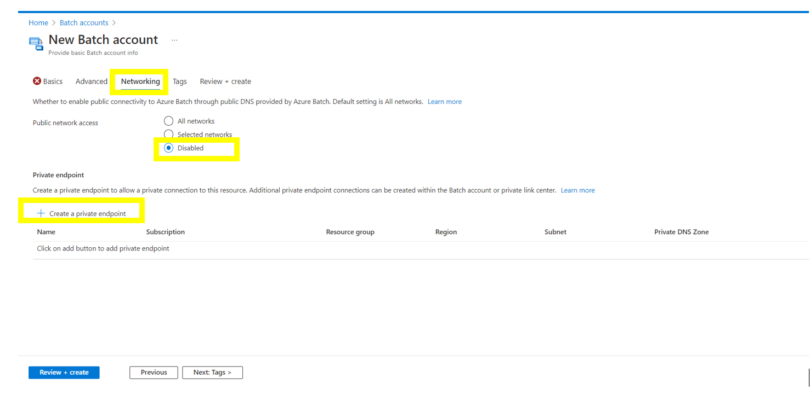<br>

**_Step 3:_** Give the values for private endpoint and virtual network <br>
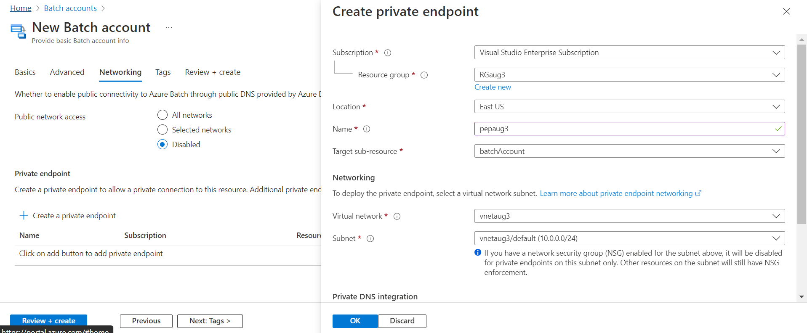<br>

**_Step 4:_** Select 'Private DNS Integration' as 'Yes' and click on 'OK' button<br>
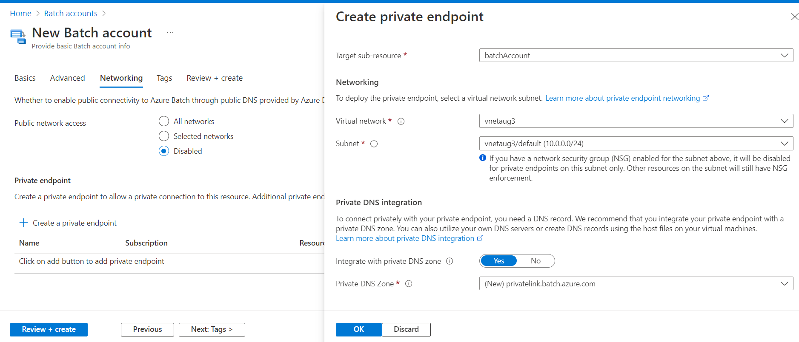<br>

<br><br> 

### 4. Ensure tags are enabled for the Azure Batch 

**Security Control Mapping :** 

| Control Number | Control Statement | Security Domain | Default | Associated Runbook | CVSS Severity  |
| -------------- | ----------------- | --------------- | ------- | ------------------ | -------------- |
| CS0012261  | Technology hardware and software must be registered and accurately recorded within the enterprise technology repository and/or asset management systems | Asset Management  | Not enabled | organizational Runbook | [Low (1.6)](https://www.first.org/cvss/calculator/3.1#CVSS:3.1/AV:P/AC:H/PR:H/UI:N/S:U/C:N/I:N/A:L) |

**Why, What and How ?**<br>
  
Client rationale and Justification <br>
[Placeholder link]

<br><br>

### 5. Ensure disk encryption is enabled with Customer Managed Keys in Azure Batch

**Security Control Mapping :** 

| Control Number | Control Statement | Security Domain | Default | Associated Runbook | CVSS Severity  |
| -------------- | ----------------- | --------------- | ------- | ------------------ | -------------- |
|  CS0012168     | Strong encryption key management controls are in place for cloud provider services to protect data at rest | Data Protection  | Not enabled | None | [Medium (5.3)](https://www.first.org/cvss/calculator/3.1#CVSS:3.1/AV:A/AC:H/PR:H/UI:N/S:U/C:H/I:L/A:L)  |


**Why?** <br>
By default, disk is encrypted using Microsoft Managed Keys at rest.All object metadata is also encrypted. However, if you want to control and manage this encryption key yourself, customer-managed key must be managed by the organization that key must be used to protect and control access to the key that encrypts the secrets. 

 [How to Enable customer-managed key](https://docs.microsoft.com/en-us/azure/databricks/security/keys/customer-managed-key-managed-services-azure)

**How?** <br>
**_Step 1:_**  In the side menu bar of the Azure key vault , Navigate to ‘Secrets', click +Generate/Import <br>
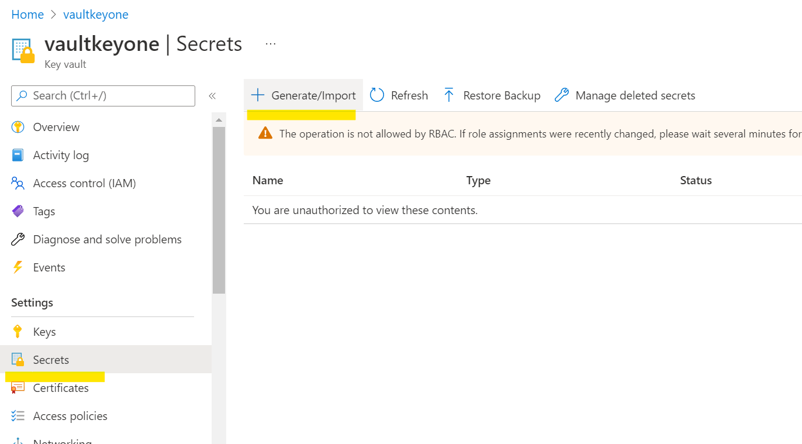<br>

**_Step 2:_** Select Name, value and click create.<br>
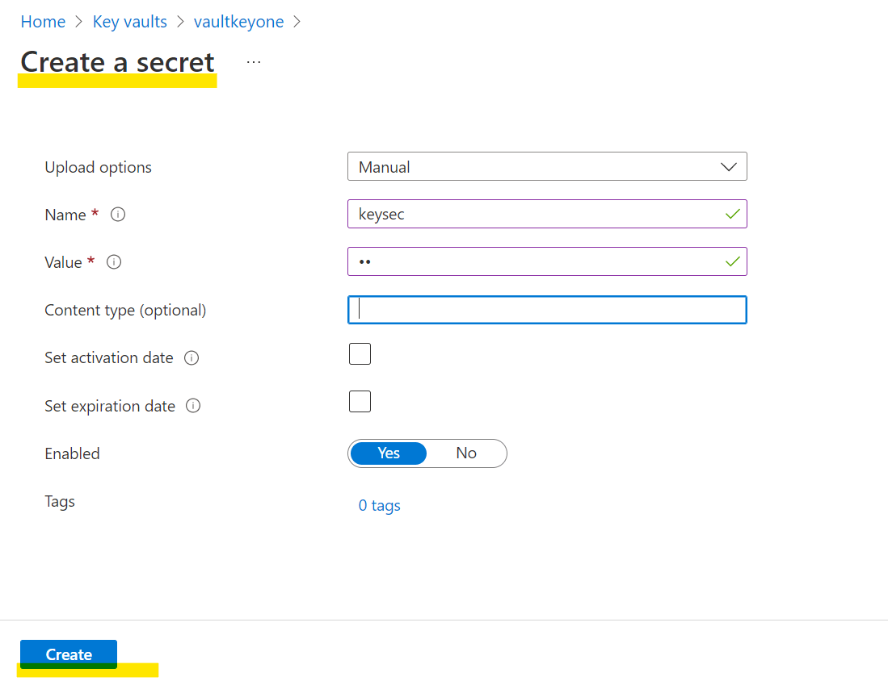<br>

**_Step 3:_**  In the side menu bar of the 'Azure batch' window , Navigate to ‘Encryption'. <br>
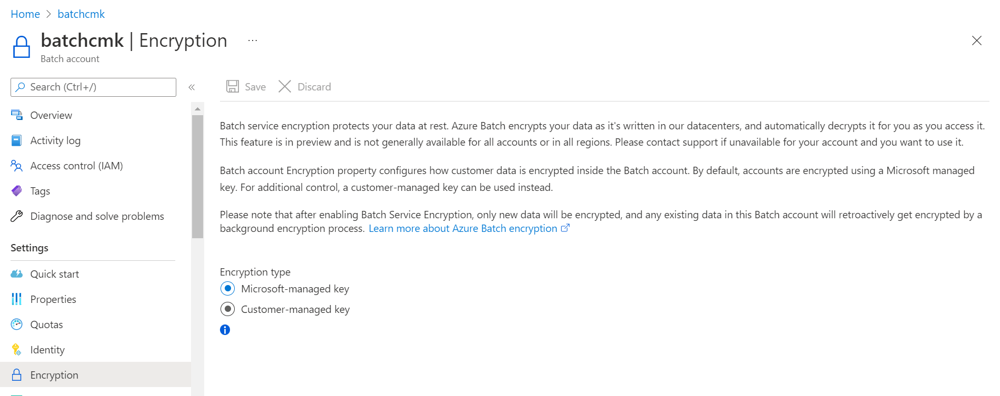<br>

**_Step 4:_** Select the Customer managed key and and select the key from key Vault.<br>
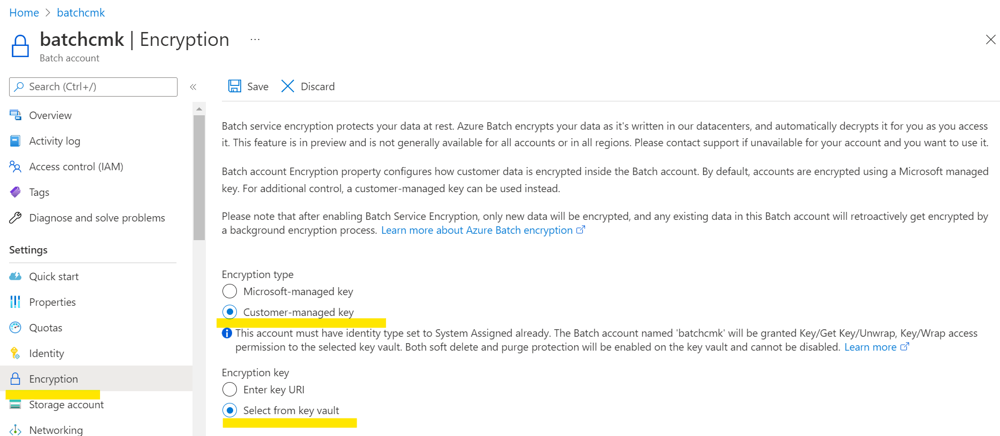<br>

<br><br> 


### 6. Ensure RBAC access control method is used to grant access to Azure Batch

**Security Control Mapping :** 

| Control Number | Control Statement | Security Domain | Default | Associated Runbook | CVSS Severity  |
| -------------- | ----------------- | --------------- | ------- | ------------------ | -------------- |
| CS0012300 | Cloud products and services must be deployed on private subnets and public access must be disabled for these services |Identity & Access Management | Not enabled | Virtual Network Runbook | [Medium (5.2)](https://www.first.org/cvss/calculator/3.1#CVSS:3.1/AV:L/AC:H/PR:H/UI:N/S:U/C:L/I:H/A:L) |


***Why, What and How ?**<br>

[placeholder]

**Following are the suggested RBAC roles for Azure Batch** <br>
| Function | Description | Role | 
| -------------- | ----------------- | --------------- | 
|  Network admin | Lets you manage networks, but not access to them | [Network Contributor](https://github.com/MicrosoftDocs/azure-docs/blob/main/articles/role-based-access-control/built-in-roles.md#network-contributor) |
| DNS Admin | Lets you manage private DNS zone resources, but not the virtual networks they are linked to. | [Private DNS Zone Contributor ](https://github.com/MicrosoftDocs/azure-docs/blob/main/articles/role-based-access-control/built-in-roles.md#private-dns-zone-contributor) |

To implement this control, refer the link: https://docs.microsoft.com/en-us/azure/data-factory/concepts-roles-permissions

<br><br> 

### 7. Ensure that activity logs are enabled in Azure Batch 

**Security Control Mapping :** 

| Control Number | Control Statement | Security Domain | Default | Associated Runbook | CVSS Severity  |
| -------------- | ----------------- | --------------- | ------- | ------------------ | -------------- |
| CS0012233 | Information System must create a log and record activities occurring on or originating from the information system. Logs must be made accessible to the enterprise SIEM solution  | Security Information and event management   | Enabled but not forwarded to Splunk | None | [Low (2.7)](https://www.first.org/cvss/calculator/3.1#CVSS:3.1/AV:P/AC:H/PR:H/UI:N/S:U/C:L/I:N/A:L) |

**Why, What and How ?**<br>
  
Client rationale and Justification
[Placeholder link]

<br><br>

  ### 8. Ensure that diagnostic logs are enabled in Azure Batch 

**Security Control Mapping :** 

| Control Number | Control Statement | Security Domain | Default | Associated Runbook | CVSS Severity  |
| -------------- | ----------------- | --------------- | ------- | ------------------ | -------------- |
| CS0012233 | Information System must create a log and record activities occurring on or originating from the information system. Logs must be made accessible to the enterprise SIEM solution  | Security Information and event management  | Not Enabled | Network Watcher Runbook | [Low (2.7)](https://www.first.org/cvss/calculator/3.1#CVSS:3.1/AV:P/AC:H/PR:H/UI:N/S:U/C:L/I:N/A:L) |


**Why?** <br>

This control is to check whether Azure Batch is enabled with end-to-end diagnostic logs of activities performed by Azure Batch users, allowing the enterprise to monitor detailed Azure Batch usage patterns. Also make sure HTTPS is required for accessing the storage account containing your Azure Batch data.

**How?** <br>

**_Step 1:_** On Diagnostic Settings page click on 'Add diagnostic setting' .<br>
 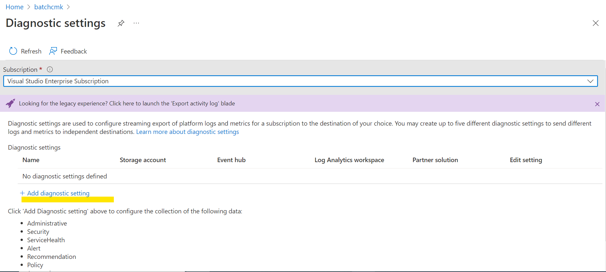<br>

**_Step 2:_** Select Administrative, Security, Alert, policy, recommendation log type and Select Destination details to be 'Stream to an event hub' and click on save button.<br>
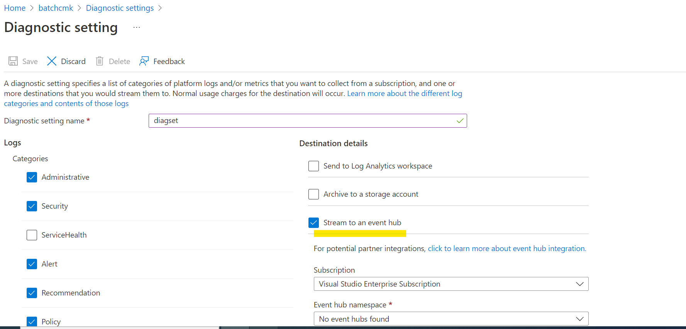<br>

<br><br>

### 9. Ensure customized Image with pre-installed security softwares are used for deployment 

**Security Control Mapping :** <br>

| Control Number | Control Statement | Security Domain | Default | Associated Runbook | CVSS Severity  |
| -------------- | ----------------- | --------------- | ------- | ------------------ | -------------- |
| [CS0012261](place holder)  | Technology hardware and software must be registered and accurately recorded within the enterprise technology repository and/or asset management systems | Asset Management  | Not enabled | Azure Container Registry Runbook | [Medium (5.0)](https://www.first.org/cvss/calculator/3.1#CVSS:3.1/AV:L/AC:H/PR:H/UI:N/S:C/C:L/I:L/A:L)  |

**Why?** <br>

Customized images with pre-installed security softwares are the Azure Resource Manager templates of the Virtual Machines which are customized and configured to meet the organization's security and compliance policies. New instances must be deployed only using these approved images promoting the uniformity and secured design. Patch updates and maintenance will be done to this approved VM Images by Infrastructure team

**How?** <br>

**_Step 1:_** Once you logged in to you Azure portal, create a new ‘Azure compute gallery’ and provide a name.<br>

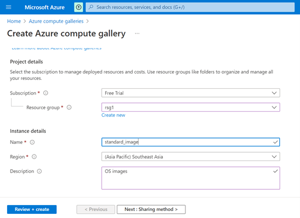<br>

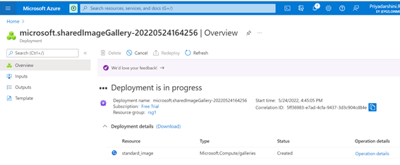<br>

**_Step 2:_** Locate the existing VM resource (to utilize this image as standard one) and click ‘create an image’.<br>

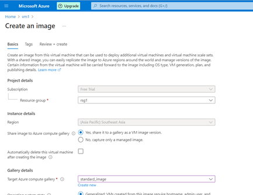<br>

**_Step 3:_** Choose the newly created ‘compute gallery’ name and provide version number & EOL date.<br>

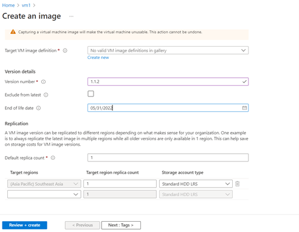<br>

**_Step 4:_** The  image will be saved in ‘Azure compute gallery’.<br>

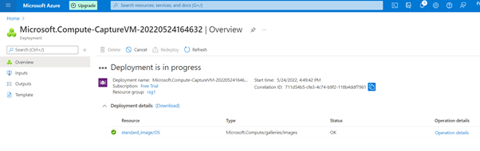<br>

**_Step 5:_** Now the standard image can be used for new VM resources (From ‘Shared images’). <br>

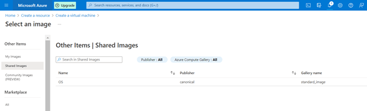    <br>
               
**_Step 6:_** Create a pool from a Shared Image using the Azure CLI <br>

```AZURECLI
_az batch pool create --id mypool --vm-size Standard --target-dedicated-nodes 2 --image "/subscriptions/{sub id}/resourceGroups/{resource group name}/providers/Microsoft.Compute/galleries/{gallery name}/images/{image definition name}/versions/{version id}" --node-agent-sku-id "batch.node.ubuntu 16.04"_
```

<br><br>

### 10. Ensure that storage accounts for Azure Batch uses standard organizational Resource tagging method

**Security Control Mapping :** 

| Control Number | Control Statement | Security Domain | Default | Associated Runbook | CVSS Severity  |
| -------------- | ----------------- | --------------- | ------- | ------------------ | -------------- |
| [CS0012261](place holder)  | Technology hardware and software must be registered and accurately recorded within the enterprise technology repository and/or asset management systems | Asset Management  | Not enabled | Storage Account Runbook | [Medium (5.0)](https://www.first.org/cvss/calculator/3.1#CVSS:3.1/AV:L/AC:H/PR:H/UI:N/S:C/C:L/I:L/A:L)  |

**Why, What and How ?**<br>
  
Most Batch solutions use Azure Storage for storing resource files and output files, so each Batch account is usually associated with a corresponding storage account. Batch accounts must use organization baselines storage account as per runbook link <br>
[placeholderlink]
<br><br>

