# Azure Cognitive Service- Security baseline requirement <!-- omit in toc -->
## Baseline security configuration requirement for Azure services  <!-- omit in toc -->

**Generated By: EY Security Team**  
**Service Type: Cognitive Service**  
**Deployment Phase: Service Discovery**  
**Last updated: 20/07/2022** 

## Table of Contents <!-- omit in toc -->
- [Overview](#overview)
  - [Use Case Examples:](#use-case-examples)
- [Cloud Security Requirements](#cloud-security-requirements)
  - [1. Ensure to enable Transport Layer Security (TLS 1.2) for Azure Cognitive Services security](#1-ensure-to-enable-transport-layer-security-tls-12-for-azure-cognitive-services-security)
  - [2. Ensure least privilege for the cognitive services is implemented using Role Based Access Control (RBAC)](#2-ensure-least-privilege-for-the-cognitive-services-is-implemented-using-role-based-access-control-rbac)
  - [3. Ensure that environment variables are configured to avoid the hardcode of credentials](#3-ensure-that-environment-variables-are-configured-to-avoid-the-hardcode-of-credentials)
  - [4. Ensure to use private endpoints for Azure Cognitive services](#4-ensure-to-use-private-endpoints-for-azure-cognitive-services)
  - [5. Ensure customer Managed key is configured for data at rest in azure cognitive services](#5-ensure-customer-managed-key-is-configured-for-data-at-rest-in-azure-cognitive-services)
  - [6. Ensure to Configure the data loss prevention for Azure Cognitive Services](#6-ensure-to-configure-the-data-loss-prevention-for-azure-cognitive-services)
  - [7. Ensure the tags are enabled for Azure Cognitive services](#7-ensure-the-tags-are-enabled-for-azure-cognitive-services)
  - [8. Ensure the Managed Identity for Azure Cognitive services](#8-ensure-the-managed-identity-for-azure-cognitive-services)
  - [9. Ensure the Active logs in azure Cognitive service](#9-ensure-the-active-logs-in-azure-cognitive-service)
  - [10. Ensure the diagnostic logs for Azure the Cognitive services](#10-ensure-the-diagnostic-logs-for-azure-the-cognitive-services)

## Overview
Cognitive Services brings AI within reach of every developer and data scientist. With leading models, a variety of use cases can be unlocked. All it takes is an API call to embed the ability to see, hear, speak, search, understand, and accelerate advanced decision-making into the applications.
  

| Control Number | Cloud Baseline Security Requirements                                                                    |
| -------------- | ------------------------------------------------------------------------------------------------------- |
| 1              | Ensure to enable Transport Layer Security (TLS 1.2) for Azure Cognitive Services security               |
| 2              | Ensure least privilege for the cognitive services is implemented using Role Based Access Control (RBAC) |
| 3              | Ensure that environment variables are configured to avoid the hardcode of credentials                   |
| 4              | Ensure to use private endpoints for Azure Cognitive services                                            |
| 5              | Ensure customer Managed key is configured for data at rest in azure cognitive services                  |
| 6              | Ensure to Configure the data loss prevention for Azure Cognitive Services                               |
| 7              | Ensure the tags are enabled for Azure Cognitive services                                                |
| 8              | Ensure the Managed Identity for Azure Cognitive services                                                |
| 9              | Ensure the Active logs in azure Cognitive service                                                       |
| 10             | Ensure the diagnostic logs for Azure the Cognitive services                                             |

### Use Case Examples:

- Remote patient monitoring
- Build a chatbot for hotel booking
- Contactless IoT interfaces with Azure intelligent edge

## Cloud Security Requirements 

### 1. Ensure to enable Transport Layer Security (TLS 1.2) for Azure Cognitive Services security 

**Security Control Mapping :**  

| Control Number | Control Statement | Security Domain | Default | Associated Runbook | CVSS Severity  |
| -------------- | ----------------- | --------------- | ------- | ------------------ | -------------- |
| CS0012261 | Cloud based data in transit must be encrypted with enterprise approved algorithm | Data Protection | Enabled  | None | [Medium (5.3)](https://www.first.org/cvss/calculator/3.1#CVSS:3.1/AV:A/AC:H/PR:H/UI:N/S:U/C:H/I:L/A:L) |

**Why, What and How ?** 

TLS 1.2 is enforced across all Cognitive Services endpoints that are accessible through HTTP. Consumers calling a Cognitive Services endpoint with an enforced security protocol should follow these rules:
  - The TLS 1.2 protocol must be supported by the client OS.
  - TLS 1.2 must be requested in the language (and platform) used to make the HTTP call.

### 2. Ensure least privilege for the cognitive services is implemented using Role Based Access Control (RBAC)

**Security Control Mapping :**  
| Control Number | Control Statement | Security Domain | Default | Associated Runbook | CVSS Severity  |
| -------------- | ----------------- | --------------- | ------- | ------------------ | -------------- |
| CS0012300 | Cloud products and services must be deployed on private subnets and public access must be disabled for these services |Identity & Access Management | Not enabled  |Organizational Runbook | [Medium (5.2)](https://www.first.org/cvss/calculator/3.1#CVSS:3.1/AV:L/AC:H/PR:H/UI:N/S:U/C:L/I:H/A:L) |

[Place Holder ]

**Following are the suggested RBAC roles for Azure App insights**  

| Function | Description | Role | 
| -------------- | ----------------- | --------------- | 
|  Cognitive Services Contributor | Lets you create, read, update, delete and manage keys of Cognitive Services. | [Cognitive Services Contributor](https://github.com/MicrosoftDocs/azure-docs/blob/main/articles/role-based-access-control/built-in-roles.md#cognitive-services-contributor) |
|  Cognitive Services User | CLets you read and list keys of Cognitive Services. | [ Cognitive Services User ](https://github.com/MicrosoftDocs/azure-docs/blob/main/articles/role-based-access-control/built-in-roles.md#cognitive-services-user) |

### 3. Ensure that environment variables are configured to avoid the hardcode of credentials

**Security Control Mapping :**  

| Control Number | Control Statement | Security Domain | Default | Associated Runbook | CVSS Severity  |
| -------------- | ----------------- | --------------- | ------- | ------------------ | -------------- |
[[CS0012133](place holder)] | Information systems are hardened and configured to align with enterprise requirements | Configuration Management | Not enabled | None | [Medium (5.0)](https://www.first.org/cvss/calculator/3.1#CVSS:3.1/AV:L/AC:H/PR:H/UI:N/S:C/C:L/I:L/A:L)| |

**Why?**  

Applications need to authenticate access to the Cognitive Services they use. To authenticate, Azure recommend creating an environment variable to store the keys for your Azure Resources. 
        
  

**How?** 

**_Step 1:_** For creating environmental variable,  Keys in Keyvault must be created

**_Step 2:_** Create a Key vault and provide necessary information

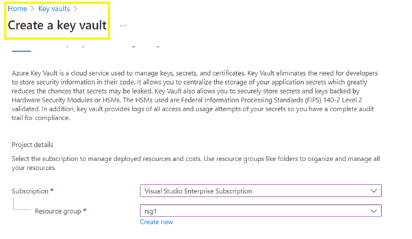

**_Step 3:_** Once the Key vault is created, navigate to the created vault and select 'keys' to create.

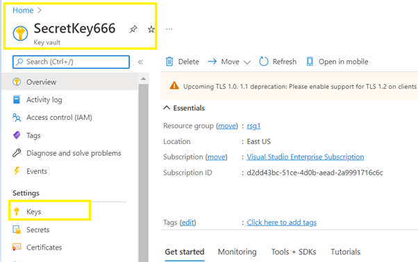

**_Step 4:_** Create Keys and enable it with creation/expiration date.

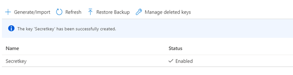

**_Step 5:_** After the key is generated, write it to a new environment variable on the local machine running the application.

**_Step 6:_** To set the environment variable, open a console window, and follow the instructions based on the operating system. Replace your-key with one of the keys for the resource.

 
 

### 4. Ensure to use private endpoints for Azure Cognitive services

**Security Control Mapping :** 

| Control Number | Control Statement | Security Domain | Default | Associated Runbook | CVSS Severity  |
| -------------- | ----------------- | --------------- | ------- | ------------------ | -------------- |
| CS0012300 | Cloud products and services must be deployed on private subnets and public access must be disabled for these services | Network and communication Security | Not enabled | None| [Medium (5.1)](https://www.first.org/cvss/calculator/3.1#CVSS:3.1/AV:A/AC:H/PR:H/UI:N/S:C/C:L/I:L/A:L) |

**Why?**  

Private Endpoints for Azure Cognitive Search allow a client on a virtual network to securely access data in a search index over a Private Link. The private endpoint uses an IP address from the virtual network address space for your search service. Network traffic between the client and the search service traverses over the virtual network and a private link on the Microsoft backbone network, eliminating exposure from the public internet. 

**How?** 

**_Step 1:_** After creating the services, navigate to the networking tab and choose private endpoint.

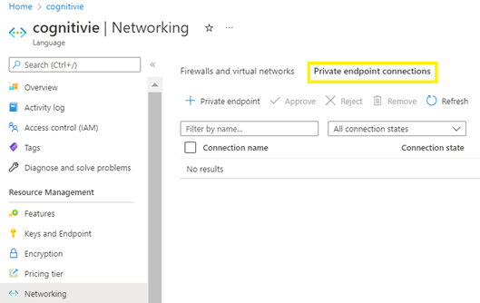

**_Step 2:_** Create a private end point and provide necessary information.

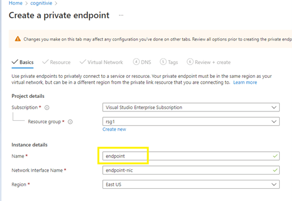

**_Step 3:_** In the DNS tab section, it will show the private DNS zone.

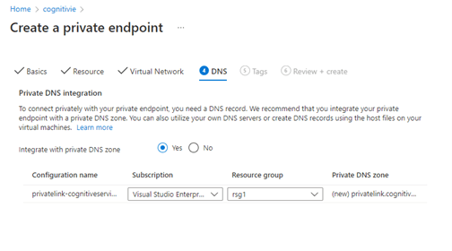

**_Step 4:_**   In the networking section, endpoint connection is displayed.
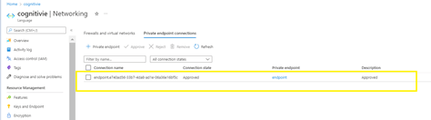

 
 

### 5. Ensure customer Managed key is configured for data at rest in azure cognitive services 

**Security Control Mapping :**  

| Control Number | Control Statement | Security Domain | Default | Associated Runbook | CVSS Severity  |
| -------------- | ----------------- | --------------- | ------- | ------------------ | -------------- |
|  CS0012168       |Strong encryption key management controls are in place for cloud provider services to protect data at rest | Data Protection  | Not enabled | None | [Medium (5.3)](https://www.first.org/cvss/calculator/3.1#CVSS:3.1/AV:A/AC:H/PR:H/UI:N/S:U/C:H/I:L/A:L)  |

**Why?**   
By default, your data are stored in Microsoft's storage and your subscription uses Microsoft-managed encryption keys.You must use Azure Key Vault to store customer-managed keys. You can either create your own keys and store them in a key vault, or you can use the Azure Key Vault APIs to generate keys.

 
 

**How?** 

**_Step 1:_** After creating the cognitive services, navigate to the Encryption tab

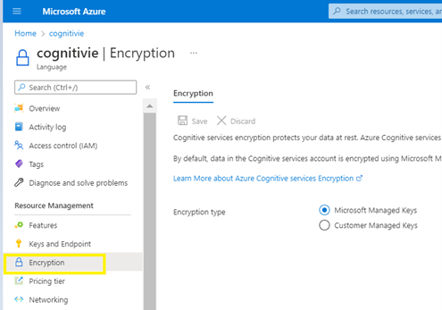

**_Step 2:_** select the encryption type as 'customer managed keys'

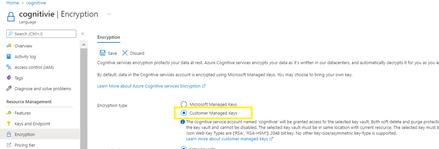

**_Step 3:_** create a Key vault and provide the necessary information.

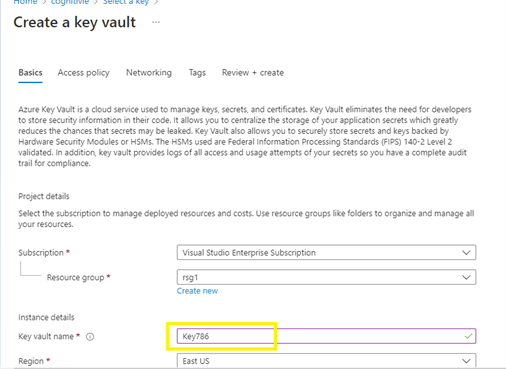

**_Step 4:_** For the Encryption key, choose the created key vault.

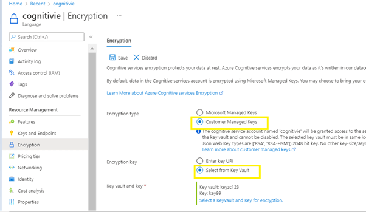

**_Step 5:_** click on save button.

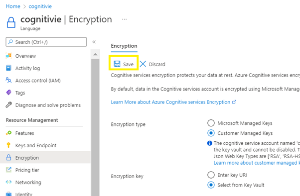

### 6. Ensure to Configure the data loss prevention for Azure Cognitive Services

**Security Control Mapping :**  

| Control Number | Control Statement | Security Domain | Default | Associated Runbook | CVSS Severity  |
| -------------- | ----------------- | --------------- | ------- | ------------------ | -------------- |
| CS0012261 | Cloud based data in transit must be encrypted with enterprise approved algorithm | Data Protection | Enabled | None | [Medium (5.3)](https://www.first.org/cvss/calculator/3.1#CVSS:3.1/AV:A/AC:H/PR:H/UI:N/S:U/C:H/I:L/A:L) |

**Why?** 
Cognitive Services data loss prevention capabilities allow customers to configure the list of outbound URLs their Cognitive Services resources are allowed to access. This creates another level of control for customers to prevent data loss. In this article, we'll cover the steps required to enable the data loss prevention feature for Cognitive Services resources.

**How?** 
**_Step 1:_** Install the Azure CLI(https://docs.microsoft.com/en-us/cli/azure/install-azure-cli) 

**_Step 2:_** View the details of the Cognitive Services resource. 
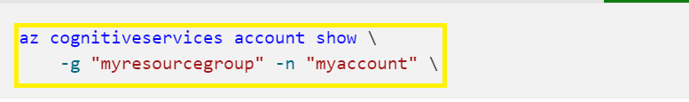 

**_Step 3:_**View the current properties of the Cognitive Services resource.use this      script and provide the 'Subscription ID' ,'Resources Group','Account Name' (az rest -m get
    -u /subscriptions/{subscription ID}/resourceGroups/{resource group}/providers/Microsoft.CognitiveServices/accounts/{account name}?api-version=2021-04-30)  
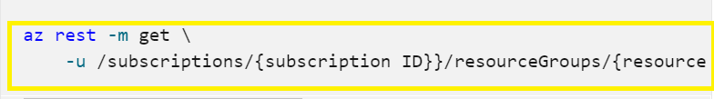  

**_Step 4:_** Configure the restrictOutboundNetworkAccess property and update the allowed FqdnList with the approved URLs.use this script and provide the 'Subscription ID' ,'Resources Group','Account Name'  

_(az rest -m patch_ 
    _-u /subscriptions/{subscription ID}/resourceGroups/{resource group}/providers/Microsoft.CognitiveServices/accounts/{account name}?api-version=2021-04-30_ 
    _-b '{"properties": { "restrictOutboundNetworkAccess": true, "allowedFqdnList": [ "microsoft.com" ] }}')_  
    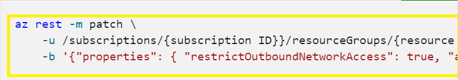 

  

### 7. Ensure the tags are enabled for Azure Cognitive services

**Security Control Mapping :**  
| Control Number | Control Statement | Security Domain | Default | Associated Runbook | CVSS Severity  |
| -------------- | ----------------- | --------------- | ------- | ------------------ | -------------- |
| CS0012261  | Technology hardware and software must be registered and accurately recorded within the enterprise technology repository and/or asset management systems | Asset Management  | Not enabled | organizational Runbook |  [Low (1.6)](https://www.first.org/cvss/calculator/3.1#CVSS:3.1/AV:P/AC:H/PR:H/UI:N/S:U/C:N/I:N/A:L) |

**Why, What and How ?** 

Client rationale and Justification 
[Placeholder link]

  

### 8. Ensure the Managed Identity for Azure Cognitive services

**Security Control Mapping :** 

| Control Number | Control Statement | Security Domain | Default | Associated Runbook | CVSS Severity  |
| -------------- | ----------------- | --------------- | ------- | ------------------ | -------------- |
|  CS0012298       | Access to change cloud identity access and service control policies is restricted to authorized cloud administrative personnel |Identity & Access Management | Not enabled | None | [Medium (5.1)](https://www.first.org/cvss/calculator/3.1#CVSS:3.1/AV:A/AC:H/PR:H/UI:N/S:C/C:L/I:L/A:L) |

**Why?**  

Managed identity enables Azure resources to authenticate to cloud services (e.g. Azure Key Vault) without storing credentials in code. Once enabled, all necessary permissions can be granted via Azure role-based-access-control. 
In system assigned managed identity, the lifecycle of this type of managed identity is tied to the lifecycle of this resource. Additionally, each resource (e.g. Virtual Machine) can only have one system assigned managed identity. 
In User assigned managed identity, managed identities are created as standalone Azure resources, and have their own lifecycle. A single resource (e.g. Virtual Machine) can utilize multiple user assigned managed identities. A single user assigned managed identity can be shared across multiple resources.
To access the container images from the container registry, An user-assigned or system-assigned managed identity must be setup on a Linux VM. Similarly an Azure Kubernetes Service cluster must be setup to use the managed identity to pull container images from Azure Container Registry for pod deployments.

**How?** 

**_Step 1:_** When creating a cognitive service, navigate to the 'Identity' tab and turn the status to 'on' and click on `Review + Create`. 
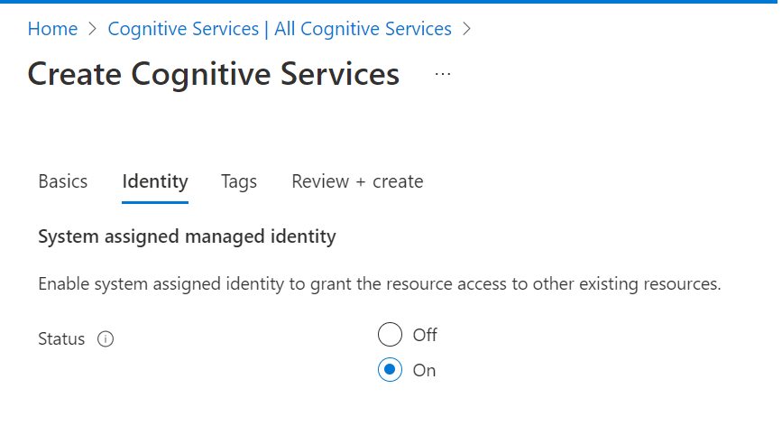 

**_Step 2:_** For an existing cognitive service navigate to the 'Identity' under 'Resource Management' and turn the status to 'On' 
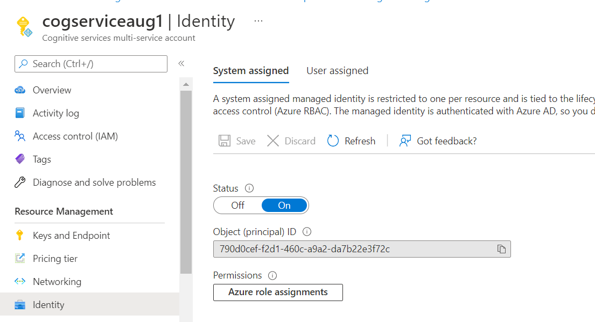 

### 9. Ensure the Active logs in azure Cognitive service

**Security Control Mapping :**  

| Control Number | Control Statement | Security Domain | Default | Associated Runbook | CVSS Severity  |
| -------------- | ----------------- | --------------- | ------- | ------------------ | -------------- |
| CS0012233 | Information System must create a log and record activities occurring on or originating from the information system. Logs must be made accessible to the enterprise SIEM solution  | Security Information and event management   | Enabled but not forwarded to Splunk | None | [Low (2.7)](https://www.first.org/cvss/calculator/3.1#CVSS:3.1/AV:P/AC:H/PR:H/UI:N/S:U/C:L/I:N/A:L) |

**Why, What and How ?** 

Client rationale and Justification 
[Placeholder link]

  

### 10. Ensure the diagnostic logs for Azure the Cognitive services

**Security control mapping:**  
| Control Number | Control Statement | Security Domain | Default | Associated Runbook | CVSS Severity  |
| -------------- | ----------------- | --------------- | ------- | ------------------ | -------------- |
| CS0012233 | Information System must create a log and record activities occurring on or originating from the information system. Logs must be made accessible to the enterprise SIEM solution  | Security Information and event management  | Not Enabled | Network Watcher Runbook | [Low (2.7)](https://www.first.org/cvss/calculator/3.1#CVSS:3.1/AV:P/AC:H/PR:H/UI:N/S:U/C:L/I:N/A:L) |

**What & Why?**  

The event log contains information about the api objects which include Audit Logs ,Request and Response Logs and Trace Logs. These logs when forwarded to Splunk provide necessary information to create notable alerts for any rule created to allow connection from internet 

**How?** 

**_Step 1:_** In the newly created Cognitive service, Navigate to Diagnostic Settings under 'Monitoring' page and click on 'Add diagnostic setting' .  
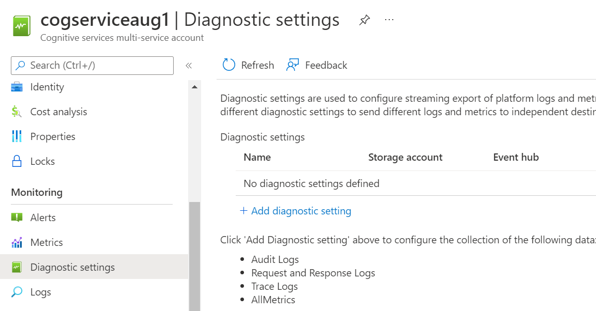 

**_Step 2:_** Select Audit Logs ,Request and Response Logs and Trace Logs and Select Destination details as 'Stream to an event hub' and click on 'save' button. 
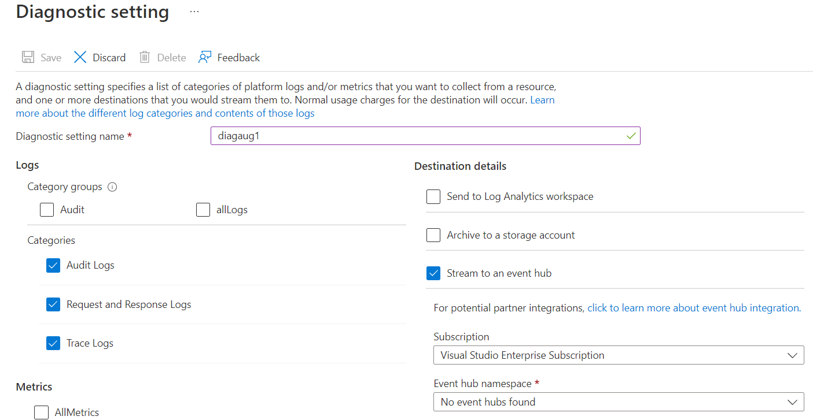  

 
