# Azure Container Instance - Security baseline requirement <!-- omit in toc -->
## Baseline security configuration requirement for Azure services  <!-- omit in toc -->

**Generated By: EY Security Team**  
**Service Type: Containers**  
**Deployment Phase: Service Discovery**   
**Last updated: 05/11/2022**  

## Table of Contents <!-- omit in toc -->

- [Overview](#overview)
  - [Use Case Examples:](#use-case-examples)
- [Cloud Security Requirements](#cloud-security-requirements)
  - [1. Ensure Azure Container instance is deployed in Private Endpoint](#1-ensure-azure-container-instance-is-deployed-in-private-endpoint)
  - [2. Ensure that private container registry is used to store the container images](#2-ensure-that-private-container-registry-is-used-to-store-the-container-images)
  - [3. Ensure the application accessing the Azure container instances is running on a platform that supports TLS 1.2 or above](#3-ensure-the-application-accessing-the-azure-container-instances-is-running-on-a-platform-that-supports-tls-12-or-above)
  - [4. Ensure Azure container implements RBAC access control](#4-ensure-azure-container-implements-rbac-access-control)
  - [5. Ensure administrative tasks are performed only in admin-e workstations](#5-ensure-administrative-tasks-are-performed-only-in-admin-e-workstations)
  - [6. Ensure Azure container instance access is granted only using Managed Identities](#6-ensure-azure-container-instance-access-is-granted-only-using-managed-identities)
  - [7. Ensure container administrative credentials are vaulted using enterprise vaulting solutions](#7-ensure-container-administrative-credentials-are-vaulted-using-enterprise-vaulting-solutions)
  - [8. Ensure that Container Instance are integrated with Malware and Vulnerability Scanner tools](#8-ensure-that-container-instance-are-integrated-with-malware-and-vulnerability-scanner-tools)
  - [9. Ensure Azure Container Instances use standard organizational Resource tagging method](#9-ensure-azure-container-instances-use-standard-organizational-resource-tagging-method)
  - [10. Ensure only organization approved container images are used for deployment in production](#10-ensure-only-organization-approved-container-images-are-used-for-deployment-in-production)
  - [11. Ensure organizational CI/CD pipeline is integrated with Container vulnerability scanner to scan container images before deployment](#11-ensure-organizational-cicd-pipeline-is-integrated-with-container-vulnerability-scanner-to-scan-container-images-before-deployment)
  - [12. Ensure Activity logging is enabled for Azure Container Instance](#12-ensure-activity-logging-is-enabled-for-azure-container-instance)
  - [13. Ensure that Sensitive data is protected by using Secure Environment variables or Secret volumes in Azure Container Instance](#13-ensure-that-sensitive-data-is-protected-by-using-secure-environment-variables-or-secret-volumes-in-azure-container-instance)

##  Overview

Azure Container Instances offers the fastest and simplest way to package, deploy, and manage cloud applications in  a container without having to manage any virtual machines and without having to adopt a higher-level service.Azure Container Instances is a great solution that can operate in isolated containers, including simple applications, task automation, and build jobs.

| Control Number | Cloud Baseline Security Requirements                                                                                               |
| -------------- | ---------------------------------------------------------------------------------------------------------------------------------- |
| 1              | Ensure Azure Container instance is deployed in Private Endpoint                                                                    |
| 2              | Ensure that private container registry is used to store the container images                                                       |
| 3              | Ensure the application accessing the Azure container instances is running on a platform that supports TLS 1.2 or above             |
| 4              | Ensure Azure container implements RBAC access control                                                                              |
| 5              | Ensure administrative tasks are performed only in admin-e workstations                                                             |
| 6              | Ensure Azure container instance access is granted only using Managed Identities                                                    |
| 7              | Ensure container administrative credentials are vaulted using enterprise vaulting solutions                                        |
| 8              | Ensure that Container Instance are integrated with Malware and Vulnerability Scanner tools                                         |
| 9              | Ensure Azure Container Instances use standard organizational Resource tagging method                                               |
| 10             | Ensure only organization approved container images are used for deployment in production                                           |
| 11             | Ensure organizational CI/CD pipeline is integrated with Container vulnerability scanner to scan container images before deployment |
| 12             | Ensure Activity logging is enabled for Azure Container Instance                                                                    |
| 13             | Ensure that Sensitive data is protected by using Secure Environment variables or Secret volumes in Azure Container Instance        |

### Use Case Examples:
- Automate infrastructure reconfiguration
- Serverless batch processing with Durable Functions
- Java CI/CD using Jenkins and Azure Web Apps
- Building blocks for autonomous-driving simulation environments

## Cloud Security Requirements 

### 1. Ensure Azure Container instance is deployed in Private Endpoint  ###

**Security Control Mapping :**  

| Control Number | Control Statement | Security Domain | Default | Associated Runbook | CVSS Severity  |
| -------------- | ----------------- | --------------- | ------- | ------------------ | -------------- |
| CS0012300 | Cloud products and services must be deployed on private subnets and public access must be disabled for these services | Network and communication Security | Not enabled |Network Security Group Runbook | [High (7.2)](https://www.first.org/cvss/calculator/3.1#CVSS:3.1/AV:N/AC:H/PR:H/UI:N/S:C/C:H/I:L/A:L) |

**Why?**  

Azure Virtual Network provides secure, private networking for your Azure and on-premises resources. By deploying container groups into an Azure virtual network, Azure containers can communicate securely with other resources in the virtual network. Container groups deployed into an Azure virtual network enable container communication with on-premises resources through a VPN gateway or ExpressRoute.

**Note:** Currently, only Linux containers are supported in a container group deployed to a virtual network and managed identity can't be used in a container group deployed to a virtual network1.

Limitations for container in VNet: https://docs.microsoft.com/en-us/azure/container-instances/container-instances-virtual-network-concepts#unsupported-networking-scenarios

    
**How?**  

Azure Virtual Network provides secure, private networking for your Azure and on-premises resources. By deploying container groups into an Azure virtual network, your containers can communicate securely with other resources in the virtual network.

**_Step 1:_** In the search resource , search for container instance and select the container instance . Once you are navigated to the container instance page click on ‘create’ to get started with container instance.

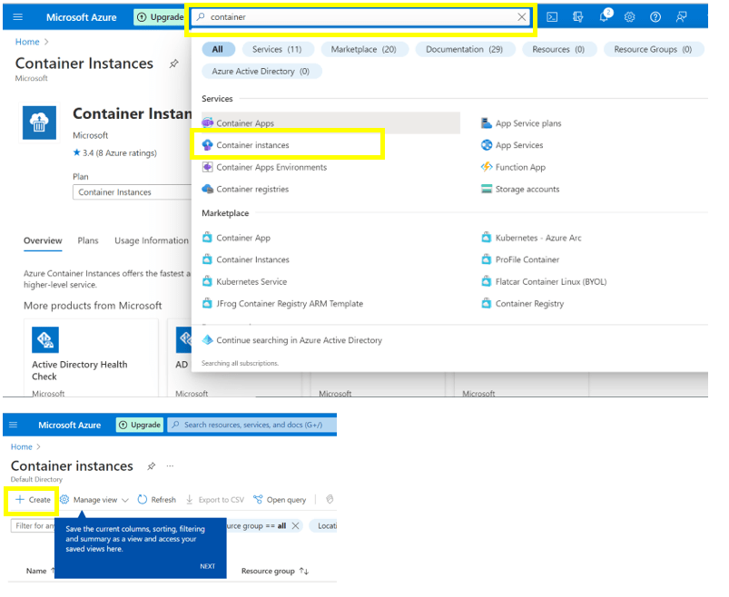

**_Step 2:_** On the basics page , enter the values required and navigate to the networking page .On the networking page select networking type as private and in dropdown select the Virtual  network for which the respective container instance is to be deployed.

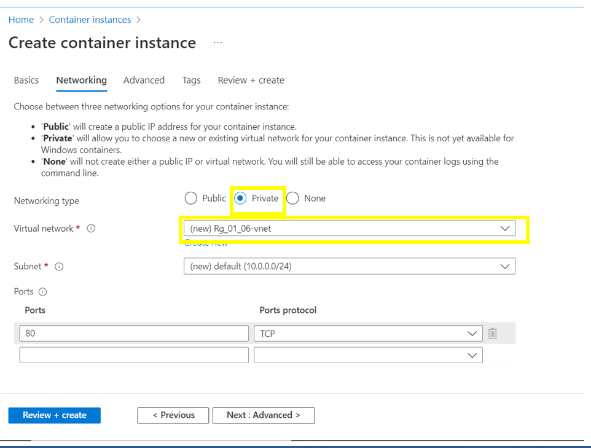

**_Step 3:_** After the required settings are configured, review the details entered and click on create to create the container instance which is deployed in the Virtual network.

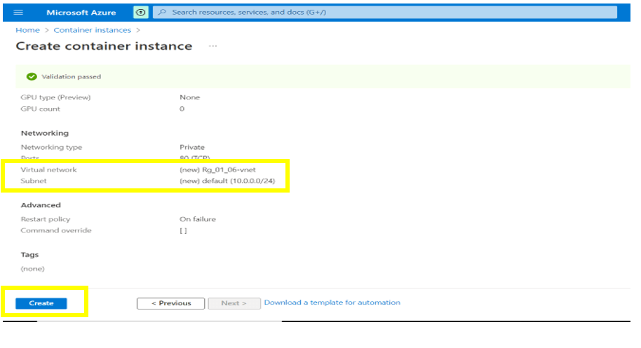

Step 4 : To ensure that Network security group are used to protect the container instance , create a NSG . In the search resource type NSG and select Network security group to navigate to NSG page.

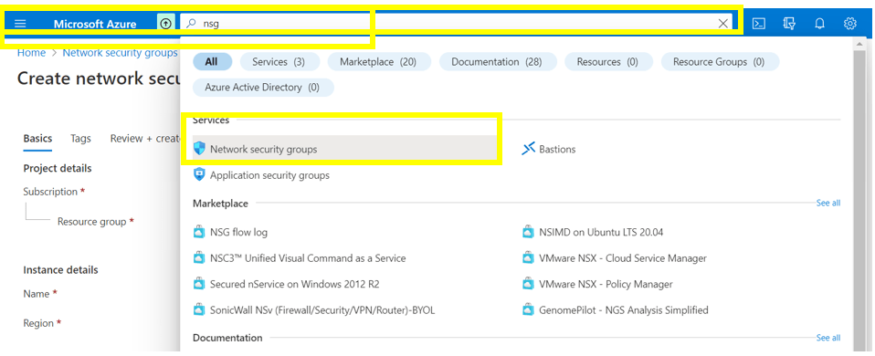

**_Step 5:_** Once you are navigated to creating the NSG , enter the details of the resource group and instance for which the NSG is needed to be linked with. Then review the details entered and click on ‘create’ to create the Network security group.

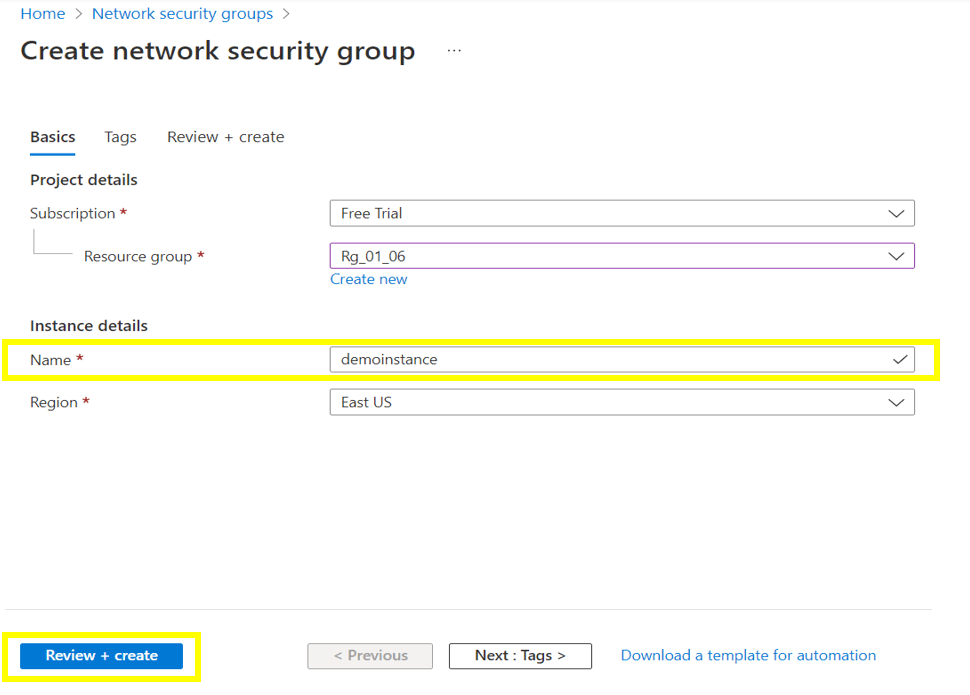

   

### 2. Ensure that private container registry is used to store the container images

**Security Control Mapping :**  
| Control Number | Control Statement | Security Domain | Default | Associated Runbook | CVSS Severity  |
| -------------- | ----------------- | --------------- | ------- | ------------------ | -------------- |
| CS0012300 | Cloud products and services must be deployed on private subnets and public access must be disabled for these services | Network and communication Security | Not enabled |Azure Container Registry Runbook | [High (7.2)](https://www.first.org/cvss/calculator/3.1#CVSS:3.1/AV:N/AC:H/PR:H/UI:N/S:C/C:H/I:L/A:L) |

**What, Why and How?**   

Container images consist of multiple software layers, and each software layer might have vulnerabilities. A private registry like Azure Container Registry or Docker Trusted Registry must be used to store and retrieve images to help reduce the threat of attacks.  Managed private registry supported by service principal-based authentication and role-based access for read-only (pull), write (push) can be used to secure the container images. Please refer ACR runbook for more details on private container Registry.
 
   

### 3. Ensure the application accessing the Azure container instances is running on a platform that supports TLS 1.2 or above

**Security Control Mapping :**  
| Control Number | Control Statement | Security Domain | Default | Associated Runbook | CVSS Severity  |
| -------------- | ----------------- | --------------- | ------- | ------------------ | -------------- |
| CS0012300 | Cloud products and services must be deployed on private subnets and public access must be disabled for these services | Network and communication Security| Not enabled | Virtual Network Runbook | [Medium (5.3)](https://www.first.org/cvss/calculator/3.1#CVSS:3.1/AV:A/AC:H/PR:H/UI:N/S:U/C:H/I:L/A:L) |

**Why?**  

Containers itself does not support TLS 1.2. In order to enable application to communicate with the container group with in organizational VNet using TL 1.2, The static private IP address exposed through application gateway and enabling TLS 1.2 on application gateway3.

Enabling TLS 1.2 on Container Group:  
https://docs.microsoft.com/en-us/azure/container-instances/container-instances-application-gateway  
https://docs.microsoft.com/en-us/azure/application-gateway/application-gateway-ssl-policy-overview  

**How?**  

(Note :To Ensure that  the application accessing the Azure container instances is running on a platform that supports TLS 1.2 or above it is required to enable the client apps and client and server operating system (OS) for TLS 1.2 and modern cipher suites.

When enabling TLS 1.2 for your Configuration Manager environment, start by ensuring the clients are capable and properly configured to use TLS 1.2 before enabling TLS 1.2 and disabling the older protocols on the site servers and remote site systems. There are three tasks for enabling TLS 1.2 on clients:

Update Windows and WinHTTP

Ensure that TLS 1.2 is enabled as a protocol for SChannel at the operating system level
Update and configure the .NET Framework to support TLS 1.2)

   

### 4. Ensure Azure container implements RBAC access control

**Security Control Mapping :**  
| Control Number | Control Statement | Security Domain | Default | Associated Runbook | CVSS Severity  |
| -------------- | ----------------- | --------------- | ------- | ------------------ | -------------- |
| CS0012300 | Cloud products and services must be deployed on private subnets and public access must be disabled for these services |Identity & Access Management | Not enabled | Virtual Network Runbook | [Medium (5.2)](https://www.first.org/cvss/calculator/3.1#CVSS:3.1/AV:L/AC:H/PR:H/UI:N/S:U/C:L/I:H/A:L) |

[Place Holder ]

**Following are the suggested RBAC roles for Azure Service Endpoints**  

| Function | Description | Role | 
| -------------- | ----------------- | --------------- | 
|  Network Admin | Lets you manage networks, but not access to them | [Network Contributor](https://github.com/MicrosoftDocs/azure-docs/blob/main/articles/role-based-access-control/built-in-roles.md#network-contributor) |
|  Container Admin |	Pull artifacts from a container registry | [ACR Pull](https://github.com/MicrosoftDocs/azure-docs/blob/main/articles/role-based-access-control/built-in-roles.md#acrpull) |

   

### 5. Ensure administrative tasks are performed only in admin-e workstations

**Security Control Mapping :**  
| Control Number | Control Statement | Security Domain | Default | Associated Runbook | CVSS Severity  |
| -------------- | ----------------- | --------------- | ------- | ------------------ | -------------- |
|  CS0012298	 | Access to change cloud identity access and service control policies is restricted to authorized cloud administrative personnel |  Identity & Access Management | Not enabled | None | [[Low (3.0)](https://www.first.org/cvss/calculator/3.1#CVSS:3.1/AV:L/AC:H/PR:H/UI:N/S:U/C:L/I:L/A:N)|

**Why?**  

A Privileged workstation provides a hardened workstation that has clear application control and application guard. The workstation uses credential guard, device guard, app guard, and exploit guard to protect the host from malicious behavior. All the administrative tasks must be performed only using the admin-e workstation

**How?**  

step 1 : Request permission to add the user to corresponding entitlements to access admin e workstation

Step 2 : Login to the workstation as the user and launch the azure portal in browser to perform administrative tasks 
[Place holder for link]

   

### 6. Ensure Azure container instance access is granted only using Managed Identities 

**Security Control Mapping :** 

| Control Number | Control Statement | Security Domain | Default | Associated Runbook | CVSS Severity  |
| -------------- | ----------------- | --------------- | ------- | ------------------ | -------------- |
|  CS0012298       | Access to change cloud identity access and service control policies is restricted to authorized cloud administrative personnel |Identity & Access Management | Not enabled | None | [Medium (5.1)](https://www.first.org/cvss/calculator/3.1#CVSS:3.1/AV:A/AC:H/PR:H/UI:N/S:C/C:L/I:L/A:L) |

**Why?**  

Managed identity enables Azure resources to authenticate to cloud services (e.g. Azure Key Vault) without storing credentials in code. Once enabled, all necessary permissions can be granted via Azure role-based-access-control. 
In system assigned managed identity, the lifecycle of this type of managed identity is tied to the lifecycle of this resource. Additionally, each resource (e.g. Virtual Machine) can only have one system assigned managed identity. 
In User assigned managed identity, managed identities are created as standalone Azure resources, and have their own lifecycle. A single resource (e.g. Virtual Machine) can utilize multiple user assigned managed identities. Similarly, a single user assigned managed identity can be shared across multiple resources.

**How?**  

**_Step 1:_** In the existing container Instance, navigate to Settings -> Identity . Under the system assigned , change the status to On 

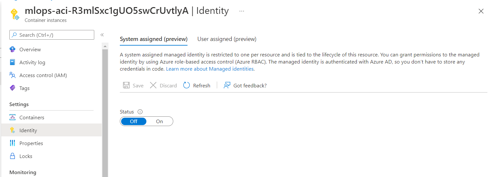

  

### 7. Ensure container administrative credentials are vaulted using enterprise vaulting solutions

**Security Control Mapping :** 

| Control Number | Control Statement | Security Domain | Default | Associated Runbook | CVSS Severity  |
| -------------- | ----------------- | --------------- | ------- | ------------------ | -------------- |
|  CS0012298       | Access to change cloud identity access and service control policies is restricted to authorized cloud administrative personnel |Identity & Access Management | Not enabled | None | [Medium (5.1)](https://www.first.org/cvss/calculator/3.1#CVSS:3.1/AV:A/AC:H/PR:H/UI:N/S:C/C:L/I:L/A:L) |

**Why?**  

Any application account credential used to access container instance should be vaulted using Cyberark to protect from in advertent exposure of credential.

**How?**  

To ensure container administrative credentials are vaulted using enterprise vaulting solutions create a Azure key vault. Securely store keys, passwords, certificates, and other secrets. Azure key vaults may be created and managed through the Azure portal .

**_Step 1:_** Navigate to your new key vault in the Azure portal. Once navigated to the key vault page, On the Key Vault settings pages, select Secrets. And Click on Generate/Import.

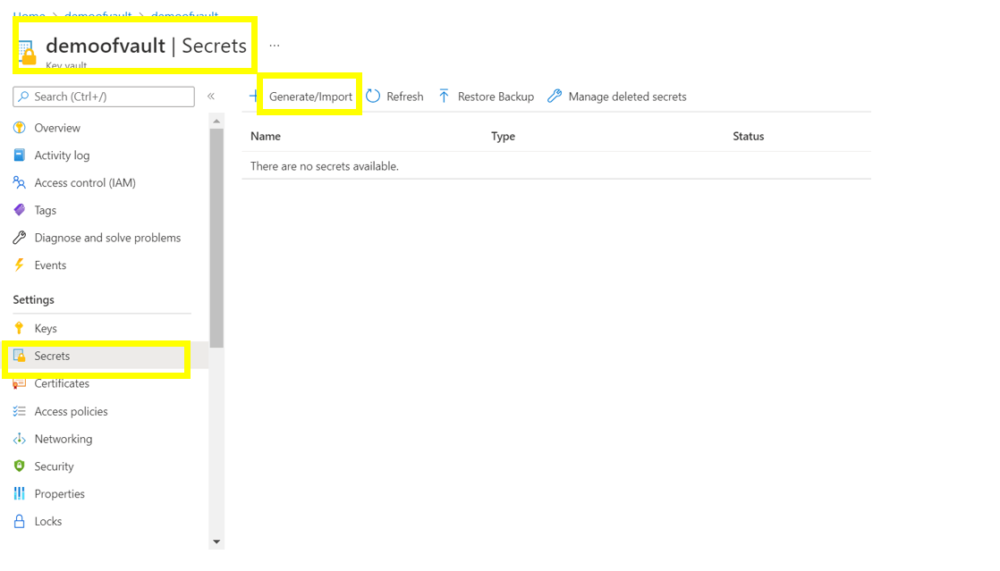

**_Step 2:_** On the Create a secret screen choose the required values , select Enabled to ‘yes’ and click on the ‘create’ button.

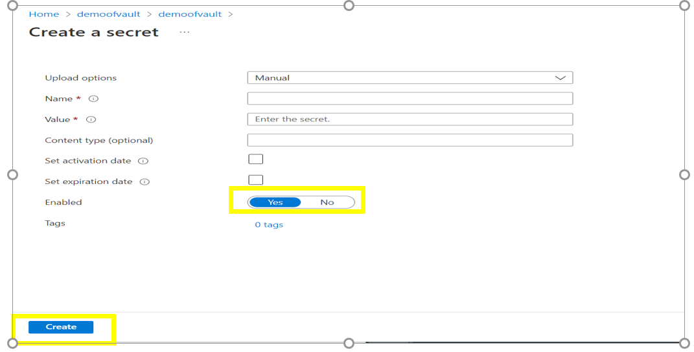

  

### 8. Ensure that Container Instance are integrated with Malware and Vulnerability Scanner tools

**Security Control Mapping :**   

| Control Number | Control Statement | Security Domain | Default | Associated Runbook | CVSS Severity  |
| -------------- | ----------------- | --------------- | ------- | ------------------ | -------------- |
|  [CS0012268](place holder)       |Vulnerability Assessments must be performed based on risk and findings must be addressed in accordance with Enterprise SLA's | Vulnerability Management | Not enabled | None | [Medium (5.0)](https://www.first.org/cvss/calculator/3.1#CVSS:3.1/AV:L/AC:H/PR:H/UI:N/S:C/C:L/I:L/A:L) |

**Why?**  

A thoroughly scanned image deployed in production is not guaranteed to be up-to-date for the lifetime of the application. Security vulnerabilities might be reported for layers of the image that were not previously known or were introduced after the production deployment. Container images deployed in production must be periodically audited to identify images that are out of date or have any malware running that might have exploited vulnerability or misconfiguration

**How?**  

**_Step 1:_** In the Azure portal, navigate to `Microsoft Defender for Cloud`. Select `Environment Settings` and choose subscription where container instance present

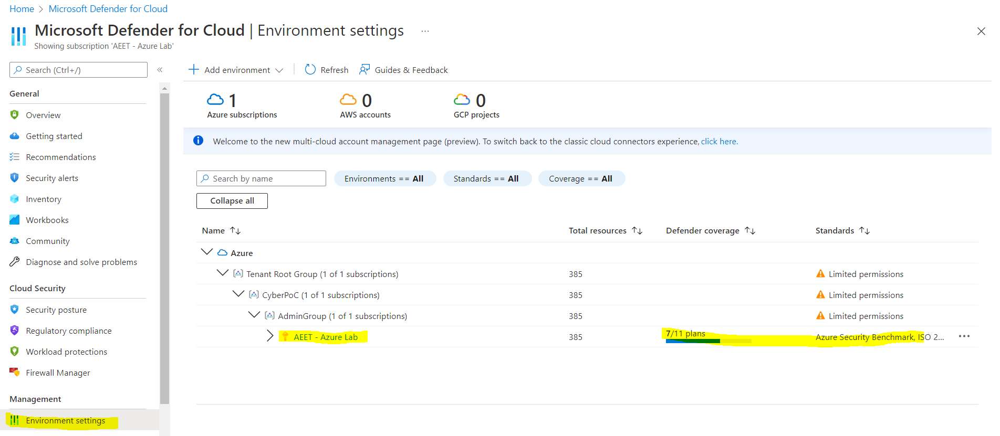

**_Step 2:_** On the setting page, turn `On` the Defenders for Containers. To enable Defeneder for Containers. Note: You can click on `View configuration` to further configure defender for AKS, this will be part of AKS runbook.

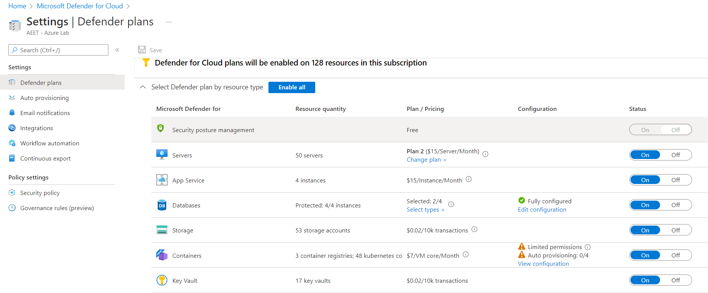

   

### 9. Ensure Azure Container Instances use standard organizational Resource tagging method

**Security Control Mapping :**  
| Control Number | Control Statement | Security Domain | Default | Associated Runbook | CVSS Severity  |
| -------------- | ----------------- | --------------- | ------- | ------------------ | -------------- |
| CS0012261  | Technology hardware and software must be registered and accurately recorded within the enterprise technology repository and/or asset management systems | Asset Management  | Not enabled | organizational Runbook | [Low (1.6)](https://www.first.org/cvss/calculator/3.1#CVSS:3.1/AV:P/AC:H/PR:H/UI:N/S:U/C:N/I:N/A:L) |

**Why, What and How ?** 
  
Client rationale and Justification
[Placeholder link]

   

### 10. Ensure only organization approved container images are used for deployment in production

**Security Control Mapping :** 

| Control Number | Control Statement | Security Domain | Default | Associated Runbook | CVSS Severity  |
| -------------- | ----------------- | --------------- | ------- | ------------------ | -------------- |
| [CS0012261](place holder)  | Technology hardware and software must be registered and accurately recorded within the enterprise technology repository and/or asset management systems | Asset Management  | Not enabled | Azure Container Registry Runbook | [Medium (5.0)](https://www.first.org/cvss/calculator/3.1#CVSS:3.1/AV:L/AC:H/PR:H/UI:N/S:C/C:L/I:L/A:L)  |

**Why?**

Organization approved Container images are the Azure Resource Manager templates of the Container which are customized and configured to meet the organization and compliance policies. New instances must be deployed only using these approved images promoting the uniformity and secured design. Patch updates and maintenance will be done to this approved container Images by Infrastructure team

**How?**  

To Ensure baseline container images are used for deployment, Enterprise should use Container regisrtry should be used to store baseline Container Images. For more details refer ACR runbook. Below Giudelines are developed to show how to create Registy and add baseline container to makesure baseline container image is available. However, this implementation will be part of ACR runbook.

**_Step 1:_**   Create an Azure Container Registry

**_Step 2:_**  Build and package an approved image using cloudshell and make sure it is reflecting in Repositories
  
 sample commands to create images :   _echo FROM mcr.microsoft.com/hello-world > Dockerfile_

   _az acr build --image sample/hello-world:v1 --registry myContainerRegistry008 --file Dockerfile ._

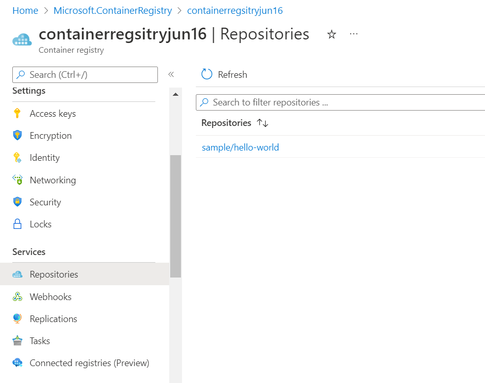

**_Step 3:_**   Navigate to Access Keys and Enable Admin User

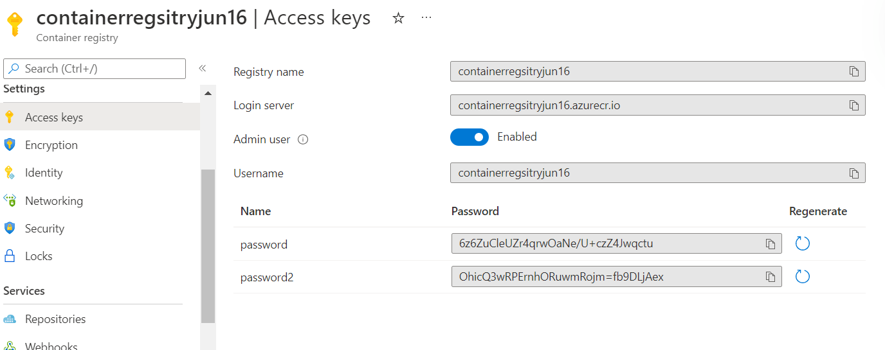

**_Step 4:_**   Create Azure Container Instance and select the approved image from Azure Container Registry

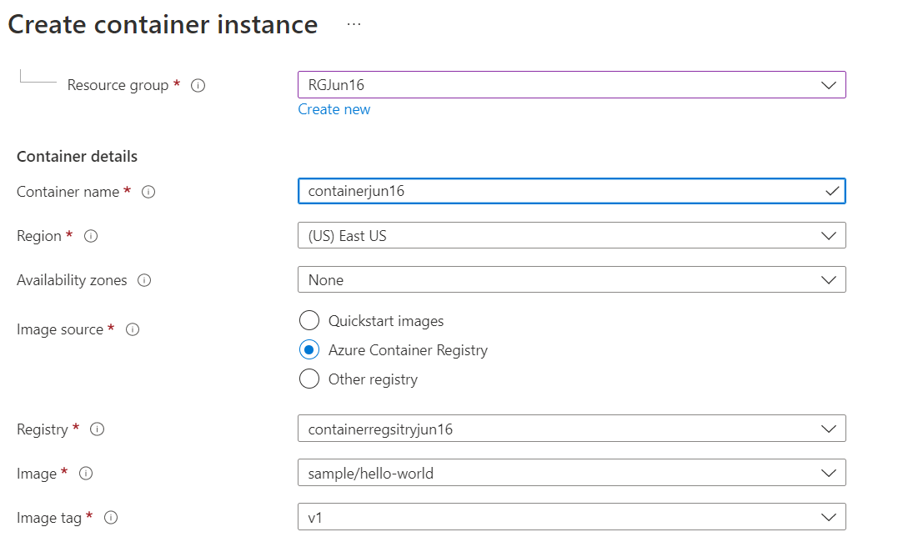

   

### 11. Ensure organizational CI/CD pipeline is integrated with Container vulnerability scanner to scan container images before deployment 

**Security Control Mapping :** 

| Control Number | Control Statement | Security Domain | Default | Associated Runbook | CVSS Severity  |
| -------------- | ----------------- | --------------- | ------- | ------------------ | -------------- |
|  [CS0012268](place holder)       |Vulnerability Assessments must be performed based on risk and findings must be addressed in accordance with Enterprise SLA's | Vulnerability Management | Not enabled | None | [Medium (5.0)](https://www.first.org/cvss/calculator/3.1#CVSS:3.1/AV:L/AC:H/PR:H/UI:N/S:C/C:L/I:L/A:L) |

**Why?**

Container vulnerability scanners like Qualys uses CI/CD plugins that can be integrated to Azure devops or Github actions to scan container Images before deploying any images to Enterprise Azure tenant. This ensures vulnerable container images are not deployed.

**How?**  

**_Step 1:_** In the search box, enter Microsoft defender and select the ‘Microsoft defender for cloud’.

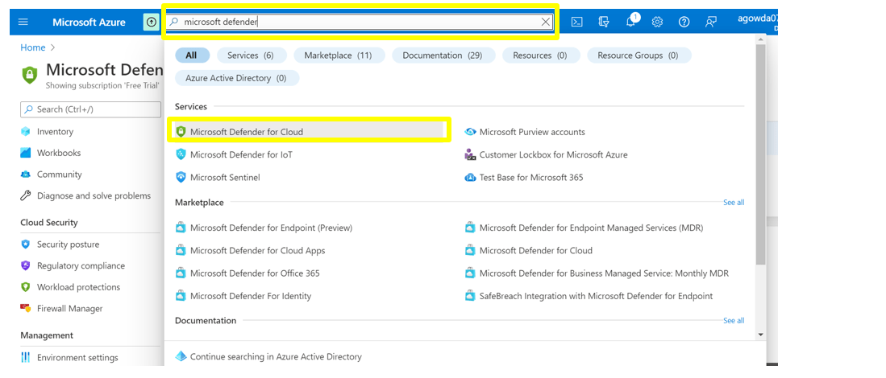

**_Step 2:_** Once you are navigated to Defender page , click on the ‘Environment settings’ tab . In that window select the subscription by clicking on the subscription name.

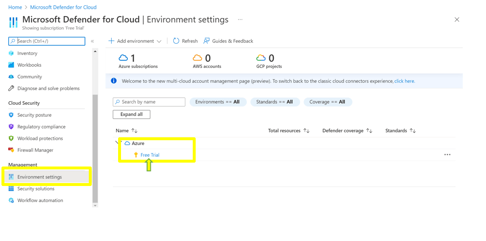

**_Step 3:_** After navigating to ‘Integrations’ tab, click on ‘Configure CI/CD integration’ which pops up a CI/CD integration window where configure the required settings and click on close button to close the window. 

Finally after all the controls are configured please ensure to click on save button to save the updated settings.

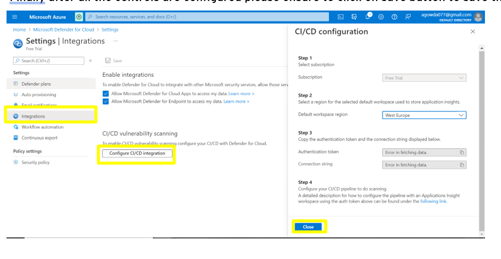

**_Step 4:_** Finally after all the controls are configured please ensure to click on save button to save the updated settings.

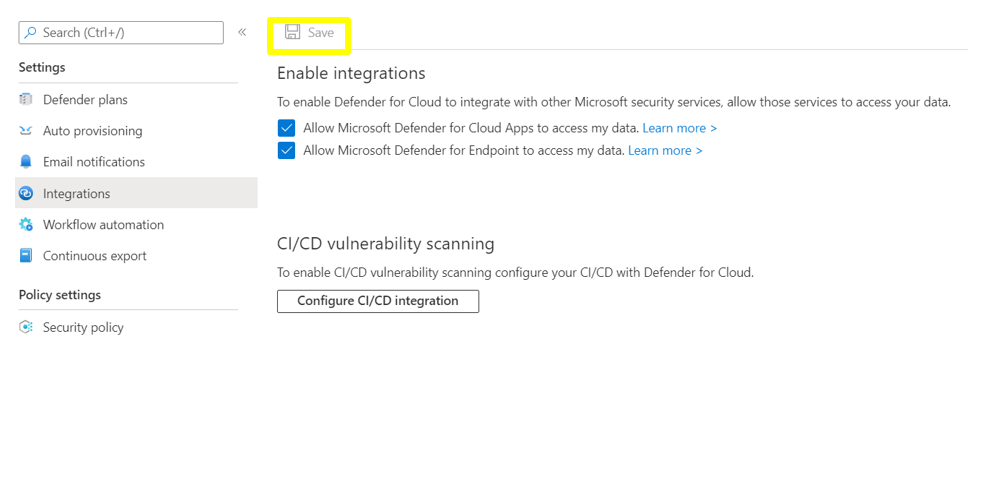

   

### 12. Ensure Activity logging is enabled for Azure Container Instance

**Security Control Mapping :**  
| Control Number | Control Statement | Security Domain | Default | Associated Runbook | CVSS Severity  |
| -------------- | ----------------- | --------------- | ------- | ------------------ | -------------- |
| CS0012233 | Information System must create a log and record activities occurring on or originating from the information system. Logs must be made accessible to the enterprise SIEM solution  | Security Information and event management   | Enabled but not forwarded to Splunk | None | [Low (2.7)](https://www.first.org/cvss/calculator/3.1#CVSS:3.1/AV:P/AC:H/PR:H/UI:N/S:U/C:L/I:N/A:L) |

**Why, What and How ?** 
  
Client rationale and Justification
[Placeholder link]

   

### 13. Ensure that Sensitive data is protected by using Secure Environment variables or Secret volumes in Azure Container Instance

**Security Control Mapping :**  
| Control Number | Control Statement | Security Domain | Default | Associated Runbook | CVSS Severity  |
| -------------- | ----------------- | --------------- | ------- | ------------------ | -------------- |
|  CS0012168       |Strong encryption key management controls are in place for cloud provider services to protect data at rest | Data Protection  | Not enabled | None | [Medium (5.3)](https://www.first.org/cvss/calculator/3.1#CVSS:3.1/AV:A/AC:H/PR:H/UI:N/S:U/C:H/I:L/A:L)  |

**Why?**   

Hard-coding or storing the passwords or other sensitive information in source code will result in sensitive data exposure and frequent source code modifications . So instead of setting the sensitive data directly in the configuration files , it should be referenced from environment variables or it can be retrieved from secret volume disk.

Environment variables with secure values aren't visible in the container's properties--their values can be accessed only from within the container. For example, container properties viewed in the Azure portal or Azure CLI display only a secure variable's name, not its value.

The secret volume stores the secrets in files within the volume, accessible by the containers in the container group. By storing secrets in a secret volume,  sensitive data like SSH keys or database credentials will not be added to the application code.
 
**How?**  

**Setting Secure Environment values**  
**_Step 1:_** In the search resource , search for container instance and select the container instance . Once you are navigated to the container instance page click on ‘create’ to get started with container instance. Fill the basic and netoorking details.
In advanced tab , Select 'Marks as secure:' as 'Yes' and enter the Sensitive Key and Value and check whether the value is masked. 

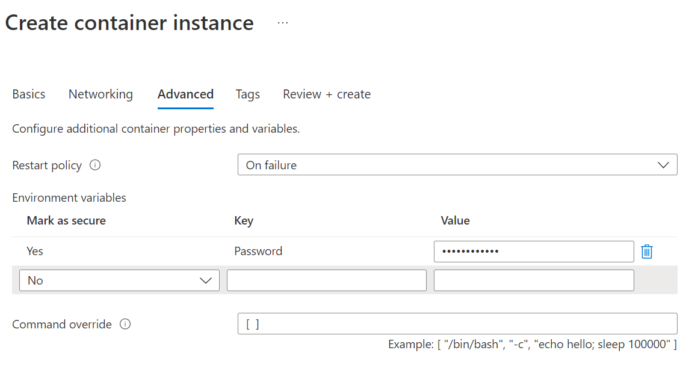 

**Mounting Secret Volume**  
**_Step 2:_** Navigate to Cloudshell or azure CLI .To deploy a container with one or more secrets by using the Azure CLI, include the --secrets and --secrets-mount-path parameters in the az container create command. 

Note : Secret volumes are currently restricted to Linux containers only. 

_This example mounts a secret volume consisting of two files containing secrets, "mysecret1" and "mysecret2," at /mnt/secrets:_

_az container create --resource-group myResourceGroup --name secret-volume-demo --image mcr.microsoft.com/azuredocs/aci-helloworld   --secrets mysecret1="My first secret FOO" mysecret2="My second secret BAR" --secrets-mount-path /mnt/secrets_

Refer the below links for more information  
 - https://docs.microsoft.com/en-us/azure/container-instances/container-instances-environment-variables#secure-values 
 - https://docs.microsoft.com/en-us/azure/container-instances/container-instances-volume-secret#mount-secret-volume---azure-cli

