# Azure Container Registry - Security baseline requirement <!-- omit in toc -->
## Baseline security configuration requirement for Azure services  <!-- omit in toc -->

**Generated By: EY Security Team**  
**Service Type: Containers**  
**Deployment Phase: Service Discovery**   
**Last updated: 05/12/2022**  

## Table of Contents <!-- omit in toc -->

- [Overview](#overview)
  - [Use Case Examples:](#use-case-examples)
- [Cloud Security Requirements](#cloud-security-requirements)
  - [1. Ensure that Azure container registry is deployed using private Endpoint](#1-ensure-that-azure-container-registry-is-deployed-using-private-endpoint)
  - [2. Ensure TLS 1.2 to protect data in transit in ACR is enabled by using latest docker client version](#2-ensure-tls-12-to-protect-data-in-transit-in-acr-is-enabled-by-using-latest-docker-client-version)
  - [3. Ensure Azure container Registry implements Role Based Access Control](#3-ensure-azure-container-registry-implements-role-based-access-control)
  - [4. Ensure administrative tasks are performed only in admin-e workstations](#4-ensure-administrative-tasks-are-performed-only-in-admin-e-workstations)
  - [5. Ensure Azure container Registry access is granted only using Managed Identities](#5-ensure-azure-container-registry-access-is-granted-only-using-managed-identities)
  - [6. Ensure that Container Registry authentication is disabled and uses Azure Active Directory (Azure AD) service principal for Admin Authentication](#6-ensure-that-container-registry-authentication-is-disabled-and-uses-azure-active-directory-azure-ad-service-principal-for-admin-authentication)
  - [7. Ensure Diagnostic logs for 'ContainerRegistryRepositoryEvents' and 'ContainerRegistryLoginEvents' are enabled and are forwarded to Splunk](#7-ensure-diagnostic-logs-for-containerregistryrepositoryevents-and-containerregistryloginevents-are-enabled-and-are-forwarded-to-splunk)
  - [8. Ensure Azure Container Registry use standard organizational Resource tagging method](#8-ensure-azure-container-registry-use-standard-organizational-resource-tagging-method)
  - [9. Ensure Container Registry is Continually monitored using Malware and Vulnerability scanning tools](#9-ensure-container-registry-is-continually-monitored-using-malware-and-vulnerability-scanning-tools)
  - [10. Ensure content trust is enabled in Azure Container Registry](#10-ensure-content-trust-is-enabled-in-azure-container-registry)
  - [11. Ensure CI pipeline is integrated with security scanning before pushing to private registry](#11-ensure-ci-pipeline-is-integrated-with-security-scanning-before-pushing-to-private-registry)
  - [12. Ensure Container images in registry are Encrypted with Customer Managed Keys](#12-ensure-container-images-in-registry-are-encrypted-with-customer-managed-keys)
  - [13. Ensure token or service map is used to access the specific Repositories in Registry](#13-ensure-token-or-service-map-is-used-to-access-the-specific-repositories-in-registry)
  - [14. Ensure Activity logging is enabled for Azure Container Registry](#14-ensure-activity-logging-is-enabled-for-azure-container-registry)
  - [15. Ensure container images or repository is locked and exportPolicy is disabled for container registry](#15-ensure-container-images-or-repository-is-locked-and-exportpolicy-is-disabled-for-container-registry)

##  Overview

Azure Container Registry is a managed, private Docker registry service based on the open-source Docker Registry 2.0. Azure container registries can be created and maintained to store and manage the private Docker container images and related artifacts. Azure container registries can also be used with existing container development and deployment pipelines. 

| Control Number | Cloud Baseline Security Requirements                                                                                                            |
| -------------- | ----------------------------------------------------------------------------------------------------------------------------------------------- |
| 1              | Ensure that Azure container registry is deployed using private Endpoint                                                                         |
| 2              | Ensure TLS 1.2 to protect data in transit in ACR is enabled by using latest docker client version                                               |
| 3              | Ensure Azure container Registry implements Role Based Access Control                                                                            |
| 4              | Ensure administrative tasks are performed only in admin-e workstations                                                                          |
| 5              | Ensure Azure container Registry access is granted only using Managed Identities                                                                 |
| 6              | Ensure that Container Registry authentication is disabled and uses Azure Active Directory (Azure AD) service principal for Admin Authentication |
| 7              | Ensure Diagnostic logs for 'ContainerRegistryRepositoryEvents' and 'ContainerRegistryLoginEvents' are enabled and are forwarded to Splunk       |
| 8              | Ensure Azure Container Registry use standard organizational Resource tagging method                                                             |
| 9              | Ensure Container Registry is Continually monitored using Malware and Vulnerability scanning tools                                               |
| 10             | Ensure content trust is enabled in Azure Container Registry                                                                                     |
| 11             | Ensure CI pipeline is integrated with security scanning before pushing to private registry                                                      |
| 12             | Ensure Container images in registry are Encrypted with Customer Managed Keys                                                                    |
| 13             | Ensure token or service map is used to access the specific Repositories in Registry                                                             |
| 14             | Ensure Activity logging is enabled for Azure Container Registry                                                                                 |
| 15             | Ensure container images or repository is locked and exportPolicy is disabled for container registry                                             |

### Use Case Examples:
- Microservices with AKS and Azure DevOps
- Deploy machine learning models to AKS with Kubeflow
- Real-time scoring of R machine learning models
- Serverless batch processing with Durable Functions in Azure Container Instances

## Cloud Security Requirements ##

### 1. Ensure that Azure container registry is deployed using private Endpoint

**Security Control Mapping :**  
| Control Number | Control Statement | Security Domain | Default | Associated Runbook | CVSS Severity  |
| -------------- | ----------------- | --------------- | ------- | ------------------ | -------------- |
| CS0012300 | Cloud products and services must be deployed on private subnets and public access must be disabled for these services | Network and communication Security | Not enabled |Private Endpoint Runbook | [High (7.2)](https://www.first.org/cvss/calculator/3.1#CVSS:3.1/AV:N/AC:H/PR:H/UI:N/S:C/C:H/I:L/A:L) |

**Why?**   

Access to azure container registry must be limited by assigning virtual network private IP addresses to the registry endpoints using Azure Private Link. Private endpoint will provide a endpoint with Private IP which can be associated with VNet with in tenant, other tenant or from On premise, eliminating exposure from the public internet.  To connect to the Azure service over private endpoint,  DNS settings must be configured via private DNS zones.  Fully qualified domain name (FQDN) for the connection must be mentioned in the DNS settings which resolves to the private IP address of the private endpoint.Security can be enhanced by migrating from public endpoint to private endpoint which must be resolved using Private DNS
    
**Note :** Private access is only available for Premium SKU of Azure Container Repository

**How?**  

**_Step 1:_** Open Azure portal https://portal.azure.com/ 

**_Step 2:_** Create container registry and select Premium SKU (Private access will be enable only in premium sku)

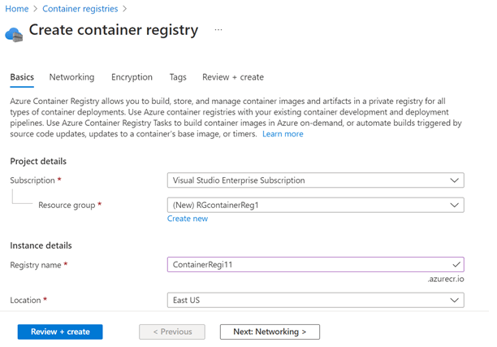

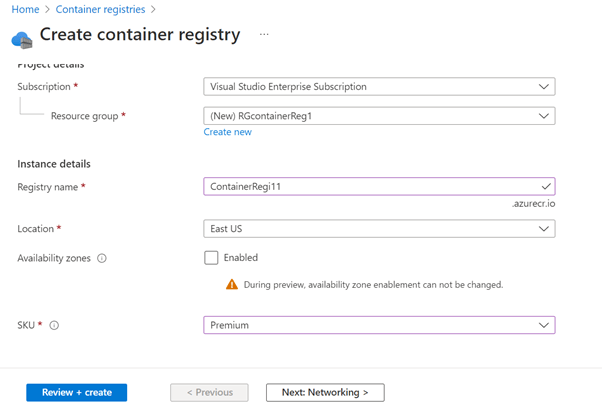

**_Step 3:_** Select private access and click add private endpoint.

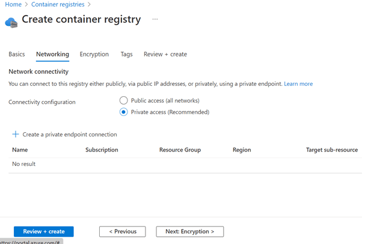

   

### 2. Ensure TLS 1.2 to protect data in transit in ACR is enabled by using latest docker client version 

**Security Control Mapping :**  
| Control Number | Control Statement | Security Domain | Default | Associated Runbook | CVSS Severity  |
| -------------- | ----------------- | --------------- | ------- | ------------------ | -------------- |
|  CS0012168       |Strong encryption key management controls are in place for cloud provider services to protect data at rest | Data Protection  | Not enabled | None | [Medium (5.3)](https://www.first.org/cvss/calculator/3.1#CVSS:3.1/AV:A/AC:H/PR:H/UI:N/S:U/C:H/I:L/A:L)  |

**Why?**  

Azure Container Registry enforces data encryption in transit by using the Transport Layer Security (TLS) protocol to protect communication from Azure container Registry to servers and applications. TLS 1.2 must be used as the secure encryption in transit for all the Container Registry connections from servers and applications to improve the security posture of the environment and also to remain in compliance with industry standards or organization requirements. TLS 1.2 must be enabled in the Azure container registry by using docker client of version 18.03.0 or later. 

**How?**  

**_Step 1:_** Azure Container Registry enforces data encryption in transit to the service and requires all secure connections from servers and applications to use TLS 1.2. Enable TLS 1.2 by using any recent docker client (version 18.03.0 or later).

   

### 3. Ensure Azure container Registry implements Role Based Access Control 

**Security Control Mapping :**  
| Control Number | Control Statement | Security Domain | Default | Associated Runbook | CVSS Severity  |
| -------------- | ----------------- | --------------- | ------- | ------------------ | -------------- |
| CS0012300 | Cloud products and services must be deployed on private subnets and public access must be disabled for these services |Identity & Access Management | Not enabled | Virtual Network Runbook | [Medium (5.2)](https://www.first.org/cvss/calculator/3.1#CVSS:3.1/AV:L/AC:H/PR:H/UI:N/S:U/C:L/I:H/A:L) |

[Place Holder ]
        
**Following are the suggested RBAC roles for Azure Container Registry**  
| Function | Description | Role | 
| -------------- | ----------------- | --------------- | 
|  Network admin | Lets you manage networks, but not access to them | [Network Contributor](https://github.com/MicrosoftDocs/azure-docs/blob/main/articles/role-based-access-control/built-in-roles.md#network-contributor) |
|  Repository Admin |Delete repositories, tags, or manifests from a container registry | [ACRDelete](https://github.com/MicrosoftDocs/azure-docs/blob/main/articles/role-based-access-control/built-in-roles.md#acrdelete) |
|  Container Admin |  Push trusted images to or pull trusted images from a container registry enabled for content trust | [AcrImageSigner](https://github.com/MicrosoftDocs/azure-docs/blob/main/articles/role-based-access-control/built-in-roles.md#acrimagesigner) |
|  Container Developer |  	Push artifacts to or pull artifacts from a container registry | [AcrPush](https://github.com/MicrosoftDocs/azure-docs/blob/main/articles/role-based-access-control/built-in-roles.md#acrpush) |

   

### 4. Ensure administrative tasks are performed only in admin-e workstations 

**Security Control Mapping :**  
| Control Number | Control Statement | Security Domain | Default | Associated Runbook | CVSS Severity  |
| -------------- | ----------------- | --------------- | ------- | ------------------ | -------------- |
|  CS0012298	 | Access to change cloud identity access and service control policies is restricted to authorized cloud administrative personnel |  Identity & Access Management | Not enabled | None | [Low (3.0)](https://www.first.org/cvss/calculator/3.1#CVSS:3.1/AV:L/AC:H/PR:H/UI:N/S:U/C:L/I:L/A:N)|

**Why?**  

A Privileged workstation provides a hardened workstation that has clear application control and application guard. The workstation uses credential guard, device guard, app guard, and exploit guard to protect the host from malicious behavior. All the administrative tasks must be performed only using the admin-e workstation

**How?**  

**_Step 1:_**  Request permission to add the user to corresponding entitlements to access admin e workstation

**_Step 2:_**  Login to the workstation as the user and launch the azure portal in browser to perform administrative tasks 

   

### 5. Ensure Azure container Registry access is granted only using Managed Identities

**Security Control Mapping :** 

| Control Number | Control Statement | Security Domain | Default | Associated Runbook | CVSS Severity  |
| -------------- | ----------------- | --------------- | ------- | ------------------ | -------------- |
|  CS0012298       | Access to change cloud identity access and service control policies is restricted to authorized cloud administrative personnel |Identity & Access Management | Not enabled | None | [Medium (5.1)](https://www.first.org/cvss/calculator/3.1#CVSS:3.1/AV:A/AC:H/PR:H/UI:N/S:C/C:L/I:L/A:L) |

**Why?**  

Managed identity enables Azure resources to authenticate to cloud services (e.g. Azure Key Vault) without storing credentials in code. Once enabled, all necessary permissions can be granted via Azure role-based-access-control. 
In system assigned managed identity, the lifecycle of this type of managed identity is tied to the lifecycle of this resource. Additionally, each resource (e.g. Virtual Machine) can only have one system assigned managed identity. 
In User assigned managed identity, managed identities are created as standalone Azure resources, and have their own lifecycle. A single resource (e.g. Virtual Machine) can utilize multiple user assigned managed identities. A single user assigned managed identity can be shared across multiple resources.
To access the container images from the container registry, An user-assigned or system-assigned managed identity must be setup on a Linux VM. Similarly an Azure Kubernetes Service cluster must be setup to use the managed identity to pull container images from Azure Container Registry for pod deployments.

**How?**  

**_Step 1:_** Open Azure portal https://portal.azure.com/ 

**_Step 2:_** Go to all resources and select container registry

**_Step 3:_** Select Identity option at right hand side pane, Click on user assigned and click add button to select managed identity user.

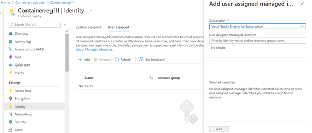

  

### 6. Ensure that Container Registry authentication is disabled and uses Azure Active Directory (Azure AD) service principal for Admin Authentication

**Security Control Mapping :**  
| Control Number | Control Statement | Security Domain | Default | Associated Runbook | CVSS Severity  |
| -------------- | ----------------- | --------------- | ------- | ------------------ | -------------- |
|  CS0012298	    | Access to change cloud identity access and service control policies is restricted to authorized cloud administrative personnel |  Identity & Access Management | Not enabled | None | [Medium (5.1)](https://www.first.org/cvss/calculator/3.1#CVSS:3.1/AV:A/AC:H/PR:H/UI:N/S:C/C:L/I:L/A:L)  |

**Why?**  

Admin authentication must be disabled as enabling it allows a single username/pass combination can access everything in the Container Registry.It becomes challenging to understand what user or system really initiated the request to your registry without additional thorough logging, as the username in the log will just be the admin user, not the initial caller. Hence Admin authentication must be disabled and Azure Active Directory authentication must be used to connect to Azure container registry by using identities in Azure Active Directory (Azure AD). With Azure AD authentication, identities of users and other Microsoft services can be managed in one central location which simplifies permission management. 

**How?**  

**_Step 1:_** Disable the admin user in the Azure portal by navigating to container registry -> access keys

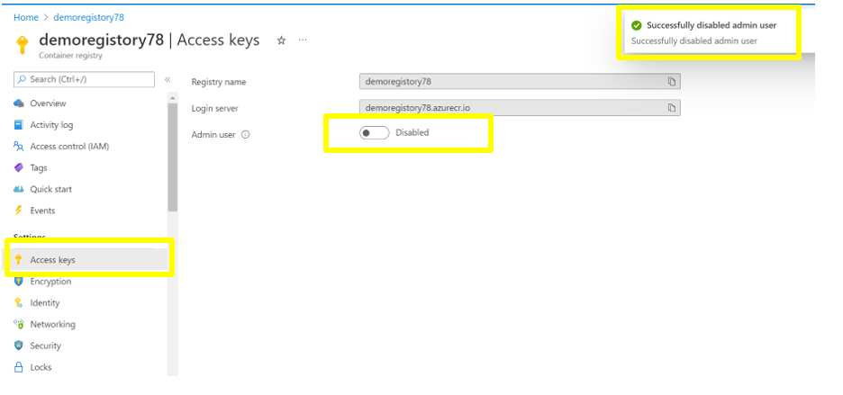

**_Step 2:_** Logging to the Azure portal and Navigate to  Azure Active Directory -> App Registration -> New registration and Register an application

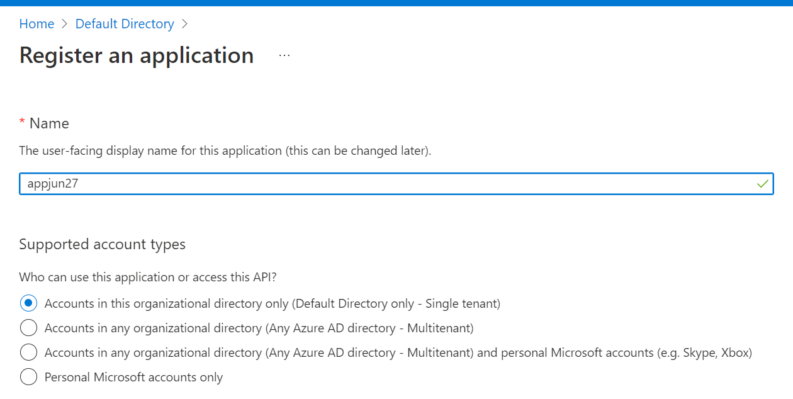

**_Step 3:_** Go to Certificates & Secrets and create a new client secret and click Add

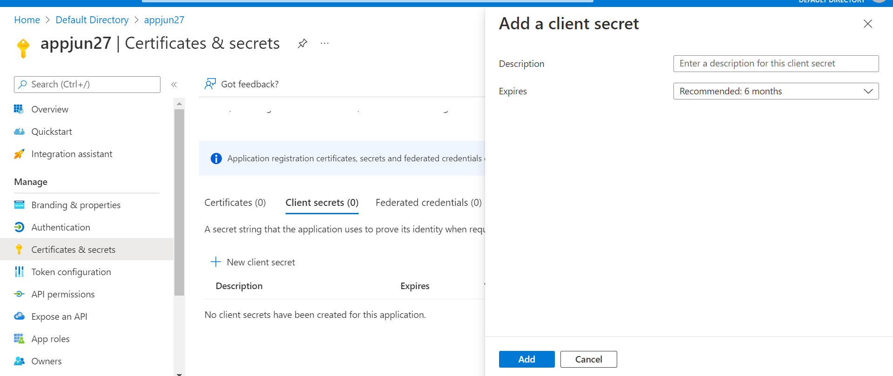

**_Step 4:_** Navigate to the container registry -> Access control(IAM) -> add role assignment to add the role to service principal created in step 2

   

### 7. Ensure Diagnostic logs for 'ContainerRegistryRepositoryEvents' and 'ContainerRegistryLoginEvents' are enabled and are forwarded to Splunk

**Security Control Mapping :**  
| Control Number | Control Statement | Security Domain | Default | Associated Runbook | CVSS Severity  |
| -------------- | ----------------- | --------------- | ------- | ------------------ | -------------- |
| CS0012233 | Information System must create a log and record activities occurring on or originating from the information system. Logs must be made accessible to the enterprise SIEM solution  | Security Information and event management  | Not Enabled | Network Watcher Runbook | [Low (2.7)](https://www.first.org/cvss/calculator/3.1#CVSS:3.1/AV:P/AC:H/PR:H/UI:N/S:U/C:L/I:N/A:L) |

**Why?**  
  
The event log contains information about the api objects which include pods, services, replicationcontrollers, and other This logs when forwarded to Splunk provide necessary information to create notable alerts for any rule created to allow connection from internet

**How?**  

**_Step 1:_** Go to Azure portal to open container registry 

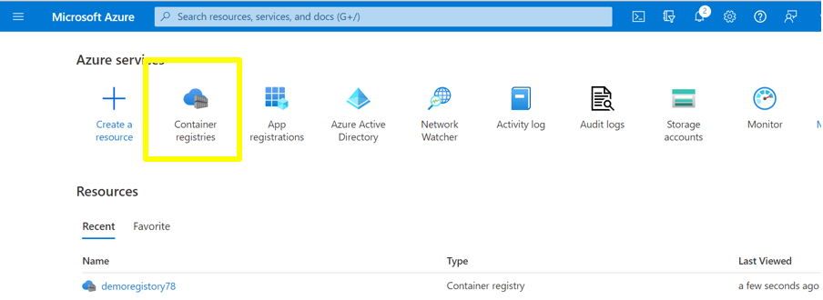

**_Step 2:_** Click on container registry then click on Diagnostic settings.

**_Step 3:_** Add Diagnostic setting.

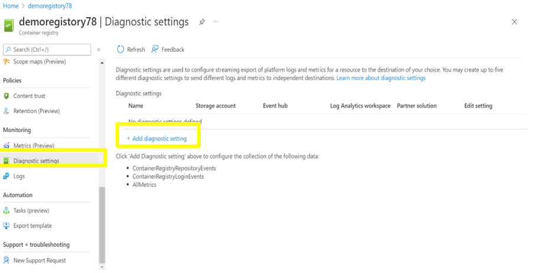

**_Step 4:_** Check 'ContainerRegistryRepositoryEvents' and ContainerRegistryLoginEvents' to enable.Select Stream to an Event hub. Choose the Eventhub namespace and Click on save button. 

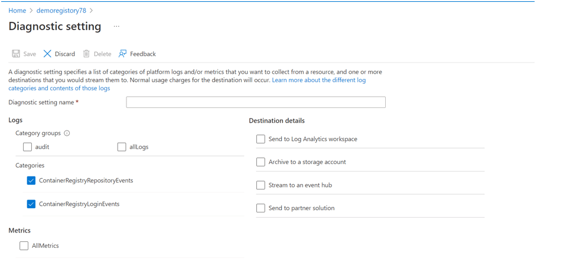

  

### 8. Ensure Azure Container Registry use standard organizational Resource tagging method

**Security Control Mapping :**  

| Control Number | Control Statement | Security Domain | Default | Associated Runbook | CVSS Severity  |
| -------------- | ----------------- | --------------- | ------- | ------------------ | -------------- |
| CS0012261  | Technology hardware and software must be registered and accurately recorded within the enterprise technology repository and/or asset management systems | Asset Management  | Not enabled | organizational Runbook | [Low (1.6)](https://www.first.org/cvss/calculator/3.1#CVSS:3.1/AV:P/AC:H/PR:H/UI:N/S:U/C:N/I:N/A:L) |

**Why, What and How ?** 
  
Client rationale and Justification
[Placeholder link]

### 9. Ensure Container Registry is Continually monitored using Malware and Vulnerability scanning tools

**Security Control Mapping :** 

| Control Number | Control Statement | Security Domain | Default | Associated Runbook | CVSS Severity  |
| -------------- | ----------------- | --------------- | ------- | ------------------ | -------------- |
|  CS0012268     | Vulnerability Assessments must be performed based on risk and findings must be addressed in accordance with Enterprise SLA's | Vulnerability Management | Not enabled | None | [Medium (5.0)](https://www.first.org/cvss/calculator/3.1#CVSS:3.1/AV:L/AC:H/PR:H/UI:N/S:C/C:L/I:L/A:L) |

**Why?** 

Organization Anti malware and vulnerability tools are the required security intelligence that detects unusual and potentially harmful attempts to access or exploit the Container Registries. It uses advanced threat detection capabilities and Microsoft Threat Intelligence data to provide contextual security alerts. Those alerts also include steps to mitigate the detected threats and prevent future attacks. Microsoft Defender for Container must be enabled at either the subscription level (recommended) or the resource level to analyze ,detect and remediate the threats.

**How?**  

Following example provides details steps on how to Integrate Azure Microsoft defender for Cloud for  CI/CD pipeline, However, It is not mandatory to use Microsoft Defender for cloud for all the CI/CD pipeline. Depending on Individual application team use case, team can work with Security team to get approval on different security tools to be integrated to CI/CD pipeline

**_Step 1:_** Search for the Microsoft defender for Cloud and enter 

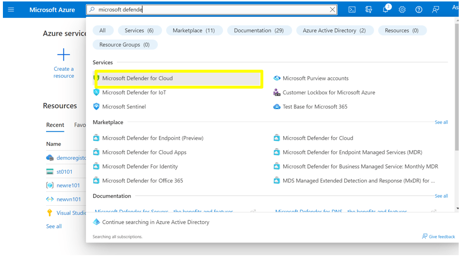

**_Step 2:_** Select Environment Settings and the Subscription. 

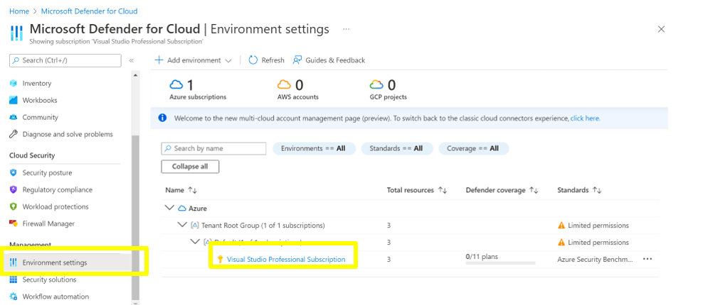

**_Step 3:_** Inside the Subscription click on the defender plans.

**_Step 4:_** Search container and on the Status.

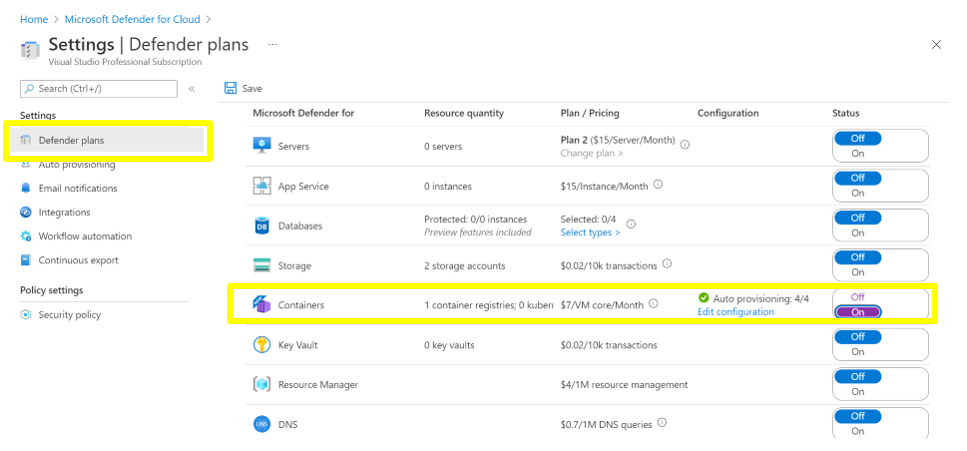

   

### 10. Ensure content trust is enabled in Azure Container Registry ###

**Security Control Mapping :**  
| Control Number | Control Statement | Security Domain | Default | Associated Runbook | CVSS Severity  |
| -------------- | ----------------- | --------------- | ------- | ------------------ | -------------- |
| CS0012133 | Information systems are hardened and configured to align with enterprise requirements | Configuration Management | Not enabled | None | [Medium (5.0)](https://www.first.org/cvss/calculator/3.1#CVSS:3.1/AV:L/AC:H/PR:H/UI:N/S:C/C:L/I:L/A:L)|

**Why?** 

Consumers of the data must be able to verify both the publisher (source) of the data, as well as ensure it's not been modified after it was published (integrity). As an image publisher, content trust allows to sign the images to be pushed to container registry. Consumers of images (people or systems pulling images from your registry) must be configured to pull only signed images. When an image consumer pulls a signed image, their Docker client verifies the integrity of the image. In this model, consumers are assured that the signed images in the registry were indeed published by authorized person, and that they've not been modified since being published.Content trust works with the tags in a repository. Image repositories can contain images with both signed and unsigned tags.

**How?**  

**_Step 1:_** Go to Content registry.

**_Step 2:_** And select the Azure content registry created. 

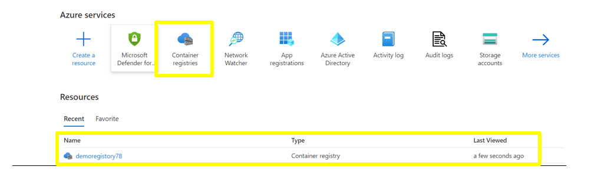

**_Step 3:_** Go to content trust and enable it. 

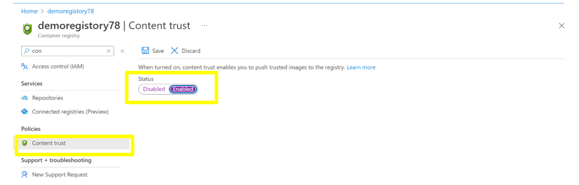

   

### 11. Ensure CI pipeline is integrated with security scanning before pushing to private registry

**Security Control Mapping :**  

| Control Number | Control Statement | Security Domain | Default | Associated Runbook |
| ----------------- | --------------- |----------- |----------|-----------|
|  CS0012268     | Vulnerability Assessments must be performed based on risk and findings must be addressed in accordance with Enterprise SLA's | Vulnerability Management | Not enabled | None |[Medium (5.3)](https://www.first.org/cvss/calculator/3.1#CVSS:3.1/AV:A/AC:H/PR:H/UI:N/S:U/C:H/I:L/A:L) |

**Why?**  

Continuous Integration (CI) pipeline must be used with integrated security scanning to build secure images and push them to Azure Container registry. The vulnerability scanning built into the CI solution ensures that images that pass all the tests are pushed to the private registry from which production workloads are deployed.

**How?**  

Following example provides details steps on how to Integrate Azure Microsoft defender for Cloud for  CI/CD pipeline, However, It is not mandatory to use Microsoft Defender for cloud for all the CI/CD pipeline. Depending on Individual application team use case, team can work with Security team to get approval on different security tools to be integrated to CI/CD pipeline 

**_Step 1:_** Search for Microsoft Defender for cloud 

**_Step 2:_** Go to environment setting and click on the Subscription.

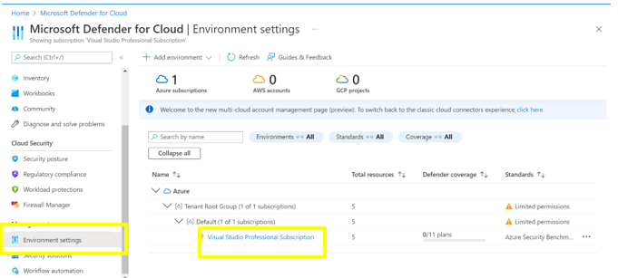

**_Step 3:_** In the Subscription you can see Integration and the Configure CI pipeline

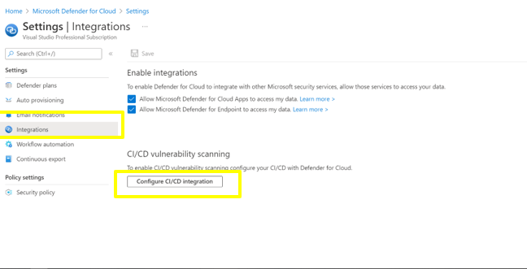

**_Step 4:_** Configure it close and save.

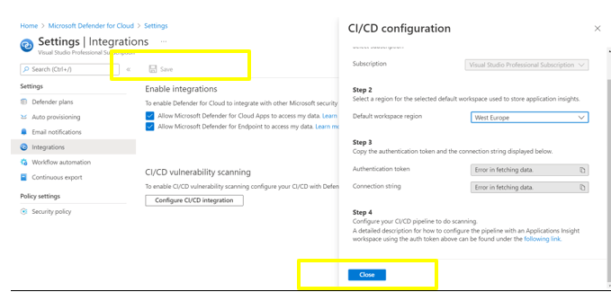

   

### 12. Ensure Container images in registry are Encrypted with Customer Managed Keys

**Security Control Mapping :**  

| Control Number | Control Statement | Security Domain | Default | Associated Runbook | CVSS Severity  |
| -------------- | ----------------- | --------------- | ------- | ------------------ | -------------- |
|  CS0012168     |Strong encryption key management controls are in place for cloud provider services to protect data at rest | Data Protection  | Not enabled | None | [Medium (5.3)](https://www.first.org/cvss/calculator/3.1#CVSS:3.1/AV:A/AC:H/PR:H/UI:N/S:U/C:H/I:L/A:L)  |

**Why?**  

By default, images stored in the Azure Container registry is encrypted using Microsoft Managed Keys at rest.All object metadata is also encrypted. However, if you want to control and manage this encryption key yourself, customer-managed key must be managed by the organization
that key must be used to protect and control access to the key that encrypts the secrets. 

**Note :** Customer-Managed Key is only available for Premium SKU of Azure Container Repository

**How?**  

**_Step 1:_** While creating the registry in encryption enable the customer managed key.

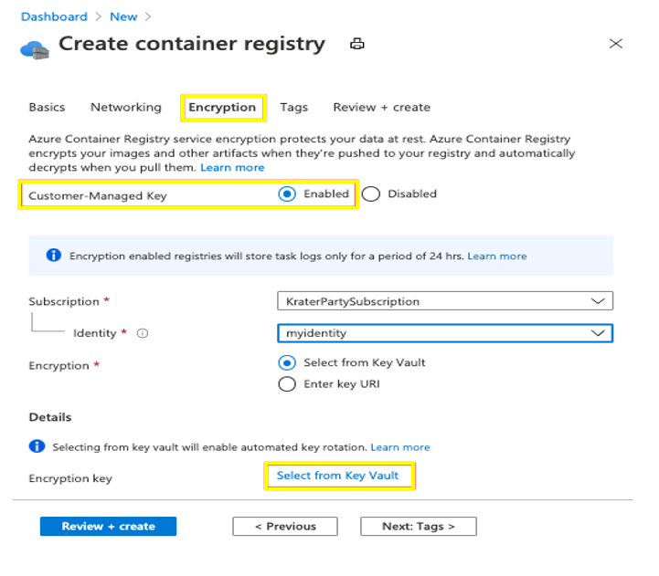

   

### 13. Ensure token or service map is used to access the specific Repositories in Registry

**Security Control Mapping :**  
| Control Number | Control Statement | Security Domain | Default | Associated Runbook | CVSS Severity  |
| -------------- | ----------------- | --------------- | ------- | ------------------ | -------------- |
|  CS0012298	 | Access to change cloud identity access and service control policies is restricted to authorized cloud administrative personnel |  Identity & Access Management | Not enabled | None | [Medium (5.1)](https://www.first.org/cvss/calculator/3.1#CVSS:3.1/AV:A/AC:H/PR:H/UI:N/S:C/C:L/I:L/A:L) |

**Why?**  

if access must be restricted only to specific repositories in a container registry then Tokens and scope maps must be used to manage access instead of managed identities . By creating tokens, registry owner can provide users or services with scoped, time-limited access to repositories to pull or push images or perform other actions. A token provides more fine-grained permissions than other registry authentication options, which scope permissions to an entire registry.

**Note :** Token and Endpoints are only available for Premium SKU of Azure Container Repository

**How?**  

**_Step 1:_** Go to Container registry in the Azure portal.

**_Step 2:_**  In the registry go to token and add.

**_Step 3:_**  Give token name and scope map and create as required.

  

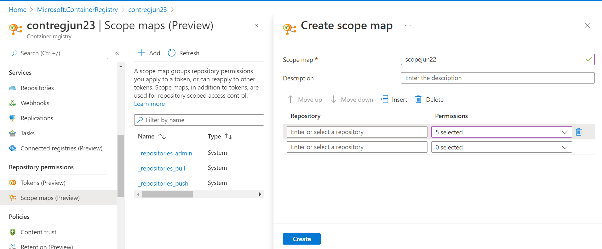
  

### 14. Ensure Activity logging is enabled for Azure Container Registry
**Security Control Mapping :**  
| Control Number | Control Statement | Security Domain | Default | Associated Runbook | CVSS Severity  |
| -------------- | ----------------- | --------------- | ------- | ------------------ | -------------- |
| CS0012233 | Information System must create a log and record activities occurring on or originating from the information system. Logs must be made accessible to the enterprise SIEM solution  | Security Information and event management   | Enabled but not forwarded to Splunk | None | [Low (2.7)](https://www.first.org/cvss/calculator/3.1#CVSS:3.1/AV:P/AC:H/PR:H/UI:N/S:U/C:L/I:N/A:L) |

**Why, What and How ?** 
  
Client rationale and Justification
[Placeholder link]

   

### 15. Ensure container images or repository is locked and exportPolicy is disabled for container registry 

**Security Control Mapping :**  

| Control Number | Control Statement | Security Domain | Default | Associated Runbook | CVSS Severity  |
| -------------- | ----------------- | --------------- | ------- | ------------------ | -------------- |
|  CS0012168     |Strong encryption key management controls are in place for cloud provider services to protect data at rest | Data Protection  | Not enabled | None | [Medium (5.3)](https://www.first.org/cvss/calculator/3.1#CVSS:3.1/AV:A/AC:H/PR:H/UI:N/S:U/C:H/I:L/A:L)  |

**Why?**  

All tagged images in Azure Container Registry can be repeatedly updated and pushed with the same tag to a registry. Container images can also be deleted as needed. However, when  a container image is deployed to production, an immutable container must be used as it prevents image getting  deleted or modified accidentally. 

Registry's export policy must be configured to disable exports to prevent registry users in an organization from maliciously or accidentally leaking artifacts outside a virtual network. The exportPolicy property, when its status is set to disabled, blocks export of artifacts from a network-restricted registry when a user attempts to Import the registry's artifacts to another Azure container registry and Create a registry export pipeline to transfer artifacts to another container registry

**How?**  

**_Step 1:_** Use the az acr repository update command to set repository attributes to lock an image version, or an entire repository and to protect an image version or repository from deletion, but allows modification

**_use --write-enabled false attribute to Lock an image or repository_**  

_To lock the myimage:tag image in myregistry, run the following az acr repository update command:_  
_az acr repository update --name myregistry --image myimage:tag --write-enabled false_  

**_use --delete-enabled false --write-enabled true attributes to allow modification and prevent deletion_**  
_The following command sets the myrepo repository so it can't be deleted. Individual images can still be updated or deleted._  
_az acr repository update --name myregistry --repository myrepo --delete-enabled false --write-enabled true_  

**_Run az resource update to set the exportPolicy status as disabled. in an existing registry_** 

_az resource update --resource-group myResourceGroup --name myregistry --resource-type "Microsoft.ContainerRegistry/registries" --api-version "2021-06-01-preview" --set "properties.policies.exportPolicy.status=disabled" --set "properties.publicNetworkAccess=disabled"_

Refer the below links for more information  
 - https://docs.microsoft.com/en-us/azure/container-registry/container-registry-image-lock#lock-an-image-or-repository  
 - https://docs.microsoft.com/en-us/azure/container-registry/data-loss-prevention#disable-exportpolicy-for-an-existing-registry <be>
  
   

