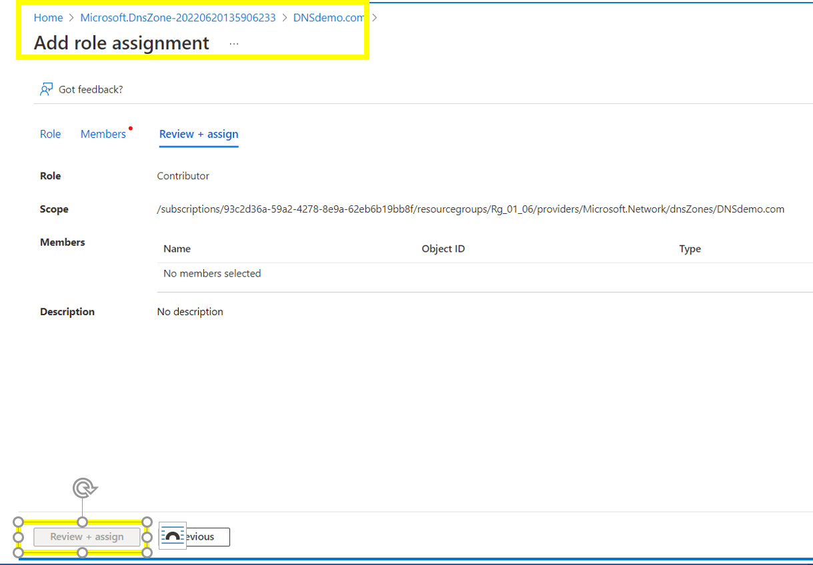
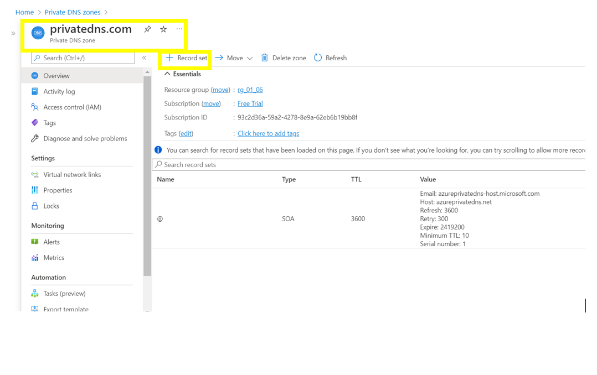
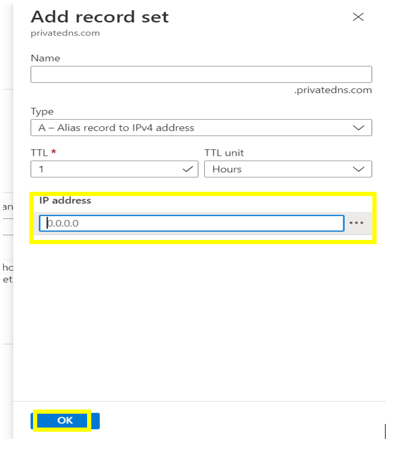
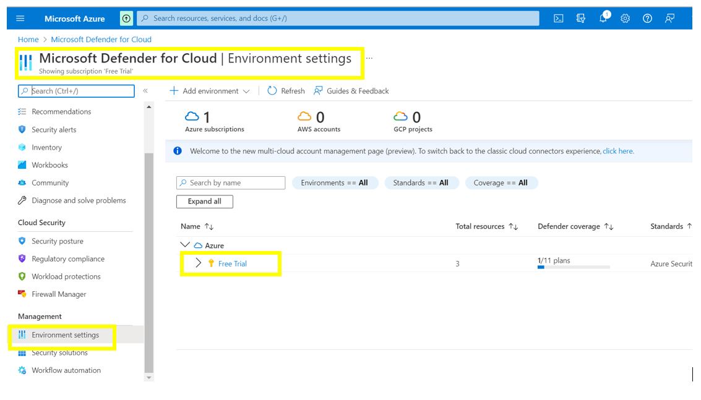
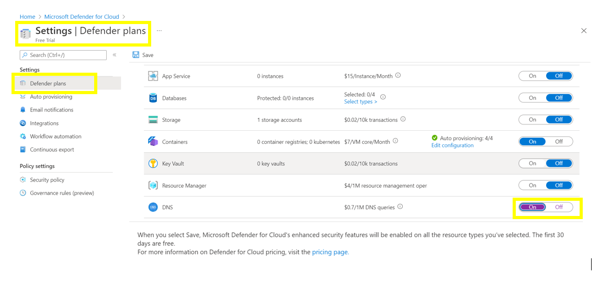
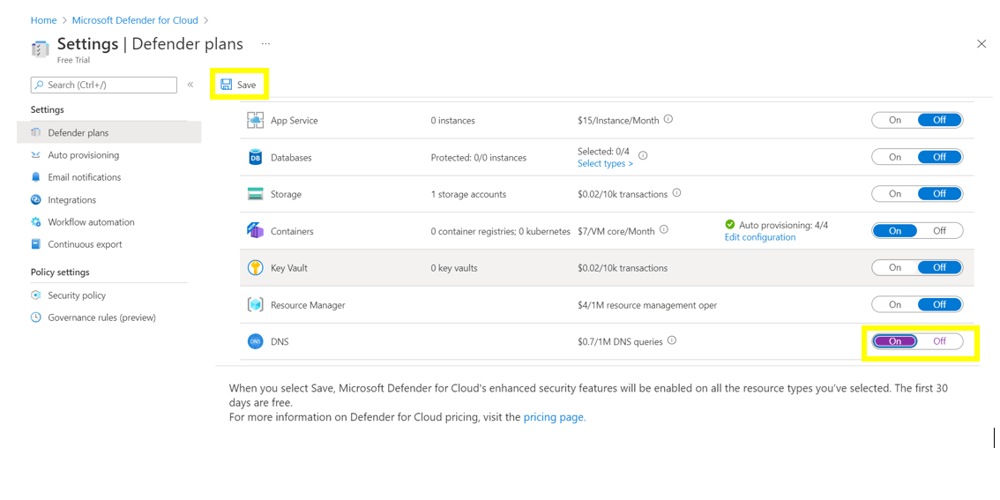
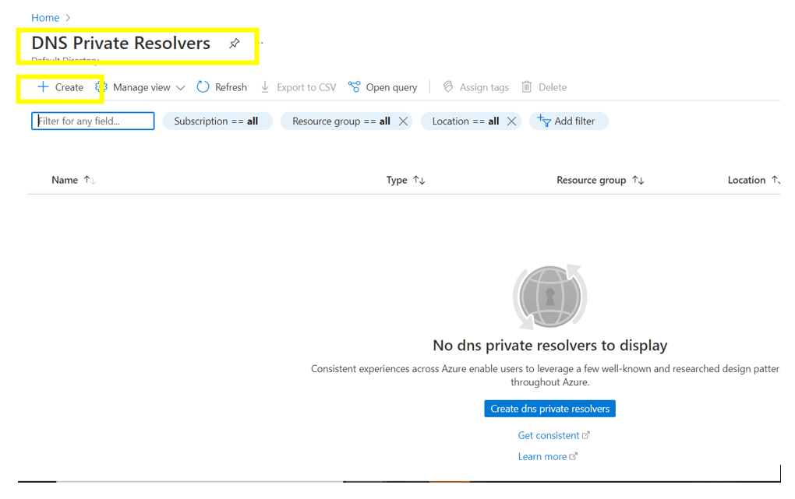
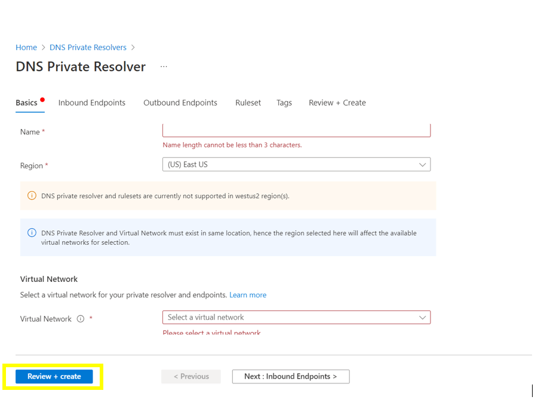
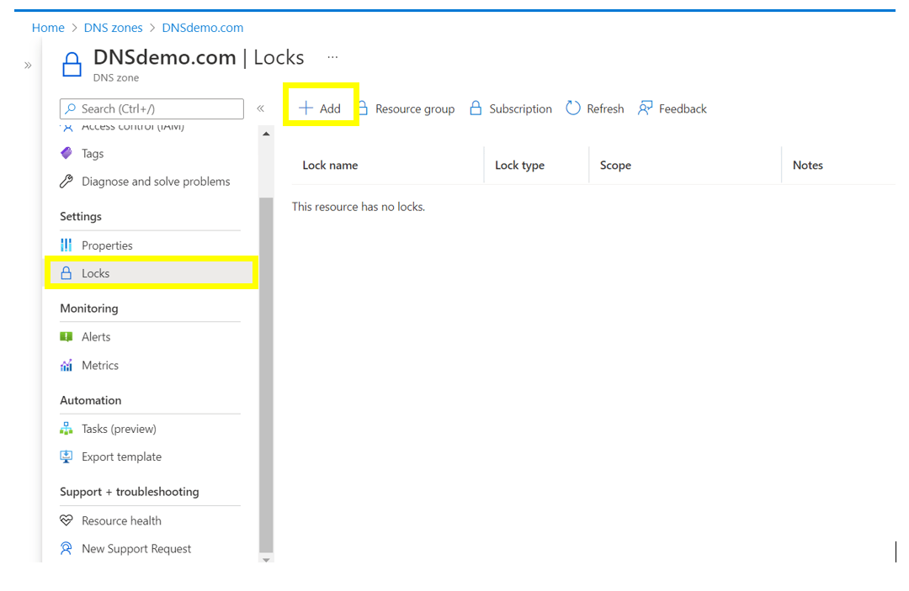
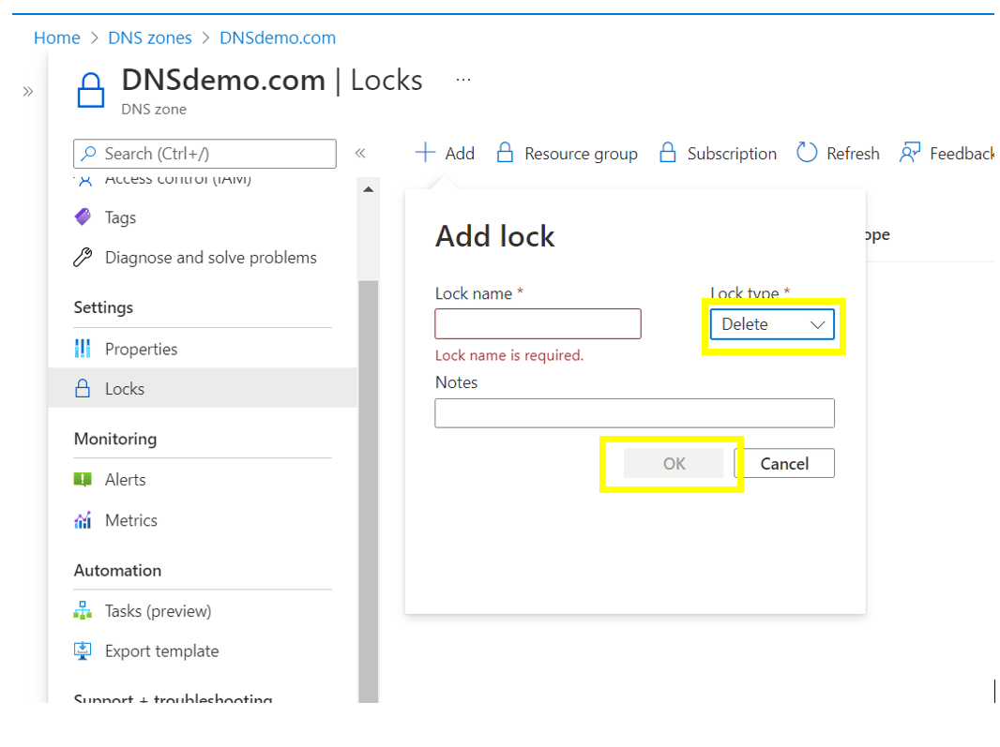

# Azure Domain Name Server - Security baseline requirement <!-- omit in toc -->
## Baseline security configuration requirement for Azure services  <!-- omit in toc -->
---

**Generated By: EY Security Team**  
**Service Type: Storage**  
**Deployment Phase:**  
**Last updated: 07/11/2022** 

## Table of Contents <!-- omit in toc -->

- [Overview](#overview)
  - [Use Case Examples:](#use-case-examples)
  - [1.  Ensure Azure DNS implements Role Based Access Control](#1--ensure-azure-dns-implements-role-based-access-control)
  - [2. Ensure access to Azure DNS from other azure services is granted using Managed Identities](#2-ensure-access-to-azure-dns-from-other-azure-services-is-granted-using-managed-identities)
  - [3. Ensure that Azure DNS is used only for Private Endpoint](#3-ensure-that-azure-dns-is-used-only-for-private-endpoint)
  - [4. Ensure Azure DNS is protected using  organizational Malware and vulnerability SCANNING tools](#4-ensure-azure-dns-is-protected-using--organizational-malware-and-vulnerability-scanning-tools)
  - [5. Ensure Activity logging is enabled for Azure Container Instance](#5-ensure-activity-logging-is-enabled-for-azure-container-instance)
  - [6. Ensure  Service tags are enabled for the Azure DNS](#6-ensure--service-tags-are-enabled-for-the-azure-dns)
  - [7. Ensure that Private DNS resolver is used to query Azure DNS private zones without deploying VM based DNS servers.](#7-ensure-that-private-dns-resolver-is-used-to-query-azure-dns-private-zones-without-deploying-vm-based-dns-servers)
  - [8. Ensure read only lock is applied to protect accidental deletion of DNS zone file](#8-ensure-read-only-lock-is-applied-to-protect-accidental-deletion-of-dns-zone-file)
  - [10. Ensure Azure DNS uses standard organizational Resource tagging method](#10-ensure-azure-dns-uses-standard-organizational-resource-tagging-method)

##  Overview

Azure DNS is a hosting service for DNS domains that provides name resolution by using Microsoft Azure infrastructure. By hosting your domains in Azure, DNS records can be managed by using the same credentials, APIs, tools, and billing as other Azure services.
DNS domains in Azure DNS are hosted on Azure's global network of DNS name servers. Azure DNS uses anycast networking. Each DNS query is answered by the closest available DNS server to provide fast performance and high availability for your domain.

| Control Number | Cloud Baseline Security Requirements                                                                              |
| -------------- | ----------------------------------------------------------------------------------------------------------------- |
| 1              | Ensure Azure DNS implements Role Based Access Control                                                             |
| 2              | Ensure access to Azure DNS from other azure services is granted using Managed Identities                          |
| 3              | Ensure that Azure DNS is used only for Private Endpoint                                                           |
| 4              | Ensure Azure DNS is protected using organizational Malware and vulnerability SCANNING tools                       |
| 5              | Ensure Activity logging is enabled for Azure Container Instance                                                   |
| 6              | Ensure Service tags are enabled for the Azure DNS                                                                 |
| 7              | Ensure that Private DNS resolver is used to query Azure DNS private zones without deploying VM based DNS servers. |
| 8              | Ensure read only lock is applied to protect accidental deletion of DNS zone file                                  |
| 9              | Ensure Azure DNS uses standard organizational Resource tagging method                                             |

### Use Case Examples:
- Azure enterprise cloud file share
- N-tier application with Apache Cassandra
- Design a hybrid Domain Name System solution with Azure

### 1.  Ensure Azure DNS implements Role Based Access Control 

**Security Control Mapping :**  
| Control Number | Control Statement | Security Domain | Default | Associated Runbook | CVSS Severity  |
| -------------- | ----------------- | --------------- | ------- | ------------------ | -------------- |
| CS0012300 | Cloud products and services must be deployed on private subnets and public access must be disabled for these services |Identity & Access Management | Not enabled |None | [Medium (5.2)](https://www.first.org/cvss/calculator/3.1#CVSS:3.1/AV:L/AC:H/PR:H/UI:N/S:U/C:L/I:H/A:L) |

**Why?**  
Role-based access control (RBAC) is method of implementing least privilege access by providing access user and service principle based on job function. Azure has several service specific roles the provides granular access. Using Azure entitlements and the usage pattern custom roles can be developed for Azure DNS Security to implement the granular access to individual user and service principal 

**How?**  

[placeholder]

**Following are the suggested RBAC roles for Azure DNS**  
| Function | Description | Role | 
| -------------- | ----------------- | --------------- | 
|  Network admin | Lets you manage networks, but not access to them | [Network Contributor](https://github.com/MicrosoftDocs/azure-docs/blob/main/articles/role-based-access-control/built-in-roles.md#network-contributor) |
| DNS Admin | Lets you manage private DNS zone resources, but not the virtual networks they are linked to. | [Private DNS Zone Contributor ](https://github.com/MicrosoftDocs/azure-docs/blob/main/articles/role-based-access-control/built-in-roles.md#private-dns-zone-contributor) |

To implement this control, refer the link: https://docs.microsoft.com/en-us/azure/data-factory/concepts-roles-permissions

   

### 2. Ensure access to Azure DNS from other azure services is granted using Managed Identities

**Security Control Mapping :** 

| Control Number | Control Statement | Security Domain | Default | Associated Runbook | CVSS Severity  |
| -------------- | ----------------- | --------------- | ------- | ------------------ | -------------- |
|  CS0012298       | Access to change cloud identity access and service control policies is restricted to authorized cloud administrative personnel |Identity & Access Management | Not enabled | None | [Medium (5.1)](https://www.first.org/cvss/calculator/3.1#CVSS:3.1/AV:A/AC:H/PR:H/UI:N/S:C/C:L/I:L/A:L) |

**Why?**  
Managed identity for azure DNS enables Azure resources to authenticate to cloud services without storing credentials in code. Once enabled, all necessary permissions can be granted via Azure role-based-access-control. In system assigned managed identity, the lifecycle of this type of managed identity is tied to the lifecycle of this resource. Additionally, each resource (e.g. Virtual Machine) can only have one system assigned managed identity. 

**How?**  

**_Step 1:_**  In the side menu bar of the 'Private DNS zone' window , Navigate to ‘Access control (IAM) ,and click on ' add role assignment’.

**_Step 2:_** Select the 'DNS zone contributor'  and assign it to the respective users based on the requirements. And click on next.

**_Step 3:_** Review the role assignment and finally click on ‘Review+assign’ .

   

### 3. Ensure that Azure DNS is used only for Private Endpoint

**Security Control Mapping :**  
| Control Number | Control Statement | Security Domain | Default | Associated Runbook | CVSS Severity  |
| -------------- | ----------------- | --------------- | ------- | ------------------ | -------------- |
| [CS0012300](place holder) | Cloud products and services must be deployed on private subnets and public access must be disabled for these services | Network and communication Security | Not enabled |Network Security Group Runbook | [High (7.2)](https://www.first.org/cvss/calculator/3.1#CVSS:3.1/AV:N/AC:H/PR:H/UI:N/S:C/C:H/I:L/A:L) |

**Why?**   

A private endpoint is a network interface that uses a private IP address from your virtual network. This network interface connects privately for Azure dns Security and securely to a service that's powered by Azure Private Link. Private endpoint must be enabled to bring the service into the virtual network.Private endpoint will provide a endpoint with Private IP which can be associated with VNet with in tenant, other tenant or from On premise.

**How?**  

**_Step 1:_**  In the side menu bar of the Private endpoint window , click on 'Record set'.

**_Step 2:_** Select the set of Ip addresses and click on 'ok' to create.

   

### 4. Ensure Azure DNS is protected using  organizational Malware and vulnerability SCANNING tools

**Security Control Mapping :** 

| Control Number | Control Statement | Security Domain | Default | Associated Runbook | CVSS Severity  |
| -------------- | ----------------- | --------------- | ------- | ------------------ | -------------- |
|  CS0012268     | Vulnerability Assessments must be performed based on risk and findings must be addressed in accordance with Enterprise SLA's | Vulnerability Management | Not enabled | None | [Medium (5.0)](https://www.first.org/cvss/calculator/3.1#CVSS:3.1/AV:L/AC:H/PR:H/UI:N/S:C/C:L/I:L/A:L) |

**Why?**
In Azure DNS service,to minimize the attack,we deleted unused run using defender for cloud.Organization Anti malware and vulnerability tools are the required security intelligence that detects unusual and potentially harmful attempts to access or exploit the Key vaults. It uses advanced threat detection capabilities and Microsoft Threat Intelligence data to provide contextual security alerts. Those alerts also include steps to mitigate the detected threats and prevent future attacks. Microsoft Defender must be enabled at either the subscription level (recommended) or the resource level to analyze ,detect and remediate the threats.

**How?**  

**_Step 1:_**  Navigate to 'Defender for cloud' , In the side menu bar select 'Environment settings' and click on the subscription under azure.

**_Step 2:_** In the side menu bar select 'settings', navigate to 'Defender plans' and change the settings to 'on' for the DNS.

**_Step 3:_** Click on the 'Save' button to update the settings.

   

### 5. Ensure Activity logging is enabled for Azure Container Instance ###

**Security Control Mapping :**  
| Control Number | Control Statement | Security Domain | Default | Associated Runbook | CVSS Severity  |
| -------------- | ----------------- | --------------- | ------- | ------------------ | -------------- |
| CS0012233 | Information System must create a log and record activities occurring on or originating from the information system. Logs must be made accessible to the enterprise SIEM solution  | Security Information and event management   | Enabled but not forwarded to Splunk | None | [Low (2.7)](https://www.first.org/cvss/calculator/3.1#CVSS:3.1/AV:P/AC:H/PR:H/UI:N/S:U/C:L/I:N/A:L) |

**Why, What and How ?** 
  
Client rationale and Justification
[Placeholder link]

   

### 6. Ensure  Service tags are enabled for the Azure DNS

**Security Control Mapping :**  
| Control Number | Control Statement | Security Domain | Default | Associated Runbook | CVSS Severity  |
| -------------- | ----------------- | --------------- | ------- | ------------------ | -------------- |
| CS0012261  | Technology hardware and software must be registered and accurately recorded within the enterprise technology repository and/or asset management systems | Asset Management  | Not enabled | None| [Low (1.6)](https://www.first.org/cvss/calculator/3.1#CVSS:3.1/AV:P/AC:H/PR:H/UI:N/S:U/C:N/I:N/A:L) |

**Why?**

A service tag represents a group of IP address prefixes from a given Azure DNS Security service.Service tags can be used in place of specific IP addresses when creating security rules.Microsoft manages the address prefixes the service tag encompasses, and automatically updates the service tag as addresses change.

**How?**  

**_Step 1:_** Navigate to NSG group of any existing VM and click ‘Outbound security rules’ under settings from left side panel. 

**_Step 2:_** Select add and Select source as ‘Service Tag’ and ‘Azure Platform DNS' as Source service tag. 
 

**_Step 3:_** Validate  the create service tag in the outbound rules section. 

   

### 7. Ensure that Private DNS resolver is used to query Azure DNS private zones without deploying VM based DNS servers.

**Security Control Mapping :**  

| Control Number | Control Statement | Security Domain | Default | Associated Runbook | CVSS Severity  |
| -------------- | ----------------- | --------------- | ------- | ------------------ | -------------- |
| [CS0012300](place holder) | Cloud products and services must be deployed on private subnets and public access must be disabled for these services | Network and communication Security | Not enabled |None | [High (7.2)](https://www.first.org/cvss/calculator/3.1#CVSS:3.1/AV:N/AC:H/PR:H/UI:N/S:C/C:H/I:L/A:L) |

**Why?**  

Azure DNS Private Resolver is a new service that enables to query Azure DNS private zones from an on-premises environment and vice versa without deploying VM based DNS servers.

**How?**  

**_Step 1:_** Search for 'DNS private resolvers' in Search resource and navigate to it. And click on 'Create'.

**_Step 2:_** Enter the required details and click on 'Review+Create'.

   

### 8. Ensure read only lock is applied to protect accidental deletion of DNS zone file

**Security Control Mapping :**  
| Control Number | Control Statement | Security Domain | Default | Associated Runbook | CVSS Severity  |
| -------------- | ----------------- | --------------- | ------- | ------------------ | -------------- |
| [CS0012261](place holder)  | Technology hardware and software must be registered and accurately recorded within the enterprise technology repository and/or asset management systems | Asset Management  | Not enabled | None | [Low (2.7)](https://www.first.org/cvss/calculator/3.1#CVSS:3.1/AV:P/AC:H/PR:H/UI:N/S:U/C:L/I:N/A:L) | |

**Why?**  

 Resource locks are applied to the resource, and are effective across all users and roles. here are two types of resource lock: CanNotDelete and ReadOnly. These lock types can be applied either to a Private DNS zone, or to an individual record set.  ReadOnly lock must be applied to the zone to prevent new record sets from being created, and existing record sets from being modified or deleted.

**How?**  

**_Step 1:_**  In the side menu bar of the 'DNS zone' window , Navigate to ‘locks' ,and ' click on 'Add’.

**_Step 2:_** In the Add lock window , select the lock type as 'delete'.

**_Step 3:_** Review and click on 'ok' .

### 10. Ensure Azure DNS uses standard organizational Resource tagging method ###

**Security Control Mapping :**  
| Control Number | Control Statement | Security Domain | Default | Associated Runbook | CVSS Severity  |
| -------------- | ----------------- | --------------- | ------- | ------------------ | -------------- |
| [CS0012261](place holder)  | Technology hardware and software must be registered and accurately recorded within the enterprise technology repository and/or asset management systems | Asset Management  | Not enabled | organizational Runbook | [Low (1.6)](https://www.first.org/cvss/calculator/3.1#CVSS:3.1/AV:P/AC:H/PR:H/UI:N/S:U/C:N/I:N/A:L) |

**Why, What and How ?** 
  
Client rationale and Justification
[Placeholder link]

  

