# Azure Database for PostgreSQL - Security baseline requirement <!-- omit in toc -->
## Baseline security configuration requirement for Azure services  <!-- omit in toc -->

**Generated By: EY Security Team**
**Service Type: Databases**
**Deployment Phase:** 
**Last updated: 04/18/2022**

## Table of Contents <!-- omit in toc -->

- [Overview](#overview)
  - [Use Case Examples:](#use-case-examples)
- [Cloud Security Requirements](#cloud-security-requirements)
  - [1. Ensure Azure Database for PostgreSQL connections are encrypted in transit using TLS1.2](#1-ensure-azure-database-for-postgresql-connections-are-encrypted-in-transit-using-tls12)
  - [2. Ensure that Azure Database for PostgreSQL is encrypted using Organization's Manged keys (CMK)](#2-ensure-that-azure-database-for-postgresql-is-encrypted-using-organizations-manged-keys-cmk)
  - [3. Ensure Azure Database for PostgreSQL is protected using Private Endpoint](#3-ensure-azure-database-for-postgresql-is-protected-using-private-endpoint)
  - [4. Ensure organizational Anti-malware and vulnerability tools are enabled for Azure database for postgre](#4-ensure-organizational-anti-malware-and-vulnerability-tools-are-enabled-for-azure-database-for-postgre)
  - [5. Ensure least privilege access method for Azure Database for PostgreSQL is implemented using Role-based access control (RBAC)](#5-ensure-least-privilege-access-method-for-azure-database-for-postgresql-is-implemented-using-role-based-access-control-rbac)
  - [6. Ensure that Azure Database for PostgreSQL access is granted using Azure Active Directory](#6-ensure-that-azure-database-for-postgresql-access-is-granted-using-azure-active-directory)
  - [7. Ensure Diagnostic logs for 'PostgreSQLLogs' is Enabled and forwarded to Splunk](#7-ensure-diagnostic-logs-for-postgresqllogs-is-enabled-and-forwarded-to-splunk)
  - [8. Ensure that Azure Database for PostgreSQL uses standard organizational Resource tagging method](#8-ensure-that-azure-database-for-postgresql-uses-standard-organizational-resource-tagging-method)
  - [9. Ensure Activity logging is enabled for Azure database for postgre](#9-ensure-activity-logging-is-enabled-for-azure-database-for-postgre)
  - [10. Ensure postgre administrative credentials are vaulted using enterprise vaulting solutions](#10-ensure-postgre-administrative-credentials-are-vaulted-using-enterprise-vaulting-solutions)

## Overview

Azure Database for PostgreSQL is a relational database service based on the open-source Postgres database engine. It's a fully managed database-as-a-service that can handle mission-critical workloads with predictable performance, security, high availability, and dynamic scalability.The single server platform is designed to handle most of the database management functions such as patching, backups, high availability, security with minimal user configuration and control

| Control Number | Cloud Baseline Security Requirements                                                                              |
| -------------- | ----------------------------------------------------------------------------------------------------------------- |
| 1              | Ensure Azure DNS implements Role Based Access Control                                                             |
| 2              | Ensure access to Azure DNS from other azure services is granted using Managed Identities                          |
| 3              | Ensure that Azure DNS is used only for Private Endpoint                                                           |
| 4              | Ensure Azure DNS is protected using organizational Malware and vulnerability SCANNING tools                       |
| 5              | Ensure Activity logging is enabled for Azure Container Instance                                                   |
| 6              | Ensure Service tags are enabled for the Azure DNS                                                                 |
| 7              | Ensure that Private DNS resolver is used to query Azure DNS private zones without deploying VM based DNS servers. |
| 8              | Ensure read only lock is applied to protect accidental deletion of DNS zone file                                  |
| 9              | Ensure Azure DNS uses standard organizational Resource tagging method                                             |

### Use Case Examples:
- Scalable web and mobile applications using Azure Database for PostgreSQL
- Instant IoT data streaming with AKS
- Retail and e-commerce using Azure PostgreSQL
- Intelligent apps using Azure Database for PostgreSQL
- Digital campaign management

## Cloud Security Requirements ##

### 1. Ensure Azure Database for PostgreSQL connections are encrypted in transit using TLS1.2

**Security Control Mapping :**   
| Control Number | Control Statement | Security Domain | Default | Associated Runbook | CVSS Severity  |
| -------------- | ----------------- | --------------- | ------- | ------------------ | -------------- |
| CS0012261 | Cloud based data in transit must be encrypted with enterprise approved algorithm | Data Protection | Enabled but not TLS 1.2 | None | [Medium (5.3)](https://www.first.org/cvss/calculator/3.1#CVSS:3.1/AV:A/AC:H/PR:H/UI:N/S:U/C:H/I:L/A:L) |

**Why?**  

Encryption use cases of data in transit are authentication of database credentials against the Azure Active directory or communication between database and other applications. TLS 1.2 must be used as the secure encryption in transit for all the Azure Postgre Database connections to improve the security posture of the environment and also to remain in compliance with industry standards or organization requirements. For production use cases, we recommend using the 'verify-full' SSL mode(sslmode=verify-full), which ensures that connections to the database can't be intercepted. use ssl_min_protocol_version to use TLS version 1.2

Flexible server - https://docs.microsoft.com/en-us/azure/postgresql/flexible-server/how-to-connect-tls-ssl
Single server:  https://docs.microsoft.com/en-us/azure/postgresql/howto-tls-configurations

**How?**  

**_Step 1:_** Go to Azure portal and search for Azure PostgreSQL  

**_Step 2:_** Now click on create then a new page will appear. 

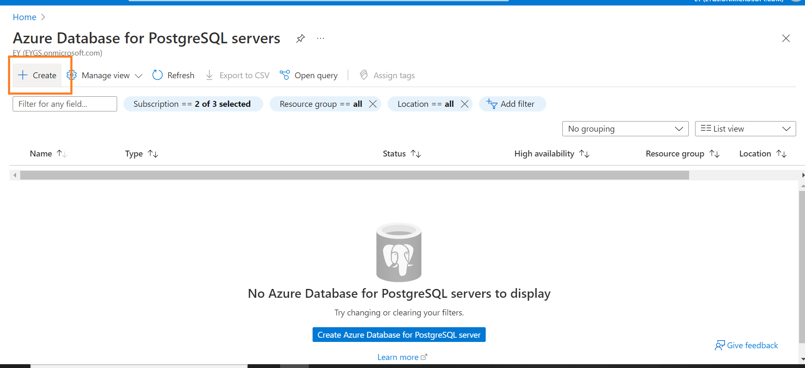 

**_Step 3:_** Select for single server and Create one single server, select the resource group, create a name for server, configure server (basic) and set username and password 

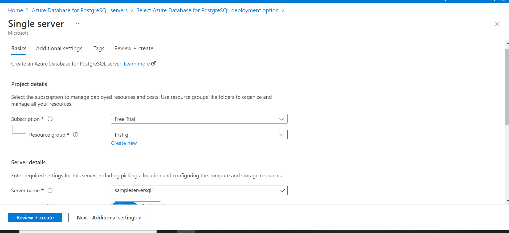 

**_Step 4:_** While configuring the single server, set the vCore and storage and retention period. 

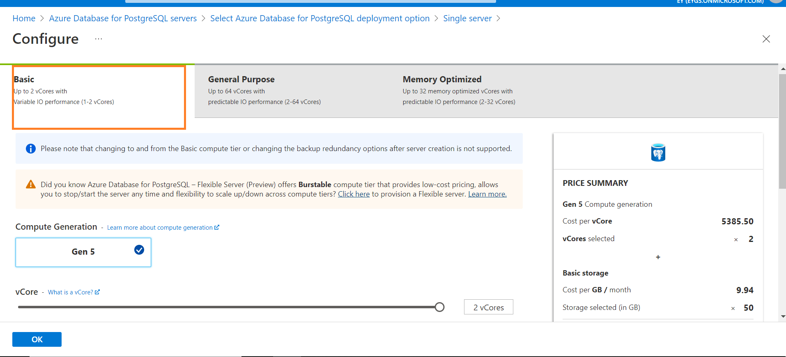 

**_Step 5:_** Leave all other values as default and select review and create. After creation of the service click on go to resource and on the left side click on Connection Security and allow server to access azure services and select the TLS version 1.2 , then click on Save. 

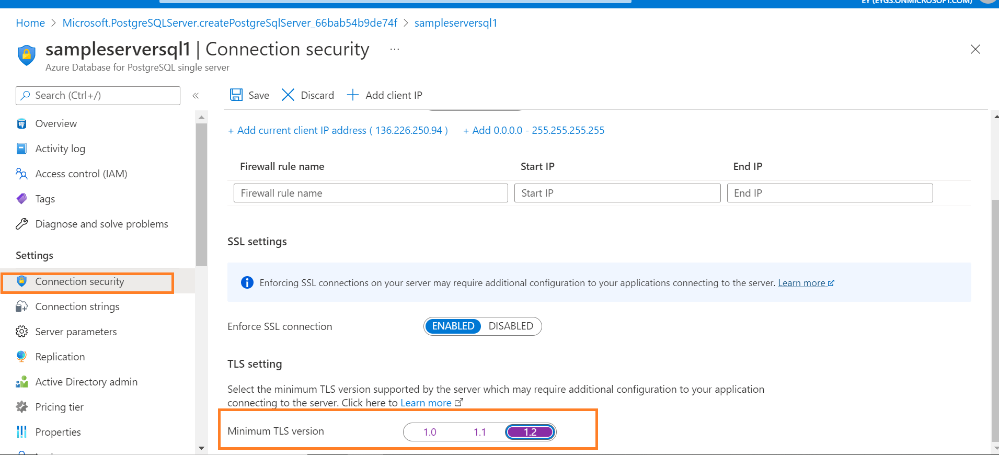 

   

### 2. Ensure that Azure Database for PostgreSQL is encrypted using Organization's Manged keys (CMK)

**Security Control Mapping :**  
| Control Number | Control Statement | Security Domain | Default | Associated Runbook | CVSS Severity  |
| -------------- | ----------------- | --------------- | ------- | ------------------ | -------------- |
|  CS0012168       |Strong encryption key management controls are in place for cloud provider services to protect data at rest | Data Protection  | Enabled but not using CMK | None | [Medium (5.3)](https://www.first.org/cvss/calculator/3.1#CVSS:3.1/AV:A/AC:H/PR:H/UI:N/S:U/C:H/I:L/A:L)  |

**Why?**  
 
Azure PostgreSQL leverages Azure Storage encryption to encrypt data at-rest by default using Microsoft-managed keys. For Azure PostgreSQL users, it is a very similar to Transparent Data Encryption (TDE) in other databases such as SQL Server. Enterprise require full control on access to the data using a organization-managed key. Data encryption with organization-managed keys for Azure Database for PostgreSQL Single server enables to use Enterprise keys for data protection at rest. It also allows organizations to implement separation of duties in the management of keys and data. With customer-managed encryption, Organization is responsible for, and in a full control of, a key's lifecycle, key usage permissions, and auditing of operations on keys.

Note: As of this document creation, Flexible server does not support CMK, the data are encrypted using Microsoft managed keys.

single server : https://docs.microsoft.com/en-us/azure/postgresql/howto-data-encryption-portal
 
**How?**  

**_Step 1:_** Go to Azure portal and search for PostgreSQL and open the server 

**_Step 2:_** On the left side menu, click on Data Security under security and enable Customer Managed Key (CMK) 

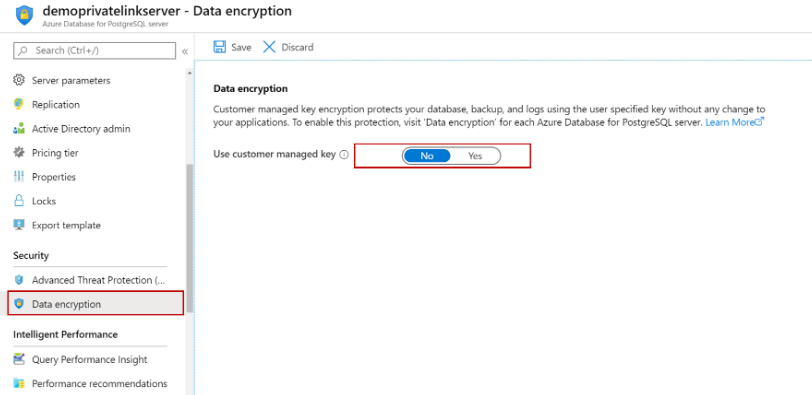 

**_Step 3:_** After enabling the CMK , select the key selection method as any specific key that is created before or select key identifier. 

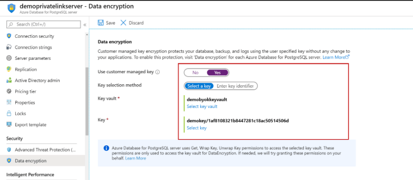 

   

### 3. Ensure Azure Database for PostgreSQL is protected using Private Endpoint

**Security Control Mapping :**  
| Control Number | Control Statement | Security Domain | Default | Associated Runbook | CVSS Severity  |
| -------------- | ----------------- | --------------- | ------- | ------------------ | -------------- |
| CS0012300 | Cloud products and services must be deployed on private subnets and public access must be disabled for these services | Network and communication Security | Not enabled | Virtual Network Runbook | [High (7.2)](https://www.first.org/cvss/calculator/3.1#CVSS:3.1/AV:N/AC:H/PR:H/UI:N/S:C/C:H/I:L/A:L)  |

**Why?**  

Azure Virtual network securely enables the communication of Azure Postgre Databases with communication between Azure resources, on-premises resources through Spoke-hub network. Spoke VNet uses NSG to filter network traffic from other Azure resource. Private endpoint will provide a endpoint with Private IP which can be associated with VNet with in tenant, other tenant or from On premise.  A FQDN record will be created in Azure DNS to enable other tenants VNets to be associated with Azure Postgre Database.  This ensures that all workload data is being accessed securely over Azure network backbone.

Note: Private DNS zone integration is required to connect to your Flexible Server in virtual network using server name (fully qualified domain name).
A new private DNS zone will be created or you can optionally choose an existing one linked to the selected virtual network. With private DNS zone integration, the DNS records for the server name will be updated automatically in case the IP address of your Flexible Server changes 
https://docs.microsoft.com/en-us/azure/postgresql/flexible-server/concepts-networking#private-access-vnet-integration

**How?**  

**_Step 1:_** Go to Azure portal and search for PostgreSQL and create one flexible server. 

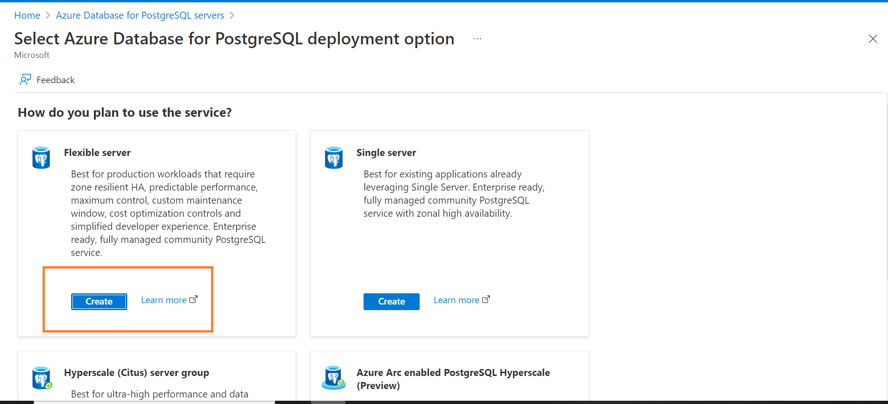 

**_Step 2:_** Now in Basic fill all the values, resource group, server name, region and admin name and password and click on next . 

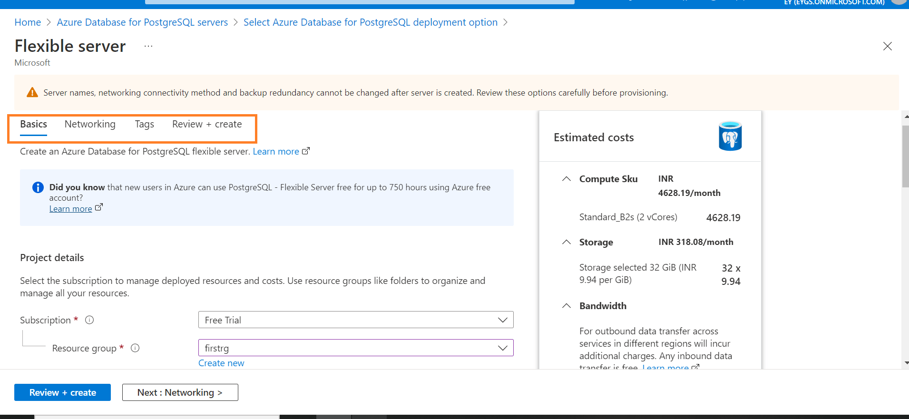 

**_Step 3:_** In the networking section, under network connectivity select Private access (VNet integration) and configure VNet, subnet and Private DNS zone, and then review and create. 

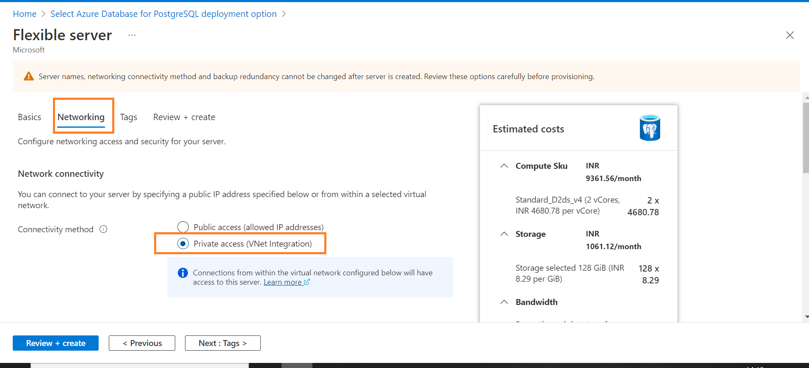 

   

### 4. Ensure organizational Anti-malware and vulnerability tools are enabled for Azure database for postgre 

**Security Control Mapping :**  
| Control Number | Control Statement | Security Domain | Default | Associated Runbook | CVSS Severity  |
| -------------- | ----------------- | --------------- | ------- | ------------------ | -------------- |
|  CS0012268     | Vulnerability assessments must be performed based on risk and findings must be addressed in accordance with enterprise SLA's | Vulnerability Management | Not enabled | None | [Medium (5.0)](https://www.first.org/cvss/calculator/3.1#CVSS:3.1/AV:L/AC:H/PR:H/UI:N/S:C/C:L/I:L/A:L) |

**Why?**  

Organization Anti malware and vulnerability tools are the required security intelligence that detects unusual and potentially harmful attempts to access or exploit the Key vaults. It uses advanced threat detection capabilities and Microsoft Threat Intelligence data to provide contextual security alerts. Those alerts also include steps to mitigate the detected threats and prevent future attacks. Microsoft Defender for Cloud must be enabled at either the subscription level (recommended) or the resource level to analyze ,detect and remediate the threats

Note: At the time of writing this document Microsoft Defender for Cloud is available only for PostgreSQL - single server mode only
https://azure.microsoft.com/en-us/updates/azure-defender-for-azure-database-for-postgresql-single-server-in-general-availability/

**How?**  

**_Step 1:_** Go to Azure portal and search for Microsoft defender for cloud  

**_Step 2:_** On the left side, select Environment settings and click on the subscriptions. Settings|Defender plans page is displayed 

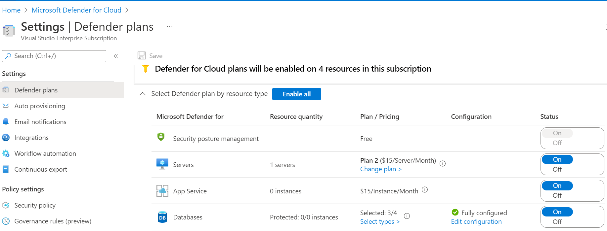 

**_Step 3:_** Click Select types link and  resource type selection page will appear. Select 'on' for 'Opensource relational databases' and click continue to save the setting.  

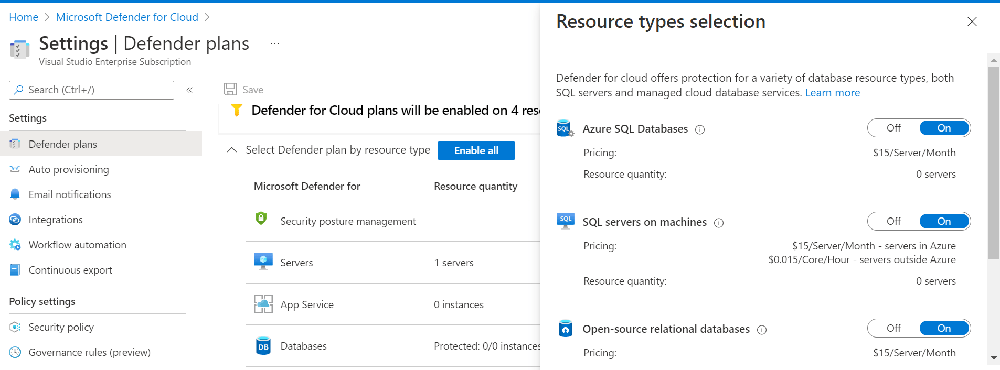 

   

### 5. Ensure least privilege access method for Azure Database for PostgreSQL is implemented using Role-based access control (RBAC)

**Security Control Mapping :**  
| Control Number | Control Statement | Security Domain | Default | Associated Runbook | CVSS Severity  |
| -------------- | ----------------- | --------------- | ------- | ------------------ | -------------- |
|  CS0012298     | Access to change cloud identity access and service control policies is restricted to authorized cloud administrative personnel |  Identity and Access Management | Not enabled | None | [Medium (5.1)](https://www.first.org/cvss/calculator/3.1#CVSS:3.1/AV:A/AC:H/PR:H/UI:N/S:C/C:L/I:L/A:L) |

[Place Holder ]

**Following are the suggested RBAC roles for Azure Database for PostgreSQL**  

| Function | Description | Role | 
| -------------- | ----------------- | --------------- | 
|  SQL DB Contributor | Responsible to manage SQL Databases | [SQLDBContributor](https://github.com/MicrosoftDocs/azure-docs/blob/main/articles/role-based-access-control/built-in-roles.md#sql-db-contributor) |

  

### 6. Ensure that Azure Database for PostgreSQL access is granted using Azure Active Directory

**Security Control Mapping :**  
| Control Number | Control Statement | Security Domain | Default | Associated Runbook | CVSS Severity  |
| -------------- | ----------------- | --------------- | ------- | ------------------ | -------------- |
|  CS0012298     | Access to change cloud identity access and service control policies is restricted to authorized cloud administrative personnel |  Identity and Access Management | Not enabled | None | [Medium (5.1)](https://www.first.org/cvss/calculator/3.1#CVSS:3.1/AV:A/AC:H/PR:H/UI:N/S:C/C:L/I:L/A:L) |

**Why?**  

Azure Active Directory authentication is a mechanism to connect to Microsoft Azure Postgre Database and SQL Data Warehouse by using identities in Azure Active Directory (Azure AD). With Azure AD authentication, identities of database users and other Microsoft services can be managed in one central location. Central ID management provides a single place to manage database users and simplifies permission management.

Note: At the time of this document creation, only Single server support Azure AD admin and managed Identity
https://docs.microsoft.com/en-us/azure/postgresql/howto-configure-sign-in-aad-authentication

**How?**  

**_Step 1:_** In the Azure portal, select the instance of Azure Database for PostgreSQL that you want to enable for Azure AD. 

**_Step 2:_** Under Settings, select Active Directory Admin. 

**_Step 3:_** Click Set Admin and Select a valid Azure AD user in the customer tenant to be Azure AD administrator. 

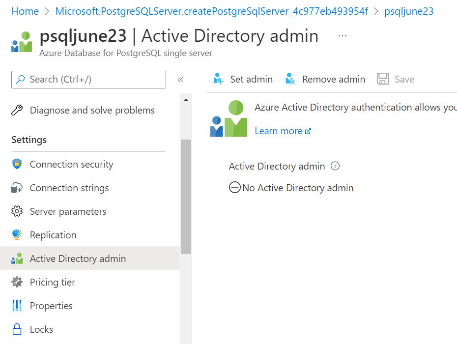 

Refer the link for more information : https://docs.microsoft.com/EN-us/azure/postgresql/single-server/how-to-configure-sign-in-azure-ad-authentication#setting-the-azure-ad-admin-user

   

### 7. Ensure Diagnostic logs for 'PostgreSQLLogs' is Enabled and forwarded to Splunk 

**Security Control Mapping :**   
| Control Number | Control Statement | Security Domain | Default | Associated Runbook | CVSS Severity  |
| -------------- | ----------------- | --------------- | ------- | ------------------ | -------------- |
| CS0012233 | Information System must create a log and record activities occurring on or originating from the information system. Logs must be made accessible to the enterprise SIEM solution  | Security Information and event management   | Not Enabled | None | [Low (2.7)](https://www.first.org/cvss/calculator/3.1#CVSS:3.1/AV:P/AC:H/PR:H/UI:N/S:U/C:L/I:N/A:L) |

**Why?**  

PostgreSQLLogs provides a transactional logs, capturing application and connection information will provide opportunity to capture and alert on suspicious input and quires. the log should be forwarded to splunk to create a notable alerts

**How?**  

**_Step 1:_** Go to Azure portal and open the PostgreSQL server. 

**_Step 2:_** Now on the left side click on the Diagnose setting then click on add diagnose setting 

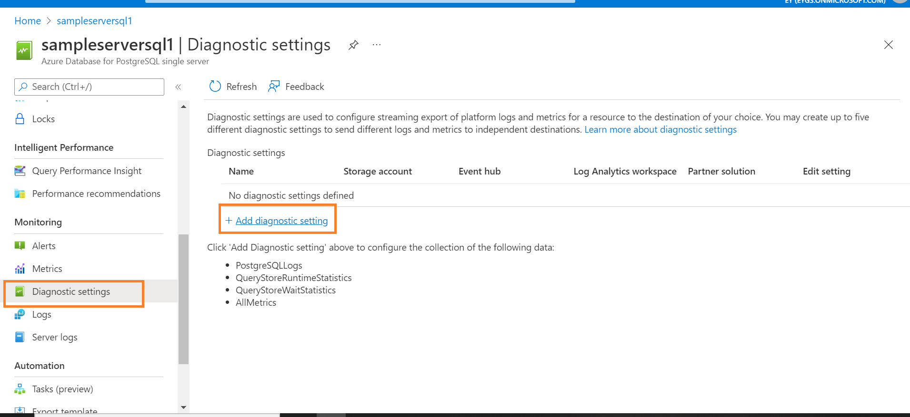 

**_Step 3:_** Select the logs and destination as 'Stream to Eventhub' . Choose the Eventhub namespace and click on save. 

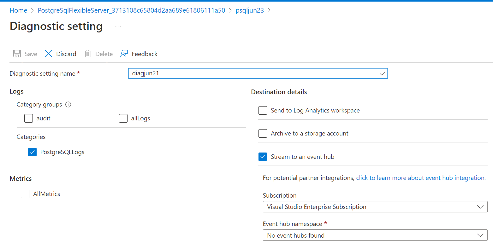 

NOTE: The storage account must be in same region as server.

   

### 8. Ensure that Azure Database for PostgreSQL uses standard organizational Resource tagging method 

**Security Control Mapping :**   
| Control Number | Control Statement | Security Domain | Default | Associated Runbook | CVSS Severity  |
| -------------- | ----------------- | --------------- | ------- | ------------------ | -------------- |
| CS0012261  | Technology hardware and software must be registered and accurately recorded within the enterprise technology repository and/or asset management systems | Asset Management  | Not enabled | organizational Runbook | [Low (1.6)](https://www.first.org/cvss/calculator/3.1#CVSS:3.1/AV:P/AC:H/PR:H/UI:N/S:U/C:N/I:N/A:L) |

**Why, What and How ?** 
  
Client rationale and Justification  
[Placeholder link]

### 9. Ensure Activity logging is enabled for Azure database for postgre 

**Security Control Mapping :**  
| Control Number | Control Statement | Security Domain | Default | Associated Runbook | CVSS Severity  |
| -------------- | ----------------- | --------------- | ------- | ------------------ | -------------- |
| CS0012233 | Information System must create a log and record activities occurring on or originating from the information system. Logs must be made accessible to the enterprise SIEM solution  | Security Information and event management   | Enabled but not forwarded to Splunk | None | [Low (2.7)](https://www.first.org/cvss/calculator/3.1#CVSS:3.1/AV:P/AC:H/PR:H/UI:N/S:U/C:L/I:N/A:L) |

**Why, What and How ?** 
  
Client rationale and Justification 
[Placeholder link]

   

### 10. Ensure postgre administrative credentials are vaulted using enterprise vaulting solutions

**Security Control Mapping :** 

| Control Number | Control Statement | Security Domain | Default | Associated Runbook | CVSS Severity  |
| -------------- | ----------------- | --------------- | ------- | ------------------ | -------------- |
|  CS0012298       | Access to change cloud identity access and service control policies is restricted to authorized cloud administrative personnel |Identity & Access Management | Not enabled | None | [Medium (5.1)](https://www.first.org/cvss/calculator/3.1#CVSS:3.1/AV:A/AC:H/PR:H/UI:N/S:C/C:L/I:L/A:L) |

**Why?**  

The administrative credentials of Azure Database for Postgre should be vaulted using Cyberark or keyvault to protect from in advertent exposure of credential.

**How?**  

To ensure container administrative credentials are vaulted using enterprise vaulting solutions create a Azure key vault. Securely store keys, passwords, certificates, and other secrets. Azure key vaults may be created and managed through the Azure portal .

**_Step 1:_** Navigate to your new key vault in the Azure portal. Once navigated to the key vault page, On the Key Vault settings pages, select Secrets. And Click on Generate/Import.

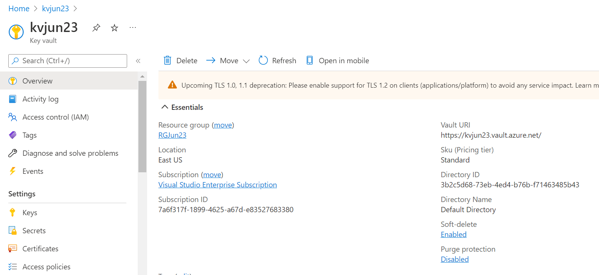

**_Step 2:_** On the Create a secret screen choose the required values , select Enabled to ‘yes’ and click on the ‘create’ button.

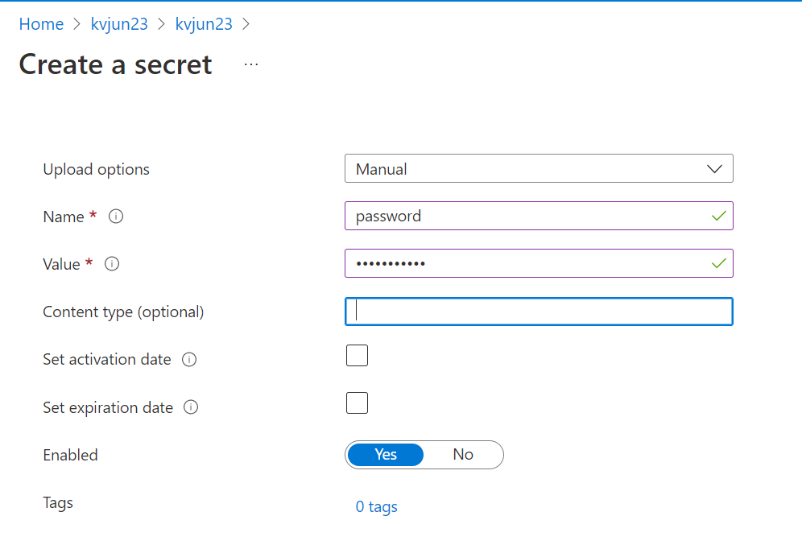

  

