---

**Generated By: EY Security Team**

**Deployment Phase:** 

**Service Type: Data Analytics**

**Deployment Phase: Service Discovery**   

Last Update: 05/23/2022

Table of Contents

##  Overview

Azure Databricks is a data analytics platform for the Microsoft Azure cloud services platform. Azure Databricks offers three environments naming Databricks SQL, Databricks Data Science & Engineering, and Databricks Machine Learning for developing data intensive applications.

| Control Number | Cloud Baseline Security Requirements                                                                  |
| -------------- | ----------------------------------------------------------------------------------------------------- |
| 1              | Ensure Azure Databricks is deployed in enterprise-managed virtual network (VNet)                      |
| 2              | Ensure Activity logging is enabled for Azure Databricks                                               |
| 3              | Ensure Diagnostic Settings are enabled in Azure Databricks                                            |
| 4              | Ensure secure cluster connectivity is enabled                                                         |
| 5              | Ensure organization-managed CMK is enabled for DBFS and Databricks notebooks                          |
| 6              | Ensure Azure Active Directory tokens are used for authentication                                      |
| 7              | Ensure Azure Databricks is securely communicating with Azure Data Services via Private Link endpoints |
| 8              | Ensure Azure Databricks uses standard organizational resource tagging method                          |
| 9              | Ensure access control list is used in Azure Databricks to enforce least privilege model               |

- [# Azure Databricks - Security Runbook](#-azure-databricks---security-runbook)
- [Overview](#overview)
  - [Use Case Examples:](#use-case-examples)
- [Cloud Security Requirements](#cloud-security-requirements)
  - [1. Ensure Azure Databricks is deployed in enterprise-managed virtual network (VNet)](#1-ensure-azure-databricks-is-deployed-in-enterprise-managed-virtual-network-vnet)
  - [2. Ensure  Activity logging is enabled for Azure Databricks](#2-ensure--activity-logging-is-enabled-for-azure-databricks)
  - [3. Ensure Diagnostic Settings are enabled in Azure Databricks](#3-ensure-diagnostic-settings-are-enabled-in-azure-databricks)
  - [4. Ensure secure cluster connectivity is enabled](#4-ensure-secure-cluster-connectivity-is-enabled)
  - [5. Ensure organization-managed CMK is enabled for DBFS and Databricks notebooks](#5-ensure-organization-managed-cmk-is-enabled-for-dbfs-and-databricks-notebooks)
  - [6. Ensure Azure Active Directory tokens are used for authentication](#6-ensure-azure-active-directory-tokens-are-used-for-authentication)
  - [7. Ensure Azure Databricks is securely communicating with Azure Data Services via Private Link endpoints](#7-ensure-azure-databricks-is-securely-communicating-with-azure-data-services-via-private-link-endpoints)
  - [8. Ensure Azure Databricks uses standard organizational resource tagging method](#8-ensure-azure-databricks-uses-standard-organizational-resource-tagging-method)
  - [9. Ensure access control list is used in Azure Databricks to enforce least privilege model](#9-ensure-access-control-list-is-used-in-azure-databricks-to-enforce-least-privilege-model)
- [Endnotes](#endnotes)
  - [Resources](#resources)
  - [Glossary](#glossary)

### Use Case Examples:
- Real-Time Transformation
- SQL Analyses & Data warehousing
- Ad-hoc data lake discovery
- Batch scoring of Spark models 
- Data science and machine learning 
- Modern analytics architecture

## Cloud Security Requirements ###

### 1. Ensure Azure Databricks is deployed in enterprise-managed virtual network (VNet)

**Security Control Mapping :**  
| Control Number | Control Statement | Security Domain | Default | Associated Runbook | CVSS Severity  |
| -------------- | ----------------- | --------------- | ------- | ------------------ | -------------- |
| CS0012300 | Cloud products and services must be deployed on private subnets and public access must be disabled for these services | Network and communication Security | Not enabled |Network Security Group Runbook | [High (7.2)](https://www.first.org/cvss/calculator/3.1#CVSS:3.1/AV:N/AC:H/PR:H/UI:N/S:C/C:H/I:L/A:L) |

**What & Why?**  
This control checks whether the Azure Databricks is deployed in organization managed Azure virtual network (VNet) in order to have highest network protection. The default deployment of Azure Databricks is a fully managed service on Azure. All data plane resources, including a VNet that all clusters will be associated with, are deployed to a locked resource group. If organization require network customization, however, organization can deploy Azure Databricks data plane resources in organization own virtual network (VNet). This enables organization to implement custom network configurations with custom network level security controls. Organization can apply their own network security group (NSG) with custom rules to specific egress traffic restrictions.

Additionally, organization can configure NSG rules to specify egress traffic restrictions on the subnet where Azure Databricks instance is deployed to. Azure Firewall can also be configured for VNET injected workspaces.

[Deploy Azure Databricks in your Azure virtual network (VNet injection)](https://docs.microsoft.com/en-us/azure/databricks/administration-guide/cloud-configurations/azure/vnet-inject)

**How?**

**_Step 1:_** Go to Azure portal and search for Azure Databricks and click on create. 
**_Step 2:_** Fill all the values, select resource group, workspace name, region and pricing tier then click on next. 
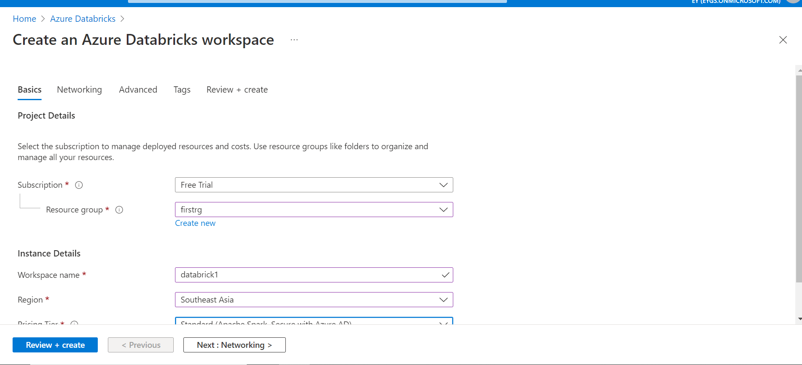 

**_Step 3:_** Now in Networking tab, select yes for Deploy Azure Databricks workspace in your own Virtual Network (VNet) and fill the name of the two subnets and their CIDR ranges. Both the subnets were already created in the existing VNet. 
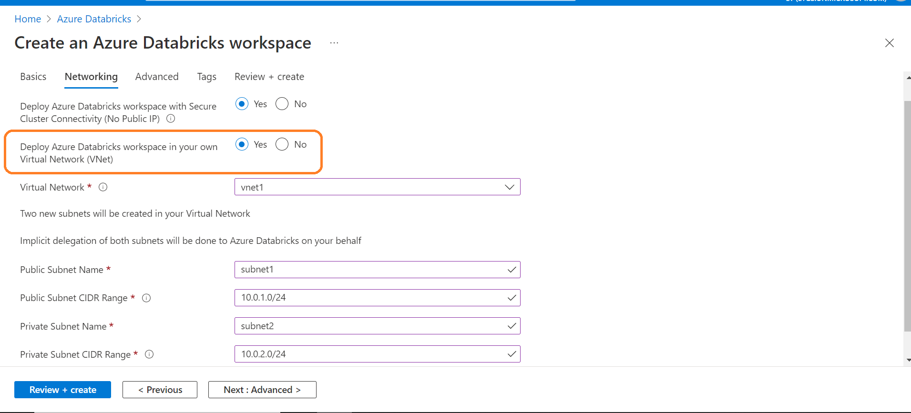 

**_Step 4:_** After filling all the values, click on create and review. 
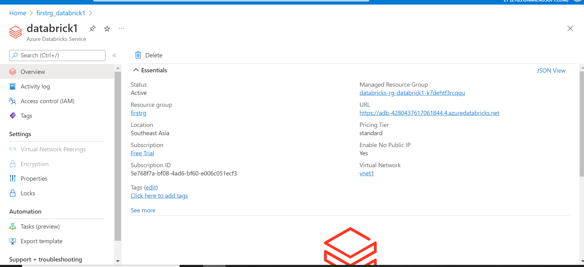 

   

### 2. Ensure  Activity logging is enabled for Azure Databricks

**Security Control Mapping :**  
| Control Number | Control Statement | Security Domain | Default | Associated Runbook | CVSS Severity  |
| -------------- | ----------------- | --------------- | ------- | ------------------ | -------------- |
| CS0012233 | Information System must create a log and record activities occurring on or originating from the information system. Logs must be made accessible to the enterprise SIEM solution  | Security Information and event management   | Enabled but not forwarded to Splunk | None | [Low (2.7)](https://www.first.org/cvss/calculator/3.1#CVSS:3.1/AV:P/AC:H/PR:H/UI:N/S:U/C:L/I:N/A:L) |

**Why, What and How ?** 
  
Client rationale and Justification
[Placeholder link]

   

### 3. Ensure Diagnostic Settings are enabled in Azure Databricks

**Security control mapping:**  
| Control Number | Control Statement | Security Domain | Default | Associated Runbook | CVSS Severity  |
| -------------- | ----------------- | --------------- | ------- | ------------------ | -------------- |
| CS0012233 | Information System must create a log and record activities occurring on or originating from the information system. Logs must be made accessible to the enterprise SIEM solution  | Security Information and event management  | Not Enabled | Network Watcher Runbook | [Low (2.7)](https://www.first.org/cvss/calculator/3.1#CVSS:3.1/AV:P/AC:H/PR:H/UI:N/S:U/C:L/I:N/A:L) |

**What & Why?**  

 This control is to check whether Azure Databricks is enabled with end-to-end diagnostic logs of activities performed by Azure Databricks users, allowing the enterprise to monitor detailed Azure Databricks usage patterns. 

 [How to enable diagnostic logging in Azure Databricks](https://docs.microsoft.com/en-us/azure/databricks/administration-guide/account-settings/azure-diagnostic-logs)
 
   

**How?**  

**_Step 1:_** Login to Azure portal, select the created Data-lake storage account.  

**_Step 2:_** Navigate to ‘Activity log’ and click ‘Diagnostic Settings’ under 'Monitoring' 
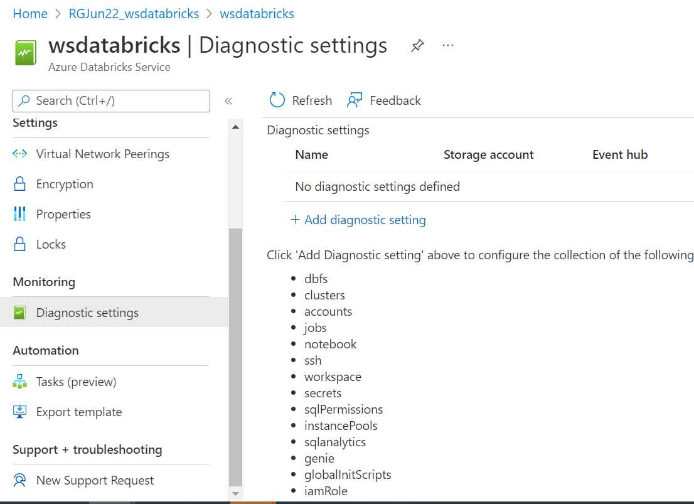 

**_Step 3:_**  Select the 'allLogs ' under the logs and  select “Stream to Event Hub”. Choose the Eventhub namespace and Click on save button.  
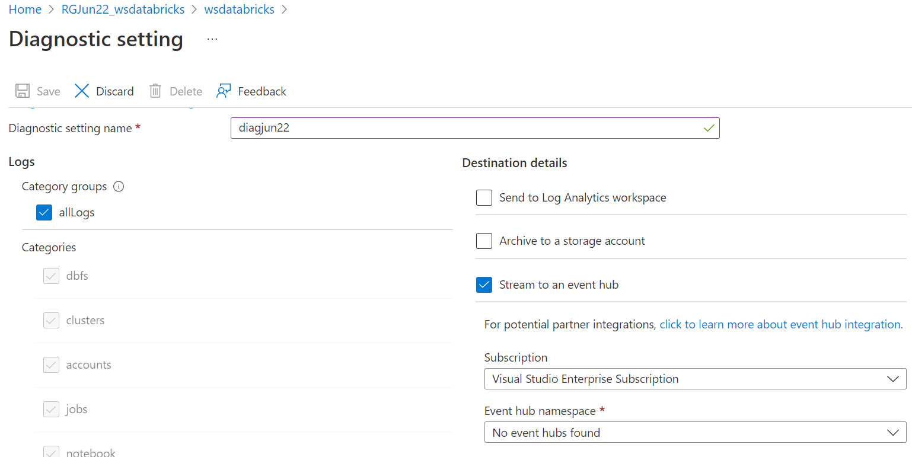 

**_Step 4:_** Connect Splunk app for Microsoft services to the Logs storage account and configure the inputs to extract the logs from Azure storage to Splunk 

Note: Diagnostic setting is available only in the premium plan of Azure Databricks

  

### 4. Ensure secure cluster connectivity is enabled 

**Security control mapping:**  
| Control Number | Control Statement | Security Domain | Default | Associated Runbook | CVSS Severity  |
| -------------- | ----------------- | --------------- | ------- | ------------------ | -------------- |
| [CS0012300](place holder) | Cloud products and services must be deployed on private subnets and public access must be disabled for these services | Network and communication Security | Not enabled | Virtual Network Runbook |  [High (7.2)](https://www.first.org/cvss/calculator/3.1#CVSS:3.1/AV:N/AC:H/PR:H/UI:N/S:C/C:H/I:L/A:L) |

**What & Why?**  

This control is to check whether Azure Databricks workspace is deployed in private subnets without any inbound access to organization network. Clusters will utilize a secure connectivity mechanism to communicate with the Azure Databricks infrastructure, without requiring public IP addresses for the nodes.

Secure Cluster Connectivity enables the following benefits:

1.  `No public IPs:` There are no Public IP addresses for the nodes across all clusters in the workspace. This eliminates the risk of any direct public access. The two subnets required for a workspace are thus both private.
2.  `No open inbound ports:` There are no open inbound ports for access from the Control Plane or from other Azure services in the Network Security Group of the workspace. All access from a cluster in the data plane is either outbound or internal to the cluster. 
3.  `Increased reliability and scalability:` Enterprise data platform becomes more reliable and scalable for large and extra-large workloads, since there is no dependency to launch as many public IPs as cluster nodes and attaching those to the corresponding network interfaces.

**How?**  
**_Step 1:_** Go to Azure portal and search for Azure Databricks and click on create. 
**_Step 2:_** Fill all the values, select resource group, workspace name, region and pricing tier then click on next. 
**_Step 3:_** Now in Networking tab, select yes for Deploy Azure Databricks workspace with Secure Cluster Connectivity (No Public IP)
 and fill the name of the two subnets and their CIDR ranges. Both the subnets were already created in the existing VNet. 
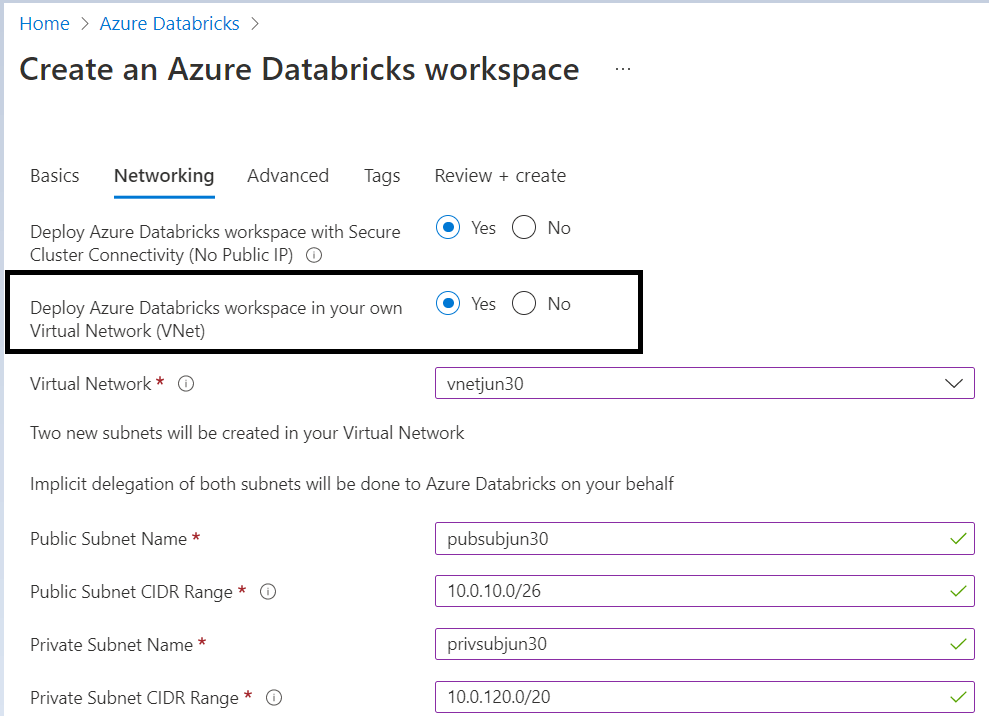 

Refer the below link for more information :  
 [How to enable Secure cluster connectivity (No Public IP / NPIP)](https://databricks.com/blog/2021/02/03/security-cluster-connectivity-is-generally-available-on-azure-databricks.html)
 
   

### 5. Ensure organization-managed CMK is enabled for DBFS and Databricks notebooks

**Security control mapping:**  
| Control Number | Control Statement | Security Domain | Default | Associated Runbook | CVSS Severity  |
| -------------- | ----------------- | --------------- | ------- | ------------------ | -------------- |
|  CS0012168     |Strong encryption key management controls are in place for cloud provider services to protect data at rest | Data Protection  | Not enabled | None | [Medium (5.3)](https://www.first.org/cvss/calculator/3.1#CVSS:3.1/AV:A/AC:H/PR:H/UI:N/S:U/C:H/I:L/A:L)  |

**What & Why?**  

This control checks whether Azure Databricks notebook is encrypted using organization managed CMK for additional control of organization data. Adding organization managed key helps to better protect and control access to the data. Azure Databricks notebooks are stored in the scalable management layer powered by Microsoft, and are by default encrypted with a Microsoft-managed key. As per security recommendations, it is better practice to bring organization-managed per-workspace key to encrypt the notebooks.

This control checks whether Databricks File System (DBFS) is encrypted using organization managed CMK for additional control of organization data. Adding organization managed key helps to better protect and control access to the data. 

Azure Databricks creates a root storage account (DBFS) per workspace in customer’s subscription. By default, the storage account is encrypted with a Microsoft-managed key. As per security recommendations, it is a better practice to bring organization-managed CMK to encrypt DBFDS storage account.

**How?**  

**_Step 1:_**  Go to your Azure Databricks service resource in the Azure portal. 
**_Step 2:_**  In the left menu, under Settings, select Encryption. 
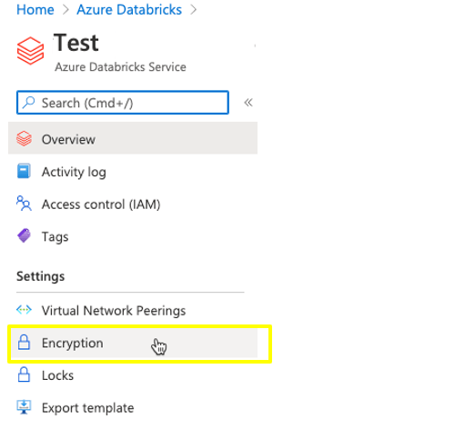 

**_Step 3:_**  Select Use your own key, enter your key’s Key Identifier, and select the Subscription that contains the key 
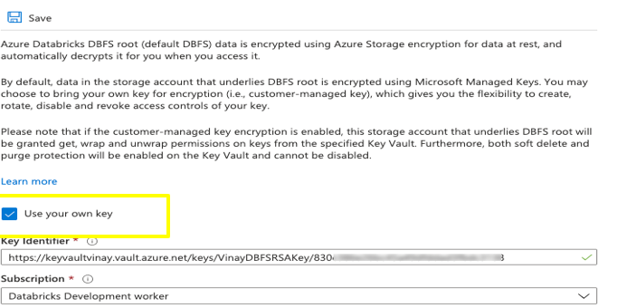 

>**NOTE:**
After customer-managed key is added for encryption against a workspace, Azure Databricks uses that key to encrypt future write operations to organization workspace’s root Blob storage. Existing data is not re-encrypted.

Refer the below link for more information :  
[How to Enable customer-managed key for DBFS](https://docs.microsoft.com/en-us/azure/databricks/security/keys/customer-managed-keys-dbfs/)
 
   

### 6. Ensure Azure Active Directory tokens are used for authentication 

**Security Control Mapping :**  
| Control Number | Control Statement | Security Domain | Default | Associated Runbook | CVSS Severity  |
| -------------- | ----------------- | --------------- | ------- | ------------------ | -------------- |
|  CS0012298	 | Access to change cloud identity access and service control policies is restricted to authorized cloud administrative personnel |  Identity & Access Management | Not enabled | None | [Medium (5.1)](https://www.first.org/cvss/calculator/3.1#CVSS:3.1/AV:A/AC:H/PR:H/UI:N/S:C/C:L/I:L/A:L) |

**What & Why?**  

This control checks whether Azure Active Directory (AAD) tokens are utilized to authenticate the non-UI capabilities of the Azure Databricks workspace, including REST API, Power BI connectivity and Databricks Connect. For running jobs workloads with REST API, it is recommended to use Azure Service Principals with AAD Tokens.

There is two ways to get and use Azure AD access tokens:

1.  Use the `Microsoft Authentication Library (MSAL)` to programmatically get an Azure AD access token for a user.
2.  Define a `service principal` in Azure Active Directory and get an Azure AD access token for the service principal rather than a user. Configure the service principal as one on which authentication and authorization policies can be enforced in Azure Databricks. Service principals in an Azure Databricks workspace can have different fine-grained access control than regular users (user principals).

   

**How?**  

**_Step 1:_**   Go to Azure Active Directory Select Manage, click App registrations > New registration. 
**_Step 2:_**  For Name, enter a name for the application. In the Supported account types section, select Accounts in this organizational directory only. 
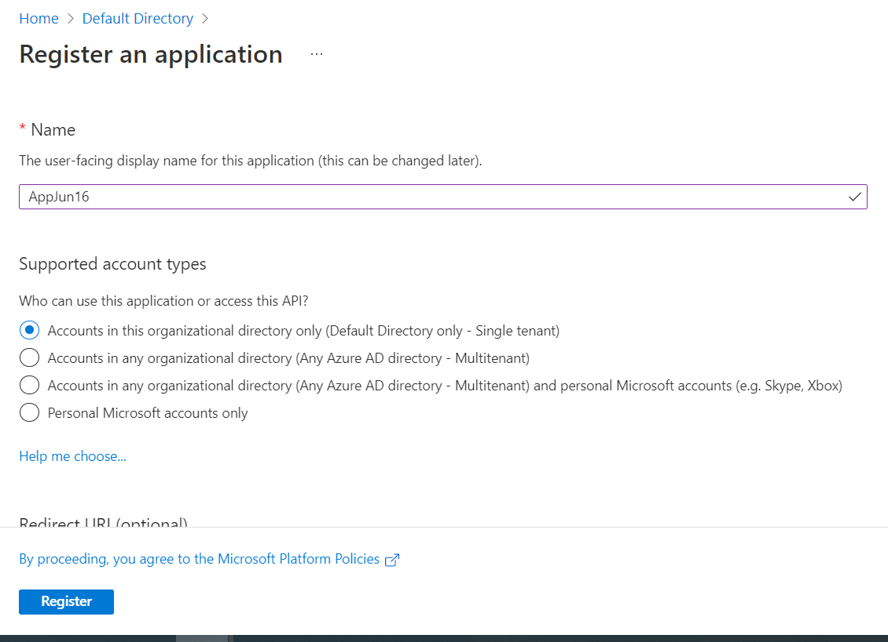 
**_Step 3:_**  Click Register . 
**_Step 4:_**  On the application page’s Overview page, on the Get Started tab, click View API permissions.Click Add a permission and In the Request API permissions pane, click the APIs my organization uses tab, search for AzureDatabricks, and then select it. 
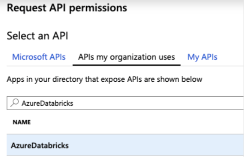 
**_Step 5:_** Enable the user_impersonation check box, and then click Add permissions and Click Grant admin consent for ### and then Yes.  
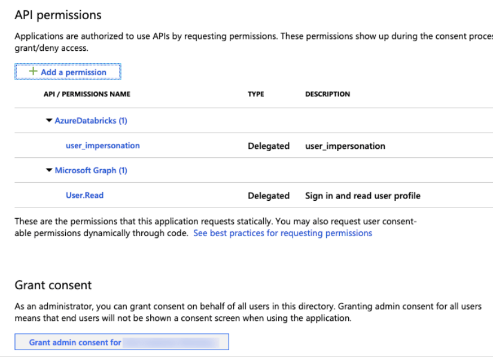 

### 7. Ensure Azure Databricks is securely communicating with Azure Data Services via Private Link endpoints 

**Security Control Mapping :**  
| Control Number | Control Statement | Security Domain | Default | Associated Runbook | CVSS Severity  |
| -------------- | ----------------- | --------------- | ------- | ------------------ | -------------- |
| [CS0012300](place holder) | Cloud products and services must be deployed on private subnets and public access must be disabled for these services | Network and communication Security | Not enabled |Network Security Group Runbook | [High (7.2)](https://www.first.org/cvss/calculator/3.1#CVSS:3.1/AV:N/AC:H/PR:H/UI:N/S:C/C:H/I:L/A:L) 

**What & Why?**  

This control checks whether the communication between Azure Databricks and Azure Data Services goes over Azure network backbone with default data exfiltration protection in place.

Private Link is the the most secure way to access Azure Data services from Azure Databricks. Private Link enables you to access Azure PaaS Services (e.g: Azure Storage, Azure Cosmos DB, and SQL Database) and Azure hosted customer/partner services over a Private Endpoint in organization's virtual network. Traffic between the virtual network and the service traverses over the Microsoft network backbone and thus eliminating the exposure from the public Internet. 

**How?**  

Refer Private endpoint runbook to implement private end points for Azure databricks

[Placeholder link] 

Refer the below link for more information :  
[How to create private link service](https://docs.microsoft.com/en-us/azure/private-link/private-link-service-overview#create-your-private-link-service)
 
   

### 8. Ensure Azure Databricks uses standard organizational resource tagging method ###

**Security Control Mapping :**  
| Control Number | Control Statement | Security Domain | Default | Associated Runbook | CVSS Severity  |
| -------------- | ----------------- | --------------- | ------- | ------------------ | -------------- |
| CS0012261  | Technology hardware and software must be registered and accurately recorded within the enterprise technology repository and/or asset management systems | Asset Management  | Not enabled | organizational Runbook | [Low (1.6)](https://www.first.org/cvss/calculator/3.1#CVSS:3.1/AV:P/AC:H/PR:H/UI:N/S:U/C:N/I:N/A:L) |

**Why, What and How ?** 
  
Client rationale and Justification
[Placeholder link]

   

### 9. Ensure access control list is used in Azure Databricks to enforce least privilege model 

**Security Control Mapping :**  
| Control Number | Control Statement | Security Domain | Default | Associated Runbook | CVSS Severity  |
| -------------- | ----------------- | --------------- | ------- | ------------------ | -------------- |
|  [CS0012298](place holder) 	 | Access to change cloud identity access and service control policies is restricted to authorized cloud administrative personnel |  Identity & Access Management | Not enabled | Azure AD Runbook  | [Medium (5.1)](https://www.first.org/cvss/calculator/3.1#CVSS:3.1/AV:A/AC:H/PR:H/UI:N/S:C/C:L/I:L/A:L) |

**What & Why?**  

 Access control lists (ACLs) must be used to configure permission to access workspace objects (folders, notebooks, experiments, and models), clusters, pools, jobs, Delta Live Tables pipelines, and data tables. Admin users can manage access control lists, as can users who have been given delegated permissions to manage access control lists.

 **Note** Access control is available only in the Premium Plan.

Refer the below link for more information :  
[How to enable access control](https://docs.microsoft.com/en-us/azure/databricks/administration-guide/access-control/)
   

**How?**  

**_Step 1:_**  Navigate to the created Databricks and click on `Launch workspace` button 
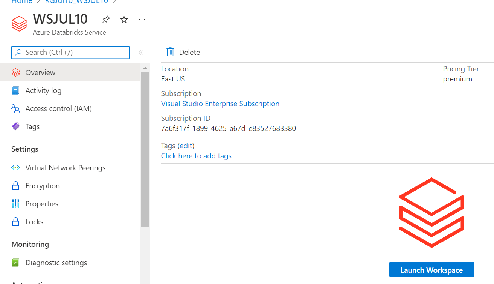 

**_Step 2:_**  In the Databricks console , Navigate to the Settings -> admin Console . 
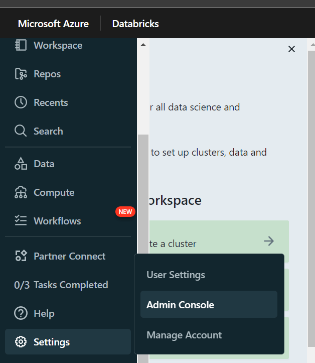 

**_Step 3:_**  Click `Add user` button under users tab and add the users to whom access must be managed  
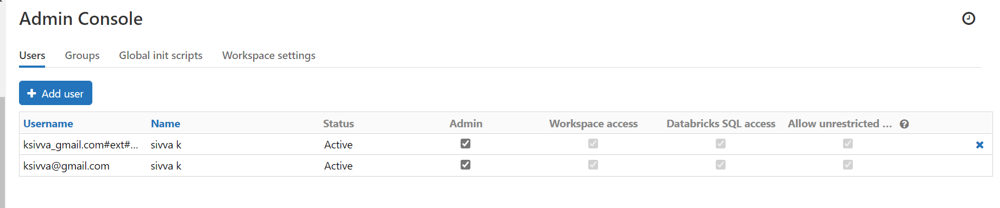 

**_Step 4:_**  Navigate to the workspace settings and enable the required access controls  
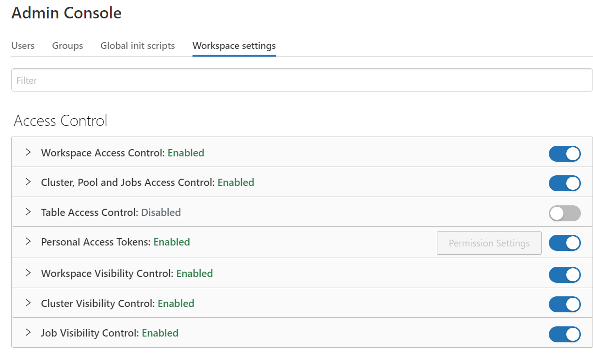 

Refer the below link for more information :  
[How to create private link service](https://docs.microsoft.com/en-us/azure/private-link/private-link-service-overview#create-your-private-link-service)
 
   

## Endnotes ##

### Resources 
1. https://docs.microsoft.com/en-us/azure/databricks/
2. https://docs.microsoft.com/en-us/azure/databricks/scenarios/what-is-azure-databricks

### Glossary 

**Data** - Digital pieces of information stored or transmitted for use with an information system from which understandable information is
derived. Items considered to be data are: Source code, meta-data, build artifacts, information input and output.

**Information System** - An organized assembly of resources and procedures for the collection, processing, maintenance, use, sharing,
dissemination, or disposition of information. All systems, platforms, compute instances including and not limited to physical and virtual
client endpoints, physical and virtual servers, software containers, databases, Internet of Things (IoT) devices, network devices,
applications (internal and external), Serverless computing instances (i.e. AWS Lambda), vendor provided appliances, and third-party
platforms, connected to the Capital Group network or used by Capital Group users or customers.

**Log** - a record of the events occurring within information systems and networks. Logs are composed of log entries; each entry contains
information related to a specific event that has occurred within a system or network.

**Information** - communication or representation of knowledge such as facts, data, or opinions in any medium or form, including textual,
numerical, graphic, cartographic, narrative, or audiovisual.

**Cloud Computing** - A model for enabling ubiquitous, convenient, on-demand network access to a shared pool of configurable computing
resources (e.g., networks, servers, storage, applications, and services) that can be rapidly provisioned and released with minimal
management effort or service provider interaction.

**Vulnerability**- Weakness in an information system, system security procedures, internal controls, or implementation that could be exploited
or triggered by a threat source. Note: The term weakness is synonymous for deficiency. Weakness may result in security and/or privacy
risks.
