# Azure Data Factory - Security baseline requirement <!-- omit in toc -->
## Baseline security configuration requirement for Azure services  <!-- omit in toc -->

**Generated By: EY Security Team**  
**Service Type: Databases**  
**Deployment Phase: Service Discovery**   
**Last updated: 05/24/2022**  

## Table of Contents <!-- omit in toc -->

- [Overview](#overview)
  - [Use Case Examples:](#use-case-examples)
- [Cloud Security Requirements](#cloud-security-requirements)
  - [1. Ensure that Azure Data factory is accessed only using Private Endpoint](#1-ensure-that-azure-data-factory-is-accessed-only-using-private-endpoint)
  - [2. Ensure a self hosted integration runtime is enabled for the integration between multiple data sources and AutoResolveIntegrationRuntime is enabled on managed virtual network](#2-ensure-a-self-hosted-integration-runtime-is-enabled-for-the-integration-between-multiple-data-sources-and-autoresolveintegrationruntime-is-enabled-on-managed-virtual-network)
  - [3. Ensure blob and file data of Data factory are Encrypted with Organization Managed Keys that are stored in Azure Key vault](#3-ensure-blob-and-file-data-of-data-factory-are-encrypted-with-organization-managed-keys-that-are-stored-in-azure-key-vault)
  - [4. Ensure Diagnostic logs are enabled for Azure Data factory](#4-ensure-diagnostic-logs-are-enabled-for-azure-data-factory)
  - [5. Ensure Azure data factory uses standard organizational Resource tagging method](#5-ensure-azure-data-factory-uses-standard-organizational-resource-tagging-method)
  - [6. Ensure Azure Data Factory implements Role Based Access Control](#6-ensure-azure-data-factory-implements-role-based-access-control)
  - [7. Ensure application access to Azure Data factory from other azure services is granted using Managed Identities](#7-ensure-application-access-to-azure-data-factory-from-other-azure-services-is-granted-using-managed-identities)
  - [8. Ensure administrative tasks are performed only in admin-e workstations](#8-ensure-administrative-tasks-are-performed-only-in-admin-e-workstations)
  - [9. Ensure On-premises data store credentials are encrypted and referenced by Azure Data Factory](#9-ensure-on-premises-data-store-credentials-are-encrypted-and-referenced-by-azure-data-factory)
  - [10. Ensure Activity logging is enabled for Azure Data Factory](#10-ensure-activity-logging-is-enabled-for-azure-data-factory)

##  Overview

Azure Data Factory is Azure's cloud ETL service for scale-out serverless data integration and data transformation with a  code-free UI for intuitive authoring and single-pane-of-glass monitoring and management. Existing SSIS packages can also be lifted and shifted to Azure and run them with full compatibility in ADF. 

| Control Number | Cloud Baseline Security Requirements                                                                                                                                          |
| -------------- | ----------------------------------------------------------------------------------------------------------------------------------------------------------------------------- |
| 1              | Ensure that Azure Data factory is accessed only using Private Endpoint                                                                                                        |
| 2              | Ensure a self hosted integration runtime is enabled for the integration between multiple data sources and AutoResolveIntegrationRuntime is enabled on managed virtual network |
| 3              | Ensure blob and file data of Data factory are Encrypted with Organization Managed Keys that are stored in Azure Key vault                                                     |
| 4              | Ensure Diagnostic logs are enabled for Azure Data factory                                                                                                                     |
| 5              | Ensure Azure data factory uses standard organizational Resource tagging method                                                                                                |
| 6              | Ensure Azure Data Factory implements Role Based Access Control                                                                                                                |
| 7              | Ensure application access to Azure Data factory from other azure services is granted using Managed Identities                                                                 |
| 8              | Ensure administrative tasks are performed only in admin-e workstations                                                                                                        |
| 9              | Ensure On-premises data store credentials are encrypted and referenced by Azure Data Factory                                                                                  |
| 10             | Ensure Activity logging is enabled for Azure Data Factory                                                                                                                     |

### Use Case Examples:
- Health data consortium on Azure
- Data governance with Profisee and Azure Purview
- Medical data storage solutions

## Cloud Security Requirements ##

### 1. Ensure that Azure Data factory is accessed only using Private Endpoint ###

**Security Control Mapping :**  
| Control Number | Control Statement | Security Domain | Default | Associated Runbook | CVSS Severity  |
| -------------- | ----------------- | --------------- | ------- | ------------------ | -------------- |
| [CS0012300](place holder) | Cloud products and services must be deployed on private subnets and public access must be disabled for these services | Network and communication Security | Not enabled |[Private Endpoint Runbook](placeholder) | [High (7.2)](https://www.first.org/cvss/calculator/3.1#CVSS:3.1/AV:N/AC:H/PR:H/UI:N/S:C/C:H/I:L/A:L) |

**Why?**   

Access to azure data factory must be limited by assigning virtual network private IP addresses to the registry endpoints using Azure Private Link. Private endpoint will provide a endpoint with Private IP which can be associated with VNet with in tenant, other tenant or from On premise, eliminating exposure from the public internet.  To connect to the Azure service over private endpoint,  DNS settings must be configured via private DNS zones.  Fully qualified domain name (FQDN) for the connection must be mentioned in the DNS settings which resolves to the private IP address of the private endpoint. Security can be enhanced by migrating from public endpoint to private endpoint which must be resolved using Private DNS
    
**Note :** Private access is only available for Premium SKU of Azure Container Repository

**How?**  

**_Step 1:_** Create a Data Factory using Azure portal. In the Portal, Click on the “Create a resource” and select “Data Factory”. 

**_Step 2:_** Select the Resource group, Name, Region and Version. 

 

**_Step 3:_** In the Networking tab, Select Private Endpoint for Connect Via option and Create a private end point and click on Review + create. 

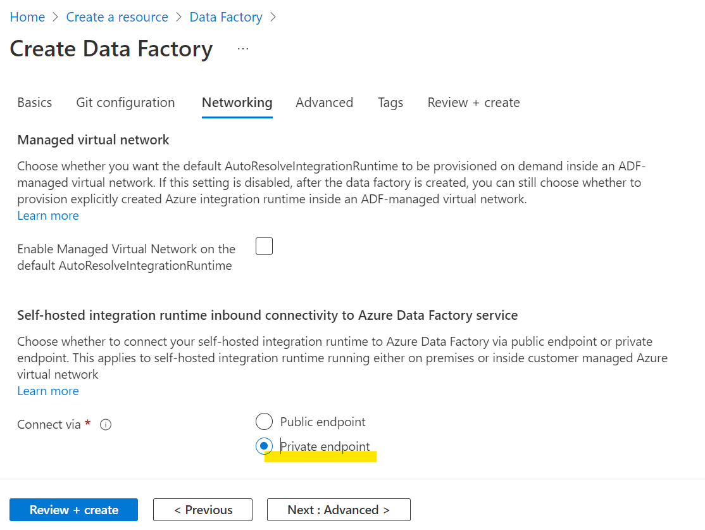 

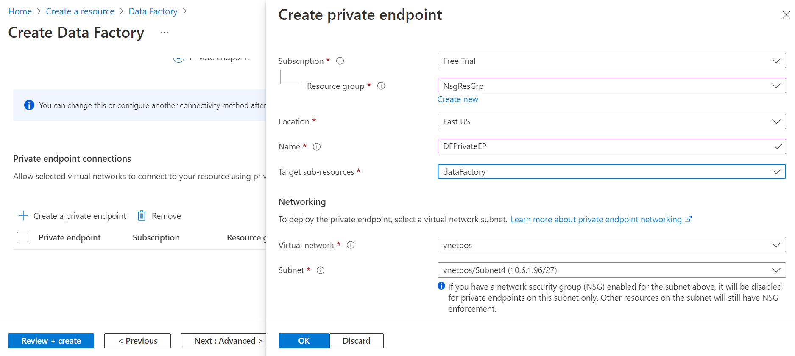 

To implement this control, refer the links:
https://docs.microsoft.com/en-us/azure/data-factory/data-movement-security-considerations#firewall-configurations-and-allow-list-setting-up-for-ip-addresses and
https://docs.microsoft.com/en-us/azure/data-factory/tutorial-copy-data-portal-private

   

### 2. Ensure a self hosted integration runtime is enabled for the integration between multiple data sources and AutoResolveIntegrationRuntime is enabled on managed virtual network 

**Security Control Mapping :**  
| Control Number | Control Statement | Security Domain | Default | Associated Runbook | CVSS Severity  |
| -------------- | ----------------- | --------------- | ------- | ------------------ | -------------- |
| [CS0012300](place holder) | Cloud products and services must be deployed on private subnets and public access must be disabled for these services | Network and communication Security | Not enabled |Network Security Group Runbook | [High (7.2)](https://www.first.org/cvss/calculator/3.1#CVSS:3.1/AV:N/AC:H/PR:H/UI:N/S:C/C:H/I:L/A:L) |

The Integration Runtime (IR) is the compute infrastructure used by Azure Data Factory to provide the following data integration capabilities across different network environments: A self-hosted integration runtime can run copy or transform activities between a cloud data store and a data store in a private network. The installation of a self-hosted integration runtime needs a virtual machine inside a private network.
Choose whether you want the default AutoResolveIntegrationRuntime to be provisioned on demand inside an ADF-managed virtual network. If this setting is disabled, after the data factory is created, you can still choose whether to provision explicitly created Azure integration runtime inside an ADF-managed virtual network

**Note :** This requires a VM in the private network

**How?**  

**_Step 1:_** Create a Data Factory using Azure portal. In the Portal, Click on the “Create a resource” and select “Data Factory”. 

**_Step 2:_** Select the Resource group, Name, Region and Version. 
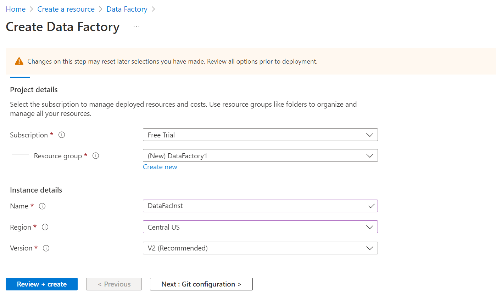 

**_Step 3:_** In Networking tab Select ‘Enable Managed Virtual Network on the default AutoResolveIntegrationRuntime. 
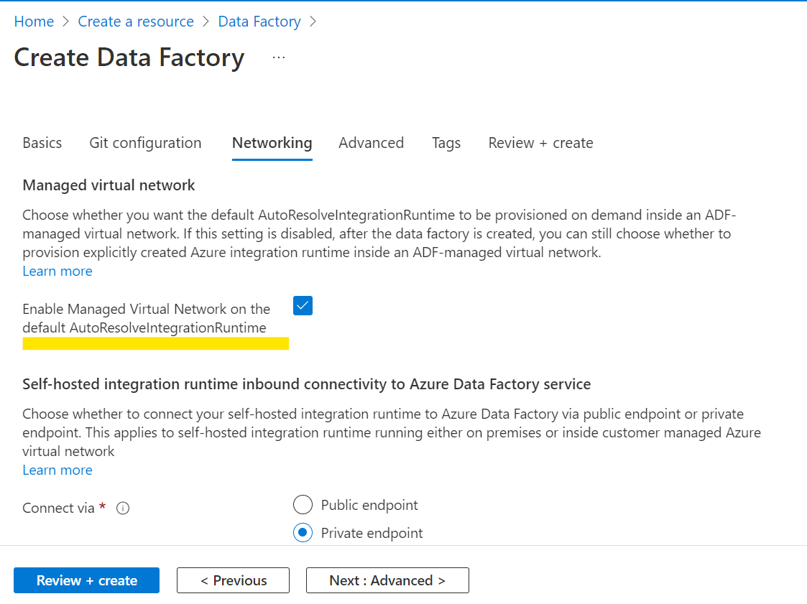 
  

To implement this control, refer the link:
https://docs.microsoft.com/en-us/azure/data-factory/create-self-hosted-integration-runtime?tabs=data-factory
https://docs.microsoft.com/en-us/azure/data-factory/tutorial-copy-data-portal-private

To Implement private link service to access on-prem SQL Server, refer following documentation
https://docs.microsoft.com/en-us/azure/data-factory/tutorial-managed-virtual-network-on-premise-sql-server

   

### 3. Ensure blob and file data of Data factory are Encrypted with Organization Managed Keys that are stored in Azure Key vault ###

**Security Control Mapping :**  

| Control Number | Control Statement | Security Domain | Default | Associated Runbook | CVSS Severity  |
| -------------- | ----------------- | --------------- | ------- | ------------------ | -------------- |
|  [CS0012168](place holder)       |Strong encryption key management controls are in place for cloud provider services to protect data at rest | Data Protection  | Not enabled | None | [Medium (5.3)](https://www.first.org/cvss/calculator/3.1#CVSS:3.1/AV:A/AC:H/PR:H/UI:N/S:U/C:H/I:L/A:L)  |

**Why?**  

By default, blob and the file data in the data factory is encrypted with Microsoft-managed keys. For additional control over encryption keys, customer-managed keys can be used to encrypt the blob and file data. These keys can be stored in an Azure Key Vault and can be accessed through Managed identities or service principals

**How?**  

**_Step 1:_** Create a Data Factory using Azure portal. In the Portal, Click on the “Create a resource” and select “Data Factory”. 

**_Step 2:_** Select the Resource group, Name, Region and Version. 
 

**_Step 3:_** In Advanced tab Select ‘Enable encryption using a customer managed key option and select Key Vault URL and User Assigned Identity for Encryption and Click on Review + create. 

  

To implement this control, refer the link:
https://docs.microsoft.com/en-us/azure/data-factory/how-to-use-azure-key-vault-secrets-pipeline-activities

   

### 4. Ensure Diagnostic logs are enabled for Azure Data factory 

**Security Control Mapping :**  
| Control Number | Control Statement | Security Domain | Default | Associated Runbook | CVSS Severity  |
| -------------- | ----------------- | --------------- | ------- | ------------------ | -------------- |
| [CS0012233](place holder) | Information System must create a log and record activities occurring on or originating from the information system. Logs must be made accessible to the enterprise SIEM solution  | Security Information and event management   | Enabled but not forwarded to Splunk | None | [Low (2.7)](https://www.first.org/cvss/calculator/3.1#CVSS:3.1/AV:P/AC:H/PR:H/UI:N/S:U/C:L/I:N/A:L) |

**Why?**  

The event log contains information about notable events based on ActivityRuns, PipelineRuns and TriggerRuns . This logs when forwarded to Splunk provide necessary information to create notable alerts for any rule created to allow connection from internet

**How?**  

**_Step 1:_** Go to the already created and existing Data Factory and Select Diagnostic settings under monitoring in the left side menu. 
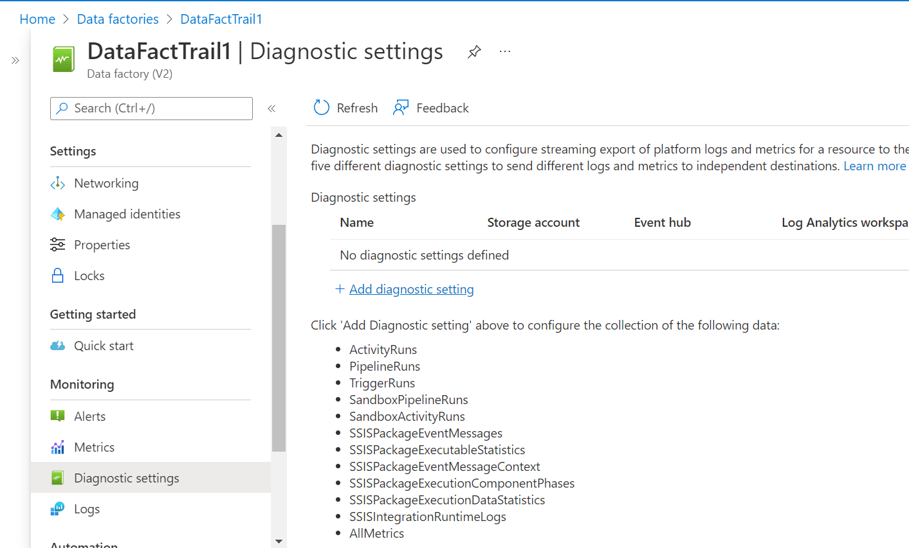  

**_Step 2:_** Click on +Add diagnostic settings and select ActivityRuns,PipelineRuns,TriggerRuns,SandboxPipelineRuns,SandboxActivityRuns,SSISPackageEventMessages,SSISPackageExecutableStatistics,SSISPackageEventMessageContext,SSISPackageExecutionComponentPhases,SSISPackageExecutionDataStatistics,SSISIntegrationRuntimeLogs under Categories. 
 

**_Step 3:_** Select Stream to an Event hub. Choose the Eventhub namespace and Click on save button.  . 
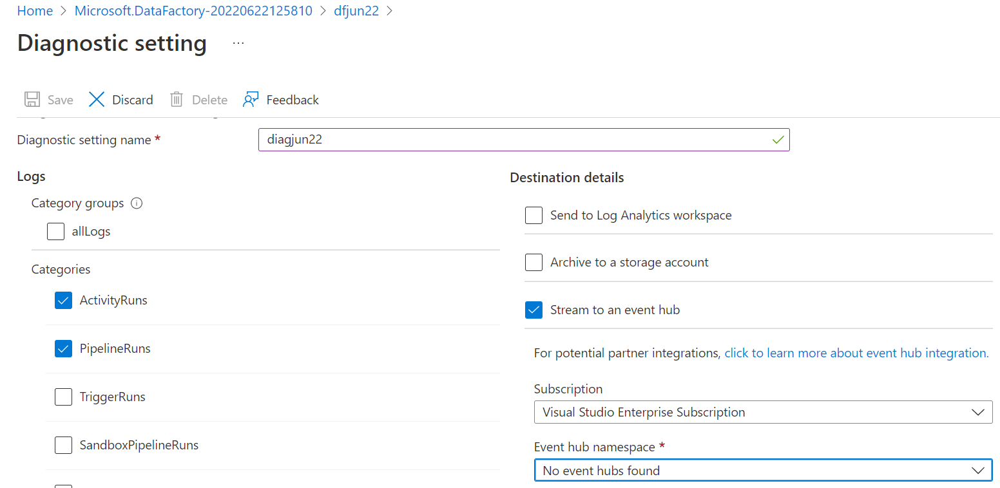
  

To implement this control, refer the links:
https://docs.microsoft.com/en-us/azure/data-factory/monitor-schema-logs-events and 
https://docs.microsoft.com/en-us/azure/data-factory/monitor-using-azure-monitor

   

### 5. Ensure Azure data factory uses standard organizational Resource tagging method ###

**Security Control Mapping :**  
| Control Number | Control Statement | Security Domain | Default | Associated Runbook | CVSS Severity  |
| -------------- | ----------------- | --------------- | ------- | ------------------ | -------------- |
| [CS0012261](place holder)  | Technology hardware and software must be registered and accurately recorded within the enterprise technology repository and/or asset management systems | Asset Management  | Not enabled | organizational Runbook | [Low (1.6)](https://www.first.org/cvss/calculator/3.1#CVSS:3.1/AV:P/AC:H/PR:H/UI:N/S:U/C:N/I:N/A:L) |

**Why, What and How ?** 
  
Client rationale and Justification
[Placeholder link]

   

### 6. Ensure Azure Data Factory implements Role Based Access Control ###

**Security Control Mapping :**  
| Control Number | Control Statement | Security Domain | Default | Associated Runbook | CVSS Severity  |
| -------------- | ----------------- | --------------- | ------- | ------------------ | -------------- |
| [CS0012300](place holder) | Cloud products and services must be deployed on private subnets and public access must be disabled for these services |Identity & Access Management | Not enabled | Virtual Network Runbook | [Medium (5.2)](https://www.first.org/cvss/calculator/3.1#CVSS:3.1/AV:L/AC:H/PR:H/UI:N/S:U/C:L/I:H/A:L) |

[Place Holder ]
        
**Following are the suggested RBAC roles for Azure Data Factory**  
| Function | Description | Role | 
| -------------- | ----------------- | --------------- | 
|  Network admin | Lets you manage networks, but not access to them | [Network Contributor](https://github.com/MicrosoftDocs/azure-docs/blob/main/articles/role-based-access-control/built-in-roles.md#network-contributor) |
|  Datafactory Admin |Create and manage data factories, as well as child resources within them | [Data Factory Contributor](https://github.com/MicrosoftDocs/azure-docs/blob/main/articles/role-based-access-control/built-in-roles.md#data-factory-contributor) |

To implement this control, refer the link: https://docs.microsoft.com/en-us/azure/data-factory/concepts-roles-permissions

   

### 7. Ensure application access to Azure Data factory from other azure services is granted using Managed Identities ###

**Security Control Mapping :** 

| Control Number | Control Statement | Security Domain | Default | Associated Runbook | CVSS Severity  |
| -------------- | ----------------- | --------------- | ------- | ------------------ | -------------- |
|  [CS0012298](place holder)       | Access to change cloud identity access and service control policies is restricted to authorized cloud administrative personnel |Identity & Access Management | Not enabled | None | [Medium (5.1)](https://www.first.org/cvss/calculator/3.1#CVSS:3.1/AV:A/AC:H/PR:H/UI:N/S:C/C:L/I:L/A:L) |

**Why?**  

Managed identity enables Azure resources to authenticate to cloud services (e.g. Azure Key Vault) without storing credentials in code. Once enabled, all necessary permissions can be granted via Azure role-based-access-control. 
In system assigned managed identity, the lifecycle of this type of managed identity is tied to the lifecycle of this resource. Additionally, each resource (e.g. Virtual Machine) can only have one system assigned managed identity. 
In User assigned managed identity, managed identities are created as standalone Azure resources, and have their own lifecycle. A single resource (e.g. Virtual Machine) can utilize multiple user assigned managed identities. A single user assigned managed identity can be shared across multiple resources.
Using these Managed Identities in the context of Data Factory is a great way to allow interoperability between resources without needing an extra layer of Service Principals (SPN’s) or local resource credentials stored in Key Vault.

**How?**  

**_Step 1:_** Navigate to existing data factory and click on Managed identities under settings and check the status is 'on' 
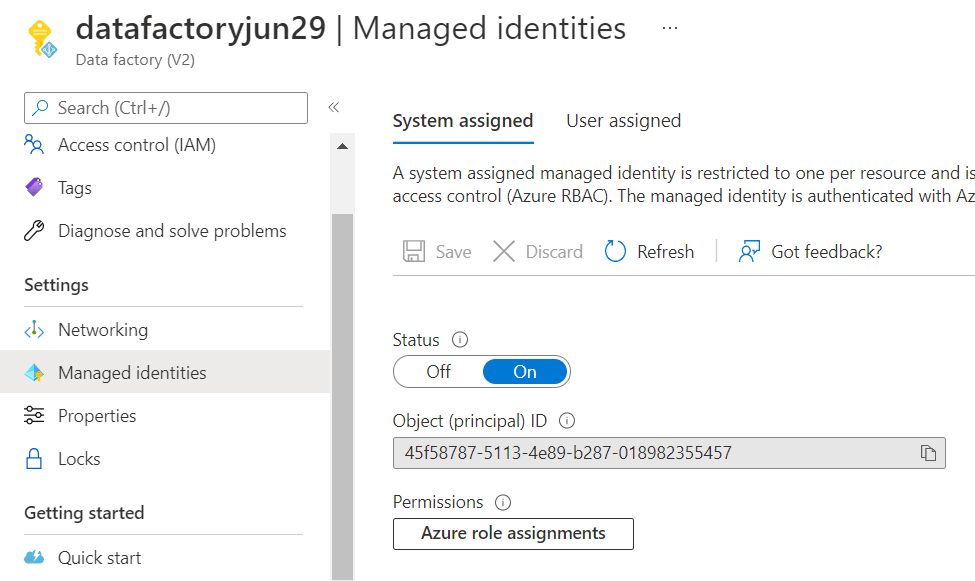 

**_Step 2:_** In the side menu bar of the Data Factory page, Navigate to Access control(IAM) and click on +Add and select Add role assignment 
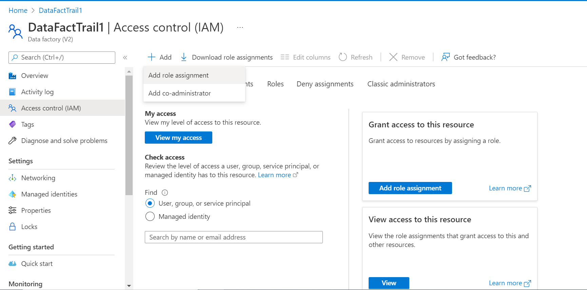 

**_Step 3:_** Navigate to members tab and select Managed identity. Select the subscription and select the managed identity created for the Data factory and click on select and then Review + assign. 
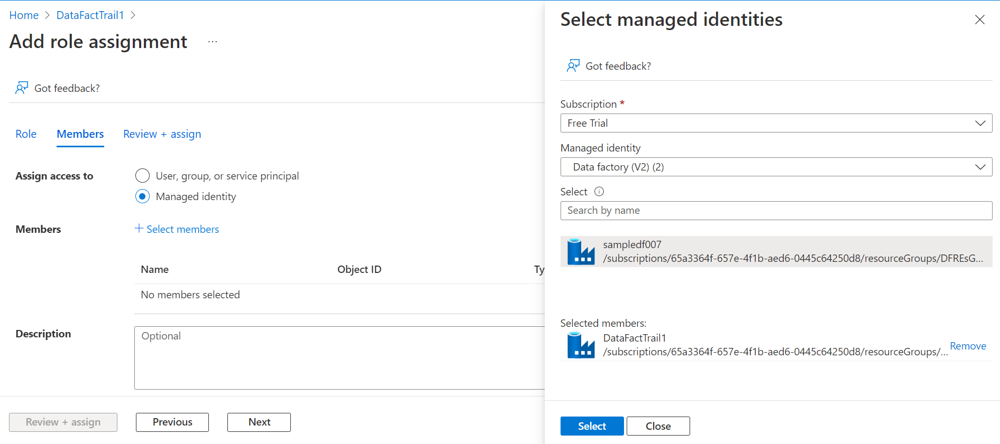
  

To implement this control, refer the link: https://docs.microsoft.com/en-us/azure/data-factory/data-factory-service-identity?tabs=data-factory

  

### 8. Ensure administrative tasks are performed only in admin-e workstations ###

**Security Control Mapping :**  
| Control Number | Control Statement | Security Domain | Default | Associated Runbook | CVSS Severity  |
| -------------- | ----------------- | --------------- | ------- | ------------------ | -------------- |
|  [CS0012298](place holder)	 | Access to change cloud identity access and service control policies is restricted to authorized cloud administrative personnel |  Identity & Access Management | Not enabled | None | [[Low (3.0)](https://www.first.org/cvss/calculator/3.1#CVSS:3.1/AV:L/AC:H/PR:H/UI:N/S:U/C:L/I:L/A:N)|

**Why?**  

A Privileged workstation provides a hardened workstation that has clear application control and application guard. The workstation uses credential guard, device guard, app guard, and exploit guard to protect the host from malicious behavior. All the administrative tasks must be performed only using the admin-e workstation

**How?**  
**_Step 1:_** Request permission to add the user to corresponding entitlements to access admin e workstation 

**_Step 2:_** Login to the workstation as the user and launch the azure portal in browser to perform administrative tasks 

  

To implement this control, refer the link:
https://docs.microsoft.com/en-us/security/compass/privileged-access-deployment

   

### 9. Ensure On-premises data store credentials are encrypted and referenced by Azure Data Factory ###

**Security Control Mapping :**   

| Control Number | Control Statement | Security Domain | Default | Associated Runbook | CVSS Severity  |
| -------------- | ----------------- | --------------- | ------- | ------------------ | -------------- |
|  [CS0012168](place holder)       |Strong encryption key management controls are in place for cloud provider services to protect data at rest | Data Protection  | Not enabled | None | [Medium (5.3)](https://www.first.org/cvss/calculator/3.1#CVSS:3.1/AV:A/AC:H/PR:H/UI:N/S:U/C:H/I:L/A:L)  

**Why?**  

Credentials that are stored within the data factory are always stored encrypted on the self-hosted integration runtime. Credentials can be stored locally without flowing the credentials through Azure backend to the self-hosted integration runtime using Windows DPAPI to encrypt the sensitive data and credential information in the self-hosted integration runtime .

**How?**  

**_Step 1:_** In the Key Vault, Navigate to Access policies in the left side menu and click on +Add access policy. 
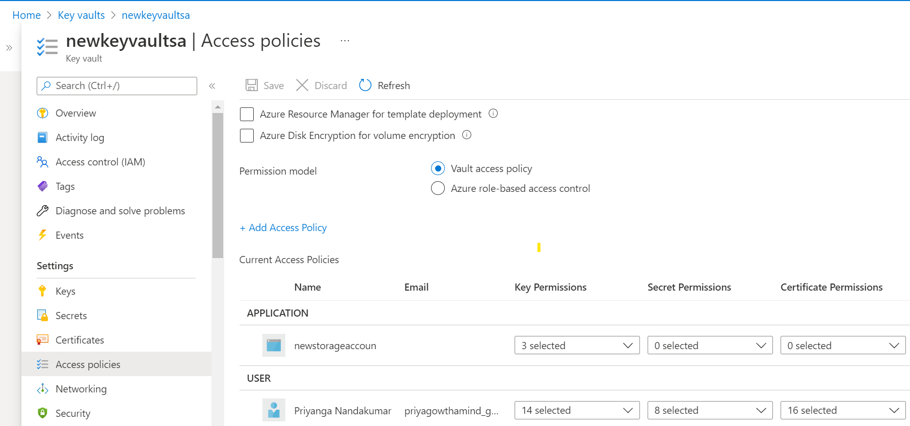 

**_Step 2:_** Under Select principal, Click None selected and add the Data Factory which is created and Click Select. 
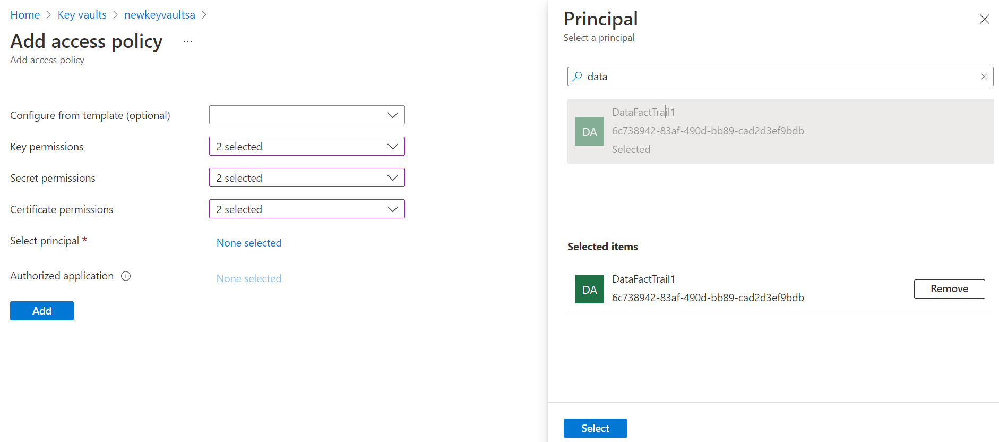 

**_Step 3:_** Once the Data Factory is selected click Add. 
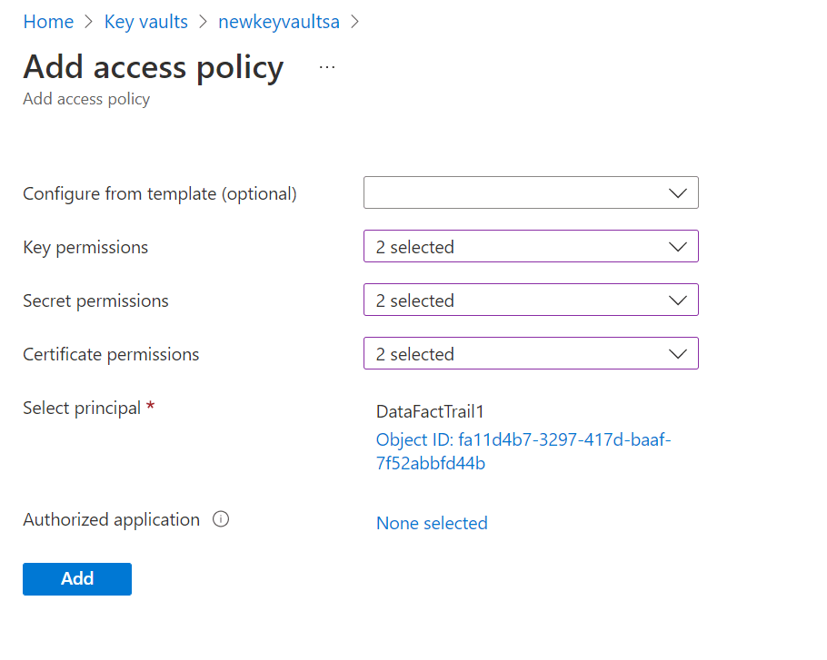 
  

To implement this control, refer the links:
https://docs.microsoft.com/en-us/azure/data-factory/encrypt-credentials-self-hosted-integration-runtime
 and 
https://docs.microsoft.com/en-us/azure/data-factory/data-movement-security-considerations#on-premises-data-store-credentials

  

### 10. Ensure Activity logging is enabled for Azure Data Factory

**Security Control Mapping :**  
| Control Number | Control Statement | Security Domain | Default | Associated Runbook | CVSS Severity  |
| -------------- | ----------------- | --------------- | ------- | ------------------ | -------------- |
| CS0012233 | Information System must create a log and record activities occurring on or originating from the information system. Logs must be made accessible to the enterprise SIEM solution  | Security Information and event management   | Enabled but not forwarded to Splunk | None | [Low (2.7)](https://www.first.org/cvss/calculator/3.1#CVSS:3.1/AV:P/AC:H/PR:H/UI:N/S:U/C:L/I:N/A:L) |

**Why, What and How ?** 
  
Client rationale and Justification  
[Placeholder link]

   

