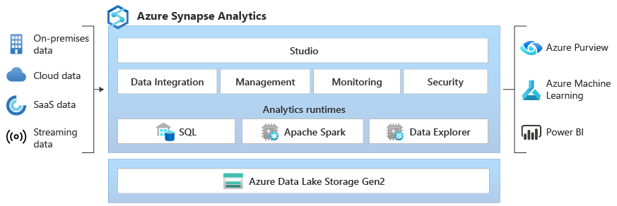
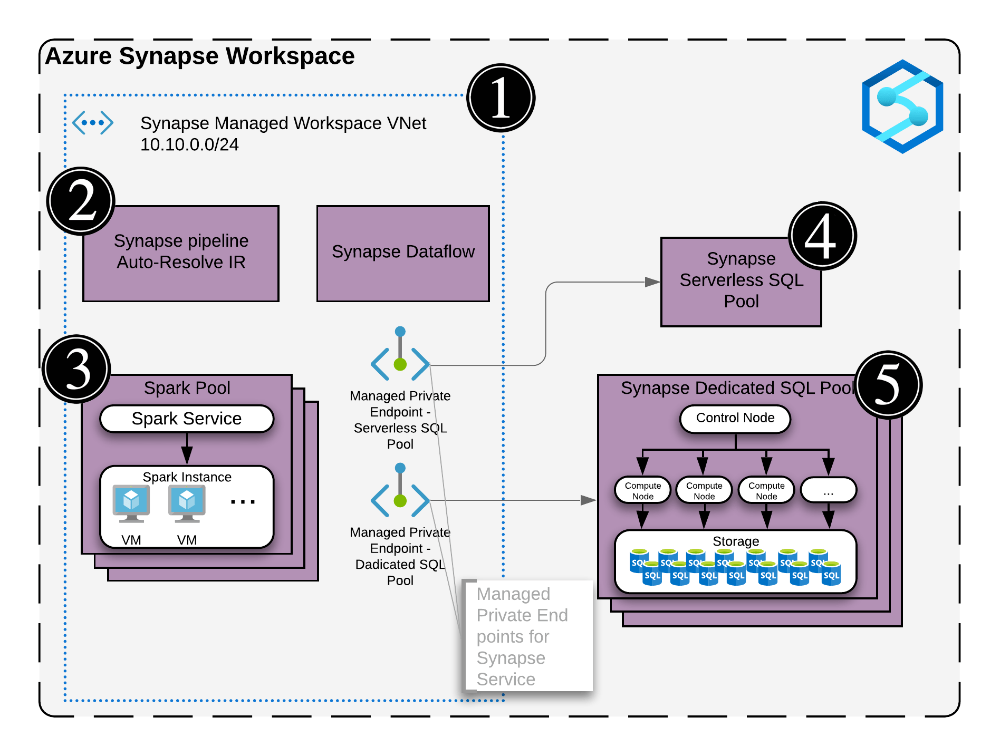
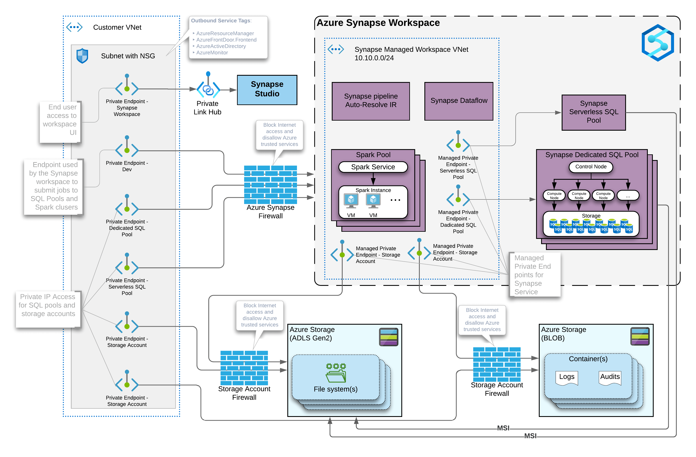

## Baseline security configuration requirement for Azure services  <!-- omit in toc -->

**Generated By: EY Security Team**  
**Service Type: Analytics**  
**Deployment Phase: Service Discovery**   
**Last updated: 06/28/2022**  

## Table of Contents <!-- omit in toc -->

- [Overview](#overview)
  - [Components of Azure Synapse Analytics](#components-of-azure-synapse-analytics)
  - [Use Case Examples:](#use-case-examples)
- [Cloud Security Requirements](#cloud-security-requirements)
  - [1. Ensure Azure Synapse Studio using Azure Private Link Hubs](#1-ensure-azure-synapse-studio-using-azure-private-link-hubs)
  - [2. Ensure each data source is connected using Managed private endpoint within Synapse Workspace](#2-ensure-each-data-source-is-connected-using-managed-private-endpoint-within-synapse-workspace)
  - [3. Ensure private links will be used to connect to Azure Synapse workspace](#3-ensure-private-links-will-be-used-to-connect-to-azure-synapse-workspace)
  - [4. Ensure managed VNet has access to secure storage account](#4-ensure-managed-vnet-has-access-to-secure-storage-account)
  - [5. Ensure public network access is disabled](#5-ensure-public-network-access-is-disabled)
  - [6. Ensure Azure Synapse analytics implement Role Based Access Control](#6-ensure-azure-synapse-analytics-implement-role-based-access-control)
  - [7. Ensure linked services that support AAD authentication uses managed Identity or service principal to connect to Azure synapse analytics](#7-ensure-linked-services-that-support-aad-authentication-uses-managed-identity-or-service-principal-to-connect-to-azure-synapse-analytics)
  - [8. Ensure that SQL Authentication is disabled and Azure Synapse Analytics is accessed only using Azure Active Directory](#8-ensure-that-sql-authentication-is-disabled-and-azure-synapse-analytics-is-accessed-only-using-azure-active-directory)
  - [9. Ensure outbound data traffic is allowed only to the approved Azure AD tenants](#9-ensure-outbound-data-traffic-is-allowed-only-to-the-approved-azure-ad-tenants)
  - [10. Ensure Diagnostic log is enabled for Synapse analytics and forwarded to Splunk](#10-ensure-diagnostic-log-is-enabled-for-synapse-analytics-and-forwarded-to-splunk)
  - [11. Ensure Synapse analytics use standard organizational Resource tagging method](#11-ensure-synapse-analytics-use-standard-organizational-resource-tagging-method)
  - [12. Ensure Synapse analytics is Integrated to Malware and Vulnerability scanning tools](#12-ensure-synapse-analytics-is-integrated-to-malware-and-vulnerability-scanning-tools)
  - [13. Ensure that minimum TLS version needed by applications using storage account's data is version 1.2 or more](#13-ensure-that-minimum-tls-version-needed-by-applications-using-storage-accounts-data-is-version-12-or-more)
  - [14. Ensure that dynamic data mask is added to restrict sensitive data access to only privileged users](#14-ensure-that-dynamic-data-mask-is-added-to-restrict-sensitive-data-access-to-only-privileged-users)
  - [15. Ensure database in Azure Synapse analytics are Encrypted with Organization Managed Keys](#15-ensure-database-in-azure-synapse-analytics-are-encrypted-with-organization-managed-keys)
  - [16. Ensure Activity logging is enabled for Azure Container Instance](#16-ensure-activity-logging-is-enabled-for-azure-container-instance)

##  Overview

Azure Synapse is a Platform-as-a-service (PaaS) analytics service that brings together multiple independent components such as dedicated SQL pools, serverless SQL pools, Apache Spark pools, and data integration pipelines. These components are designed to work together to provide a seamless analytical platform experience.
  - Pipelines for data integration.
  - Apache Spark pool for big data processing.
  - Data Explorer for log and time series analytics.
  - Serverless SQL pool for data exploration over Azure Data Lake.
  - Dedicated SQL pool (formerly SQL DW) for enterprise data warehousing.
  - Deep integration with Power BI, Azure Cosmos DB, and Azure Machine Learning.

| Control Number | Cloud Baseline Security Requirements                                                                                                    |
| -------------- | --------------------------------------------------------------------------------------------------------------------------------------- |
| 1              | Ensure Azure Synapse Studio using Azure Private Link Hubs                                                                               |
| 2              | Ensure each data source is connected using Managed private endpoint within Synapse Workspace                                            |
| 3              | Ensure private links will be used to connect to Azure Synapse workspace                                                                 |
| 4              | Ensure managed VNet has access to secure storage account                                                                                |
| 5              | Ensure public network access is disabled                                                                                                |
| 6              | Ensure Azure Synapse analytics implement Role Based Access Control                                                                      |
| 7              | Ensure linked services that support AAD authentication uses managed Identity or service principal to connect to Azure synapse analytics |
| 8              | Ensure that SQL Authentication is disabled and Azure Synapse Analytics is accessed only using Azure Active Directory                    |
| 9              | Ensure outbound data traffic is allowed only to the approved Azure AD tenants                                                           |
| 10             | Ensure Diagnostic log is enabled for Synapse analytics and forwarded to Splunk                                                          |
| 11             | Ensure Synapse analytics use standard organizational Resource tagging method                                                            |
| 12             | Ensure Synapse analytics is Integrated to Malware and Vulnerability scanning tools                                                      |
| 13             | Ensure that minimum TLS version needed by applications using storage account's data is version 1.2 or more                              |
| 14             | Ensure that dynamic data mask is added to restrict sensitive data access to only privileged users                                       |
| 15             | Ensure database in Azure Synapse analytics are Encrypted with Organization Managed Keys                                                 |
| 16             | Ensure Activity logging is enabled for Azure Container Instance                                                                         |

### Components of Azure Synapse Analytics 

1.  **Studio**  Studio provides a web access to a portal to Synapse Analytics workspace. Using studio one can perform Data Integration, Management, Monitoring and Security. By Default Azure provides public Endpoint to connect to Azure Synapse Analytics studio https://web.azuresynapse.net/. Using Azure Synapse Studio using Azure Private Link Hubs, Enterprise can securely connect to Azure Synapse Studio from the Azure virtual network. Azure Synapse Analytics private link hubs are Azure resources which act as connectors between the secured network and the Synapse Studio web experience.    
2.  **Synapse Workspace**   Synapse Workspace provides runtimes for SQ, Apache and data explorer pool that enables performing analytics on multiple data source like on-premise data, cloud data and other external data source. Example dedicated SQL pools are provisioned clusters that provide enterprise data warehousing capabilities for SQL workloads. Manged virtual networking, Synapse RBAC and Azure cross tenant limitations provides security features to limit data exfilttion. Pipelines are a logical grouping of activities that perform data movement and data transformation at scale. Pipelines use the Integration Runtime (IR) as the scalable compute infrastructure for performing data movement and dispatch activities. The Azure IR provides a fully managed, scalable, and on-demand compute infrastructure. The Self-hosted IR is installed and configured by the customer in their own network, either in on-premises machines or in Azure cloud virtual machines. Customers can choose to associate their Synapse workspace with a managed workspace virtual network. When associated with a managed workspace virtual network, Azure IRs and Apache Spark clusters that are used by pipelines, data flows, and the Apache Spark pools are deployed inside the managed workspace virtual network. This setup ensures network isolation between the workspaces for pipelines and Apache Spark workloads.  
3.  **Azure data Lake storage Gen2**   Once the analytics runtime process the data, Data will be stored in Azure data Lake storage Gen2. By default, storage account deployed will be exposed to public endpoint. Using Managed Virtual network and Synapse managed Identity, Storage account can be secured for Enterprise use case.  

### Use Case Examples:
- Defect prevention with predictive maintenance using analytics and machine learning
- Automated enterprise BI
- Big data analytics with Azure Data Explorer
- TimeXtender with cloud scale analytics

## Cloud Security Requirements ##

### 1. Ensure Azure Synapse Studio using Azure Private Link Hubs 

**Security Control Mapping :**  
| Control Number | Control Statement | Security Domain | Default | Associated Runbook | CVSS Severity  |
| -------------- | ----------------- | --------------- | ------- | ------------------ | -------------- |
| [CS0012300](place holder) | Cloud products and services must be deployed on private subnets and public access must be disabled for these services | Network and communication Security | Not enabled |Network Security Group Runbook | [High (7.2)](https://www.first.org/cvss/calculator/3.1#CVSS:3.1/AV:N/AC:H/PR:H/UI:N/S:C/C:H/I:L/A:L) |

**What & Why?**   

By Default Azure provides public Endpoint to connect to Azure Synapse Analytics studio https://web.azuresynapse.net/. Firewall provide limited capability to filter the public IP address, However, the attacker can perform reconnaissance using the public endpoint and can exploit any miss-configuration or vulnerability. 

Enterprise can securely connect to Azure Synapse Studio from Azure virtual network using private links. Azure Synapse Analytics private link hubs are Azure resources which act as connectors between Organization secured network and the Synapse Studio web experience.
There are two steps to connect to Synapse Studio using private links. First, a private link hubs resource is created. Second, create a private endpoint from Azure virtual network to this private link hub. Use private endpoints to securely communicate with Synapse Studio. Integrate the private endpoints with the DNS solution, either with on-premises solution or Azure Private DNS.

 
    
**How?**  

**_Step 1:_** Go to azure portal, search for Virtual Machine and create one VNet in the region required. 
**_Step 2:_** Now search for private link hub in search box and create one private link hub  
/1a.png) 

**_Step 3:_** after filling all the required values click on review and create. 
/1b.png) 

**_Step 4:_** Now create one private endpoint and select the Vnet and all other values in resource type select Microsoft.Synapse/PrivateLinkHubs. 
/1c.png) 

**_Step 5:_** Select the DNS and review and create. 
/1d.png) 

**_Step 6:_** Go to Private endpoint connections and the connection state is approved. 
/1e.png) 

For more details, refer the link:
https://docs.microsoft.com/en-us/azure/synapse-analytics/guidance/security-white-paper-network-security#private-endpoints
https://techcommunity.microsoft.com/t5/azure-architecture-blog/understanding-azure-synapse-private-endpoints/ba-p/2281463
https://docs.microsoft.com/en-us/azure/synapse-analytics/security/synapse-private-link-hubs

   

### 2. Ensure each data source is connected using Managed private endpoint within Synapse Workspace

**Security Control Mapping :**  
| Control Number | Control Statement | Security Domain | Default | Associated Runbook | CVSS Severity  |
| -------------- | ----------------- | --------------- | ------- | ------------------ | -------------- |
| [CS0012300](place holder) | Cloud products and services must be deployed on private subnets and public access must be disabled for these services | Network and communication Security | Not enabled |Network Security Group Runbook | [Medium (5.3)](https://www.first.org/cvss/calculator/3.1#CVSS:3.1/AV:A/AC:H/PR:H/UI:N/S:U/C:H/I:L/A:L) |

**What & Why?**   

Azure synapse provides microsoft managed private endpoint to establish a secure connection to data source. Synapse uses a managed VNET / Subnet (i.e. not a customer’s) and exposes private endpoints in customers’ vnets as needed. This is the reason  a VNET is never picked in the wizard during the creation. Create a Managed private endpoint to the data source from Azure Synapse Studio

 
    
**How?**  
**_Step 1:_** Go to Azure portal and search for azure synapse analytics and create one workspace 
/2a.png) 

**_Step 2:_** Make a password for sql server and in networking section  enable managed Vnet 
/2b.png) 

/2c.png) 

**_Step 3:_** Now open the workspace and go to managed private endpoints and then select new and then select the data source type In this case, the target data source is an ADLS Gen2 account. Select continue. 
/2d.png) 

**_Step 4:_** Enter the name for the Managed private endpoint. Provide an Azure subscription and a Storage account name. Select Create. 
/2e.png) 

**_Step 5:_** To verify the successful creation of Managed private endpoint was created, check its Provisioning State. The owner of the target resource can approve or deny the private endpoint connection request. If the owner approves the private endpoint connection request, then a private link is established. If denied, then a private link isn't established. 
/2f.png) 

For more details, refer the link:
https://docs.microsoft.com/en-us/azure/synapse-analytics/security/how-to-create-managed-private-endpoints
https://docs.microsoft.com/en-us/azure/synapse-analytics/guidance/security-white-paper-network-security#private-endpoints
https://techcommunity.microsoft.com/t5/azure-architecture-blog/understanding-azure-synapse-private-endpoints/ba-p/2281463
   

### 3. Ensure private links will be used to connect to Azure Synapse workspace

**Security Control Mapping :**  
| Control Number | Control Statement | Security Domain | Default | Associated Runbook | CVSS Severity  |
| -------------- | ----------------- | --------------- | ------- | ------------------ | -------------- |
| [CS0012300](place holder) | Cloud products and services must be deployed on private subnets and public access must be disabled for these services | Network and communication Security | Not enabled |Network Security Group Runbook | [High (7.2)](https://www.first.org/cvss/calculator/3.1#CVSS:3.1/AV:N/AC:H/PR:H/UI:N/S:C/C:H/I:L/A:L) |

**What & Why?**   

Azure synapse workspace contains analytics service like SQL, Spark and Data explorer pool. Every Synapse workspace comes with a few endpoints which are used to connect to from various applications like dedicated SQL endpoint xxx.sql.azuresynapse.net. Private endpoint will enable a secure connection to these endpoints using private IP from organization Virtual network.

 
    
**How?**  
**_Step 1:_** Go to Azure portal and search and select the synapse workspace  
**_Step 2:_** Now on the left side, Select Private endpoint connection under Security. 
/3a.png) 

**_Step 3:_** After that click on private endpoint and  create a private endpoint. 
/3b.png) 

**_Step 4:_** Under the Basics tab in the Create a private endpoint window, choose the Subscription and Resource Group. Give a Name to the private endpoint and  Select the Region Private endpoints are created in a subnet. The subscription, resource group, and region selected filter the private endpoint subnets 
/3c.png) 

 **_Step 5:_** Select Connect to an Azure resource in my directory in the Resource tab. Select the Subscription that contains the Azure Synapse workspace. The Resource type for creating private endpoints to an Azure Synapse workspace is Microsoft.Synapse/workspaces 
/3d.png) 

**_Step 6:_** In the Configuration tab, select the Virtual network and the Subnet in which the private endpoint should be created. Create a DNS record that maps to the private endpoint.Select Yes for Integrate with private DNS zone to integrate the private endpoint with a private DNS zone. If a private DNS zone is not associated with Microsoft Azure Virtual Network, then a new private DNS zone is created. Select Review + create when done. 
/3e.png) 

**_Step 7:_**  When the deployment is complete, open the Azure Synapse workspace in Azure portal and select Private endpoint connections. The new private endpoint and private endpoint connection name associated to the private endpoint are displayed 
/3f.png) 

For more details, refer the link:
https://docs.microsoft.com/en-us/azure/synapse-analytics/security/how-to-connect-to-workspace-with-private-links
https://docs.microsoft.com/en-us/azure/synapse-analytics/security/how-to-create-managed-private-endpoints
https://docs.microsoft.com/en-us/azure/synapse-analytics/guidance/security-white-paper-network-security#private-endpoints

   

### 4. Ensure managed VNet has access to secure storage account

**Security Control Mapping :**  
| Control Number | Control Statement | Security Domain | Default | Associated Runbook | CVSS Severity  |
| -------------- | ----------------- | --------------- | ------- | ------------------ | -------------- |
| [CS0012300](place holder) | Cloud products and services must be deployed on private subnets and public access must be disabled for these services | Network and communication Security | Not enabled |Network Security Group Runbook | [Medium (5.3)](https://www.first.org/cvss/calculator/3.1#CVSS:3.1/AV:A/AC:H/PR:H/UI:N/S:U/C:H/I:L/A:L) |

**What & Why?**   
Azure Synapse analytics for each workspace created, a storage account / file system must be specified with hierarchical name space enabled in order for Synapse to store its metadata. Synapse needs private endpoints to communicate with the storage account, any external systems or people that need to read or write to the storage account will require a private endpoint. The primary secure storage account should approve connection request from Managed private endpoint to allow access for the workspace pool (SQL, Apache aor Dta explorer) to store data in Azure storage Gen 2

    
**How?**  

**_Step 1:_** Go to Azure portal and search for the synapse analytics and create one azure synapse workspace. 
**_Step 2:_** Fill all the basics values in basics and security after that in the Networking Section, enable managed virtual network. If enabling managed virtual network or Synapse determines that the primary storage account is a secure storage account, then create a managed private endpoint connection request to the secure storage account. 
/4a.png) 

For more details, refer the link:
https://docs.microsoft.com/en-us/azure/synapse-analytics/security/connect-to-a-secure-storage-account
https://docs.microsoft.com/en-us/azure/synapse-analytics/guidance/security-white-paper-network-security#private-endpoints

   

### 5. Ensure public network access is disabled

**Security Control Mapping :**  
| Control Number | Control Statement | Security Domain | Default | Associated Runbook | CVSS Severity  |
| -------------- | ----------------- | --------------- | ------- | ------------------ | -------------- |
| [CS0012300](place holder) | Cloud products and services must be deployed on private subnets and public access must be disabled for these services | Network and communication Security | Not enabled |Network Security Group Runbook |  [High (7.2)](https://www.first.org/cvss/calculator/3.1#CVSS:3.1/AV:N/AC:H/PR:H/UI:N/S:C/C:H/I:L/A:L)  |

**What & Why?**   
Azure Synapse studio, Workspace and integration service by default has public endpoint and provides a firewall to filter the public IP that are allowed to access. In order to securely implement the enterprise hybrid cloud architecture public network access should be disabled. This methods requires that Private Endpoint are used and connections are allowed only from specific customer owned VNETs using services like Private Endpoints/Private Link and connections from on-premises require VPN/Express Route.
    
**How?**  
**_Step 1:_** Go to Azure portal and search for Azure synapse analytics and create a workspace 
/5a.png) 

**_Step 2:_** In the networking tab Under Managed virtual network, select Enable to associate the workspace with managed virtual network and permit public network access. 
**_Step 3:_** Under Public network access, select Disable to deny public network access to the workspace. 
/5b.png) 

NOTE: The Public network access can also be disabled after creating the workspace from the Networking option. 

For more details, refer the link:
https://docs.microsoft.com/en-us/azure/synapse-analytics/security/connectivity-settings

   

### 6. Ensure Azure Synapse analytics implement Role Based Access Control

**Security Control Mapping :**  
| Control Number | Control Statement | Security Domain | Default | Associated Runbook | CVSS Severity  |
| -------------- | ----------------- | --------------- | ------- | ------------------ | -------------- |
|  [CS0012298](place holder) 	 | Access to change cloud identity access and service control policies is restricted to authorized cloud administrative personnel |  Identity & Access Management | Not enabled | Azure AD Runbook  | [Medium (5.1)](https://www.first.org/cvss/calculator/3.1#CVSS:3.1/AV:A/AC:H/PR:H/UI:N/S:C/C:L/I:L/A:L) |

**What & Why?**  

[Place Holder ]  
        
**Following are the suggested RBAC roles for Azure Data lake Analytics(Synapse Analytics)**  

| Function | Description | Role | 
| -------------- | ----------------- | --------------- | 
|  Network admin | Lets you manage networks, but not access to them | [Network Contributor](https://github.com/MicrosoftDocs/azure-docs/blob/main/articles/role-based-access-control/built-in-roles.md#network-contributor) |
| Synapse Administrator | Full Synapse access to SQL pools, Data Explorer pools, Apache Spark pools, and Integration runtimes. Includes create, read, update, and delete access to all published code artifacts. | [Synapse Administrator ](https://docs.microsoft.com/en-us/azure/synapse-analytics/security/synapse-workspace-synapse-rbac-roles#built-in-synapse-rbac-roles-and-scopes) |
|  Synapse Contributor |Full Synapse access to Apache Spark pools and Integration runtimes. Includes create, read, update, and delete access to all published code artifacts and their outputs, including credentials and linked services | [Synapse Contributor](https://docs.microsoft.com/en-us/azure/synapse-analytics/security/synapse-workspace-synapse-rbac-roles#built-in-synapse-rbac-roles-and-scopes) |
|  Synapse Artifact User | Read access to published code artifacts and their outputs. Can create new artifacts but can't publish changes or run code without additional permissions |  [Synapse Artifact User](https://docs.microsoft.com/en-us/azure/synapse-analytics/security/synapse-workspace-synapse-rbac-roles#built-in-synapse-rbac-roles-and-scopes) |

For more details, refer the link:
https://docs.microsoft.com/en-us/azure/synapse-analytics/security/synapse-workspace-synapse-rbac
https://docs.microsoft.com/en-us/azure/synapse-analytics/guidance/security-white-paper-access-control#synapse-role-based-access-control
https://docs.microsoft.com/en-us/azure/synapse-analytics/security/synapse-workspace-synapse-rbac-roles

   

### 7. Ensure linked services that support AAD authentication uses managed Identity or service principal to connect to Azure synapse analytics 

**Security Control Mapping :** 

| Control Number | Control Statement | Security Domain | Default | Associated Runbook | CVSS Severity  |
| -------------- | ----------------- | --------------- | ------- | ------------------ | -------------- |
|  [CS0012298](place holder)       | Access to change cloud identity access and service control policies is restricted to authorized cloud administrative personnel |Identity & Access Management | Not enabled | None | [Medium (5.1)](https://www.first.org/cvss/calculator/3.1#CVSS:3.1/AV:A/AC:H/PR:H/UI:N/S:C/C:L/I:L/A:L) |

**What & Why?**  

Managed identity enables Azure resources to authenticate to cloud services (e.g. Azure Key Vault) without storing credentials in code. Once enabled, all necessary permissions can be granted via Azure role-based-access-control. 
In system assigned managed identity, the lifecycle of this type of managed identity is tied to the lifecycle of this resource. Additionally, each resource (e.g. Virtual Machine) can only have one system assigned managed identity. 
In User assigned managed identity, managed identities are created as standalone Azure resources, and have their own lifecycle. A single resource (e.g. Virtual Machine) can utilize multiple user assigned managed identities.

Azure Synapse studio provides Credentials feature, which can contain user-assigned managed identities, service principals, and also lists the system-assigned managed identity that can be used in the linked services that support Azure Active Directory (AAD) authentication. It helps to consolidate and manage all the AAD-based credentials.

**How?**  

**_Step 1:_** Go to the Azure synapse workspace, under security click on Identity and click on +add and associate the managed identity with workspace. 
/7a.png) 

**_Step 2:_** Now create one credential in Synapse Studio 
/7b.png) 
/7c.png) 

**_Step 3:_** Create a new linked service and select User-assigned managed identity under authentication 
/7d.png) 
/7e.png) 

For more details, refer the link:
https://docs.microsoft.com/en-us/azure/data-factory/credentials?context=%2Fazure%2Fsynapse-analytics%2Fcontext%2Fcontext&tabs=data-factory

  

### 8. Ensure that SQL Authentication is disabled and Azure Synapse Analytics is accessed only using Azure Active Directory 

**Security Control Mapping :**  
| Control Number | Control Statement | Security Domain | Default | Associated Runbook | CVSS Severity  |
| -------------- | ------------------|---------------- |---------|--------------------|--------------- |
|  CS0012298	 | Access to change cloud identity access and service control policies is restricted to authorized cloud administrative personnel |  Identity and Access Management | Not enabled | None | [Medium (5.1)](https://www.first.org/cvss/calculator/3.1#CVSS:3.1/AV:A/AC:H/PR:H/UI:N/S:C/C:L/I:L/A:L) |

**What & Why?**  

Azure Database for Synapse analytics offers Azure AD access database. Only Azure AD administrator users can create/enable users for Azure AD-based authentication. it is recommend not using the Azure AD administrator for regular synapse operations, as it has elevated user permissions. RBAC role should be used for regular database operations. Azure AD accounts uses access tokens to authenticate user against the Azure AD.
    
**Note :** Azure Synapse, dedicated SQL pool (formerly SQL DW), and serverless SQL pool currently support Azure Active Directory (Azure AD) authentication and SQL authentication, while Apache Spark pool supports only Azure AD authentication.

**How?**  
**_Step 1:_** Go to Azure Portal and create one azure synapse workspace 
**_Step 2:_** While creating the workspace, in Security tab, select Use only Azure Active Directory (Azure AD) authentication as the authentication method. A SQL Administrator login will still be created but it will be disabled. Local authentication can be enabled later by an Azure Owner or Contributor of the Synapse workspace. 
/8a.png) 

**_Step 3:_** Local authentication can be disabled after a workspace is created through the Azure portal 
/8b.png) 

For more details, refer the link: https://docs.microsoft.com/en-us/azure/synapse-analytics/sql/active-directory-authentication
   

### 9. Ensure outbound data traffic is allowed only to the approved Azure AD tenants 

**Security Control Mapping :**  
| Control Number | Control Statement | Security Domain | Default | Associated Runbook | CVSS Severity  |
| -------------- | ------------------|---------------- |---------|--------------------|--------------- |
|  CS0012298	 | Access to change cloud identity access and service control policies is restricted to authorized cloud administrative personnel |  Identity and Access Management | Not enabled | None | [Medium (5.1)](https://www.first.org/cvss/calculator/3.1#CVSS:3.1/AV:A/AC:H/PR:H/UI:N/S:C/C:L/I:L/A:L) |

**What & Why?**  

 By restricting outbound traffic only to allowed Azure AD tenants,  data exfiltration can be limited by allowing outbound connectivity from the Managed workspace Virtual Network only to approved targets using Managed private endpoints. Without this option outbound traffic will be allowed from the workspace to any target.

**How?**  
**_Step 1:_** Go to Azure portal and search for azure synapse analytics and create one workspace. 
**_Step 2:_** To create an Azure Synapse workspace that has a Managed workspace Virtual Network associated with it, select the Networking tab in Azure portal and check the Enable managed virtual network checkbox. 
/9a.png) 

**_Step 3:_**  Now in “allow outbound data traffic only to approved targets” Select Yes to limit outbound traffic from the Managed workspace Virtual Network to targets through Managed private endpoints. 
**_Step 4:_** By default, Managed private endpoints to resources in the same AAD tenant that the subscription belongs to are allowed. Create a Managed private endpoint to a resource in an AAD tenant that is different from the current subscription, add that AAD tenant by selecting + Add. 
/9b.png) 

For more details, refer the link:
https://docs.microsoft.com/en-us/azure/synapse-analytics/security/synapse-workspace-managed-vnet#create-an-azure-synapse-workspace-with-a-managed-workspace-virtual-network
   

### 10. Ensure Diagnostic log is enabled for Synapse analytics and forwarded to Splunk 

**Security Control Mapping :**  
| Control Number | Control Statement | Security Domain | Default | Associated Runbook | CVSS Severity  |
| -------------- | ----------------- | --------------- | ------- | ------------------ | -------------- |
| [CS0012233](place holder) | Information System must create a log and record activities occurring on or originating from the information system. Logs must be made accessible to the enterprise SIEM solution  | Security Information and event management  | Not Enabled | Network Watcher Runbook | [Low (2.7)](https://www.first.org/cvss/calculator/3.1#CVSS:3.1/AV:P/AC:H/PR:H/UI:N/S:U/C:L/I:N/A:L) |

**What & Why?**  
  
The event log contains information about the api objects which include SynapseRbacOperations,GatewayApiRequests
BuiltinSqlReqsEnded,IntegrationPipelineRuns.IntegrationActivityRuns and IntegrationTriggerRuns. These logs when forwarded to Splunk provide necessary information to create notable alerts for any rule created to allow connection from internet

**How?**  

**_Step 1:_** Go to newly created Synapse analytics and select “Diagnostic settings” on the left side menu . Click “Add diagnostic setting”. 
/10a.png) 

**_Step 2:_** Select “SynapseRbacOperations”,"GatewayApiRequests","BuiltinSqlReqsEnded","IntegrationPipelineRuns","IntegrationActivityRuns" and "IntegrationTriggerRuns" in diagnostic setting page and also select “Stream to Event Hub”. Choose the Eventhub namespace and Click on save button.  

/10b.png) 

**_Step 3:_** Connect splunk app for Microsoft services to the Logs Event hub and configure the inputs to push the logs to Splunk  
[Place holder for link]

   

For more details, refer the link:
https://docs.microsoft.com/en-us/azure/synapse-analytics/monitoring/how-to-monitor-using-azure-monitor

  

### 11. Ensure Synapse analytics use standard organizational Resource tagging method 

**Security Control Mapping :**  

| Control Number | Control Statement | Security Domain | Default | Associated Runbook | CVSS Severity               |
| -------------- | ----------------- | --------------- | ------- | ------------------ | -------------- |
| [CS0012261](place holder)  | Technology hardware and software must be registered and accurately recorded within the enterprise technology repository and/or asset management systems | Asset Management  | Not enabled | organizational Runbook | [Low (1.6)](https://www.first.org/cvss/calculator/3.1#CVSS:3.1/AV:P/AC:H/PR:H/UI:N/S:U/C:N/I:N/A:L) |

**Why, What and How ?** 
  
Client rationale and Justification
[Placeholder link]

### 12. Ensure resources deployed as part of Synapse analytics is integrated to Malware and Vulnerability scanning tools

**Security Control Mapping :** 

| Control Number | Control Statement | Security Domain | Default | Associated Runbook | CVSS Severity  |   
| -------------- | ----------------- | --------------- | ------- | ------------------ | -------------- |
|  [CS0012268](place holder)     | Vulnerability Assessments must be performed based on risk and findings must be addressed in accordance with Enterprise SLA's | Vulnerability Management | Not enabled | None | [Medium (5.0)](https://www.first.org/cvss/calculator/3.1#CVSS:3.1/AV:L/AC:H/PR:H/UI:N/S:C/C:L/I:L/A:L) |

**Why?** 

Organization malware and vulnerability tools are the required security intelligence that detects unusual and potentially harmful attempts to access or exploit the storage accounts. It uses advanced threat detection capabilities and Microsoft Threat Intelligence data to provide contextual security alerts. Those alerts also include steps to mitigate the detected threats and prevent future attacks. Microsoft Defender for Storage must be enabled at either the subscription level (recommended) or the resource level to analyze ,detect and remediate the threats

**How?**  
Below steps are documented to enable Microsoft defender for SQL . Similarly any resource that are deployed as part of Synapse analytics should be integrated to defender or any other malware and vulnerability scanning tools used within the organization

**_Step 1:_** Navigate to the Synapse workspace , goto settings -> Microsoft Defender for Cloud. 
**_Step 2:_** Click on Enable Microsoft Defender for SQL 

/16a.png) 

   

### 13. Ensure that minimum TLS version needed by applications using storage account's data is version 1.2 or more 

**Security Control Mapping :**   
| Control Number | Control Statement | Security Domain | Default | Associated Runbook | CVSS Severity  |
| -------------- | ----------------- | --------------- | ------- | ------------------ | -------------- |
| [CS0012261](place holder) | Cloud based data in transit must be encrypted with enterprise approved algorithm | Data Protection | Enabled but not TLS 1.2 | None | [Medium (5.3)](https://www.first.org/cvss/calculator/3.1#CVSS:3.1/AV:A/AC:H/PR:H/UI:N/S:U/C:H/I:L/A:L) |

**What & Why?**  

Encryption use cases of data in transit are authentication of credentials against the Azure Active directory or communication between database and other applications. TLS 1.2 must be used as the secure encryption in transit for all the Azure Postgre Database connections to improve the security posture of the environment and also to remain in compliance with industry standards or organization requirements.

**How?**  

**_Step 1:_** Go to Azure portal and search for storage account and create one storage account. 
**_Step 2:_** To configure the minimum TLS version, go under settings, select configuration under Minimum TLS version, use the drop-down to select the minimum version of TLS required to access data in this storage account. 
/13a.png) 

After selecting and updating the minimum TLS version for the storage account, It may take up to 30 seconds before the change is fully propagated. 
 **_Step 3:_** the minimum TLS version can also be selected while creating the storage account in the advanced tab. 
/13b.png) 

For more details, refer the link:
https://docs.microsoft.com/en-us/azure/storage/common/transport-layer-security-configure-minimum-version?tabs=portal

  

### 14. Ensure that dynamic data mask is added to restrict sensitive data access to only privileged users

**Security Control Mapping :**  
| Control Number | Control Statement | Security Domain | Default | Associated Runbook | CVSS Severity  |
| -------------- | ----------------- | --------------- | ------- | ------------------ | -------------- |
| [CS0012261](place holder) | Cloud based data in transit must be encrypted with enterprise approved algorithm | Data Protection | Not Enabled | None | [Medium (5.3)](https://www.first.org/cvss/calculator/3.1#CVSS:3.1/AV:A/AC:H/PR:H/UI:N/S:U/C:H/I:L/A:L) |

**What & Why?**  

Allowing sensitive data to be accessed by non privileged users increases the potential for theft, loss or exposure — thus increasing the organization’s risk. Data masking must be enabled in the access control list to obfuscate real data by showing default masked values(like xxxx, abcd ) to the reader roles and allowing only the privileged or admin user to view the actual sensitive data.

**How?**  

**_Step 1:_** Go to Azure portal and create one SQL database 
/14a.png) 

**_Step 2:_** Create one Storage account, go to blob and click on container And upload the CSV file. 
/14b.png) 

**_Step 3:_** Go to the SQL database, on the left side click on Dynamic data masking then click on +add mask. 
/14c.png) 

 **_Step 4:_** After that select the mask name, schema, table, column and Masking field format. 
/14d.png) 

For more details, refer the link:
https://docs.microsoft.com/en-us/azure/synapse-analytics/guidance/security-white-paper-access-control#dynamic-data-masking

### 15. Ensure database in Azure Synapse analytics are Encrypted with Organization Managed Keys 

**Security Control Mapping :**  

| Control Number | Control Statement | Security Domain | Default | Associated Runbook | CVSS Severity  |
| -------------- | ----------------- | --------------- | ------- | ------------------ | -------------- |
|  [CS0012168](place holder)       |Strong encryption key management controls are in place for cloud provider services to protect data at rest | Data Protection  | Not enabled | None | [Medium (5.3)](https://www.first.org/cvss/calculator/3.1#CVSS:3.1/AV:A/AC:H/PR:H/UI:N/S:U/C:H/I:L/A:L)  |

**What & Why?**  

By default, blob and the file data in the data factory is encrypted with Microsoft-managed keys. For additional control over encryption keys, customer-managed keys can be used to encrypt the blob and file data. These keys can be stored in an Azure Key Vault and can be accessed through Managed identities or service principals

**How?**  
**_Step 1:_** Go to Azure portal and search for Key vault and create one key vault. 
/15a.png) 

**_Step 2:_** Fill all the basic values and click on next 
/15b.png) 

**_Step 3:_** Give permission to key vault to get and list keys. Create  a Customer Managed Key in the key vault. 

**_Step 4:_** Create a synapse analytics -> Security tab. Enable Double encryption using a Customer Managed Key and Select the Key that was generated in key vault 
/15d.png) 

For more details, refer the link:
https://docs.microsoft.com/en-us/azure/azure-sql/database/transparent-data-encryption-byok-overview?view=azuresql
https://docs.microsoft.com/en-us/azure/synapse-analytics/security/workspaces-encryption
   

### 16. Ensure Activity logging is enabled for Azure Container Instance ###

**Security Control Mapping :**  
| Control Number | Control Statement | Security Domain | Default | Associated Runbook | CVSS Severity  |
| -------------- | ----------------- | --------------- | ------- | ------------------ | -------------- |
| CS0012233 | Information System must create a log and record activities occurring on or originating from the information system. Logs must be made accessible to the enterprise SIEM solution  | Security Information and event management   | Enabled but not forwarded to Splunk | None | [Low (2.7)](https://www.first.org/cvss/calculator/3.1#CVSS:3.1/AV:P/AC:H/PR:H/UI:N/S:U/C:L/I:N/A:L) |

**Why, What and How ?** 
  
Client rationale and Justification
[Placeholder link]

   

