# Azure Data Lake storage Gen 2 - Security baseline requirement <!-- omit in toc -->
## Baseline security configuration requirement for Azure services  <!-- omit in toc -->

**Generated By: EY Security Team**  
**Service Type: Storage**  
**Deployment Phase: Service Discovery**   
**Last updated: 05/20/2022**  

## Table of Contents <!-- omit in toc -->

- [Overview](#overview)
  - [Use Case Examples:](#use-case-examples)
- [Cloud Security Requirements](#cloud-security-requirements)
  - [1. Ensure private Endpoints are used for the Azure Data lake storage](#1-ensure-private-endpoints-are-used-for-the-azure-data-lake-storage)
  - [2. Ensure Azure Data lake storage implement Role Based Access Control](#2-ensure-azure-data-lake-storage-implement-role-based-access-control)
  - [3. Ensure application access to Azure Data lake storage from other azure services is granted using Managed Identities](#3-ensure-application-access-to-azure-data-lake-storage-from-other-azure-services-is-granted-using-managed-identities)
  - [4. Ensure that Access control list is used to fine grain the user access permission on the data lake storage](#4-ensure-that-access-control-list-is-used-to-fine-grain-the-user-access-permission-on-the-data-lake-storage)
  - [5. Ensure that data mask is added to restrict sensitive data access to only privileged users](#5-ensure-that-data-mask-is-added-to-restrict-sensitive-data-access-to-only-privileged-users)
  - [6. Ensure that containers do not have anonymous read access](#6-ensure-that-containers-do-not-have-anonymous-read-access)
  - [7. Ensure that stored access policy is used to provide time-bound access to users](#7-ensure-that-stored-access-policy-is-used-to-provide-time-bound-access-to-users)
  - [8. Ensure Diagnostic log for 'Transactions' is enabled and are forwarded to Splunk](#8-ensure-diagnostic-log-for-transactions-is-enabled-and-are-forwarded-to-splunk)
  - [9. Ensure Azure Data Lake storage use standard organizational Resource tagging method](#9-ensure-azure-data-lake-storage-use-standard-organizational-resource-tagging-method)
  - [10. Ensure organizational Anti-malware and vulnerability tools are enabled for Data lake storage](#10-ensure-organizational-anti-malware-and-vulnerability-tools-are-enabled-for-data-lake-storage)
  - [11. Ensure Service tags are enabled for the Azure Data Lake storage](#11-ensure-service-tags-are-enabled-for-the-azure-data-lake-storage)
  - [12. Ensure Container images in registry are Encrypted with Customer Managed Keys](#12-ensure-container-images-in-registry-are-encrypted-with-customer-managed-keys)
  - [13. Ensure that minimum TLS version needed by applications using storage account's data is version 1.2 or more](#13-ensure-that-minimum-tls-version-needed-by-applications-using-storage-accounts-data-is-version-12-or-more)
  - [14. Ensure Activity logging is enabled for Azure Container Instance](#14-ensure-activity-logging-is-enabled-for-azure-container-instance)

##  Overview

Azure Data Lake Storage Gen2 is a set of capabilities dedicated to big data analytics, built on Azure Blob Storage. Data Lake Storage Gen2 converges the capabilities of Azure Data Lake Storage Gen1 with Azure Blob Storage.  Data Lake Storage Gen2 provides file system semantics, file-level security, and scale along with  Blob storage capabilities like low-cost, tiered storage, with high availability/disaster recovery capabilities.

| Control Number | Cloud Baseline Security Requirements                                                                               |
| -------------- | ------------------------------------------------------------------------------------------------------------------ |
| 1              | Ensure private Endpoints are used for the Azure Data lake storage                                                  |
| 2              | Ensure Azure Data lake storage implement Role Based Access Control                                                 |
| 3              | Ensure application access to Azure Data lake storage from other azure services is granted using Managed Identities |
| 4              | Ensure that Access control list is used to fine grain the user access permission on the data lake storage          |
| 5              | Ensure that data mask is added to restrict sensitive data access to only privileged users                          |
| 6              | Ensure that containers do not have anonymous read access                                                           |
| 7              | Ensure that stored access policy is used to provide time-bound access to users                                     |
| 8              | Ensure Diagnostic log for 'Transactions' is enabled and are forwarded to Splunk                                    |
| 9              | Ensure Azure Data Lake storage use standard organizational Resource tagging method                                 |
| 10             | Ensure organizational Anti-malware and vulnerability tools are enabled for Data lake storage                       |
| 11             | Ensure Service tags are enabled for the Azure Data Lake storage                                                    |
| 12             | Ensure Container images in registry are Encrypted with Customer Managed Keys                                       |
| 13             | Ensure that minimum TLS version needed by applications using storage account's data is version 1.2 or more         |
| 14             | Ensure Activity logging is enabled for Azure Container Instance                                                    |

### Use Case Examples:
- Build a delta lake to support ad hoc queries in online leisure and travel booking
- Query a data lake or lake house by using Azure Synapse serverless
- Deliver highly scalable customer service and ERP applications

## Cloud Security Requirements ##

### 1. Ensure private Endpoints are used for the Azure Data lake storage ###

**Security Control Mapping :**  
| Control Number | Control Statement | Security Domain | Default | Associated Runbook | CVSS Severity  |
| -------------- | ----------------- | --------------- | ------- | ------------------ | -------------- |
| [CS0012300](place holder) | Cloud products and services must be deployed on private subnets and public access must be disabled for these services | Network and communication Security | Not enabled |Network Security Group Runbook | [High (7.2)](https://www.first.org/cvss/calculator/3.1#CVSS:3.1/AV:N/AC:H/PR:H/UI:N/S:C/C:H/I:L/A:L) |

**Why?**   

Access to Azure Data lake storage must be limited by assigning virtual network private IP addresses to the registry endpoints using Azure Private Link. Private endpoint will provide a endpoint with Private IP which can be associated with VNet with in tenant, other tenant or from On premise, eliminating exposure from the public internet.  To connect to the Azure service over private endpoint,  DNS settings must be configured via private DNS zones.  Fully qualified domain name (FQDN) for the connection must be mentioned in the DNS settings which resolves to the private IP address of the private endpoint.Security can be enhanced by migrating from public endpoint to private endpoint which must be resolved using Private DNS
    
**How?**  

**_Step 1:_** Search for storage account in the search box and navigate to the storage account page. Click on ‘create’ to start creating a storage account.  
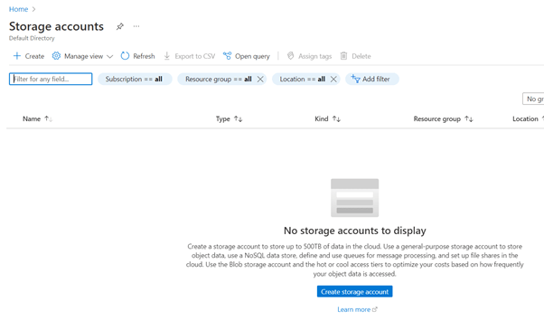 

**_Step 2:_** In the networking part select ‘Disable public access and use private access’ , and click on ‘Add private endpoint’ 
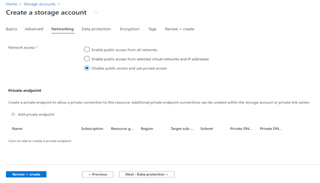 

**_Step 3:_** Enter the details of the required private endpoints, select sub-resource as ‘blob’ and click on ‘OK’. 
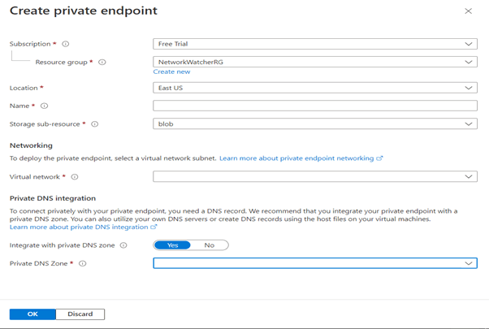 

**_Step 4:_** Click on ‘Review + create’   to review the details and click on ‘Create’. 
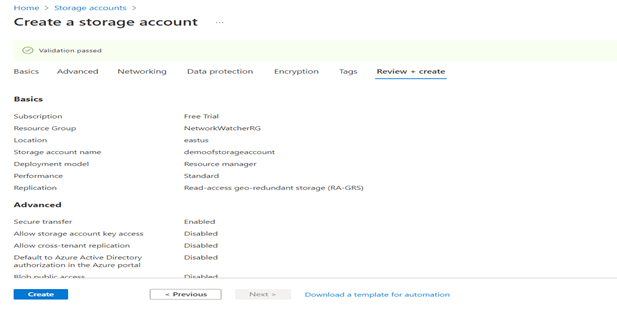

   

### 2. Ensure Azure Data lake storage implement Role Based Access Control ###

**Security Control Mapping :**  
| Control Number | Control Statement | Security Domain | Default | Associated Runbook | CVSS Severity  |
| -------------- | ----------------- | --------------- | ------- | ------------------ | -------------- |
|  [CS0012298](place holder) 	 | Access to change cloud identity access and service control policies is restricted to authorized cloud administrative personnel |  Identity & Access Management | Not enabled | Azure AD Runbook  | [Medium (5.1)](https://www.first.org/cvss/calculator/3.1#CVSS:3.1/AV:A/AC:H/PR:H/UI:N/S:C/C:L/I:L/A:L) |

[Place Holder ]
        
**Following are the suggested RBAC roles for Azure Data lake storage**  
| Function | Description | Role | 
| -------------- | ----------------- | --------------- | 
|  Network admin | Lets you manage networks, but not access to them | [Network Contributor](https://github.com/MicrosoftDocs/azure-docs/blob/main/articles/role-based-access-control/built-in-roles.md#network-contributor) |
|  Analytics Developer |Lets you submit, monitor, and manage your own jobs but not create or delete Data Lake Analytics accounts |[Data Lake Analytics Developer](https://github.com/MicrosoftDocs/azure-docs/blob/main/articles/role-based-access-control/built-in-roles.md#data-lake-analytics-developer)|
|  Analytics Reader | View and search all monitoring data as well as and view monitoring settings, including viewing the configuration of Azure diagnostics on all Azure resources. |  [Log Analytics Reader](https://github.com/MicrosoftDocs/azure-docs/blob/main/articles/role-based-access-control/built-in-roles.md#log-analytics-reader) |

   

### 3. Ensure application access to Azure Data lake storage from other azure services is granted using Managed Identities ###

**Security Control Mapping :** 

| Control Number | Control Statement | Security Domain | Default | Associated Runbook | CVSS Severity  |
| -------------- | ----------------- | --------------- | ------- | ------------------ | -------------- |
|  [CS0012298](place holder)       | Access to change cloud identity access and service control policies is restricted to authorized cloud administrative personnel |Identity & Access Management | Not enabled | None | [Medium (5.1)](https://www.first.org/cvss/calculator/3.1#CVSS:3.1/AV:A/AC:H/PR:H/UI:N/S:C/C:L/I:L/A:L) |

**Why?**  

Managed identity enables Azure resources to authenticate to cloud services (e.g. Azure Key Vault) without storing credentials in code. Once enabled, all necessary permissions can be granted via Azure role-based-access-control. 
In system assigned managed identity, the lifecycle of this type of managed identity is tied to the lifecycle of this resource. Additionally, each resource (e.g. Virtual Machine) can only have one system assigned managed identity. 
In User assigned managed identity, managed identities are created as standalone Azure resources, and have their own lifecycle. A single resource (e.g. Virtual Machine) can utilize multiple user assigned managed identities. A single user assigned managed identity can be shared across multiple resources.
A system-assigned managed identity can be assigned to a Windows virtual machine (VM) to access an Azure Data Lake Store by granting VM the access to Azure Data Lake Store and getting an access token using the VM identity and using it to access an Azure Data Lake Store. Managed identities are automatically managed by Azure to enable the application to authenticate to services that support Azure AD authentication, without needing to insert credentials into the code.

**How?**  

**_Step 1:_** To create a managed identity, search ‘managed identity’ in search box and select It to open. 
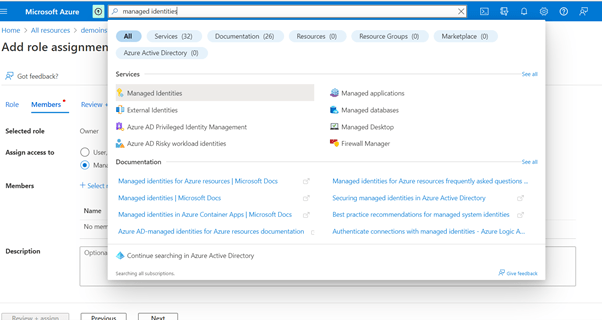 
 
**_Step 2:_** In the managed identity page click on create button and enter the required details and click on ‘Review + create’ to create a managed identity  
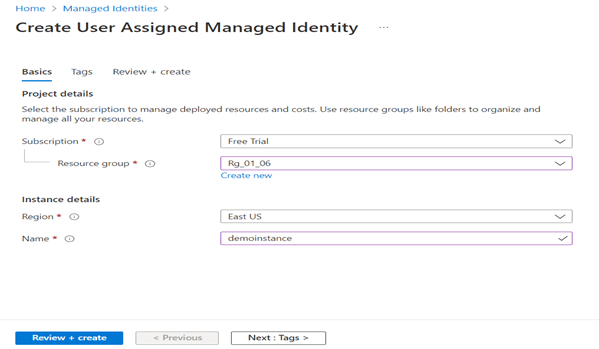  

**_Step 3:_** Navigate to the Data lake storage account and click on ‘Add role assignment’ under IAM tab to grant access only to managed identity.  
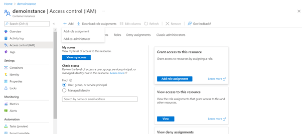  

**_Step 4:_** In the Add role assignment tab select ‘managed identity’ and the click on ‘add member’ which pops up a new window where configure the required settings.And finally select it and click on ‘review+ assign’ .  
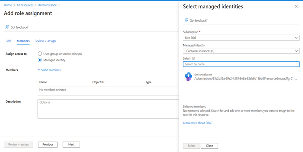 

  

### 4. Ensure that Access control list is used to fine grain the user access permission on the data lake storage ###

**Security Control Mapping :**  
| Control Number | Control Statement | Security Domain | Default | Associated Runbook | CVSS Severity  |
| -------------- | ----------------- | --------------- | ------- | ------------------ | -------------- |
|  [CS0012298](place holder)	    | Access to change cloud identity access and service control policies is restricted to authorized cloud administrative personnel |  Identity & Access Management | Not enabled | None | [Medium (5.1)](https://www.first.org/cvss/calculator/3.1#CVSS:3.1/AV:A/AC:H/PR:H/UI:N/S:C/C:L/I:L/A:L)  |

**Why?**  

  A security principal must be associated with an access level for files and directories which is captured as an entry in an access control list (ACL). Manage Identity can be used to provide access to all files and directories but ACL can be used to limit access to each file and directory in the storage account. When a security principal attempts an operation on a file or directory, An ACL check determines whether that security principal (user, group, service principal, or managed identity) has the correct permission level to perform the operation.
  There are two kinds of access control lists (ACLs), Access ACLs and Default ACLs.
    Access ACLs: These control access to an object. Files and folders both have Access ACLs.
    Default ACLs: A "template" of ACLs associated with a folder that determine the Access ACLs for any child items that are created under that folder. Files do not have Default ACLs.

**How?**  
>Note 
>Access control via [ACLs is enabled for a storage account](https://docs.microsoft.com/en-us/azure/storage/blobs/data-lake-storage-access-control) as long as the Hierarchical Namespace (HNS) feature is turned ON 

**_Step 1:_** Go to Azure portal and search for “storage account”. select “create”. 

**_Step 2:_** Enter all information in basics tab, give storage account name and region.  
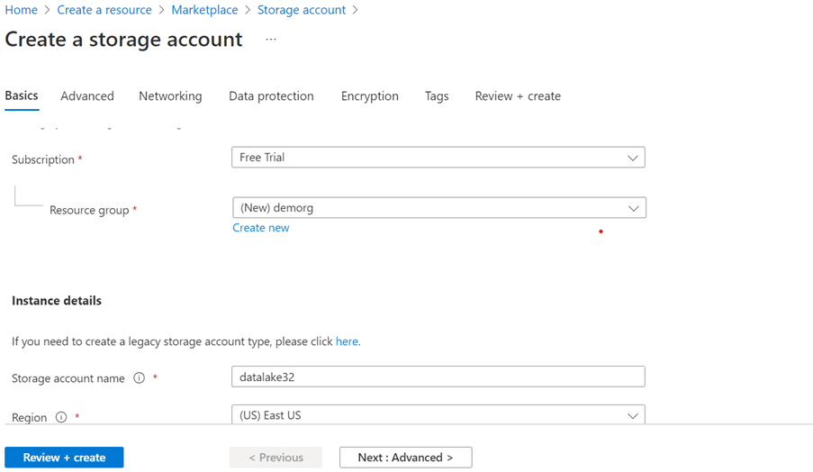 

**_Step 3:_** Navigate to “Advanced” page,” enable hierarchical namespace” under Data Lake Storage Gen2. 
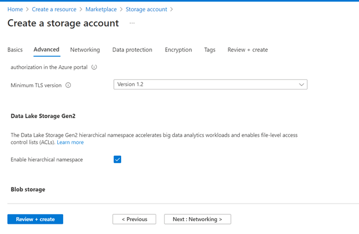 

   

### 5. Ensure that data mask is added to restrict sensitive data access to only privileged users ###

**Security Control Mapping :**  
| Control Number | Control Statement | Security Domain | Default | Associated Runbook | CVSS Severity  |
| -------------- | ----------------- | --------------- | ------- | ------------------ | -------------- |
| [CS0012261](place holder) | Cloud based data in transit must be encrypted with enterprise approved algorithm | Data Protection | Not Enabled | None | [Medium (5.3)](https://www.first.org/cvss/calculator/3.1#CVSS:3.1/AV:A/AC:H/PR:H/UI:N/S:U/C:H/I:L/A:L) |

**Why?**  

  Allowing sensitive data to be accessed by non privileged users increases the potential for theft, loss or exposure — thus increasing the organization’s risk. Data masking must be enabled in the access control list to obfuscate real data by showing default masked values(like xxxx, abcd ) to the reader roles and allowing only the privileged or admin user to view the actual sensitive data.

**How?**  

**_Step 1:_** Go to Azure portal and click on the cloud shell icon 
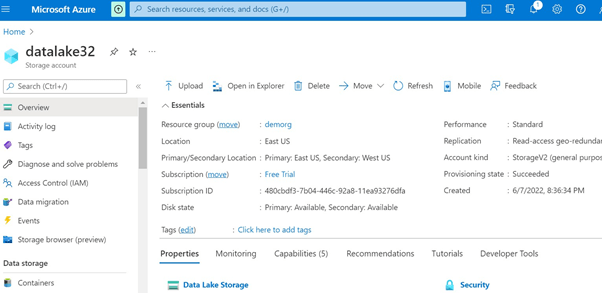  

**_Step 2:_** Access checked algorithm available for storage accounts. Algorithm having order of identities. 

Note: The mask for the access ACL of the root directory ("/") defaults to 750 for directories and 640 for files.
Identities are evaluated in the following order:
1.	Superuser
2.	Owning user
3.	Named user, service principal or managed identity
4.	Owning group or named group
5.	All other users

**_Step 3:_** The owning user having the permission to change permission of file. For named user, masking done by using condition based on access control list.  
Refer the following link for Access control lists in Azure Data Lake Storage Gen2 :
https://docs.microsoft.com/en-us/azure/storage/blobs/data-lake-storage-access-control#how-permissions-are-evaluated

   

### 6. Ensure that containers do not have anonymous read access ###

**Security Control Mapping :**  
| Control Number | Control Statement | Security Domain | Default | Associated Runbook | CVSS Severity  |
| -------------- | ----------------- | --------------- | ------- | ------------------ | -------------- |
| [CS0012300](place holder) | Cloud products and services must be deployed on private subnets and public access must be disabled for these services | Network and communication Security | Not Enabled | None | [Medium (5.3)](https://www.first.org/cvss/calculator/3.1#CVSS:3.1/AV:A/AC:H/PR:H/UI:N/S:U/C:H/I:L/A:L) |

**Why?**  

Azure Storage supports optional anonymous public read access for containers and blobs. When a container's public access level setting is configured to permit anonymous access, clients can read data in that container without authorizing the request. But anonymous access to the data is never permitted by default and all requests to a container and its blobs must be authorized till the anonymous access is explicitly allowed,. 

**How?**  

**_Step 1:_** Go to Azure portal and select already created Data lake storage account. 

**_Step 2:_** Select “Containers” on the left side pane. 
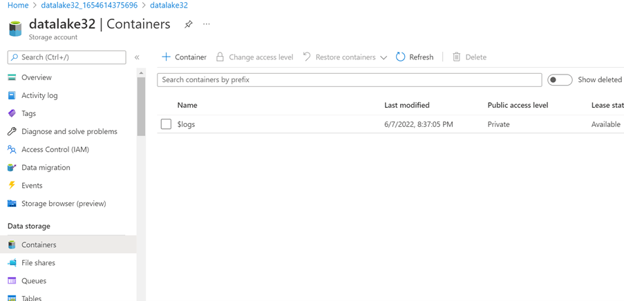 

**_Step 3:_** Click on “Container” option and give name for the container. 

**_Step 4:_** select “private (no anonymous access)”option in public level access field. click “create”. 
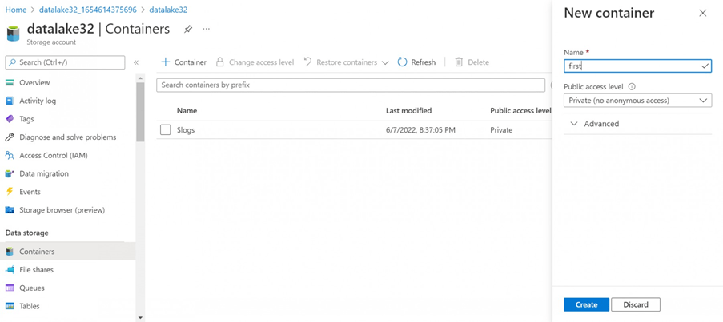 

   

### 7. Ensure that stored access policy is used to provide time-bound access to users ###

**Security Control Mapping :**  
| Control Number | Control Statement | Security Domain | Default | Associated Runbook | CVSS Severity  |
| -------------- | ----------------- | --------------- | ------- | ------------------ | -------------- |
|  [CS0012298](place holder)	    | Access to change cloud identity access and service control policies is restricted to authorized cloud administrative personnel |  Identity & Access Management | Not enabled | None | [Medium (5.1)](https://www.first.org/cvss/calculator/3.1#CVSS:3.1/AV:A/AC:H/PR:H/UI:N/S:C/C:L/I:L/A:L)  |

**Why?**  

A stored access policy must be used to provide an additional level of control over service-level shared access signatures (SAS) on the server side.A stored access policy must be established to serve to group shared access signatures and to provide additional restrictions for signatures that are bound by the policy. A stored access policy can be used to change the start time, expiry time, or permissions for a signature, or to revoke it after it has been issued.

**How?**  

**_Step 1:_** Go to Azure portal and select already created data lake storage account. 

**_Step 2:_** select “Shared access signature” on the left side pane. 

**_Step 3:_** Set start date and expiry date, time under “start and expiry date/time” field to provide time-bound access to users. 
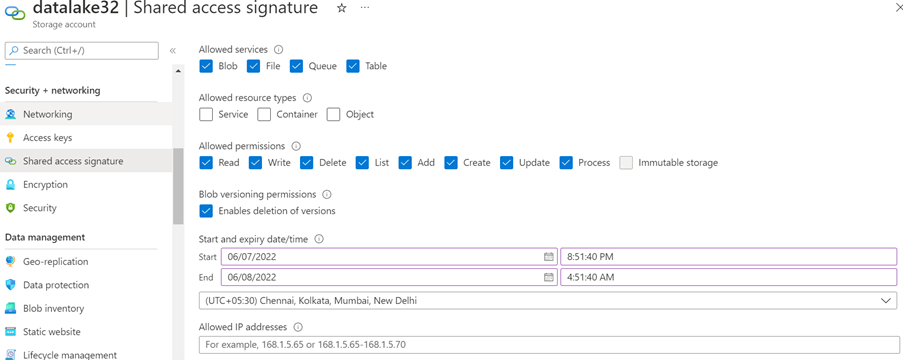

   

### 8. Ensure Diagnostic log for 'Transactions' is enabled and are forwarded to Splunk ###

**Security Control Mapping :**  
| Control Number | Control Statement | Security Domain | Default | Associated Runbook | CVSS Severity  |
| -------------- | ----------------- | --------------- | ------- | ------------------ | -------------- |
| [CS0012233](place holder) | Information System must create a log and record activities occurring on or originating from the information system. Logs must be made accessible to the enterprise SIEM solution  | Security Information and event management  | Not Enabled | Network Watcher Runbook | [Low (2.7)](https://www.first.org/cvss/calculator/3.1#CVSS:3.1/AV:P/AC:H/PR:H/UI:N/S:U/C:L/I:N/A:L) |

**Why?**  
  
The event log contains information about the api objects which include StorageRead,StorageWrite,StorageDelete
and Transaction. These logs when forwarded to Splunk provide necessary information to create notable alerts for any rule created to allow connection from internet

**How?**  

>Note: As We are recommending using Private Endpoint, NSG is not supported in Private Endpoint. Hence, NSG flow log capture requirement is removed  

**_Step 1:_** Login to Azure portal, select the created Data-lake storage account.  

**_Step 2:_** Navigate to ‘Activity log’ and click ‘Diagnostic Settings’ under 'Monitoring' 
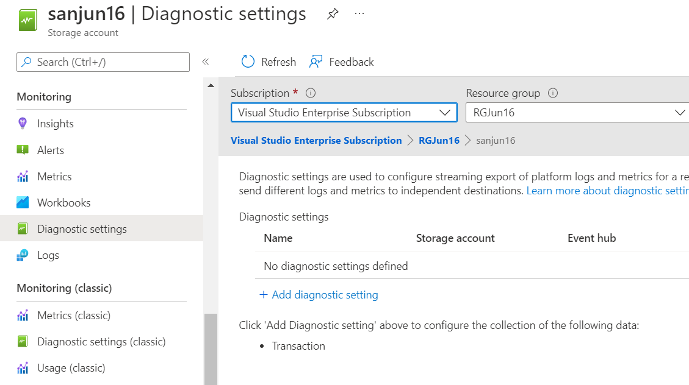 

**_Step 3:_**  Select the 'transaction' under the metrics and  select “Stream to Event Hub”. Choose the Eventhub namespace and Click on save button.  
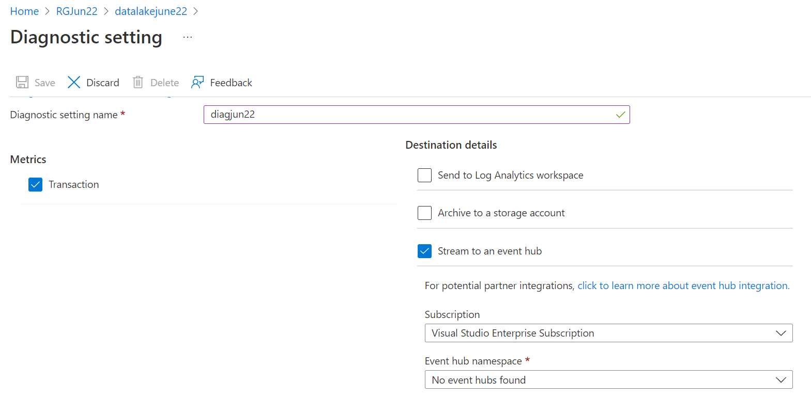 

**_Step 4:_** Connect Splunk app for Microsoft services to the Logs storage account and configure the inputs to extract the logs from Azure storage to Splunk

  

### 9. Ensure Azure Data Lake storage use standard organizational Resource tagging method ###

**Security Control Mapping :**  

| Control Number | Control Statement | Security Domain | Default | Associated Runbook | CVSS Severity  |
| -------------- | ----------------- | --------------- | ------- | ------------------ | -------------- |
| [CS0012261](place holder)  | Technology hardware and software must be registered and accurately recorded within the enterprise technology repository and/or asset management systems | Asset Management  | Not enabled | organizational Runbook | [Low (1.6)](https://www.first.org/cvss/calculator/3.1#CVSS:3.1/AV:P/AC:H/PR:H/UI:N/S:U/C:N/I:N/A:L) |

**Why, What and How ?** 
  
Client rationale and Justification
[Placeholder link]

### 10. Ensure organizational Anti-malware and vulnerability tools are enabled for Data lake storage ###

**Security Control Mapping :** 

| Control Number | Control Statement | Security Domain | Default | Associated Runbook | CVSS Severity  |
| -------------- | ----------------- | --------------- | ------- | ------------------ | -------------- |
|  [CS0012268](place holder)     | Vulnerability Assessments must be performed based on risk and findings must be addressed in accordance with Enterprise SLA's | Vulnerability Management | Not enabled | None | [Medium (5.0)](https://www.first.org/cvss/calculator/3.1#CVSS:3.1/AV:L/AC:H/PR:H/UI:N/S:C/C:L/I:L/A:L) |

**Why?** 

Microsoft Defender for Storage is an Azure-native layer of security intelligence that detects unusual and potentially harmful attempts to access or exploit your storage accounts. It uses advanced threat detection capabilities and Microsoft Threat Intelligence data to provide contextual security alerts. Those alerts also include steps to mitigate the detected threats and prevent future attacks. Microsoft Defender for Storage must be enabled at either the subscription level (recommended) or the resource level to analyze ,detect and remediate the threats

**How?**  

**_Step 1:_** Navigate to respective Azure service and select ‘Extensions + Applications’ 
 

**_Step 2:_** Choose Antimalware in the Extensions and add. 
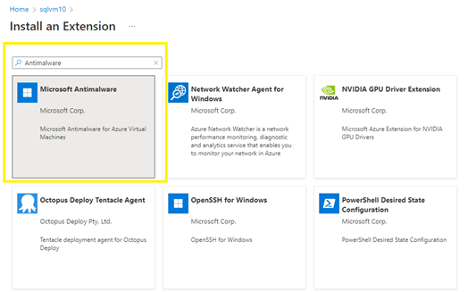 
Note: Microsoft anti-malware is enabled on the underlying host that supports Azure services, however it does not run-on customer content.

   

### 11. Ensure Service tags are enabled for the Azure Data Lake storage ###

**Security Control Mapping :**  
| Control Number | Control Statement | Security Domain | Default | Associated Runbook | CVSS Severity  |
| -------------- | ----------------- | --------------- | ------- | ------------------ | -------------- |
| [CS0012261](place holder)  | Technology hardware and software must be registered and accurately recorded within the enterprise technology repository and/or asset management systems | Asset Management  | Not enabled | organizational Runbook | [Low (1.6)](https://www.first.org/cvss/calculator/3.1#CVSS:3.1/AV:P/AC:H/PR:H/UI:N/S:U/C:N/I:N/A:L) |

**Why?** 
  
A service tag represents a group of IP address prefixes from a given Azure service. Azure Virtual Network service tags must be used to define network access controls for Key Vault resources in NSGs or Azure Firewall. Service tags can be used in place of specific IP addresses when creating security rules. Service tag name like "AzureDataLake" must be used in the appropriate rule source or destination field to allow or deny traffic for the service. Microsoft manages the address prefixes the service tag encompasses, and automatically updates the service tag as addresses change.

**How?**  

**_Step 1:_** Login to Azure portal, select ‘Storage Account’ from the resources and create. 
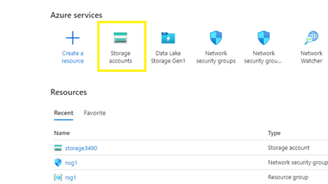 

**_Step 2:_** Navigate to NSG group and click ‘Outbound security rules’ under settings from left side panel. 

**_Step 3:_** Select add and Select source as ‘Service Tag’ and ‘Azure Data lake’ as Source service tag. 
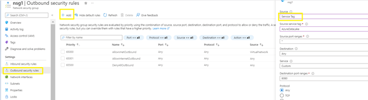 

**_Step 4:_** Validate  the create service tag in the outbound rules section. 
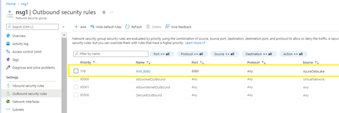 

   

### 12. Ensure Container images in registry are Encrypted with Customer Managed Keys ###

**Security Control Mapping :**  

| Control Number | Control Statement | Security Domain | Default | Associated Runbook | CVSS Severity  |
| -------------- | ----------------- | --------------- | ------- | ------------------ | -------------- |
|  [CS0012168](place holder)       |Strong encryption key management controls are in place for cloud provider services to protect data at rest | Data Protection  | Not enabled | None | [Medium (5.3)](https://www.first.org/cvss/calculator/3.1#CVSS:3.1/AV:A/AC:H/PR:H/UI:N/S:U/C:H/I:L/A:L)  |

**Why?**  

By default, data is encrypted with Microsoft-managed keys. For additional control over encryption keys, customer-managed keys can supply to use for encryption of blob and file data. Customer-managed keys must be stored in an Azure Key Vault. The storage account and the key vault must be in the same region, but they can be in different subscriptions.

**How?**  

**_Step 1:_** Search for ‘Container Registries’ in the search box and navigate to the Container Registries page. Click on ‘create’.  
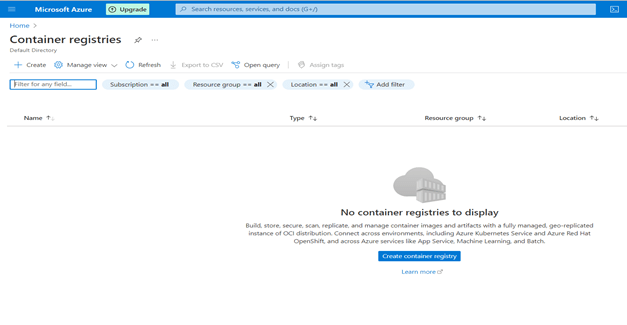 

**_Step 2:_** In the Encryption part select  Customer managed keys as ‘enabled’, and select respective key vault.  
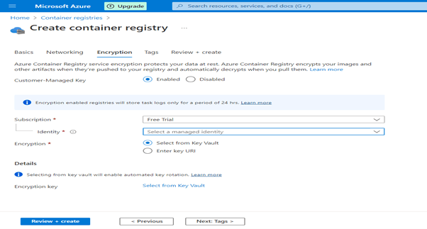 

**_Step 3:_** Click on ‘Review + create’.

   

### 13. Ensure that minimum TLS version needed by applications using storage account's data is version 1.2 or more ###

**Security Control Mapping :**   
| Control Number | Control Statement | Security Domain | Default | Associated Runbook | CVSS Severity  |
| -------------- | ----------------- | --------------- | ------- | ------------------ | -------------- |
| [CS0012261](place holder) | Cloud based data in transit must be encrypted with enterprise approved algorithm | Data Protection | Enabled but not TLS 1.2 | None | [Medium (5.3)](https://www.first.org/cvss/calculator/3.1#CVSS:3.1/AV:A/AC:H/PR:H/UI:N/S:U/C:H/I:L/A:L) |

**Why?**  

Encryption use cases of data in transit are authentication of credentials against the Azure Active directory or communication between database and other applications. TLS 1.2 must be used as the secure encryption in transit for all the Azure Datalake connections to improve the security posture of the environment and also to remain in compliance with industry standards or organization requirements.

**How?**  

**_Step 1:_** Search for storage account in the search box and navigate to the storage account page. Click om ‘create’ to start creating a storage account.  
 

**_Step 2:_** In the ‘Advanced’ part select the ‘Minimum TLS version’ as ‘Version 1.2’ .  
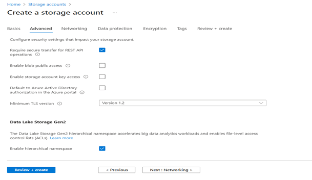 

**_Step 3:_** Click on ‘Review + create’. 

  

### 14. Ensure Activity logging is enabled for Azure Container Instance ###

**Security Control Mapping :**  
| Control Number | Control Statement | Security Domain | Default | Associated Runbook | CVSS Severity  |
| -------------- | ----------------- | --------------- | ------- | ------------------ | -------------- |
| CS0012233 | Information System must create a log and record activities occurring on or originating from the information system. Logs must be made accessible to the enterprise SIEM solution  | Security Information and event management   | Enabled but not forwarded to Splunk | None | [Low (2.7)](https://www.first.org/cvss/calculator/3.1#CVSS:3.1/AV:P/AC:H/PR:H/UI:N/S:U/C:L/I:N/A:L) |

**Why, What and How ?** 
  
Client rationale and Justification
[Placeholder link]

   
