# Azure Disk Storage - Security baseline requirement <!-- omit in toc -->
## Baseline security configuration requirement for Azure services ## <!-- omit in toc -->
---

**Generated By: EY Security Team**  
**Service Type: Storage**  
**Deployment Phase:**  
**Last updated: 04/19/2022** 

## Table of Contents <!-- omit in toc -->

- [Overview](#overview)
  - [Use Case Examples:](#use-case-examples)
- [Cloud Security Requirements](#cloud-security-requirements)
  - [1. Ensure that Managed disks can be accessed only through Private link for disk export](#1-ensure-that-managed-disks-can-be-accessed-only-through-private-link-for-disk-export)
  - [2. Ensure activity logs are enabled for managed disk](#2-ensure-activity-logs-are-enabled-for-managed-disk)
  - [3. Ensure that least privilege access method is implemented using Role-based access control (RBAC)](#3-ensure-that-least-privilege-access-method-is-implemented-using-role-based-access-control-rbac)
  - [4. Ensure managed disk is Encrypted with Customer Managed Keys](#4-ensure-managed-disk-is-encrypted-with-customer-managed-keys)
  - [5. Ensure That managed disk snapshots are Created prior to Encryption and snapshots are Encrypted with Customer Managed Keys](#5-ensure-that-managed-disk-snapshots-are-created-prior-to-encryption-and-snapshots-are-encrypted-with-customer-managed-keys)
  - [6. Ensure that Managed disk uses standard organizational Resource tagging method](#6-ensure-that-managed-disk-uses-standard-organizational-resource-tagging-method)

##  Overview

Azure managed disks are block-level storage volumes that are managed by Azure and used with Azure Virtual Machines. Managed disks are virtualized instance of a physical disk in an on-premises server. The available types of disks are ultra disks, premium solid-state drives (SSD), standard SSDs, and standard hard disk drives (HDD).

| Control Number | Cloud Baseline Security Requirements                                                                                      |
| -------------- | ------------------------------------------------------------------------------------------------------------------------- |
| 1              | Ensure that Managed disks can be accessed only through Private link for disk export                                       |
| 2              | Ensure activity logs are enabled for managed disk                                                                         |
| 3              | Ensure that least privilege access method is implemented using Role-based access control (RBAC)                           |
| 4              | Ensure managed disk is Encrypted with Customer Managed Keys                                                               |
| 5              | Ensure That managed disk snapshots are Created prior to Encryption and snapshots are Encrypted with Customer Managed Keys |
| 6              | Ensure that Managed disk uses standard organizational Resource tagging method                                             |

### Use Case Examples:
- Run Computational Fluid dynamics simulations
- High volume batch transaction processing
- SAP deployment on Azure using an Oracle database

## Cloud Security Requirements ##

### 1. Ensure that Managed disks can be accessed only through Private link for disk export ###

**Security Control Mapping :** 

| Control Number | Control Statement| Security Domain | Default | Associated Runbook |
| ----------------- | --------------- |----------- |----------|-----------|
|  CS0012300 | Cloud products and services must be deployed on private subnets and public access must be disabled for these services | Network Security |Not enabled | None |

**Why?**
    Private Links must be used to restrict the export and import of managed disks so that it can only occur within the internal virtual network of the organization. Private Links must allow only the data that travels within the secure Microsoft backbone network.
    

**How?** 

Step 1: Login to Azure portal and select ‘Disks’ from the services.  
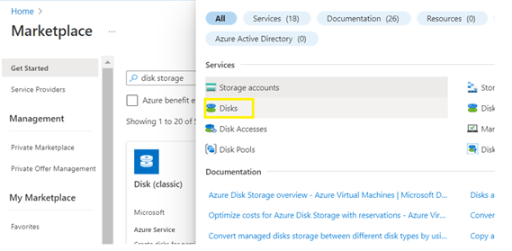 

Step 2: Create a new disk by providing the required information. 
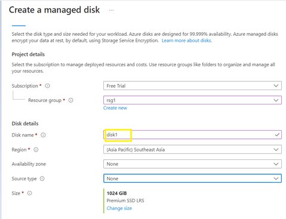 

Step 3: In the ‘Networking’ tab, select enable private access and proceed for ‘Disk Access’ creation. 
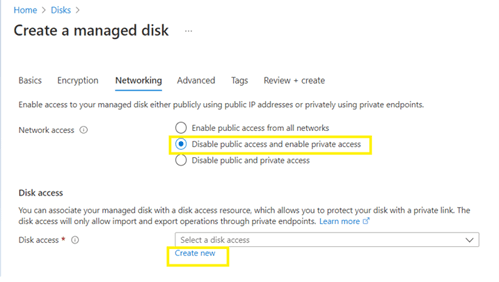 

Step 4: Create a ‘Disk Access’ and ‘Private Endpoint’ to associate the Manged disk. 
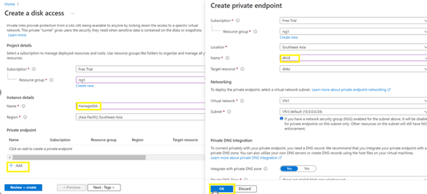 

Step 5: Select the appropriate virtual network and subnet while creating the private network. 
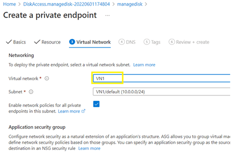 

Step 6:  Navigate to the created disk and go to Settings, choose ‘Networking’.
Select Private endpoint (through disk access) and select the created disk access. 
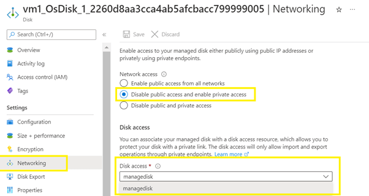 

Step 7: Create private link that can be used to import and export managed disk 
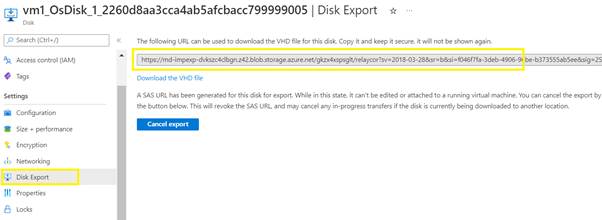 

### 2. Ensure activity logs are enabled for managed disk ###

**Security Control Mapping :** 

| Control Number | Control Statement | Security Domain | Default | Associated Runbook |
| ----------------- | ---------------|----------- |----------|-----------|
|  	      |  | Security Logging  |Not enabled | None |

**Why?**

    Activity logs provides control plane level visibility into blobs, queues, and tables. Enabling security related logs will allow Security operation's to create high fidelity security alert on anomalous changes to managed disk configurations by admin accounts. 

**How?** 

Step 1: In the side menu bar of the created disks , Navigate to activity log and click on 'Export Activity Logs'. 
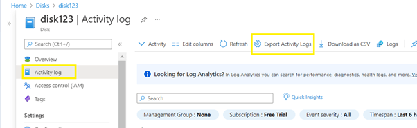 

Step 2: on Diagnostic Settings page click on 'Add diagnostic setting' and select Administrative, Security, Alert, policy, recommendation log type and Select Destination details to be 'Archive to a storage account'  
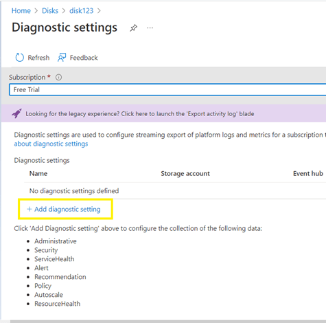 

Step 3: Connect splunk app for Microsoft services to the Logs storage account and configure the inputs to extract the logs from Azure storage to Splunk  
[Place holder for link]

### 3. Ensure that least privilege access method is implemented using Role-based access control (RBAC) ###

**Security Control Mapping :**

| Control Number | Control Statement | Security Domain | Default | Associated Runbook |
| ----------------- | --------------- |----------- |----------|-----------|
|  CS0012298	    | Access to change cloud identity access and service control policies is restricted to authorized cloud administrative personnel |  IAM | Not enabled | None |

**Why?**

Role-based access control (RBAC) is method of implementing least privilege access by providing access user and service principle based on job function. Azure has several service specific roles the provides granular access. Using Azure entitlements and the usage pattern custom roles can be developed to implement the granular access to individual user and service principal 

**Following are the suggested RBAC roles for Azure Disk Storage**  
| Function | Description | Role | 
| -------------- | ----------------- | --------------- | 
|  Network admin | Responsible for access to and from applications to Disk Storage | Networkadmin |
|  Monitoring admin | Responsible for monitoring and auditing the images in Disk Storage | MonitoringPlatformadmin |
|  Disk Snapshot Contributor |  Responsible to provide permission to manage disk snapshots |  IAM admin team |
|  Disk Storage admin |  Responsible for reading, taking snapshots, automated backups and restore  of disk storage data| Custom application role developed by IAM admin team |

**How?** 
Step 1: Navigate to ‘Access Control(IAM)’ in the side menu bar of the created disk and click ‘Add role assignment’. 
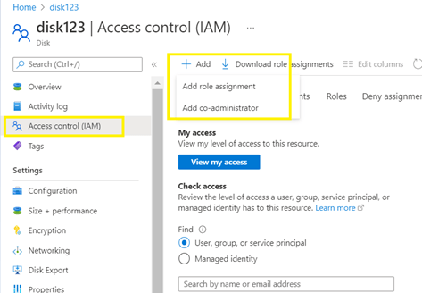 

Step 2:  Add the required role from the role assignment  
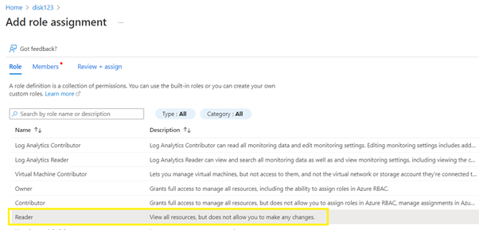 

Step 3:  Add the users/group under the ‘members’ tab in the role assignment. 
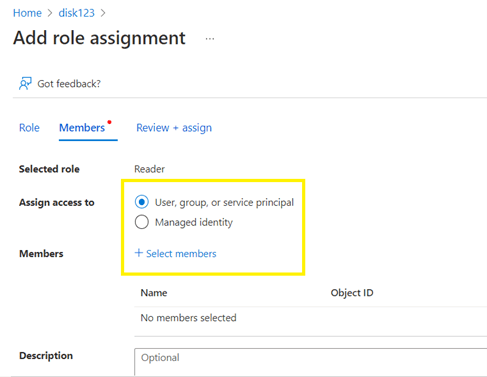 

Step 4: Validate the users and Access in the Role Assignment tab of the managed disk. 
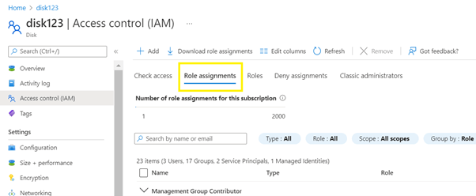 

### 4. Ensure managed disk is Encrypted with Customer Managed Keys ###

**Security Control Mapping :** 

| Control Number | Control Statement | Security Domain | Default | Associated Runbook |
| ----------------- | --------------- |----------- |----------|-----------|
|  CS0012168       |Strong encryption key management controls are in place for cloud provider services to protect data at rest | Data Protection  | Not enabled | None |

**Why?**

By default, data in the Managed disk is encrypted using Microsoft Managed Keys at rest. All Azure Storage resources are encrypted, including blobs, disks, files, queues, and tables. 
All object metadata is also encrypted. However, if you want to control and manage this encryption key yourself, you can specify a customer-managed key, 
that key is used to protect and control access to the key that encrypts your data. 

**How?** 
Step 1: Log in to the Azure portal. Select All Services → Disk Encryption Set and ‘Create’. 
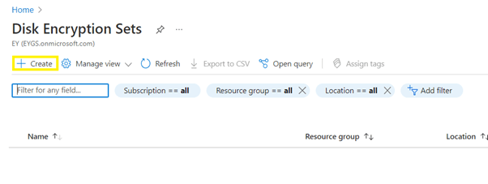 

Step 2: Create a disk encryption set by selecting the type as ‘Customer managed key’ 
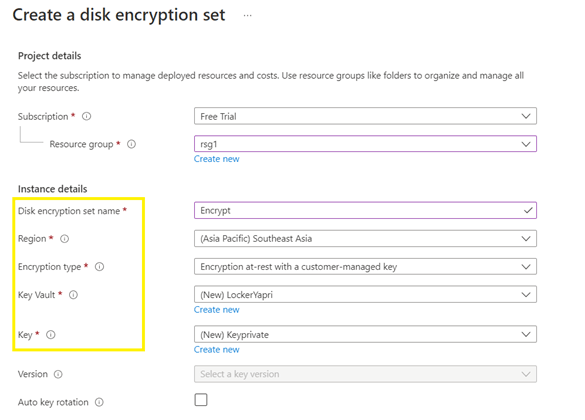 

Step 3: Create a new ‘Key vault’ under the disk encryption. 
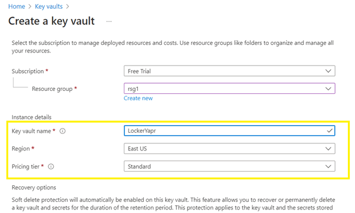 

Step 4: Create a new ‘Key’ under the disk encryption by providing the Key type and size. 
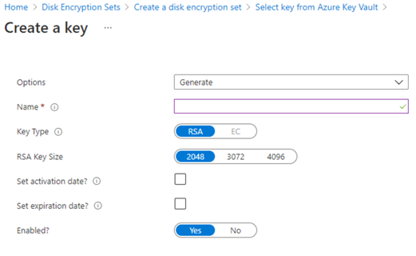 

Step 5: Navigate to managed disk and select the ‘Encryption’ option and provide Type as ‘Customer managed key’ and retrieve the created ‘Disk Encryption set’ 
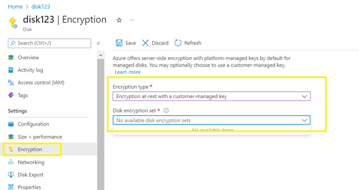 

### 5. Ensure That managed disk snapshots are Created prior to Encryption and snapshots are Encrypted with Customer Managed Keys ###

**Security Control Mapping :** 

| Control Number | Control Statement | Security Domain | Default | Associated Runbook |
| ----------------- | --------------- |----------- |----------|-----------|
|  CS0012168       |Strong encryption key management controls are in place for cloud provider services to protect data at rest | Data Protection  | Not enabled | None |

**Why?**

Organization must take snapshots and/or backups of managed disks before they are encrypted, as Disk encryption key life cycle will be different then the backup key life cycle. Once the snapshot of the disk is taken, the snapshot should be encrypted using customer managed key.

**How?** 
Step 1: Log in to the Azure portal. Select All Services → Snapshot and ‘Create’.  Provide the respective information to complete the creation of snapshot. 
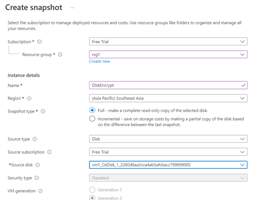 

Step 2: Create a Disk encryption set by selecting the type as ‘Customer managed key’ and add ‘Key-vault’ and ‘key’br>
 

Step 3:  Navigate to created Snapshot and choose the  ‘Encryption’ option in the left side panel.br>
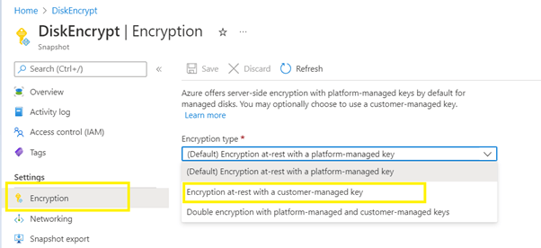 

Step 4:  Select the Encryption type as ‘Customer managed key’ and provide the created ‘Disk encryption set’.br>
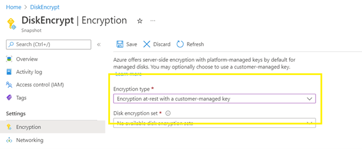 

### 6. Ensure that Managed disk uses standard organizational Resource tagging method ###

**Security Control Mapping :** 

| Control Number | Control Statement | Security Domain | Default | Associated Runbook |
| ----------------- | --------------- |----------- |----------|-----------|
|        | | Data Protection  | Not enabled | None |

**Why?**

Tagging managed disks will help to identify the logical way to own the resource and group them and also helping to assess their security posture and take action on potential areas of weakness.

**How?**

 Tagging can be achieved while creating the storage account and after the storage

**Tagging for existing disk**
Step 1: Go to created Disk and select Tags from left side panel. 
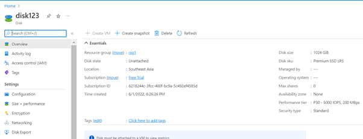 

Step 2: Provide ‘Name’ and ‘Value’ in the Tags for the created Disk. 
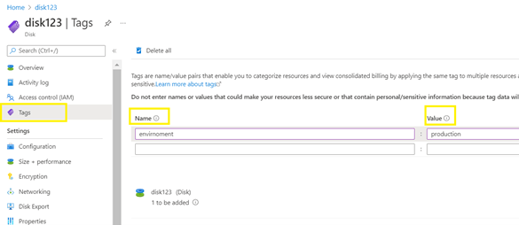 

Step 3: Validate the Tag value once it is created. 
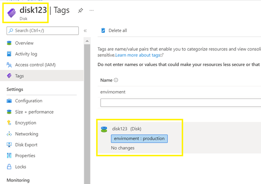 

**Tagging when creating a disk**
Step 4: Tags can be added, while creating the resource itself. 
 

