# Azure Event Hubs - Security baseline requirement <!-- omit in toc -->

## Baseline security configuration requirement for Azure services  <!-- omit in toc -->

**Generated By: EY Security Team**  
**Service Type: Analytics**  
**Deployment Phase: Service Discovery**  
**Last updated: 06/21/2022** 

## Table of Contents <!-- omit in toc -->

- [Overview](#overview)
  - [Use Case Examples:](#use-case-examples)
- [Cloud Security Requirements](#cloud-security-requirements)
  - [1. Ensure that public access is disabled by implementing Private endpoints](#1-ensure-that-public-access-is-disabled-by-implementing-private-endpoints)
  - [2. Ensure the minimum minimum required TLS version for a namespace is TLS 1.2](#2-ensure-the-minimum-minimum-required-tls-version-for-a-namespace-is-tls-12)
  - [3. Ensure Service tags are enabled for the Azure Event hubs](#3-ensure-service-tags-are-enabled-for-the-azure-event-hubs)
  - [4. Ensure least privilege access is implemented in Event hub using Role Based Access control](#4-ensure-least-privilege-access-is-implemented-in-event-hub-using-role-based-access-control)
  - [5. Ensure administrative tasks are performed only in admin-e workstations](#5-ensure-administrative-tasks-are-performed-only-in-admin-e-workstations)
  - [6. Ensure access to namespace and Event hub is granted only using Managed Identities](#6-ensure-access-to-namespace-and-event-hub-is-granted-only-using-managed-identities)
  - [7. Ensure Diagnostic logging is enabled for Azure event hubs](#7-ensure-diagnostic-logging-is-enabled-for-azure-event-hubs)
  - [8. Ensure Azure event hubs uses standard organizational Resource tagging method](#8-ensure-azure-event-hubs-uses-standard-organizational-resource-tagging-method)
  - [9. Ensure Activity logging is enabled for Azure event hub](#9-ensure-activity-logging-is-enabled-for-azure-event-hub)
  - [10. Ensure data in Event Hubs name space is Encrypted with Organization Managed Keys](#10-ensure-data-in-event-hubs-name-space-is-encrypted-with-organization-managed-keys)

##  Overview 

Azure Event Hubs is a big data streaming platform and event ingestion service. It can receive and process millions of events per second. Data sent to an event hub can be transformed and stored by using any real-time analytics provider or batching/storage adapters.

| Control Number | Cloud Baseline Security Requirements                                                      |
| -------------- | ----------------------------------------------------------------------------------------- |
| 1              | Ensure that public access is disabled by implementing Private endpoints                   |
| 2              | Ensure the minimum minimum required TLS version for a namespace is TLS 1.2                |
| 3              | Ensure Service tags are enabled for the Azure Event hubs                                  |
| 4              | Ensure least privilege access is implemented in Event hub using Role Based Access control |
| 5              | Ensure administrative tasks are performed only in admin-e workstations                    |
| 6              | Ensure access to namespace and Event hub is granted only using Managed Identities         |
| 7              | Ensure Diagnostic logging is enabled for Azure event hubs                                 |
| 8              | Ensure Azure event hubs uses standard organizational Resource tagging method              |
| 9              | Ensure Activity logging is enabled for Azure event hub                                    |
| 10             | Ensure data in Event Hubs name space is Encrypted with Organization Managed Keys          |

### Use Case Examples:
- Real-time reporting
- Capture streaming data into files for further processing and analysis – e.g. capturing data from micro-service applications or a mobile app
- Make data available to stream-processing and analytics services – e.g. when scoring an AI algorithm
- Telemetry streaming & processing
- Application logging

## Cloud Security Requirements ##

### 1. Ensure that public access is disabled by implementing Private endpoints

**Security Control Mapping :**  

| Control Number | Control Statement | Security Domain | Default | Associated Runbook | CVSS Severity  |
| -------------- | ----------------- | --------------- | ------- | ------------------ | -------------- |
| CS0012300 | Cloud products and services must be deployed on private subnets and public access must be disabled for these services |Identity & Access Management | Not enabled | Private Endpoint Runbook | [High (7.2)](https://www.first.org/cvss/calculator/3.1#CVSS:3.1/AV:N/AC:H/PR:H/UI:N/S:C/C:H/I:L/A:L) |

**Why?**  

The access to Event hubs should be granted only to selected VNets with in Organization's Azure Tenant. 
Private endpoint will provide a endpoint with Private IP which can be associated with VNet with in tenant, other tenant or from On premise.  A FQDN record will be created in Azure DNS to enable other tenants VNets to be associated with Azure Key vault.  This ensures that all workload data is being accessed securely over Azure network backbone and Azure Event hubs are not exposed to internet. 

**Note:** Private endpoint should have private DNS and enterprise Firewall should be able to resolve this private DNS record.   
https://docs.microsoft.com/en-us/azure/private-link/private-endpoint-dns#on-premises-workloads-using-a-dns-forwarder

**How?**  

**_Step 1:_** When creating a new Event hub name space, navigate to the Networking tab, Select Private access as connectivity method and add private endpoint  

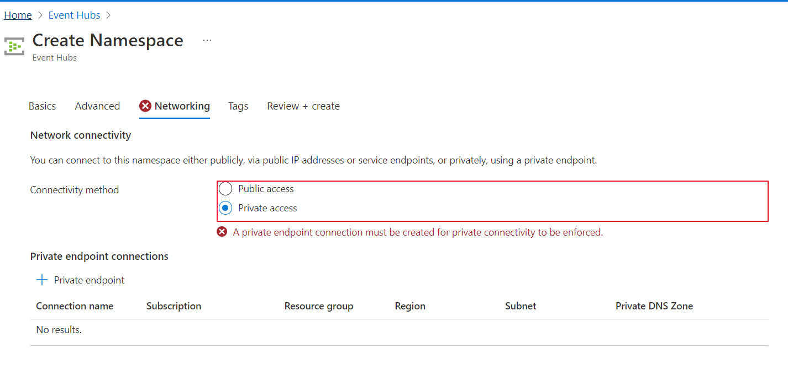

**_Step 2:_** To add a private endpoint in the existing Event hub name space, Select the Networking tab and select Disabled to deny any access to the public access 

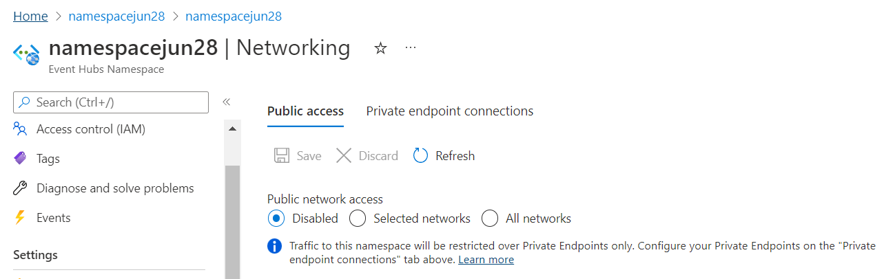

**_Step 3:_** Navigate to private endpoint connections and click add to the private endpoint. 
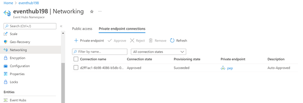

    

 **Note** 
 1. Private access is only available on Premium or Standard namespaces.
 2. Enabling private endpoints can prevent other Azure services from interacting with Event Hubs. Requests that are blocked include those from other Azure services, from the Azure portal, from logging and metrics services, and so on. As an exception, you can allow access to Event Hubs resources from certain trusted services even when private endpoints are enabled. For a list of trusted services, see Trusted services.
   
 Please refer Private Endpoint Runbook for step by tep instruction on how to create private Endpoint [place holder]

### 2. Ensure the minimum minimum required TLS version for a namespace is TLS 1.2 

**Security Control Mapping :**  
| Control Number | Control Statement | Security Domain | Default | Associated Runbook | CVSS Severity  |
| -------------- | ----------------- | --------------- | ------- | ------------------ | -------------- |
|  CS0012168       | Strong encryption key management controls are in place for cloud provider services to protect data at rest | Data Protection  | Enabled | None | [Medium (5.3)](https://www.first.org/cvss/calculator/3.1#CVSS:3.1/AV:A/AC:H/PR:H/UI:N/S:U/C:H/I:L/A:L) |

**Why?**  

Data in transit between Application and Azure Event hubs services can be encrypted based on the nature of the connection. Microsoft uses the Transport Layer Security (TLS) protocol to protect data when it's traveling between the Event hubs services and applications. TLS 1.2 must be used as the secure encryption in transit for all the Event hubs connections to improve the security posture of the environment and also to remain in compliance with industry standards or organization requirements

**How?**  

**_Step 1:_** When creating a new Event hub name space, navigate to the Advanced tab, Set minimum TLS version to 1.2   

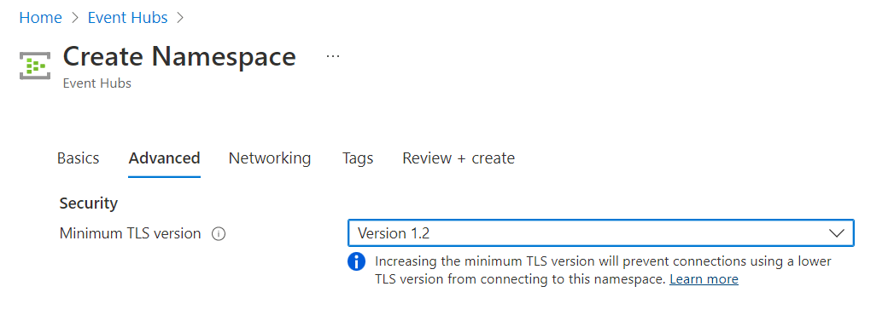

**_Step 2:_** To set a minimum TLS version to the existing Event hub name space, Select Configuration tab and select minimum TLS version.

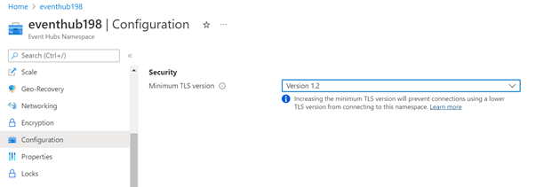  

### 3. Ensure Service tags are enabled for the Azure Event hubs

**Security Control Mapping :**  
| Control Number | Control Statement | Security Domain | Default | Associated Runbook | CVSS Severity  |
| -------------- | ----------------- | --------------- | ------- | ------------------ | -------------- |
| CS0012261  | Technology hardware and software must be registered and accurately recorded within the enterprise technology repository and/or asset management systems | Asset Management  | Not enabled | None | [Low (1.6)](https://www.first.org/cvss/calculator/3.1#CVSS:3.1/AV:P/AC:H/PR:H/UI:N/S:U/C:N/I:N/A:L) |

**Why?**
  
A service tag represents a group of IP address prefixes from a given Azure service. Azure Virtual Network service tags must be used to define network access controls for Event hub resources in NSGs or Azure Firewall. Service tags can be used in place of specific IP addresses when creating security rules. Service tag name like "Eventhubs" must be used in the appropriate rule source or destination field to allow or deny traffic for the service. Microsoft manages the address prefixes the service tag encompasses, and automatically updates the service tag as addresses change.

**How?**  

**_Step 1:_** Select NSG groups which we already created and click on the “outbound security rules” on the left side pane. 
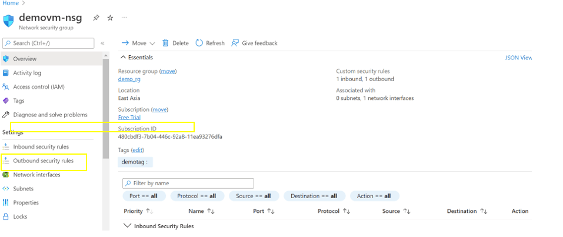 

**_Step  2:_** Click “Add” and give source as “service tag “ and source service tag is “Event Hubs” and click “Add”. 
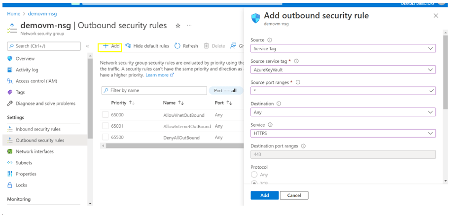 

**_Step 3:_** Click refresh and service tag created for Event hub. 
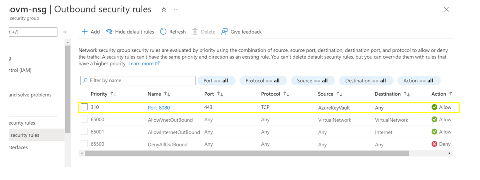  

### 4. Ensure least privilege access is implemented in Event hub using Role Based Access control 

[[Place Holder ]
        
**Following are the suggested RBAC roles for Azure Event Hubs**  
| Function | Description | Role | 
| -------------- | ----------------- | --------------- | 
|  Event Hub admin | Allows for full access to Azure Event Hubs resources. | [Azure Event Hubs Data Owner](https://github.com/MicrosoftDocs/azure-docs/blob/main/articles/role-based-access-control/built-in-roles.md#azure-event-hubs-data-owner) |
|  Event Hub Source admin | Allows receive access to Azure Event Hubs resources. | [Azure Event Hubs Data Sender](https://github.com/MicrosoftDocs/azure-docs/blob/main/articles/role-based-access-control/built-in-roles.md#azure-event-hubs-data-sender) |
|  Event Hub Target admin | 	Allows send access to Azure Event Hubs resources. | [Azure Event Hubs Data Receiver ](https://github.com/MicrosoftDocs/azure-docs/blob/main/articles/role-based-access-control/built-in-roles.md#azure-event-hubs-data-receiver) |

### 5. Ensure administrative tasks are performed only in admin-e workstations 

**Security Control Mapping :**  
| Control Number | Control Statement | Security Domain | Default | Associated Runbook | CVSS Severity  |
| -------------- | ----------------- | --------------- | ------- | ------------------ | -------------- |
|  CS0012298	 | Access to change cloud identity access and service control policies is restricted to authorized cloud administrative personnel |  Identity & Access Management | Not enabled | None | [Low (3.0)](https://www.first.org/cvss/calculator/3.1#CVSS:3.1/AV:L/AC:H/PR:H/UI:N/S:U/C:L/I:L/A:N)|

**Why?**  

A Privileged workstation provides a hardened workstation that has clear application control and application guard. The workstation uses credential guard, device guard, app guard, and exploit guard to protect the host from malicious behavior. All the administrative tasks must be performed only using the admin-e workstation

**How?**  

**_step 1 :_** Request permission to add the user to corresponding entitlements to access admin e workstation 
**_Step 2 :_** Login to the workstation as the user and launch the azure portal in browser to perform administrative tasks  
[Place holder for link]

### 6. Ensure access to namespace and Event hub is granted only using Managed Identities 

**Security Control Mapping :** 

| Control Number | Control Statement | Security Domain | Default | Associated Runbook | CVSS Severity  |
| -------------- | ----------------- | --------------- | ------- | ------------------ | -------------- |
|  [CS0012298](place holder)	    | Access to change cloud identity access and service control policies is restricted to authorized cloud administrative personnel |  Identity & Access Management | Not enabled | Azure AD Runbook  | [Medium (5.1)](https://www.first.org/cvss/calculator/3.1#CVSS:3.1/AV:A/AC:H/PR:H/UI:N/S:C/C:L/I:L/A:L)  |

**Why?**  

Managed identity enables Azure resources to authenticate to cloud services without storing credentials in code. Once enabled, all necessary permissions can be granted via Azure role-based-access-control. 
In system assigned managed identity, the lifecycle of this type of managed identity is tied to the lifecycle of this resource. Additionally, each resource (e.g. Virtual Machine) can only have one system assigned managed identity. 
In User assigned managed identity, managed identities are created as standalone Azure resources, and have their own lifecycle. A single resource (e.g. Virtual Machine) can utilize multiple user assigned managed identities. Similarly, a single user assigned managed identity can be shared across multiple resources.

**How?**  

**_Step 1:_** In the side menu bar of the Data Factory page, Navigate to Access control(IAM) and click on +Add and select Add role assignment 

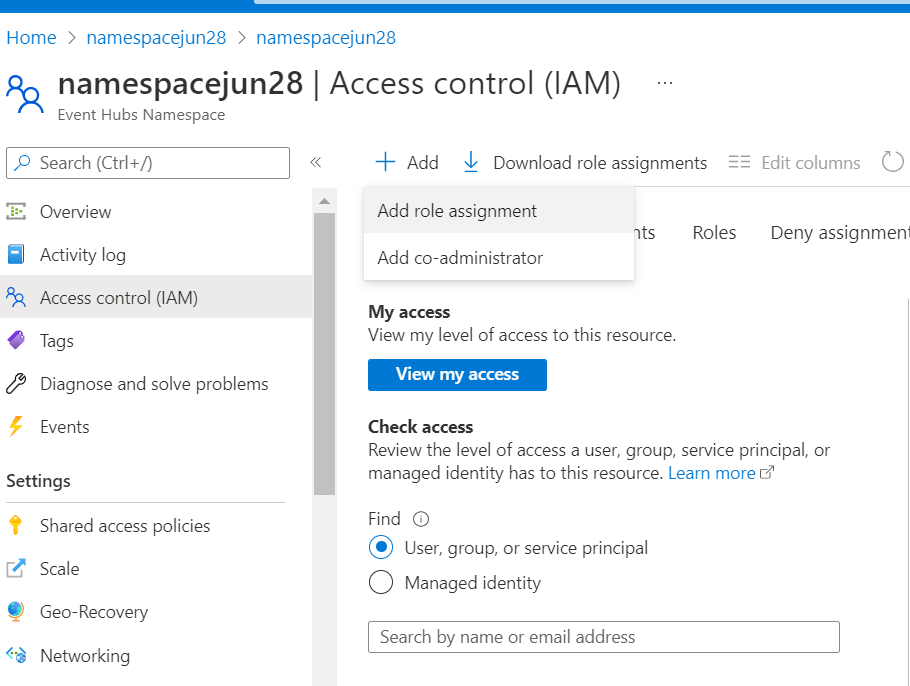  

**_Step 2:_** Navigate to members tab and select Managed identity. Select the appropriate subscription and select the created Data factory and click on select and then Review + assign. 

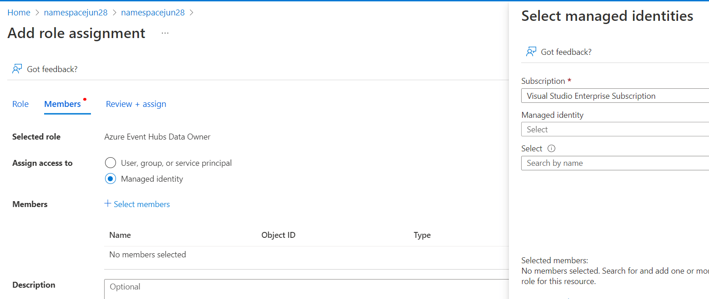  > 

**_Step 3:_** Repeat the same steps to control access for Event Hub  

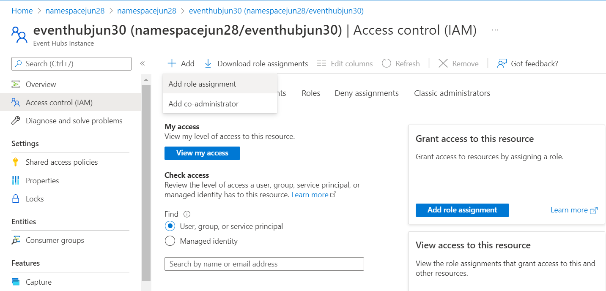  

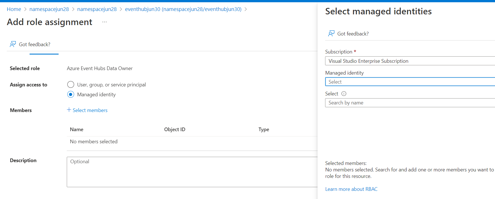  

### 7. Ensure Diagnostic logging is enabled for Azure event hubs

**Security Control Mapping :**  
| Control Number | Control Statement | Security Domain | Default | Associated Runbook | CVSS Severity  |
| -------------- | ----------------- | --------------- | ------- | ------------------ | -------------- |
| CS0012233 | Information System must create a log and record activities occurring on or originating from the information system. Logs must be made accessible to the enterprise SIEM solution  | Security Information and event management   | Enabled but not forwarded to Splunk | None | [Low (2.7)](https://www.first.org/cvss/calculator/3.1#CVSS:3.1/AV:P/AC:H/PR:H/UI:N/S:U/C:L/I:N/A:L) |

**Why?**  

Diagnostic settings are used to configure streaming export of platform logs and metrics for a resource to the destination of your choice. You may create up to five different diagnostic settings to send different logs and metrics to independent destinations

**How?**  

**_Step 1:_** Go to the already created and existing Event hub namespace and Select Diagnostic settings under monitoring in the left side menu. 

**_Step 2:_** Click on +Add diagnostic settings and select allLogs under Logs. 
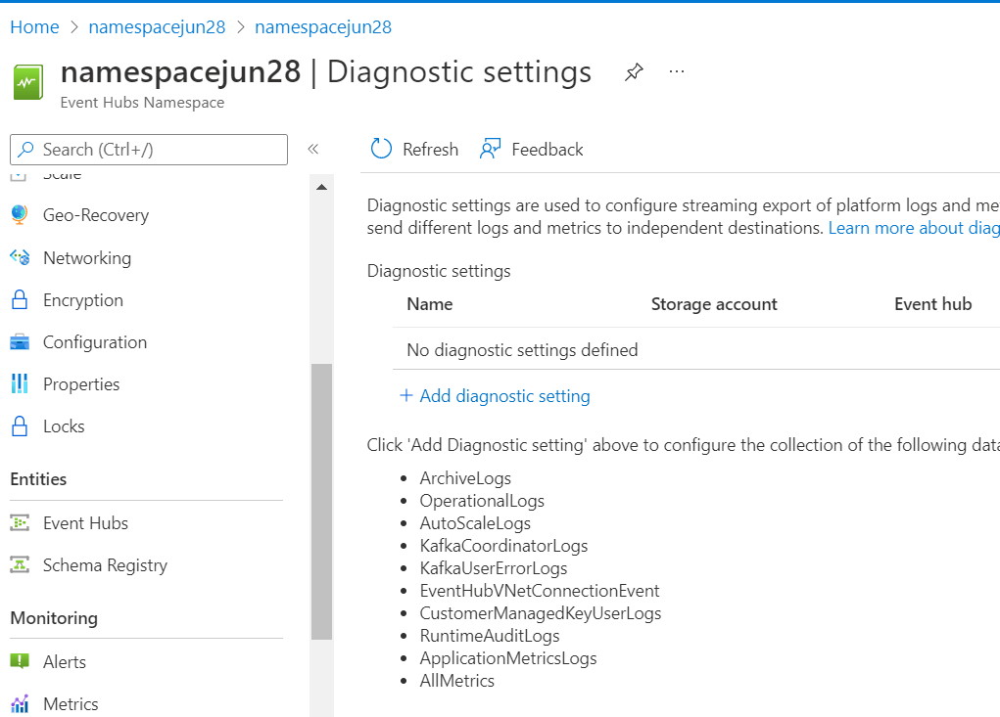 

**_Step 3:_** Select Stream to an Event hub. Choose the Eventhub namespace and Click on save button.  . 
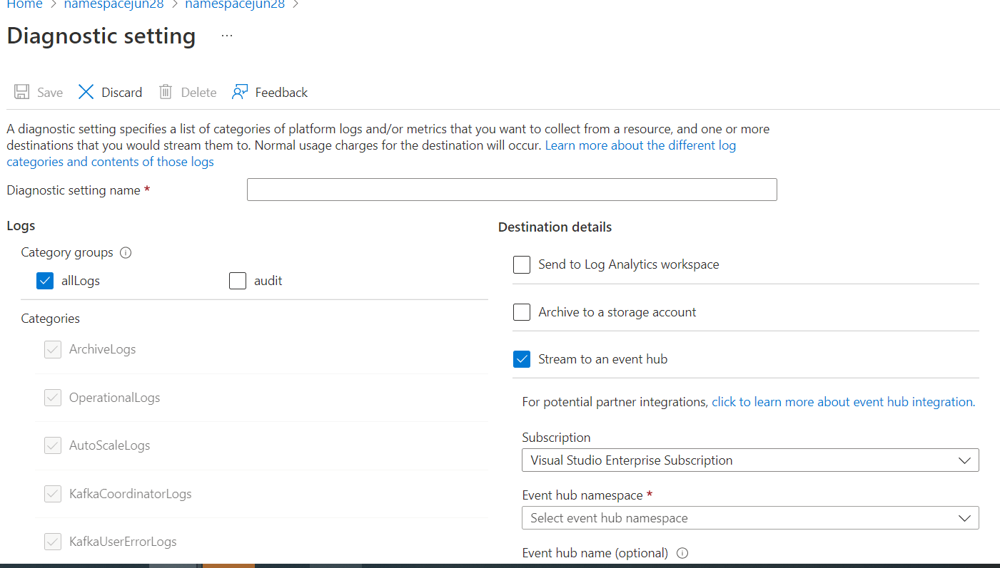
  

### 8. Ensure Azure event hubs uses standard organizational Resource tagging method

**Security Control Mapping :**  
| Control Number | Control Statement | Security Domain | Default | Associated Runbook | CVSS Severity  |
| -------------- | ----------------- | --------------- | ------- | ------------------ | -------------- |
| CS0012261  | Technology hardware and software must be registered and accurately recorded within the enterprise technology repository and/or asset management systems | Asset Management  | Not enabled | organizational Runbook | [Low (1.6)](https://www.first.org/cvss/calculator/3.1#CVSS:3.1/AV:P/AC:H/PR:H/UI:N/S:U/C:N/I:N/A:L) |

**Why, What and How ?** 

Client Rationale and Justification 
[Placeholder link]

### 9. Ensure Activity logging is enabled for Azure event hub

**Security Control Mapping :**  
| Control Number | Control Statement | Security Domain | Default | Associated Runbook | CVSS Severity  |
| -------------- | ----------------- | --------------- | ------- | ------------------ | -------------- |
| CS0012233 | Information System must create a log and record activities occurring on or originating from the information system. Logs must be made accessible to the enterprise SIEM solution  | Security Information and event management   | Enabled but not forwarded to Splunk | None | [Low (2.7)](https://www.first.org/cvss/calculator/3.1#CVSS:3.1/AV:P/AC:H/PR:H/UI:N/S:U/C:L/I:N/A:L) |

**Why, What and How ?** 

Client rationale and Justification 
[Placeholder link]

   

### 10. Ensure data in Event Hubs name space is Encrypted with Organization Managed Keys 

**Security Control Mapping :**  

| Control Number | Control Statement | Security Domain | Default | Associated Runbook | CVSS Severity  |
| -------------- | ----------------- | --------------- | ------- | ------------------ | -------------- |
|  [CS0012168](place holder)       |Strong encryption key management controls are in place for cloud provider services to protect data at rest | Data Protection  | Not enabled | None | [Medium (5.3)](https://www.first.org/cvss/calculator/3.1#CVSS:3.1/AV:A/AC:H/PR:H/UI:N/S:U/C:H/I:L/A:L)  |

**Why?**  

Azure Event Hubs encrypts your data using Azure Storage encryption for data at rest, and automatically decrypts it for you as you access it. A Microsoft-managed key is used to encrypt the data in the Event Hubs namespace

**Note :** Customer-managed key encryption at rest is enabled only on empty namespaces and not on existing namespaces and it is supported by premium and dedicated tiers of Event Hubs. 

**How?**  

**_Step 1:_** Go to the already created and existing Event hub namespace and Select Encryption under Settings in the left side menu. 

**_Step 2:_** Select 'Encrypt with' as 'Customer-managed key' . Enable infrastructure-level encryption and select the identitiy type as 'System Assigned'    
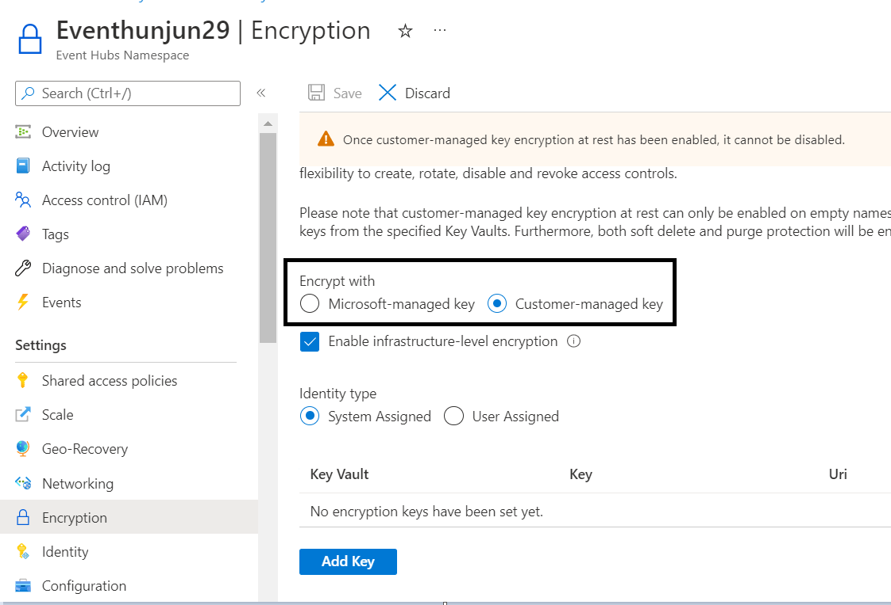 

  

To implement this control, refer the link:
https://docs.microsoft.com/en-us/azure/event-hubs/configure-customer-managed-key

   
