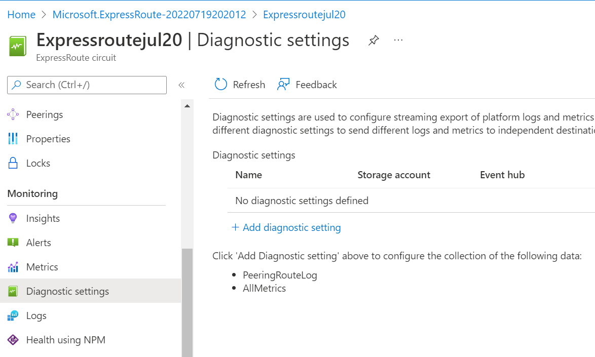
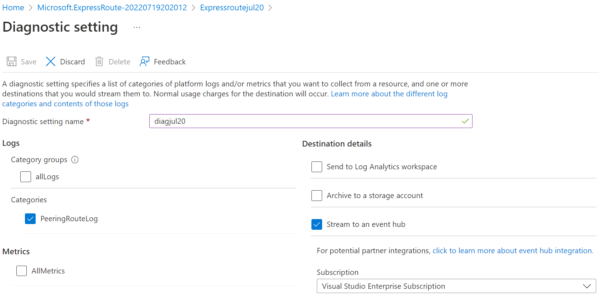
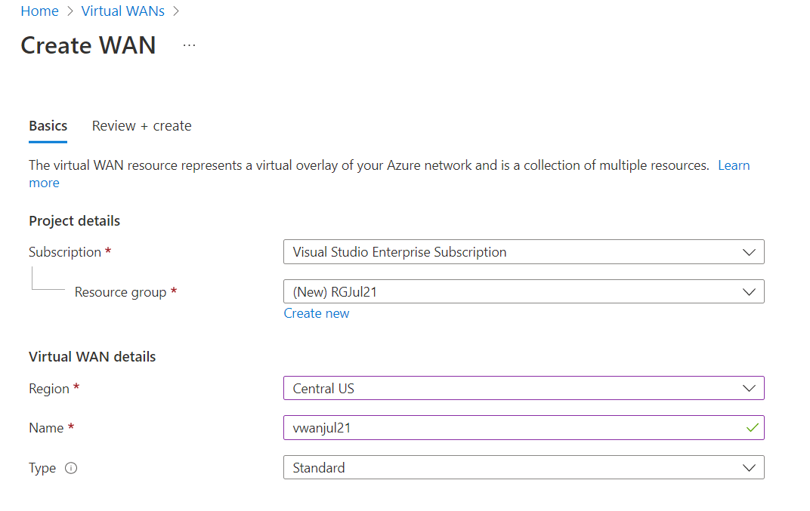
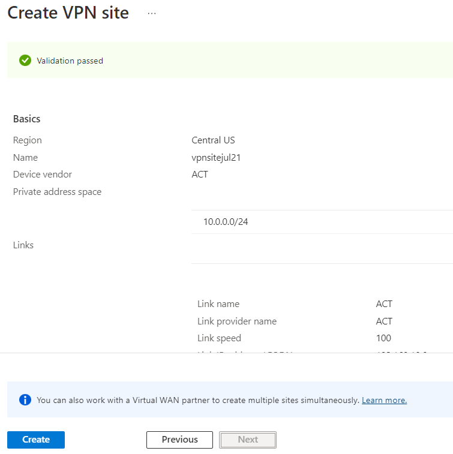
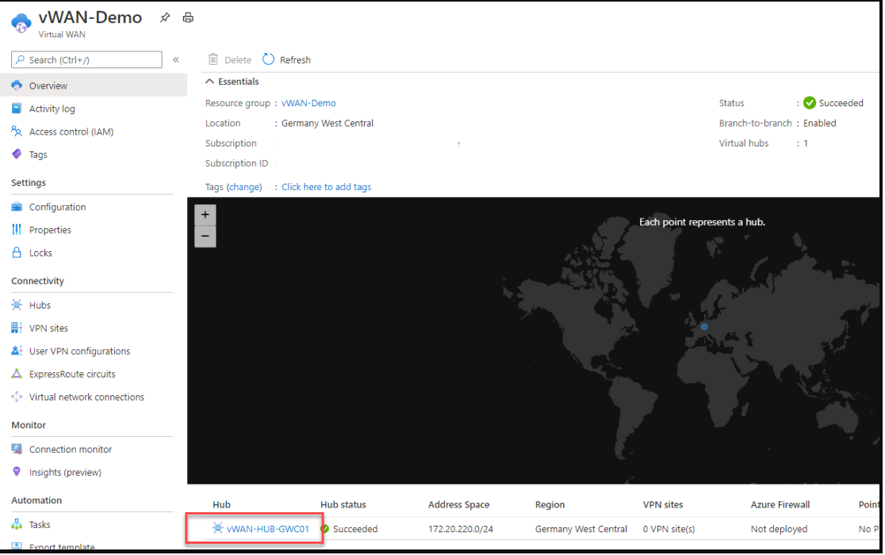
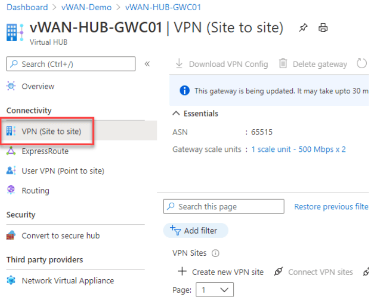

# Azure Expressroute - Security baseline requirement <!-- omit in toc -->

## Baseline security configuration requirement for Azure services  <!-- omit in toc -->

**Generated By: EY Security Team**  
**Service Type: Networking**  
**Deployment Phase: Service Discovery**  
**Last updated: 06/21/2022** 

## Table of Contents <!-- omit in toc -->

- [Overview](#overview)
  - [Use Case Examples:](#use-case-examples)
- [Cloud Security Requirements](#cloud-security-requirements)
  - [1. Ensure Azure Express route uses standard organizational Resource tagging method](#1-ensure-azure-express-route-uses-standard-organizational-resource-tagging-method)
  - [2. Ensure diagnostic logging is enabled for Azure Express Route](#2-ensure-diagnostic-logging-is-enabled-for-azure-express-route)
  - [3. Ensure Activity logging is enabled for Azure Express Route](#3-ensure-activity-logging-is-enabled-for-azure-express-route)
  - [4. Ensure least privilege access is implemented in Express Route using Role Based Access control](#4-ensure-least-privilege-access-is-implemented-in-express-route-using-role-based-access-control)
  - [5. Ensure the Managed Identity is enabled on Azure Express route](#5-ensure-the-managed-identity-is-enabled-on-azure-express-route)
  - [6. Ensure the  dedicated workstation on Azure Express route](#6-ensure-the--dedicated-workstation-on-azure-express-route)
  - [7. Ensure express route is configured to secure on-premises network to Azure](#7-ensure-express-route-is-configured-to-secure-on-premises-network-to-azure)
  - [8. Ensure IPSec policies are configured for Expressroute connections from Azure to on-prem](#8-ensure-ipsec-policies-are-configured-for-expressroute-connections-from-azure-to-on-prem)
  - [9. Ensure both primary and secondary connections of an ExpressRoute circuit are configured in active-active mode to improve high availability](#9-ensure-both-primary-and-secondary-connections-of-an-expressroute-circuit-are-configured-in-active-active-mode-to-improve-high-availablity)
- [Expressroute Direct](#expressroutedirect)
  - [10. Ensure we secure private network access to Azure services by enabling MACsec and IPSec using Expressroute Direct](#10-ensure-we-secure-private-network-access-to-azure-services-by-enabling-MACsec-and-IPsec-using-expressroute-direct)

##  Overview 

ExpressRoute is used to extend the on-premises networks into the Microsoft cloud over a private connection with the help of a connectivity provider. Connectivity can be from an any-to-any (IP VPN) network, a point-to-point Ethernet network, or a virtual cross-connection through a connectivity provider at a colocation facility. ExpressRoute connections don't go over the public Internet. This allows ExpressRoute connections to offer more reliability, faster speeds, consistent latencies, and higher security than typical connections over the Internet. 

| Control Number | Cloud Baseline Security Requirements                                                                                                       |
| -------------- | ------------------------------------------------------------------------------------------------------------------------------------------ |
| 1              | Ensure Azure Express route uses standard organizational Resource tagging method                                                            |
| 2              | Ensure diagnostic logging is enabled for Azure Express Route                                                                               |
| 3              | Ensure Activity logging is enabled for Azure Express Route                                                                                 |
| 4              | Ensure least privilege access is implemented in Express Route using Role Based Access control                                              |
| 5              | Ensure the Managed Identity is enabled on Azure Express route                                                                              |
| 6              | Ensure the dedicated workstation on Azure Express route                                                                                    |
| 7              | Ensure express route is configured to secure on-premises network to Azure                                                                  |
| 8              | Ensure IPSec policies are configured for Expressroute connections from Azure to on-prem                                                    |
| 9              | Ensure both primary and secondary connections of an ExpressRoute circuit are configured in active-active mode to improve high availability |

### Use Case Examples:
- Rehost Adabas & Natural applications in Azure
- Migrate AIX workloads to Azure with Skytap
- Refactor mainframe applications with Astadia
- Oracle database migration: Cross-cloud connectivity

## Cloud Security Requirements ##

### 1. Ensure Azure Express route uses standard organizational Resource tagging method

**Security Control Mapping :**  
| Control Number | Control Statement | Security Domain | Default | Associated Runbook | CVSS Severity  |
| -------------- | ----------------- | --------------- | ------- | ------------------ | -------------- |
| CS0012261  | Technology hardware and software must be registered and accurately recorded within the enterprise technology repository and/or asset management systems | Asset Management  | Not enabled | Organizational Runbook | [Low (1.6)](https://www.first.org/cvss/calculator/3.1#CVSS:3.1/AV:P/AC:H/PR:H/UI:N/S:U/C:N/I:N/A:L) |

**Why, What and How ?** 

Client Rationale and Justification 
[Placeholder link]

### 2. Ensure diagnostic logging is enabled for Azure Express Route 

**Security Control Mapping :**  
| Control Number | Control Statement | Security Domain | Default | Associated Runbook | CVSS Severity  |
| -------------- | ----------------- | --------------- | ------- | ------------------ | -------------- |
| CS0012233 | Information System must create a log and record activities occurring on or originating from the information system. Logs must be made accessible to the enterprise SIEM solution  | Security Information and event management  | Not Enabled | None | [Low (2.7)](https://www.first.org/cvss/calculator/3.1#CVSS:3.1/AV:P/AC:H/PR:H/UI:N/S:U/C:L/I:N/A:L) |

**Why?**  
  
The event log contains information about the api objects which include AppServiceHTTPLogs,AppServiceConsoleLogs,AppServiceAppLogs,AppServiceAuditLogs,AppServiceIPSecAuditLogs and AppServicePlatformLogs. These logs when forwarded to Splunk provide necessary information to create notable alerts for any rule created to allow connection from internet  

**How?**  

**_Step 1:_** on Diagnostic Settings page click on 'Add diagnostic setting' .  
 
**_Step 2:_** Select the AllMetrics checkboxes and Select Destination details to be 'Stream to an Eventhub'. 
 

   

### 3. Ensure Activity logging is enabled for Azure Express Route

**Security Control Mapping :**  
| Control Number | Control Statement | Security Domain | Default | Associated Runbook | CVSS Severity  |
| -------------- | ----------------- | --------------- | ------- | ------------------ | -------------- |
| CS0012233 | Information System must create a log and record activities occurring on or originating from the information system. Logs must be made accessible to the enterprise SIEM solution  | Security Information and event management   | Enabled but not forwarded to Splunk | None | [Low (2.7)](https://www.first.org/cvss/calculator/3.1#CVSS:3.1/AV:P/AC:H/PR:H/UI:N/S:U/C:L/I:N/A:L) |

**Why, What and How ?** 

Client rationale and Justification 
[Placeholder link]

   

### 4. Ensure least privilege access is implemented in Express Route using Role Based Access control 

[Place Holder ]
        
**Following are the suggested RBAC roles for Azure Load Balancer**  
| Function | Description | Role | 
| -------------- | ----------------- | --------------- | 
| Express Route Contributor| Gets a load balancer definition and 	Deletes a load balancer . Joins a load balancer backend address pool and inbound NAT pool   | [Domain Services Contributor](https://github.com/MicrosoftDocs/azure-docs/blob/main/articles/role-based-access-control/built-in-roles.md#domain-services-contributor) |
|  Express Route User | 	Joins a load balancer backend address pool and inbound NAT pool Read the properties of a network interface. | [DevTest Labs User ](https://docs.microsoft.com/en-us/azure/role-based-access-control/built-in-roles#devtest-labs-user) |

  

### 5. Ensure the Managed Identity is enabled on Azure Express route 

**Security Control Mapping :** 

| Control Number | Control Statement | Security Domain | Default | Associated Runbook | CVSS Severity  |
| -------------- | ----------------- | --------------- | ------- | ------------------ | -------------- |
|  CS0012298       | Access to change cloud identity access and service control policies is restricted to authorized cloud administrative personnel |Identity & Access Management | Not enabled | None | [Medium (5.1)](https://www.first.org/cvss/calculator/3.1#CVSS:3.1/AV:A/AC:H/PR:H/UI:N/S:C/C:L/I:L/A:L) |

**Why, What and How ?** 

Managed identity enables Azure resources to authenticate to cloud services (e.g. Azure Key Vault) without storing credentials in code. Once enabled, all necessary permissions can be granted via Azure role-based-access-control. 
In system assigned managed identity, the lifecycle of this type of managed identity is tied to the lifecycle of this resource. Additionally, each resource (e.g. Virtual Machine) can only have one system assigned managed identity. 
In User assigned managed identity, managed identities are created as standalone Azure resources, and have their own lifecycle. A single resource (e.g. Virtual Machine) can utilize multiple user assigned managed identities. A single user assigned managed identity can be shared across multiple resources.
To access the container images from the container registry, An user-assigned or system-assigned managed identity must be setup on a Linux VM. Similarly an Azure Kubernetes Service cluster must be setup to use the managed identity to pull container images from Azure Container Registry for pod deployments.

Below example is to assign a managed service identity to an ExpressRoute Port : 
_az network express-route port identity assign --identity_
                                              _[--ids]_
                                              _[--name]_
                                              _[--no-wait]_
                                              _[--resource-group]_

### 6. Ensure the proper dedicated workstations are using Azure Express route 

**Security Control Mapping :**  
| Control Number | Control Statement | Security Domain | Default | Associated Runbook | CVSS Severity  |
| -------------- | ----------------- | --------------- | ------- | ------------------ | -------------- |
|  [CS0012298](place holder)	 | Access to change cloud identity access and service control policies is restricted to authorized cloud administrative personnel |  Identity & Access Management | Not enabled | None | [Low (3.0)](https://www.first.org/cvss/calculator/3.1#CVSS:3.1/AV:L/AC:H/PR:H/UI:N/S:U/C:L/I:L/A:N)|

**Why?**  

A Privileged workstation provides a hardened workstation that has clear application control and application guard. The workstation uses credential guard, device guard, app guard, and exploit guard to protect the host from malicious behavior. All the administrative tasks must be performed only using the admin-e workstation

**How?**  
 
**_Step 1:** Request permission to add the user to corresponding entitlements to access admin dedicated workstation
**_Step 2:** Login to the workstation as the user and launch the azure portal in browser to perform administrative tasks
[placeholder link]

### 7. Ensure express route is configured to secure on-premises network to Azure

**Security Control Mapping :**  
| Control Number | Control Statement | Security Domain | Default | Associated Runbook | CVSS Severity  |
| -------------- | ----------------- | --------------- | ------- | ------------------ | -------------- |
|  CS0012168       | Strong encryption key management controls are in place for cloud provider services to protect data at rest | Data Protection  | Enabled | None | [Medium (5.3)](https://www.first.org/cvss/calculator/3.1#CVSS:3.1/AV:A/AC:H/PR:H/UI:N/S:U/C:H/I:L/A:L) |

**Why and What ?** 

Data in transit between on-prem and Azure Express route services can be encrypted based on the nature of the connection.  Encrypted transit between the on-premises networks and Azure virtual networks over ExpressRoute, without going over the public internet or using public IP addresses must be chosen to improve the security posture of the environment and also to remain in compliance with industry standards or organization requirements.

**How?**  

**_Step 1:_** Create a virtual wan in the azure portal  
  

**_Step 2:_** In the created azure wan,under Connectivity, select VPN sites and click `+Create site` and fill all the details  
  

**_Step 3:_** Go back to the virtual WAN resource page, and select the hub resource. Or navigate from the VPN site to the connected hub. 
  

**_Step 4:_** Under Connectivity, select VPN (Site-to-Site) 
  

**_Step 5:_** Select the ellipsis (...) on the VPN site over ExpressRoute, and select Edit VPN connection to this hub.  
  

**_Step 6:_** For Use Azure Private IP Address, select Yes. 
  

Refer the link below for more details :  
https://docs.microsoft.com/en-us/azure/virtual-wan/vpn-over-expressroute

### 8. Ensure IPSec policies are configured for Expressroute connections from Azure to on-prem 

**Security Control Mapping :**  
| Control Number | Control Statement | Security Domain | Default | Associated Runbook | CVSS Severity  |
| -------------- | ----------------- | --------------- | ------- | ------------------ | -------------- |
|  [CS0012261](place holder)	 | Cloud based data in transit must be encrypted with enterprise approved algorithms | Data Protection | Not enabled | None | [Medium (5.3)](https://www.first.org/cvss/calculator/3.1#CVSS:3.1/AV:L/AC:H/PR:H/UI:N/S:U/C:L/I:L/A:N)|

**Why?**  

In order to protect data in transit that between Azure Vms running Windows and on-premisses Windows hosts, IPSec policies must be enabled and configure. IPSec helps us to protect IP traffic on the network layer. IPsec can protect our traffic by encrypting data, ensuring integrity through hash value validation, sender and receiver authentication, anti-replay protection by ensuring no transmission of any duplicate packets. Refer to the [following link](https://confluence.capgroup.com/pages/viewpage.action?pageId=144095919) for CG implementation details.

**How?**  

**_Step 1:_** Create a GPO and associate it to the OU.  

**_Step 2:_** Define an IPsec Filter Action 

**_Step 3:_** Define an IPsec Filter List 

**_Step 4:_** Create an IPsec Policy with Security Rules 

**_Step 5:_** Assign the IPsec GPO and the OU 
Refer 

Refer to the link below for more further details:  
https://docs.microsoft.com/en-us/azure/expressroute/expressroute-howto-ipsec-transport-private-windows

### 9. Ensure both primary and secondary connections of an ExpressRoute circuit are configured in active-active mode to improve high availability

**Security Control Mapping :**  
| Control Number | Control Statement | Security Domain | Default | Associated Runbook | CVSS Severity  |
| -------------- | ----------------- | --------------- | ------- | ------------------ | -------------- |
|  [CS0012133](place holder) | Information systems are hardened and configured to align with enterprise requirements |  Configuration Management | Not enabled | None | [Low (3.0)](https://www.first.org/cvss/calculator/3.1#CVSS:3.1/AV:L/AC:H/PR:H/UI:N/S:U/C:L/I:L/A:N)|

**Why?**  

To improve high availability, it's recommended to operate both the connections of an ExpressRoute circuit in active-active mode. If you let the connections operate in active-active mode, Microsoft network will load balance the traffic across the connections on per-flow basis. active-active mode will significantly help improve the Mean Time To Recover (MTTR). Refer to the [following link](https://confluence.capgroup.com/display/API/Active-Active+Replication) for further CG guidance.

**How?**  

By default, the primary and secondary connections work in active-active mode, and Microsoft handles load balancing accordingly.  
Refer to [Microsoft documentation](https://docs.microsoft.com/en-us/azure/expressroute/designing-for-high-availability-with-expressroute#active-active-connections) for more details.

### Expressroute Direct

### 10. Ensure we secure private network access to Azure services by enabling MACsec and IPSec using Expressroute Direct

**Security Control Mapping :**  
| Control Number | Control Statement | Security Domain | Default | Associated Runbook | CVSS Severity  |
| -------------- | ----------------- | --------------- | ------- | ------------------ | -------------- |
| [CS0012261](place holder)	 | Cloud based data in transit must be encrypted with enterprise approved algorithms | Data Protection | Not enabled | None | [Low (3.0)](https://www.first.org/cvss/calculator/3.1#CVSS:3.1/AV:L/AC:H/PR:H/UI:N/S:U/C:L/I:L/A:N)|

**Why?**  

To ensure confidentiality and integrity of the data traversing between CG's network and Microsoft, encryption must be enabled while using Expressroute Direct. MACsec is an IEEE standard. It encrypts data at the Media Access control (MAC) level or Network Layer 2. You can use MACsec to encrypt the physical links between your network devices and Microsoft's network devices when you connect to Microsoft via ExpressRoute Direct. MACsec is disabled on ExpressRoute Direct ports by default. MACsec will be configured through powershell only. IPsec is an IETF standard. It encrypts data at the Internet Protocol (IP) level or Network Layer 3. You can use IPsec to encrypt an end-to-end connection between your on-premises network and your virtual network (VNET) on Azure.

**How?**  

**To configure MACsec** 
**_Step 1:_** Create/select Azure Key Vault, MACsec secrets, and user identity

**_Step 2:_** Configure MACsec on ExpressRoute Direct ports
- Set MACsec secrets and cipher and associate the user identity with the port so that the ExpressRoute management code can access the MACsec secrets if needed. 

Please refer to the [following documentation](https://docs.microsoft.com/en-us/azure/expressroute/expressroute-howto-macsec) for further implementation details.

**To configure IPSec**  
**_Step 1:_** Configure Microsoft peering for your ExpressRoute circuit. 

**_Step 2:_** Advertise selected Azure regional public prefixes to your on-prem network via Microsoft peering. 

**_Step 3:_** Configure a VPN gateway and establish IPsec tunnels. 

**_Step 5:_** Configure the on-premises VPN device. 

**_Step 6:_** Create the site-to-site IPsec/IKE connection. 

**_Step 7:_** Test and validate the IPsec communication over the ExpressRoute circuit. 

Please refer to the [following documentation](https://docs.microsoft.com/en-us/azure/expressroute/site-to-site-vpn-over-microsoft-peering#workflow) for further implementation details.
  
