# Azure Firewall Service - Security baseline requirement <!-- omit in toc -->

## Baseline security configuration requirement for Azure services <!-- omit in toc -->

**Generated By: EY Security Team**  
**Service Type: Networking**  
**Deployment Phase: Service Discovery**  
**Last updated: 02/08/2022** 

- [Overview](#overview)
  - [Use Case Examples:](#use-case-examples)
- [Cloud Security Requirements](#cloud-security-requirements)
  - [1. Ensure alerts for IDPS (Intrusion Detection and Prevention System) are configured for Azure Firewall](#1-ensure-alerts-for-idps-intrusion-detection-and-prevention-system-are-configured-for-azure-firewall)
  - [2. Ensure Forced tunneling is enabled for Azure Firewall](#2-ensure-forced-tunneling-is-enabled-for-azure-firewall)
  - [3. Ensure service tags are enabled for resources protected by Azure Firewall](#3-ensure-service-tags-are-enabled-for-resources-protected-by-azure-firewall)
  - [4. Ensure Azure Firewall uses standard organizational Resource tagging method](#4-ensure-azure-firewall-uses-standard-organizational-resource-tagging-method)
  - [5. Ensure Azure Firewall protects underlying application using Firewall manager](#5-ensure-azure-firewall-protects-underlying-application-using-firewall-manager)
  - [6. Ensure tls inspection is enabled in Azure Firewall to protect network traffic](#6-ensure-tls-inspection-is-enabled-in-azure-firewall-to-protect-network-traffic)
  - [7. Ensure URL filtering is enabled through azure firewall policy for the azure firewall](#7-ensure-url-filtering-is-enabled-through-azure-firewall-policy-for-the-azure-firewall)
  - [8. Ensure diagnostic logging are enabled for Azure Firewall](#8-ensure-diagnostic-logging-are-enabled-for-azure-firewall)
  - [9. Ensure Activity logging is enabled for Azure Firewall](#9-ensure-activity-logging-is-enabled-for-azure-firewall)
  - [10. Ensure least privilege access for Azure Firewall is implemented using Role based access control](#10-ensure-least-privilege-access-for-azure-firewall-is-implemented-using-role-based-access-control)

## Overview

Azure Firewall is a cloud-native and intelligent network firewall security service that provides a fully stateful, firewall as a service with built-in high availability and unrestricted cloud scalability. It is used to protect both east-west and north-south traffic .Azure Firewall Premium can be used to provide advanced threat protection that meets the needs of highly sensitive and regulated environments and Organizations can use Premium stock-keeping unit (SKU) features like IDPS and TLS inspection to prevent malware and viruses from spreading across networks in both lateral and horizontal direction
  

| Control Number | Cloud Baseline Security Requirements                                                                 |
| -------------- | ---------------------------------------------------------------------------------------------------- |
| 1              | Ensure alerts for IDPS (Intrusion Detection and Prevention System) are configured for Azure Firewall |
| 2              | Ensure Forced tunneling is enabled for Azure Firewall                                                |
| 3              | Ensure service tags are enabled for resources protected by Azure Firewall                            |
| 4              | Ensure Azure Firewall uses standard organizational Resource tagging method                           |
| 5              | Ensure Azure Firewall protects underlying application using Firewall manager                         |
| 6              | Ensure tls inspection is enabled in Azure Firewall to protect network traffic                        |
| 7              | Ensure URL filtering is enabled through azure firewall policy for the azure firewall                 |
| 8              | Ensure diagnostic logging are enabled for Azure Firewall                                             |
| 9              | Ensure Activity logging is enabled for Azure Firewall                                                |
| 10             | Ensure least privilege access for Azure Firewall is implemented using Role based access control      |

### Use Case Examples:

- AKS regulated cluster for PCI-DSS 3.2.1
- Trusted Internet Connection (TIC) 3.0 compliance for internet-facing applications
- SWIFT Alliance Cloud in Azure
- Enterprise deployment using Azure App Service Environment

## Cloud Security Requirements 

### 1. Ensure alerts for IDPS (Intrusion Detection and Prevention System) are configured for Azure Firewall

**Security Control Mapping :**  

| Control Number | Control Statement | Security Domain | Default | Associated Runbook | CVSS Severity  |
| -------------- | ----------------- | --------------- | ------- | ------------------ | -------------- |
| CS0012261  | Technology hardware and software must be registered and accurately recorded within the enterprise technology repository and/or asset management systems | Asset Management  | Not enabled | organizational Runbook | [Low (1.6)](https://www.first.org/cvss/calculator/3.1#CVSS:3.1/AV:P/AC:H/PR:H/UI:N/S:U/C:N/I:N/A:L) |

**Why?**  

Azure Firewall comprises of intrusion detection and prevention system (IDPS) feature that is used to scrutinize all packets to detect any malicious activity right away before it can get into organization network. It helps to provide you the maximum power to monitor the organization network and provides all the information about it. Azure Firewall can be used to report any such activities and optionally block it.

**How?**  

**_Step 1:_**  Create a new firewall and associated firewall policies   

**_Step 2:_**  Search for firewall policies in the Azure portal and select the policy associated with the firewall created in the above step   
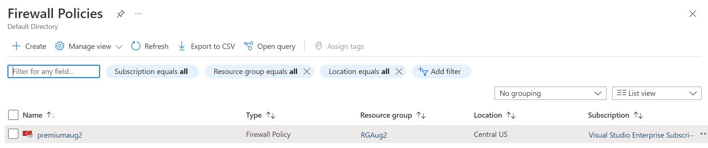 

**_Step 3:_** In the side menu bar of the Firewall policies, Navigate to IDPS and click on 'IDPS'. And click on 'Alert'. Select and click on `APPLY`.  
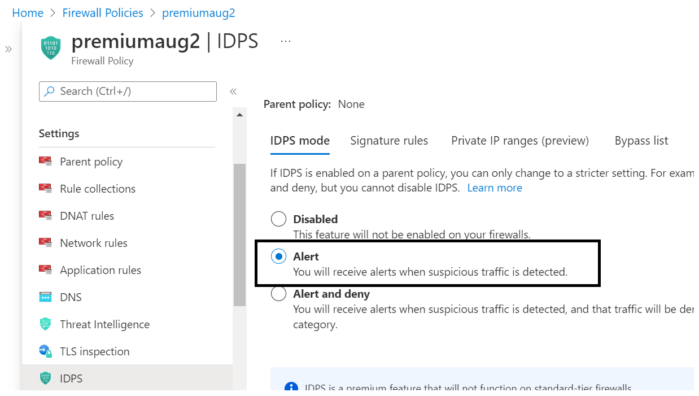
  

### 2. Ensure Forced tunneling is enabled for Azure Firewall

**Security Control Mapping :**  

| Control Number | Control Statement | Security Domain | Default | Associated Runbook | CVSS Severity  |
| -------------- | ----------------- | --------------- | ------- | ------------------ | -------------- |
| CS0012261  | Technology hardware and software must be registered and accurately recorded within the enterprise technology repository and/or asset management systems | Asset Management  | Not enabled | organizational Runbook | [Low (1.6)](https://www.first.org/cvss/calculator/3.1#CVSS:3.1/AV:P/AC:H/PR:H/UI:N/S:U/C:N/I:N/A:L) |

**why?**  

When a new Azure Firewall is configured, all Internet-bound traffic must be routed to a designated next hop instead of going directly to the Internet. For example, a default route must be advertised via BGP or using User Defined Route (UDR) to force traffic to an on-premises edge firewall or other network virtual appliance (NVA) to process network traffic before it's passed to the Internet. Forced tunneling must be used to redirect all the internet bound traffic from Azure Firewall to organization firewall or to chain it to a nearby network virtual appliance (NVA) for additional inspection. 

**How?**  

**_Step 1:_** Search for 'Azure Firewall' in Azure portal and navigate to it. And click on 'Create'. 
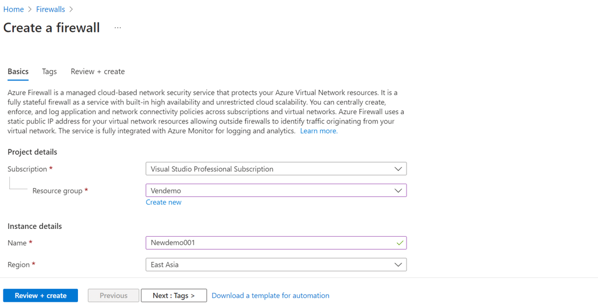 

**_Step 2:_** scroll down and click on button to enable the Forced tunneling. 
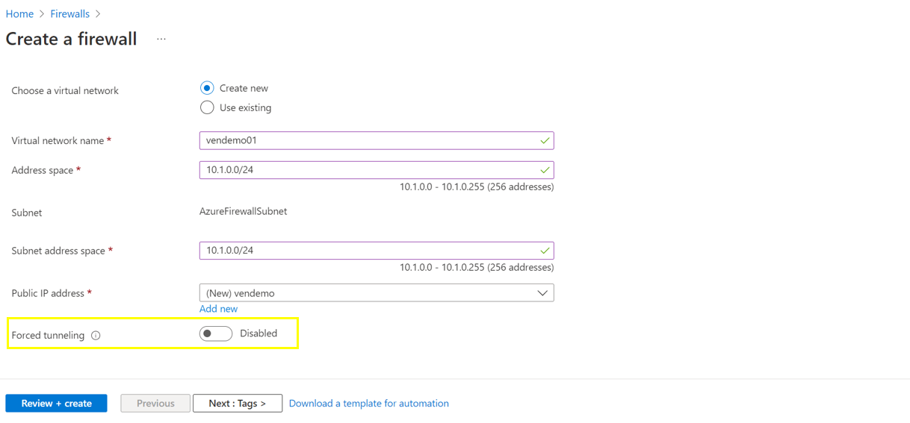 

**_Step 3:_** After enabled fill all the required data and click on 'Review + create'. 
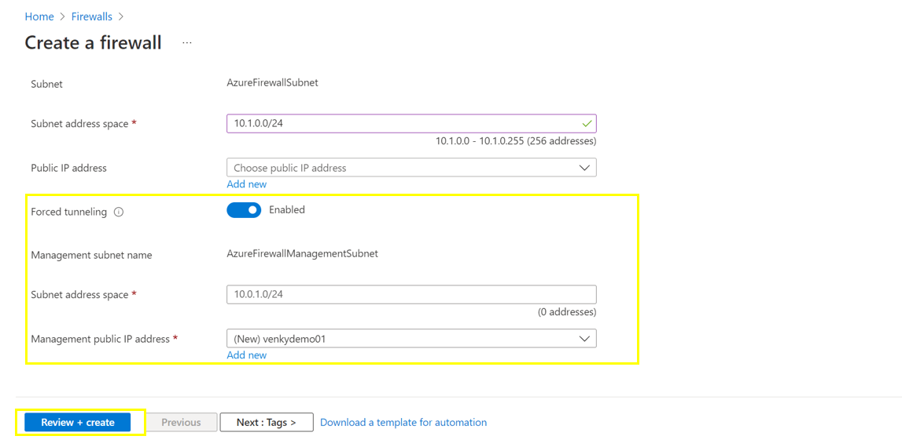
  

### 3. Ensure service tags are enabled for resources protected by Azure Firewall

**Security Control Mapping :**  
| Control Number | Control Statement | Security Domain | Default | Associated Runbook | CVSS Severity  |
| -------------- | ----------------- | --------------- | ------- | ------------------ | -------------- |
| CS0012261  | Technology hardware and software must be registered and accurately recorded within the enterprise technology repository and/or asset management systems | Asset Management  | Not enabled | organizational Runbook | [Low (1.6)](https://www.first.org/cvss/calculator/3.1#CVSS:3.1/AV:P/AC:H/PR:H/UI:N/S:U/C:N/I:N/A:L) |

**Why?** 
  
A service tag represents a group of IP address prefixes from a given Azure service. Azure Virtual Network service tags must be used to define network access controls for Key Vault resources in NSGs or Azure Firewall. Service tags can be used in place of specific IP addresses when creating security rules. Service tag name like "ContainerRegistry" must be used for the resources that are protected by Azure Firewall by modifying the appropriate rule source or destination fields to allow or deny traffic for the service.

**How?**  

**_Step 1:_** Navigate to existing Firewall policy -> settings -> Network rules. Click `Add a rule collection` button  
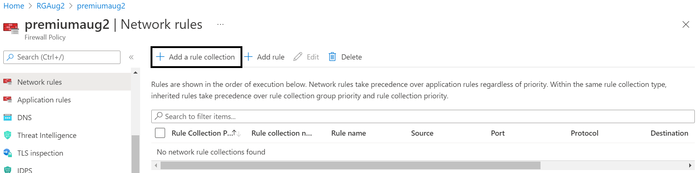  

**_Step 2:_** Select Destination Type as 'Service Tag'  
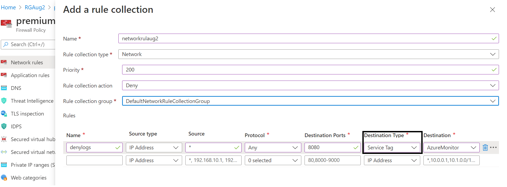  

**_Step 3:_** Click on `Add` button and rules are getting displayed 
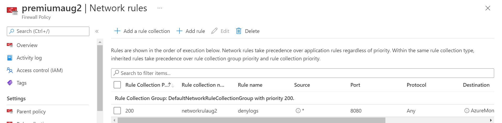  
  

### 4. Ensure Azure Firewall uses standard organizational Resource tagging method

**Security Control Mapping :**  

| Control Number | Control Statement | Security Domain | Default | Associated Runbook | CVSS Severity  |
| -------------- | ----------------- | --------------- | ------- | ------------------ | -------------- |
| CS0012261  | Technology hardware and software must be registered and accurately recorded within the enterprise technology repository and/or asset management systems | Asset Management  | Not enabled | organizational Runbook |  [Low (1.6)](https://www.first.org/cvss/calculator/3.1#CVSS:3.1/AV:P/AC:H/PR:H/UI:N/S:U/C:N/I:N/A:L) |

**Why, What and How ?** 

Client rationale and Justification 
[Placeholder link]

  

### 5. Ensure Azure Firewall protects underlying application using Firewall manager

**Security Control Mapping :** 

| Control Number | Control Statement | Security Domain | Default | Associated Runbook | CVSS Severity  |
| -------------- | ----------------- | --------------- | ------- | ------------------ | -------------- |
|  CS0012268     | Vulnerability Assessments must be performed based on risk and findings must be addressed in accordance with Enterprise SLA's | Vulnerability Management | Not enabled | None | [Medium (5.0)](https://www.first.org/cvss/calculator/3.1#CVSS:3.1/AV:L/AC:H/PR:H/UI:N/S:C/C:L/I:L/A:L) |

**Why?** 

Azure Firewall Manager is used to centrally manage Azure Firewall policies across multiple secured virtual hubs. The central IT teams can author global firewall policies to enforce organization wide firewall policy across teams. Locally authored firewall policies allow a DevOps self-service model for better agility.Azure Firewall Manager provides central security policy and route management for cloud-based security perimeters.

**How?**  

**_Step 1:_**  Navigate to the existing firewall and go to firewall manager  
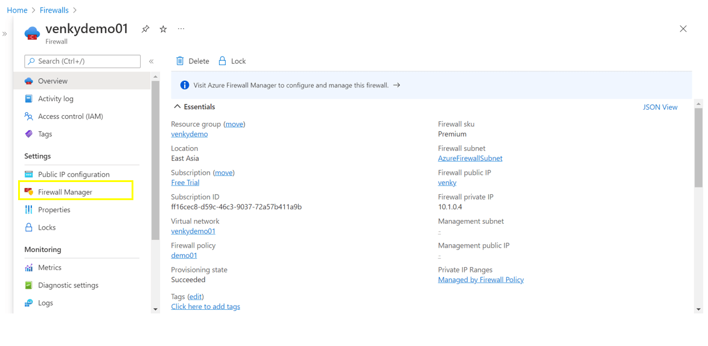  

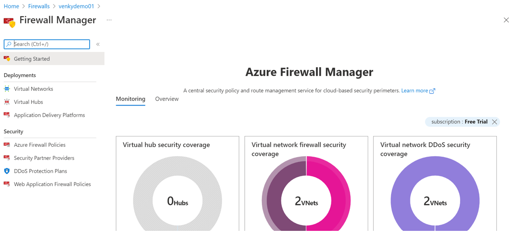  

**_Step 2:_** In the firewall manager page scroll down to see all the defender for cloud policies 
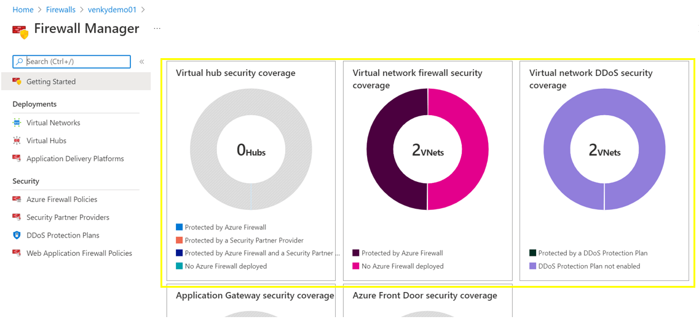 

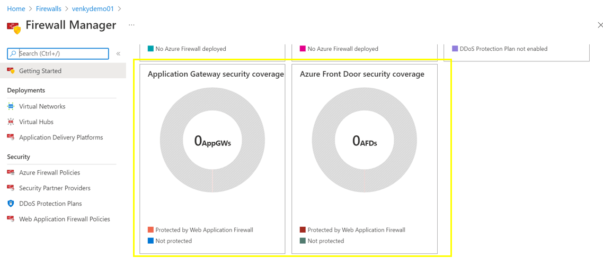
  

### 6. Ensure tls inspection is enabled in Azure Firewall to protect network traffic

**Security Control Mapping :**  
| Control Number | Control Statement | Security Domain | Default | Associated Runbook | CVSS Severity  |
| -------------- | ----------------- | --------------- | ------- | ------------------ | -------------- |
|  CS0012168       | Strong encryption key management controls are in place for cloud provider services to protect data at rest | Data Protection  | Not enabled | None | [Medium (5.3)](https://www.first.org/cvss/calculator/3.1#CVSS:3.1/AV:A/AC:H/PR:H/UI:N/S:U/C:H/I:L/A:L) |

**Why?**  

URL filtering extends Azure Firewall’s FQDN filtering capability to consider an entire URL that can be applied both on HTTP and HTTPS traffic. When HTTPS traffic is inspected, Azure Firewall Premium can use its TLS inspection capability to decrypt the traffic and extract the target URL to validate whether access is permitted. TLS inspection requires opt-in at the application rule level. Once enabled, URLs can be used for filtering with HTTPS. The TLS (Transport Layer Security) protocol is designed to provide cryptography for privacy, integrity, and authenticity using certificates between two or more communicating applications. It runs in the application layer and is widely used to encrypt the HTTP protocol.

**How?**  

**_Step 1:_**  Navigate to Azure portal and search for firewall policies  
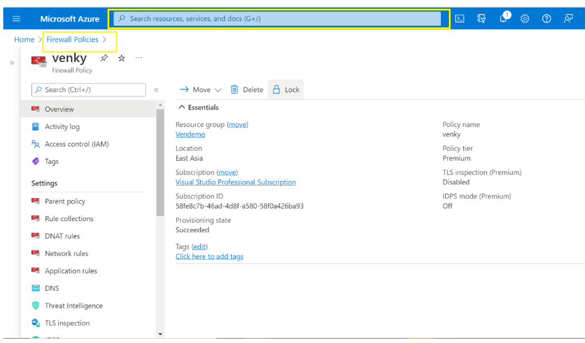 

**_Step 2:_** In the side menu bar of the Firewall policies, Navigate to TLS inspection and click on 'TLS inspection'. And click on 'Enable' 
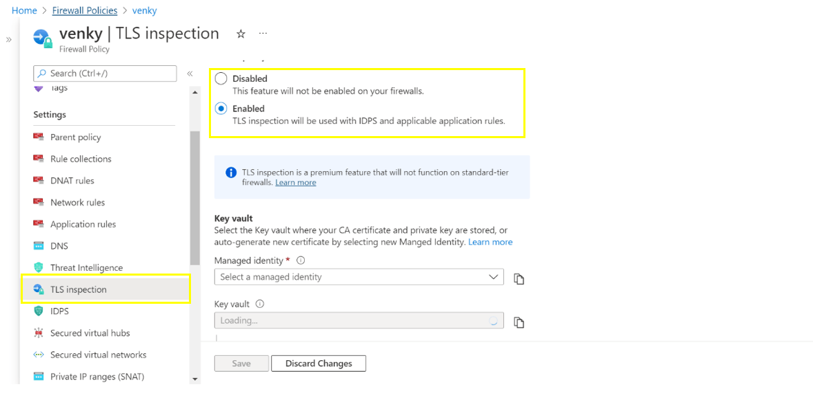 

**_Step 3:_** Select and fill all the required fields and click on 'Save'. 
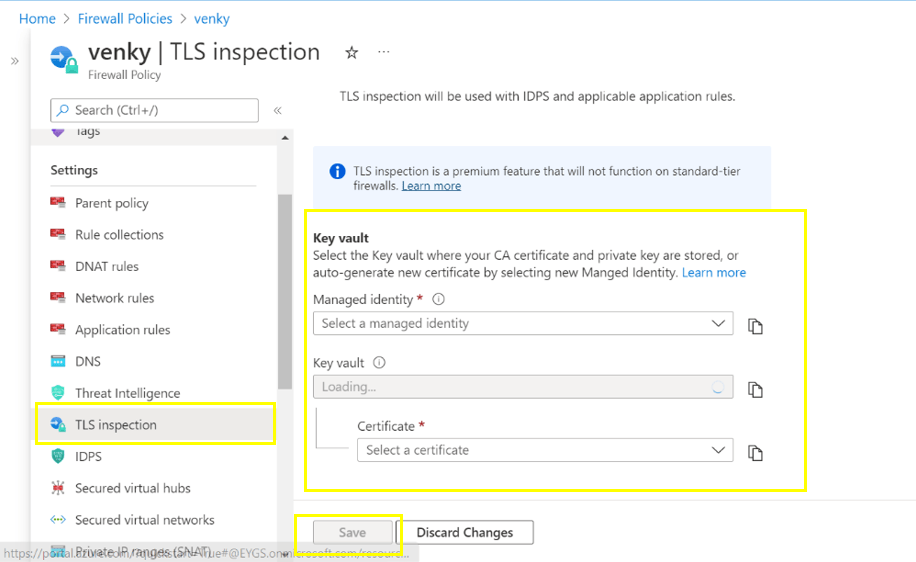  

### 7. Ensure URL filtering is enabled through azure firewall policy for the azure firewall

**why?**   

Firewall Policy is the recommended method to configure your Azure Firewall. It's a global resource that can be used across multiple Azure Firewall instances in Secured Virtual Hubs and Hub Virtual Networks. Policies work across regions and subscriptions.

**How?**  

**_Step 1:_**  When a new firewall is created , Add new Firewall policy  
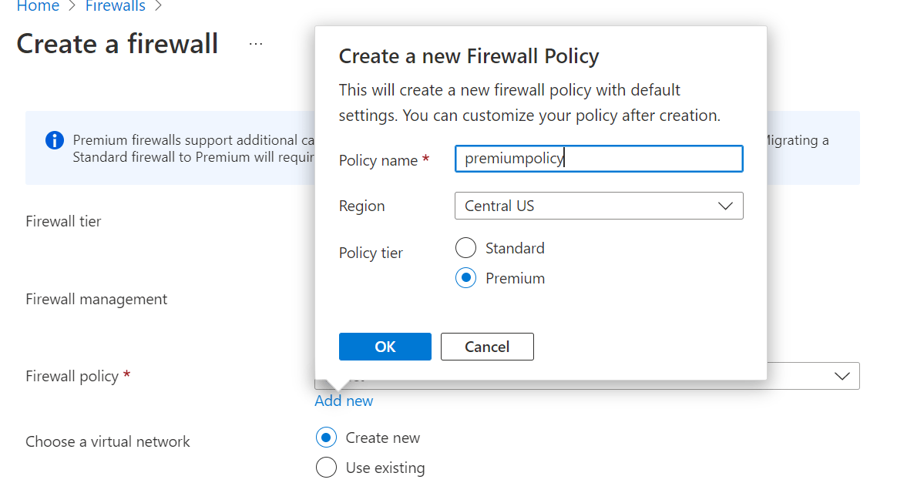 

**_Step 2:_**  Navigate to Azure firewall policies and click on 'Azure firewall policies'.  
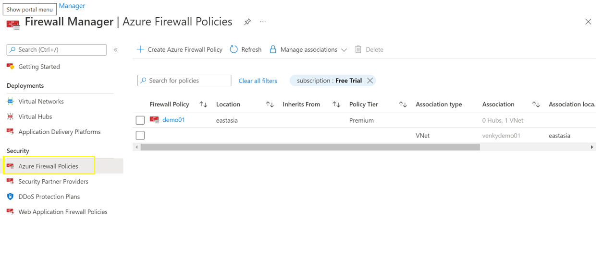 

**_Step 3:_** Navigate to Firewall policy -> settings -> Application rules. Click `Add a rule collection` button and create a rule to provide URL filtering. Click `Add`  
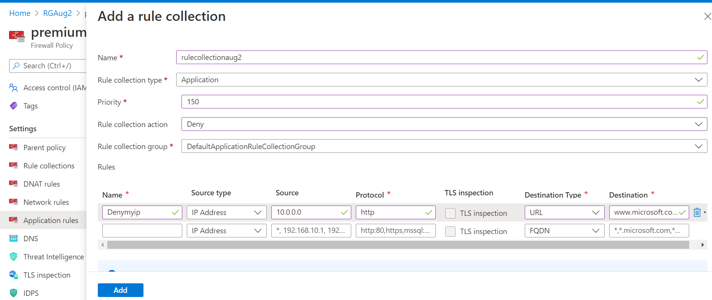  
  

  

### 8. Ensure diagnostic logging are enabled for Azure Firewall

**Security Control Mapping :**  
| Control Number | Control Statement | Security Domain | Default | Associated Runbook | CVSS Severity  |
| -------------- | ----------------- | --------------- | ------- | ------------------ | -------------- |
| CS0012233 | Information System must create a log and record activities occurring on or originating from the information system. Logs must be made accessible to the enterprise SIEM solution  | Security Information and event management  | Not Enabled | Network Watcher Runbook | [Low (2.7)](https://www.first.org/cvss/calculator/3.1#CVSS:3.1/AV:P/AC:H/PR:H/UI:N/S:U/C:L/I:N/A:L) |

**Why?**  
  
The event log contains information about the firewall objects which include  Azure Firewall Application Rule,Azure Firewall Network Rule,Azure Firewall DNS Proxy,Azure Firewall Network Rule Hit,Azure Firewall Application Rule Hit,Azure Firewall Nat Rule Hit,Azure Firewall ThreatIntel Hit,Azure Firewall Idps Signature Hit,Azure Firewall Dns query Hit,Azure Firewall Fqdn Resolution Failure Hit,Azure Firewall Network Rule Aggregation Hit,Azure Firewall Application Rule Aggregation Hit and Azure Firewall Nat Rule Aggregation Hit. These logs when forwarded to Splunk provide necessary information to create notable alerts for any rule created to allow connection from internet

**How?**  

**_Step 1:_**  In the side menu bar of the Firewall ,on Diagnostic Settings page click on 'Add diagnostic setting' . 
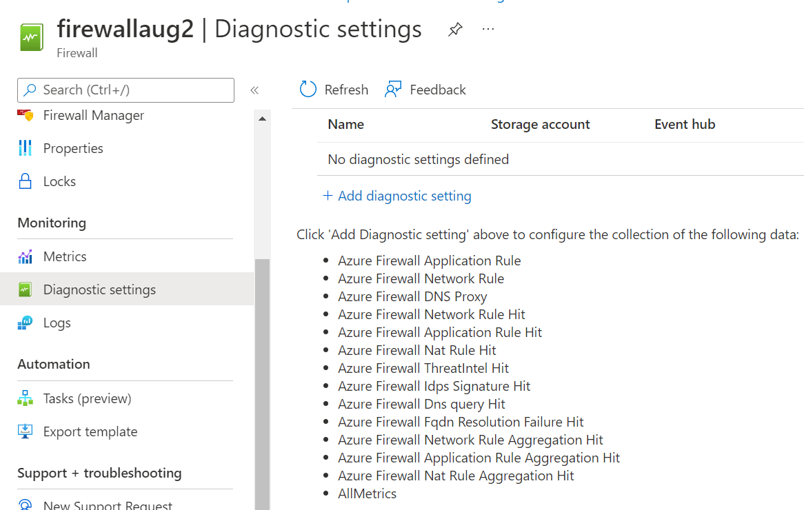 

**_Step 2:_** Select 'allLogs' and Select Destination details to be 'Stream to an event hub'. 
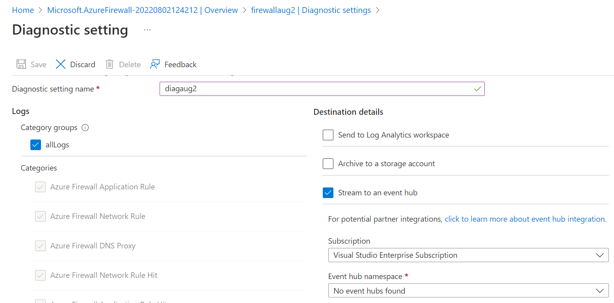
  

### 9. Ensure Activity logging is enabled for Azure Firewall

**Security Control Mapping :**  
| Control Number | Control Statement | Security Domain | Default | Associated Runbook | CVSS Severity  |
| -------------- | ----------------- | --------------- | ------- | ------------------ | -------------- |
| CS0012233 | Information System must create a log and record activities occurring on or originating from the information system. Logs must be made accessible to the enterprise SIEM solution  | Security Information and event management   | Enabled but not forwarded to Splunk | None | [Low (2.7)](https://www.first.org/cvss/calculator/3.1#CVSS:3.1/AV:P/AC:H/PR:H/UI:N/S:U/C:L/I:N/A:L) |

**Why, What and How ?** 
  
Client rationale and Justification  
[Placeholder link]
  

### 10. Ensure least privilege access for Azure Firewall is implemented using Role based access control

**Security Control Mapping :**  
| Control Number | Control Statement | Security Domain | Default | Associated Runbook | CVSS Severity  |
| -------------- | ----------------- | --------------- | ------- | ------------------ | -------------- |
|  CS0012298     | Access to change cloud identity access and service control policies is restricted to authorized cloud administrative personnel |  Identity and Access Management | Not enabled | None | [Medium (5.1)](https://www.first.org/cvss/calculator/3.1#CVSS:3.1/AV:A/AC:H/PR:H/UI:N/S:C/C:L/I:L/A:L) |

[Place Holder ]

**Following are the suggested RBAC roles for Azure Database for PostgreSQL**  

| Function | Description | Role | 
| -------------- | ----------------- | --------------- | 
|  Network Contributor | Lets you manage networks, but not access to them.| [Network Contributor](https://github.com/MicrosoftDocs/azure-docs/blob/main/articles/role-based-access-control/built-in-roles.md#network-contributor) |

  

