## Baseline security configuration requirement for Azure services  <!-- omit in toc -->

**Generated By: EY Security Team**  
**Service Type: KeyVault**  
**Deployment Phase: Service Discovery**  
**Last updated: 06/20/2022** 

## Table of Contents <!-- omit in toc -->

- [Overview](#overview)
  - [Use Case Examples:](#use-case-examples)
- [Cloud Security Requirements](#cloud-security-requirements)
  - [1. Ensure that public access is disabled by implementing Private endpoints](#1-ensure-that-public-access-is-disabled-by-implementing-private-endpoints)
  - [2. Ensure the application accessing Key vault service is running on a platform that supports TLS 1.2 or above](#2-ensure-the-application-accessing-key-vault-service-is-running-on-a-platform-that-supports-tls-12-or-above)
  - [3. Ensure Service tags are enabled for the Azure Key vaults](#3-ensure-service-tags-are-enabled-for-the-azure-key-vaults)
  - [4. Ensure RBAC access control method used  grant access to  Key vault](#4-ensure-rbac-access-control-method-used--grant-access-to--key-vault)
  - [5. Ensure administrative tasks are performed only in admin-e workstations](#5-ensure-administrative-tasks-are-performed-only-in-admin-e-workstations)
  - [6. Ensure key vault data plane access is granted only using Managed Identities](#6-ensure-key-vault-data-plane-access-is-granted-only-using-managed-identities)
  - [7. Ensure the keys and Secrets in Key vault has expiration date set and rotated according to Organization policy](#7-ensure-the-keys-and-secrets-in-key-vault-has-expiration-date-set-and-rotated-according-to-organization-policy)
  - [8. Ensure purge protection is enabled and the number of days to retain the vault is configured as per organization policy](#8-ensure-purge-protection-is-enabled-and-the-number-of-days-to-retain-the-vault-is-configured-as-per-organization-policy)
  - [9. Ensure Diagnostic logging is enabled for Azure Key vault](#9-ensure-diagnostic-logging-is-enabled-for-azure-key-vault)
  - [10. Ensure Azure Key vault uses standard organizational Resource tagging method](#10-ensure-azure-key-vault-uses-standard-organizational-resource-tagging-method)
  - [11. Ensure organizational Anti-malware and vulnerability tools are enabled for Azure Key vault](#11-ensure-organizational-anti-malware-and-vulnerability-tools-are-enabled-for-azure-key-vault)
  - [12. Ensure Activity logging is enabled for Azure Key vault](#12-ensure-activity-logging-is-enabled-for-azure-key-vault)

##  Overview 

Azure Key Vault is used to protect the cryptographic keys, certificates (and the private keys associated with the certificates), and secrets (such as connection strings and passwords) in the cloud. Azure key vault is mainly used to centralize application secrets, Securely store secrets and keys and Monitor access and use of the keys in key vault

| Control Number | Cloud Baseline Security Requirements                                                                                   |
| -------------- | ---------------------------------------------------------------------------------------------------------------------- |
| 1              | Ensure that public access is disabled by implementing Private endpoints                                                |
| 2              | Ensure the application accessing Key vault service is running on a platform that supports TLS 1.2 or above             |
| 3              | Ensure Service tags are enabled for the Azure Key vaults                                                               |
| 4              | Ensure RBAC access control method used grant access to Key vault                                                       |
| 5              | Ensure administrative tasks are performed only in admin-e workstations                                                 |
| 6              | Ensure key vault data plane access is granted only using Managed Identities                                            |
| 7              | Ensure the keys and Secrets in Key vault has expiration date set and rotated according to Organization policy          |
| 8              | Ensure purge protection is enabled and the number of days to retain the vault is configured as per organization policy |
| 9              | Ensure Diagnostic logging is enabled for Azure Key vault                                                               |
| 10             | Ensure Azure Key vault uses standard organizational Resource tagging method                                            |
| 11             | Ensure organizational Anti-malware and vulnerability tools are enabled for Azure Key vault                             |
| 12             | Ensure Activity logging is enabled for Azure Key vault                                                                 |

### Use Case Examples:
- Implement the Azure healthcare blueprint for AI
- Computer forensics chain of custody in Azure
- DataOps for the modern data warehouse

## Cloud Security Requirements ##

### 1. Ensure that public access is disabled by implementing Private endpoints ###

**Security Control Mapping :**  

| Control Number | Control Statement | Security Domain | Default | Associated Runbook | CVSS Severity  |
| -------------- | ----------------- | --------------- | ------- | ------------------ | -------------- |
| CS0012300 | Cloud products and services must be deployed on private subnets and public access must be disabled for these services |Identity & Access Management | Not enabled | Virtual Network Runbook | [High (7.2)](https://www.first.org/cvss/calculator/3.1#CVSS:3.1/AV:N/AC:H/PR:H/UI:N/S:C/C:H/I:L/A:L) |

**Why?**  

The access to key vault should be granted only to selected VNets with in Organization's Azure Tenant. 
Private endpoint will provide a endpoint with Private IP which can be associated with VNet with in tenant, other tenant or from On premise.  A FQDN record will be created in Azure DNS to enable other tenants VNets to be associated with Azure Key vault.  This ensures that all workload data is being accessed securely over Azure network backbone and Azure bey vaults are not exposed to internet. 

**Note:** Private endpoint should have private DNS and enterprise Firewall should be able to resolve this private DNS record.   
https://docs.microsoft.com/en-us/azure/private-link/private-endpoint-dns#on-premises-workloads-using-a-dns-forwarder

**How?**  

**_Step 1:_** Create a key vault using Azure portal, Azure CLI or  Azure PowerShell. Using Portal, Click on the “Create a resource” and select “Key vault”. 
**_Step 2:_** After configuring the key vault basics, select the Networking tab and choose the “Private Endpoint” radio button. 
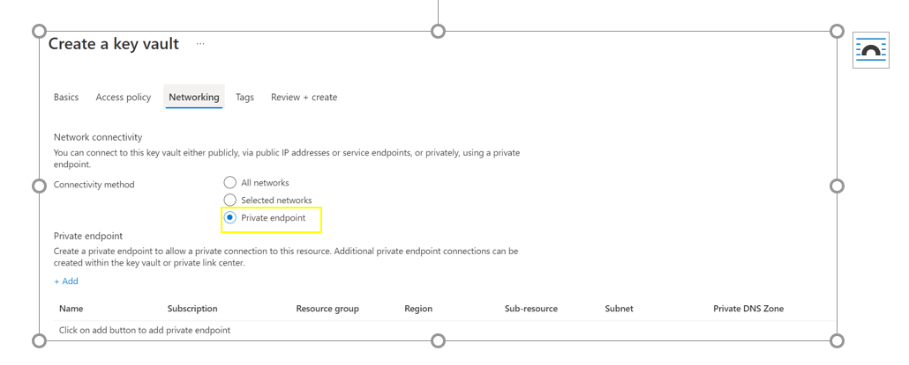 

**_Step 3:_** Click on the “Add” Button to add private endpoint. 
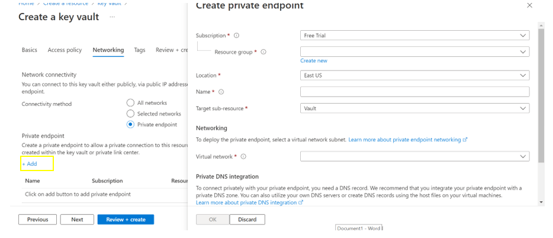 

**_Step 4:_** Select the location in which virtual network is located. 
**_Step 5:_** Give name that will allow you to identify the private Endpoint. 
**_Step 6:_** Select the virtual network and subnet you want this private endpoint to be created in from the dropdown menu. 
**_Step 7:_** Leave the “integrate with private DNS zone” option unchanged and click ok. 
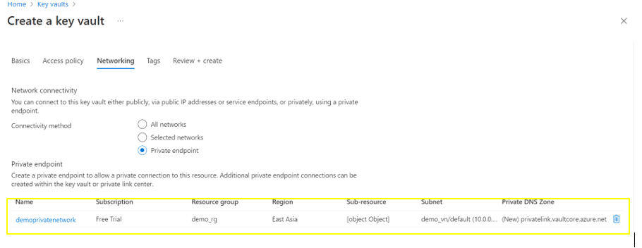 
**_Step 8:_**  select “Review + create” button and create a key vault.   

### 2. Ensure the application accessing Key vault service is running on a platform that supports TLS 1.2 or above 

**Security Control Mapping :**  
| Control Number | Control Statement | Security Domain | Default | Associated Runbook | CVSS Severity  |
| -------------- | ----------------- | --------------- | ------- | ------------------ | -------------- |
|  CS0012168       | Strong encryption key management controls are in place for cloud provider services to protect data at rest | Data Protection  | Not enabled | None | [Medium (5.3)](https://www.first.org/cvss/calculator/3.1#CVSS:3.1/AV:A/AC:H/PR:H/UI:N/S:U/C:H/I:L/A:L) |

**Why?**  

Data in transit between Application and Azure Key vault services can be encrypted based on the nature of the connection. Microsoft uses the Transport Layer Security (TLS) protocol to protect data when it's traveling between the key vault services and applications. TLS 1.2 must be used as the secure encryption in transit for all the key vault connections to improve the security posture of the environment and also to remain in compliance with industry standards or organization requirements

**How?**  

**_Step 1:_** Search policy and navigate to policy page. 
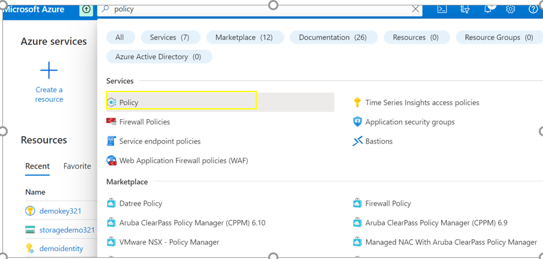 

**_Step 2:_** Select “Definitions” in left side menu in policy page. 
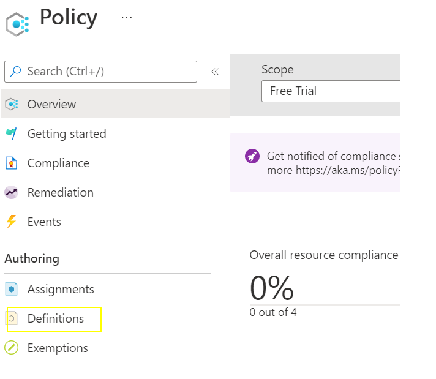 

**_Step 3:_** Search TLS in search tab and select “Latest TLS version should be used in your webApp”. 
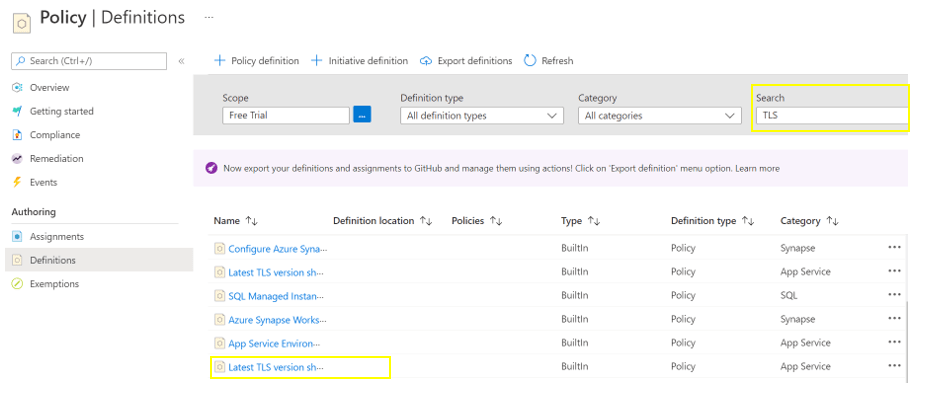 

**_Step 4:_** Click “Assign”. 
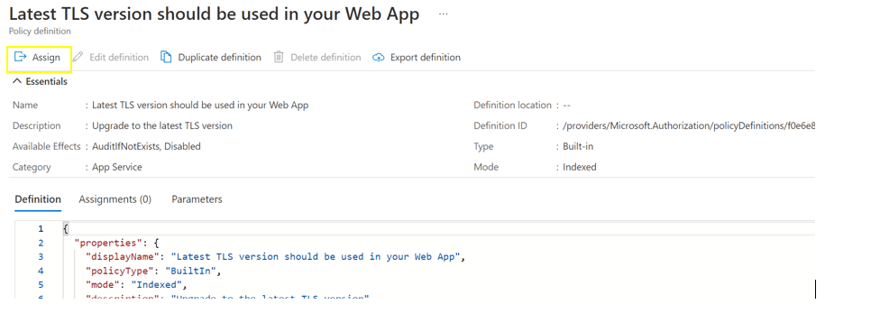 

**_Step 5:_** In assign policy page, click on the three dots in scope field and select the subscription and resource group of the applications accessing keyvaults and click select. 
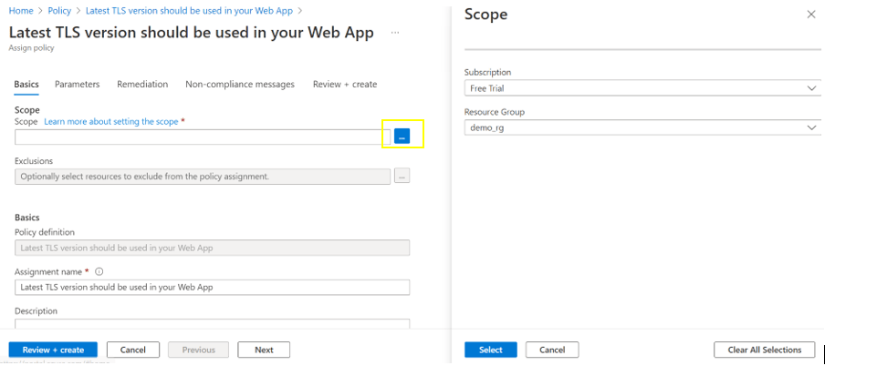 

**_Step 6:_** Click “Review + create” . Policy created successfully to force apps to use latest TLS. 

### 3. Ensure Service tags are enabled for the Azure Key vaults 

**Security Control Mapping :**  
| Control Number | Control Statement | Security Domain | Default | Associated Runbook | CVSS Severity  |
| -------------- | ----------------- | --------------- | ------- | ------------------ | -------------- |
| CS0012261  | Technology hardware and software must be registered and accurately recorded within the enterprise technology repository and/or asset management systems | Asset Management  | Not enabled | organizational Runbook | [Low (1.6)](https://www.first.org/cvss/calculator/3.1#CVSS:3.1/AV:P/AC:H/PR:H/UI:N/S:U/C:N/I:N/A:L) |

**Why?**
  
A service tag represents a group of IP address prefixes from a given Azure service. Azure Virtual Network service tags must be used to define network access controls for Key Vault resources in NSGs or Azure Firewall. Service tags can be used in place of specific IP addresses when creating security rules. Service tag name like "KeyVault" must be used in the appropriate rule source or destination field to allow or deny traffic for the service. Microsoft manages the address prefixes the service tag encompasses, and automatically updates the service tag as addresses change.

**How?**  

**_Step 1:_** Select NSG groups which we already created and click on the “outbound security rules” on the left side pane. 
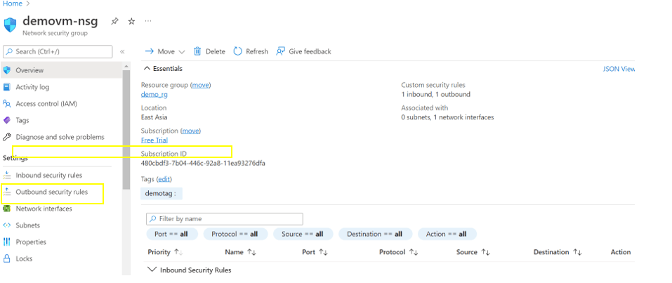 

**_Step  2:_** Click “Add” and give source as “service tag “ and source service tag is “Azure key vault” and click “Add”. 
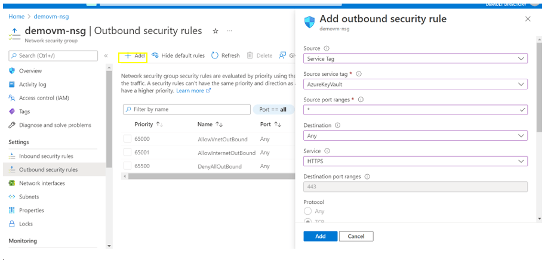 

**_Step 3:_** Click refresh and service tag created for key vault. 
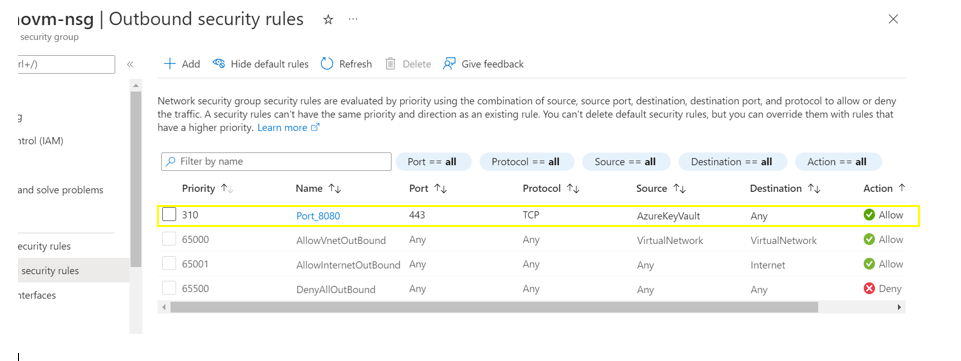 

### 4. Ensure RBAC access control method used  grant access to  Key vault 

[[Place Holder ]
        
**Following are the suggested RBAC roles for Azure Key Vault**  
| Function | Description | Role | 
| -------------- | ----------------- | --------------- | 
|  Key vault admin | Perform all data plane operations on a key vault and all objects in it, including certificates, keys, and secrets. Cannot manage key vault resources or manage role assignments. Only works for key vaults that use the 'Azure role-based access control' permission model. | [Key Vault Administrator](https://github.com/MicrosoftDocs/azure-docs/blob/main/articles/role-based-access-control/built-in-roles.md#key-vault-administrator) |
|  KeyVault operator| Manage key vaults, but does not allow you to assign roles in Azure RBAC, and does not allow you to access secrets, keys, or certificates | [Key Vault Contributor](https://github.com/MicrosoftDocs/azure-docs/blob/main/articles/role-based-access-control/built-in-roles.md#key-vault-contributor) |
|  KeyVault| 	Read metadata of key vaults and its certificates, keys, and secrets. Cannot read sensitive values such as secret contents or key material. Only works for key vaults that use the 'Azure role-based access control' permission model | [[Key Vault Reader](https://github.com/MicrosoftDocs/azure-docs/blob/main/articles/role-based-access-control/built-in-roles.md#key-vault-reader)] |
|  Key vault user | Read secret contents. Only works for key vaults that use the 'Azure role-based access control' permission model | [Key Vault Secrets User](https://github.com/MicrosoftDocs/azure-docs/blob/main/articles/role-based-access-control/built-in-roles.md#key-vault-secrets-user) |

### 5. Ensure administrative tasks are performed only in admin-e workstations 

**Security Control Mapping :**  
| Control Number | Control Statement | Security Domain | Default | Associated Runbook | CVSS Severity  |
| -------------- | ----------------- | --------------- | ------- | ------------------ | -------------- |
|  CS0012298	 | Access to change cloud identity access and service control policies is restricted to authorized cloud administrative personnel |  Identity & Access Management | Not enabled | None | [[Low (3.0)](https://www.first.org/cvss/calculator/3.1#CVSS:3.1/AV:L/AC:H/PR:H/UI:N/S:U/C:L/I:L/A:N)|

**Why?**  

A Privileged workstation provides a hardened workstation that has clear application control and application guard. The workstation uses credential guard, device guard, app guard, and exploit guard to protect the host from malicious behavior. All the administrative tasks must be performed only using the admin-e workstation

**How?**  

**_step 1 :_** Request permission to add the user to corresponding entitlements to access admin e workstation 
**_Step 2 :_** Login to the workstation as the user and launch the azure portal in browser to perform administrative tasks  
[Place holder for link]

### 6. Ensure key vault data plane access is granted only using Managed Identities 

**Security Control Mapping :** 

| Control Number | Control Statement | Security Domain | Default | Associated Runbook | CVSS Severity  |
| -------------- | ----------------- | --------------- | ------- | ------------------ | -------------- |
|  CS0012298       | Access to change cloud identity access and service control policies is restricted to authorized cloud administrative personnel |Identity & Access Management | Not enabled | None | [Low (3.0)](https://www.first.org/cvss/calculator/3.1#CVSS:3.1/AV:L/AC:H/PR:H/UI:N/S:U/C:L/I:L/A:N) |

**Why?**  

Managed identity enables Azure resources to authenticate to cloud services (e.g. Azure Key Vault) without storing credentials in code. Once enabled, all necessary permissions can be granted via Azure role-based-access-control. 
In system assigned managed identity, the lifecycle of this type of managed identity is tied to the lifecycle of this resource. Additionally, each resource (e.g. Virtual Machine) can only have one system assigned managed identity. 
In User assigned managed identity, managed identities are created as standalone Azure resources, and have their own lifecycle. A single resource (e.g. Virtual Machine) can utilize multiple user assigned managed identities. Similarly, a single user assigned managed identity can be shared across multiple resources.

**How?**  

**_Step 1 :_** Search for managed identity and click Create managed identity  

**_Step 2 :_** Select the Resource group and region and provide an identity name 
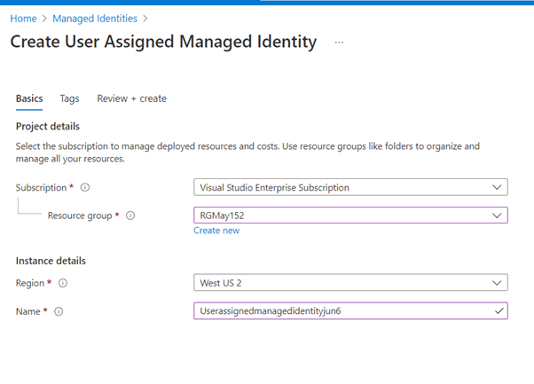 

**_Step 3:_** Go to newly created key vault and select “Access Control(IAM) option on left side menu. 
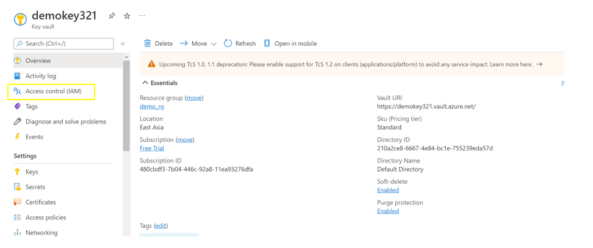 

**_Step 4:_** Select “Add role assignment “. 
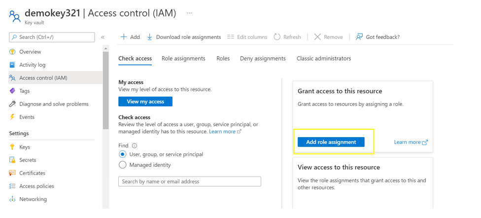 

**_Step 5:_** Select any role in role assignment page and click next. 
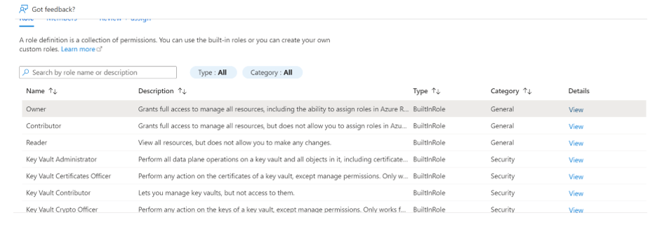 

**_Step 6:_** Select “Managed Identity “option. 
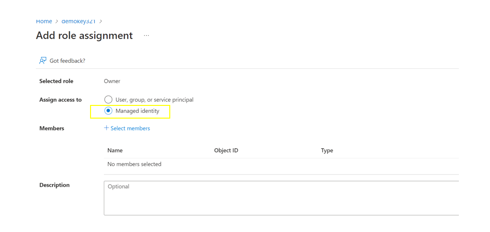 

**_Step 7:_** Click on “Select member” option and give subscription ,managed identity and click “select”. 
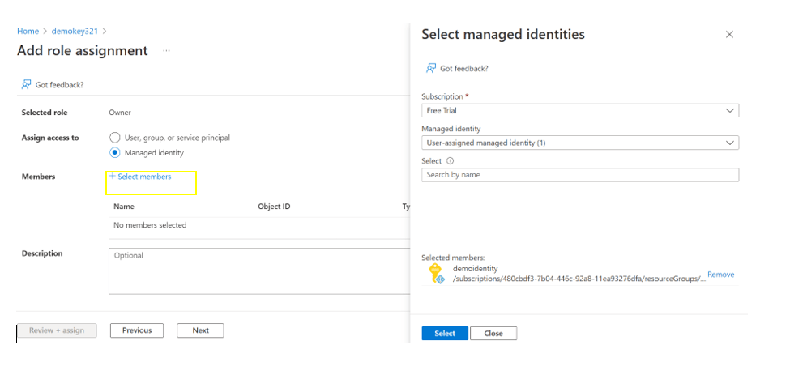 

**_Step 8:_** Click “Review + Assign”. 

### 7. Ensure the keys and Secrets in Key vault has expiration date set and rotated according to Organization policy 

**Security Control Mapping :**   

| Control Number | Control Statement | Security Domain | Default | Associated Runbook | CVSS Severity  |
| -------------- | ----------------- | --------------- | ------- | ------------------ | -------------- |
|  CS0012298	 | Access to change cloud identity access and service control policies is restricted to authorized cloud administrative personnel |  Identity & Access Management | Not enabled | None | [Medium (5.1)](https://www.first.org/cvss/calculator/3.1#CVSS:3.1/AV:A/AC:H/PR:H/UI:N/S:C/C:L/I:L/A:L) |

**Why?**  

Secrets without an expiration date has a security exposure of having an unmonitored credential that could go undetected and potentially be misused by a malicious actor. Secrets must be set an expiration date and must also be rotated after a configured time as per organization password change policy. Rotating the secrets must enforce to update the secrets both in the key vault as well as in the application instance

**How?**  

**_Step 1:_** In Azure portal, Search KeyVault in search tab. Select Name of the keyVault for which you need to create secret. Select `Secrets` from navigation tab.  
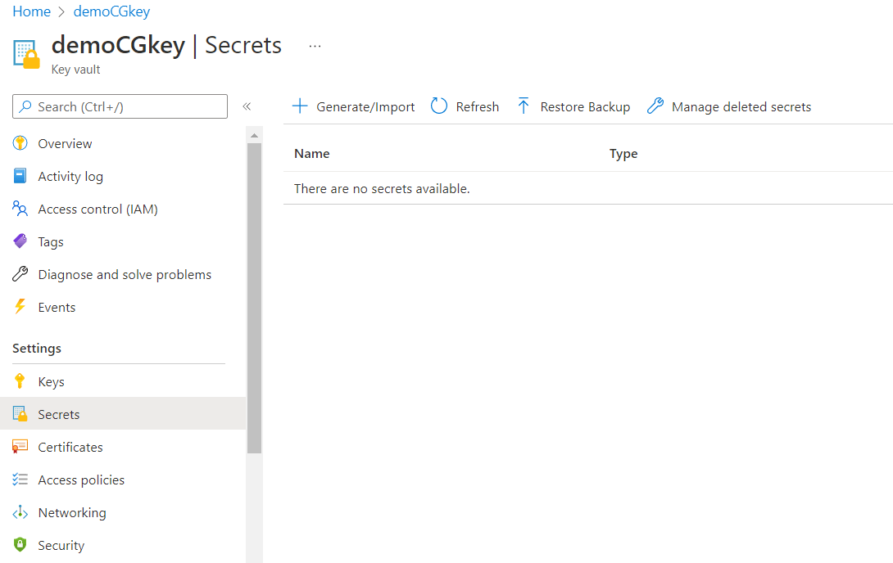 

**_Step 2:_**  Click on `Generate/Import`, select Expiration date based on the organization key rotation policy  
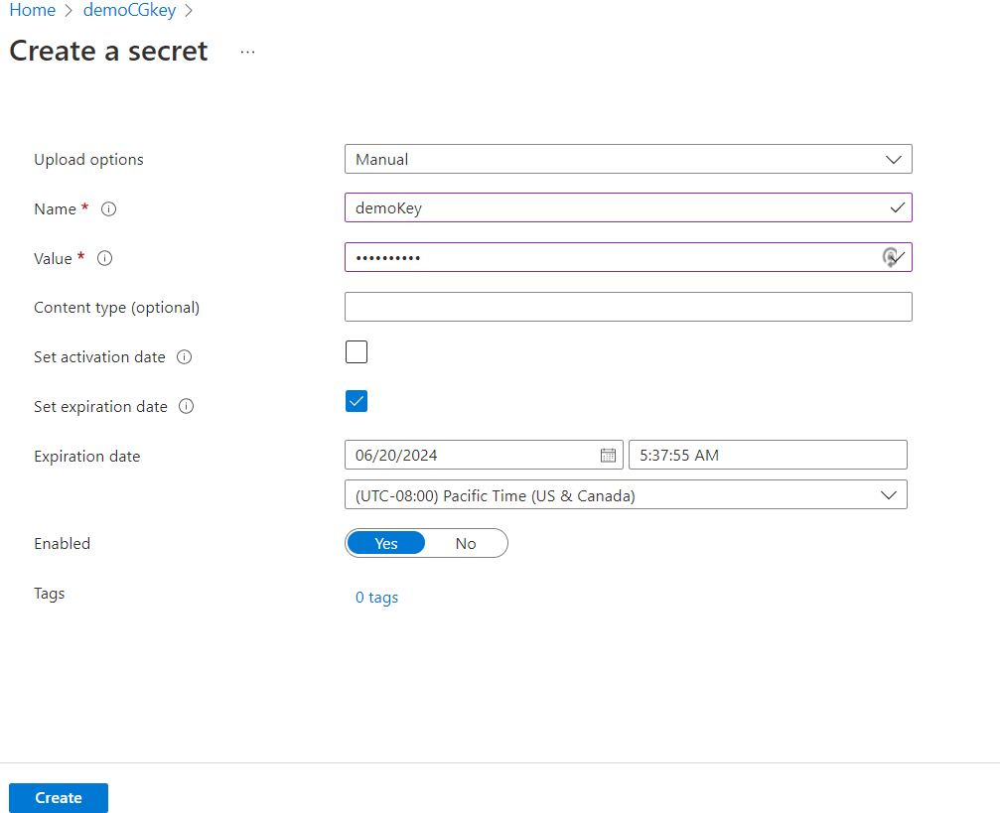 

### 8. Ensure purge protection is enabled and the number of days to retain the vault is configured as per organization policy

**Security Control Mapping :**  

| Control Number | Control Statement | Security Domain | Default | Associated Runbook |CVSS Severity  |
| ----------------- | --------------- |----------- |----------|-----------|-------------- |
|  CS0012168       | Strong encryption key management controls are in place for cloud provider services to protect data at rest | Data Protection  | Not enabled | None | [Low (3.0)](https://www.first.org/cvss/calculator/3.1#CVSS:3.1/AV:L/AC:H/PR:H/UI:N/S:U/C:L/I:L/A:N) |

**Why?**  

Soft delete protection is automatically enabled to recover or permanently delete a key vault and secrets for the duration of the retention period. This protection applies to the key vault and the secrets stored within the key vault. Number of days to retain the secrets must be configured as per organization policy. Also, purge protection must be turned on to enforce a mandatory retention period and prevent the permanent deletion of key vaults or secrets prior to the retention period elapsing, When purge protection is enabled, secrets cannot be purged by users or by Microsoft.

**How?**  

**_Step 1:_** while creating the key vault , In basics tab, select option “Enable purge protection” under purge protection option. Also leave the days to retain deleted vaults option as 90.Click “Review+create”. 
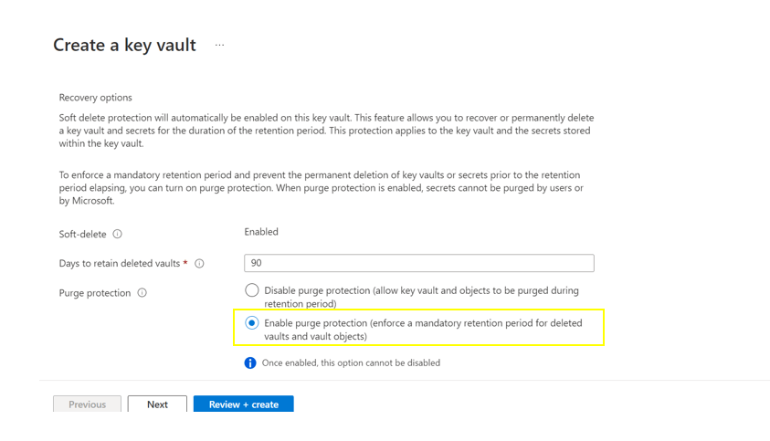 

**_Step 2:_** After validation passed ,key vault is created with purge protection and number of days to retain vault is configured as per organizational policy. 
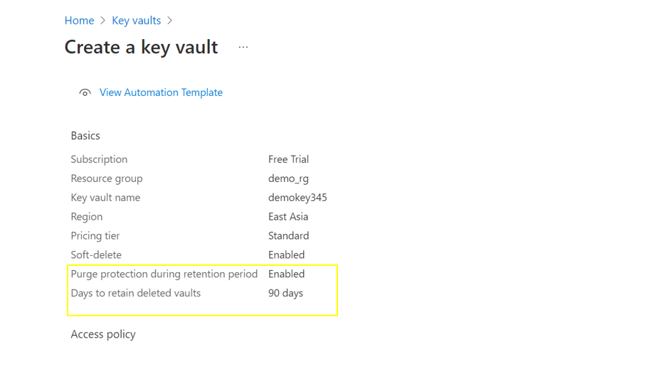 
 

### 9. Ensure Diagnostic logging is enabled for Azure Key vault

**Security Control Mapping :**  
| Control Number | Control Statement | Security Domain | Default | Associated Runbook | CVSS Severity  |
| -------------- | ----------------- | --------------- | ------- | ------------------ | -------------- |
| CS0012233 | Information System must create a log and record activities occurring on or originating from the information system. Logs must be made accessible to the enterprise SIEM solution  | Security Information and event management   | Enabled but not forwarded to Splunk | None | [Low (2.7)](https://www.first.org/cvss/calculator/3.1#CVSS:3.1/AV:P/AC:H/PR:H/UI:N/S:U/C:L/I:N/A:L) |

**Why?**  

Diagnostic settings are used to configure streaming export of platform logs and metrics for a resource to the destination of your choice. You may create up to five different diagnostic settings to send different logs and metrics to independent destinations

**How?**  

**_Step 1:_** Go to newly created Keyvault and select “Diagnostic settings” on the left side menu. Click “Add diagnostic setting”. 
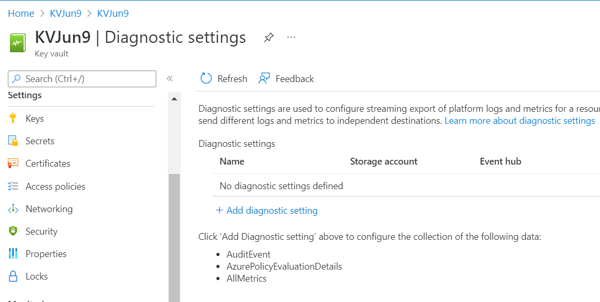 

**_Step 2:_** Select “AuditEvent” and "AzurePolicyEvaluationDetails" in diagnostic setting page and also select “Archive to Storage Account”. Click “save”.  
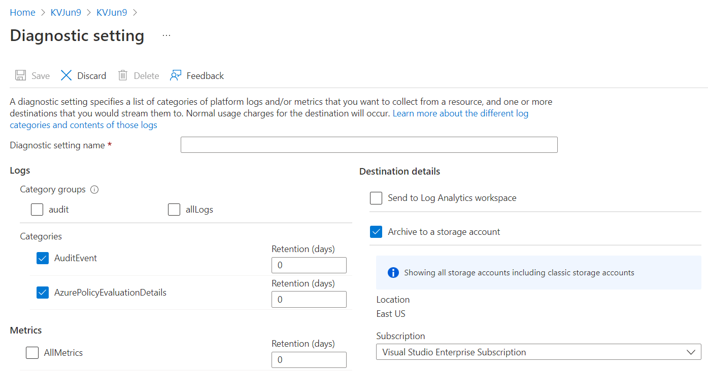 

**_Step 3:_** Connect splunk app for Microsoft services to the Logs storage account and configure the inputs to extract the logs from Azure storage to Splunk  
[Place holder for link]

  

### 10. Ensure Azure Key vault uses standard organizational Resource tagging method

**Security Control Mapping :**  
| Control Number | Control Statement | Security Domain | Default | Associated Runbook | CVSS Severity  |
| -------------- | ----------------- | --------------- | ------- | ------------------ | -------------- |
| CS0012261  | Technology hardware and software must be registered and accurately recorded within the enterprise technology repository and/or asset management systems | Asset Management  | Not enabled | organizational Runbook | [Low (1.6)](https://www.first.org/cvss/calculator/3.1#CVSS:3.1/AV:P/AC:H/PR:H/UI:N/S:U/C:N/I:N/A:L) |

**Why, What and How ?** 
  
Client Rationale and Justification 
[Placeholder link]

### 11. Ensure organizational Anti-malware and vulnerability tools are enabled for Azure Key vault

**Security Control Mapping :**  

| Control Number | Control Statement | Security Domain | Default | Associated Runbook | CVSS Severity  |
| -------------- | ----------------- | --------------- | ------- | ------------------ | -------------- |
|  CS0012268       |Vulnerability Assessments must be performed based on risk and findings must be addressed in accordance with Enterprise SLA's | Vulnerability Management | Not enabled | None | [Medium (5.0)](https://www.first.org/cvss/calculator/3.1#CVSS:3.1/AV:L/AC:H/PR:H/UI:N/S:C/C:L/I:L/A:L) |

**Why?** 

Organization Anti malware and vulnerability tools are the required security intelligence that detects unusual and potentially harmful attempts to access or exploit the Key vaults. It uses advanced threat detection capabilities and Microsoft Threat Intelligence data to provide contextual security alerts. Those alerts also include steps to mitigate the detected threats and prevent future attacks. Microsoft Defender for Keyvault must be enabled at either the subscription level (recommended) or the resource level to analyze ,detect and remediate the threats. 

**How?**  

**_Step 1:_** Go to the key vault and click on “Security “option in left side menu. 
  

**_Step 2:_** Set “Microsoft Defender for Key vault” to “On”. 
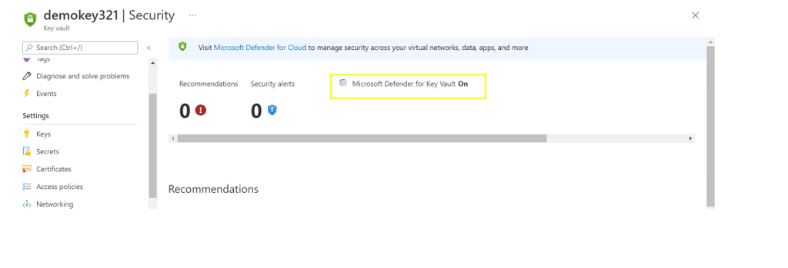  

### 12. Ensure Activity logging is enabled for Azure Key vault

**Security Control Mapping :**  
| Control Number | Control Statement | Security Domain | Default | Associated Runbook | CVSS Severity  |
| -------------- | ----------------- | --------------- | ------- | ------------------ | -------------- |
| CS0012233 | Information System must create a log and record activities occurring on or originating from the information system. Logs must be made accessible to the enterprise SIEM solution  | Security Information and event management   | Enabled but not forwarded to Splunk | None | [Low (2.7)](https://www.first.org/cvss/calculator/3.1#CVSS:3.1/AV:P/AC:H/PR:H/UI:N/S:U/C:L/I:N/A:L) |

**Why, What and How ?** 
  
Client rationale and Justification 
[Placeholder link]

   
