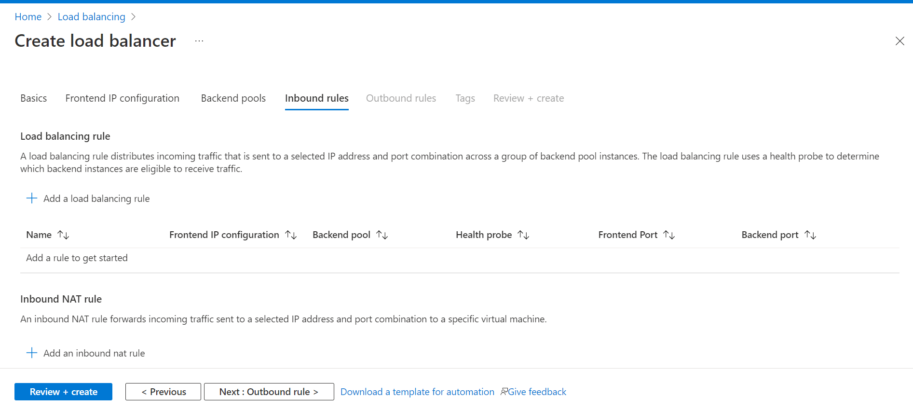
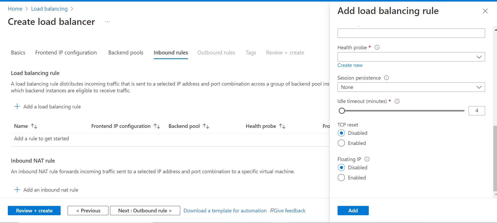
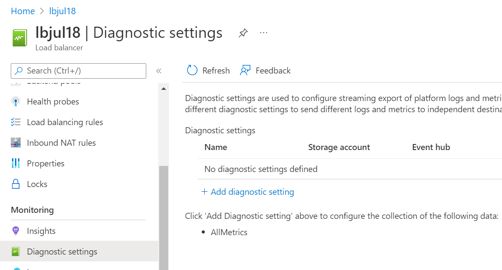
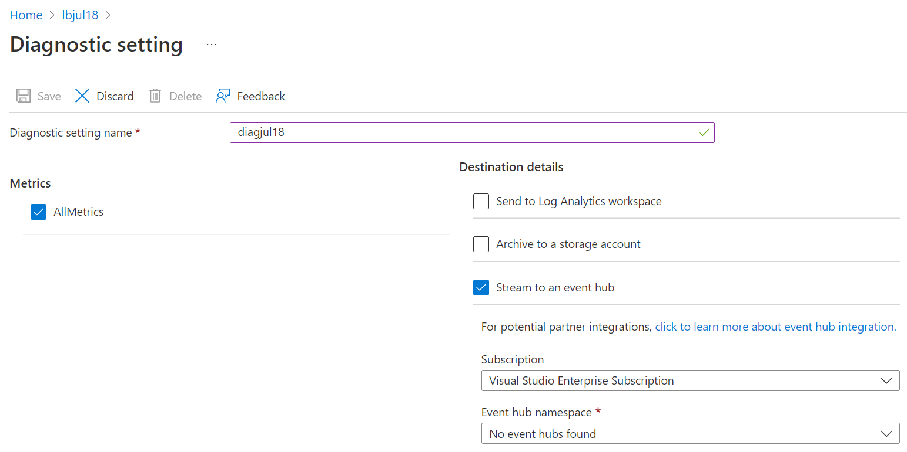
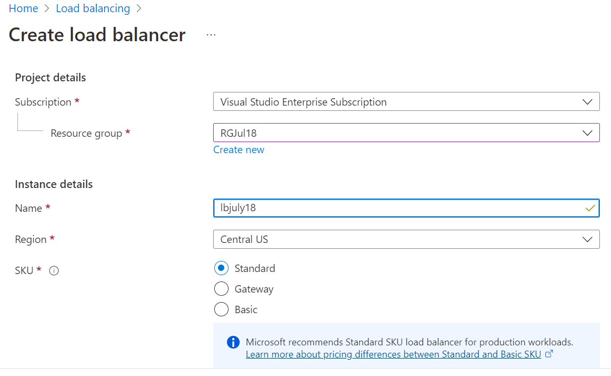
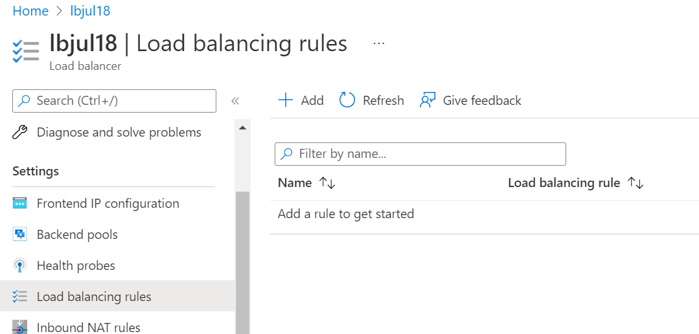
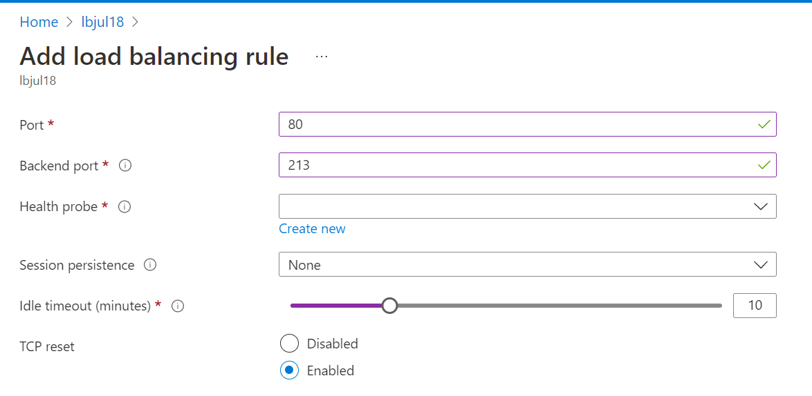

# Azure Load Balancer - Security baseline requirement <!-- omit in toc -->
## Baseline security configuration requirement for Azure services <!-- omit in toc -->

**Generated By: EY Security Team**  
**Service Type: Networking**  
**Deployment Phase: Service Discovery**  
**Last updated: 05/04/2022** 

## Table of Contents <!-- omit in toc -->

- [Overview](#overview)
  - [Use Case Examples:](#use-case-examples)
- [Cloud Security Requirements](#cloud-security-requirements)
  - [1. Ensure to enable Floating Ip for Load Balancer front end](#1-ensure-to-enable-floating-ip-for-load-balancer-front-end)
  - [2. Ensure Azure Load Balancer uses standard organizational Resource tagging method](#2-ensure-azure-load-balancer-uses-standard-organizational-resource-tagging-method)
  - [3. Ensure diagnostic logging is enabled for Azure Load Balancer](#3-ensure-diagnostic-logging-is-enabled-for-azure-load-balancer)
  - [4. Ensure Activity logging is enabled for Azure App service](#4-ensure-activity-logging-is-enabled-for-azure-app-service)
  - [5. Ensure least privilege access is implemented in Load Balancer using Role Based Access control](#5-ensure-least-privilege-access-is-implemented-in-load-balancer-using-role-based-access-control)
  - [6. Ensure Latest Azure Load Balancer SKU is used for deployment to support security requirements](#6-ensure-latest-azure-load-balancer-sku-is-used-for-deployment-to-support-security-requirements)
  - [7. Ensure that TCP reset and idle timeout is configured for Azure Load Balancer](#7-ensure-that-tcp-reset-and-idle-timeout-is-configured-for-azure-load-balancer)

## Overview

Azure Load Balancer operates at layer 4 of the OSI model. It's the single point of contact for clients. Load balancer distributes inbound flows that arrive at the load balancer's front end to backend pool instances. These flows are according to configured load-balancing rules and health probes. The backend pool instances can be Azure Virtual Machines or instances in a virtual machine scale set. With Azure Load Balancer, you can scale your applications and create highly available services.

| Control Number | Cloud Baseline Security Requirements                                                          |
| -------------- | --------------------------------------------------------------------------------------------- |
| 1              | Ensure to enable Floating Ip for Load Balancer front end                                      |
| 2              | Ensure Azure Load Balancer uses standard organizational Resource tagging method               |
| 3              | Ensure diagnostic logging is enabled for Azure Load Balancer                                  |
| 4              | Ensure Activity logging is enabled for Azure App service                                      |
| 5              | Ensure least privilege access is implemented in Load Balancer using Role Based Access control |
| 6              | Ensure Latest Azure Load Balancer SKU is used for deployment to support security requirements |
| 7              | Ensure that TCP reset and idle timeout is configured for Azure Load Balancer                  |

### Use Case Examples:

- Load balance internal and external traffic to Azure virtual machines.
- To scale the applications and create highly available services.

## Cloud Security Requirements

### 1. Ensure to enable Floating Ip for Load Balancer front end

**Security Control Mapping :**

| Control Number | Control Statement | Security Domain | Default | Associated Runbook | CVSS Severity  |
| -------------- | ----------------- | --------------- | ------- | ------------------ | -------------- |
| [CS0012300](place holder) | Cloud products and services must be deployed on Service subnets and public access must be disabled for these services | Network and communication Security | Not Enabled | None | [Medium (5.3)](https://www.first.org/cvss/calculator/3.1#CVSS:3.1/AV:A/AC:H/PR:H/UI:N/S:U/C:H/I:L/A:L) |

**Why?**

When Floating IP is enabled, Azure changes the IP address mapping to the Frontend IP address of the Load Balancer instead of backend instance's IP. Without Floating IP, Azure exposes the VM instances' IP. Hence Floating IP must be enabled to change the IP address mapping to the Frontend IP of the load Balancer to allow for more flexibility.
Some use cases prefer or require the same port to be used by multiple application instances on a single VM in the backend pool. Common examples of port reuse include:
-  clustering for high availability
- network virtual appliances
- exposing multiple TLS endpoints without re-encryption.

**How?** 

**_Step 1:_**: Log in to the Azure portal. Select All Services → ‘Create’. Provide the respective information to complete the creation of load balancer 
 

**_Step 2:_**: Go to 'Inbound rules' in the menu -> Go to 'Add an Inbound rule' -> Enable 'Floating IP' 
 

  

### 2. Ensure Azure Load Balancer uses standard organizational Resource tagging method

**Security Control Mapping :**  
| Control Number | Control Statement | Security Domain | Default | Associated Runbook | CVSS Severity  |
| -------------- | ----------------- | --------------- | ------- | ------------------ | -------------- |
| CS0012261  | Technology hardware and software must be registered and accurately recorded within the enterprise technology repository and/or asset management systems | Asset Management  | Not enabled | organizational Runbook | [Low (1.6)](https://www.first.org/cvss/calculator/3.1#CVSS:3.1/AV:P/AC:H/PR:H/UI:N/S:U/C:N/I:N/A:L) |

**Why, What and How ?** 

Client Rationale and Justification 
[Placeholder link]

### 3. Ensure diagnostic logging is enabled for Azure Load Balancer 

**Security Control Mapping :**  
| Control Number | Control Statement | Security Domain | Default | Associated Runbook | CVSS Severity  |
| -------------- | ----------------- | --------------- | ------- | ------------------ | -------------- |
| CS0012233 | Information System must create a log and record activities occurring on or originating from the information system. Logs must be made accessible to the enterprise SIEM solution  | Security Information and event management  | Not Enabled | None | [Low (2.7)](https://www.first.org/cvss/calculator/3.1#CVSS:3.1/AV:P/AC:H/PR:H/UI:N/S:U/C:L/I:N/A:L) |

**Why?**  
  
The event log contains information about the api objects which include AppServiceHTTPLogs,AppServiceConsoleLogs,AppServiceAppLogs,AppServiceAuditLogs,AppServiceIPSecAuditLogs and AppServicePlatformLogs. These logs when forwarded to Splunk provide necessary information to create notable alerts for any rule created to allow connection from internet  

Note: Currently, Byte count and packet count ior ot supported in Load Balancer Diagnostic logs. https://docs.microsoft.com/en-us/azure/load-balancer/monitor-load-balancer-reference

**How?**  

**_Step 1:_** on Diagnostic Settings page click on 'Add diagnostic setting' .  
 
**_Step 2:_** Select the AllMetrics checkboxes and Select Destination details to be 'Stream to an Eventhub'. 
 

   

### 4. Ensure Activity logging is enabled for Azure App service

**Security Control Mapping :**  
| Control Number | Control Statement | Security Domain | Default | Associated Runbook | CVSS Severity  |
| -------------- | ----------------- | --------------- | ------- | ------------------ | -------------- |
| CS0012233 | Information System must create a log and record activities occurring on or originating from the information system. Logs must be made accessible to the enterprise SIEM solution  | Security Information and event management   | Enabled but not forwarded to Splunk | None | [Low (2.7)](https://www.first.org/cvss/calculator/3.1#CVSS:3.1/AV:P/AC:H/PR:H/UI:N/S:U/C:L/I:N/A:L) |

**Why, What and How ?** 

Client rationale and Justification 
[Placeholder link]

   

### 5. Ensure least privilege access is implemented in Load Balancer using Role Based Access control 

[Place Holder ]
        
**Following are the suggested RBAC roles for Azure Load Balancer**  
| Function | Description | Role | 
| -------------- | ----------------- | --------------- | 
|  Load Balancer Contributor| Gets a load balancer definition and 	Deletes a load balancer . Joins a load balancer backend address pool and inbound NAT pool   | [Domain Services Contributor](https://github.com/MicrosoftDocs/azure-docs/blob/main/articles/role-based-access-control/built-in-roles.md#domain-services-contributor) |
|  Load Balancer User | 	Joins a load balancer backend address pool and inbound NAT pool Read the properties of a network interface. | [DevTest Labs User ](https://docs.microsoft.com/en-us/azure/role-based-access-control/built-in-roles#devtest-labs-user) |

  

### 6. Ensure Latest Azure Load Balancer SKU is used for deployment to support security requirements 

**Security Control Mapping :**  
| Control Number | Control Statement | Security Domain | Default | Associated Runbook | CVSS Severity  |
| -------------- | ----------------- | --------------- | ------- | ------------------ | -------------- |
| [[CS0012133](place holder)] | Information systems are hardened and configured to align with enterprise requirements | Configuration Management | Not enabled | None | [Medium (5.0)](https://www.first.org/cvss/calculator/3.1#CVSS:3.1/AV:L/AC:H/PR:H/UI:N/S:C/C:L/I:L/A:L)|

**Why?**  
  
Creating a Load balancer as Standard Load balancer is more secure by default and are part of the virtual network. Standard load balancers and standard public IP addresses are closed to inbound connections to allow traffic to load balancer unless explicit rules are mentioned in the Virtual network NSG Rules. Without  NSG rules , traffic isn't allowed to reach the standard load balancer. Also standard load balancer supports HTTPS health probes, tcp reset and private link support. Hence Standard Load Balancer must be configured 

**How?**  

**_Step 1:_** When creating a Load balancer , select 'SKU' as 'Standard' 

   

### 7. Ensure that TCP reset and idle timeout is configured for Azure Load Balancer

**Security Control Mapping :**  
| Control Number | Control Statement | Security Domain | Default | Associated Runbook | CVSS Severity  |
| -------------- | ----------------- | --------------- | ------- | ------------------ | -------------- |
| [[CS0012133](place holder)] | Information systems are hardened and configured to align with enterprise requirements | Configuration Management | Not enabled | None | [Medium (5.0)](https://www.first.org/cvss/calculator/3.1#CVSS:3.1/AV:L/AC:H/PR:H/UI:N/S:C/C:L/I:L/A:L)|

**Why?**  
  
Session timeout define action window time for a user thus this window represents, in the same time, the delay in which an attacker can try to steal and use a existing user session like DDOS attack or Malformed URL attack. Hence  an idle timeout and TCP reset must be configured to close or disconnect the session after idle timeout 

**How?**  

**_Step 1:_** In the existing load balancer , Navigate to 'Load balancing rules' under settings . click `Add` 
  

**_Step 2:_** Select the frontend ip , backendpool , ports and backend ports. Select idle timeout in minutes by adjusting the slider and Select 'TCP reset' as 'Enabled'  
  

**_Step 3:_** The configured load balancing rule is listed  
  
   

