# Azure Logic App - Security baseline requirement <!-- omit in toc -->

## Baseline security configuration requirement for Azure services  <!-- omit in toc -->

**Generated By: EY Security Team**  
**Service Type: Integration**  
**Deployment Phase: Service Discovery**  
**Last updated: 06/01/2022** 

## Table of Contents <!-- omit in toc -->

- [Overview](#overview)
  - [Use Case Examples:](#use-case-examples)
- [Cloud Security Requirements](#cloud-security-requirements)
  - [1. Ensure least privilege access is implemented in Logic Apps using Role Based Access control](#1-ensure-least-privilege-access-is-implemented-in-logic-apps-using-role-based-access-control)
  - [2. Ensure Azure Logic App uses standard organizational Resource tagging method](#2-ensure-azure-logic-app-uses-standard-organizational-resource-tagging-method)
  - [3. Ensure Activity logging is enabled for Azure Logic Apps](#3-ensure-activity-logging-is-enabled-for-azure-logic-apps)
  - [4. Ensure diagnostic logging are enabled for Azure Logic Apps](#4-ensure-diagnostic-logging-are-enabled-for-azure-logic-apps)
  - [5. Ensure application level access to Logic Apps is granted using Managed Identities](#5-ensure-application-level-access-to-logic-apps-is-granted-using-managed-identities)
  - [6. Ensure that public access for Logic Apps is disabled by implementing Private endpoints in Virtual networks](#6-ensure-that-public-access-for-logic-apps-is-disabled-by-implementing-private-endpoints-in-virtual-networks)
  - [7. Ensure that Azure Logic apps is integrated with Malware and Vulnerability Scanner tools](#7-ensure-that-azure-logic-apps-is-integrated-with-malware-and-vulnerability-scanner-tools)
  - [8. Ensure Application Insights is enabled for Azure Logic Apps](#8-ensure-application-insights-is-enabled-for-azure-logic-apps)
  - [9. Ensure FTPS and HTTPS are enabled and TLS is set 1.2 to protect the data in transit](#9-ensure-ftps-and-https-are-enabled-and-tls-is-set-12-to-protect-the-data-in-transit)
  - [10. Ensure Cross Origin Resource Sharing (CORS) is enabled](#10-ensure-cross-origin-resource-sharing-cors-is-enabled)
  - [11. Ensure Storage for Logic apps is Encrypted with Customer Managed Keys](#11-ensure-storage-for-logic-apps-is-encrypted-with-customer-managed-keys)
  - [12. Ensure that outbound traffic for Logic Apps is limited  using vnet integration](#12-ensure-that-outbound-traffic-for-logic-apps-is-limited--using-vnet-integration)
  - [13. Ensure Logic Apps are accessed using OAuth 2.0 token](#13-ensure-logic-apps-are-accessed-using-oauth-20-token)
  - [14. Ensure Activity logging is enabled for Azure Logic Apps](#14-ensure-activity-logging-is-enabled-for-azure-logic-apps)
  - [15. Ensure inputs and outputs are secured in Azure Logic App designer](#15-ensure-inputs-and-outputs-are-secured-in-azure-logic-app-designer)

##  Overview 

Azure Logic Apps is a cloud-based platform for creating and running automated workflows that integrate your apps, data, services, and systems. With this platform, you can quickly develop highly scalable integration solutions for your enterprise and business-to-business (B2B) scenarios. As a member of Azure Integration Services, Azure Logic Apps simplifies the way that you connect legacy, modern, and cutting-edge systems across cloud, on premises, and hybrid environments.

| Control Number | Cloud Baseline Security Requirements                                                                       |
| -------------- | ---------------------------------------------------------------------------------------------------------- |
| 1              | Ensure least privilege access is implemented in Logic Apps using Role Based Access control                 |
| 2              | Ensure Azure Logic App uses standard organizational Resource tagging method                                |
| 3              | Ensure Activity logging is enabled for Azure Logic Apps                                                    |
| 4              | Ensure diagnostic logging are enabled for Azure Logic Apps                                                 |
| 5              | Ensure application level access to Logic Apps is granted using Managed Identities                          |
| 6              | Ensure that public access for Logic Apps is disabled by implementing Private endpoints in Virtual networks |
| 7              | Ensure that Azure Logic apps is integrated with Malware and Vulnerability Scanner tools                    |
| 8              | Ensure Application Insights is enabled for Azure Logic Apps                                                |
| 9              | Ensure FTPS and HTTPS are enabled and TLS is set 1.2 to protect the data in transit                        |
| 10             | Ensure Cross Origin Resource Sharing (CORS) is enabled                                                     |
| 11             | Ensure Storage for Logic apps is Encrypted with Customer Managed Keys                                      |
| 12             | Ensure that outbound traffic for Logic Apps is limited using vnet integration                              |
| 13             | Ensure Logic Apps are accessed using OAuth 2.0 token                                                       |
| 14             | Ensure Activity logging is enabled for Azure Logic Apps                                                    |
| 15             | Ensure inputs and outputs are secured in Azure Logic App designer                                          |

### Use Case Examples:
- Schedule and run recurring automated tasks, processes, and workflows with Azure Logic Apps
- Create automated, schedule-based recurring workflows by using Azure Logic Apps
- When an email is received trigger lets your logic app check for new email from any mail provider that's supported by Logic Apps, for example, Office 365 Outlook, Gmail, Outlook.com, and so on.

## Cloud Security Requirements ##

### 1. Ensure least privilege access is implemented in Logic Apps using Role Based Access control 

[[Place Holder ]
        
**Following are the suggested RBAC roles for Azure Event Hubs**  
| Function | Description | Role | 
| -------------- | ----------------- | --------------- | 
| Logic Apps Contributor | Lets you manage logic apps, but not change access to them.| [Logic App Contributor](https://github.com/MicrosoftDocs/azure-docs/blob/main/articles/role-based-access-control/built-in-roles.md#logic-app-contributor) |
| Logic Apps Operator| Lets you read, enable, and disable logic apps, but not edit or update them. | [Logic App Operator](https://github.com/MicrosoftDocs/azure-docs/blob/main/articles/role-based-access-control/built-in-roles.md#logic-app-operator) |

  

### 2. Ensure Azure Logic App uses standard organizational Resource tagging method

**Security Control Mapping :**  
| Control Number | Control Statement | Security Domain | Default | Associated Runbook | CVSS Severity  |
| -------------- | ----------------- | --------------- | ------- | ------------------ | -------------- |
| CS0012261  | Technology hardware and software must be registered and accurately recorded within the enterprise technology repository and/or asset management systems | Asset Management  | Not enabled | organizational Runbook | [Low (1.6)](https://www.first.org/cvss/calculator/3.1#CVSS:3.1/AV:P/AC:H/PR:H/UI:N/S:U/C:N/I:N/A:L) |

**Why, What and How ?** 

Client Rationale and Justification 
[Placeholder link]

### 3. Ensure Activity logging is enabled for Azure Logic Apps

**Security Control Mapping :**  
| Control Number | Control Statement | Security Domain | Default | Associated Runbook | CVSS Severity  |
| -------------- | ----------------- | --------------- | ------- | ------------------ | -------------- |
| CS0012233 | Information System must create a log and record activities occurring on or originating from the information system. Logs must be made accessible to the enterprise SIEM solution  | Security Information and event management   | Enabled but not forwarded to Splunk | None | [Low (2.7)](https://www.first.org/cvss/calculator/3.1#CVSS:3.1/AV:P/AC:H/PR:H/UI:N/S:U/C:L/I:N/A:L) |

**Why, What and How ?** 

Client rationale and Justification 
[Placeholder link]

   

### 4. Ensure diagnostic logging are enabled for Azure Logic Apps 

**Security Control Mapping :**  
| Control Number | Control Statement | Security Domain | Default | Associated Runbook | CVSS Severity  |
| -------------- | ----------------- | --------------- | ------- | ------------------ | -------------- |
| CS0012233 | Information System must create a log and record activities occurring on or originating from the information system. Logs must be made accessible to the enterprise SIEM solution  | Security Information and event management  | Not Enabled | None | [Low (2.7)](https://www.first.org/cvss/calculator/3.1#CVSS:3.1/AV:P/AC:H/PR:H/UI:N/S:U/C:L/I:N/A:L) |

**Why?**  
  
The event log contains information about the api objects which include FunctionAppLogs and AllMetrics. These logs when forwarded to Splunk provide necessary information to create notable alerts for any rule created to allow connection from internet  

**How?**  

**_Step 1:_** on Diagnostic Settings page click on 'Add diagnostic setting' . 
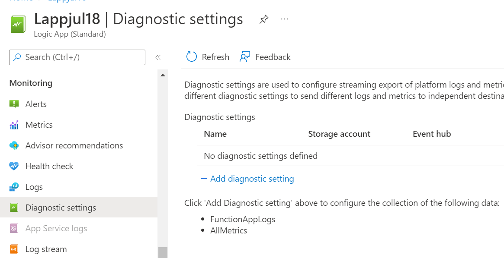
**_Step 2:_** Select the FunctionAppLogs and AllMetrics checkboxes and Select Destination details to be 'Stream to an Eventhub'.
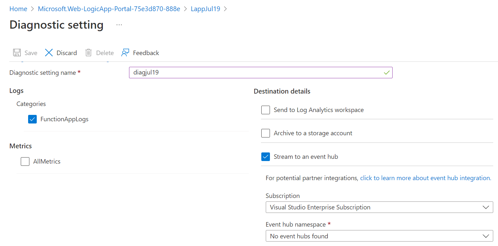

   

### 5. Ensure application level access to Logic Apps is granted using Managed Identities

**Security Control Mapping :**  

| Control Number | Control Statement | Security Domain | Default | Associated Runbook | CVSS Severity  |
| -------------- | ----------------- | --------------- | ------- | ------------------ | -------------- |
|  [CS0012298](place holder)       | Access to change cloud identity access and service control policies is restricted to authorized cloud administrative personnel |Identity & Access Management | Not enabled | None | [Medium (5.1)](https://www.first.org/cvss/calculator/3.1#CVSS:3.1/AV:A/AC:H/PR:H/UI:N/S:C/C:L/I:L/A:L) |

**Why?**  

Managed identity enables Azure resources to authenticate to cloud services (e.g. Azure Key Vault) without storing credentials in code. Once enabled, all necessary permissions can be granted via Azure role-based-access-control. 
In system assigned managed identity, the lifecycle of this type of managed identity is tied to the lifecycle of this resource. Additionally, each resource (e.g. Virtual Machine) can only have one system assigned managed identity. 
In User assigned managed identity, managed identities are created as standalone Azure resources, and have their own lifecycle. A single resource (e.g. Virtual Machine) can utilize multiple user assigned managed identities. A single user assigned managed identity can be shared across multiple resources.

**How?** 

**_Step 1:_** Navigate to existing Logic apps and click on Identity under settings 
**_Step 2:_** Goto System assigned and change the status to 'On' and click on Save  
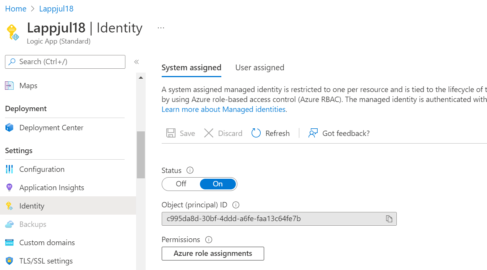 
**_Step 3:_** Click 'yes' in the confirmation popup  
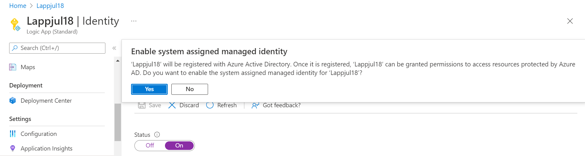 

  

### 6. Ensure that public access for Logic Apps is disabled by implementing Private endpoints in Virtual networks

**Security Control Mapping :**  
| Control Number | Control Statement | Security Domain | Default | Associated Runbook | CVSS Severity  |
| -------------- | ----------------- | --------------- | ------- | ------------------ | -------------- |
| [CS0012300](place holder) | Cloud products and services must be deployed on private subnets and public access must be disabled for these services | Network and communication Security | Not enabled |Private Endpoint Runbook | [High (7.2)](https://www.first.org/cvss/calculator/3.1#CVSS:3.1/AV:N/AC:H/PR:H/UI:N/S:C/C:H/I:L/A:L) |

**What & Why?**   

By default, your app is open to the internet and cannot reach into a virtual network. Private endpoint must be used to provide an endpoint with Private IP which can be associated with virtual network with in tenant, other tenant or from On premise.  A FQDN record will be created in Azure DNS to enable other tenants VNets to be associated with Azure Key vault.  This ensures that all workload data is being accessed securely over Azure network backbone and Azure Logic apps is not exposed to internet. 

**How?** 

**_Step 1:_** In the web app overview, select Settings and then select Networking.In Networking, select Private endpoints. Select + Add in the Private Endpoint connections page. 
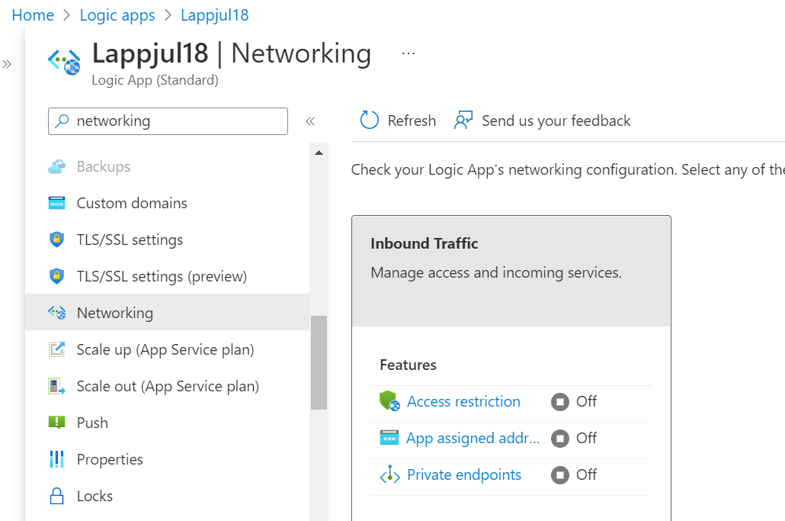  
**_Step 2:_** Select the private dns option as yes in the Add Private Endpoint page and select ok. 
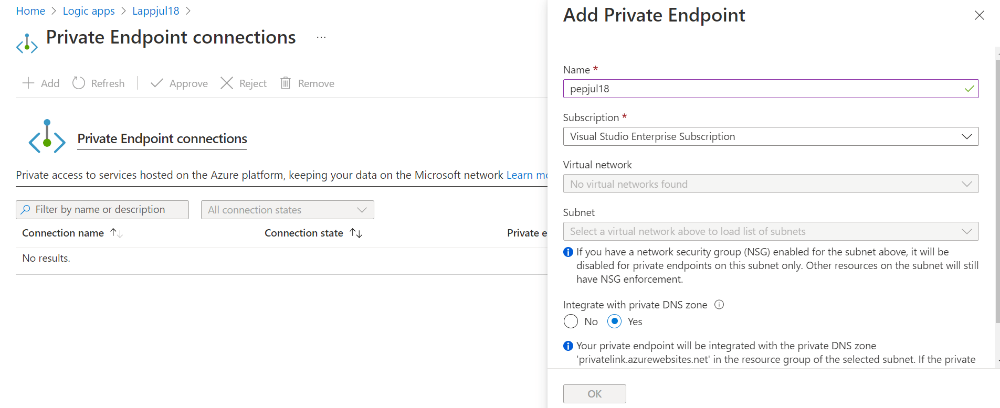 

### 7. Ensure that Azure Logic apps is integrated with Malware and Vulnerability Scanner tools

**Security Control Mapping :** 

| Control Number | Control Statement | Security Domain | Default | Associated Runbook | CVSS Severity  |
| -------------- | ----------------- | --------------- | ------- | ------------------ | -------------- |
|  CS0012268     | Vulnerability Assessments must be performed based on risk and findings must be addressed in accordance with Enterprise SLA's | Vulnerability Management | Not enabled | None | [Medium (5.0)](https://www.first.org/cvss/calculator/3.1#CVSS:3.1/AV:L/AC:H/PR:H/UI:N/S:C/C:L/I:L/A:L) |

**Why?** 

Organization Anti malware and vulnerability tools are the required security intelligence that detects unusual and potentially harmful attempts to access or exploit apps. It uses advanced threat detection capabilities and Microsoft Threat Intelligence data to provide contextual security alerts. Those alerts also include steps to mitigate the detected threats and prevent future attacks. Microsoft Defender for Container must be enabled at either the subscription level (recommended) or the resource level to analyze ,detect and remediate the threats.  

**Note:** Security for Logic app is managed under Microsoft Defender for App Services

**How?**  

**_Step 1:_**  Navigate to 'Defender for cloud' , In the side menu bar select 'Environment settings' and click on the subscription under azure.  
 
**_Step 2:_** In the side menu bar select 'settings', navigate to 'Defender plans' and change the settings to 'on' for the 'App service'. 
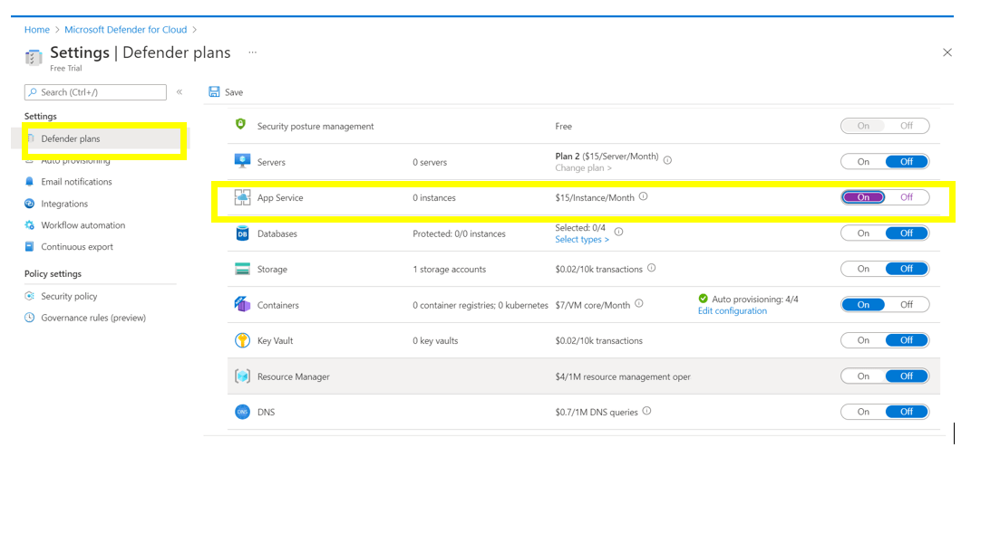 
**_Step 3:_** Click on the 'Save' button to update the settings.  
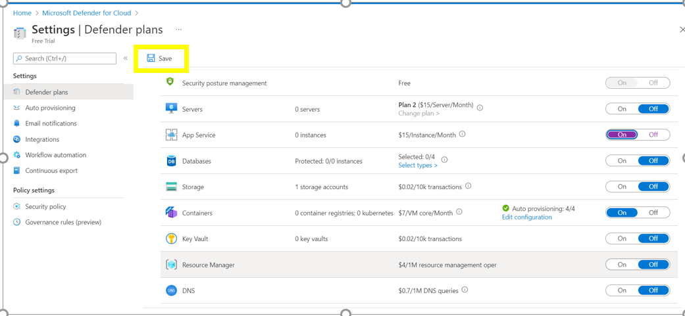  

### 8. Ensure Application Insights is enabled for Azure Logic Apps

**Security Control Mapping :**  
| Control Number | Control Statement | Security Domain | Default | Associated Runbook | CVSS Severity  |
| -------------- | ----------------- | --------------- | ------- | ------------------ | -------------- |
| CS0012233 | Information System must create a log and record activities occurring on or originating from the information system. Logs must be made accessible to the enterprise SIEM solution  | Security Information and event management  | Not Enabled | None | [Low (2.7)](https://www.first.org/cvss/calculator/3.1#CVSS:3.1/AV:P/AC:H/PR:H/UI:N/S:U/C:L/I:N/A:L) |

**Why?**  
  
Application Insights is used to find out easily  the most useful features, the most common issues, and to work out why a feature does or doesn’t work.It also provides the ability to systematically assess each feature of the app, incorporating analytics into development cycle. Having a complete 360° views of your applications’ availability, performance and usage, which can enable fast & powerful insights, helps to plan new improvements and prioritize the backlog  

**How?**  

**_Step 1:_** When creating the 'Logic apps', Navigate to the Monitoring tab and select the 'Enable Application Insights' as 'on' and Select the 'Application Insights' and 'Region'
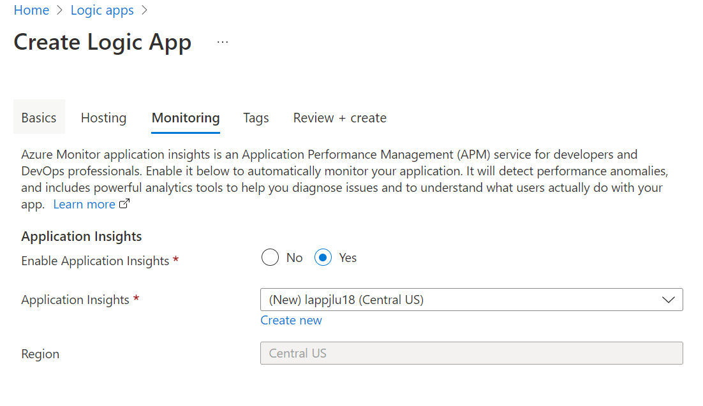
   

### 9. Ensure FTPS and HTTPS are enabled and TLS is set 1.2 to protect the data in transit

**Security Control Mapping :**   
| Control Number | Control Statement | Security Domain | Default | Associated Runbook | CVSS Severity  |
| -------------- | ----------------- | --------------- | ------- | ------------------ | -------------- |
| CS0012261 | Cloud based data in transit must be encrypted with enterprise approved algorithm | Data Protection | not Enabled | None | [Medium (5.3)](https://www.first.org/cvss/calculator/3.1#CVSS:3.1/AV:A/AC:H/PR:H/UI:N/S:U/C:H/I:L/A:L) |

**Why?**  

To secure the Logic apps against all unencrypted (HTTP) connections, Logic App  must enforce only HTTPS communication so that Unsecured requests are turned away before it reaches the application code. 
TLS 1.0 is no longer considered secure by industry standards, such as PCI DSS. Logic App must disable outdated protocols by selecting TLS 1.2.
Similarly FTPS should be used instead of FTP because FTP relies on clear-text usernames and passwords for authentication and does not use encryption. 

**How?** 

**_Step 1:_** Go to the Logic apps and  select Configuration then General settings from the left navigation. 
**_Step 2:_** To enable FTPS only, select FTPS Only in FTP state and click on `Save` button. If using FTPS Only, then must enforce TLS 1.2 or higher by navigating to the TLS/SSL settings blade in the web app. TLS 1.0 and 1.1 are not supported with FTPS Only. 
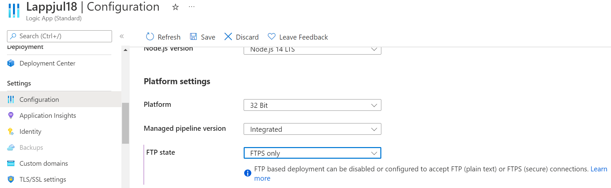
**_Step 3:_** For HTTPS, go to the Logic APps -> TLS/SSL settings and click 'HTTPS Only' as ON and set the minimum tls version to 1.2  
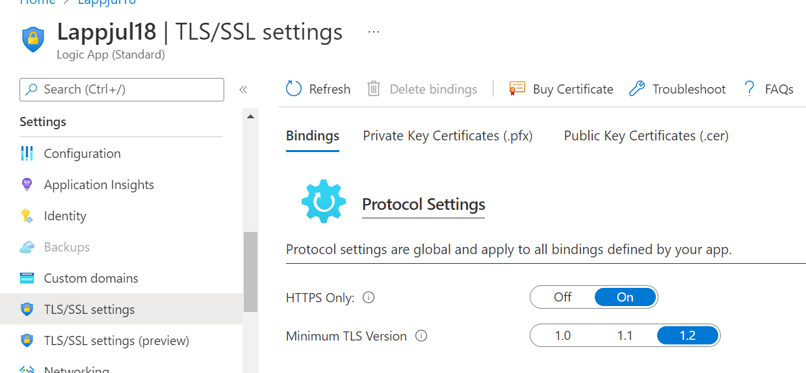
  

### 10. Ensure Cross Origin Resource Sharing (CORS) is enabled

**Security Control Mapping :**   
| Control Number | Control Statement | Security Domain | Default | Associated Runbook | CVSS Severity  |
| -------------- | ----------------- | --------------- | ------- | ------------------ | -------------- |
|  CS0012298	 | Access to change cloud identity access and service control policies is restricted to authorized cloud administrative personnel |  Identity & Access Management | Not enabled | None | [Medium (5.1)](https://www.first.org/cvss/calculator/3.1#CVSS:3.1/AV:A/AC:H/PR:H/UI:N/S:C/C:L/I:L/A:L) |

**Why?**  
Cross-Origin Resource Sharing (CORS) is used to allows the JavaScript code running in a browser on an external host to interact with the app service backend. The origins that should be allowed must be specified to make the cross-origin calls (for example: http://example.com:12345). 'Enable Access-Control-Allow-Credentials' is enabled to validate the cookies or authentication tokens as mentioned in the ACCESS-CONTROL-ALLOW-CREDENTIALS header on the message response

**Reference**
https://developer.mozilla.org/en-US/docs/Web/HTTP/Headers/Access-Control-Allow-Credentials

**How?** 

**_Step 1:_** Go to Azure portal and open the Logic Apps. 

**_Step 2:_** In the navigation pane select CORS under API. 

**_Step 3:_** Check the 'Enable Access-Control-Allow-Credential' option and fill the allowed origins and select save. 
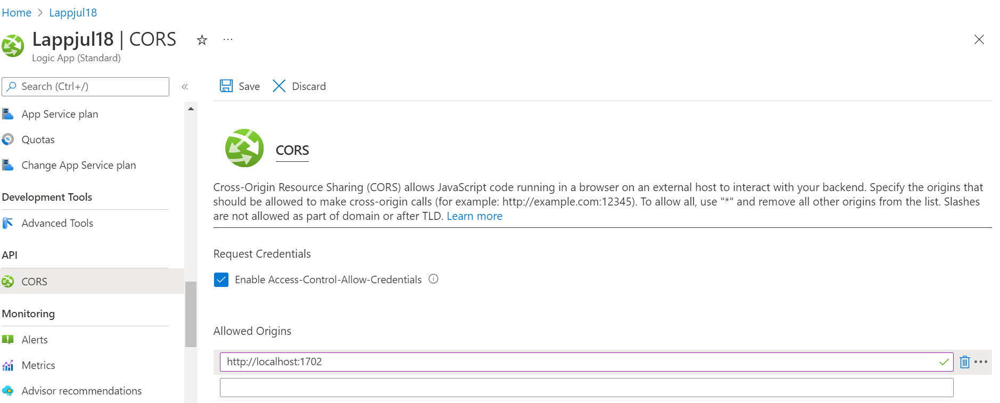  
**Note** Do not use * in `Allowed origins`

  

### 11. Ensure Storage for Logic apps is Encrypted with Customer Managed Keys

**Security Control Mapping :** 

| Control Number | Control Statement | Security Domain | Default | Associated Runbook | CVSS Severity  |
| -------------- | ----------------- | --------------- | ------- | ------------------ | -------------- |
|  CS0012168       | Strong encryption key management controls are in place for cloud provider services to protect data at rest | Data Protection  | Enabled | None | [Medium (5.3)](https://www.first.org/cvss/calculator/3.1#CVSS:3.1/AV:A/AC:H/PR:H/UI:N/S:U/C:H/I:L/A:L) |

**Why?**

By default, data in the logic apps are stored in a storage account in the backened and is encrypted using Microsoft Managed Keys at rest. All Azure Storage resources are encrypted, including blobs, disks, files, queues, and tables. 
All object metadata is also encrypted. However, if you want to control and manage this encryption key yourself, you can specify a customer-managed key, that key is used to protect and control access to the key that encrypts your data. 

**How?** 

**_Step 1:_** Go to Azure portal and create a key vault in the same region as logic apps  
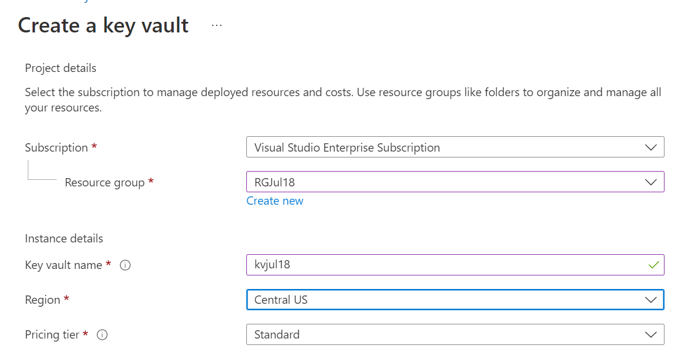  

**_Step 2:_** Create a key in the newly created keyvault  
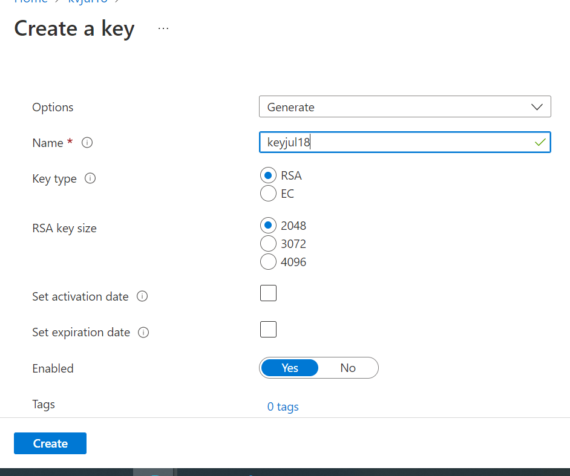  

**_Step 3:_**  Open the specific storage account which is created. In the left side bar menu., select Encryption. In the Encryption page., Select the Encryption type as Customer-managed keys.  
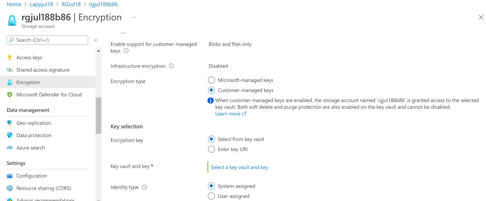  

**_Step 4:_** Select the Key and key vault and click on Save.  
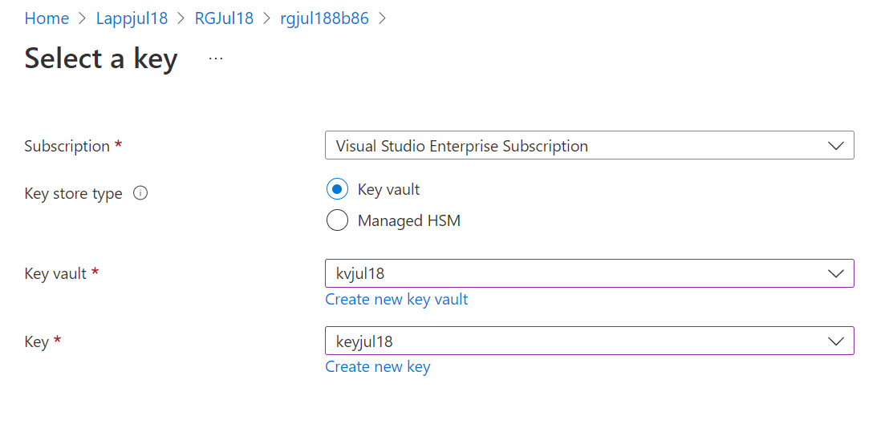  

### 12. Ensure that outbound traffic for Logic Apps is limited  using vnet integration

**Security Control Mapping :**  
| Control Number | Control Statement | Security Domain | Default | Associated Runbook | CVSS Severity  |
| -------------- | ----------------- | --------------- | ------- | ------------------ | -------------- |
| [CS0012300](place holder) | Cloud products and services must be deployed on private subnets and public access must be disabled for these services | Network and communication Security | Not enabled |Private Endpoint Runbook | [High (7.2)](https://www.first.org/cvss/calculator/3.1#CVSS:3.1/AV:N/AC:H/PR:H/UI:N/S:C/C:H/I:L/A:L) |

**What & Why?**   

When the logic app is connected with the backend storage options like database or Blob storage , Outbound traffic from the logic app can be secured by integrating the logic app with a virtual network. On enabling the VNet integration option ,  care must be taken to make sure no firewall or network security policy is blocking these connections.

**How?** 

**_Step 1:_**  In the side menu bar of the 'Logic Apps' window , Navigate to 'Networking' under 'Settings' ,and under outbound traffic, select VNet integration. 
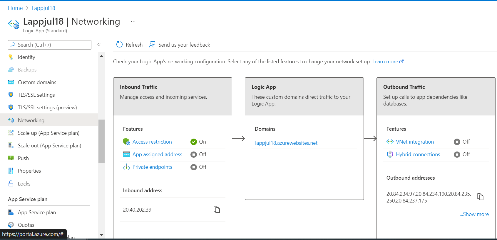 

**_Step 2:_** On the Vnet integration page, Click `Add Vnet` and select the existing Vnet and subnet. 
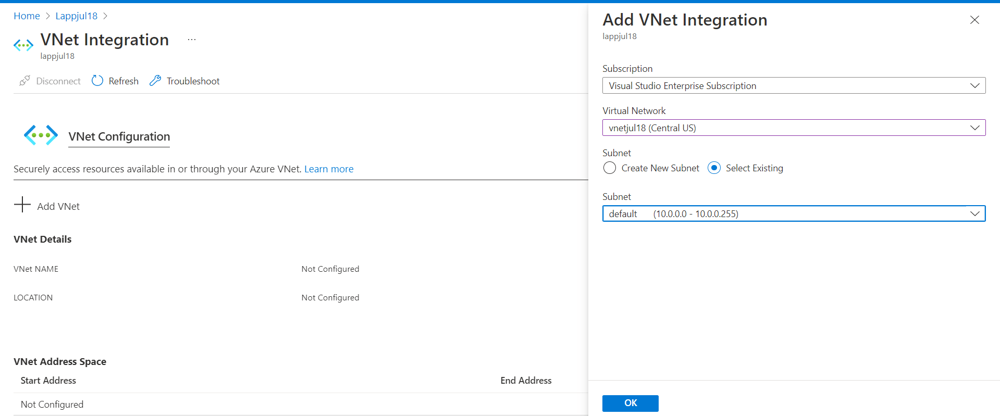 

**_Step 3:_** Once details are updated, Click the `ok` and the list of routes are displayed 
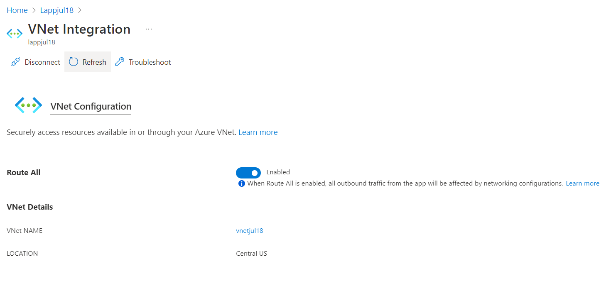 

**Note :** Refer the below link for more information :  
 https://docs.microsoft.com/en-us/azure/logic-apps/secure-single-tenant-workflow-virtual-network-private-endpoint#set-up-vnet-integration

### 13. Ensure Logic Apps are accessed using OAuth 2.0 token

**Security Control Mapping :**  
| Control Number | Control Statement | Security Domain | Default | Associated Runbook | CVSS Severity  |
| -------------- | ----------------- | --------------- | ------- | ------------------ | -------------- |
|  CS0012298	 | Access to change cloud identity access and service control policies is restricted to authorized cloud administrative personnel |  Identity & Access Management | Not enabled | None | [Medium (5.1)](https://www.first.org/cvss/calculator/3.1#CVSS:3.1/AV:A/AC:H/PR:H/UI:N/S:C/C:L/I:L/A:L) |

**What & Why?**  

In the client credentials flow, permissions are granted directly to the application itself by an administrator. When the app presents a token to a resource, the resource enforces that the app itself has authorization to perform an action since there is no user involved in the authentication. Configuring OAuth 2.0 for the APIs hosted in Azure API Management adds an extra layer of security by generating and consuming a time bound token and prevents unauthorized access   

**How?**  

**_Step 1:_** Create an Azure API management and add Logic App as the backend API . 
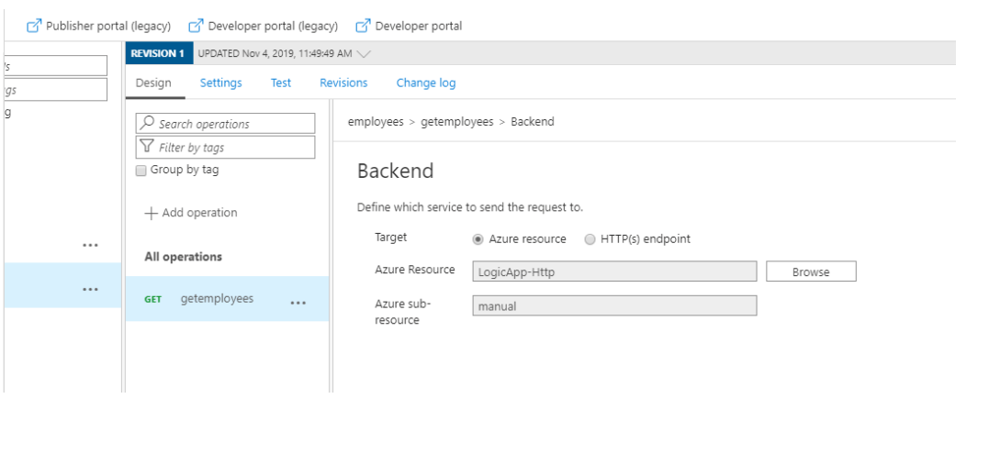 
**_Step 2:_** Create a Login API and add token as operation. 
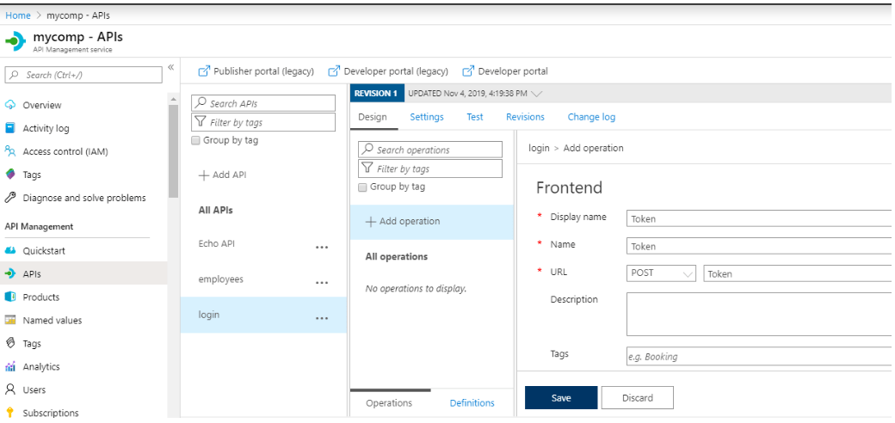 
**_Step 3:_** Navigate to  Azure Active Directory -> App Registration -> New registration and Register an application for Logic App API Client and Logic App . 
  
**_Step 4:_** In the Logic app , add the role of logic app api client 
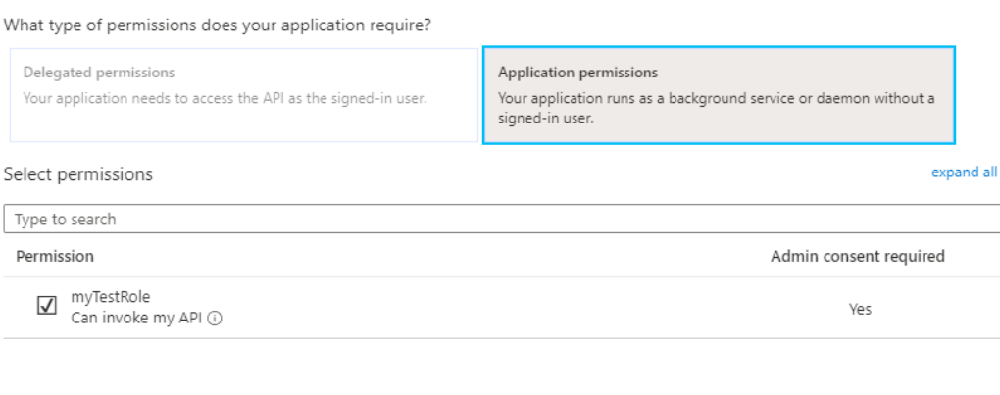 
**_Step 5:_** Configure a JWT validation policy to pre-authorize requests 

    <validate-jwt header-name="Authorization" failed-validation-httpcode="401" failed-validation-error-message="Unauthorized. Access token is missing or invalid.">
        <openid-config url="https://login.microsoftonline.com/{aad-tenant}/v2.0/.well-known/openid-configuration"/>
        <required-claims>
            <claim name="aud">
                <value>{client-id}</value>
            </claim>
        </required-claims>
    </validate-jwt>

**Note :** authorization header must be removed while calling the Azure Logic App

**Note :** Refer the link for more information :   https://medium.com/azurediary/secure-logic-app-with-api-management-using-oauth-2-0-ce7d0ccf23d6 and https://docs.microsoft.com/en-us/azure/active-directory/develop/v2-oauth2-client-creds-grant-flow#get-a-token

  

### 14. Ensure Activity logging is enabled for Azure Logic Apps

**Security Control Mapping :**  
| Control Number | Control Statement | Security Domain | Default | Associated Runbook | CVSS Severity  |
| -------------- | ----------------- | --------------- | ------- | ------------------ | -------------- |
| CS0012233 | Information System must create a log and record activities occurring on or originating from the information system. Logs must be made accessible to the enterprise SIEM solution  | Security Information and event management   | Enabled but not forwarded to Splunk | None | [Low (2.7)](https://www.first.org/cvss/calculator/3.1#CVSS:3.1/AV:P/AC:H/PR:H/UI:N/S:U/C:L/I:N/A:L) |

**Why, What and How ?** 

Client rationale and Justification 
[Placeholder link]

   

### 15. Ensure inputs and outputs are secured in Azure Logic App designer

**Security Control Mapping :** 

| Control Number | Control Statement | Security Domain | Default | Associated Runbook | CVSS Severity  |
| -------------- | ----------------- | --------------- | ------- | ------------------ | -------------- |
|  CS0012168       | Strong encryption key management controls are in place for cloud provider services to protect data at rest | Data Protection  | Enabled | None | [Medium (5.3)](https://www.first.org/cvss/calculator/3.1#CVSS:3.1/AV:A/AC:H/PR:H/UI:N/S:U/C:H/I:L/A:L) |

**What & Why?**

By default, inputs and outputs in logic apps designer are not masked and send to log analytics. Malicious users with access to logs can easily steal the sensitive data. By adding them as Secure input and secure output, Azure Logic Apps doesn't send the secured data to Azure Log Analytics. Also, tracked properties are also not added to that trigger or action for monitoring. 

**How?** 

**_Step 1:_** In the Azure portal, open the existing logic app in the workflow designer.  
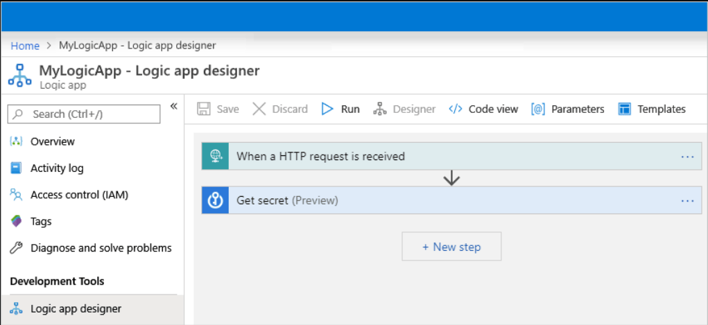  

**_Step 2:_** On the trigger or action where secure sensitive data must be secured, select the ellipses (...) button, and then select `Settings`. 
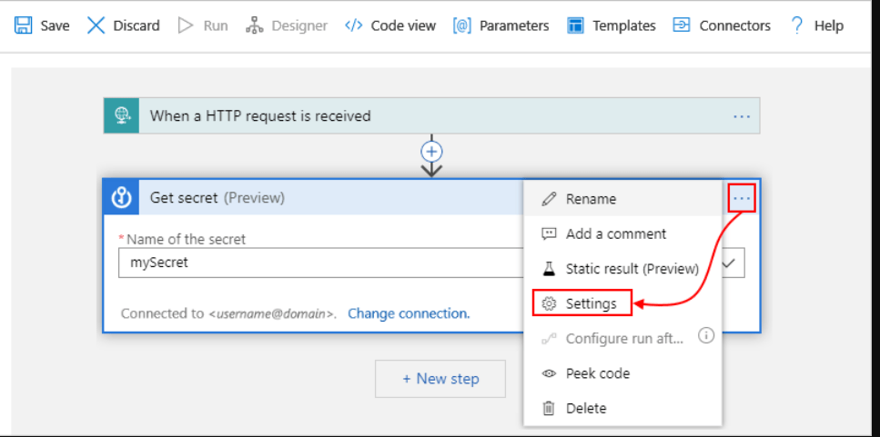  

**_Step 3:_**  Enable Secure Inputs and Secure Outputs and select Done.  
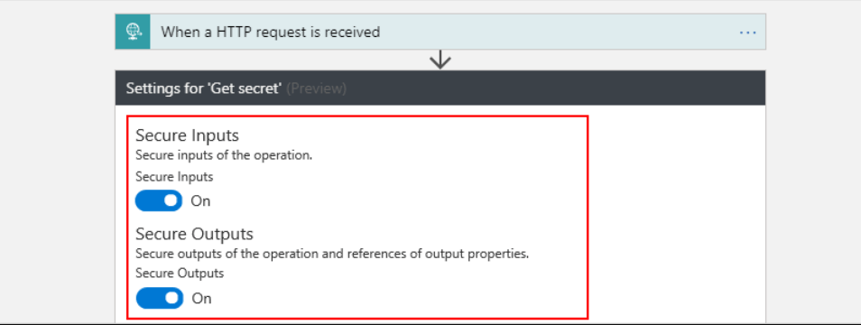  

**_Step 4:_** The action or trigger now shows a lock icon in the title bar. 
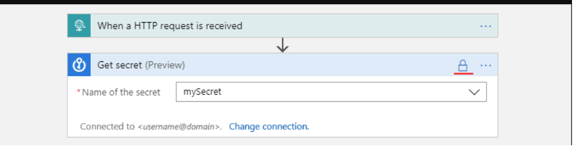  
