# Azure Monitor - Security baseline requirement <!-- omit in toc -->
## Baseline security configuration requirement for Azure services <!-- omit in toc -->

**Generated By: EY Security Team** <br>
**Service Type: Monitor** <br>
**Deployment Phase:** Service Documented  <br>
**Last updated: 04/19/2022**<br>


## Table of Contents <!-- omit in toc -->
- [Overview](#overview)
  - [Use Case Examples](#use-case-examples)
- [Cloud Security Requirements](#cloud-security-requirements)
  - [1. Ensure Azure Private Link is used to connect networks to Azure Monitor and 'private only' is selected in Query Access and Ingestion access mode](#1-ensure-azure-private-link-is-used-to-connect-networks-to-azure-monitor-and-private-only-is-selected-in-query-access-and-ingestion-access-mode)
  - [2. Ensure Private Endpoint is used in Azure Monitor Private Link Scope for secure network connection](#2-ensure-private-endpoint-is-used-in-azure-monitor-private-link-scope-for-secure-network-connection)
  - [3. Ensure diagnostic logs are enabled for Azure Monitor and Azure App Insights](#3-ensure-diagnostic-logs-are-enabled-for-azure-monitor-and-azure-app-insights)
  - [4. Ensure service tags used in Azure monitor](#4-ensure-service-tags-used-in-azure-monitor)
  - [5. Ensure data is encrypted at rest using customer managed keys](#5-ensure-data-is-encrypted-at-rest-using-customer-managed-keys)
  - [6. Ensure TLS version 1.2 is used to protect network traffic](#6-ensure-tls-version-12-is-used-to-protect-network-traffic)
  - [7. Ensure local Authentication is disabled for Application Insights and Managed identity is used for Azure AD based authentication](#7-ensure-local-authentication-is-disabled-for-application-insights-and-managed-identity-is-used-for-azure-ad-based-authentication)
  - [8. Ensure least privilege is implemented using Role Based Access Control for Application insights](#8-ensure-least-privilege-is-implemented-using-role-based-access-control-for-application-insights)
  - [9. Ensure activity logging enabled for Azure monitor and app insights](#9-ensure-activity-logging-enabled-for-azure-monitor-and-app-insights)
  - [10. Ensure Azure application insights uses standard organizational tagging method](#10-ensure-azure-application-insights-uses-standard-organizational-tagging-method)


## Overview


Azure Monitor is used to maximize the availability and performance of Azure applications and services. It helps to derive a comprehensive solution for collecting, analyzing, and acting on telemetry from the cloud and on-premises environments and visualizes how the applications are performing and proactively identify issues that affect them and the resources they depend on.


| Control Number | Cloud Baseline Security Requirements                                                                                                            |
| -------------- | ----------------------------------------------------------------------------------------------------------------------------------------------- |
| 1              | Ensure Azure Private Link is used to connect networks to Azure Monitor and 'private only' is selected in Query Access and Ingestion access mode |
| 2              | Ensure Private Endpoint is used in Azure Monitor Private Link Scope for secure network connection                                               |
| 3              | Ensure diagnostic logs are enabled for Azure Monitor and Azure App Insights                                                                     |
| 4              | Ensure service tags used in Azure monitor                                                                                                       |
| 5              | Ensure data is encrypted at rest using customer managed keys                                                                                    |
| 6              | Ensure TLS version 1.2 is used to protect network traffic                                                                                       |
| 7              | Ensure local Authentication is disabled for Application Insights and Managed identity is used for Azure AD based authentication                 |
| 8              | Ensure least privilege is implemented using Role Based Access Control for Application insights                                                  |
| 9              | Ensure activity logging enabled for Azure monitor and app insights                                                                              |
| 10             | Ensure Azure application insights uses standard organizational tagging method                                                                   |

### Use Case Examples

- Stream processing with Azure Stream Analytics
- Banking system cloud transformation on Azure
- DevSecOps for infrastructure as code (IaC)

## Cloud Security Requirements 

### 1. Ensure Azure Private Link is used to connect networks to Azure Monitor and 'private only' is selected in Query Access and Ingestion access mode

**Security Control Mapping :** <br>
| Control Number | Control Statement | Security Domain | Default | Associated Runbook | CVSS Severity  |
| -------------- | ----------------- | --------------- | ------- | ------------------ | -------------- |
| [CS0012300](place holder) | Cloud products and services must be deployed on private subnets and public access must be disabled for these services | Network and communication Security | Not enabled |Network Security Group Runbook | [High (7.2)](https://www.first.org/cvss/calculator/3.1#CVSS:3.1/AV:N/AC:H/PR:H/UI:N/S:C/C:H/I:L/A:L) 


**Why?** <br>

Azure Monitor Private Links are structured differently from Private Links to other services. Instead of creating multiple Private Links, one for each resource the VNet connects to, Azure Monitor uses a single Private Link connection, from the VNet to an Azure Monitor Private Link Scope (AMPLS).  Azure Monitor Private Link must be used to connect a private endpoint to a set of Azure Monitor resources, defining the boundaries of your monitoring network. 'Private Only' option is selected to allow the connected VNet to reach only Private Link resources. This is the most secure mode. 

**How?** <br>

**_Step 1:_** Sign in to the Azure portal and Select 'Monitor' in the search results.<br>
**_Step 2:_** In the Settings section of Monitor, select 'Private Link Scope'. <br>
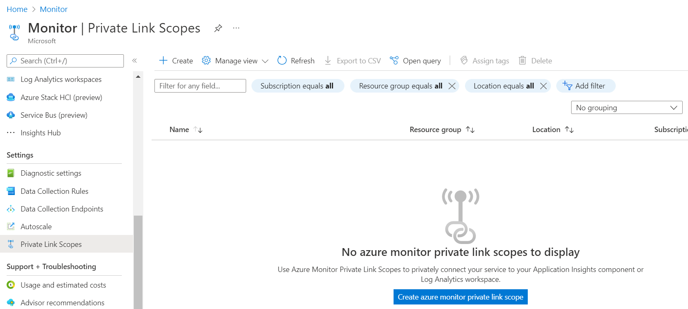<br>
**_Step 3:_** Click create and Enter the values . Select 'Private Only' as the option for Query Access mode and ingestion access mode and click on 'Create' button
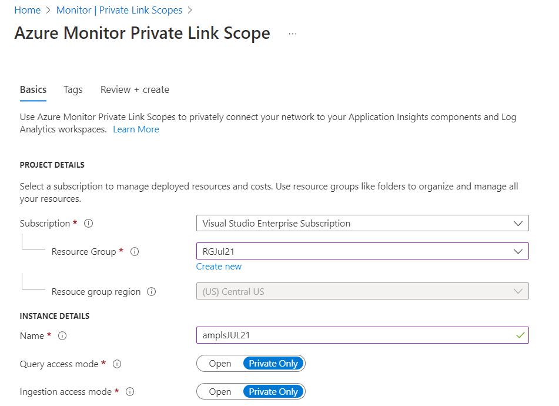<br>

**Note:** Only select 'Private Only' after adding all Azure Monitor resources to the AMPLS. Traffic to other resources will be blocked across networks, subscriptions, and tenants.


### 2. Ensure Private Endpoint is used in Azure Monitor Private Link Scope for secure network connection

**Security Control Mapping :** <br>
| Control Number | Control Statement | Security Domain | Default | Associated Runbook | CVSS Severity  |
| -------------- | ----------------- | --------------- | ------- | ------------------ | -------------- |
| [CS0012300](place holder) | Cloud products and services must be deployed on private subnets and public access must be disabled for these services | Network and communication Security | Not enabled |Network Security Group Runbook | [High (7.2)](https://www.first.org/cvss/calculator/3.1#CVSS:3.1/AV:N/AC:H/PR:H/UI:N/S:C/C:H/I:L/A:L) 


**Why?** <br>

Private endpoints must be used to connect privately to Azure Monitor to restrict public network access and to ensure the monitoring data is only accessed through authorized private networks . It also helps to prevent any data exfiltration from the private networks by defining specific Azure Monitor resources that connect through the private endpoints and securely connect the private on-premises network to Azure Monitor using ExpressRoute and Private Link 

**How?** <br>

**_Step 1:_** In the Settings section of Monitor, select 'Private Link Scopes'. Click the existing Private link scope and navigate to Private Endpoint Connections<br>
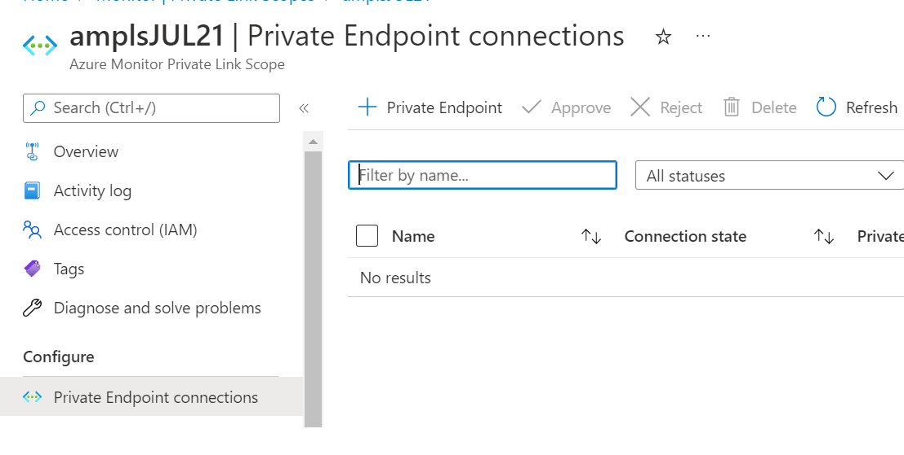<br>

**_Step 2:_** Fill the basic details and select the private link scope under resource type<br>
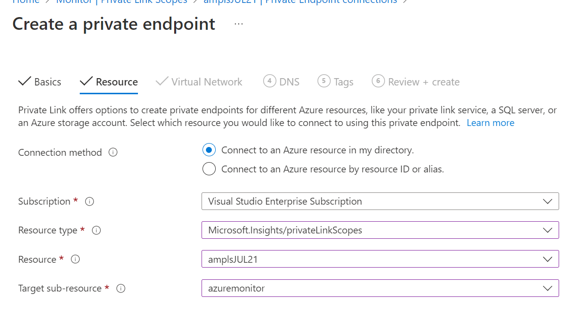<br>

**_Step 3:_** Navigate to the virtual network where private endpoint needs to be configured <br>
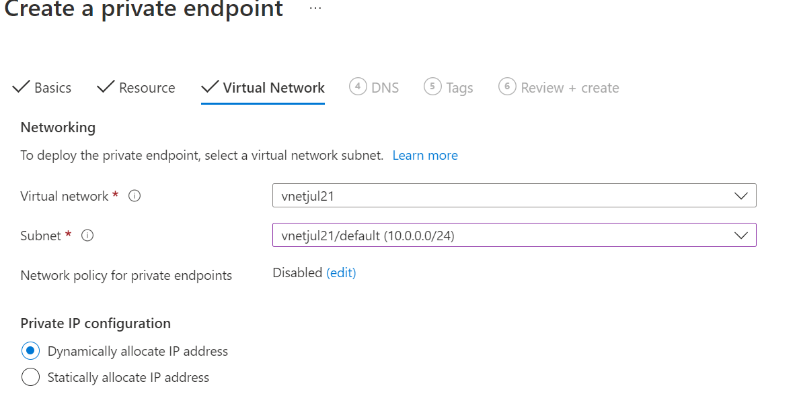<br>

**_Step 4:_** Select 'Integrate with private DNS zone' as 'Yes' and click on Create Button.<br>
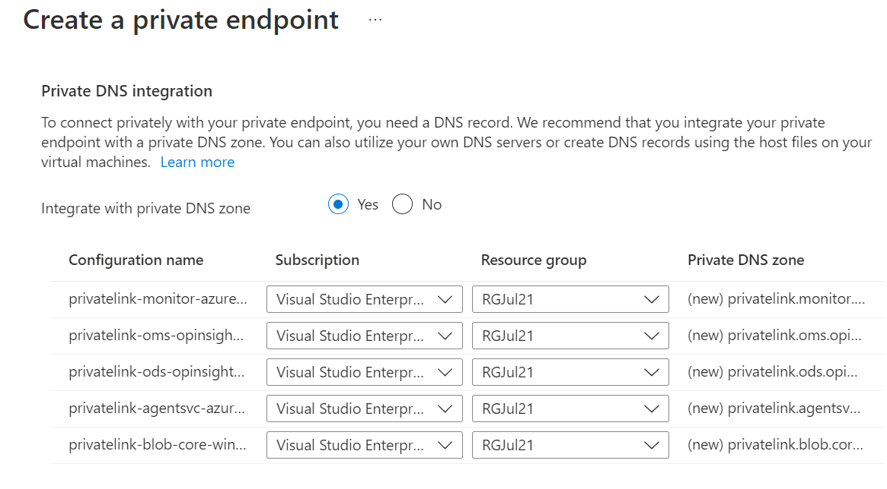<br>

<br><br>

### 3. Ensure diagnostic logs are enabled for Azure Monitor and Azure App Insights

**Security Control Mapping :** <br>
| Control Number | Control Statement | Security Domain | Default | Associated Runbook | CVSS Severity  |
| -------------- | ----------------- | --------------- | ------- | ------------------ | -------------- |
| CS0012233 | Information System must create a log and record activities occurring on or originating from the information system. Logs must be made accessible to the enterprise SIEM solution  | Security Information and event management   | Enabled but not forwarded to Splunk | None | [Low (2.7)](https://www.first.org/cvss/calculator/3.1#CVSS:3.1/AV:P/AC:H/PR:H/UI:N/S:U/C:L/I:N/A:L) |

**Why?** <br>
Diagnostic settings are used to configure streaming export of platform logs and metrics for a resource to the destination of your choice. You may create up to five different diagnostic settings to send different logs and metrics to independent destinations.

**How?** <br>

**_Step 1:_** Select 'Monitor' in the search results.<br>
**_Step 2:_** In the 'Setting' section of Monitor, select 'Diagnostic settings'. In Diagnostic settings, select '+Add diagnostic setting'.<br>
<br>

**_Step 3:_** Enter a name for the diagnostic setting. Select 'Audit' logs and 'stream to an event hub' for Destination details.<br>
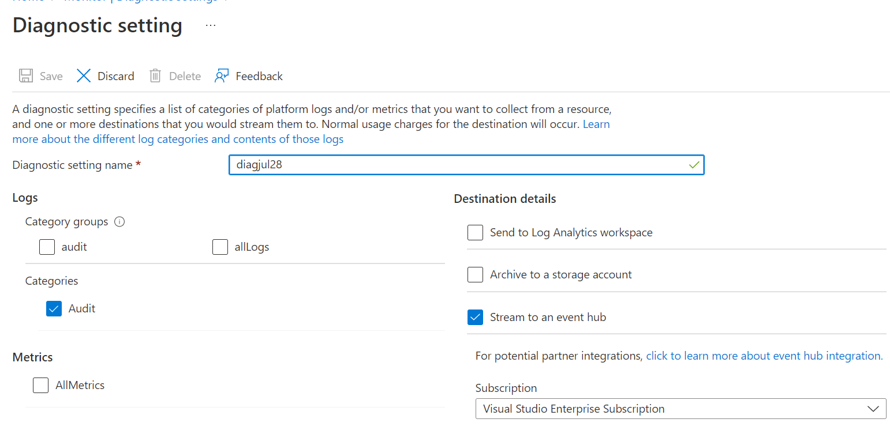<br>

**_Step 4:_** Navigate to existing Application Insights and Click on 'Diagnostic settings'.  Select 'allLogs' logs and 'stream to an event hub' for Destination details.<br>
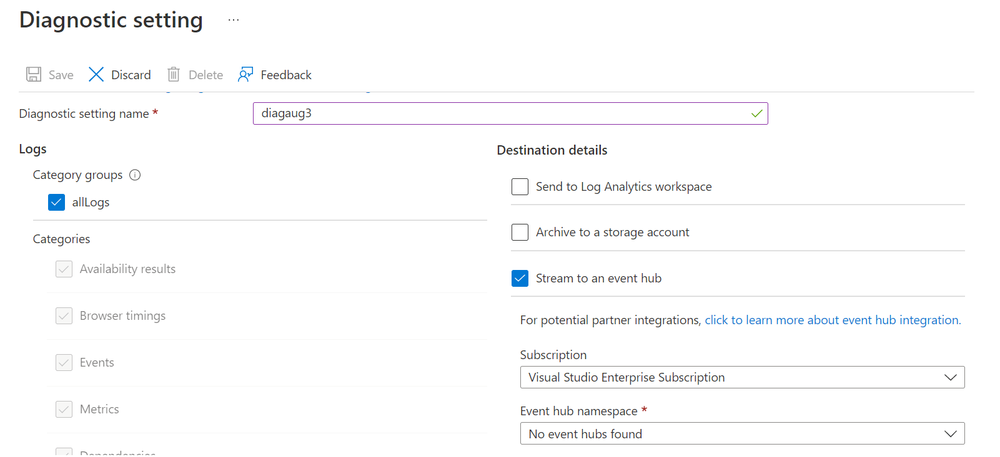<br>


<br><br>

### 4. Ensure service tags used in Azure monitor

**Security Control Mapping :** <br>
| Control Number | Control Statement | Security Domain | Default | Associated Runbook | CVSS Severity  |
| -------------- | ----------------- | --------------- | ------- | ------------------ | -------------- |
| CS0012261  | Technology hardware and software must be registered and accurately recorded within the enterprise technology repository and/or asset management systems | Asset Management  | Not enabled | organizational Runbook | [Low (1.6)](https://www.first.org/cvss/calculator/3.1#CVSS:3.1/AV:P/AC:H/PR:H/UI:N/S:U/C:N/I:N/A:L) |

**Why?** <br>
A service tag represents a group of IP address prefixes from a given Azure service. Microsoft manages the address prefixes encompassed by the service tag. You can use service tags to define network access controls on network security groups, Azure Firewall, and user-defined routes. Use service tags in place of specific IP addresses when you create security rules and routes.

Reference Links : (https://docs.microsoft.com/en-us/azure/virtual-network/service-tags-overview)

**How?** <br>

**_Step 1:_** Sign in to the Azure portal. In the search box, search for 'Network Security Groups'.<br>
**_Step 2:_** Click on 'Create'. Fill the required fields. Then click on 'Review + Submit'<br>
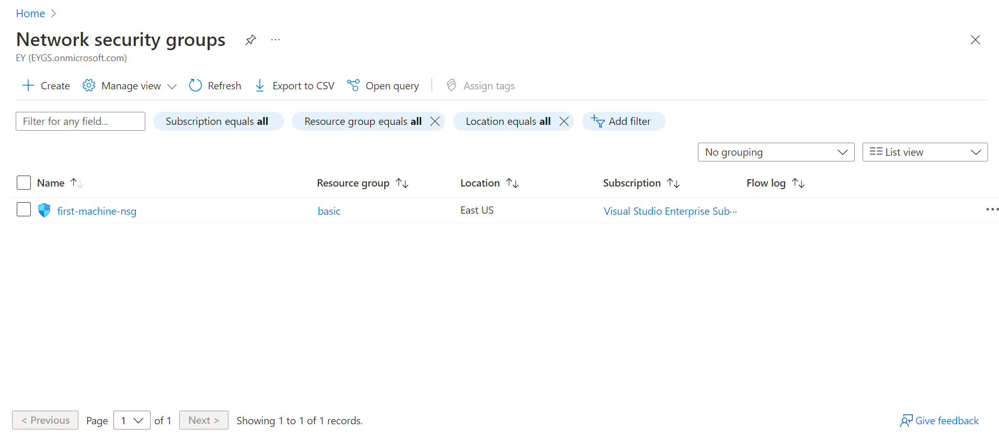<br>

**_Step 3:_** Then go to the Network Security Groups which you have created. Click on 'Outbound security rules' from the 'Settings' section of that NSG. Then click on 'Add'.<br>
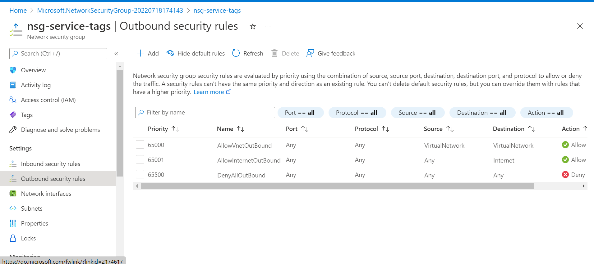<br>

**_Step 4:_** At the time of filling the details, Destination : Service tags, Destination service tag : AzureMonitor, Destination port ranges : *, Action : Deny, Priority : 100. Then click on 'Add' button.<br>
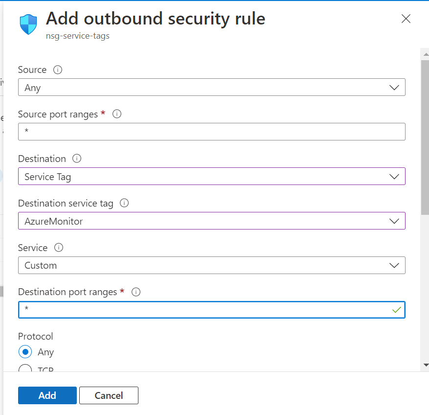<br>

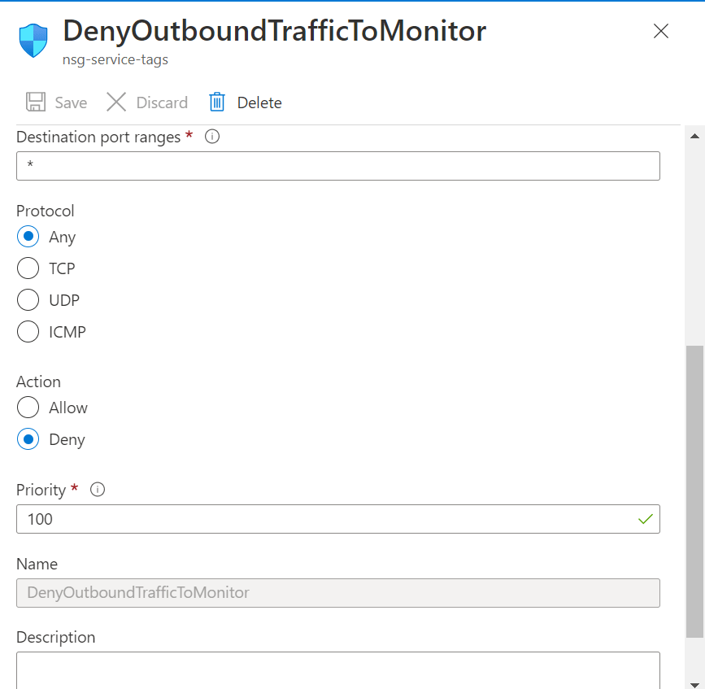<br>

**_Step 5:_** Go to 'Subnets' from the 'Settings' section of that NSG. Click on 'Associate'. Choose the subnets with which you want to attach that NSG.<br>
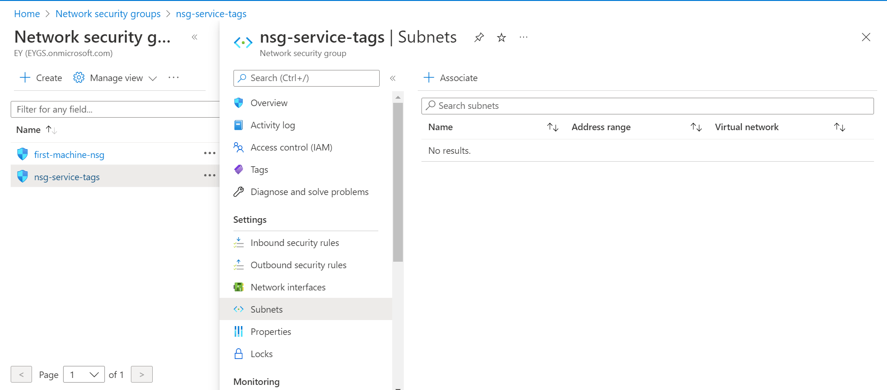<br>

<br><br>

### 5. Ensure data is encrypted at rest using customer managed keys 

**Security Control Mapping :**  <br>

| Control Number | Control Statement | Security Domain | Default | Associated Runbook | CVSS Severity  |
| -------------- | ----------------- | --------------- | ------- | ------------------ | -------------- |
|  [CS0012168](place holder)       |Strong encryption key management controls are in place for cloud provider services to protect data at rest | Data Protection  | Not enabled | None | [Medium (5.3)](https://www.first.org/cvss/calculator/3.1#CVSS:3.1/AV:A/AC:H/PR:H/UI:N/S:U/C:H/I:L/A:L)  


**Why?** <br>
By default, data  is encrypted using Microsoft Managed Keys at rest. All Azure Storage resources are encrypted, including blobs, disks, files, queues, and tables.  All object metadata is also encrypted. However, if you want to control and manage this encryption key yourself, you can specify a customer-managed key, that key is used to protect and control access to the key that encrypts your data. 
**How?** <br>

**_Step 1:_** Go to Azure portal and create Azure key vault and storing key

**_Step 2:_** Create cluster(customer managed key is delivered on dedicated clusters) and grant permissions to your key vault

**_Step 3:_** Update cluster with key identifier details and link the workspaces.

**_Step 4:_** Link a Storage Account for Alerts to keep log alerts queries in your Storage Account using the following powershell command

```Powershell

_$storageAccount.Id = Get-AzStorageAccount -ResourceGroupName "resource-group-name" -Name "storage-account-name"_

_Select-AzSubscription "workspace-subscription-id"_

_New-AzOperationalInsightsLinkedStorageAccount -ResourceGroupName "resource-group-name" -WorkspaceName "workspace-name" -DataSourceType Alerts -StorageAccountIds $storageAccount.Id_

```

To implement this control, refer the link: https://docs.microsoft.com/en-us/azure/azure-monitor/logs/logs-dedicated-clusters

<br><br> 

### 6. Ensure TLS version 1.2 is used to protect network traffic

**Security Control Mapping :**  <br>
| Control Number | Control Statement | Security Domain | Default | Associated Runbook | CVSS Severity  |
| -------------- | ----------------- | --------------- | ------- | ------------------ | -------------- |
| CS0012300 | Cloud products and services must be deployed on private subnets and public access must be disabled for these services | Network and communication Security| Not enabled | Virtual Network Runbook | [Medium (5.3)](https://www.first.org/cvss/calculator/3.1#CVSS:3.1/AV:A/AC:H/PR:H/UI:N/S:U/C:H/I:L/A:L) |

**Why?** <br>

Some of the use cases of data in transit are authentication of database credentials against the Azure Active directory or communication between database and other applications. TLS 1.2 must be used as the secure encryption in transit for all the  connections to improve the security posture of the environment and also to remain in compliance with industry standards or organization requirements


**How?** <br>

**_Step 1:_** Go to Azure portal and enter monitor in search box and click on cloud shell icon.

**_Step 2:_** Go to power shell and check the version of TLS by using “openssl version -a” and it will display the version of TLS used.
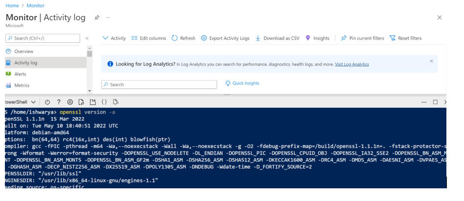

<br><br> 

### 7. Ensure local Authentication is disabled for Application Insights and Managed identity is used for Azure AD based authentication

**Security Control Mapping :** <br>
| Control Number | Control Statement | Security Domain | Default | Associated Runbook | CVSS Severity  |
| -------------- | ----------------- | --------------- | ------- | ------------------ | -------------- |
|  CS0012298     | Access to change cloud identity access and service control policies is restricted to authorized cloud administrative personnel |  Identity and Access Management | Not enabled | None | [Medium (5.1)](https://www.first.org/cvss/calculator/3.1#CVSS:3.1/AV:A/AC:H/PR:H/UI:N/S:C/C:L/I:L/A:L) |

**Why?**<br>

Local authentication must be disabled to enhance the security of the Application Insights resource by requiring that all actions are strongly authenticated. When disabled, applications must use the Monitoring Metrics Publisher role in addition to the Instrumentation key to publish telemetry and API Keys cannot be used. Managed identity is used to enable Azure resources to authenticate to cloud services (e.g. Azure Key Vault) without storing credentials in code. Once enabled, all necessary permissions can be granted via Azure role-based-access-control. 

Reference Links : (https://docs.microsoft.com/en-us/azure/azure-monitor/app/azure-ad-authentication?tabs=net)

**How?** <br>

**_Step 1:_** Navigate to the App insights -> Properties -> Local authentication .<br>
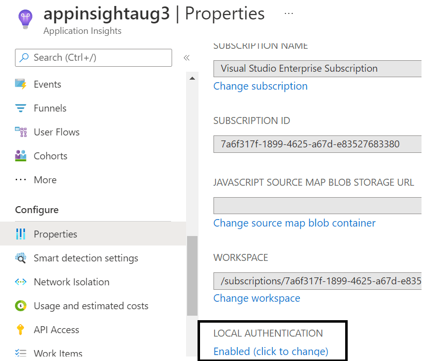<br>

**_Step 2:_** Click 'Enabled' and change the authentication to 'disabled' and click on `Apply` button.
<br>

**_Step 3:_** The value for local authentication is changed to 'disabled'.<br>
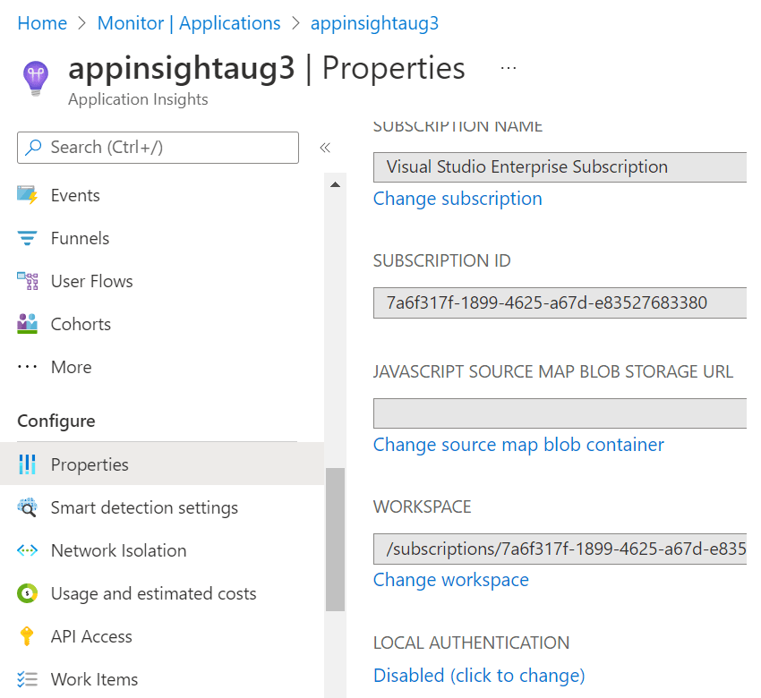<br>

**_Step 4:_** Create an managed identity and assign 'Monitoring Metrics Operator' role to the managed identity of the App insight<br>
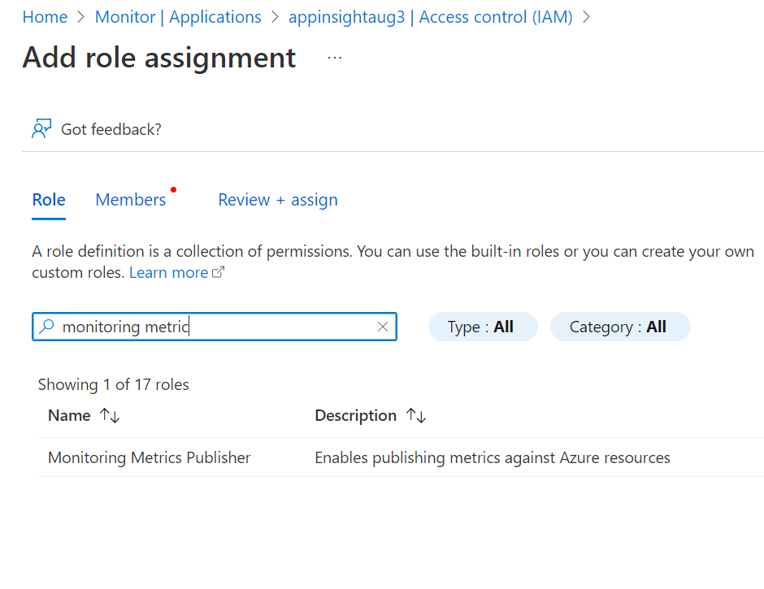<br>

**_Step 5:_** Construct the appropriate credentials and pass it into the constructor of the Azure Monitor exporter. Connection string must be set up with the instrumentation key and ingestion endpoint of resource

_from azure.identity import ManagedIdentityCredential_

_from opencensus.ext.azure.trace_exporter import AzureExporter_
_from opencensus.trace.samplers import ProbabilitySampler_
_from opencensus.trace.tracer import Tracer_

_credential = ManagedIdentityCredential()_
_tracer = Tracer(_
    _exporter=AzureExporter(credential=credential, connection_string="InstrumentationKey=<your-instrumentation-key>;_IngestionEndpoint=<your-ingestion-endpoint>"),_
    _sampler=ProbabilitySampler(1.0)_
_)_
..


<br><br>

### 8. Ensure least privilege is implemented using Role Based Access Control for Application insights

**Security Control Mapping :** <br>
| Control Number | Control Statement | Security Domain | Default | Associated Runbook | CVSS Severity  |
| -------------- | ----------------- | --------------- | ------- | ------------------ | -------------- |
| CS0012300 | Cloud products and services must be deployed on private subnets and public access must be disabled for these services |Identity & Access Management | Not enabled  | [Medium (5.2)](https://www.first.org/cvss/calculator/3.1#CVSS:3.1/AV:L/AC:H/PR:H/UI:N/S:U/C:L/I:H/A:L) |


[Place Holder ]

**Following are the suggested RBAC roles for Azure App insights** <br>

| Function | Description | Role | 
| -------------- | ----------------- | --------------- | 
|  Application Insights Component Contributor |Can manage Application Insights components | [Application Insights Component Contributor](https://github.com/MicrosoftDocs/azure-docs/blob/main/articles/role-based-access-control/built-in-roles.md#application-insights-component-contributor) |
|  Monitoring Contributor | Can read all monitoring data and edit monitoring settings | [Monitoring Contributor](https://github.com/MicrosoftDocs/azure-docs/blob/main/articles/role-based-access-control/built-in-roles.md#monitoring-contributor) |
|  Monitoring Metrics Publisher | Enables publishing metrics against Azure resources | [Monitoring Metrics Publisher](https://github.com/MicrosoftDocs/azure-docs/blob/main/articles/role-based-access-control/built-in-roles.md#monitoring-metrics-publisher) |
|  Monitoring Reader | Can read all monitoring data (metrics, logs, etc.).  | [Monitoring Reader](https://github.com/MicrosoftDocs/azure-docs/blob/main/articles/role-based-access-control/built-in-roles.md#monitoring-reader) |

<br><br>
 

### 9. Ensure activity logging enabled for Azure monitor and app insights
**Security Control Mapping :** <br>
| Control Number | Control Statement | Security Domain | Default | Associated Runbook | CVSS Severity  |
| -------------- | ----------------- | --------------- | ------- | ------------------ | -------------- |
| CS0012233 | Information System must create a log and record activities occurring on or originating from the information system. Logs must be made accessible to the enterprise SIEM solution  | Security Information and event management   | Enabled but not forwarded to Splunk | None | [Low (2.7)](https://www.first.org/cvss/calculator/3.1#CVSS:3.1/AV:P/AC:H/PR:H/UI:N/S:U/C:L/I:N/A:L) |

**Why, What and How ?**<br>

Client rationale and Justification<br>
[Placeholder link]

<br><br> 

### 10. Ensure Azure application insights uses standard organizational tagging method 


**Security Control Mapping :** <br>
| Control Number | Control Statement | Security Domain | Default | Associated Runbook | CVSS Severity  |
| -------------- | ----------------- | --------------- | ------- | ------------------ | -------------- |
| CS0012261  | Technology hardware and software must be registered and accurately recorded within the enterprise technology repository and/or asset management systems | Asset Management  | Not enabled | organizational Runbook | [Low (1.6)](https://www.first.org/cvss/calculator/3.1#CVSS:3.1/AV:P/AC:H/PR:H/UI:N/S:U/C:N/I:N/A:L) |


**Why, What and How ?**<br>

Client rationale and Justification<br>
[Placeholder link]

<br><br> 

