# Azure Network Security Group - Security baseline requirement <!-- omit in toc -->

## Baseline security configuration requirement for Azure services <!-- omit in toc -->

**Generated By: EY Security Team**  
**Service Type: Networking**  
**Deployment Phase: Service Discovery**  
**Last updated: 04/29/2022** 

## Table of Contents <!-- omit in toc -->

- [Overview](#overview)
  - [Use Case Examples:](#use-case-examples)
- [Cloud Security Requirements](#cloud-security-requirements)
  - [1. Ensure each Subnet and Network interface should be associated with Network Security Group](#1-ensure-each-subnet-and-network-interface-should-be-associated-with-network-security-group)
  - [2. Ensure Application security group(ASG) is combined with NSG to filter network traffic for a fleet of VMs](#2-ensure-application-security-groupasg-is-combined-with-nsg-to-filter-network-traffic-for-a-fleet-of-vms)
  - [3. Ensure NSG implements Role Based Access Control](#3-ensure-nsg-implements-role-based-access-control)
  - [4. Ensure Diagnostic logs are enabled for Azure NSG and forwarded to splunk](#4-ensure-diagnostic-logs-are-enabled-for-azure-nsg-and-forwarded-to-splunk)
  - [5. Ensure administrative tasks are performed only in secure and Azure-managed workstations](#5-ensure-administrative-tasks-are-performed-only-in-secure-and-azure-managed-workstations)
  - [6. Ensure that NSG uses standard organizational Resource tagging method](#6-ensure-that-nsg-uses-standard-organizational-resource-tagging-method)
  - [7. Ensure Service tags are enabled for the network security group](#7-ensure-service-tags-are-enabled-for-the-network-security-group)
  - [8. Ensure Explicit Deny rules are defined with higher priority value in NSG to override the allow rules](#8-ensure-explicit-deny-rules-are-defined-with-higher-priority-value-in-nsg-to-override-the-allow-rules)
  - [9. Ensure all the NSG has NSG flow log data enabled using Network Watcher](#9-ensure-all-the-nsg-has-nsg-flow-log-data-enabled-using-network-watcher)
  - [10. Ensure Activity logging is enabled for Azure Network Security Group](#10-ensure-activity-logging-is-enabled-for-azure-network-security-group)

## Overview

Azure network security group is used to filter the network traffic to and from Azure resources in an Azure virtual network. A network security group contains security rules that allow or deny inbound network traffic to, or outbound network traffic from, several types of Azure resources. Source and destination IP addresses, port, and protocol are specified for each rule

| Control Number | Cloud Baseline Security Requirements                                                                     |
| -------------- | -------------------------------------------------------------------------------------------------------- |
| 1              | Ensure each Subnet and Network interface should be associated with Network Security Group                |
| 2              | Ensure Application security group(ASG) is combined with NSG to filter network traffic for a fleet of VMs |
| 3              | Ensure NSG implements Role Based Access Control                                                          |
| 4              | Ensure Diagnostic logs are enabled for Azure NSG and forwarded to splunk                                 |
| 5              | Ensure administrative tasks are performed only in secure and Azure-managed workstations                  |
| 6              | Ensure that NSG uses standard organizational Resource tagging method                                     |
| 7              | Ensure Service tags are enabled for the network security group                                           |
| 8              | Ensure Explicit Deny rules are defined with higher priority value in NSG to override the allow rules     |
| 9              | Ensure all the NSG has NSG flow log data enabled using Network Watcher                                   |
| 10             | Ensure Activity logging is enabled for Azure Network Security Group                                      |

### Use Case Examples:

- AI-based footfall detection
- Elastic Workplace Search on Azure
- SAP workload automation using SUSE on Azure
- Zero-trust network for web applications with Azure Firewall and Application Gateway
- Unisys ClearPath Forward mainframe rehost to Azure using Unisys virtualization

## Cloud Security Requirements

### 1. Ensure each Subnet and Network interface should be associated with Network Security Group

**Security Control Mapping :**  
| Control Number | Control Statement | Security Domain | Default | Associated Runbook | CVSS Severity |
| -------------- | ----------------- | --------------- | ------- | ------------------ | -------------- |
| CS0012300 | Cloud products and services must be deployed on private subnets and public access must be disabled for these services | Network and communication Security | Not enabled | Virtual Network Runbook | [High (7.2)](https://www.first.org/cvss/calculator/3.1#CVSS:3.1/AV:N/AC:H/PR:H/UI:N/S:C/C:H/I:L/A:L)|

**Why?**  

By default, all virtual machine instances in a subnet can communicate with any resources. Communication among the resources in a subnet can be limited by creating a network security group, and associating it to the subnet. Those resources that can not be associated with subnet should connect Network interface card with the NSG.

**How?**  

**_Step 1:_** Create a NSG using Azure portal. Using Portal, Click on the “Create a resource” and select “Network security groups”. 
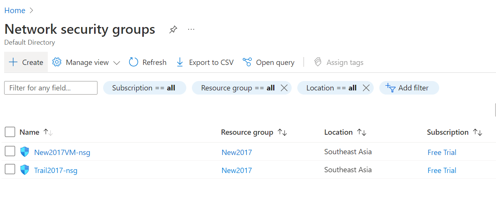 

**_Step 2:_** Create a resource group and nsg and select the region and click on Review+create. When validation passed, Select Create. 
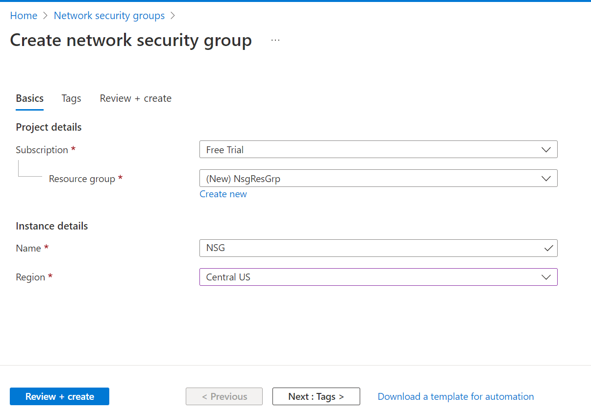 

**_Step 3:_** Once deployment is complete, click on “Go to resource”. 
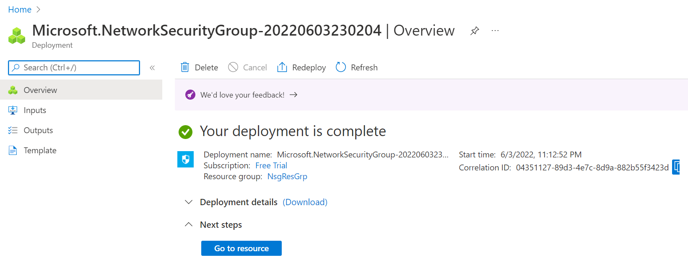 

**_Step 4:_** In the left side panel, Click Subnet. In the subnet page, Select +Associate and select the VN from drop down and click Ok. 
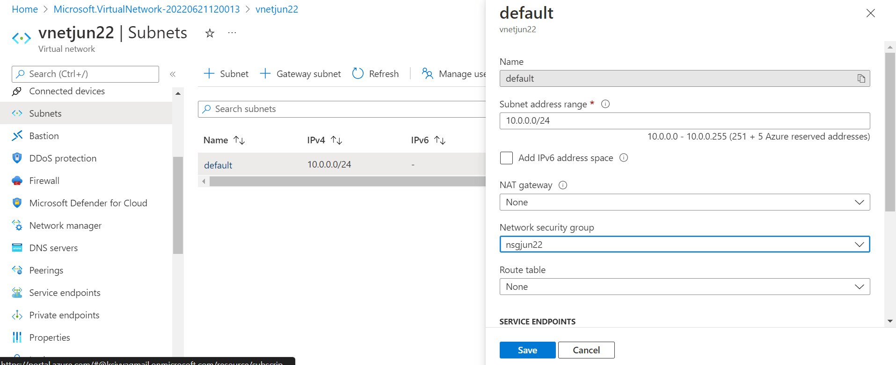 

**For Network Interface** 

**_Step 1:_** Create a Network Interface using Azure portal. Using Portal, Click on the “Create a resource” and select “Network Interface”. 

**_Step 2:_** Click create and Select the resource group name, region, virtual network, subnet and Network security group and click Review+create. 
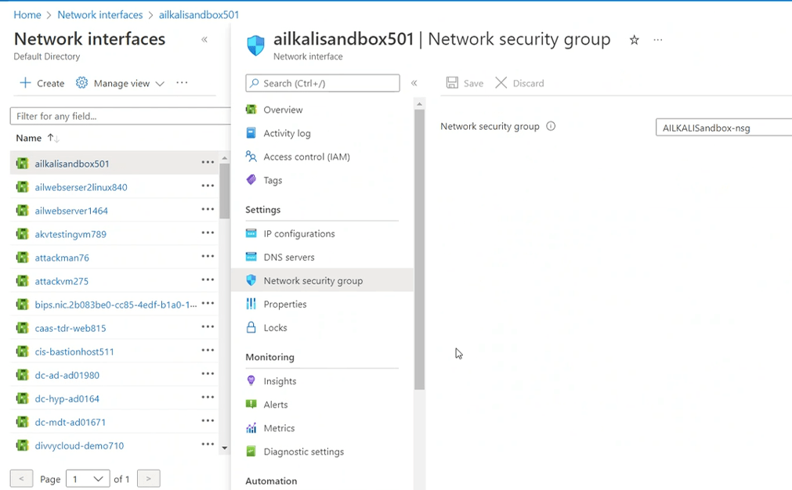 

### 2. Ensure Application security group(ASG) is combined with NSG to filter network traffic for a fleet of VMs

**Security Control Mapping :**  
| Control Number | Control Statement | Security Domain | Default | Associated Runbook | CVSS Severity |
| -------------- | ----------------- | --------------- | ------- | ------------------ | -------------- |
| CS0012300 | Cloud products and services must be deployed on private subnets and public access must be disabled for these services | Network and communication Security | Not enabled | Virtual Network Runbook | [Low (1.9)](https://www.first.org/cvss/calculator/3.1#CVSS:3.1/AV:L/AC:H/PR:H/UI:N/S:U/C:L/I:N/A:N)|

**Why?**  

ASGs must be enabled to define fine-grained network security policies based on workloads, centralized on applications, instead of explicit IP addresses. ASG provides the capability to group VMs with monikers and secure applications by filtering traffic from trusted segments of the network.

**How?**  

**_Step 1:_** Create a ASG using Azure portal. Using Portal, Click on the “Create a resource” and select “Application security groups”. 

**_Step 2:_** Click on already created resource group for nsg and give the name and region and click on Review+create. 
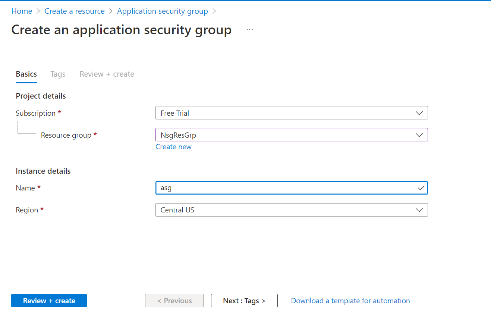 

**_Step 3:_** Go to the created NSG and select Inbound security rules from the menu in left side panel. 

**_Step 4:_** In the security rule, select the destination as “Application security group” , select the created asg and click on Add. 
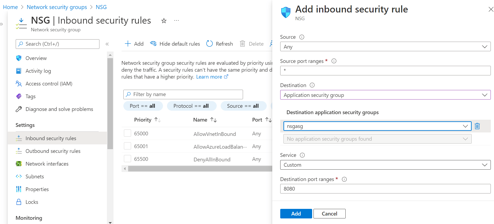 

### 3. Ensure NSG implements Role Based Access Control

**Security Control Mapping :**  
| Control Number | Control Statement | Security Domain | Default | Associated Runbook | CVSS Severity |
| -------------- | ----------------- | --------------- | ------- | ------------------ | -------------- |
| CS0012300 | Cloud products and services must be deployed on private subnets and public access must be disabled for these services |Identity & Access Management | Not enabled | Virtual Network Runbook | [Medium (5.2)](https://www.first.org/cvss/calculator/3.1#CVSS:3.1/AV:L/AC:H/PR:H/UI:N/S:U/C:L/I:H/A:L) |

[Place Holder]

**Following are the suggested RBAC roles for Network Security Group**  
| Function | Description | Role |
| -------------- | ----------------- | --------------- |
| Network admin | Responsible provisioning service endpoint and linking spoke VNet| Networkadmin |
| Monitoring admin | Responsible for monitoring and auditing the images in Data lake storage | MonitoringPlatformadmin |

### 4. Ensure Diagnostic logs are enabled for Azure NSG and forwarded to splunk

**Security Control Mapping :**  
| Control Number | Control Statement | Security Domain | Default | Associated Runbook | CVSS Severity |
| -------------- | ----------------- | --------------- | ------- | ------------------ | -------------- |
| CS0012233 | Information System must create a log and record activities occurring on or originating from the information system. Logs must be made accessible to the enterprise SIEM solution | Security Information and event management | Enabled but not forwarded to Splunk | None | [Low (2.7)](https://www.first.org/cvss/calculator/3.1#CVSS:3.1/AV:P/AC:H/PR:H/UI:N/S:U/C:L/I:N/A:L) |

**Why?**  

The event log contains information about the api objects which include NetworkSecurityGroupEvent and AllMetrics. These logs when forwarded to Splunk provide necessary information to create notable alerts for any rule created to allow connection from internet

**How?**  

**_Step 1:_** Go to newly created NSG and select “Diagnostic settings” on the left side menu. Click “Add diagnostic setting”.
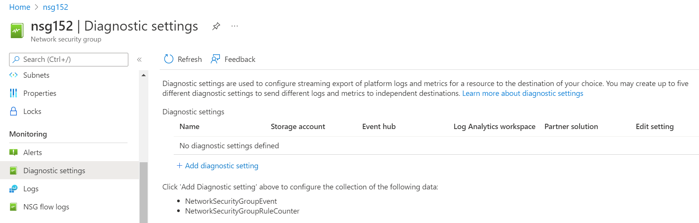 

**_Step 2:_** Select “NetworkSecurityGroupEvent” and "NetworkSecurityGroupRuleCounter" in diagnostic setting page and also select “Stream to event hub". Select "Event hub namespace " and Click “save”. 
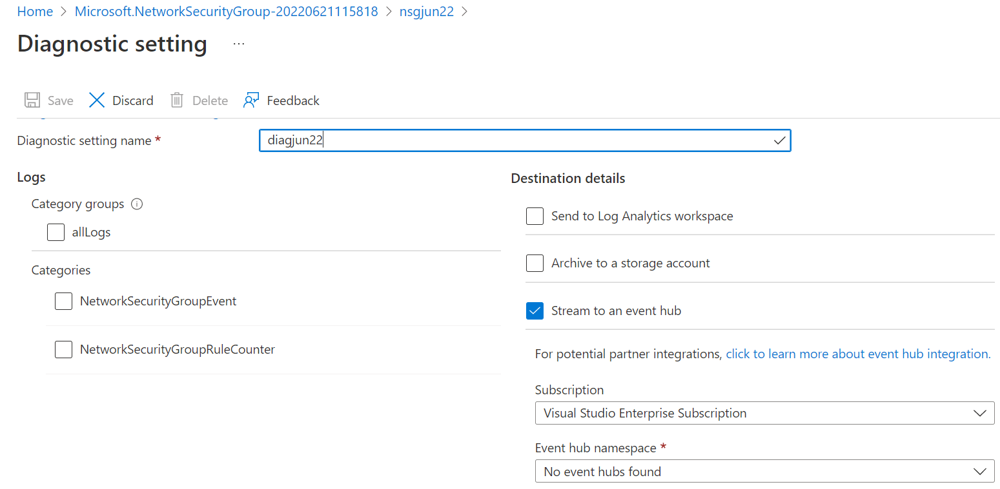 

**_Step 3:_** Connect splunk app for Microsoft services to the Logs storage account and configure the inputs to extract the logs from Azure storage to Splunk  
[Place holder for link]

  

### 5. Ensure administrative tasks are performed only in secure and Azure-managed workstations

**Security Control Mapping :**  
| Control Number | Control Statement | Security Domain | Default | Associated Runbook | CVSS Severity |
| -------------- | ----------------- | --------------- | ------- | ------------------ | -------------- |
| CS0012298 | Access to change cloud identity access and service control policies is restricted to authorized cloud administrative personnel | Identity & Access Management | Not enabled | None | [[Low (3.0)](https://www.first.org/cvss/calculator/3.1#CVSS:3.1/AV:L/AC:H/PR:H/UI:N/S:U/C:L/I:L/A:N)|

**Why?**  

A Privileged workstation provides a hardened workstation that has clear application control and application guard. The workstation uses credential guard, device guard, app guard, and exploit guard to protect the host from malicious behavior. All the administrative tasks must be performed only using these Privileged workstation

**How?**  

**_Step 1:_**  Request permission to add the user to corresponding entitlements to access admin e workstation 
**_Step 2:_**  Login to the workstation as the user and launch the azure portal in browser to perform administrative tasks 
[Place holder for link]

### 6. Ensure that NSG uses standard organizational Resource tagging method

**Security Control Mapping :**  
| Control Number | Control Statement | Security Domain | Default | Associated Runbook | CVSS Severity |
| -------------- | ----------------- | --------------- | ------- | ------------------ | -------------- |
| CS0012261 | Technology hardware and software must be registered and accurately recorded within the enterprise technology repository and/or asset management systems | Asset Management | Not enabled | organizational Runbook | [Low (1.6)](https://www.first.org/cvss/calculator/3.1#CVSS:3.1/AV:P/AC:H/PR:H/UI:N/S:U/C:N/I:N/A:L) |

**Why, What and How ?** 

Client rationale and Justification
[Placeholder link]

### 7. Ensure Service tags are enabled for the network security group

**Security Control Mapping :**  
| Control Number | Control Statement | Security Domain | Default | Associated Runbook | CVSS Severity |
| -------------- | ----------------- | --------------- | ------- | ------------------ | -------------- |
| CS0012261 | Technology hardware and software must be registered and accurately recorded within the enterprise technology repository and/or asset management systems | Asset Management | Not enabled | organizational Runbook | [Low (1.6)](https://www.first.org/cvss/calculator/3.1#CVSS:3.1/AV:P/AC:H/PR:H/UI:N/S:U/C:N/I:N/A:L) |

**Why?**

A service tag represents a group of IP address prefixes from a given Azure service. Microsoft manages the address prefixes encompassed by the service tag and automatically updates the service tag as addresses change, minimizing the complexity of frequent updates to network security rules. Service tag must be enabled for the Network security group to avoid NSG rules complexity

**How?**  

**_Step 1:_** Select NSG groups which is already created and running. Click on the “outbound security rules” on the left side pane. 
**_Step 2:_** Click “Add” and give source name as “service tag “ and fill in the other details and click “Add”. 
 

### 8. Ensure Explicit Deny rules are defined with higher priority value in NSG to override the allow rules

**Security Control Mapping :**  
| Control Number | Control Statement | Security Domain | Default | Associated Runbook | CVSS Severity |
| -------------- | ----------------- | --------------- | ------- | ------------------ | -------------- |
| CS0012300 | Cloud products and services must be deployed on private subnets and public access must be disabled for these services | Network and communication Security | Not enabled | None | [Medium (4.4)](https://www.first.org/cvss/calculator/3.1#CVSS:3.1/AV:P/AC:H/PR:H/UI:N/S:U/C:H/I:L/A:N) |

**Why?**  

Security rules in network security groups enable you to filter the type of network traffic that can flow in and out of virtual network subnets and network interface. Explicit deny rules must be defined with higher priority values as it will filter most of the traffic and traffic originating from specific addresses can be allowed

**How?**  
**_Step 1:_** Open the already created and existing NSG and click on Inbound security rules/Outbound security rules from the left side menu. 
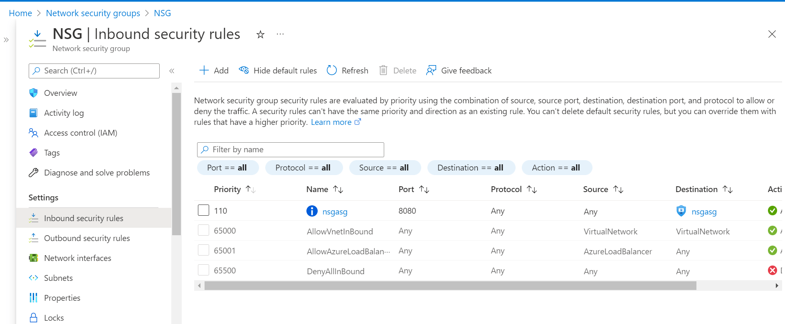 

**_Step 2:_** Click on +Add and give the details for DenyAllInBound rules with the priority value as 100. 
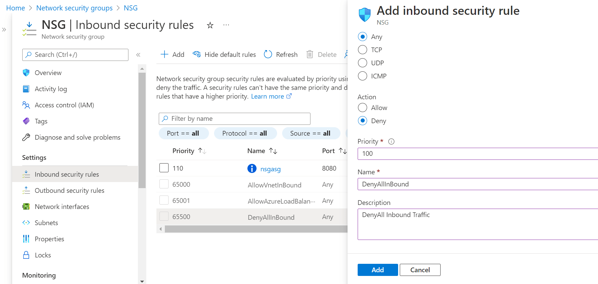 

**_Step 3:_** Now the default security rule for DenyAllInBound rule will be overridden by the same rule with priority 100 to deny all Inbound traffic. 
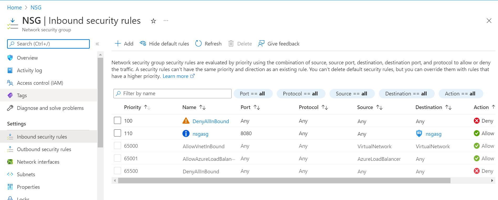 

### 9. Ensure all the NSG has NSG flow log data enabled using Network Watcher

**Security Control Mapping :**  
| Control Number | Control Statement | Security Domain | Default | Associated Runbook | CVSS Severity |
| -------------- | ----------------- | --------------- | ------- | ------------------ | -------------- |
| CS0012233 | Information System must create a log and record activities occurring on or originating from the information system. Logs must be made accessible to the enterprise SIEM solution | Security Information and event management | Not Enabled | Network Watcher Runbook | [Low (2.7)](https://www.first.org/cvss/calculator/3.1#CVSS:3.1/AV:P/AC:H/PR:H/UI:N/S:U/C:L/I:N/A:L) |

**Why?**  

Network security group (NSG) flow logs is a feature of Azure Network Watcher that logs information about IP traffic flowing through an NSG. The Flow data then is sent to Azure Storage accounts where it can be accessed as well as exported to any visualization tool, SIEM, or IDS .The storage of the NSG flow logs must be encrypted using a Customer Managed key as they contain sensitive information about traffic like source, destination ips, ports and times moving through Virtual networks

**How?**  

**_Step 1:_** In the created and existing NSG, Select NSG Flow logs in the left side menu. Create a flow log and link it to the storage account for which traffic is logged. 
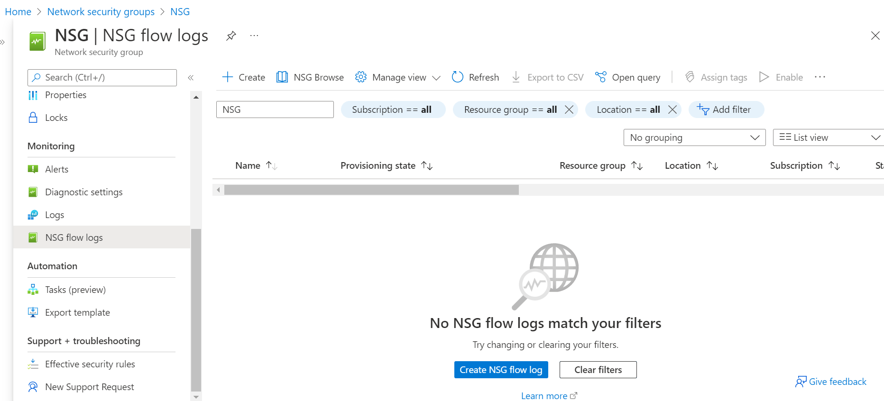 

**_Step 2:_** After linking the storage account, please review and create 
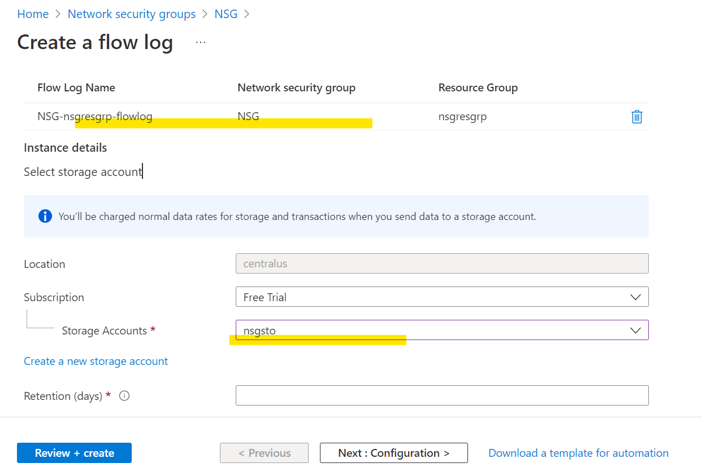 

**_Step 3:_** Enable the NSG flow logs for all the NSGs 

**_Step 4:_** Connect Splunk app for Microsoft services to the Logs storage account and configure the inputs to extract the logs from Azure storage to Splunk  
[Place holder for link]

### 10. Ensure Activity logging is enabled for Azure Network Security Group

**Security Control Mapping :**  
| Control Number | Control Statement | Security Domain | Default | Associated Runbook | CVSS Severity  |
| -------------- | ----------------- | --------------- | ------- | ------------------ | -------------- |
| CS0012233 | Information System must create a log and record activities occurring on or originating from the information system. Logs must be made accessible to the enterprise SIEM solution  | Security Information and event management   | Enabled but not forwarded to Splunk | None | [Low (2.7)](https://www.first.org/cvss/calculator/3.1#CVSS:3.1/AV:P/AC:H/PR:H/UI:N/S:U/C:L/I:N/A:L) |

**Why, What and How ?** 
  
Client rationale and Justification 
[Placeholder link]

   

