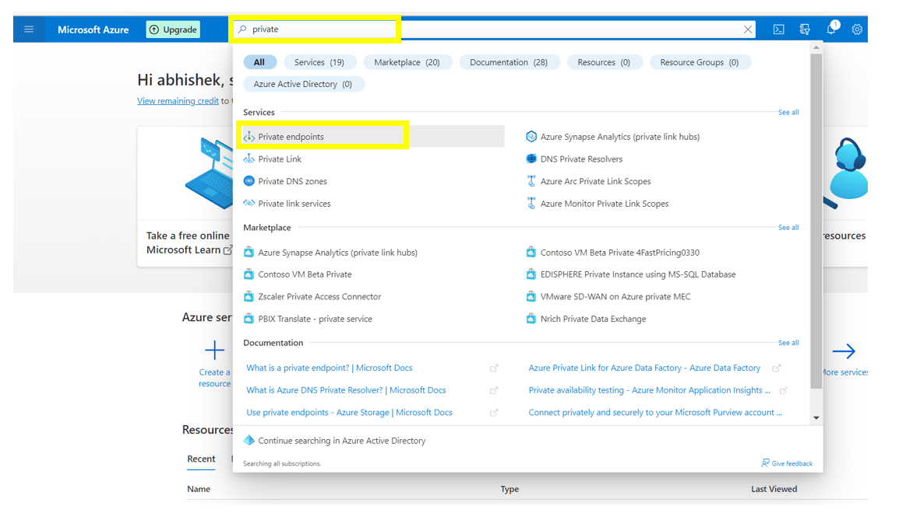
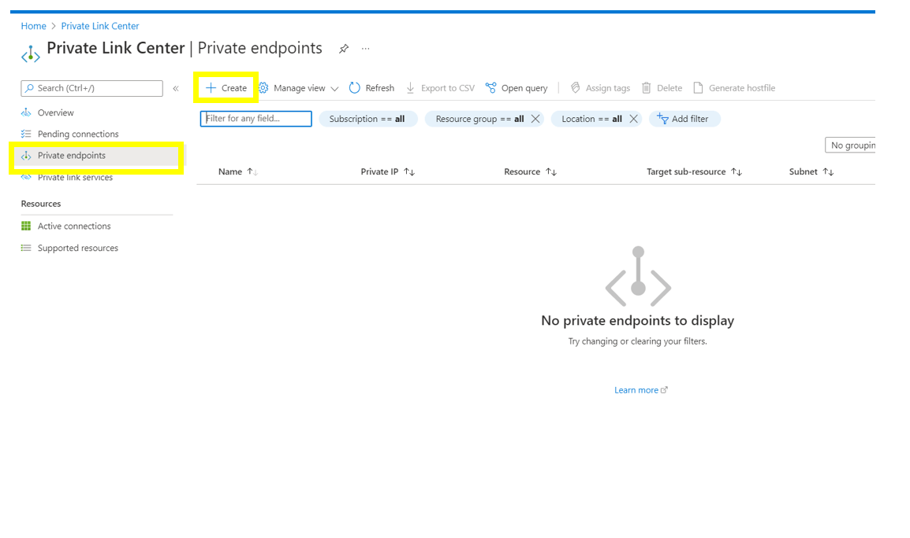
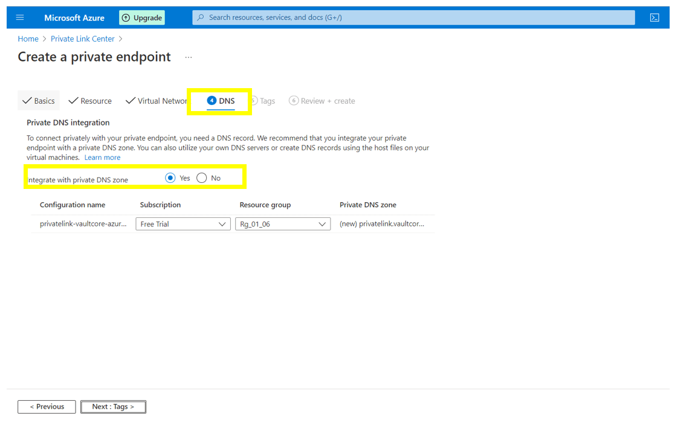
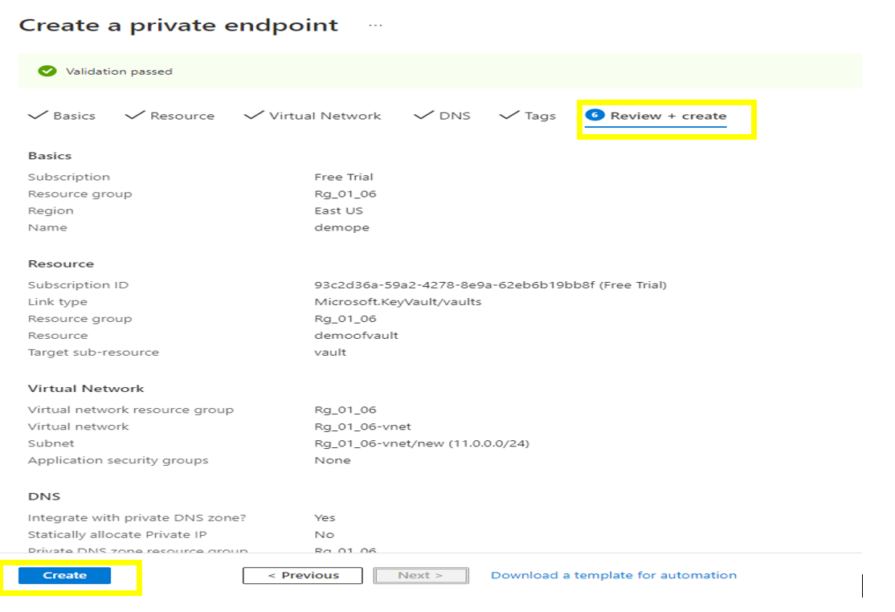
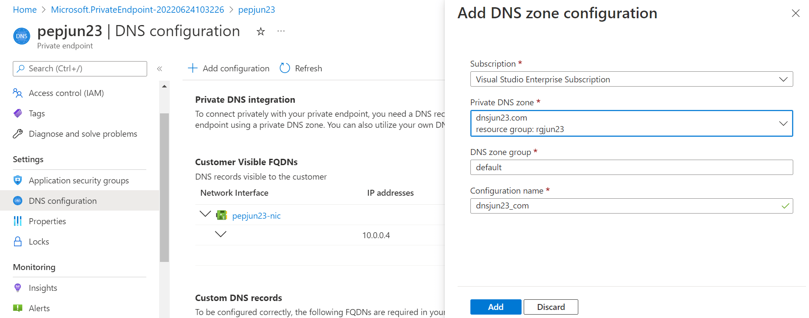
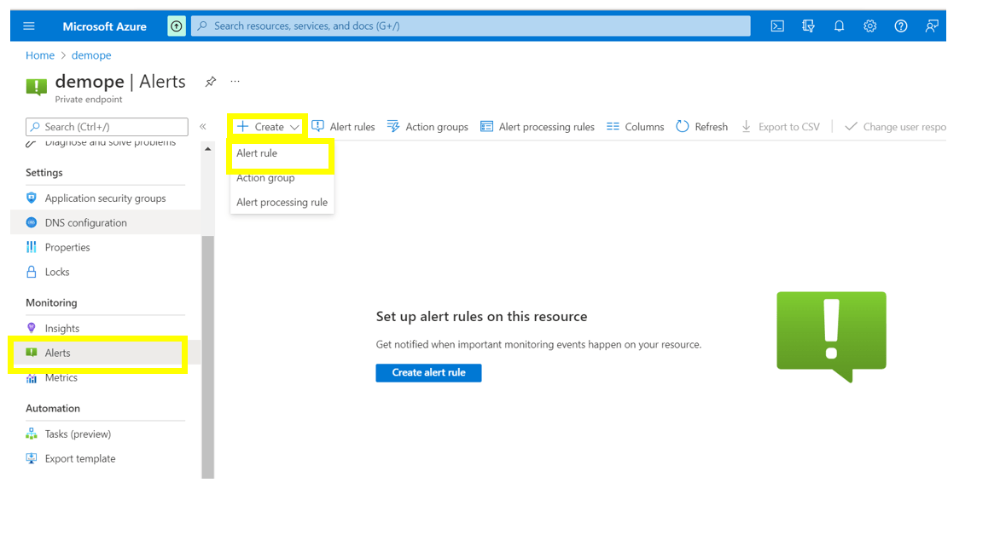
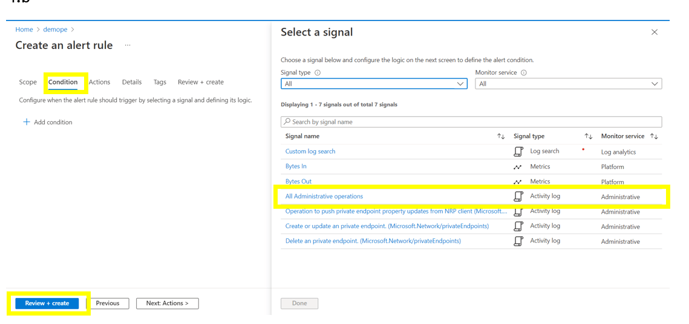

# Azure Private Endpoint - Security baseline requirement <!-- omit in toc -->
## Baseline security configuration requirement for Azure services <!-- omit in toc -->

**Generated By: EY Security Team**  
**Service Type: Networking**  
**Deployment Phase: Service Discovery**  
**Last updated: 05/04/2022** 

## Table of Contents <!-- omit in toc -->

- [Overview](#overview)
  - [Use Case Examples:](#use-case-examples)
- [Cloud Security Requirements](#cloud-security-requirements)
  - [1. Ensure least privilege access method for Private Endpoint is implemented using Role-based access control (RBAC)](#1-ensure-least-privilege-access-method-for-private-endpoint-is-implemented-using-role-based-access-control-rbac)
  - [2. Ensure private endpoint is integrated with private dns zone](#2-ensure-private-endpoint-is-integrated-with-private-dns-zone)
  - [3. Ensure Secondary accounts are used for administrative tasks and any suspicious activity are alerted](#3-ensure-secondary-accounts-are-used-for-administrative-tasks-and-any-suspicious-activity-are-alerted)
  - [4. Ensure that private endpoint uses standard organizational Resource tagging method](#4-ensure-that-private-endpoint-uses-standard-organizational-resource-tagging-method)
  - [5. Ensure Activity logging is enabled for Azure Private Endpoint](#5-ensure-activity-logging-is-enabled-for-azure-private-endpoint)

## Overview 

A private endpoint is a network interface that uses a private IP address from your virtual network. This network interface connects privately and securely to a service that's powered by Azure Private Link. Private endpoint must be enabled to bring the service into the virtual network

| Control Number | Cloud Baseline Security Requirements                                                                            |
| -------------- | --------------------------------------------------------------------------------------------------------------- |
| 1              | Ensure least privilege access method for Private Endpoint is implemented using Role-based access control (RBAC) |
| 2              | Ensure private endpoint is integrated with private dns zone                                                     |
| 3              | Ensure Secondary accounts are used for administrative tasks and any suspicious activity are alerted             |
| 4              | Ensure that private endpoint uses standard organizational Resource tagging method                               |
| 5              | Ensure Activity logging is enabled for Azure Private Endpoint                                                   |

### Use Case Examples:
- Securing Microsoft Teams channel bot and web app behind a firewall
- Azure enterprise cloud file share
- Restrict interservice communications
- Automate infrastructure reconfiguration by using Azure

## Cloud Security Requirements ##

### 1. Ensure least privilege access method for Private Endpoint is implemented using Role-based access control (RBAC)

**Security Control Mapping :**  

| Control Number | Control Statement | Security Domain | Default | Associated Runbook | CVSS Severity  |
| -------------- | ----------------- | --------------- | ------- | ------------------ | -------------- |
| CS0012300 | Cloud products and services must be deployed on private subnets and public access must be disabled for these services |Identity & Access Management | Not enabled | Virtual Network Runbook | [Medium (5.2)](https://www.first.org/cvss/calculator/3.1#CVSS:3.1/AV:L/AC:H/PR:H/UI:N/S:U/C:L/I:H/A:L) |

[Place Holder ]

**Following are the suggested RBAC roles for Azure Private Endpoints**  

| Function | Description | Role | 
| -------------- | ----------------- | --------------- | 
|  Network Admin | Lets you manage networks, but not access to them | [Network Contributor](https://github.com/MicrosoftDocs/azure-docs/blob/main/articles/role-based-access-control/built-in-roles.md#network-contributor) |

  

### 2. Ensure private endpoint is integrated with private dns zone 

**Security Control Mapping :**  

| Control Number | Control Statement | Security Domain | Default | Associated Runbook | CVSS Severity  |
| -------------- | ----------------- | --------------- | ------- | ------------------ | -------------- |
| CS0012300 | Cloud products and services must be deployed on private subnets and public access must be disabled for these services | Network and communication Security | Not enabled | Virtual Network Runbook | [High (7.2)](https://www.first.org/cvss/calculator/3.1#CVSS:3.1/AV:N/AC:H/PR:H/UI:N/S:C/C:H/I:L/A:L) | 

**Why?**  

Existing Azure services might already have a DNS configuration that can be used when connecting over a public endpoint. To connect to the same service over private endpoint,  DNS settings must be configured via private DNS zones.  Fully qualified domain name (FQDN) for the connection must be mentioned in the DNS settings which resolves to the private IP address of the private endpoint.Security can be enhanced by migrating from public endpoint to private endpoint which must be resolved using Private DNS

**How?**  

**_Step 1:_** Search for Private endpoint in Search resource and navigate to the Private endpoint window. 
 

**_Step 2:_** Click on ‘Create’ to navigate to a new page to create a new private endpoint. 
     

**_Step 3:_** In DNS part, select yes to ‘ Integrate with private DNS zone’ to  and select the respective DNS zone .  
     

**_Step  4:_** Click on ‘ Review + create ’   to review the details and click on ‘Create’. 
     

**_Step  5:_**  To add a Private DNS zone to an existing Private Endpoint , Navigate to Private Endpoint -> Settings -> DNS COnfiguration. Click 'Add configuration' and select the private dns zone in the 'Add DNS Zone Configuration' page. Click Add 
     

   

### 3. Ensure Secondary accounts are used for administrative tasks and any suspicious activity are alerted 

**Security Control Mapping :**  

| Control Number | Control Statement | Security Domain | Default | Associated Runbook | CVSS Severity  |
| -------------- | ----------------- | --------------- | ------- | ------------------ | -------------- |
|   CS0012300   | Cloud products and services must be deployed on private subnets and public access must be disabled for these services | Identity & Access Management  | Not enabled | None | [Medium (5.2)](https://www.first.org/cvss/calculator/3.1#CVSS:3.1/AV:L/AC:H/PR:H/UI:N/S:U/C:L/I:H/A:L) |

**Why?**  

When a single account is used for normal tasks and admin tasks , then the same account will be associated with all of the Group Policy settings associated with the tasks which include drive mappings, software installation, scripts, etc. that would apply when the account log on to a computer. These are not relevant when you perform an administrative account and it is recommended to have a secondary account to perform all the administrative tasks

**How?**  

**_Step 1:_** Refer to the following CG documentation of how to add a secondary account to an identity  [placeholder]  

**_Step 2:_** Ensure Azure AD identity has a 2a account associated. 

**_Step 3:_** Refer to the following CG documentation for ensuring the 2a account is vaulted using CyberArk. [placeholder]  

**_Step 4:_** In the side menu bar of the private endpoint , Navigate to ‘alerts’ and click on 'create' and select ‘alert rule’. 
 

**_Step 5:_** Under ‘conditions’ part , select ‘All Administrative operations’. 
 

**_Step 6:_** Click on ‘ review + create ‘ to review the details entered and create the alert. 

   

### 4. Ensure that private endpoint uses standard organizational Resource tagging method 

**Security Control Mapping :**  

| Control Number | Control Statement | Security Domain | Default | Associated Runbook | CVSS Severity  |
| -------------- | ----------------- | --------------- | ------- | ------------------ | -------------- |
| CS0012261  | Technology hardware and software must be registered and accurately recorded within the enterprise technology repository and/or asset management systems | Asset Management  | Not enabled | organizational Runbook | [Low (1.6)](https://www.first.org/cvss/calculator/3.1#CVSS:3.1/AV:P/AC:H/PR:H/UI:N/S:U/C:N/I:N/A:L) |

**Why, What and How ?** 
  
Client rationale and Justification
[Placeholder link]

   

### 5. Ensure Activity logging is enabled for Azure Private Endpoint 

**Security Control Mapping :**  
| Control Number | Control Statement | Security Domain | Default | Associated Runbook | CVSS Severity  |
| -------------- | ----------------- | --------------- | ------- | ------------------ | -------------- |
| CS0012233 | Information System must create a log and record activities occurring on or originating from the information system. Logs must be made accessible to the enterprise SIEM solution  | Security Information and event management   | Enabled but not forwarded to Splunk | None | [Low (2.7)](https://www.first.org/cvss/calculator/3.1#CVSS:3.1/AV:P/AC:H/PR:H/UI:N/S:U/C:L/I:N/A:L) |

**Why, What and How ?** 
  
Client rationale and Justification
[Placeholder link]

   
