# Recovery Services Vault - Security baseline requirement <!-- omit in toc -->

## Baseline security configuration requirement for Azure services ## <!-- omit in toc -->

---
**Generated By: EY Security Team**  
**Service Type: Recovery Service Vault**  
**Deployment Phase: Service Discovery**  
**Last updated: 07/18/2022** 

- [Overview](#overview)
  - [Use Case Examples:](#use-case-examples)
- [Cloud Security Requirements](#cloud-security-requirements)
  - [1. Ensure that public access to service vault is disabled by implementing Private endpoints](#1-ensure-that-public-access-to-service-vault-is-disabled-by-implementing-private-endpoints)
  - [2. Ensure data in Recovery services is Encrypted with Organization Managed Keys](#2-ensure-data-in-recovery-services-is-encrypted-with-organization-managed-keys)
  - [3. Ensure Azure Recovery services vault uses standard organizational Resource tagging method](#3-ensure-azure-recovery-services-vault-uses-standard-organizational-resource-tagging-method)
  - [4. Ensure soft delete for VMS is enabled](#4-ensure-soft-delete-for-vms-is-enabled)
  - [5. Ensure delete protection for file shares is enabled to avoid accidental deletion](#5-ensure-delete-protection-for-file-shares-is-enabled-to-avoid-accidental-deletion)
  - [6. Ensure Diagnostic logs are enabled for Recovery services vault](#6-ensure-diagnostic-logs-are-enabled-for-recovery-services-vault)
  - [7. Ensure application access to Azure Recovery services vault is granted using Managed Identities](#7-ensure-application-access-to-azure-recovery-services-vault-is-granted-using-managed-identities)
  - [8. Ensure Multi-user authorization is configured using Resource Guard in Azure Backup](#8-ensure-multi-user-authorization-is-configured-using-resource-guard-in-azure-backup)
  - [9. Ensure to Protect important folders with controlled folder access.](#9-ensure-to-protect-important-folders-with-controlled-folder-access)
  - [10. Ensure monitor based alerts are used to used to mitigate application failures](#10-ensure-monitor-based-alerts-are-used-to-used-to-mitigate-application-failures)
  - [11. Ensure Service tags are enabled for the Azure Recovery Services vault.](#11-ensure-service-tags-are-enabled-for-the-azure-recovery-services-vault)
  - [12. Ensure Azure Recovery Services vault implements Role Based Access Control.](#12-ensure-azure-recovery-services-vault-implements-role-based-access-control)
  - [13. Ensure Activity Logging for 'Recovery Services Vault is enabled and are forwarded to Splunk.](#13-ensure-activity-logging-for-recovery-services-vault-is-enabled-and-are-forwarded-to-splunk)

## Overview

A Recovery Services vault is used as a storage entity in Azure that houses data which are typically copies of data, or configuration information for virtual machines (VMs), workloads, servers, or workstations. Recovery Services vaults can be used to hold backup data for various Azure services such as IaaS VMs (Linux or Windows) and SQL Server in Azure VMs. Recovery Services must be used to vault support System Center DPM, Windows Server, Azure Backup Server, and  to make it easy to organize the backup data, while minimizing management overhead
  

| Control Number | Cloud Baseline Security Requirements                                                           |
| -------------- | ---------------------------------------------------------------------------------------------- |
| 1              | Ensure that public access to service vault is disabled by implementing Private endpoints       |
| 2              | Ensure data in Recovery services is Encrypted with Organization Managed Keys                   |
| 3              | Ensure Azure Recovery services vault uses standard organizational Resource tagging method      |
| 4              | Ensure soft delete for VMS is enabled                                                          |
| 5              | Ensure delete protection for file shares is enabled to avoid accidental deletion               |
| 6              | Ensure Diagnostic logs are enabled for Recovery services vault                                 |
| 7              | Ensure application access to Azure Recovery services vault is granted using Managed Identities |
| 8              | Ensure Multi-user authorization is configured using Resource Guard in Azure Backup             |
| 9              | Ensure to Protect important folders with controlled folder access.                             |
| 10             | Ensure monitor based alerts are used to used to mitigate application failures                  |
| 11             | Ensure Service tags are enabled for the Azure Recovery Services vault.                         |
| 12             | Ensure Azure Recovery Services vault implements Role Based Access Control.                     |
| 13             | Ensure Activity Logging for 'Recovery Services Vault is enabled and are forwarded to Splunk.   |

### Use Case Examples:

- SMB disaster recovery with Azure Site Recovery
- Refactor mainframe applications with Astadia
- Micro Focus Enterprise Server on Azure VMs

## Cloud Security Requirements 

### 1. Ensure that public access to service vault is disabled by implementing Private endpoints

**Security Control Mapping :**  
 | Control Number | Control Statement | Security Domain | Default | Associated Runbook | CVSS Severity  |
| -------------- | ----------------- | --------------- | ------- | ------------------ | -------------- |
| CS0012300 | Cloud products and services must be deployed on private subnets and public access must be disabled for these services |Identity & Access Management | Not enabled | Private Endpoint Runbook | [High (7.2)](https://www.first.org/cvss/calculator/3.1#CVSS:3.1/AV:N/AC:H/PR:H/UI:N/S:C/C:H/I:L/A:L) |

**Why?**  

The access to Recovery Services vault should be granted only to selected VNets with in Organization's Azure Tenant. Private endpoint will provide a endpoint with Private IP which can be associated with VNet with in tenant, other tenant or from On premise. A FQDN record will be created in Azure DNS to enable other tenants VNets to be associated with Azure Key vault. This ensures that all workload data is being accessed securely over Azure network backbone and Azure Event hubs are not exposed to internet.

**How?** 

**_Pre requisite Step :_**  Navigate to Identity and enable system assigned Managed Identity and add the 'contributor' role to the system assigned Managed Identityidentity  
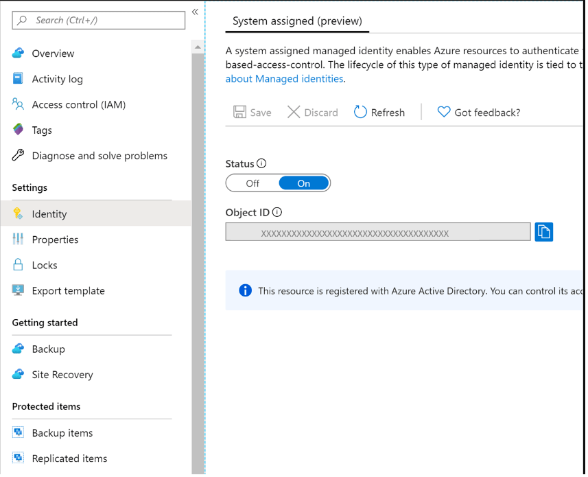 

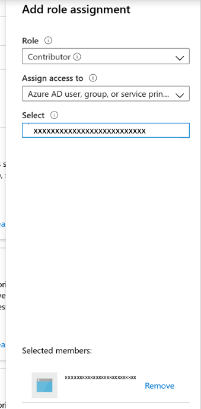 

**_Step 1:_** Navigate to created vault and go to Private endpoint connections on the left navigation bar. Select `+Private endpoint` on the top to start creating a new private endpoint for this vault. 

**_Step 2:_** Create a private endpoint specify details,(Basics: Fill in the basic details for your private endpoints. The region should be the same as the vault and the resource being backed up.) 
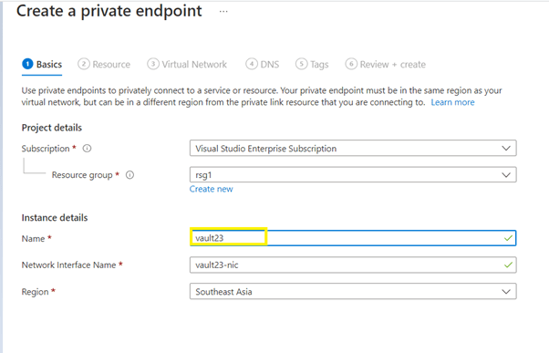 

**_Step 3:_** In Resource tab,Select the resource type as Microsoft.RecoveryServices/vaults from the dropdown list. Once done, choose the name of your Recovery Services vault as the Resource and AzureBackup as the Target sub-resource. 
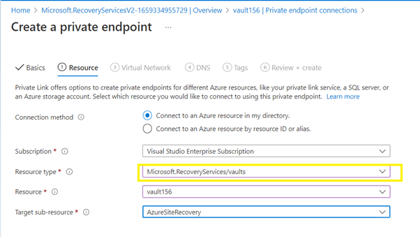 

**_Step 4:_** In the DNS tab section it will show private connection and then click review and create. 
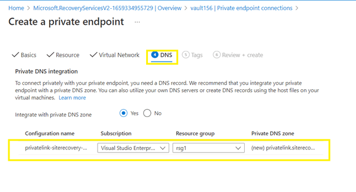

**_Step 5:_** Newly created private endpoints are listed under Private endpoint connections .The owner of the vault must approve the private endpoint before being able to use it. However ,If the user creating the private endpoint is also the owner of the Recovery Services vault, the private endpoint created above will be auto-approved as shown in the image below  
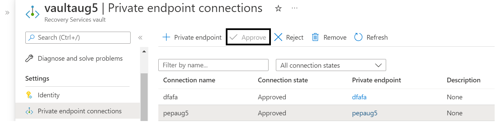

  

### 2. Ensure data in Recovery services is Encrypted with Organization Managed Keys

**Security Control Mapping :**

| Control Number | Control Statement | Security Domain | Default | Associated Runbook | CVSS Severity  |
| -------------- | ----------------- | --------------- | ------- | ------------------ | -------------- |
|  [CS0012168](place holder)       |Strong encryption key management controls are in place for cloud provider services to protect data at rest | Data Protection  | Not enabled | None | [Medium (5.3)](https://www.first.org/cvss/calculator/3.1#CVSS:3.1/AV:A/AC:H/PR:H/UI:N/S:U/C:H/I:L/A:L)  |

**Why?**

Data encryption with organization-managed keys for Azure Database for PostgreSQL Single server enables to use Enterprise keys for data protection at rest. It also allows organizations to implement separation of duties in the management of keys and data. With customer-managed encryption, Organization is responsible for, and in a full control of, a key's lifecycle, key usage permissions, and auditing of operations on keys

**How?** 

**_Step 1:_** Go to azure portal and create user managed identity. 
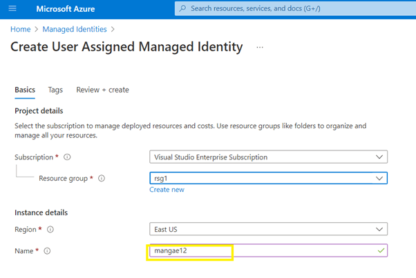  

**_Step 2:_** select recovery service vault and in the left navigation tab choose properties tab and select the encryption settings . 
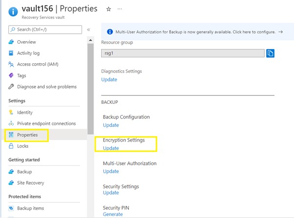   

**_Step 3:_** Create key vault and key 
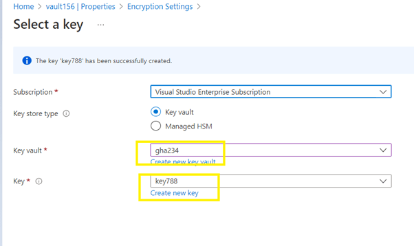   

**_Step 4:_** choose key and click the select from key vault and choose user assigned identity and finally click save.  
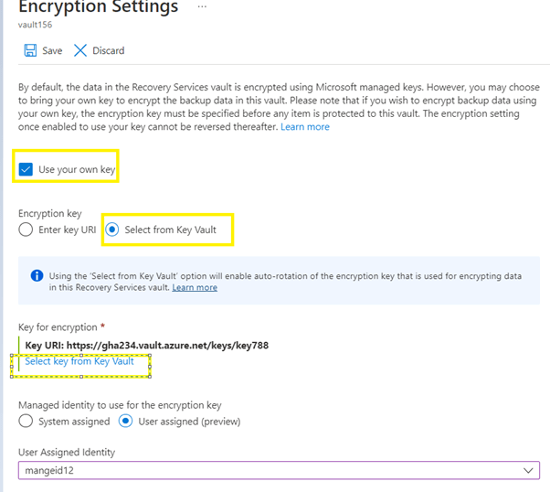   
  

### 3. Ensure Azure Recovery services vault uses standard organizational Resource tagging method

**Security Control Mapping :**  

| Control Number | Control Statement | Security Domain | Default | Associated Runbook | CVSS Severity  |
| -------------- | ----------------- | --------------- | ------- | ------------------ | -------------- |
| CS0012128  | Technology hardware and software must be registered and accurately recorded within the enterprise technology repository and/or asset management systems | Asset Management  | Not enabled | organizational Runbook |  [Low (1.6)](https://www.first.org/cvss/calculator/3.1#CVSS:3.1/AV:P/AC:H/PR:H/UI:N/S:U/C:N/I:N/A:L) |

**Why, What and How ?** 

Client rationale and Justification 
[Placeholder link]

  

### 4. Ensure soft delete for VMS is enabled

**Security Control Mapping :**

| Control Number | Control Statement | Security Domain | Default | Associated Runbook | CVSS Severity  |
| -------------- | ----------------- | --------------- | ------- | ------------------ | -------------- |
|  CS0012168       |Strong encryption key management controls are in place for cloud provider services to protect data at rest | Data Protection  | Not enabled | None | [Medium (5.3)](https://www.first.org/cvss/calculator/3.1#CVSS:3.1/AV:A/AC:H/PR:H/UI:N/S:U/C:H/I:L/A:L)  |

**Why?** 

Soft delete for VMs must be used to protect the backups of your VMs from unintended deletion. Even after the backups are deleted, they're preserved in soft-delete state for 14 additional days.
   

**How?** 

**_Step 1:_** To delete the backup data of a VM, the backup must be stopped. In the Azure portal, go to the Recovery Services vault, right-click on the backup item and choose Stop backup. 
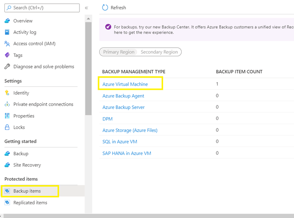   

**_Step 2:_**  An option to delete or retain the backup data is provided. If Retain backup data chosen and then Stop backup, the VM backup won't be permanently deleted.If Delete backup data is chosen, a delete email alert is sent to the configured email ID informing the user that 14 days remain of extended retention for backup data. Also, an email alert is sent on the 12th day informing that there are two more days left to resurrect the deleted data.  
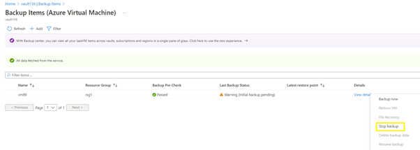   

**_Step 3:_** During those 14 days, in the Recovery Services vault, the soft deleted VM will appear with a red "soft-delete" icon next to it. 
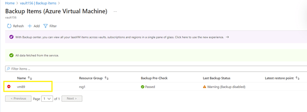   

**_Step 4:_** To restore the soft-deleted VM, it must first be undeleted. To undelete, choose the soft-deleted VM, and then select the option Undelete.
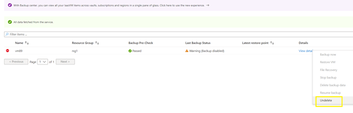   

**_Step 5:_** After the undelete process is completed, the status will return to "Stop backup with retain data" and then you can choose Resume backup. The Resume backup operation brings back the backup item in the active state, associated with a backup policy selected by the user defining the backup and retention schedules.  
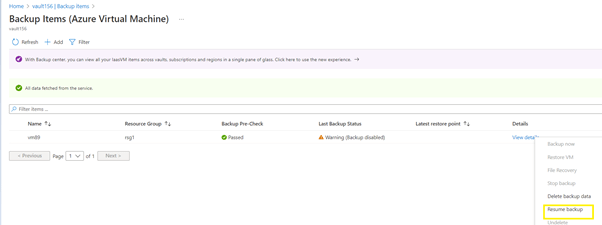   
  

### 5. Ensure delete protection for file shares is enabled to avoid accidental deletion

**Security Control Mapping :**

| Control Number | Control Statement | Security Domain | Default | Associated Runbook | CVSS Severity  |
| -------------- | ----------------- | --------------- | ------- | ------------------ | -------------- |
|  CS0012168       |Strong encryption key management controls are in place for cloud provider services to protect data at rest | Data Protection  | Not enabled | None | [Medium (5.3)](https://www.first.org/cvss/calculator/3.1#CVSS:3.1/AV:A/AC:H/PR:H/UI:N/S:U/C:H/I:L/A:L)  |

**Why?** 

To provide protection against cyber attacks or accidental deletion, soft delete is enabled for all file shares in a storage account when you configure backup for any file share in the respective storage account. With soft delete, even if a malicious actor deletes the file share, the file share’s contents and recovery points (snapshots) are retained for a minimum of 14 additional days, allowing the recovery of file shares with no data loss.

**How?**  

**_Step 1:_** Go to Azure portal and search for Storage account and click on it. 
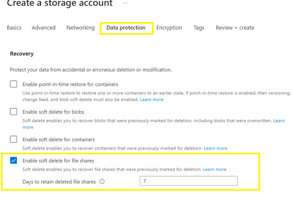   

**_Step 2:_** Click on add and under basic tab, choose (subscription, resource group,name of storage account,location etc.) then under data protection tab check the "Turn on soft delete for File shares" and  choose the retention period for 7 days or maximum for 365 days and create the account. 
   

**_Step 3:_** now click on the file shares option in storage account and add any file (choose name,quota,tier) and add it.Now if the file share is deleted it will not be permanently deleted.It will be in soft delete for the selected retention period 

  

### 6. Ensure Diagnostic logs are enabled for Recovery services vault

**Security Control Mapping :**

| Control Number | Control Statement | Security Domain | Default | Associated Runbook | CVSS Severity  |
| -------------- | ----------------- | --------------- | ------- | ------------------ | -------------- |
| CS0012233 | Information System must create a log and record activities occurring on or originating from the information system. Logs must be made accessible to the enterprise SIEM solution  | Security Information and event management  | Not Enabled | Network Watcher Runbook | [Low (2.7)](https://www.first.org/cvss/calculator/3.1#CVSS:3.1/AV:P/AC:H/PR:H/UI:N/S:U/C:L/I:N/A:L) |

**Why?**

Diagnostic settings are used to configure streaming export of platform logs and metrics for a resource to the destination of your choice. You may create up to five different diagnostic settings to send different logs and metrics to independent destinations

**How?**

**_Step 1:_** Sign in to the Azure portal Select the recovery service vault.In the left navigation panel choose Diagnostic setting tab and click on +Add Diagnostic setting.  
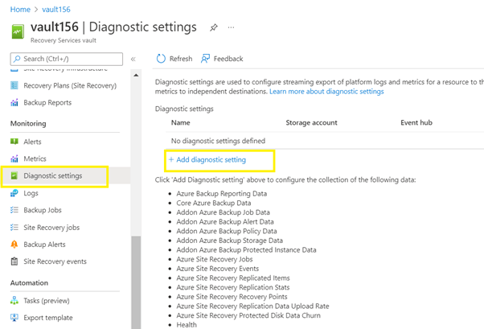   

**_Step 2:_** 	Enter a name for the diagnostic setting. Select all logs and in the destination detail choose stream to an hub  
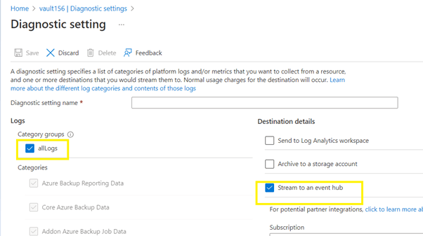   

  

### 7. Ensure application access to Azure Recovery services vault is granted using Managed Identities

**Security Control Mapping :**

| Control Number | Control Statement | Security Domain | Default | Associated Runbook | CVSS Severity  |
| -------------- | ----------------- | --------------- | ------- | ------------------ | -------------- |
|  CS0012298       | Access to change cloud identity access and service control policies is restricted to authorized cloud administrative personnel |Identity & Access Management | Not enabled | None | [Medium (5.1)](https://www.first.org/cvss/calculator/3.1#CVSS:3.1/AV:A/AC:H/PR:H/UI:N/S:C/C:L/I:L/A:L) 

**Why?**

Managed identity enables Azure resources to authenticate to cloud services (e.g. Azure Key Vault) without storing credentials in code. Once enabled, all necessary permissions can be granted via Azure role-based-access-control. 

**How?**

**_Step 1:_** Go to your Recovery Services vault and click on Identity and choose System assigned and save. 
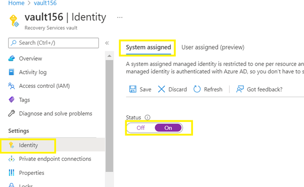   

**_Step 2:_** select the yes button it enables assigned managed identity  
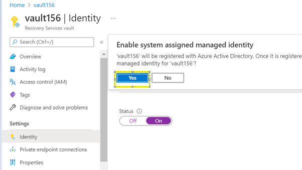  

 

### 8. Ensure Multi-user authorization is configured using Resource Guard in Azure Backup

**Security Control Mapping :**

| Control Number | Control Statement | Security Domain | Default | Associated Runbook | CVSS Severity  |
| -------------- | ----------------- | --------------- | ------- | ------------------ | -------------- |
|  CS0012298       | Access to change cloud identity access and service control policies is restricted to authorized cloud administrative personnel |Identity & Access Management | Not enabled | None | [Medium (5.1)](https://www.first.org/cvss/calculator/3.1#CVSS:3.1/AV:A/AC:H/PR:H/UI:N/S:C/C:L/I:L/A:L)
 

**Why?**

Multi-user authorization (MUA) for Backup is used to add an additional layer of protection for critical operations on your Recovery Services vaults. For this, Backup uses a Resource Guard to ensure critical operations are performed only with proper authorization. With this, Azure Backup helps provide improved protection against operations that could lead to potential loss of backup data, including:

**How?** 

**_Step 1:_** In the Azure portal, go to the directory under which you wish to create the Resource Guard. 
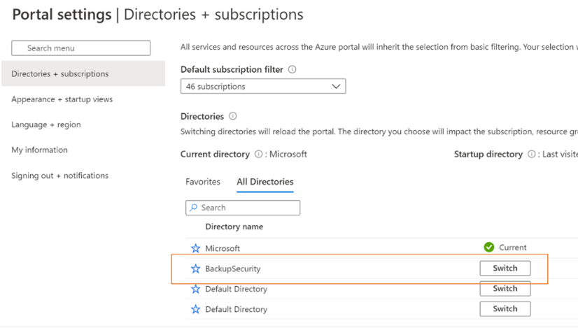   

**_Step 2:_** Search for Resource Guards in the search bar and select the corresponding item from the drop-down. 
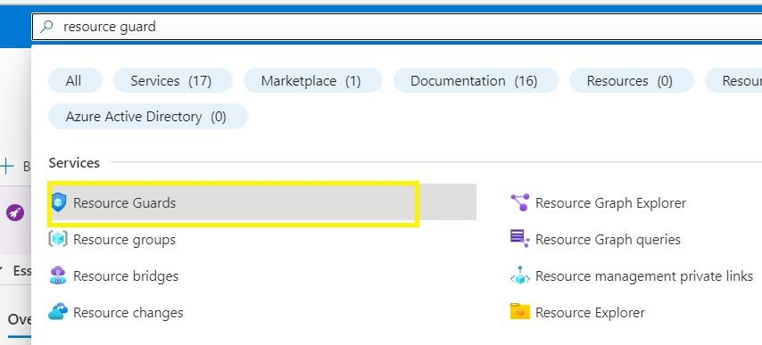   

**_Step 3:_** Click Create to start creating a Resource Guard. On the Protected operations tab, select the operations you need to protect using this resource guard. 
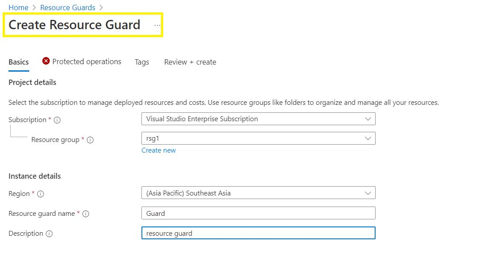   

**_Step 4:_** In the created Resource Guard created, Select Disable for operations that you wish to exclude from being authorized using the Resource Guard.
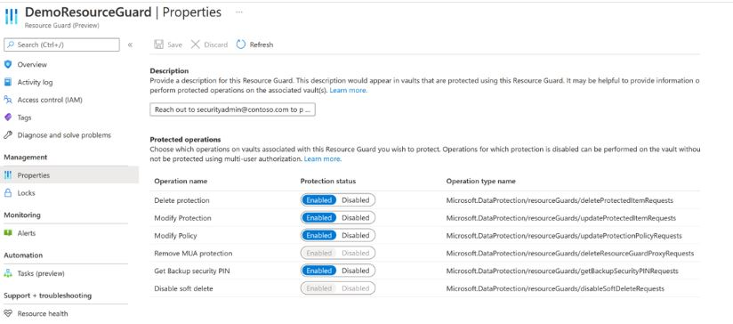   

**_Step 5:_** In the Resource Guard created go to the Access Control (IAM) blade, and then go to Add role assignment.  

**_Step 6:_** Select Reader from the list of built-in roles add the Backup admin’s email ID to add them as the Reader.
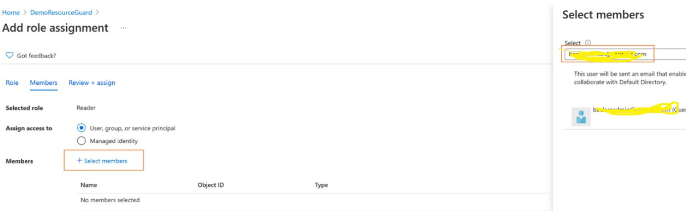  

**_Step 7:_** Go to the Recovery Services vault. Go to Properties on the left navigation panel, then to Multi-User Authorization and click Update.  

**_Step 8:_** Click Save once done to enable MUA.
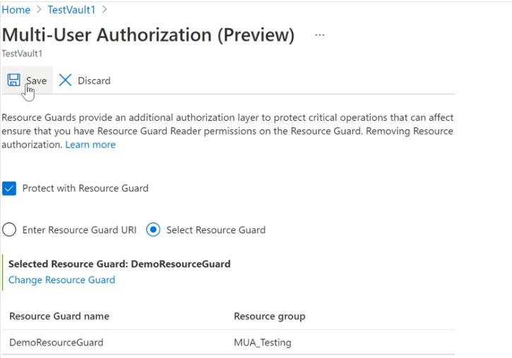

  

### 9. Ensure to Protect important folders with controlled folder access.

**Security Control Mapping :**  

| Control Number | Control Statement | Security Domain | Default | Associated Runbook | CVSS Severity  |
| -------------- | ----------------- | --------------- | ------- | ------------------ | -------------- |
|  CS0012168       |Strong encryption key management controls are in place for cloud provider services to protect data at rest | Data Protection  | Not enabled | None | [Medium (5.3)](https://www.first.org/cvss/calculator/3.1#CVSS:3.1/AV:A/AC:H/PR:H/UI:N/S:U/C:H/I:L/A:L)  |

**Why?** 

Controlled folder access helps you protect valuable data from malicious apps and threats, such as ransomware. Controlled folder access is included with Windows 10, Windows 11, and Windows Server 2019. Controlled folder access is also included as part of the modern, unified solution for Windows Server 2012R2 and 2016.

**How?**  

**_Step 1:_**  Type powershell in the Start menu, right-click Windows PowerShell and select Run as administrator. 

**_Step 2:_** Enter the following cmdlet: 
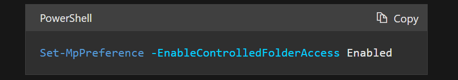   

**_Step 3:_**  You can enable the feature in audit mode by specifying AuditMode instead of Enabled.  
Use Disabled to turn off the feature. 

   

### 10. Ensure monitor based alerts are used to used to mitigate application failures
    
**Security Control Mapping :**  

| Control Number | Control Statement | Security Domain | Default | Associated Runbook | CVSS Severity  |
| -------------- | ----------------- | --------------- | ------- | ------------------ | -------------- |
| CS0012233 | Information System must create a log and record activities occurring on or originating from the information system. Logs must be made accessible to the enterprise SIEM solution  | Security Information and event management   | Enabled but not forwarded to Splunk | None | [Low (2.7)](https://www.first.org/cvss/calculator/3.1#CVSS:3.1/AV:P/AC:H/PR:H/UI:N/S:U/C:L/I:N/A:L) |

**Why?** 

Built-in Azure Monitor alerts are generated for job failures by default. If you want to turn off alerts for these scenarios, you can edit the monitoring settings property of the vault accordingly.

**How?**  

**_Step 1:_** Go to Azure Recovery Services Vault and select your vault and select Properties. 
**_Step 2:_** Locate the Monitoring Settings vault property and select Update. 
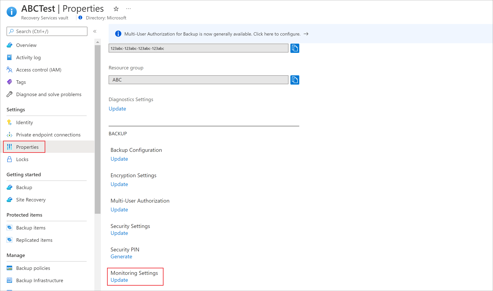   

**_Step 3:_** In the context pane, select the appropriate options to enable/disable built-in Azure Monitor alerts for job failures depending on your requirement. 
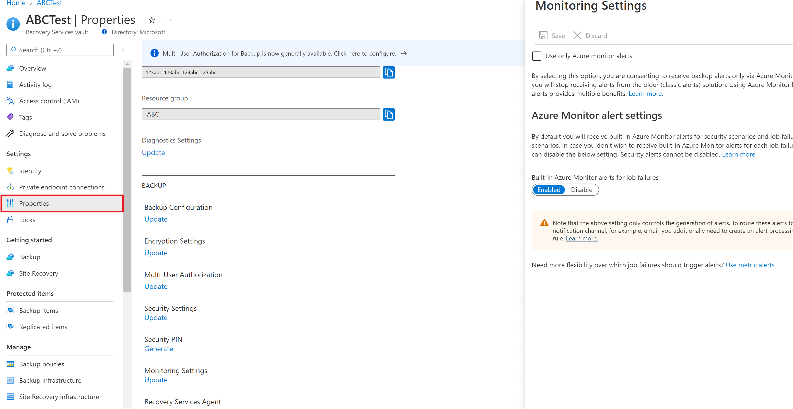   

**_Step 4:_** We also recommend you to select the checkbox Use only Azure Monitor alerts. 
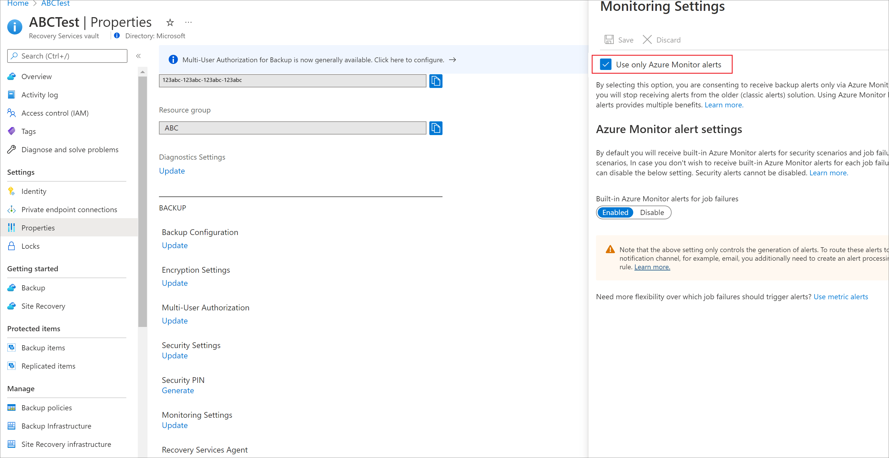   

By selecting this option, you are consenting to receive backup alerts only via Azure Monitor and you will stop receiving alerts from the older classic alerts solution.

**_Step 5:_** Select Update to save the setting for the vault.   
For more details on monitor alerts follow (https://docs.microsoft.com/en-us/azure/backup/backup-azure-monitoring-built-in-monitor?tabs=recovery-services-vaults)   

  

### 11. Ensure Service tags are enabled for the Azure Recovery Services vault.

**Security Control Mapping :**  
| Control Number | Control Statement | Security Domain | Default | Associated Runbook | CVSS Severity  |
| -------------- | ----------------- | --------------- | ------- | ------------------ | -------------- |
| CS0012128  | Technology hardware and software must be registered and accurately recorded within the enterprise technology repository and/or asset management systems | Asset Management  | Not enabled | organizational Runbook | [Low (1.6)](https://www.first.org/cvss/calculator/3.1#CVSS:3.1/AV:P/AC:H/PR:H/UI:N/S:U/C:N/I:N/A:L) |

**Why?** 
  
A service tag represents a group of IP address prefixes from a given Azure service. Azure Virtual Network service tags must be used to define network access controls for Key Vault resources in NSGs or Azure Firewall. Service tags can be used in place of specific IP addresses when creating security rules. 

**How?**  

**_Step 1:_** Select the network security group and choose outbound tab select Add button  and choose source as Service tag and provide source and destination details.  

   
 

   
    

### 12. Ensure Azure Recovery Services vault implements Role Based Access Control.
    
**Security Control Mapping :**  
| Control Number | Control Statement | Security Domain | Default | Associated Runbook | CVSS Severity  |
| -------------- | ----------------- | --------------- | ------- | ------------------ | -------------- |
| [CS0012300](place holder) | Cloud products and services must be deployed on private subnets and public access must be disabled for these services |Identity & Access Management | Not enabled | Virtual Network Runbook | [Medium (5.2)](https://www.first.org/cvss/calculator/3.1#CVSS:3.1/AV:L/AC:H/PR:H/UI:N/S:U/C:L/I:H/A:L) |

[Place Holder ]

**Following are the suggested RBAC roles for Azure Database for Recovery services vault**  

| Function | Description | Role | 
| -------------- | ----------------- | --------------- | 
|  Backup Contributor | 	Lets you manage backup service, but can't create vaults and give access to others | [Backup Contributor](https://github.com/MicrosoftDocs/azure-docs/blob/main/articles/role-based-access-control/built-in-roles.md#backup-contributor) |
|  Backup Operator | 	Lets you manage backup services, except removal of backup, vault creation and giving access to others | [Backup Operator](https://github.com/MicrosoftDocs/azure-docs/blob/main/articles/role-based-access-control/built-in-roles.md#backup-operator) |
|  Backup Reader | Can view backup services, but can't make changes | [Backup Reader](https://github.com/MicrosoftDocs/azure-docs/blob/main/articles/role-based-access-control/built-in-roles.md#backup-reader) |
|  Site Recovery Contributor | 	Lets you manage Site Recovery service except vault creation and role assignment | [Site Recovery Contributor](https://github.com/MicrosoftDocs/azure-docs/blob/main/articles/role-based-access-control/built-in-roles.md#site-recovery-contributor) |
|  Site Recovery Operator | 	Lets you failover and failback but not perform other Site Recovery management operations | [Site Recovery Operator](https://github.com/MicrosoftDocs/azure-docs/blob/main/articles/role-based-access-control/built-in-roles.md#site-recovery-operator) |
|  Site Recovery Reader | Lets you view Site Recovery status but not perform other management operation | [Site Recovery Reader](https://github.com/MicrosoftDocs/azure-docs/blob/main/articles/role-based-access-control/built-in-roles.md#site-recovery-reader) |

  ) 

### 13. Ensure Activity Logging for 'Recovery Services Vault is enabled and are forwarded to Splunk.
   
**Security Control Mapping :**  
| Control Number | Control Statement | Security Domain | Default | Associated Runbook | CVSS Severity  |
| -------------- | ----------------- | --------------- | ------- | ------------------ | -------------- |
| CS0012233 | Information System must create a log and record activities occurring on or originating from the information system. Logs must be made accessible to the enterprise SIEM solution  | Security Information and event management   | Enabled but not forwarded to Splunk | None | [Low (2.7)](https://www.first.org/cvss/calculator/3.1#CVSS:3.1/AV:P/AC:H/PR:H/UI:N/S:U/C:L/I:N/A:L) |

**Why, What and How ?** 
  
Client rationale and Justification  
[Placeholder link]
  

