# Azure SQL Database - Security baseline requirement <!-- omit in toc -->
## Baseline security configuration requirement for Azure services  <!-- omit in toc -->

**Generated By: EY Security Team**  
**Service Type: Database**  
**Deployment Phase: Service Discovery**   
**Last updated: 06/23/2022**  

## Table of Contents <!-- omit in toc -->

- [Overview](#overview)
  - [Use Case Examples:](#use-case-examples)
- [Cloud Security Requirements](#cloud-security-requirements)
  - [1. Ensure that 'Auditing' is set to 'On' at server level and Retention is 'greater than 90 days'](#1-ensure-that-auditing-is-set-to-on-at-server-level-and-retention-is-greater-than-90-days)
  - [2. Ensure SQL Database connections are encrypted in transit using TLS1.2](#2-ensure-sql-database-connections-are-encrypted-in-transit-using-tls12)
  - [3. Ensure Azure SQL Server is protected using Private Endpoints](#3-ensure-azure-sql-server-is-protected-using-private-endpoints)
  - [4. Ensure that 'Transparent data encryption' is enabled using Organization's Manged keys (CMK)](#4-ensure-that-transparent-data-encryption-is-enabled-using-organizations-manged-keys-cmk)
  - [5. Ensure organizational Anti-malware and vulnerability tools are enabled for Azure SQL Server](#5-ensure-organizational-anti-malware-and-vulnerability-tools-are-enabled-for-azure-sql-server)
  - [6. Ensure application level access is granted using Managed Identities](#6-ensure-application-level-access-is-granted-using-managed-identities)
  - [7. Ensure File-snapshot backups of Azure SQL database are stored in private page blob](#7-ensure-file-snapshot-backups-of-azure-sql-database-are-stored-in-private-page-blob)
  - [8. Ensure least privilege access method for SQL Server is implemented using Role-based access control (RBAC)](#8-ensure-least-privilege-access-method-for-sql-server-is-implemented-using-role-based-access-control-rbac)
  - [9. Ensure that Azure SQL database access is granted using Azure Active Directory](#9-ensure-that-azure-sql-database-access-is-granted-using-azure-active-directory)
  - [10. Ensure that Azure SQL Database uses standard organizational Resource tagging method](#10-ensure-that-azure-sql-database-uses-standard-organizational-resource-tagging-method)
  - [11. Ensure Activity logging is enabled for Azure SQL database](#11-ensure-activity-logging-is-enabled-for-azure-sql-database)

##  Overview

Azure Virtual Network (VNet) is the fundamental building block for your private network in Azure. Azure virtual network enables Azure resources to securely communicate with each other, the internet, and on-premises networks in order to filter network traffic, route network traffic, and integration with Azure services.

| Control Number | Cloud Baseline Security Requirements                                                                      |
| -------------- | --------------------------------------------------------------------------------------------------------- |
| 1              | Ensure that 'Auditing' is set to 'On' at server level and Retention is 'greater than 90 days'             |
| 2              | Ensure SQL Database connections are encrypted in transit using TLS1.2                                     |
| 3              | Ensure Azure SQL Server is protected using Private Endpoints                                              |
| 4              | Ensure that 'Transparent data encryption' is enabled using Organization's Manged keys (CMK)               |
| 5              | Ensure organizational Anti-malware and vulnerability tools are enabled for Azure SQL Server               |
| 6              | Ensure application level access is granted using Managed Identities                                       |
| 7              | Ensure File-snapshot backups of Azure SQL database are stored in private page blob                        |
| 8              | Ensure least privilege access method for SQL Server is implemented using Role-based access control (RBAC) |
| 9              | Ensure that Azure SQL database access is granted using Azure Active Directory                             |
| 10             | Ensure that Azure SQL Database uses standard organizational Resource tagging method                       |
| 11             | Ensure Activity logging is enabled for Azure SQL database                                                 |

### Use Case Examples:
- AI-based footfall detection
- Elastic Workplace Search on Azure
- SAP workload automation using SUSE on Azure
- Zero-trust network for web applications with Azure Firewall and Application Gateway
- Unisys ClearPath Forward mainframe rehost to Azure using Unisys virtualization

## Cloud Security Requirements ##

### 1. Ensure that 'Auditing' is set to 'On' at server level and Retention is 'greater than 90 days' 

**Security Control Mapping :** 

| Control Number | Control Statement | Security Domain | Default | Associated Runbook | CVSS Severity  |
| -------------- | ----------------- | --------------- | ------- | ------------------ | -------------- |
| CS0012300 | Cloud products and services must be deployed on private subnets and public access must be disabled for these services | Network Security | Not enabled | Virtual Network Runbook |[Medium (5.3)](https://www.first.org/cvss/calculator/3.1#CVSS:3.1/AV:L/AC:L/PR:L/UI:N/S:U/C:L/I:L/A:L) |

**Why?**

Auditing for the Azure SQL database is enabled at the server level ensuring that all existing and newly created databases on the SQL server instance are audited. Audit can be used to track the database events and writes them to an audit log in the Azure storage account. Audit can also help to maintain regulatory compliance, understand database activity, and gain insight into discrepancies and anomalies that could indicate business concerns or suspected security violations.

**How?** 

**_Step 1_** Open Azure portal https://portal.azure.com/  

**_Step 2_** Click on all resources and select SQL server resource created 

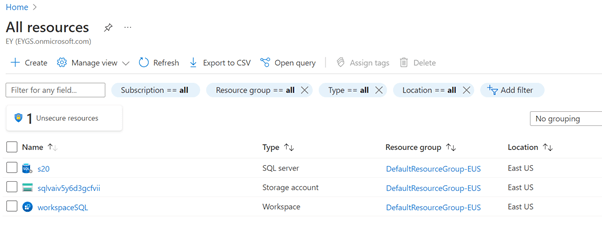 

**_Step 3_** Click on SQL server resource and select auditing option from left hand pane. 

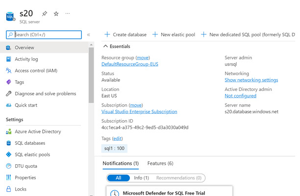 

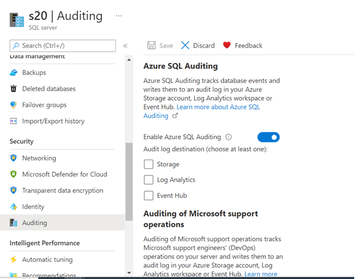 

**_Step 4_** Enable Azure SQL auditing option and provide audit log destination ( Choose at least one), Storage, Log Analytics, Event hub.

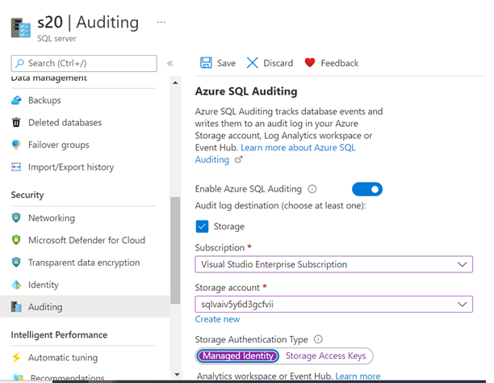 

### 2. Ensure SQL Database connections are encrypted in transit using TLS1.2 

**Security Control Mapping :**  

| Control Number | Control Statement | Security Domain | Default | Associated Runbook | CVSS Severity  |
| -------------- | ----------------- | --------------- | ------- | ------------------ | -------------- |
| CS0012300 | Cloud products and services must be deployed on private subnets and public access must be disabled for these services | Network Security | Not enabled | Virtual Network Runbook |[High (8.2)](https://www.first.org/cvss/calculator/3.1#CVSS:3.1/AV:A/AC:L/PR:L/UI:N/S:C/C:H/I:L/A:L) |

**Why?**

Some of the use cases of data in transit are authentication of database credentials against the Azure Active directory or communication between database and other applications. TLS 1.2 must be used as the secure encryption in transit for all the SQL Database connections to improve the security posture of the environment and also to remain in compliance with industry standards or organization requirements

**How?** 

**_Step 1_** Open Azure portal https://portal.azure.com/  

**_Step 2_** Click on all resources and select SQL server resource created 

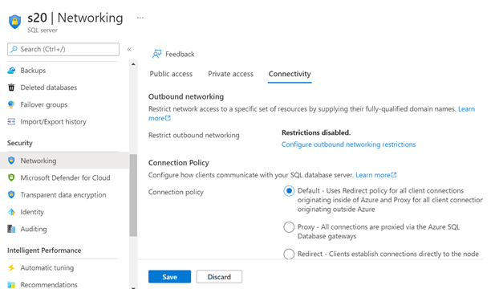 

**_Step 3_** Select Networking , goto connectivity option , select encryption in transit and select TLS1.2 

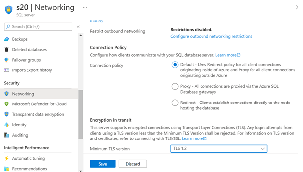 

### 3. Ensure Azure SQL Server is protected using Private Endpoints

**Security Control Mapping :** 

| Control Number | Control Statement | Security Domain | Default | Associated Runbook | CVSS Severity  |
| -------------- | ----------------- | --------------- | ------- | ------------------ | -------------- |
| CS0012300 | Cloud products and services must be deployed on private subnets and public access must be disabled for these services | Network Security | Not enabled | Virtual Network Runbook |[Critical (9.1)](https://www.first.org/cvss/calculator/3.1#CVSS:3.1/AV:N/AC:L/PR:L/UI:N/S:C/C:L/I:L/A:H) |

**Why?**

private endpoint will provide a endpoint with Private IP which can be associated with VNet with in tenant  A FQDN record will be created in Azure DNS to enable other tenants VNets to be associated with Azure SQL server.  This ensures that all workload data is being accessed securely over Azure network backbone.
Azure Virtual network securely enables the communication of Azure SQL Databases with communication between Azure resources, on-premises resources through Spoke-hub network. Spoke VNet uses NSG to filter network traffic from other Azure resource. The access to Database should be granted only to selected Vnets with in Organization's Azure Tenant and should not use SQL Server firewall feature to allow access to IP.

**How?** 

**_Step 1_** Open Azure portal https://portal.azure.com/  

**_Step 2_** Click on create a resource and type virtual network and select virtual network option from drop down. Provide name of the virtual network and click review + create and click create. A virtual network will be created. 

**_Step 3_** Click on all resources and select SQL server resource created and select networking option. 

**_Step 4_** In public access option click disable and goto private access, it will ask to create a private end point and in Virtual Network option select Vnet created earlier. 

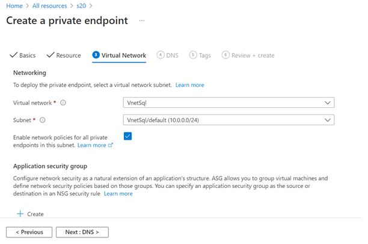 

### 4. Ensure that 'Transparent data encryption' is enabled using Organization's Manged keys (CMK)

**Security Control Mapping :** 

| Control Number | Control Statement | Security Domain | Default | Associated Runbook | CVSS Severity  |
| -------------- | ----------------- | --------------- | ------- | ------------------ | -------------- |
|  CS0012168       |Strong encryption key management controls are in place for cloud provider services to protect data at rest | Data Protection  | Not enabled | None |[High (7.6)](https://www.first.org/cvss/calculator/3.1#CVSS:3.1/AV:A/AC:L/PR:L/UI:N/S:U/C:H/I:H/A:L) |

**Why?**
 
Azure SQL Database transparent data encryption helps protect against the threat of malicious activity by performing real-time encryption and decryption of the database, associated backups, and transaction log files at rest without requiring changes to the application.
 
**How?** 

**_Step 1_** Open Azure portal https://portal.azure.com/  

**_Step 2_** Click on all resources and select SQL server resource created 

**_Step 3_** Goto Transparent data encryption tab and select customer managed key 

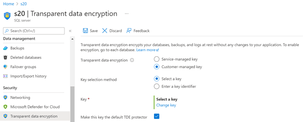 

### 5. Ensure organizational Anti-malware and vulnerability tools are enabled for Azure SQL Server

**Security Control Mapping :**  
| Control Number | Control Statement | Security Domain | Default | Associated Runbook | CVSS Severity  |
| -------------- | ----------------- | --------------- | ------- | ------------------ | -------------- |
|  CS0012268     | Vulnerability assessments must be performed based on risk and findings must be addressed in accordance with enterprise SLA's | Vulnerability Management | Not enabled | None | [Medium (5.0)](https://www.first.org/cvss/calculator/3.1#CVSS:3.1/AV:L/AC:H/PR:H/UI:N/S:C/C:L/I:L/A:L) |

**Why?**

Organization Anti malware and vulnerability tools are the required security intelligence that detects unusual and potentially harmful attempts to access or exploit the Key vaults. It uses advanced threat detection capabilities and Microsoft Threat Intelligence data to provide contextual security alerts. Those alerts also include steps to mitigate the detected threats and prevent future attacks. Microsoft Defender for SQL must be enabled at either the subscription level (recommended) or the resource level to analyze ,detect and remediate the threats.

**How?** 

**_Step 1_** From the Azure portal, open Defender for Cloud. 

**_Step 2_** From Defender for Cloud's menu, select Pricing and settings. 

**_Step 3_** Select the relevant subscription. 

**_Step 4_** Change the plan setting to On. 

**_Step 5_** Select Save. 

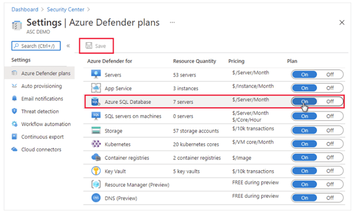 

### 6. Ensure application level access is granted using Managed Identities

**Security Control Mapping :** 

| Control Number | Control Statement | Security Domain | Default | Associated Runbook | CVSS Severity  |
| -------------- | ----------------- | --------------- | ------- | ------------------ | -------------- |
|  CS0012298       | Access to change cloud identity access and service control policies is restricted to authorized cloud administrative personnel |IAM | Not enabled | None |[High (8.2)](https://www.first.org/cvss/calculator/3.1#CVSS:3.1/AV:A/AC:L/PR:L/UI:N/S:C/C:H/I:L/A:L) |

**Why?**

Managed identity enables Azure resources to authenticate to cloud services (e.g. Azure Key Vault) without storing credentials in code. Once enabled, all necessary permissions can be granted via Azure role-based-access-control. In system assigned managed identity, 
the lifecycle of this type of managed identity is tied to the lifecycle of this resource. Additionally, each resource (e.g. Virtual Machine) can only have one system assigned managed identity. In User assigned managed identity, managed identities are created as standalone Azure resources, and have their own lifecycle. A single resource (e.g. Virtual Machine) can utilize multiple user assigned managed identities. Similarly, a single user assigned managed identity can be shared across multiple resources.

**How?** 

**_Step 1_** Open Azure portal https://portal.azure.com/  

**_Step 2_** Click on all resources and select SQL server resource created  

**_Step 3_** Select identity tab and select system assigned managed identity  

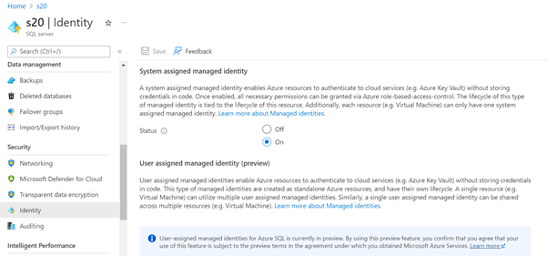  

**_Step 4_** Select user assigned managed identity and click Add button to add user-id  

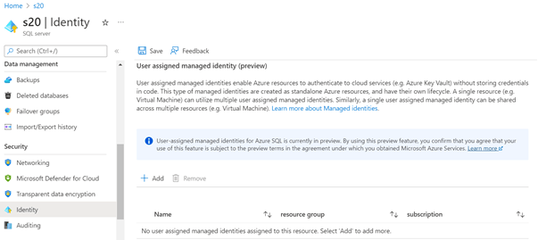 

### 7. Ensure File-snapshot backups of Azure SQL database are stored in private page blob

**Security Control Mapping :** 

| Control Number | Control Statement | Security Domain | Default | Associated Runbook | CVSS Severity  |
| -------------- | ----------------- | --------------- | ------- | ------------------ | -------------- |
|  CS0012142       |Backups must adhere to enterprise backup and retention requirements | Data Protection  | Not enabled | None |[Medium (6.6)](https://www.first.org/cvss/calculator/3.1#CVSS:3.1/AV:N/AC:H/PR:H/UI:N/S:C/C:N/I:L/A:H) |

**Why?**

A file-snapshot backup comprises of a set of Azure snapshots of the blobs containing the database files along with a backup file that contain pointers to these file-snapshots. Each file-snapshot is stored in the container with the page blob. The access to the page blob must be set as private so that the container and blob data can be read by the Azure account owner only.

**How?** 

**_Step 1_** The first thing need to do is set the recovery model to full and establish the transaction log backup chain with a full backup using File-Snapshot. Below are commands for the recovery model to full and creating the first full backup of the database.

— To set the recovery model to full.

USE master;

GO

ALTER DATABASE [MY_DATABASE_NAME]
   SET RECOVERY FULL;

GO
— Create a full backup of the database.

BACKUP DATABASE [MY_DATABASE_NAME]

TO URL = ‘https://<mystorageaccountname>.blob.core.windows.net/<mycontainername>/<mydatabasename>.bak’

WITH FILE_SNAPSHOT;

GO

**_Step 2_** Each transaction log File-Snapshot backup set contains blob snapshots of all database files and can be used to perform a database restore or a log restore. Below are commands for creating a transaction log backup and appending the time to the file name.

— Back up the database log using a time stamp in the backup file name.

DECLARE @Log_Filename AS VARCHAR (300);

SET @Log_Filename = ‘https://<mystorageaccountname>.blob.core.windows.net/<mycontainername>/>/<mydatabasename>_Log_’+
REPLACE (REPLACE (REPLACE (CONVERT (VARCHAR (40), GETDATE (), 120), ‘-‘,’_’),’:’, ‘_’),’ ‘, ‘_’) + ‘.trn’;_

BACKUP LOG [MY_DATABASE_NAME]

TO URL = @Log_Filename WITH FILE_SNAPSHOT;

GO

### 8. Ensure least privilege access method for SQL Server is implemented using Role-based access control (RBAC)

**Security Control Mapping :** 

| Control Number | Control Statement | Security Domain | Default | Associated Runbook | CVSS Severity  |
| -------------- | ----------------- | --------------- | ------- | ------------------ | -------------- |
|  CS0012298	    | Access to change cloud identity access and service control policies is restricted to authorized cloud administrative personnel |  IAM | Not enabled | None |[High (8.3)](https://www.first.org/cvss/calculator/3.1#CVSS:3.1/AV:A/AC:L/PR:L/UI:R/S:C/C:L/I:H/A:H) |

[Place Holder ]

**Following are the suggested RBAC roles for Azure SQL Database**  

| Function | Description | Role | 
| -------------- | ----------------- | --------------- | 
|  SQL Admin | Lets you manage SQL databases, but not access to them. Also, you can't manage their security-related policies or their parent SQL servers | [SQLDBContributor](https://github.com/MicrosoftDocs/azure-docs/blob/main/articles/role-based-access-control/built-in-roles.md#sql-db-contributor) |

### 9. Ensure that Azure SQL database access is granted using Azure Active Directory 

**Security Control Mapping :** 

| Control Number | Control Statement | Security Domain | Default | Associated Runbook | CVSS Severity  |
| -------------- | ----------------- | --------------- | ------- | ------------------ | -------------- |
|  CS0012298	    | Access to change cloud identity access and service control policies is restricted to authorized cloud administrative personnel |  IAM | Not enabled | None |[Low (1.6)](https://www.first.org/cvss/calculator/3.1#CVSS:3.1/AV:P/AC:H/PR:H/UI:N/S:U/C:N/I:N/A:L) |

**Why?**

Azure Active Directory authentication is a mechanism to connect to Microsoft Azure SQL Database and SQL Data Warehouse by using identities in Azure Active Directory (Azure AD). With Azure AD authentication, identities of database users and other Microsoft services can be managed in one central location. Central ID management provides a single place to manage database users and simplifies permission management.

**How?** 
**_Step 1 :_** When creating the SQL Database server,select the authentication method as 'use only Azure AD authentication'  
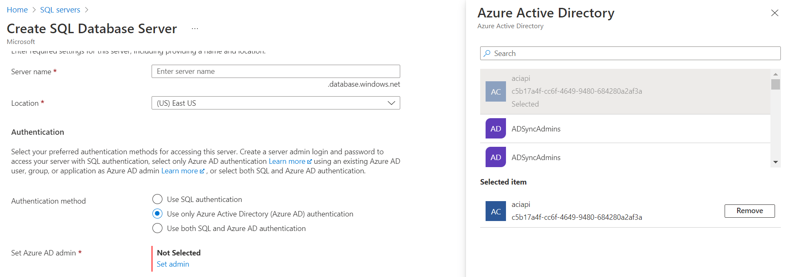 

### 10. Ensure that Azure SQL Database uses standard organizational Resource tagging method

**Security Control Mapping :**  

| Control Number | Control Statement | Security Domain | Default | Associated Runbook | CVSS Severity  |
| -------------- | ----------------- | --------------- | ------- | ------------------ | -------------- |
| CS0012261  | Technology hardware and software must be registered and accurately recorded within the enterprise technology repository and/or asset management systems | Asset Management  | Not enabled | organizational Runbook | [Low (1.6)](https://www.first.org/cvss/calculator/3.1#CVSS:3.1/AV:P/AC:H/PR:H/UI:N/S:U/C:N/I:N/A:L) |

**Why, What and How ?** 
  
Client rationale and Justification
[Placeholder link]

### 11. Ensure Activity logging is enabled for Azure SQL database

**Security Control Mapping :**  
| Control Number | Control Statement | Security Domain | Default | Associated Runbook | CVSS Severity  |
| -------------- | ----------------- | --------------- | ------- | ------------------ | -------------- |
| CS0012233 | Information System must create a log and record activities occurring on or originating from the information system. Logs must be made accessible to the enterprise SIEM solution  | Security Information and event management   | Enabled but not forwarded to Splunk | None | [Low (2.7)](https://www.first.org/cvss/calculator/3.1#CVSS:3.1/AV:P/AC:H/PR:H/UI:N/S:U/C:L/I:N/A:L) |

**Why, What and How ?** 
  
Client rationale and Justification 
[Placeholder link]

  
