# Azure SQL Virtual Machine - Security baseline requirement <!-- omit in toc -->
## Baseline security configuration requirement for Azure services  <!-- omit in toc -->

**Generated By: EY Security Team**  
**Service Type: Databases**  
**Deployment Phase: Service Discovery**   
**Last updated: 04/29/2022**  

## Table of Contents <!-- omit in toc -->

- [Overview](#overview)
  - [Use Case Examples:](#use-case-examples)
- [Cloud Security Requirements](#cloud-security-requirements)
  - [1. Ensure that SQL VM secrets are vaulted securely in Azure Key vault](#1-ensure-that-sql-vm-secrets-are-vaulted-securely-in-azure-key-vault)
  - [2. Ensure managed disk in Azure SQL VM is Encrypted with Customer Managed Keys](#2-ensure-managed-disk-in-azure-sql-vm-is-encrypted-with-customer-managed-keys)
  - [3. Ensure Azure SQL VM is deployed in the Virtual networks and Network Security Groups are used to protect the Azure SQL VM](#3-ensure-azure-sql-vm-is-deployed-in-the-virtual-networks-and-network-security-groups-are-used-to-protect-the-azure-sql-vm)
  - [4. Ensure SQL VMs are not associated with any public IP address](#4-ensure-sql-vms-are-not-associated-with-any-public-ip-address)
  - [5. Ensure SQL Virtual Machine are constantly scanned by Malware and Vulnerability scanning tool](#5-ensure-sql-virtual-machine-are-constantly-scanned-by-malware-and-vulnerability-scanning-tool)
  - [6. Ensure least privilege access method for SQL Server is implemented using Role-based access control (RBAC)](#6-ensure-least-privilege-access-method-for-sql-server-is-implemented-using-role-based-access-control-rbac)
  - [7. Ensure that Azure SQL VM uses standard organizational Resource tagging method](#7-ensure-that-azure-sql-vm-uses-standard-organizational-resource-tagging-method)
  - [8. Ensure only organization approved SQL VM images are used for deployment](#8-ensure-only-organization-approved-sql-vm-images-are-used-for-deployment)
  - [9. Ensure Trusted Launch is enabled for Azure Virtual machine](#9-ensure-trusted-launch-is-enabled-for-azure-virtual-machine)
  - [10. Ensure Activity logging is enabled for Azure SQL Virtual Machine](#10-ensure-activity-logging-is-enabled-for-azure-sql-virtual-machine)

##  Overview

SQL virtual machines resource is an independent management service to manage SQL Server on Azure Virtual Machines (VMs) that have been registered with the SQL Server IaaS Agent extension. Azure only maintains one virtual machine image for each supported operating system, version, and edition combination. 

| Control Number | Cloud Baseline Security Requirements                                                                                     |
| -------------- | ------------------------------------------------------------------------------------------------------------------------ |
| 1              | Ensure that SQL VM secrets are vaulted securely in Azure Key vault                                                       |
| 2              | Ensure managed disk in Azure SQL VM is Encrypted with Customer Managed Keys                                              |
| 3              | Ensure Azure SQL VM is deployed in the Virtual networks and Network Security Groups are used to protect the Azure SQL VM |
| 4              | Ensure SQL VMs are not associated with any public IP address                                                             |
| 5              | Ensure SQL Virtual Machine are constantly scanned by Malware and Vulnerability scanning tool                             |
| 6              | Ensure least privilege access method for SQL Server is implemented using Role-based access control (RBAC)                |
| 7              | Ensure that Azure SQL VM uses standard organizational Resource tagging method                                            |
| 8              | Ensure only organization approved SQL VM images are used for deployment                                                  |
| 9              | Ensure Trusted Launch is enabled for Azure Virtual machine                                                               |
| 10             | Ensure Activity logging is enabled for Azure SQL Virtual Machine                                                         |

### Use Case Examples:
- SQL Server on Azure Virtual Machines with Azure NetApp Files
- Micro Focus Enterprise Server on Azure VMs
- Web application with relational database

## Cloud Security Requirements ##

### 1. Ensure that SQL VM secrets are vaulted securely in Azure Key vault

**Security Control Mapping :**  
| Control Number | Control Statement | Security Domain | Default | Associated Runbook | CVSS Severity  |
| -------------- | ----------------- | --------------- | ------- | ------------------ | -------------- |
|  CS0012168       |Strong encryption key management controls are in place for cloud provider services to protect data at rest | Data Protection  | Not enabled | None | [Medium (5.3)](https://www.first.org/cvss/calculator/3.1#CVSS:3.1/AV:A/AC:H/PR:H/UI:N/S:U/C:H/I:L/A:L)  |

**Why?**   

Azure SQL VM transparent data encryption helps protect against the threat of malicious activity by performing real-time encryption and decryption of the database, associated backups, and transaction log files at rest without requiring changes to the application.
 
**How?**  

Since SQL VM does not support transparent data encryption, this requirement is achieved using encrypting the SQL DB using Azure Key Vault. How section provides details on how to encryt SQL server using Keyvault.

**_Step 1:_** While creating the SQL VM , Navigate to the SQL Server Settings tab and enable 'Azure Key Vault Integration' and fil the corresponding parameters  

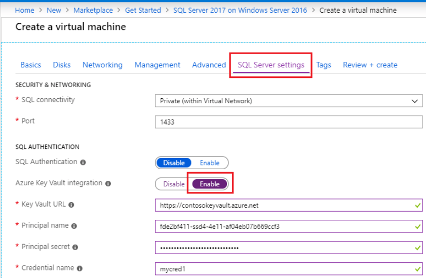 

**_Step 2:_** For existing SQL VM , Navigate to the Security tab and enable 'Azure Key Vault Integration'.  

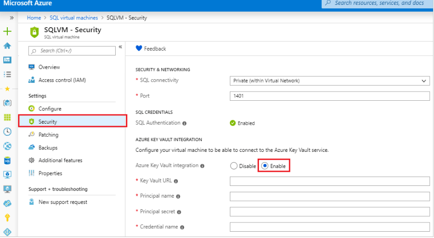 

   

### 2. Ensure managed disk in Azure SQL VM is Encrypted with Customer Managed Keys ###

**Security Control Mapping :**  
| Control Number | Control Statement | Security Domain | Default | Associated Runbook | CVSS Severity  |
| -------------- | ----------------- | --------------- | ------- | ------------------ | -------------- |
|  CS0012168       |Strong encryption key management controls are in place for cloud provider services to protect data at rest | Data Protection  | Not enabled | None | [Medium (5.3)](https://www.first.org/cvss/calculator/3.1#CVSS:3.1/AV:A/AC:H/PR:H/UI:N/S:U/C:H/I:L/A:L)  |

**Why?**  

By default, data in the Managed disk is encrypted using Microsoft Managed Keys at rest. All Azure Storage resources are encrypted, including blobs, disks, files, queues, and tables. 
All object metadata is also encrypted. However, if you want to control and manage this encryption key yourself, you can specify a customer-managed key, that key is used to protect and control access to the key that encrypts your data. 

**How?**  

**_Step 1:_** Login to Azure portal and select ‘SQL Virtual machines’ from the services. 

 

    
**_Step 2:_**  Create a SQL VM by providing the respective information’s. 

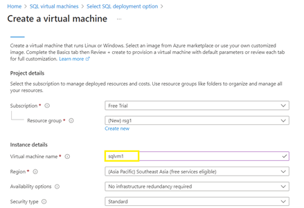 

    
**_Step 3:_** In the ‘Disks’ Tab, select Encryption type as ‘Encryption at-rest with customer-managed key’ 

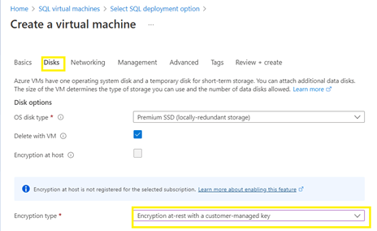 

   

### 3. Ensure Azure SQL VM is deployed in the Virtual networks and Network Security Groups are used to protect the Azure SQL VM 

**Security Control Mapping :**  
| Control Number | Control Statement | Security Domain | Default | Associated Runbook | CVSS Severity  |
| -------------- | ----------------- | --------------- | ------- | ------------------ | -------------- |
| CS0012300 | Cloud products and services must be deployed on private subnets and public access must be disabled for these services | Network and communication Security | Not enabled |Network Security Group Runbook | [High (7.2)](https://www.first.org/cvss/calculator/3.1#CVSS:3.1/AV:N/AC:H/PR:H/UI:N/S:C/C:H/I:L/A:L) |

**Why?**  

Azure Virtual network securely enables the communication of Azure SQL Databases with communication between Azure resources, on-premises resources through Spoke-hub network. Spoke VNet uses NSG to filter network traffic from other Azure resource. Remote Desktop Protocol (RDP) and Secure Shell (SSH) connections from the Internet must be restricted to prevent brute force attacks.NSGs must be configured by following a least privileged network approach to allow only the required traffic to the application. Network Security Group (NSG) rules must be configured to specify egress traffic restrictions on the VNet subnet where the Azure SQL PaaS resources are deployed.
    
The access to Database should be granted only to selected Vnets with in Organization's Azure Tenant and should not use SQL Server firewall feature to allow access to IP. 
If there is any requirement for external resource require access to Database, a private endpoint should be used, private endpoint will provide a endpoint with Private IP which can be associated with VNet with in tenant, other tenant or from On premise.  A FQDN record will be created in Azure DNS to enable other tenants VNets to be associated with Azure SQL Database.  This ensures that all workload data is being accessed securely over Azure network backbone.   

**How?**  

**_Step 1:_** Create a ‘SQL VM’ from the resources and provide corresponding details. Make sure to create ‘Virtual network’ and ‘Configure NSG’ as below. 

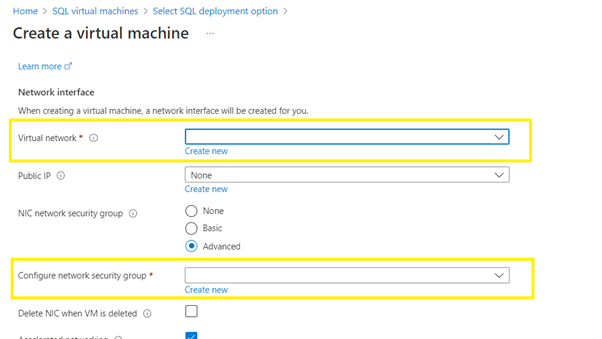 

**_Step 2:_** once the SQL VM is created, Navigate to ‘Networking’ under settings from the left side panel. 

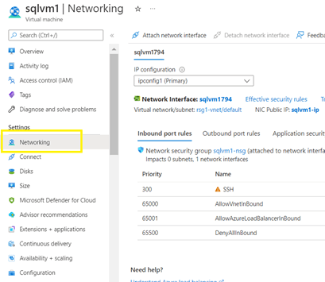 

**_Step 3:_**  Confirm to validate the created names in ‘Virtual network’ and ‘NSG’ 

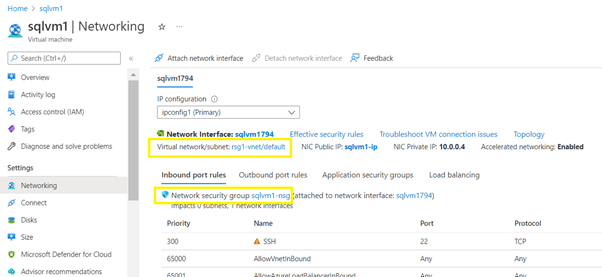 

   

### 4. Ensure SQL VMs are not associated with any public IP address 

**Security Control Mapping :**  
| Control Number | Control Statement | Security Domain | Default | Associated Runbook | CVSS Severity  |
| -------------- | ----------------- | --------------- | ------- | ------------------ | -------------- |
| CS0012300 | Cloud products and services must be deployed on private subnets and public access must be disabled for these services | Network and communication Security | Not enabled | Virtual Network Runbook |  [High (7.2)](https://www.first.org/cvss/calculator/3.1#CVSS:3.1/AV:N/AC:H/PR:H/UI:N/S:C/C:H/I:L/A:L) |

**Why?**  

The public IP address network service can be used to connect the SQL VM in the virtual network with the internet. The public IP in virtual Machines are getting exposed and making the devices more vulnerable to security attacks. Since Organization uses on-prem data center to route all the network traffic to azure resource using Spoke-hub network model, NATing will be done at the data center and private IP of the VM are used to route the appropriate network traffic, hence no public IP is required.

**How?**  
    
**_Step 1:_** Select the created SQL-VM and navigate to ‘Networking’ under settings. 

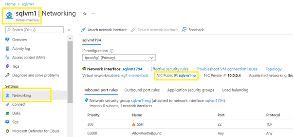 

**_Step 2:_** Choose the option ‘Dissociate’ and confirm it for dissociating the public IP Address. 

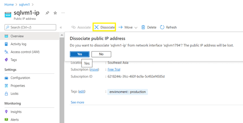 

   

### 5. Ensure SQL Virtual Machine are constantly scanned by Malware and Vulnerability scanning tool

**Security Control Mapping :**  
| Control Number | Control Statement | Security Domain | Default | Associated Runbook | CVSS Severity  |
| -------------- | ----------------- | --------------- | ------- | ------------------ | -------------- |
|  CS0012268       |Vulnerability Assessments must be performed based on risk and findings must be addressed in accordance with Enterprise SLA's | Vulnerability Management | Not enabled | None | [Medium (5.0)](https://www.first.org/cvss/calculator/3.1#CVSS:3.1/AV:L/AC:H/PR:H/UI:N/S:C/C:L/I:L/A:L) |

**Why?**  

Microsoft Defender for SQL is an Azure-native layer of security intelligence that detects unusual and potentially harmful attempts to access or exploit the data bases. It uses advanced threat detection capabilities and Microsoft Threat Intelligence data to provide contextual security alerts. Those alerts also include steps to mitigate the detected threats and prevent future attacks JIT access must also be enabled for Azure SQL VMs to lock down inbound traffic to SQL VMs by creating a rule in the network security group.

**How?**
**_Step 1_** From the Azure portal, open Defender for Cloud -> select Pricing and settings -> relevant subscription. 

**_Step 2_** Change the 'SQL server on machines' setting to On and select Save 

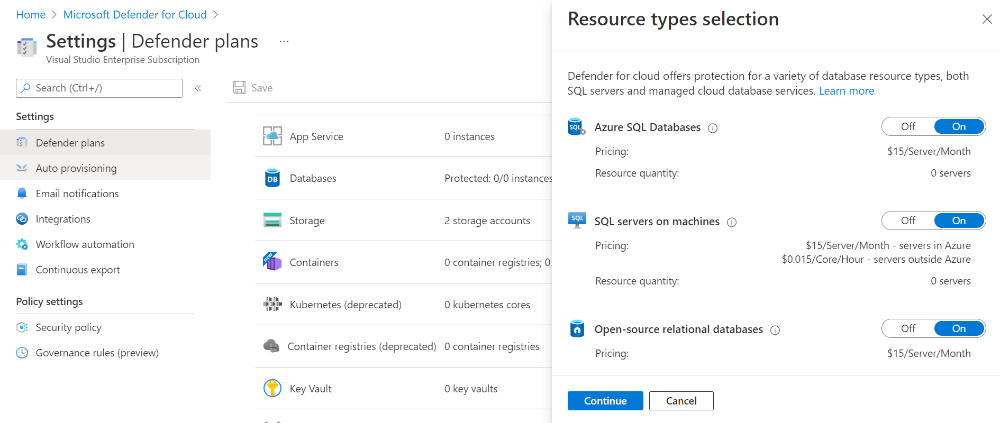 

**_Step 3:_** Select the virtual machine for which JIT must be configured.     

**_Step 4:_** In the left side menu, select Configuration.  

**_Step 5:_** Under Just-in-time access, select Enable just-in-time. 
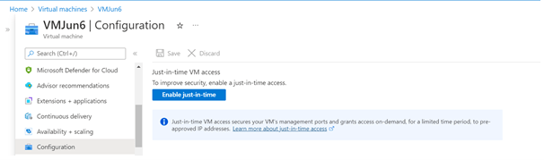 

**_Step 6:_** This enables just-in-time access for the VM using the default settings. 

**_Step 7:_** To edit the default values or to add more ports to the JIT configuration, Click Open Microsoft Defender for Cloud. 

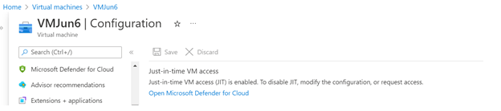  

**_Step 8:_** From the Configured tab, right-click on the VM and select edit. 

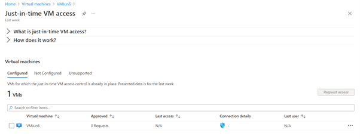 

**_Step 9:_** Values can be modified based on the organization requirement.    

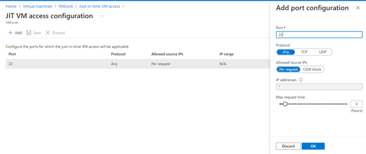 
  

### 6. Ensure least privilege access method for SQL Server is implemented using Role-based access control (RBAC) 

**Security Control Mapping :**  
| Control Number | Control Statement | Security Domain | Default | Associated Runbook | CVSS Severity  |
| -------------- | ----------------- | --------------- | ------- | ------------------ | -------------- |
|  CS0012298	    | Access to change cloud identity access and service control policies is restricted to authorized cloud administrative personnel |  Identity & Access Management | Not enabled | Azure AD Runbook  | [Medium (5.1)](https://www.first.org/cvss/calculator/3.1#CVSS:3.1/AV:A/AC:H/PR:H/UI:N/S:C/C:L/I:L/A:L) |

[Place Holder ]

**Following are the suggested RBAC roles for Azure SQL VM**  

| Function | Description | Role | 
| -------------- | ----------------- | --------------- | 
|  Network admin | Responsible for access to and from SQL DB application, this role lets you manage networks, but not access to them | [Network Contributor](https://github.com/MicrosoftDocs/azure-docs/blob/main/articles/role-based-access-control/built-in-roles.md#network-contributor) |
|  SQL Admin | Responsible to manage SQL Databases, This role lets you manage SQL databases, but not access to them. Also, you can't manage their security-related policies or their parent SQL servers | [SQL DB Contributor](https://github.com/MicrosoftDocs/azure-docs/blob/main/articles/role-based-access-control/built-in-roles.md#sql-db-contributor) |
| VM Admin | Create and manage virtual machines, manage disks, install and run software, reset password of the root user of the virtual machine using VM extensions, and manage local user accounts using VM extensions. This role does not grant you management access to the virtual network or storage account the virtual machines are connected to. This role does not allow you to assign roles in Azure RBAC|  [Virtual Machine Contributor](https://github.com/MicrosoftDocs/azure-docs/blob/main/articles/role-based-access-control/built-in-roles.md#virtual-machine-contributor) |

  

### 7. Ensure that Azure SQL VM uses standard organizational Resource tagging method 

**Security Control Mapping :**   
| Control Number | Control Statement | Security Domain | Default | Associated Runbook | CVSS Severity  |
| -------------- | ----------------- | --------------- | ------- | ------------------ | -------------- |
| CS0012261  | Technology hardware and software must be registered and accurately recorded within the enterprise technology repository and/or asset management systems | Asset Management  | Not enabled | organizational Runbook | [Low (1.6)](https://www.first.org/cvss/calculator/3.1#CVSS:3.1/AV:P/AC:H/PR:H/UI:N/S:U/C:N/I:N/A:L) |

**Why, What and How ?** 
  
Client rationale and Justification  
[Placeholder link]

### 8. Ensure only organization approved SQL VM images are used for deployment 

**Security Control Mapping :**  
| Control Number | Control Statement | Security Domain | Default | Associated Runbook | CVSS Severity  |
| -------------- | ----------------- | --------------- | ------- | ------------------ | -------------- |
| CS0012261  | Technology hardware and software must be registered and accurately recorded within the enterprise technology repository and/or asset management systems | Asset Management  | Not enabled | Network Watcher runbook | [Low (2.7)](https://www.first.org/cvss/calculator/3.1#CVSS:3.1/AV:P/AC:H/PR:H/UI:N/S:U/C:L/I:N/A:L)  |

**Why?**  

Organization approved SQL VM images are the Azure Resource Manager templates of the Virtual Machines which are customized and configured to meet the organization and compliance policies. New instances of the SQL VM must be deployed only using these approved images promoting the uniformity and secured design. Patch updates and maintenance will be done to this approved VM Images by Infrastructure team

**How?**  

    
**_Step 1:_** Once you logged in to you Azure portal, create a new ‘Azure compute gallery’ and provide a name. 

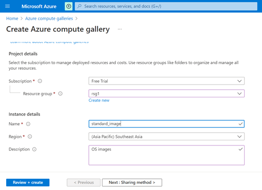 

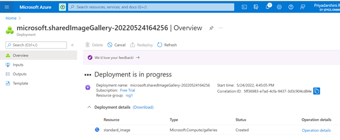 

**_Step 2:_** Locate the existing VM resource (to utilize this image as standard one) and click ‘create an image’. 

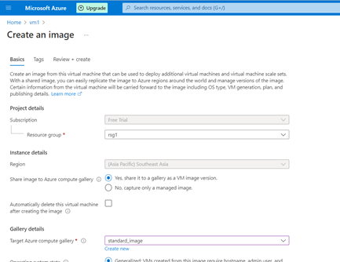 

Choose the newly created ‘compute gallery’ name and provide version number & EOL date. 

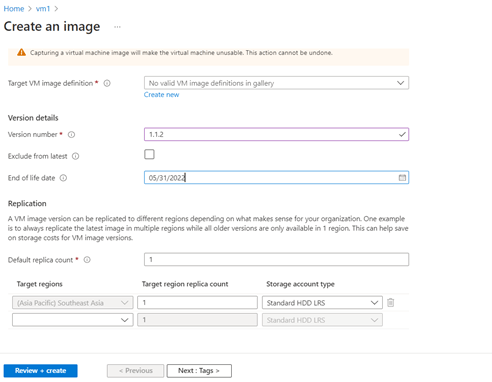 

The  image will be saved in ‘Azure compute gallery’. 

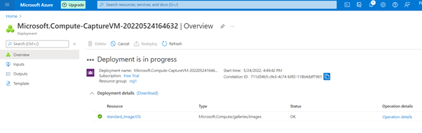 

**_Step 3:_** Now the standard image can be used for new VM resources (From ‘Shared images’).  

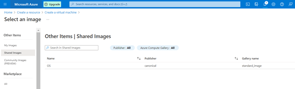     
    
           
  

### 9. Ensure Trusted Launch is enabled for Azure Virtual machine 

**Security Control Mapping :**  
| Control Number | Control Statement | Security Domain | Default | Associated Runbook | CVSS Severity  |
| -------------- | ----------------- | --------------- | ------- | ------------------ | -------------- |
| CS0012133 | Information systems are hardened and configured to align with enterprise requirements | Configuration Management | Not enabled | None | [Medium (5.0)](https://www.first.org/cvss/calculator/3.1#CVSS:3.1/AV:L/AC:H/PR:H/UI:N/S:C/C:L/I:L/A:L)|

**Why?**  

Trusted launch must be enabled when launching the SQL VM to protect against advanced and persistent attack techniques. Trusted launch is composed of several, coordinated infrastructure technologies that can be enabled independently to deploy virtual machines securely with verified boot loaders, OS kernels, and drivers and securely protect keys, certificates, and secrets in the virtual machines and to gain insights and confidence of the entire boot chain’s integrity.

**How?**  

**_Step 1:_** Login to Azure portal, select ‘SQL Virtual machines’ from services. 

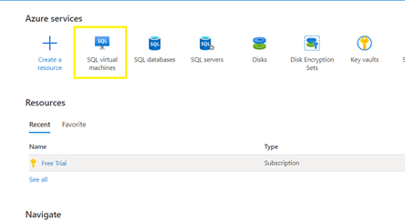 

**_Step 2:_** Provide Virtual machine name and select Security type as ‘Trusted launch Virtual machines’. 

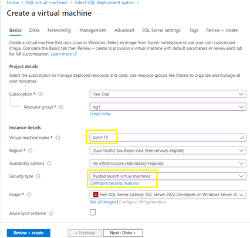  

**_Step 3:_** validate the ‘Trusted launch’ status in Security type. 

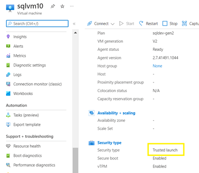 

  

### 10. Ensure Activity logging is enabled for Azure SQL Virtual Machine

**Security Control Mapping :**  
| Control Number | Control Statement | Security Domain | Default | Associated Runbook | CVSS Severity  |
| -------------- | ----------------- | --------------- | ------- | ------------------ | -------------- |
| CS0012233 | Information System must create a log and record activities occurring on or originating from the information system. Logs must be made accessible to the enterprise SIEM solution  | Security Information and event management   | Enabled but not forwarded to Splunk | None | [Low (2.7)](https://www.first.org/cvss/calculator/3.1#CVSS:3.1/AV:P/AC:H/PR:H/UI:N/S:U/C:L/I:N/A:L) |

**Why, What and How ?** 
  
Client rationale and Justification 
[Placeholder link]

   

