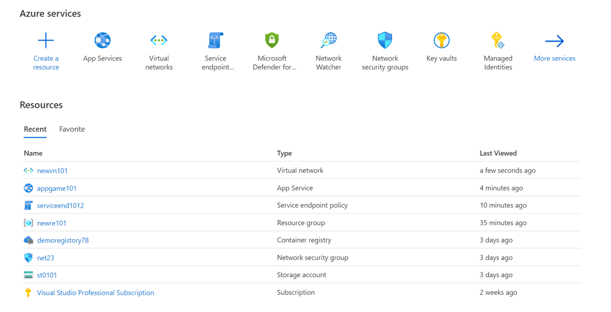
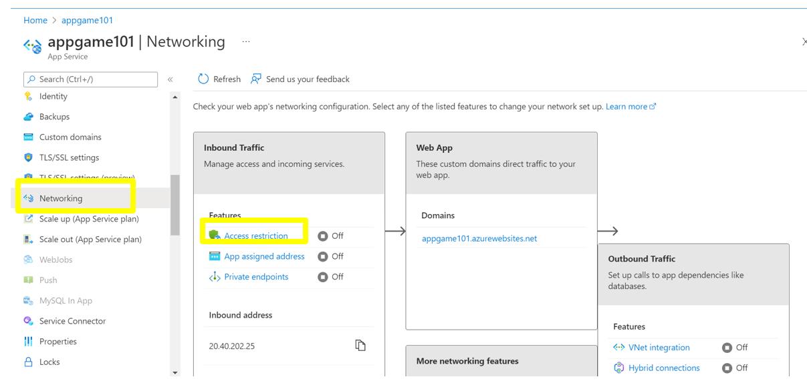
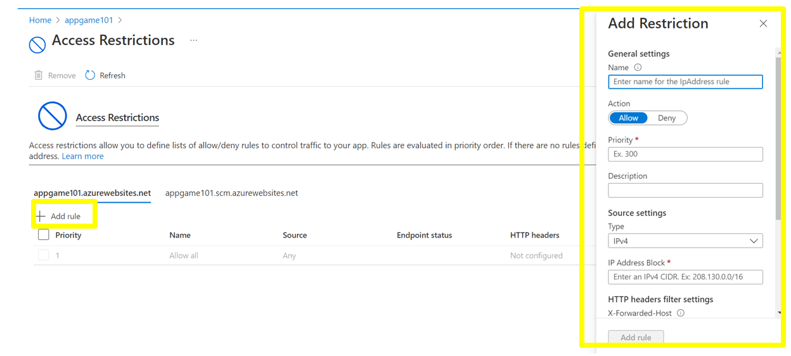
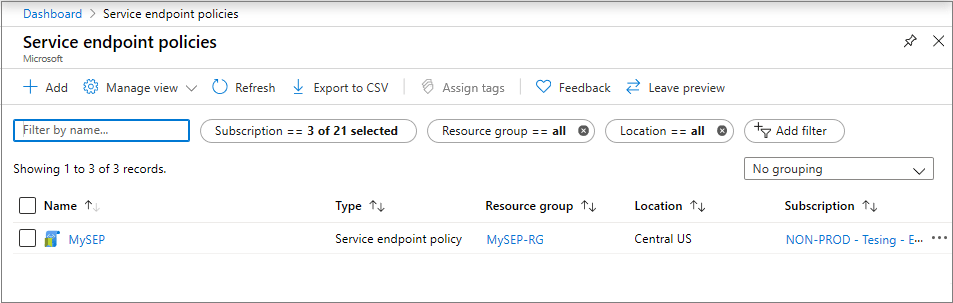
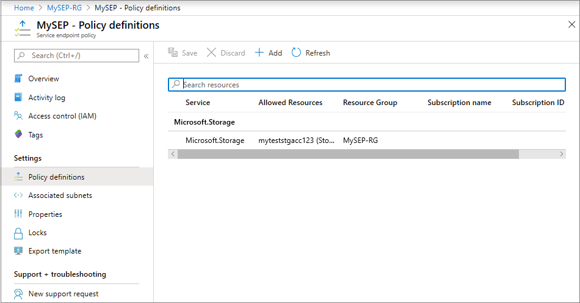
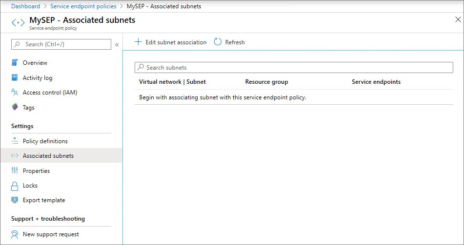
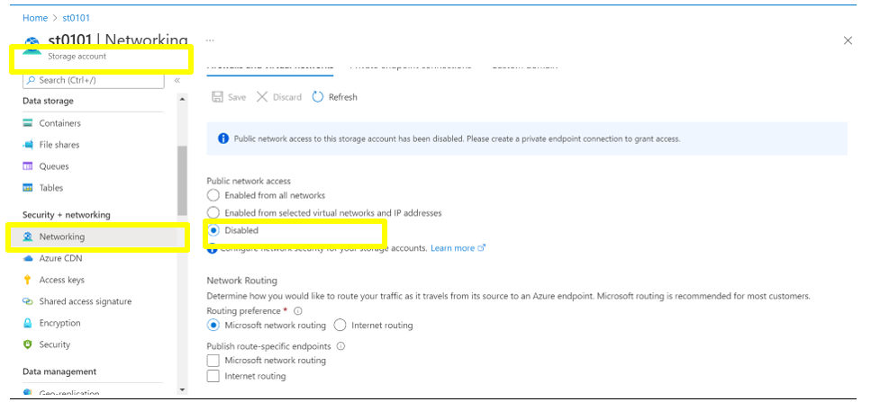

# Azure Service Endpoint - Security baseline requirement <!-- omit in toc -->
## Baseline security configuration requirement for Azure services  <!-- omit in toc -->

**Generated By: EY Security Team**  
**Service Type: Networking**  
**Deployment Phase: Service Discovery**  
**Last updated: 05/25/2022** 

## Table of Contents <!-- omit in toc -->

- [Overview](#overview)
  - [Use Case Examples:](#use-case-examples)
- [Cloud Security Requirements](#cloud-security-requirements)
  - [1. Ensure Azure resources allow traffic only from the Service endpoints subnet in the virtual networks and NSG associated with that subnet restricts the traffic to and from the internet.](#1-ensure-azure-resources-allow-traffic-only-from-the-service-endpoints-subnet-in-the-virtual-networks-and-nsg-associated-with-that-subnet-restricts-the-traffic-to-and-from-the-internet)
  - [2. Ensure Azure Service Endpoint implements Role Based Access Control](#2-ensure-azure-service-endpoint-implements-role-based-access-control)
  - [3. Ensure Service endpoint policy is used to provide granular access to PaaS Services in Subnets](#3-ensure-service-endpoint-policy-is-used-to-provide-granular-access-to-paaS-services-in-subnets)
  - [4. Ensure that service endpoint firewall rules does not allow any public ip](#4-ensure-that-service-endpoint-firewall-rules-does-not-allow-any-public-ip)

  - [5. Ensure Activity logging is enabled for Azure Service Endpoint](#5-ensure-activity-logging-is-enabled-for-azure-service-endpoint)

## Overview

Virtual Network (VNet) service endpoint is used to provide secure and direct connectivity to Azure services over an optimized route using the Azure backbone network. Endpoints secure the critical Azure service resources with access only to their virtual networks. Service Endpoints must be used to enable private IP addresses in the VNet to reach the endpoint of an Azure service without needing a public IP address on the VNet.

| Control Number | Cloud Baseline Security Requirements                                                                                                                                                    |
| -------------- | --------------------------------------------------------------------------------------------------------------------------------------------------------------------------------------- |
| 1              | Ensure Azure resources allow traffic only from the Service endpoints subnet in the virtual networks and NSG associated with that subnet restricts the traffic to and from the internet. |
| 2              | Ensure Azure Service Endpoint implements Role Based Access Control                                                                                                                      |
| 3              | Ensure Service endpoint policy is used to provide granular access to PaaS Services in Subnets                                                                                           |
| 4              | Ensure that service endpoint firewall rules does not allow any public ip                                                                                                                |
| 5              | Ensure Activity logging is enabled for Azure Service Endpoint                                                                                                                           |

### Use Case Examples:

- Restrict network access to PaaS resources
- Use virtual network service endpoints and rules for servers in Azure SQL Database
- Configure Azure Storage firewalls and virtual networks
- Secure an Azure Synapse Analytics to a virtual network

## Cloud Security Requirements 

### 1. Ensure Azure resources allow traffic only from the Service endpoints subnet in the virtual networks and NSG associated with that subnet restricts the traffic to and from the internet. ###

**Security Control Mapping :**  

| Control Number | Control Statement | Security Domain | Default | Associated Runbook | CVSS Severity  |
| -------------- | ----------------- | --------------- | ------- | ------------------ | -------------- |
| [CS0012300](place holder) | Cloud products and services must be deployed on Service subnets and public access must be disabled for these services | Network and communication Security | Not enabled | Virtual Network Runbook | [High (7.2)](https://www.first.org/cvss/calculator/3.1#CVSS:3.1/AV:N/AC:H/PR:H/UI:N/S:C/C:H/I:L/A:L)|

**Why?**  

Generally, the inbound connection traverses from on-prem network to Hub-spoke Vnet in a Hybrid cloud model and the spoke virtual network NSG should disable access from internet . Service endpoints are used to improve security by fully removing public internet access to resources and allowing traffic only from the specific virtual network by using virtual network rules.  After enabling service endpoint in virtual network,Administrators must configure a virtual network rule to secure the Azure service resources to the virtual network.

**How?**  

  **_Step 1:_**  Go to Azure portal and then to which you want to provide service endpoint. 
   
  
  **_Step 2:_**  Click on the Networking. 

  **_Step 3:_**  Click on the Access restriction. 
   

   **_Step 4:_**  Add the Subnet restriction as required. 
   
 

To implement this control, refer the link:
https://docs.microsoft.com/en-us/azure/virtual-network/tutorial-restrict-network-access-to-resources

   

### 2. Ensure Azure Service Endpoint implements Role Based Access Control ###

**Security Control Mapping :**  
| Control Number | Control Statement | Security Domain | Default | Associated Runbook | CVSS Severity  |
| -------------- | ----------------- | --------------- | ------- | ------------------ | -------------- |
|  [CS0012298](place holder) 	 | Access to change cloud identity access and service control policies is restricted to authorized cloud administrative personnel |  Identity & Access Management | Not enabled | Azure AD Runbook  | [Medium (5.1)](https://www.first.org/cvss/calculator/3.1#CVSS:3.1/AV:A/AC:H/PR:H/UI:N/S:C/C:L/I:L/A:L) |

[Place Holder ]

**Following are the suggested RBAC roles for Azure Service Endpoints**  

| Function | Description | Role | 
| -------------- | ----------------- | --------------- | 
|  Network Admin | Lets you manage networks, but not access to them | [Network Contributor](https://github.com/MicrosoftDocs/azure-docs/blob/main/articles/role-based-access-control/built-in-roles.md#network-contributor) |

  

To implement this control, refer the link:
https://docs.microsoft.com/en-us/azure/role-based-access-control/built-in-roles

  

### 3. Ensure Service endpoint policy is used to provide granular access to PaaS Services in Subnets ###

**Security Control Mapping :**  

| Control Number | Control Statement | Security Domain | Default | Associated Runbook | CVSS Severity  |
| -------------- | ----------------- | --------------- | ------- | ------------------ | -------------- |
| [CS0012300](place holder) | Cloud products and services must be deployed on Service subnets and public access must be disabled for these services | Network Security | Not enabled | Virtual Network Runbook | [High (7.2)](https://www.first.org/cvss/calculator/3.1#CVSS:3.1/AV:N/AC:H/PR:H/UI:N/S:C/C:H/I:L/A:L)|

**Why?**  

Virtual Network (VNet) service endpoint policies must be allowed to filter the egress virtual network traffic to PaaS services over service endpoint, and  data exfiltration is allowed to only specific Azure Storage accounts. Endpoint policies must allow to specify the Azure Storage accounts that are allowed virtual network outbound access and restricts access to all the other storage accounts. This gives much more granular security control for protecting data exfiltration from your virtual network.

**How?**  
**_Step 1:_** In the All services box in the portal, begin typing service endpoint policies. Select Service Endpoint Policies. 

**_Step 2:_** Under Subscriptions, select your subscription and resource group, as shown in the following picture 
 

**_Step 3:_** Select the policy and click on Policy Definitions to view or add more policy definitions. 
 

**_Step 4:_** Select Associated subnets to view the subnets the policy is associated. If no subnet is associated yet, follow the instructions in the next step. 
 

**_Step 5:_** Associate a policy to a subnet 
* Now, you can either choose to select the Service Endpoint Policy from the drop-down in the above pane if you have already created Service Endpoint policies before configuring Service Endpoint for the Subnet as shown below 
* OR if you are associating Service Endpoint policies after Service Endpoints are already configured, you can choose to associate the subnet from within the Service Endpoint Policy blade by navigating to the Associated Subnets pane as shown below 

   

### 4. Ensure that service endpoint firewall rules does not allow any public ip ###

**Security Control Mapping :**  
| Control Number | Control Statement | Security Domain | Default | Associated Runbook | CVSS Severity  |
| -------------- | ----------------- | --------------- | ------- | ------------------ | -------------- |
| [CS0012300](place holder) | Cloud products and services must be deployed on Service subnets and public access must be disabled for these services | Network and communication Security | Not Enabled | None | [Medium (5.3)](https://www.first.org/cvss/calculator/3.1#CVSS:3.1/AV:A/AC:H/PR:H/UI:N/S:U/C:H/I:L/A:L) |

**Why?**  

In general, Azure service traffic from a virtual network uses public IP addresses as source IP addresses. With service endpoints, service traffic switches to virtual network private addresses as the source IP addresses when accessing the Azure service from a virtual network from the default public IP address. This switch allows to access the services without the need for reserved, public IP addresses used in IP firewalls . 

**How?**  
**_Step 1:_**  Go to Azure portal. 

**_Step 2:_**  Go to storage account then networking  

**_Step 3:_**  Disable the public network access. 
 

To implement this control, refer the link:
https://docs.microsoft.com/en-us/azure/virtual-network/virtual-network-service-endpoints-overview#considerations

Refer the Network images - [NetworkRestriction](https://github.com/ey-org/cloudsec-ccm/blob/master/Baseline%20Requirement%20Library/Azure/docs/images/Network.png)

  

### 5. Ensure Activity logging is enabled for Azure Service Endpoint
**Security Control Mapping :**  
| Control Number | Control Statement | Security Domain | Default | Associated Runbook | CVSS Severity  |
| -------------- | ----------------- | --------------- | ------- | ------------------ | -------------- |
| CS0012233 | Information System must create a log and record activities occurring on or originating from the information system. Logs must be made accessible to the enterprise SIEM solution  | Security Information and event management   | Enabled but not forwarded to Splunk | None | [Low (2.7)](https://www.first.org/cvss/calculator/3.1#CVSS:3.1/AV:P/AC:H/PR:H/UI:N/S:U/C:L/I:N/A:L) |

**Why, What and How ?** 
  
Client rationale and Justification
[Placeholder link]

  

