# Azure Virtual Desktop - Security baseline requirement <!-- omit in toc -->

## Baseline security configuration requirement for Azure services  <!-- omit in toc -->

**Generated By: EY Security Team**  
**Service Type: Compute**  
**Deployment Phase: Service Discovery**  
**Last updated: 05/23/2022** 

## Table of Contents <!-- omit in toc -->

- [Overview](#overview)
  - [Use Case Examples:](#use-case-examples)
- [Cloud Security Requirements](#cloud-security-requirements)
  - [1.  Ensure Azure Virtual Desktop is secured using virtual networks](#1--ensure-azure-virtual-desktop-is-secured-using-virtual-networks)
  - [2. Ensure Azure Virtual desktops are not associated with any public IP address](#2-ensure-azure-virtual-desktops-are-not-associated-with-any-public-ip-address)
  - [3. Ensure only organization approved Virtual Desktop images are used for deployment from Azure Compute Gallery](#3-ensure-only-organization-approved-virtual-desktop-images-are-used-for-deployment-from-azure-compute-gallery)
  - [4. Ensure Trusted Launch is enabled for Azure Virtual desktop](#4-ensure-trusted-launch-is-enabled-for-azure-virtual-desktop)
  - [5. Ensure Diagnostic logs for 'Checkpoint' and 'Error' are enabled and are forwarded to Splunk](#5-ensure-diagnostic-logs-for-checkpoint-and-error-are-enabled-and-are-forwarded-to-splunk)
  - [6. Ensure Azure Virtual Desktop use standard organizational Resource tagging method](#6-ensure-azure-virtual-desktop-use-standard-organizational-resource-tagging-method)
  - [7. Ensure Azure Virtual Desktop is constantly monitored using Malware and vulnerability scanning tools](#7-ensure-azure-virtual-desktop-is-constantly-monitored-using-malware-and-vulnerability-scanning-tools)
  - [8. Ensure Azure Virtual Desktop implements RBAC access control](#8-ensure-azure-virtual-desktop-implements-rbac-access-control)
  - [9. Ensure remote app is used to limit user's access only to certain application and Reverse connect transport is used for secure communication](#9-ensure-remote-app-is-used-to-limit-users-access-only-to-certain-application-and-reverse-connect-transport-is-used-for-secure-communication)
  - [10. Ensure the new deployments are tested in validation host pool](#10-ensure-the-new-deployments-are-tested-in-validation-host-pool)
  - [11. Ensure that Azure Active Directory is selected as the domain to join in the Azure VM](#11-ensure-that-azure-active-directory-is-selected-as-the-domain-to-join-in-the-azure-vm)
  - [12. Ensure that added VM in virtual desktop is enrolled with Intune](#12-ensure-that-added-vm-in-virtual-desktop-is-enrolled-with-intune)
  - [13. Ensure Activity logging is enabled for Azure Container Instance](#13-ensure-activity-logging-is-enabled-for-azure-container-instance)

## Overview

Azure Virtual Desktop on Microsoft Azure is a desktop and app virtualization service that runs on the cloud. Azure Virtual Desktop works across devices, like Windows, Mac, iOS, Android, and Linux, with apps that can be used to access remote desktops and apps. Modern browsers can also be used to access Azure Virtual Desktop-hosted experiences with enhanced security and simplified management. 

| Control Number | Cloud Baseline Security Requirements                                                                                                        |
| -------------- | ------------------------------------------------------------------------------------------------------------------------------------------- |
| 1              | Ensure Azure Virtual Desktop is secured using virtual networks                                                                              |
| 2              | Ensure Azure Virtual desktops are not associated with any public IP address                                                                 |
| 3              | Ensure only organization approved Virtual Desktop images are used for deployment from Azure Compute Gallery                                 |
| 4              | Ensure Trusted Launch is enabled for Azure Virtual desktop                                                                                  |
| 5              | Ensure Diagnostic logs for 'Checkpoint' and 'Error' are enabled and are forwarded to Splunk                                                 |
| 6              | Ensure Azure Virtual Desktop use standard organizational Resource tagging method                                                            |
| 7              | Ensure Azure Virtual Desktop is constantly monitored using Malware and vulnerability scanning tools                                         |
| 8              | Ensure Azure Virtual Desktop implements RBAC access control                                                                                 |
| 9              | Ensure remote app is used to limit user's access only to certain application and Reverse connect transport is used for secure communication |
| 10             | Ensure the new deployments are tested in validation host pool                                                                               |
| 11             | Ensure that Azure Active Directory is selected as the domain to join in the Azure VM                                                        |
| 12             | Ensure that added VM in virtual desktop is enrolled with Intune                                                                             |
| 13             | Ensure Activity logging is enabled for Azure Container Instance                                                                             |

### Use Case Examples:
- FSLogix for the enterprise
- Multiple forests with AD DS and Azure AD
- Azure Virtual Desktop for the enterprise

## Cloud Security Requirements ##

### 1.  Ensure Azure Virtual Desktop is secured using virtual networks  ###

**Security Control Mapping :**  

| Control Number | Control Statement | Security Domain | Default | Associated Runbook | CVSS Severity  |
| -------------- | ----------------- | --------------- | ------- | ------------------ | -------------- |
| [CS0012300](place holder) | Cloud products and services must be deployed on private subnets and public access must be disabled for these services | Network and communication Security | Not enabled |Network Security Group Runbook | [High (7.2)](https://www.first.org/cvss/calculator/3.1#CVSS:3.1/AV:N/AC:H/PR:H/UI:N/S:C/C:H/I:L/A:L) |

**Why?**  
  
Azure Virtual network securely enables the communication of Azure resources with the internet and on-premises resources through organization data center using spoke-hub network model. Security tools in data center will filtering inbound and outbound network traffic based on use case. 

**How?**  

**_Step1:_** Go to Azure portal and search for Azure Virtual Desktop.  

**_Step 2:_**  Click on “Create a host pool” 

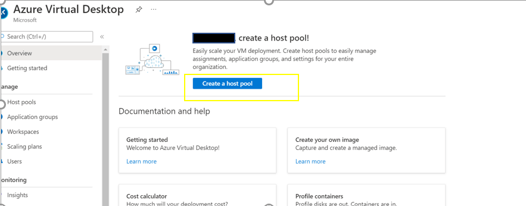 

**_Step 3:_**  Add subscription ,Resource group details and give pool host name, select location. 
 
**_Step 4:_**  Navigate to “virtual machines” tab, enable “yes” on add Azure virtual machine option. 

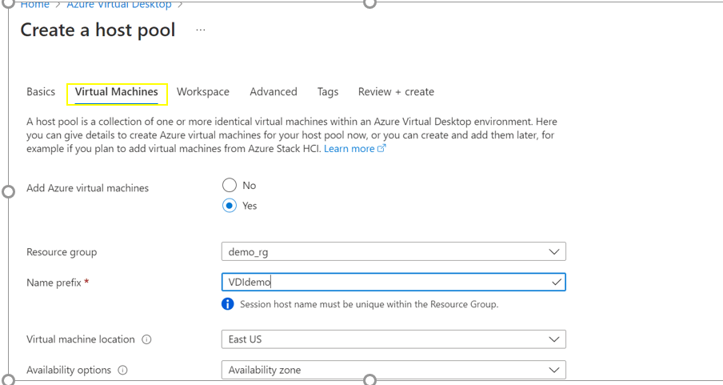 

**_Step 5:_**  create new or add an existing Virtual network, under “Network and security”, select subnet, public Inbound ports and required ports so only allowed traffic will come into the Virtual machine network and makes the Virtual machine secured. 

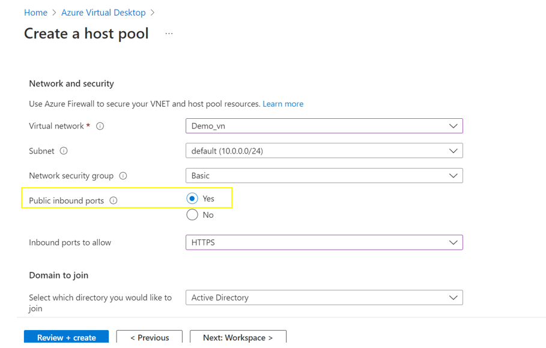 

**_Step 6:_** Click “Review+create” and after validation passed, click “create”. 

For more information about this control, refer the link:
https://docs.microsoft.com/en-us/azure/firewall/protect-azure-virtual-desktop?context=%2Fazure%2Fvirtual-desktop%2Fcontext%2Fcontext#host-pool-outbound-access-to-azure-virtual-desktop  

For more inforomation on Network design , refer the below link:
[Place Holder - Need to be replaced with Client Azure VMWare High level network Design]  

   

### 2. Ensure Azure Virtual desktops are not associated with any public IP address ###

**Security Control Mapping :**  
| Control Number | Control Statement | Security Domain | Default | Associated Runbook | CVSS Severity  |
| -------------- | ----------------- | --------------- | ------- | ------------------ | -------------- |
| [CS0012300](place holder) | Cloud products and services must be deployed on private subnets and public access must be disabled for these services | Network and communication Security | Not enabled | Virtual Network Runbook |  [High (7.2)](https://www.first.org/cvss/calculator/3.1#CVSS:3.1/AV:N/AC:H/PR:H/UI:N/S:C/C:H/I:L/A:L) |

**Why?**  

The public IP address network service can be used to connect the virtual desktops in the virtual network with the internet. The public IP in virtual Machines are getting exposed and making the devices more vulnerable to security attacks. Since Organization uses on-prem data center to route all the network traffic to azure resource using Spoke-hub network model, NATing will be done at the data center and private IP of the VM are used to route the appropriate network traffic, hence no public IP is required.

**How?**  

 **_Step1:_** Go to Azure portal and search for Azure Virtual Desktop. 

**_Step 2:_**  Click on “Create a host pool” 

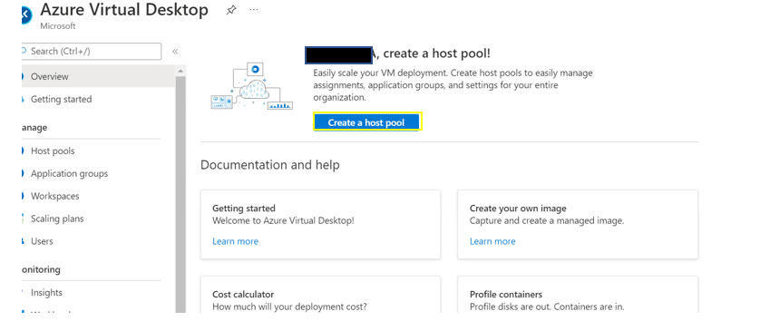 

**_Step 3:_**  Add subscription , Resource group details and give pool host name, select location. 

**_Step 4:_**  In virtual machine section, select “yes” to Add Azure virtual machine field. 

**_Step 5:_**  In Network and security section, select “No” for public inbound ports. Now Azure virtual desktop are not associated with public IP Address. 

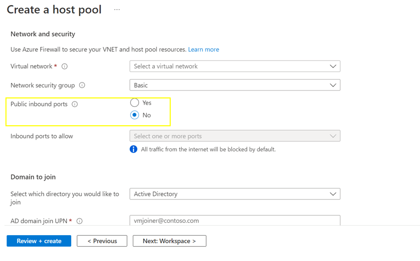 

  

For more information about this control , refer the link:  
https://docs.microsoft.com/en-us/azure/virtual-desktop/safe-url-list#required-url-check-tool  

### 3. Ensure only organization approved Virtual Desktop images are used for deployment from Azure Compute Gallery

**Security Control Mapping :**  
| Control Number | Control Statement | Security Domain | Default | Associated Runbook | CVSS Severity  |
| -------------- | ----------------- | --------------- | ------- | ------------------ | -------------- |
| [CS0012261](place holder)  | Technology hardware and software must be registered and accurately recorded within the enterprise technology repository and/or asset management systems | Asset Management  | Not enabled | Network Watcher runbook | [Medium (5.0)](https://www.first.org/cvss/calculator/3.1#CVSS:3.1/AV:L/AC:H/PR:H/UI:N/S:C/C:L/I:L/A:L)  |

**Why?**  

Organization approved virtual desktop images are the Azure Resource Manager templates of the Virtual Machines which are customized and configured to meet the organization and compliance policies. New instances of the virtual desktop must be deployed only using these approved images promoting the uniformity and secured design. Patch updates and maintenance will be done to this approved VM Images by Infrastructure team

**How?**  

**_Step1:_** Go to Azure portal and search for Azure Virtual Desktop. 

**_Step 2:_**  Click on “Create a host pool” 

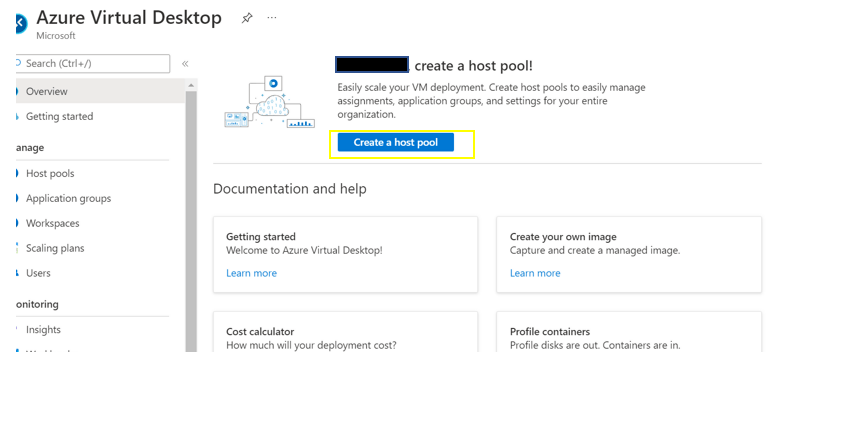  

**_Step 3:_**  Add subscription, Resource group details and give pool host name, select location. 

**_Step 4:_**  Select image we already captured. Now, we used our image for Azure virtual desktop from Azure compute gallery. 

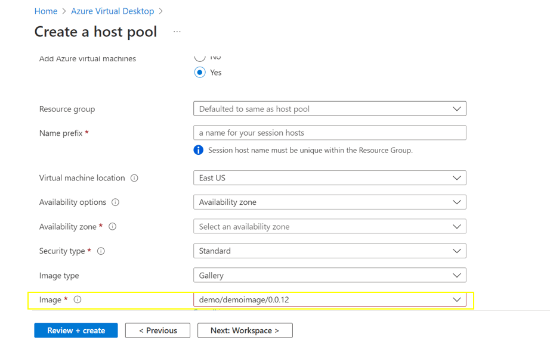 

  

For more information about this control, refer the link:https://docs.microsoft.com/en-us/azure/virtual-machines/shared-image-galleries  

### 4. Ensure Trusted Launch is enabled for Azure Virtual desktop

**Security Control Mapping :**  
| Control Number | Control Statement | Security Domain | Default | Associated Runbook | CVSS Severity  |
| -------------- | ----------------- | --------------- | ------- | ------------------ | -------------- |
| [[CS0012133](place holder)] | Information systems are hardened and configured to align with enterprise requirements | Configuration Management | Not enabled | None | [Medium (5.0)](https://www.first.org/cvss/calculator/3.1#CVSS:3.1/AV:L/AC:H/PR:H/UI:N/S:C/C:L/I:L/A:L)|

**Why?**  

Trusted launch must be enabled when launching the Azure virtual desktop to protect against advanced and persistent attack techniques. Trusted launch is composed of several, coordinated infrastructure technologies that can be enabled independently to deploy virtual machines securely with verified boot loaders, OS kernels, and drivers and securely protect keys, certificates, and secrets in the virtual machines and to gain insights and confidence of the entire boot chain’s integrity.

**How?**  

**_Step1:_** Go to Azure portal and search for Azure Virtual Desktop. 

**_Step 2:_**  Click on “Create a host pool” 

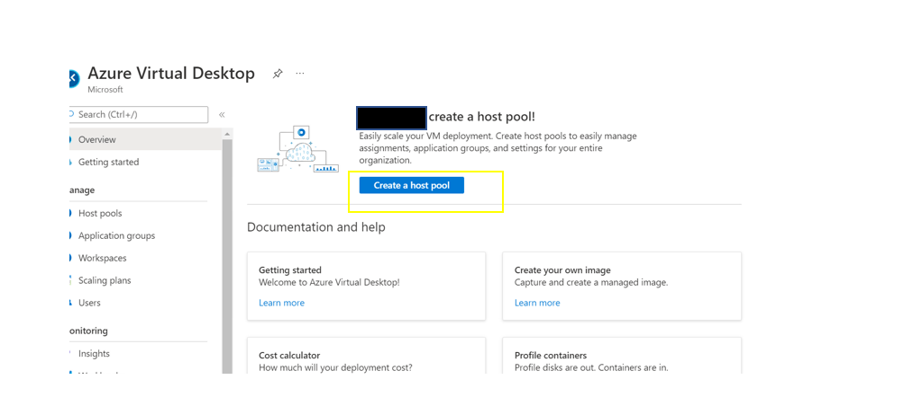 

**_Step 3:_**  Add subscription ,Resource group details and give pool host name, select location. 

**_Step 4:_**  Navigate to “virtual machines” tab, enable “yes” on add Azure virtual machine. 

**_Step 5:_**  Select  “Security type” as “Trusted launch virtual machines”. 

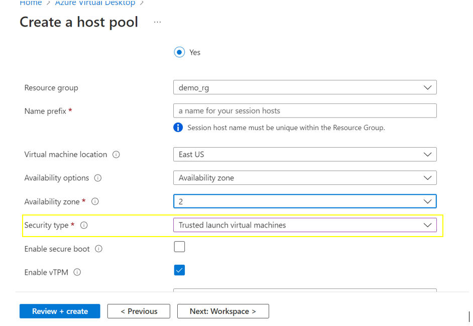 

  

For more information about this control, refer the link: https://techcommunity.microsoft.com/t5/azure-virtual-desktop-blog/azure-virtual-desktop-support-for-trusted-launch-virtual/ba-p/3053043 

### 5. Ensure Diagnostic logs for 'Checkpoint' and 'Error' are enabled and are forwarded to Splunk

**Security Control Mapping :**  
| Control Number | Control Statement | Security Domain | Default | Associated Runbook | CVSS Severity  |
| -------------- | ----------------- | --------------- | ------- | ------------------ | -------------- |
| [CS0012233](place holder) | Information System must create a log and record activities occurring on or originating from the information system. Logs must be made accessible to the enterprise SIEM solution  | Security Information and event management  | Not Enabled | Network Watcher Runbook | None |  [Low (2.7)](https://www.first.org/cvss/calculator/3.1#CVSS:3.1/AV:P/AC:H/PR:H/UI:N/S:U/C:L/I:N/A:L) |

**Why?**  
The event log contains information about the api objects which include Checkpoint,Error,Management,Connection HostRegistration,AgentHealthStatus,NetworkData and SessionHostManagement. These logs when forwarded to Splunk provide necessary information to create notable alerts for any rule created to allow connection from internet

**How?**  

**_Step 1:_**  Sign into the Azure portal and go to Azure Virtual Desktop. 

**_Step 2:_**  Click “Diagnostic settings” on the left side menu. 

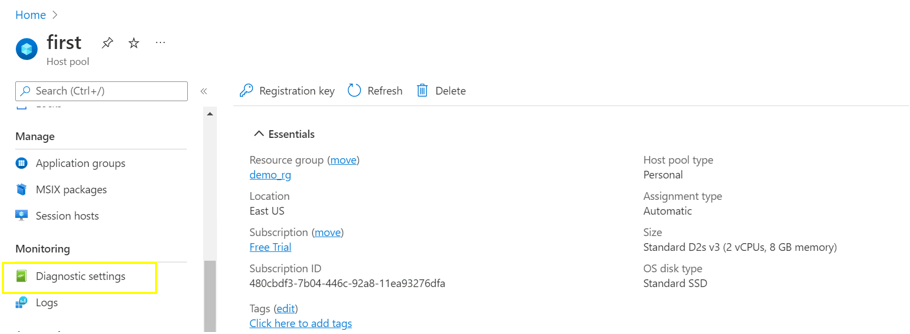 

**_Step 3:_** Click “Add diagnostic setting” 

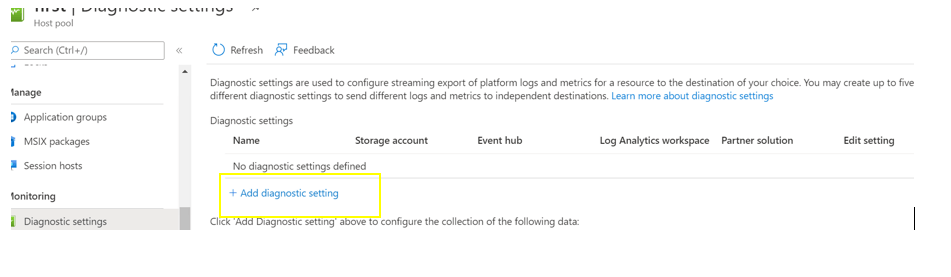 

**_Step 4:_**  Enable “checkpoint” and “Error” under categories section and select "Stream to an event Hub” and select Event hub namespace. Then click save. 

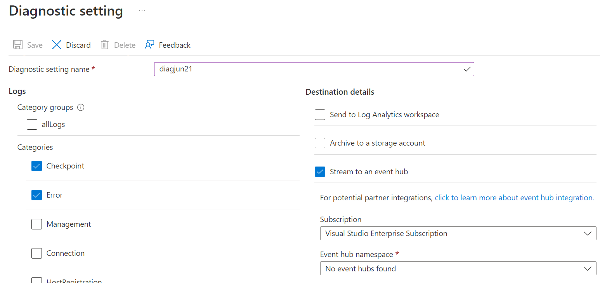 

For more information about this control, refer the links: https://docs.microsoft.com/en-us/azure/virtual-desktop/diagnostics-log-analytics and https://docs.microsoft.com/en-us/azure/virtual-machines/monitor-vm?context=%2Fazure%2Fvirtual-machines%2Fcontext%2Fcontext  

### 6. Ensure Azure Virtual Desktop use standard organizational Resource tagging method 

**Security Control Mapping :**  

| Control Number | Control Statement | Security Domain | Default | Associated Runbook | CVSS Severity  |
| -------------- | ----------------- | --------------- | ------- | ------------------ | -------------- |
| [CS0012261](place holder)  | Technology hardware and software must be registered and accurately recorded within the enterprise technology repository and/or asset management systems | Asset Management  | Not enabled | organizational Runbook | [Low (1.6)](https://www.first.org/cvss/calculator/3.1#CVSS:3.1/AV:P/AC:H/PR:H/UI:N/S:U/C:N/I:N/A:L) |

**Why, What and How ?** 
  
Client rationale and Justification 
[Placeholder link]

   

### 7. Ensure Azure Virtual Desktop is constantly monitored using Malware and vulnerability scanning tools  

**Security Control Mapping :**  

| Control Number | Control Statement | Security Domain | Default | Associated Runbook | CVSS Severity  |
| -------------- | ----------------- | --------------- | ------- | ------------------ | -------------- |
|  [CS0012268](place holder)       |Vulnerability Assessments must be performed based on risk and findings must be addressed in accordance with Enterprise SLA's | Vulnerability Management | Not enabled | None | [Medium (5.0)](https://www.first.org/cvss/calculator/3.1#CVSS:3.1/AV:L/AC:H/PR:H/UI:N/S:C/C:L/I:L/A:L) |

**Why?**  

Malware and Vulnerability management tools must be enabled to continually assesses the resources, subscriptions, and organization for security issues. It aggregates all the findings into a single score which can be used as a benchmark of the Security Posture of the organization

**How?**  

**_Step 1_** From the Azure portal, open Defender for Cloud -> select Pricing and settings -> relevant subscription. 

**_Step 2_** Change the 'Servers' setting to On and select Save 

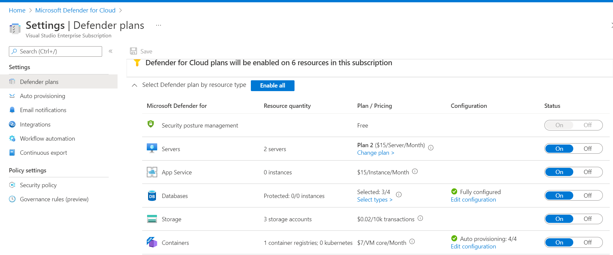 

   

### 8. Ensure Azure Virtual Desktop implements RBAC access control 

**Security Control Mapping :**  
| Control Number | Control Statement | Security Domain | Default | Associated Runbook | CVSS Severity  |
| -------------- | ----------------- | --------------- | ------- | ------------------ | -------------- |
| [CS0012300](place holder) | Cloud products and services must be deployed on private subnets and public access must be disabled for these services |Identity & Access Management | Not enabled | Virtual Network Runbook | [Medium (5.2)](https://www.first.org/cvss/calculator/3.1#CVSS:3.1/AV:L/AC:H/PR:H/UI:N/S:U/C:L/I:H/A:L) |

[Place Holder ]
        
**Following are the suggested RBAC roles for Azure Virtual Desktop**  
| Function | Description | Role | 
| -------------- | ----------------- | --------------- | 
|  VD app group admin | Contributor of the Desktop Virtualization Application Group | [VD Application Group Contributor](https://github.com/MicrosoftDocs/azure-docs/blob/main/articles/role-based-access-control/built-in-roles.md#desktop-virtualization-application-group-contributor) |
|  Network admin | Responsible provisioning VNet for Resourcegroup | [Network Contributor](https://github.com/MicrosoftDocs/azure-docs/blob/main/articles/role-based-access-control/built-in-roles.md#network-contributor) |
|  VD admin | Contributor of Desktop Virtualization  | [VD Contributor](https://github.com/MicrosoftDocs/azure-docs/blob/main/articles/role-based-access-control/built-in-roles.md#desktop-virtualization-contributor) |
|  VD Hostpool admin | Contributor of the Desktop Virtualization Host Pool  | [VD Hostpool Contributor](https://github.com/MicrosoftDocs/azure-docs/blob/main/articles/role-based-access-control/built-in-roles.md#desktop-virtualization-host-pool-contributor) |
|  VD Workspace admin | Contributor of the Desktop Virtualization Host Pool  | [VD Workspace Contributor](https://github.com/MicrosoftDocs/azure-docs/blob/main/articles/role-based-access-control/built-in-roles.md#desktop-virtualization-workspace-contributor) |

For more information about this control, refer the link: https://docs.microsoft.com/en-us/azure/virtual-desktop/rbac  

### 9. Ensure remote app is used to limit user's access only to certain application and Reverse connect transport is used for secure communication

**Security Control Mapping :**  
| Control Number | Control Statement | Security Domain | Default | Associated Runbook | CVSS Severity  |
| -------------- | ----------------- | --------------- | ------- | ------------------ | -------------- |
| [[CS0012133](place holder)](place holder) | Information systems are hardened and configured to align with enterprise requirements | Configuration Management | Not enabled | None | [Medium (5.0)](https://www.first.org/cvss/calculator/3.1#CVSS:3.1/AV:L/AC:H/PR:H/UI:N/S:C/C:L/I:L/A:L)|

**Why?** 

When choosing a deployment model, Access to the remote users access must be provided only to certain applications in a virtual desktop instead of providing access to entire virtual desktops . Remote applications, or RemoteApps can  provide a seamless experience as the user works with apps on their virtual desktop. RemoteApps help to reduce the risk by only letting the user work with with a subset of the remote machine exposed by the application.
Azure Virtual Desktop must be used to reverse connect transport for establishing the remote session and for carrying RDP traffic. Reverse Connect transport must be used for outbound connectivity to the Azure Virtual Desktop infrastructure over the HTTPS connection.

**How?**  

**_Step 1:_**  Sign into Azure Portal. Search and select for “Azure virtual Desktop”.  

**_Step 2:_**  In Azure virtual Desktop page, select “Application groups” and click “create”.  

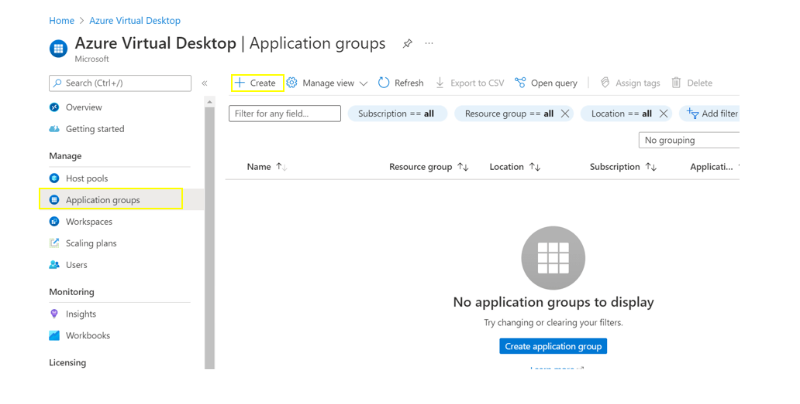  

**_Step 3:_**  Select option “RemoteApp” in Application group type field.  

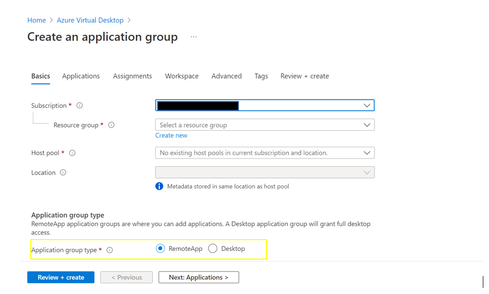 

Note: Reverse connect Transport is enabled by default for secure communication.  

For more information about this control, refer the link: https://techcommunity.microsoft.com/t5/azure-virtual-desktop/windows-virtual-desktop-remoteapps/m-p/825850 and
https://docs.microsoft.com/en-us/azure/virtual-desktop/network-connectivity#reverse-connect-transport  

   

### 10. Ensure the new deployments are tested in validation host pool   

**Security Control Mapping :**  
| Control Number | Control Statement | Security Domain | Default | Associated Runbook | CVSS Severity  |
| -------------- | ----------------- | --------------- | ------- | ------------------ | -------------- |
| [[CS0012133](place holder)](place holder) | Information systems are hardened and configured to align with enterprise requirements | Configuration Management | Not enabled | None | [Medium (5.0)](https://www.first.org/cvss/calculator/3.1#CVSS:3.1/AV:L/AC:H/PR:H/UI:N/S:C/C:L/I:L/A:L)|

**Why?** 

A validation host pool must be created where the service updates are applied first and monitor the service updates before updating the standard or non-validation environment. Without a validation host pool, changes that introduce errors may not be discovered which could result in downtime for users in the standard environment.

**How?**  

**_Step 1:_**  Sign into Azure Portal. Search and select for “Azure virtual Desktop”. 

**_Step 2:_**  In Azure virtual Desktop page, select “Host Pools”.  

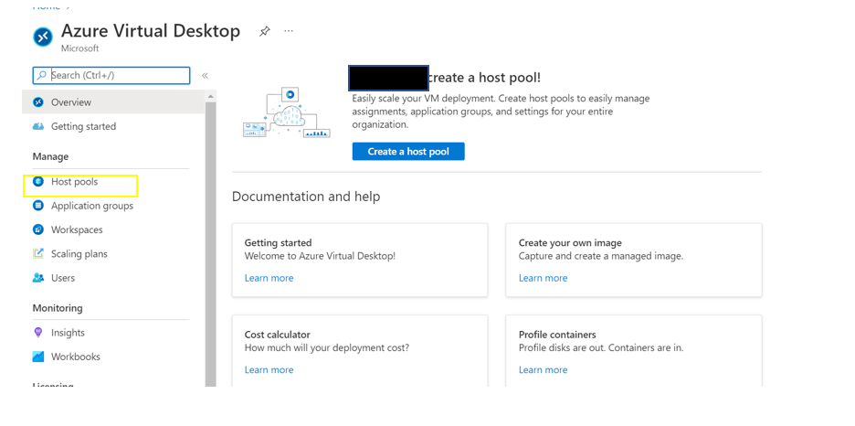  

**_Step 3:_**  Select the name of the host pool to edit.	 
 
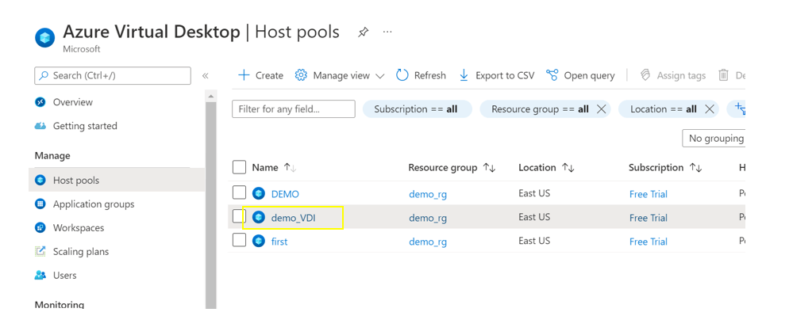  

**_Step 4:_**  Select “Properties” on the left side pane of host pool page.  

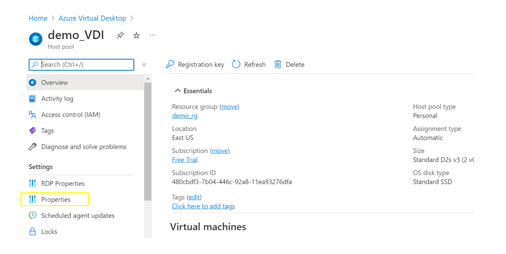  

**_Step 5:_**  In the validation Environment filed, select “Yes” to enable the validation environment and save it.  

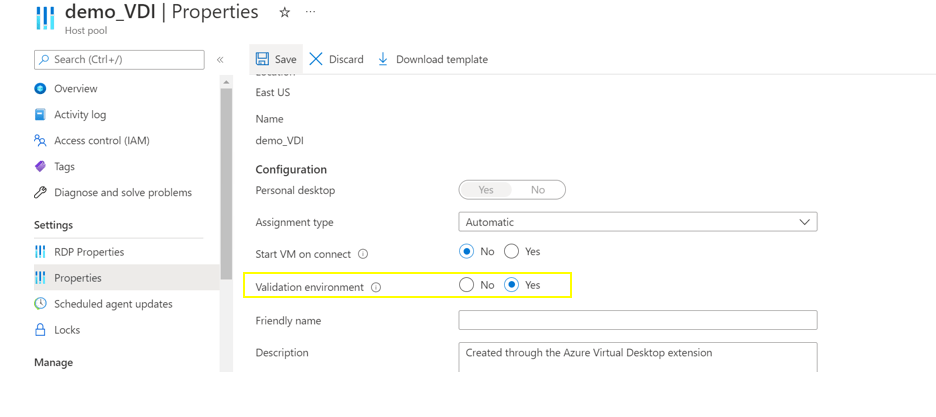 

   

For more information about this control, refer the link: https://docs.microsoft.com/en-us/azure/virtual-desktop/create-validation-host-pool?tabs=azure-portal#define-your-host-pool-as-a-validation-host-pool

### 11. Ensure that Azure Active Directory is selected as the domain to join in the Azure VM  ###

**Security Control Mapping :**  
| Control Number | Control Statement | Security Domain | Default | Associated Runbook | CVSS Severity  |
| -------------- | ----------------- | --------------- | ------- | ------------------ | -------------- |
|  [CS0012298](place holder)	    | Access to change cloud identity access and service control policies is restricted to authorized cloud administrative personnel |  Identity & Access Management | Not enabled | Azure AD Runbook  | [Medium (5.1)](https://www.first.org/cvss/calculator/3.1#CVSS:3.1/AV:A/AC:H/PR:H/UI:N/S:C/C:L/I:L/A:L)  |

**Why?**  

Azure Active Directory authentication is a mechanism to connect to Microsoft Azure SQL Database and SQL Data Warehouse by using identities in Azure Active Directory (Azure AD). With Azure AD authentication, identities of database users and other Microsoft services can be managed in one central location. Central ID management provides a single place to manage database users and simplifies permission management. Azure AD-only auth feature must be enabled in the Azure portal thereby disabling the SQL Authentication for the SQL VM

**How?**  

**_Step 1:_** Go to Azure portal and search Azure virtual Desktop and click on “create a host pool”.  

**_Step 2:_** Enter subscription details, resource group, location under “Basics”.  

**_Step 3:_** Navigate to “Virtual machines” and select “Yes” in Add Azure virtual machines.  

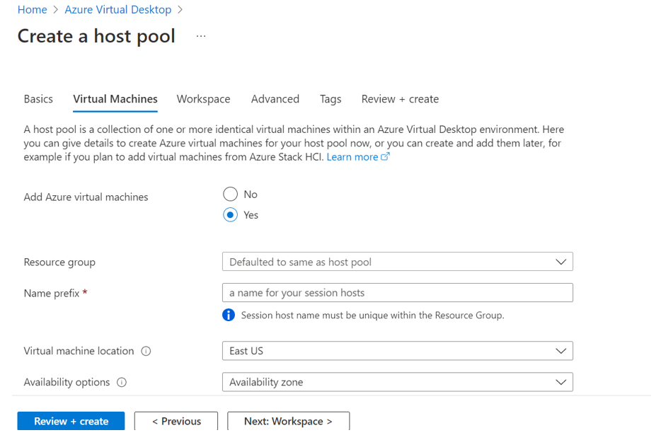  

**_Step 4:_** Enter virtual machine location, availability zone and virtual machine size. select virtual network already created.  

**_Step 5:_** Select “Azure Active Directory” under Domain to join.  

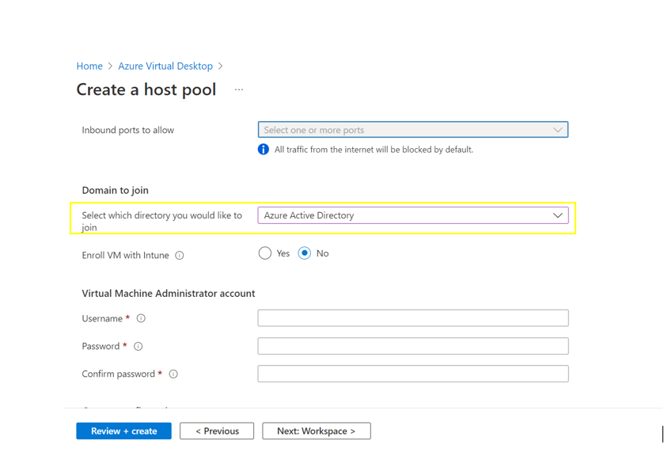  

   

For more information about this control, refer the link: https://docs.microsoft.com/en-us/azure/architecture/example-scenario/wvd/azure-virtual-desktop-azure-active-directory-join  

### 12. Ensure that added VM in virtual desktop is enrolled with Intune  ###

**Security Control Mapping :**  

| Control Number | Control Statement | Security Domain | Default | Associated Runbook | CVSS Severity  |
| -------------- | ----------------- | --------------- | ------- | ------------------ | -------------- |
| [[CS0012133](place holder) | Information systems are hardened and configured to align with enterprise requirements | Configuration Management | Not enabled | None | [Low (1.9)](https://www.first.org/cvss/calculator/3.1#CVSS:3.1/AV:L/AC:H/PR:H/UI:N/S:U/C:L/I:N/A:N)|

**Why?**  

 If Intune is configured in the Azure Active Directory tenant, the virtual machine msut get automatically enrolled during the deployment for the endpoint protection

**How?**  

For more information about this control, refer the link: https://docs.microsoft.com/en-us/mem/intune/fundamentals/azure-virtual-desktop  

**_Step 1:_**  Go to Azure portal and search Azure virtual Desktop and click on “create a host pool”.  

**_Step 2:_**  Enter subscription details, resource group, location under “Basics”.  

**_Step 3:_**  Navigate to “Virtual machines” and select “Yes” in Add Azure virtual machines  

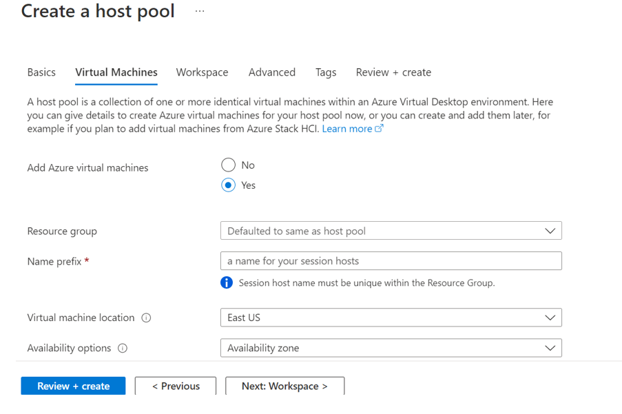  

**_Step 4:_**  Enter virtual machine location, availability zone and virtual machine size. select virtual network already created.  

**_Step 5:_**  Select “Yes” in “Enroll VM with Intune”  

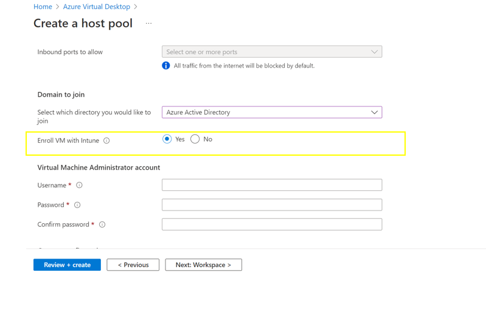 

   

### 13. Ensure Activity logging is enabled for Azure Container Instance ###

**Security Control Mapping :**  
| Control Number | Control Statement | Security Domain | Default | Associated Runbook | CVSS Severity  |
| -------------- | ----------------- | --------------- | ------- | ------------------ | -------------- |
| CS0012233 | Information System must create a log and record activities occurring on or originating from the information system. Logs must be made accessible to the enterprise SIEM solution  | Security Information and event management   | Enabled but not forwarded to Splunk | None | [Low (2.7)](https://www.first.org/cvss/calculator/3.1#CVSS:3.1/AV:P/AC:H/PR:H/UI:N/S:U/C:L/I:N/A:L) |

**Why, What and How ?** 
  
Client rationale and Justification 
[Placeholder link]

   
