# Azure Virtual Network - Security baseline requirement <!-- omit in toc -->
## Baseline security configuration requirement for Azure services<!-- omit in toc -->
---

**Generated By: EY Security Team**  
**Service Type: Networking**  
**Deployment Phase: Service Discovery**  
**Last updated: 04/18/2022** 

## Table of Contents <!-- omit in toc -->

- [Overview](#overview)
  - [Use Case Examples:](#use-case-examples)
- [Cloud Security Requirements](#cloud-security-requirements)
  - [1. Ensure All the Hub Virtual networks are peered with Virtual network gateway subnet to connect Azure ExpressRoute](#1-ensure-all-the-hub-virtual-networks-are-peered-with-virtual-network-gateway-subnet-to-connect-azure-expressroute)
  - [2. Ensure no public IP's used within the Azure tenant](#2-ensure-no-public-ips-used-within-the-azure-tenant)
  - [3. Ensure that Dev/UAT/Prod Hub and spoke VNets are logically separated using azure subscription](#3-ensure-that-devuatprod-hub-and-spoke-vnets-are-logically-separated-using-azure-subscription)
  - [4. Ensure each applications is segmented with spoke Virtual network and spoke VNet connected to Hub network](#4-ensure-each-applications-is-segmented-with-spoke-virtual-network-and-spoke-vnet-connected-to-hub-network)
  - [5. Ensure each subnet has NSG attached to it](#5-ensure-each-subnet-has-NSG-attached-to-it)
  - [6. Ensure VNet administrative tasks leverage Role Based Access Control](#6-ensure-vnet-administrative-tasks-leverage-role-based-access-control)
  - [7. Ensure VMProtectionAlerts is enabled for virtual network using Diagnostic logging](#7-ensure-vmprotectionalerts-is-enabled-for-virtual-network-using-diagnostic-logging)
  - [8. Ensure administrative tasks are performed only in admin-e workstations](#8-ensure-administrative-tasks-are-performed-only-in-admin-e-workstations)
  - [9. Ensure that virtual network uses standard organizational Resource tagging method](#9-ensure-that-virtual-network-uses-standard-organizational-resource-tagging-method)

##  Overview 

Azure Virtual Network (VNet) is the fundamental building block for your private network in Azure. Azure virtual network enables Azure resources to securely communicate with each other, the internet, and on-premises networks in order to filter network traffic, route network traffic, and integration with Azure services.

| Control Number | Cloud Baseline Security Requirements                                                                             |
| -------------- | ---------------------------------------------------------------------------------------------------------------- |
| 1              | Ensure All the Hub Virtual networks are peered with Virtual network gateway subnet to connect Azure ExpressRoute |
| 2              | Ensure no public IP's used within the Azure tenant                                                               |
| 3              | Ensure that Dev/UAT/Prod Hub and spoke VNets are logically separated using azure subscription                    |
| 4              | Ensure each applications is segmented with spoke Virtual network and spoke VNet connected to Hub network         |
| 5              | Ensure each subnet has NSG attached to it                                                                        |
| 6              | Ensure VNet administrative tasks leverage Role Based Access Control                                              |
| 7              | Ensure VMProtectionAlerts is enabled for virtual network using Diagnostic logging                                |
| 8              | Ensure administrative tasks are performed only in admin-e workstations                                           |
| 9              | Ensure that virtual network uses standard organizational Resource tagging method                                 |

### Use Case Examples:
- AI-based footfall detection
- Elastic Workplace Search on Azure
- SAP workload automation using SUSE on Azure
- Zero-trust network for web applications with Azure Firewall and Application Gateway
- Unisys ClearPath Forward mainframe rehost to Azure using Unisys virtualization

## Cloud Security Requirements ##

### 1. Ensure All the Hub Virtual networks are peered with Virtual network gateway subnet to connect Azure ExpressRoute 

**Security Control Mapping :** 

| Control Number | Control Statement | Security Domain | Default | Associated Runbook |
| ----------------- | ---------------|----------- |----------|-----------|
| CS0012300 | Cloud products and services must be deployed on private subnets and public access must be disabled for these services | Network Security | Not enabled | Virtual Network Runbook |

**Why?**

Organization uses Azure ExpressRoute to connect on-prem data center to Azure. Gateway subnet allows to connect ExpressRoute to Hub virtual network. Virtual Network Gateway must be implemented to ensure all the network traffic is routed through On-premise Data center and blocks the direct egress traffic from Azure Virtual Networks

**How?**  
Step1: Go to Azure portal, search for ExpressRoute and create 
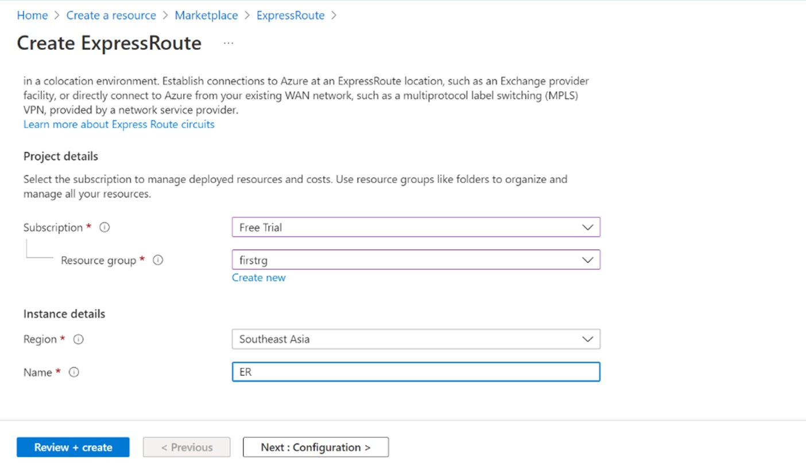 

Step 2: Fill all the basic values, resource name and instance name, click next and fill configuration 
  

Step 3: After selecting all the required values in configuration, select a provider and peering location and bandwidth. click next add tags if needed and create ExpressRoute. 

Step 4: Now after Ensuring that ExpressRoute circuit and Azure private peering have been configured successfully. Go to the connection and click on add  
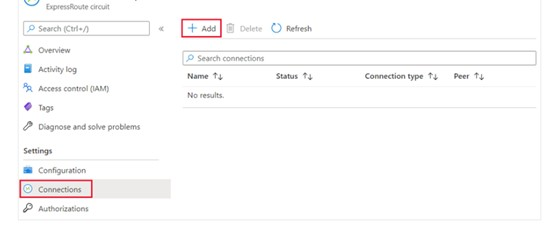 

Step 5: Now enter the name for the connection and then select settings, select the virtual network gateway and then review nd create. 
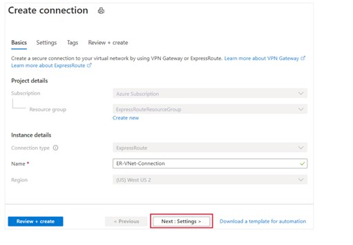 

Step 6: After the connection has been successfully configured, connection object will show the information for the connection. 
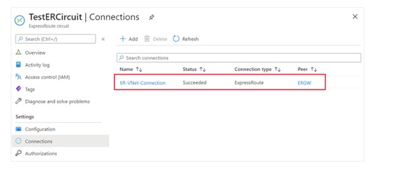 

For peering , refer the below link to peer the spoke Vnets with Hub Vnet
[Placeholder link]

### 2. Ensure no public IP's used within the Azure tenant ###

**Security Control Mapping :** 

| Control Number | Control Statement | Security Domain | Default | Associated Runbook |
| ----------------- | ---------------|----------- |----------|-----------|
| CS0012300 | Cloud products and services must be deployed on private subnets and public access must be disabled for these services | Network Security | Not enabled | Virtual Network Runbook |

**Why?**
 
The enterprise environments are exposed to the internet via the public IPs, making them vulnerable to attacks and data exfiltration. Usage of public IPs must be limited or restricted to ensure that no service is using the public network to route the traffic
 
**How?** 

Step 1: Go to Azure portal and search for Policy, select for definition in menu section 
 

Step 2: Select the scope and search for Public IP and select the Deny Public IP 
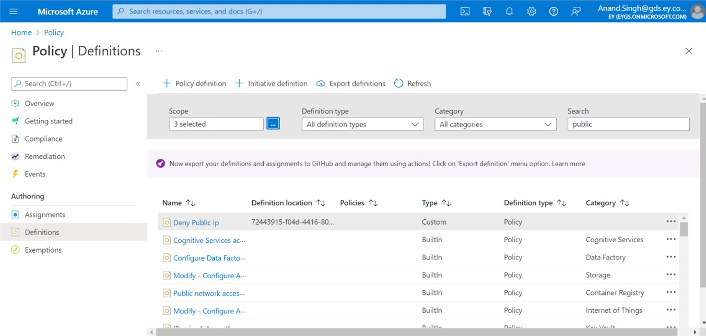 

Step 3: After clicking on Deny public IP, click on assign. 
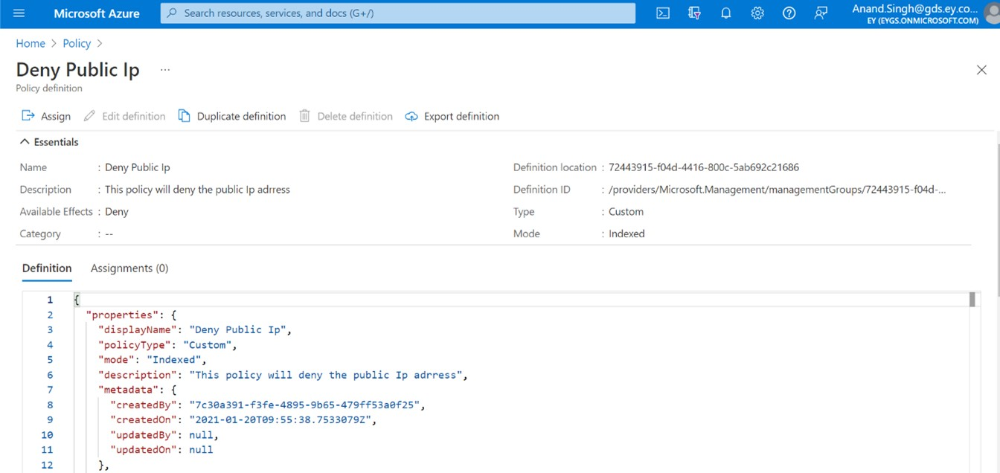 

### 3. Ensure that Dev/UAT/Prod Hub and spoke VNets are logically separated using azure subscription ###

**Security Control Mapping :** 

| Control Number | Control Statement | Security Domain | Default | Associated Runbook |
| ----------------- | ---------------|----------- |----------|-----------|
| CS0012300 | Cloud products and services must be deployed on private subnets and public access must be disabled for these services | Network Security | Not enabled | Virtual Network Runbook |

**What, Why and How?**

Azure Subscriptions are a logical unit of Azure services that are served as a single billing entity for Azure resources used in that account. A Subscription must use the identity and access stack which helps on enforcing isolation among Dev/UAT/Prod subscriptions, and also limits access to Azure resources by logically isolating to authorized users across Dev/UAT/Prod hub.

Refer the below for more details
[place holder link]

### 4. Ensure each applications is segmented with spoke Virtual network and spoke VNet connected to Hub network ###

**Security Control Mapping :** 

| Control Number | Control Statement | Security Domain | Default | Associated Runbook |
| ----------------- | ---------------|----------- |----------|-----------|
| CS0012300 | Cloud products and services must be deployed on private subnets and public access must be disabled for these services | Network Security | Not enabled | Virtual Network Runbook |

**What, Why and How?**
  
Each virtual application should be segmented using spoke VNet and spoke VNet need to paired with associated Dev/Prod hub VNet. Each application must be logically segmented into one or multiple subnets and access controls between subnets must be implemented. Each subnet must have an unique address range, in CIDR format, and this range cannot overlap with the ranges for other subnets. Alternatively , network access controls can be created using NSGs, which allows the creation of allow/deny rules for network traffic

Enterprise network architecture and design is documented and managed by Network Team.Team should follow the guidelines documented in below confluence page.
[Placeholder link]

### 5. Ensure each subnet has NSG attached to it ###

**Security Control Mapping :** 

| Control Number | Control Statement | Security Domain | Default | Associated Runbook |
| ----------------- | ---------------|----------- |----------|-----------|
| CS0012300 | Cloud products and services must be deployed on private subnets and public access must be disabled for these services | Network Security | Not enabled | Virtual Network Runbook |

**Why?**
  
Network security groups are used to filter network traffic to and from Azure resources in an Azure virtual network and offer security to inbound/outbound traffic. You can associate network security groups to each virtual network subnet and network interface in a virtual machine. Each subnet will require association to an NSG in order to offer to properly allow or deny inbound and outbound traffic. 

**How?** 
Step 1: In the search box at the top of the portal, enter network interfaces in the search box. When network interfaces appear in the search results, select it. 

Step 2: Select the network interface in the list that you want to associate a network security group to, or dissociate a network security group from. 

Step 3: Select Network security group under SETTINGS. 

Step 4: Select Edit. 

Step 5: Select Network security group and then select the network security group you want to associate to the network interface, or select None, to dissociate a network security group. 

Step 6: Select Save. 

### 6. Ensure VNet administrative tasks leverage Role Based Access Control ###

**Security Control Mapping :** 

| Control Number | Control Statement | Security Domain | Default | Associated Runbook |
| ----------------- | ---------------|----------- |----------|-----------|
| CS0012300 | Cloud products and services must be deployed on private subnets and public access must be disabled for these services | Network Security | Not enabled | Virtual Network Runbook |

**Why?**

Azure Virtual Network is a logical representation of the network in the cloud. Some of the Virtual network capabilities are network isolation and segmentation , communication with Internet, premise and other cloud resources. Hence the implementation and maintenance of Virtual networks in Azure Subscriptions must be configured to be handled only by the Network engineering team. Allowing only the Network engineering team to perform VNet administrative tasks will help to maintain least privilege , to simplify the virtual network deployment complexity and also to avoid unnecessary outage due to incorrect configurations by teams other than Network engineering 

**How?** 

Step 1: Login to Azure portal, select ‘Azure Active directory’ 
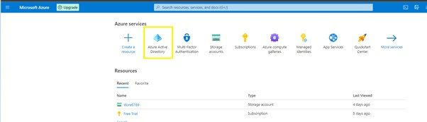 

Step 2: Add ‘Group’ to create a specific group 
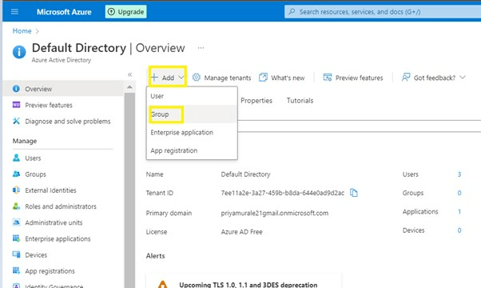 

Step 3: Provide a group name based on the team/Application and click ‘Create’ 
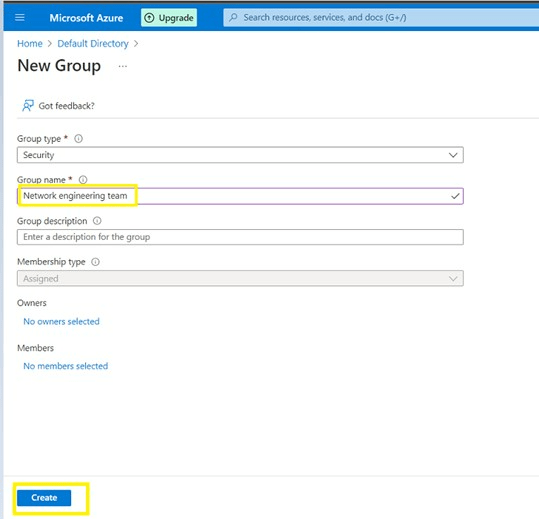 

Step 4: Add members to the created group by selecting the appropriate users. 
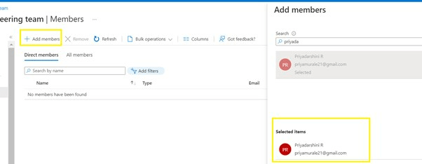 

Step 5: Validate the members in the group 
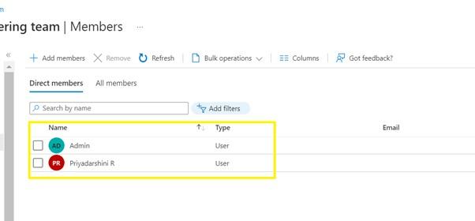 

Step 6: Navigate to resources/Home page, select the desired ‘Virtual network’ 
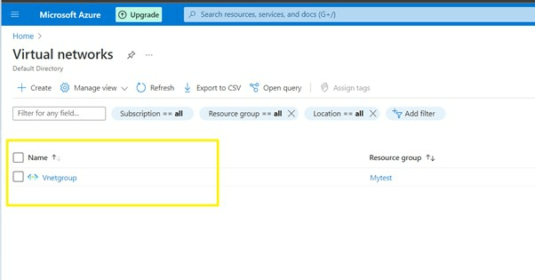 

Step 7: Select ‘IAM’ Access control under the Vnet settings and click ‘Add’ to include  Role Assignment. 
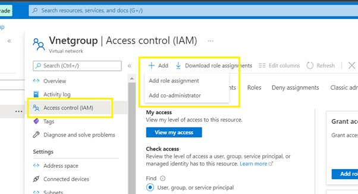 

Step 8: Select the Role based on the requirement for the created group. 
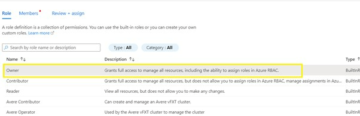 

Step 9: Add the created group in the role assignment section. 
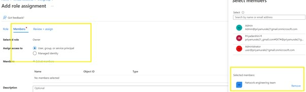 

Step 10: Validate the Role and members (group name) in the ‘Role Assignment’ 
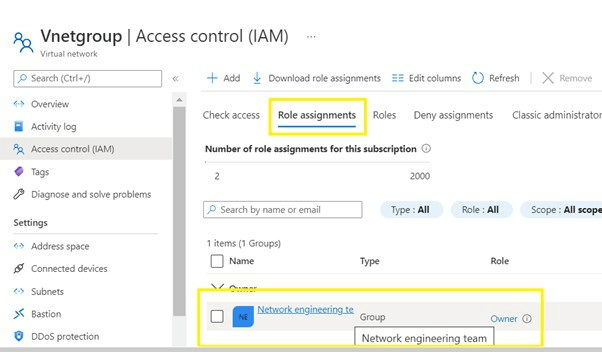 

### 7. Ensure VMProtectionAlerts is enabled for virtual network using Diagnostic logging ###

**Security Control Mapping :** 

| Control Number | Control Statement | Security Domain | Default | Associated Runbook |
| ----------------- | ---------------|----------- |----------|-----------|
|  | | Security Logging  | Not enabled | None |

**Why?**

VM protections logs must be enabled to alert any suspicious activity on Virtual network.

**How?** 
Step 1: Click on the Vnet that was created.  
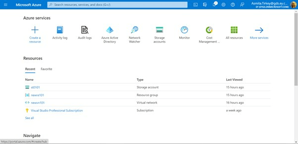 

Step 2: View the diagnostic logging setting in the side menu and a +Add diagnostic setting to add diagnostic setting . 
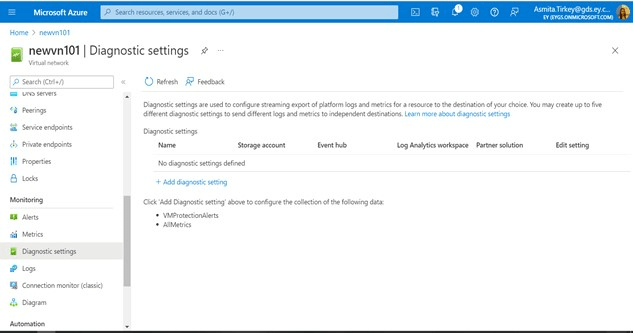   

Step 3: Click the check box for VMProtectionAlerts to enable it for the protection. 
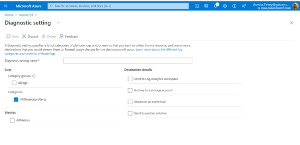 

Step 4: Collect the logs and store in Logs Storage account. Connect splunk to the Logs storage account and configure the inputs to extract the logs from Azure storage to Splunk  

### 8. Ensure administrative tasks are performed only in admin-e workstations ###

**Security Control Mapping :** 

| Control Number | Control Statement | Security Domain | Default | Associated Runbook |
| ----------------- | ---------------|----------- |----------|-----------|
|  CS0012298	    | Access to change cloud identity access and service control policies is restricted to authorized cloud administrative personnel |  IAM | Not enabled | None |

**Why?**

A Privileged workstation provides a hardened workstation that has clear application control and application guard. The workstation uses credential guard, device guard, app guard, and exploit guard to protect the host from malicious behavior. All the administrative tasks must be performed only using these Privileged workstation

**How?** 

step 1 : Request permission to add the user to corresponding entitlements to access admin e workstation

Step 2 : Login to the workstation as the user and launch the azure portal in browser to perform administrative tasks 
[Place holder for link]

### 9. Ensure that virtual network uses standard organizational Resource tagging method ###

**Security Control Mapping :** 

| Control Number | Control Statement | Security Domain | Default | Associated Runbook |
| ----------------- | ---------------|----------- |----------|-----------|
|  | |Asset Management  | Not enabled | None |

**Why?**
  
Tagging the virtual networks will help to identify the logical way to own the resource and group them and also helping to assess their security posture and take action on potential areas of weakness.

**How?** 
Step1: Sign into Azure portal, search for ‘Azure Virtual Network’ and select create resource  
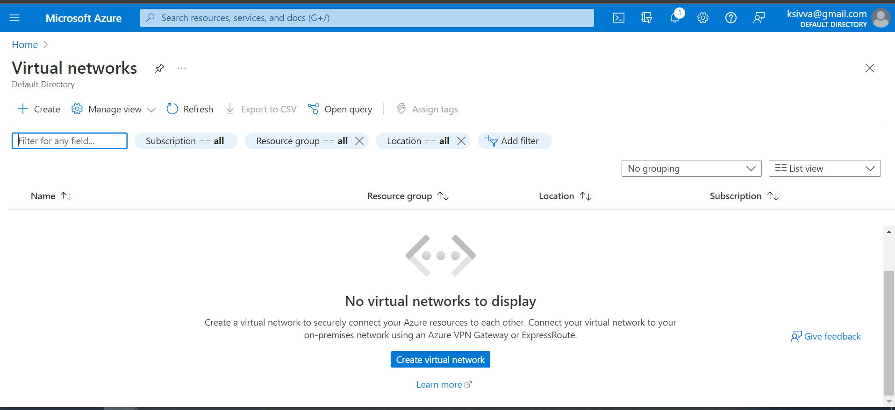 

Step 2: Provide resource group, instance name and location. 
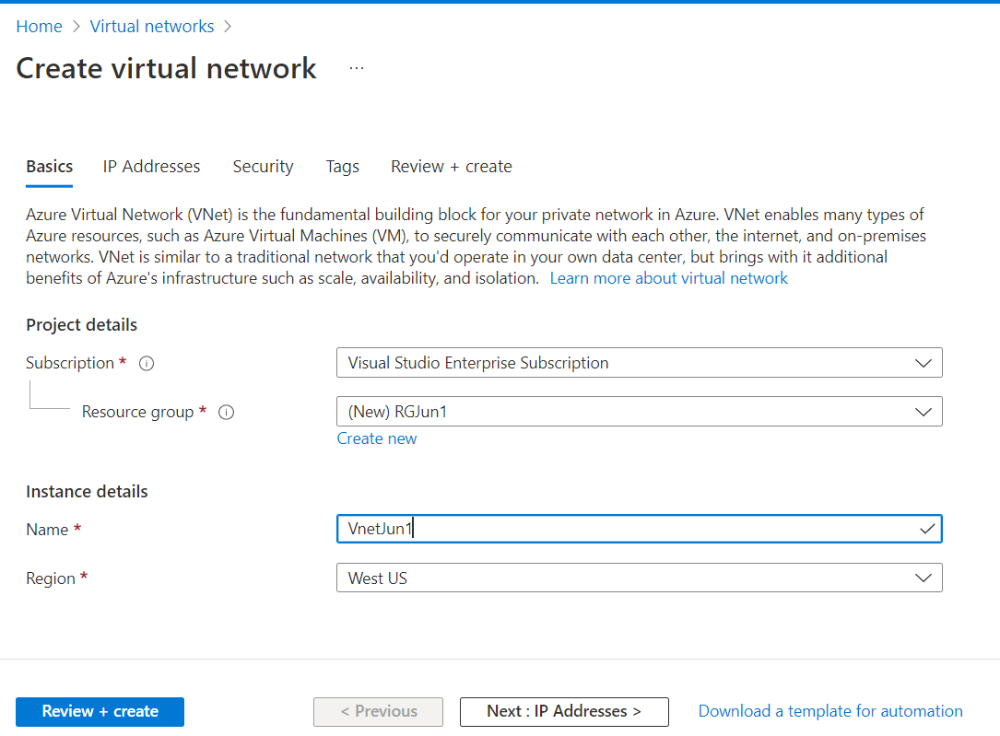 

Step 3: In the Tags tab, provide the respective name and value details. 
Review and create to complete the process. 
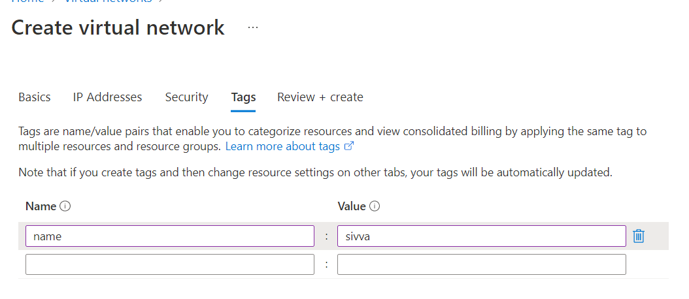 

Step 4: We can also create the tag once after the creation of resource. 
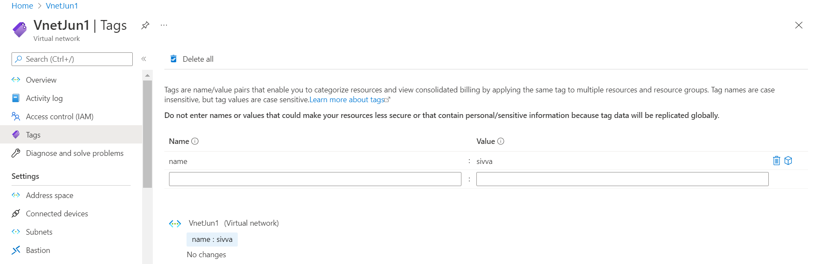 
