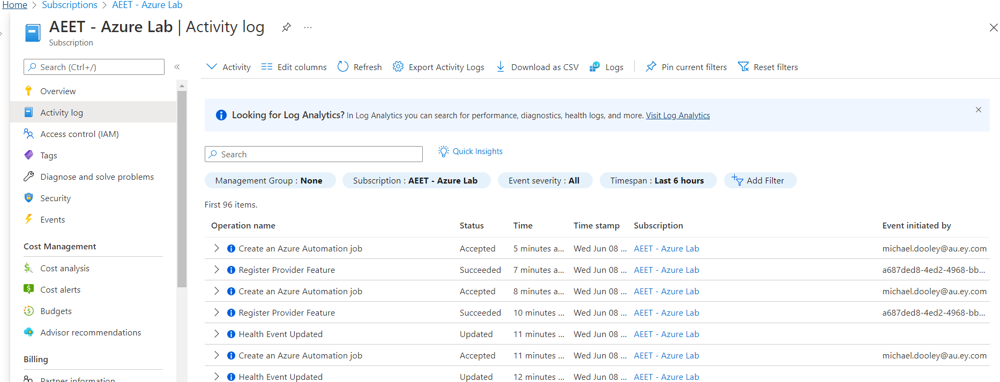
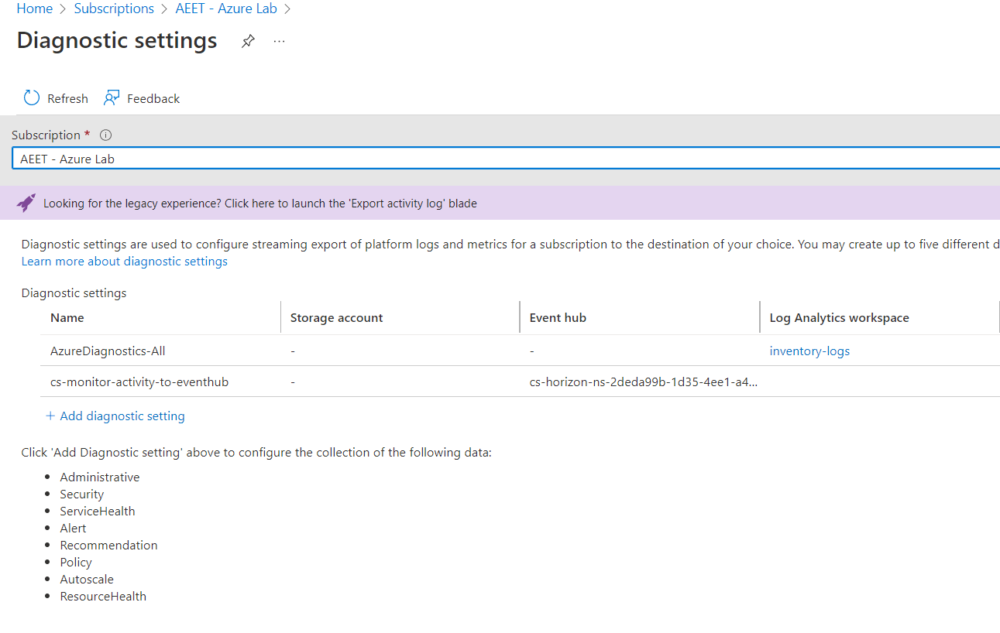
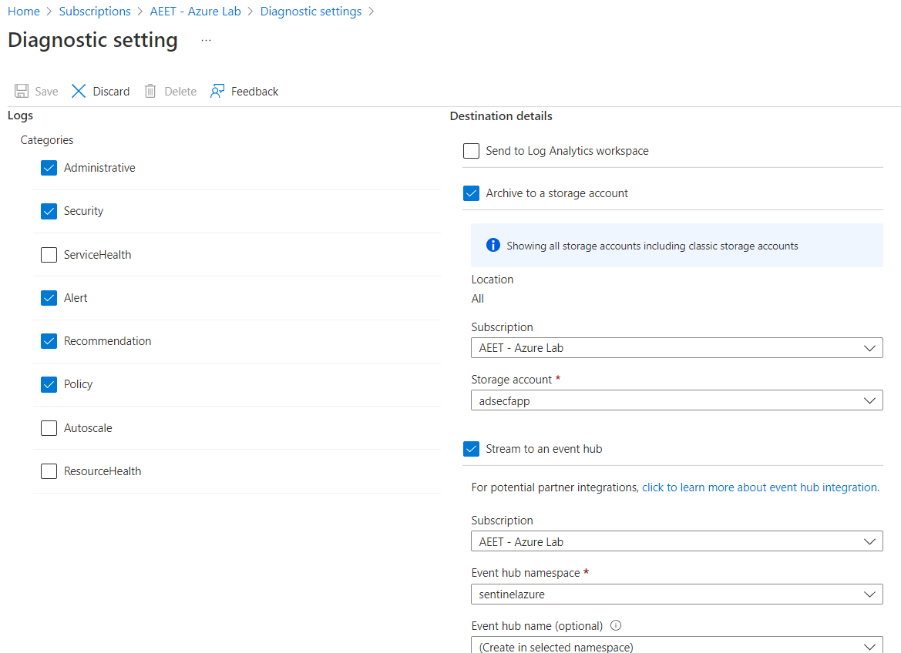
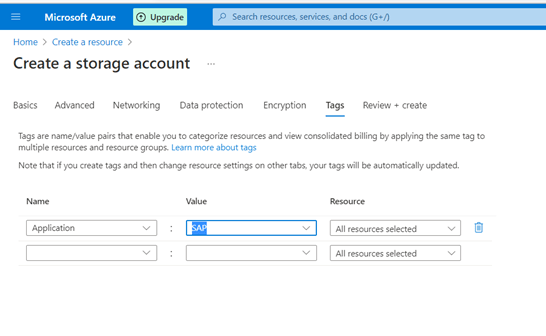
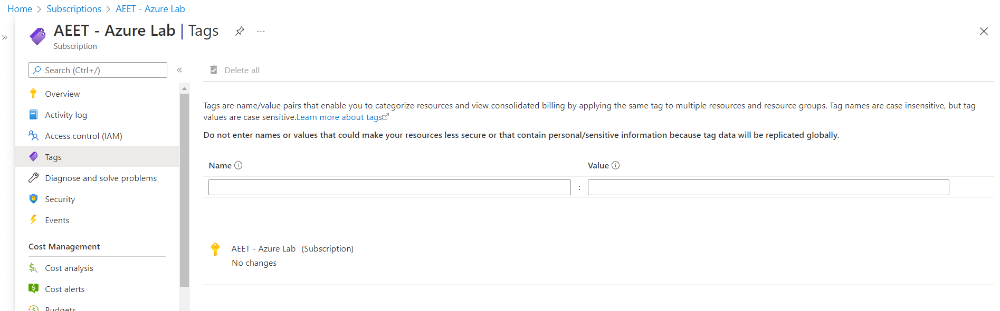
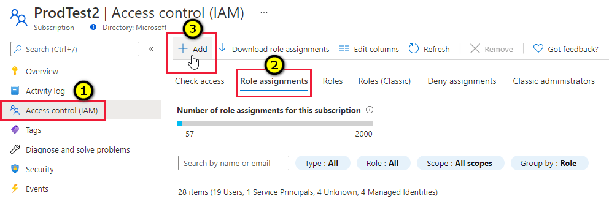
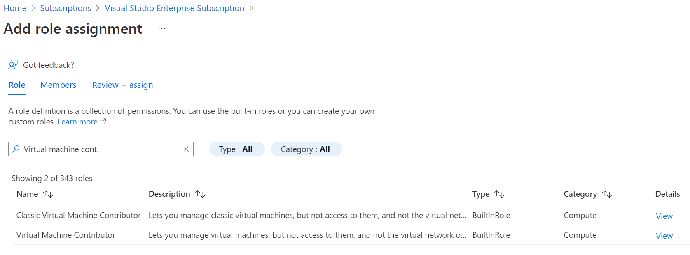
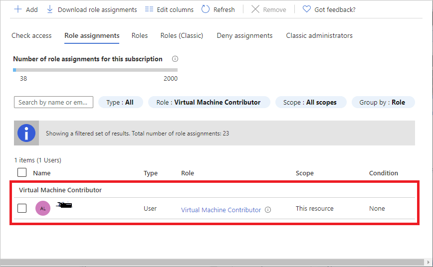
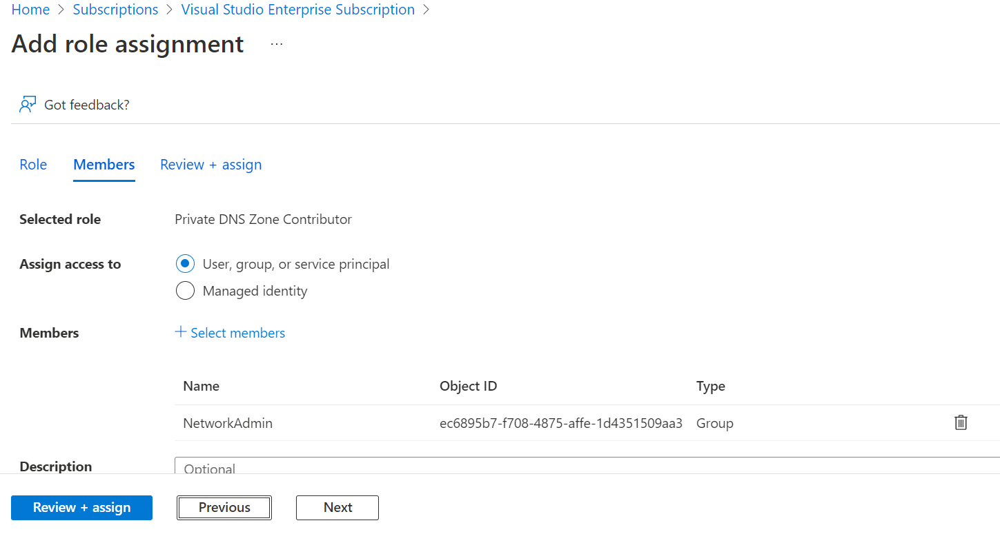
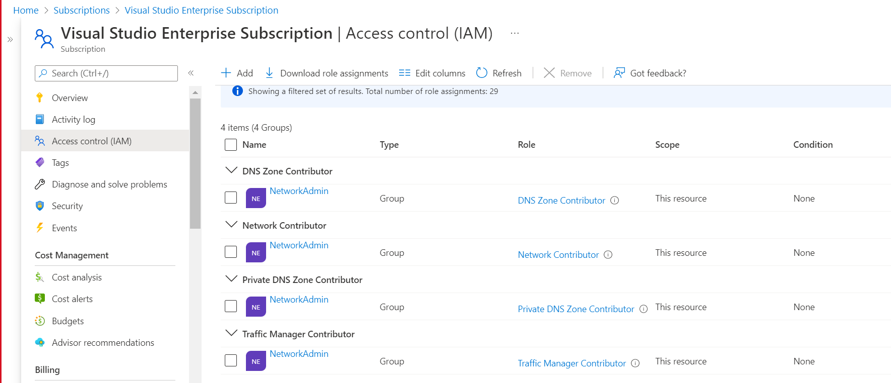

## Baseline security configuration requirement for Azure platform <!-- omit in toc -->

**Generated By: EY Security Team**  
**Service Type: Platform**  
**Deployment Phase: Service Discovery**  
**Last updated: 06/08/2022** 

## Table of Contents <!-- omit in toc -->

- [Overview](#overview)
- [Cloud Security Requirements](#cloud-security-requirements)
  - [1. Ensure activity logs are enabled for each subscription](#1-ensure-activity-logs-are-enabled-for-each-subscription)
  - [2. Ensure all the azure Services uses standard organizational Resource tagging method](#2-ensure-all-the-azure-services-uses-standard-organizational-resource-tagging-method)
  - [3. Ensure that least privilege access method is implemented using Role-based access control (RBAC)](#3-ensure-that-least-privilege-access-method-is-implemented-using-role-based-access-control-rbac)

## Overview

Organizational runbook it is Platform  level requirement for Azure that it applied at subscription, Management Group or Tenant level and Individual service may inherit the requirement documented here

## Cloud Security Requirements 

| Control Number | Cloud Baseline Security Requirements                                                            |
| -------------- | ----------------------------------------------------------------------------------------------- |
| 1              | Ensure activity logs are enabled for each subscription                                          |
| 2              | Ensure all the azure Services uses standard organizational Resource tagging method              |
| 3              | Ensure that least privilege access method is implemented using Role-based access control (RBAC) |

### 1. Ensure activity logs are enabled for each subscription

**Security Control Mapping :** 

| Control Number | Control Statement | Security Domain | Default | Associated Runbook |
| ----------------- | ---------------|----------- |----------|-----------|
|  	      |  | Security Logging  |Not enabled | None |

**Why?**

Activity logs provides control plane level visibility into administrative task performed at individual service with in subscription . Enabling security related logs will allow Security operation's to create high fidelity security alert on anomalous changes to all the service with in the subscription. 

**How?** 

**Step 1:** In the side menu bar of the Subscription, Navigate to activity log and click on `Export Activity Logs`. 
 

**Step 2:** on Diagnostic Settings page click on `Add diagnostic setting` and select Administrative, Security, Alert, policy, recommendation log type and Select Destination details to be `Archive to a storage account` or use `EventHub` to forward it to namspace where jobid is configured to collect logs in splunk  
 

**Step 3:** Collect the logs and store in Logs Storage account. Connect splunk app for Microsoft services to the Logs storage account and configure the inputs to extract the logs from Azure storage to Splunk  
`[Place holder for link]`

### 2. Ensure all the azure Services uses standard organizational Resource tagging method

**Security Control Mapping :** 

| Control Number | Control Statement | Security Domain | Default | Associated Runbook |
| ----------------- | --------------- |----------- |----------|-----------|
|        | | Data Protection  | Not enabled | None |

**Why?**

Tagging Storage Accounts will help to identify the logical way to own the resource and group them and also helping to assess their security posture and take action on potential areas of weakness.

**How?**  
Tagging can be achieved while creating the storage account and after the storage account is created. 

### Tagging new resource - Storage account <!-- omit in toc -->

**Step 1:** Open Azure portal and navigate to `Storage Accounts` under services  

**Step 2:** Create a storage account and provide the Basic Information which required.                                              

**Step 3:**  Fill the necessary inputs in other tabs based on the requirement.  

**Step 4:**   While creating the resource, provide the Tag information `Name` and `Value` in Tags option.  

  

### Tagging the existing Subscription <!-- omit in toc -->
Select the subscription and navigate to "Tag" option on left menu and provide the Tag information ‘Name’ and ‘Value’ in Tags option  

 

### 3. Ensure that least privilege access method is implemented using Role-based access control (RBAC) 

**Security Control Mapping :**

| Control Number | Control Statement | Security Domain | Default | Associated Runbook |
| ----------------- | --------------- |----------- |----------|-----------|
|  CS0012298	    | Access to change cloud identity access and service control policies is restricted to authorized cloud administrative personnel |  None | Not enabled | None |

**Why?**

Role-based access control (RBAC) is method of implementing least privilege access by providing access user and service principle based on job function. Azure has several service specific roles the provides granular access. Using Azure entitlements and the usage pattern custom roles can be developed to implement the granular access to individual user and service principal. 

In order to implement the RBAC access control with in the Enterprise, Organization IT Team and application development team needs and roles needs to be established and Custom roles specific to enterprise needs to be developed. Azure documents all the built in role, Based on the Enterprise requirement these build in roles should be grouped to develop custom roles and should be used to implement granular access control.

### Use case example: <!-- omit in toc -->
1.  Compute Admin team is responsible for provisioning VM for predefine configuration and will have admin access to configure the security hardening requirement but will not have access to perform any network administration or grant access to other users. 
2.  Network Administrator will have roles required to manage network configuration for Virtual Machine and other services with in Azure Tenant

**How?** 

### Roles for Compute Admin <!-- omit in toc -->

As the Compute admin should have Administrative access but not to configure network and grant access to other users. Hence, Compute Admin should not be granted built in roles like `Owner`, `Contribute` and `Virtual Machine Administrator Login` as all these built in roles provide wider access for compute admin to configure network and `owner` role will will allow compute admin to grant access to other users. Compute admin should be given `Virtual Machine Contributor` built-in role and can be granted at the Subscription level or management group level based on Azure Tenant design.

Virtual Machine Contributor will be used to Create and manage virtual machines, manage disks, install and run software, reset password of the root user of the virtual machine using VM extensions, and manage local user accounts using VM extensions. This role does not grant you management access to the virtual network or storage account the virtual machines are connected to. This role does not allow you to assign roles in Azure RBAC.

**Step 1:** Open Azure portal and navigate to `Subscriptions` under services and select the subscription to be granted access to compute admin  

**Step 2:** Navigate to `Access Control (IAM)`  

**Step 3:** select `Add` option to include `Role Assignment`.  
 

**Step 4:** On the Role tab, search for `Virtual Machine Contributor` role.
 

**Step 5:** select Assign the access to `User, group, or Service Principal` radio button and click on `Select members` to add `ComputeAdmin` group. Click on `Review + assign` to create role assignment  

**Step 6:**  Once the access control is added successfully., the created role will be listed in the Role assignments tab.  
 

### Roles for Network Admin <!-- omit in toc -->

Network admin team is responsible for managing the network configuration like deploying resources to VNet, configuring Private Endpoint and DNS Zones. In order to perform these following function the group should have following built-In roles assigned at Subscription or Management group level but should not have `owner` or `Contributor` role assigned to Network Admin group. 

1. [Network Contributor](https://github.com/MicrosoftDocs/azure-docs/blob/main/articles/role-based-access-control/built-in-roles.md#network-contributor)
Lets you manage networks, but not access to them.  
2. [Private DNS Zone Contributor](https://github.com/MicrosoftDocs/azure-docs/blob/main/articles/role-based-access-control/built-in-roles.md#private-dns-zone-contributor)
Lets you manage private DNS zone resources, but not the virtual networks they are linked to.   
3. [DNS Zone Contributor](https://github.com/MicrosoftDocs/azure-docs/blob/main/articles/role-based-access-control/built-in-roles.md#dns-zone-contributor)
Lets you manage DNS zones and record sets in Azure DNS, but does not let you control who has access to them.   
4. [Traffic Manager Contributor](https://github.com/MicrosoftDocs/azure-docs/blob/main/articles/role-based-access-control/built-in-roles.md#traffic-manager-contributor)
Lets you manage Traffic Manager profiles, but does not let you control who has access to them.   

#### Following two method can be used To Implement the following role assignment to Network admin <!-- omit in toc -->

 1. Create custom role `NetworkAdminRole` and assign all the entitlements from [Network Contributor](https://github.com/MicrosoftDocs/azure-docs/blob/main/articles/role-based-access-control/built-in-roles.md#network-contributor), [Private DNS Zone Contributor](https://github.com/MicrosoftDocs/azure-docs/blob/main/articles/role-based-access-control/built-in-roles.md#private-dns-zone-contributor), [DNS Zone Contributor](https://github.com/MicrosoftDocs/azure-docs/blob/main/articles/role-based-access-control/built-in-roles.md#dns-zone-contributor) and [Traffic Manager Contributor](https://github.com/MicrosoftDocs/azure-docs/blob/main/articles/role-based-access-control/built-in-roles.md#traffic-manager-contributor) and assign role to `NetworkAdmin`  

 2. Individually assign builtin roles to `NetworkAdmin` as shown below  

    **Step 1:** Open Azure portal and navigate to `Subscriptions` under services and select the subscription to be granted access to compute admin  

    **Step 2:** Navigate to `Access Control (IAM)`  

    **Step 3:** select `Add` option to include `Role Assignment`.  

    **Step 4:** On the Role tab, search for `Private DNS Zone Contributor` role  

    **Step 5:**  select Assign the access to `User, group, or Service Principal` radio button and click on `Select members` to add `NetworkAdmin` group. Click on `Review + assign` to create role assignment   
     

    **Step 6:** Repeat  `Step 1` through `Step 5`  to assign roles `Network Contributor`, `DNS Zone Contributor` and `Traffic Manager Contributor` to `NetworkAdmin` group  

    **Step 6:**  Once the access control is added successfully, the created roles will be listed in the Role assignments tab.  
     
