# Azure Storage Account - Security baseline requirement <!-- omit in toc -->
### Baseline security configuration requirement for Azure services ### <!-- omit in toc -->
---

**Generated By: TBD**  
**Service Type: Storage**  
**Deployment Phase:**  
**Last updated: 04/05/2022** 

## Table of Contents <!-- omit in toc -->
- [Overview](#overview)
  - [Use Case Examples:](#use-case-examples)
- [Cloud Security Requirements](#cloud-security-requirements)
  - [1. Ensure storage account is Protected using Private Endpoint](#1-ensure-storage-account-is-protected-using-private-endpoint)
  - [2. Ensure Public network access is set to Disabled](#2-ensure-public-network-access-is-set-to-disabled)
  - [3. Ensure 'Trusted Microsoft Services' are Enabled for Storage Account Access](#3-ensure-trusted-microsoft-services-are-enabled-for-storage-account-access)
  - [4. Ensure that 'Public access level' is set to Private for blob containers](#4-ensure-that-public-access-level-is-set-to-private-for-blob-containers)
  - [5. Ensure Diagnostic logs are enabled for storage account](#5-ensure-diagnostic-logs-are-enabled-for-storage-account)
  - [6. Ensure that least privilege access method is implemented using Role-based access control (RBAC)](#6-ensure-that-least-privilege-access-method-is-implemented-using-role-based-access-control-rbac)
  - [7. Ensure that 'Default to Azure Active Directory authorization in the Azure portal' is set to 'Enabled'](#7-ensure-that-default-to-azure-active-directory-authorization-in-the-azure-portal-is-set-to-enabled)
  - [8. Ensure that 'Secure transfer required' is set to 'Enabled'](#8-ensure-that-secure-transfer-required-is-set-to-enabled)
  - [9. Ensure Storage for Critical Data are Encrypted with Customer Managed Keys](#9-ensure-storage-for-critical-data-are-encrypted-with-customer-managed-keys)
  - [10. Ensure Soft Delete is Enabled for Azure Storage](#10-ensure-soft-delete-is-enabled-for-azure-storage)
  - [11. Ensure that storage account uses standard organizational Resource tagging method](#11-ensure-that-storage-account-uses-standard-organizational-resource-tagging-method)

##  Overview

Azure Storage Account is a core service offered by Azure that provides object storage. It is basically a container which allows multiple services like Blob, Queue, Table and Disks. An unique namespace is created whenever the storage account is provisioned 

| Control Number | Cloud Baseline Security Requirements                                                                  |
| -------------- | ----------------------------------------------------------------------------------------------------- |
| 1              | Ensure storage account is Protected using Private Endpoint                                            |
| 2              | Ensure Public network access is set to Disabled                                                       |
| 3              | Ensure 'Trusted Microsoft Services' are Enabled for Storage Account Access                            |
| 4              | Ensure that 'Public access level' is set to Private for blob containers                               |
| 5              | Ensure Diagnostic logs are enabled for storage account                                                |
| 6              | Ensure that least privilege access method is implemented using Role-based access control (RBAC)       |
| 7              | Ensure that 'Default to Azure Active Directory authorization in the Azure portal' is set to 'Enabled' |
| 8              | Ensure that 'Secure transfer required' is set to 'Enabled'                                            |
| 9              | Ensure Storage for Critical Data are Encrypted with Customer Managed Keys                             |
| 10             | Ensure Soft Delete is Enabled for Azure Storage                                                       |
| 11             | Ensure that storage account uses standard organizational Resource tagging method                      |

### Use Case Examples:
- Hybrid file share
- Backup and Restore Data
- Multitenant Web apps

## Cloud Security Requirements ##

### 1. Ensure storage account is Protected using Private Endpoint ###

**Security Control Mapping :** 

| Control Number | Control Statement | Security Domain | Default | Associated Runbook |
| ----------------- | ---------------|----------- |----------|-----------|
| CS0012300 | Cloud products and services must be deployed on private subnets and public access must be disabled for these services | Network Security | Not enabled | Virtual Network Runbook |

**Why?**

   private endpoint protect the azure storage account from internet by ensuring traffic between your virtual network and the service travels the Microsoft backbone network without going over the internet. Private Endpoint will provide a endpoint with Private IP which can be associated with VNet with in tenant, other tenant or from On premise. A FQDN record will be created in Azure DNS to enable other tenants VNets to be associated with Azure storage. Based on the use case either Service Endpoint or private endpoint should be used.

**How?** 

Step 1: Click on the create storage account, Storage account creation page will appear. In the Networking tab, select the private endpoint option.  

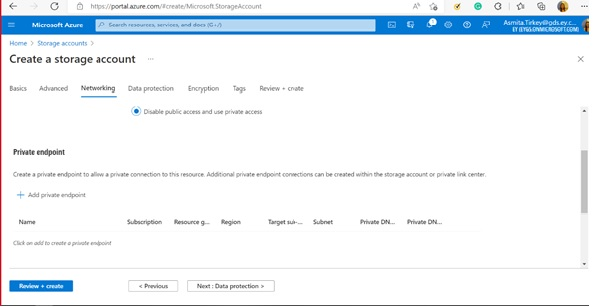 
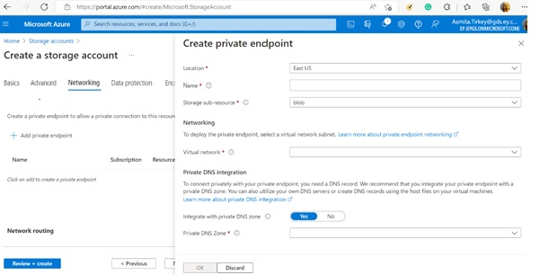 

Step 2: After selecting the add private endpoint option, Select a particular virtual network so that every user connected to that virtual network can get access to that storage account. Provide a private DNS details which will be used to resolve private IP  

### 2. Ensure Public network access is set to Disabled ###

**Security Control Mapping :** 

| Control Number | Control Statement | Security Domain | Default | Associated Runbook |
| ----------------- | --------------- |----------- |----------|-----------|
|  CS0012300 | Cloud products and services must be deployed on private subnets and public access must be disabled for these services | Network Security | Not Enabled | None |

**Why?**

 Since storage accounts connects on any network by default, Storage accounts must be configured to deny access to traffic from all networks and restrict access only to required Azure Virtual networks using Private Endpoint.

**How?** 

Go to the storage account and Select Networking option and disable the default network access rule for storage account.  
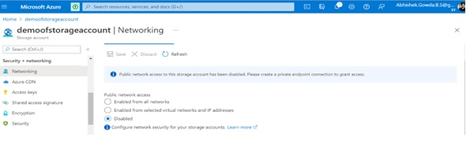 

### 3. Ensure 'Trusted Microsoft Services' are Enabled for Storage Account Access ###

**Security Control Mapping :**  

| Control Number | Control Statement | Security Domain | Default | Associated Runbook |
| ----------------- | --------------- |----------- |----------|-----------|
|  CS0012300 | Cloud products and services must be deployed on private subnets and public access must be disabled for these services | Network Security | Enabled | None |

**Why?**

 Communication between Storage Account and certain Microsoft services like Azure Backup, Azure Site Recovery, Azure DevTest Labs, Azure Event Grid, Azure Networking and Azure Monitor may not happen from networks that can be granted access through network rules.  Those services can interact with the Storage account by selecting the allow trusted Microsoft services checkbox.

**How?** 
In the storage account, navigate to Networking side menu, select the option of selected networks, scroll down and select enable the Allow Azure services on the trusted services list to access this storage account. 
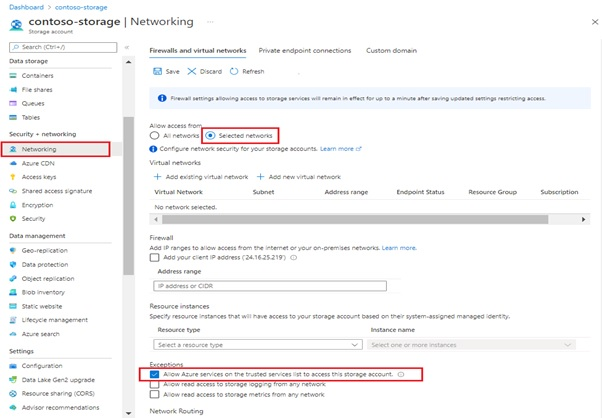 

### 4. Ensure that 'Public access level' is set to Private for blob containers ###

**Security Control Mapping :** 

| Control Number | Control Statement| Security Domain | Default | Associated Runbook |
| ----------------- | --------------- |----------- |----------|-----------|
|  CS0012300 | Cloud products and services must be deployed on private subnets and public access must be disabled for these services | Network Security |Not enabled | None |

**Why?**

Access to the Blob containers which are not required to be accessed by public or anonymous can restrict to private by configure the setting allowBlobPublicAccess as False 
    
**How?** 

This can be achieved while creating the storage account and after the storage account is created. 
**Disabling public Blob Access to new storage account**  
On Advanced tab, unselect 'Enable Blob public access'  
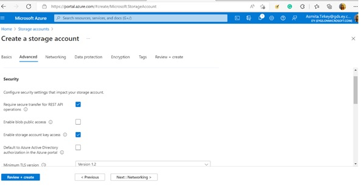 

**Disabling public Blob Access to existing storage account**  
For an existing storage account, Navigate to the configuration by clicking into the storage account and there we can disable the public access level. 
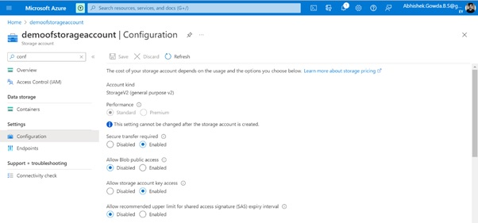 
 

### 5. Ensure Diagnostic logs are enabled for storage account ###

**Security Control Mapping :**

| Control Number | Control Statement | Security Domain | Default | Associated Runbook |
| ----------------- | ---------------|----------- |----------|-----------|
|  	      |  | Security Logging  |Not enabled | None |

**Why?**

Diagnostic logs provides data plane level visibility into blobs, queues, and tables. Enabling security related logs will allow Security operation's to create high fidelity security alert on anomalous activity. 

**How?** 

Step 1: Select the Storage account and navigate to the Diagnostic setting and select the options on and off to enable or disable the logs. 
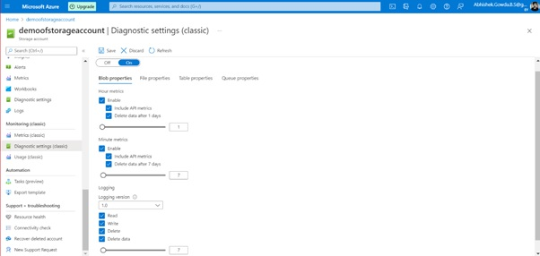 

Step 2: Collect the logs and store in Logs Storage account. Connect splunk app for Microsoft services to the Logs storage account and configure the inputs to extract the logs from Azure storage to Splunk  
[Place holder for link]  
 

### 6. Ensure that least privilege access method is implemented using Role-based access control (RBAC) ###

**Security Control Mapping :**

| Control Number | Control Statement | Security Domain | Default | Associated Runbook |
| ----------------- | --------------- |----------- |----------|-----------|
|  CS0012298	    | Access to change cloud identity access and service control policies is restricted to authorized cloud administrative personnel |  IAM | Not enabled | None |

**Why?**

Role-based access control (RBAC) is method of implementing least privilege access by providing access user and service principle based on job function. Azure has several service specific roles the provides granular access. Using Azure entitlements and the usage pattern custom roles can be developed to implement the granular access to individual user and service principal 

**How?** 

Step 1: Open Azure portal and navigate to ‘Storage Accounts’ under services

Step 2: Create a storage account and provide the Basic Information which required. 

Step 3: Navigate to the created storage account and select ‘Access Control (IAM)’.  
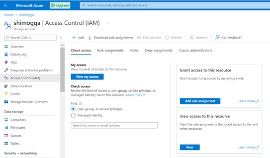  

Step 4:  select ‘Add’ option to include ‘Role Assignment’.  
  

Step 5:  Choose the desire role with Least Privilege access.   
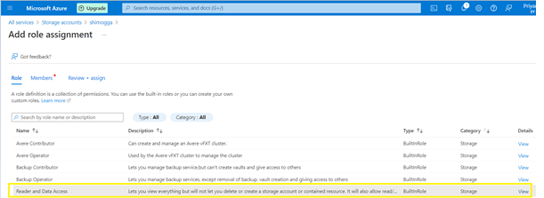 
 
Step 6:  Assign the access to the members by selecting from user/group or from Managed Identity.  
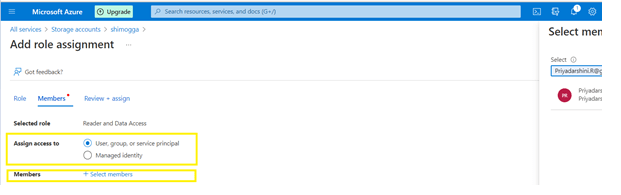  

Step 7:  Once the access control is added successfully., the created role will be listed in the Role assignments tab.  
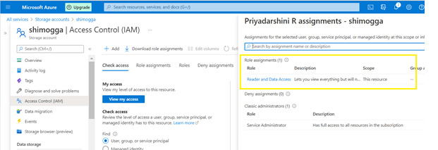  

### 7. Ensure that 'Default to Azure Active Directory authorization in the Azure portal' is set to 'Enabled' ### 

**Security Control Mapping :** 

| Control Number | Control Statement | Security Domain | Default | Associated Runbook |
| ----------------- | --------------- |----------- |----------|-----------|
|   CS0012298	    | Access to change cloud identity access and service control policies is restricted to authorized cloud administrative personnel |  IAM |  Not enabled | None |

**Why?**

Azure Active directory authorizes requests to blobs, queues, and tables with Azure Active Directory by default, which is the recommended approach as advised by Microsoft

**How?**  
This can be achieved while creating the storage account and after the storage account is created. 
**Defaulting to Azure Active Directory authorization when creating storage account**  
When creating the storage account, under the advanced tab , Enable the Default to Azure Active Directory authorization in the Azure portal checkbox 
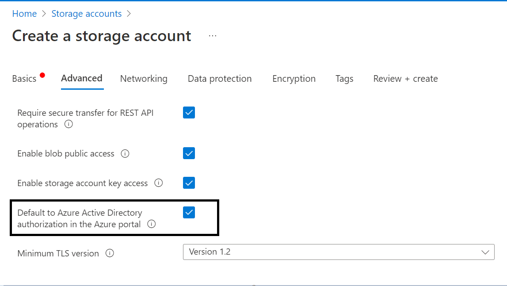 

**Defaulting to Azure Active Directory authorization for existing storage accounts**  
Navigate to an existing Storage Account -> Settings -> Configuration, Select the Enabled button for Default to Azure Active Directory authorization in the Azure portal   
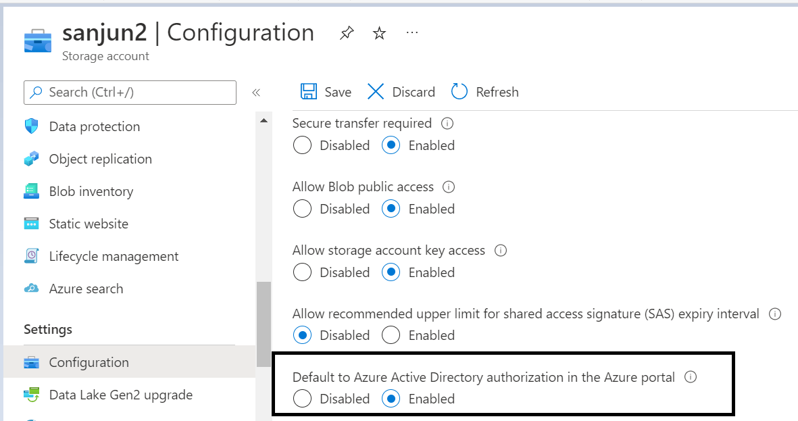 

Note:
The single sign-on configuration is not available for this application in the Enterprise applications experience. Azure Storage is a multi-tenant application and the application is owned by another tenant.

### 8. Ensure that 'Secure transfer required' is set to 'Enabled' ###

**Security Control Mapping :** 

| Control Number | Control Statement | Security Domain | Default | Associated Runbook |
| ----------------- | --------------- |----------- |----------|-----------|
|  CS0012261      | Cloud based data in transit must be encrypted with enterprise approved algorithms | Data Protection | Enabled | None

**Why?**
    
The secure transfer option enhances the security of a storage account by only allowing requests to the storage account by a secure connection. 
For example, when calling REST APIs to access storage accounts, the connection must use HTTPS. Any requests using HTTP will be rejected when 'secure transfer required' is enabled

**How?** 

Step 1: Go to Azure portal, search for Storage account and click on create storage account  
Step 2: Now fill subscription, resource group, storage account name and region under Basics  
Step 3: Now in Advanced section, under security check the box of Require secure transfer for REST API operations.  
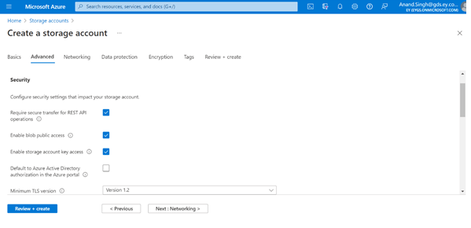 
Step 4: Then fill the networking, encryption and review and create the storage account. 
Step 5: Navigate to the Storage account and on the left  menu, under setting, click on configuration
and check whether the Secure transfer required is enabled or disabled  
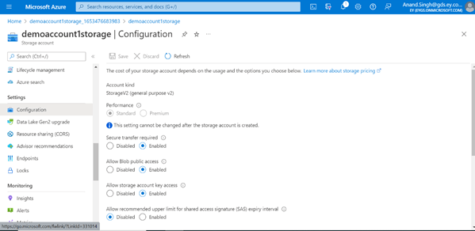  

### 9. Ensure Storage for Critical Data are Encrypted with Customer Managed Keys ###

**Security Control Mapping :** 

| Control Number | Control Statement | Security Domain | Default | Associated Runbook |
| ----------------- | --------------- |----------- |----------|-----------|
|  CS0012168       |Strong encryption key management controls are in place for cloud provider services to protect data at rest | Data Protection  | Not enabled | None |

**Why?**

By default, data in the storage account is encrypted using Microsoft Managed Keys at rest. All Azure Storage resources are encrypted, including blobs, disks, files, queues, and tables. 
All object metadata is also encrypted. However, if you want to control and manage this encryption key yourself, you can specify a customer-managed key, that key is used to protect and control access to the key that encrypts your data. 

**How?** 

Step 1: Open the specific storage account which is created. In the left side bar menu., select Encryption. In the Encryption page., Select the Encryption type as Customer-managed keys.  
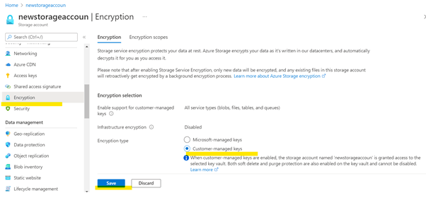  
Step 2: Select the Key and key vault and click on Save.  
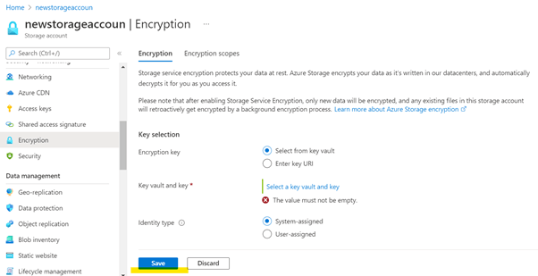  

### 10. Ensure Soft Delete is Enabled for Azure Storage ###

**Security Control Mapping :**  

| Control Number | Control Statement| Security Domain | Default | Associated Runbook |
| ----------------- | --------------- |----------- |----------|-----------|
|         |  |  Data Protection |  Not enabled | None |

**Why?**

Soft Delete must be enabled to recover the data when the blob container or snapshot is accidentally deleted or modified

**How?**  
Step 1: Go to Azure portal: https://portal.azure.com/#home  

Step 2: Click on create a resource and create storage account.  

Step 3: Create resource group and create storage account   

Step 4: Go to “Data protection” tab, select  

•	Enable soft delete for blobs.
•	Enable soft delete for containers.
•	Enable soft delete for file shares.

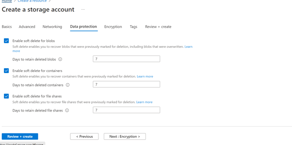  

Step 5: After finishing all setup, click review + create. Storage account will be deployed. 

### 11. Ensure that storage account uses standard organizational Resource tagging method ###

**Security Control Mapping :** 

| Control Number | Control Statement | Security Domain | Default | Associated Runbook |
| ----------------- | --------------- |----------- |----------|-----------|
|        | | Data Protection  | Not enabled | None |

**Why?**

Tagging Storage Accounts will help to identify the logical way to own the resource and group them and also helping to assess their security posture and take action on potential areas of weakness.

**How?**  
Tagging can be achieved while creating the storage account and after the storage account is created. 
**Tagging new storage account**  
Step 1: Open Azure portal and navigate to ‘Storage Accounts’ under services  

Step 2: Create a storage account and provide the Basic Information which required.                                              

Step 3:  Fill the necessary inputs in other tabs based on the requirement.  

Step 4:   While creating the resource, provide the Tag information ‘Name’ and ‘Value’ in Tags option.  
  

**Tagging the existing storage accounts**  
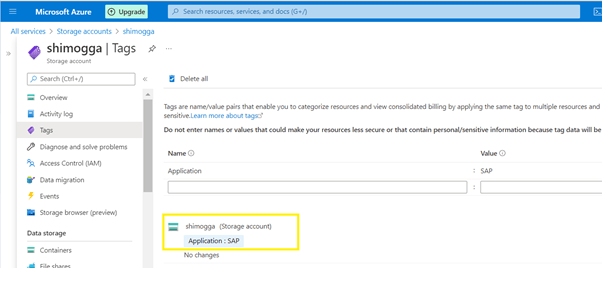  
