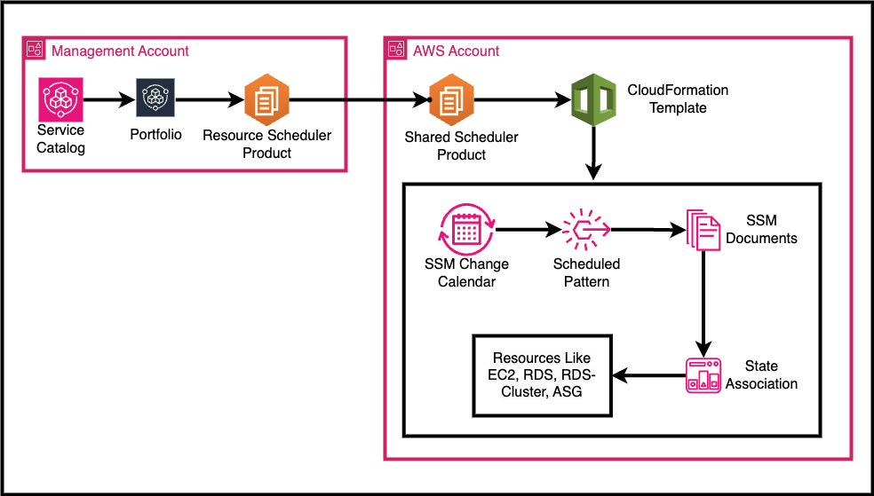
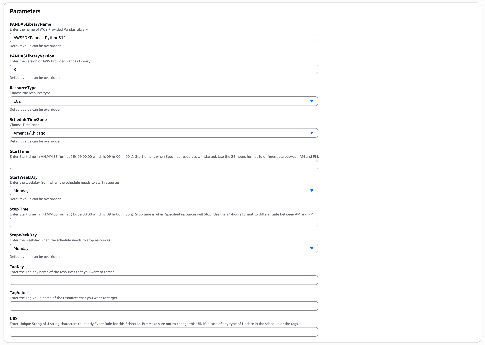
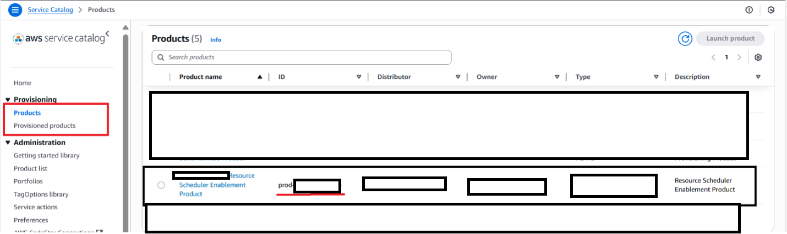
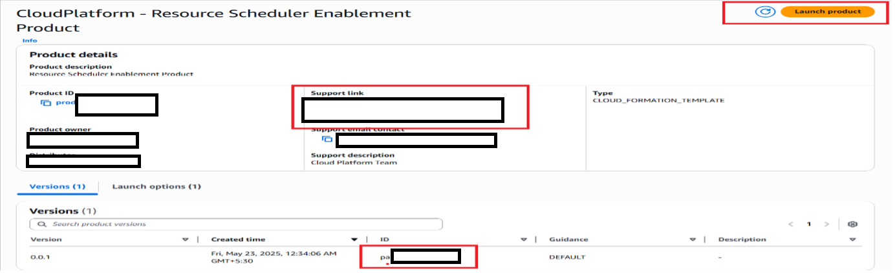
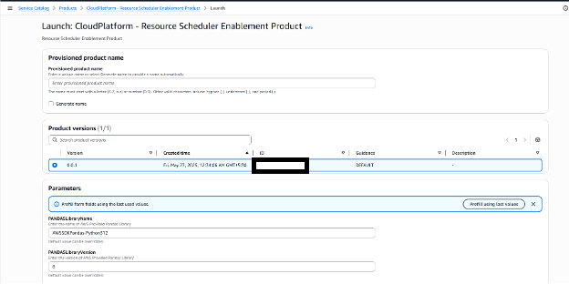
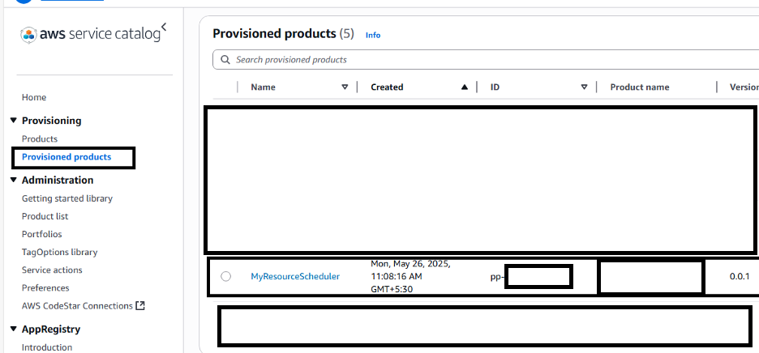
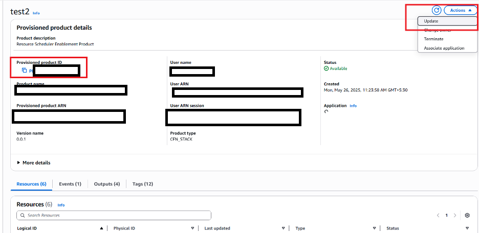

<!-- Space: HIS -->
<!-- Parent: HIS Cloud Platform Architecture & Engineering -->
<!-- Parent: Service Catalog Products -->
<!-- Parent: Products Overview Page -->
<!-- Attachment: assets/resource_scheduler.drawio.png -->
<!-- Attachment: assets/parameters.png -->
<!-- Attachment: assets/image_01.png -->
<!-- Attachment: assets/image_02.png -->
<!-- Attachment: assets/image_03.png -->
<!-- Attachment: assets/image_04.png -->
<!-- Attachment: assets/image_05.png -->

# Resource Scheduler Enablement Product

#### Purpose

The purpose of this document is to provide a detailed overview of Resource Scheduler Solutions. This documentation serves as a reference for developers, system administrators, and stakeholders involved in Solventum, ensuring a clear understanding of the system architecture, processes, and responsibilities.

#### Overview

The Resource Scheduler solution is for Solventum business user for scheduling their resources like EC2, RDS, RDS-Cluster, and ASG to save costs.

#### Objective

The primary objectives of this document are:

* To understand the architecture of the Resource Scheduler
* To understand the usage of the Resource Scheduler Solution.
* To provide detailed information on technicalities.
* To document the process thoroughly for future reference and maintenance.

#### Topology



#### Components

* 1 - Service Catalogue:
    * Resource scheduler products are created on management accounts and are part of a portfolio. And is shared across Child accounts
    * If Solventum business users need a Solution, then they need to launch the shared Resource Scheduler product

* 2 - CloudFormation Template:
    * Once we launch the product, the CF stack will be created
    * CF template created,
        * Change calendar: - Calendar event will be created as per the parameters
        * Event Bridge Rule: Once the Calendar event starts, the Rule will trigger the start resource Association. Once it ends, Rule will trigger the stop resource Association.
        * State Association: - The Association is responsible for starting and stopping the resources.

#### Parameters



1. ResourceType: - Select the Resource type among EC2, RDS, RDS-Cluster, ASG
2. ScheduleTimeZone: - Select the Time zone for the resource to auto start and stop.
3. StartTime: Enter Start time in HH:MM:SS format (Ex 09:00:00 which is 09 hr 00 m 00 s). The start time is when the specified resources will be started. Use the 24-hour format to differentiate between AM and PM.
4. StopTime: Enter Start time in HHMMSS format (Ex, 09:00:00, which is 09 hr 00 m 00 s). Stop time is when specified resources will stop. Use the 24-hour format to differentiate between AM and PM.
5. StartWeekDay: Select the name of the weekday from when the Resource should get started. Note that if today is Monday and if you select Monday, then Next Monday will be considered.
6. StopWeekDay: Select the name of the weekday from when the Resource should stop. Note that if today is Monday and if you select Monday, then Next Monday will be considered.
7. TagKey: Enter the tag key name of the resources which need to be targeted
8. TagValue: Enter the tag key name of the resources which need to be targeted
9. UID: Enter Random strings to identify resources

#### Workflow

1. Solventum Cloud User will get the service catalogue product shared with their account
2. The user needs to launch the product with all the parameters which will deploy all the resources required.
3. Once the systems manager changes the calendar is created, it will include the event which is responsible for the event bridge rule to trigger.
4. Once the event starts, it will trigger the start resource rule and then trigger the start instance association, which will start Resources.
5. Once the event ends, it will trigger the stop resource rule and then trigger the start instance association, which will stop the Resources.

#### Things to Consider:

1. Please note that when creating a schedule, focus on the time intervals during which the resources should be active, rather than when they should be turned off
2. If you want to update the schedule or tag key/value for existing resources, you need to update the provisioned product in the Service Catalogue.
3. If you want to have a different set of schedules for a different set of resources, then please create one more product from the service catalogue
4. You can create multiple products for different schedules.
5. Please make sure to use a different UID for every product you create


#### Scenarios:

1. Need a schedule from MON 9 AM to FRI 5 PM. You would need to create one product
2. Need a schedule from Monday to Friday, and every day, the resources need to be stopped at 5 PM and need to start at 9 AM. Then, you would need to create 5 products with the same tag key and value. (one for Monday's schedule, one for Tuesday’s schedule and so on)
3. If today is Monday and if you select Monday, then Next Monday will be considered

## How to Use

### Approach 1: Launching the Scheduler Product Manually

#### Step 1
Log in to the AWS account as the `jitney-developer` role.  
Choose the region.  
Choose **Service Catalog Service**.

#### Step 2
Go to the **Products** section.



#### Step 3
If **CloudPlatform - Resource Scheduler Enablement Product** is not available,  
then request the CloudPlatform Team for a product share.  
*(For CLI approach, note down the ID, e.g., `prod-****`)*

#### Step 4
Select the product and click **Launch Product**.  
*(For CLI approach, note down the PA ID, e.g., `pa-***`)*



#### Step 5
Give a **unique name** and fill in the parameters.  



#### Step 6
To update any value in products:
- Go to **Provisioned Products**
- Find the product launched above
- Select the product → **Actions** → **Update the parameters



#### Step 7
Wait for the **status** to change to **Green**.



### Approach 2: Launching Scheduler Product via CLI

#### Step 1
Create a `params.json` file (name of your choice) like below.  

```json
[
  {
    "Key": "PANDASLibraryName",
    "Value": "AWSSDKPandas-Python312"
  },
  {
    "Key": "PANDASLibraryVersion",
    "Value": "8"
  },
  {
    "Key": "UID",
    "Value": "test"
  },
  {
    "Key": "StartWeekDay",
    "Value": "Monday"
  },
  {
    "Key": "StopWeekDay",
    "Value": "Tuesday"
  },
  {
    "Key": "ScheduleTimeZone",
    "Value": "America/Chicago"
  },
  {
    "Key": "StartTime",
    "Value": "09:00:00"
  },
  {
    "Key": "StopTime",
    "Value": "17:00:00"
  },
  {
    "Key": "ResourceType",
    "Value": "EC2"
  },
  {
    "Key": "TagKey",
    "Value": "part"
  },
  {
    "Key": "TagValue",
    "Value": "cli"
  }
]
```

#### To Create a Provisioned Product:

* To get the PRODID and PAID, check Approach 1, steps 3 and 4

```bash
aws servicecatalog provision-product \
  --product-id <PRODID> \
  --provisioning-artifact-id <PA ID> \
  --provisioned-product-name <NAME> \
  --provisioning-parameters file://params.json
```

#### To Update a Provisioned Product:

1.	Update the Params.json file with new values

* To get the PRODID and PAID, check Approach 1, steps 3 and 4

```bash
aws servicecatalog update-provisioned-product \
  --product-id <PRODID> \
  --provisioned-product-name <NAME>  \
  --provisioning-artifact-id <PA ID> \
  --provisioning-parameters file://params.json
```

#### To Delete the Product

```bash
aws servicecatalog terminate-provisioned-product --provisioned-product-name <NAME>  
```
